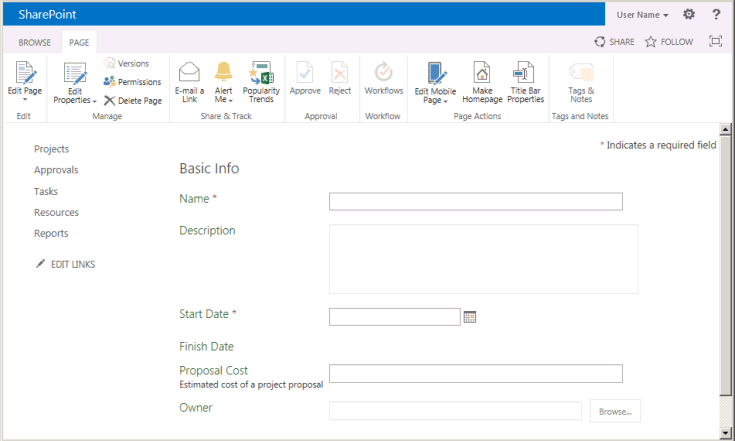
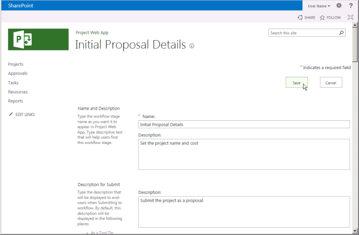
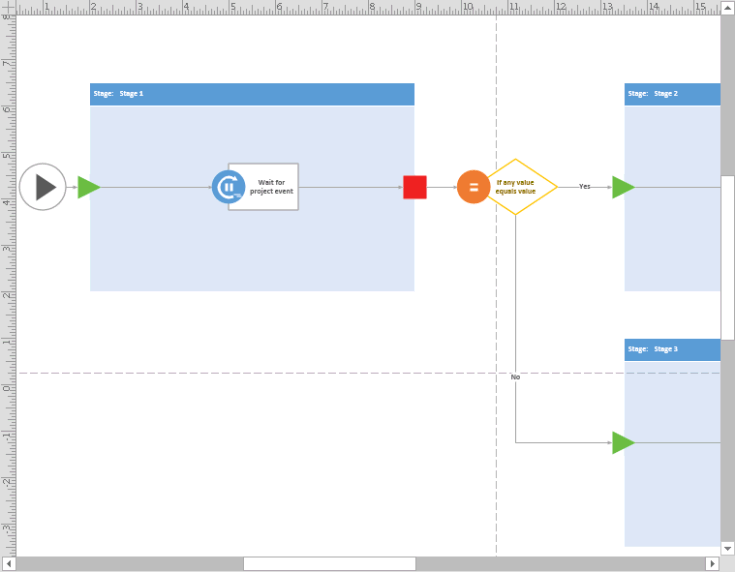

# Создание рабочего процесса Project Server для управления запросамиCreate a Project Server workflow for demand management

В этой статье описывается, как создать простой рабочий процесс с помощью SharePoint Designer 2013.This article describes how to create a simple workflow by using SharePoint Designer 2013. Можно Экспорт рабочего процесса в Visio 2013 визуализации и изменения, или использовать Visio 2013 рабочие процессы проекта Project Server 2013 и импорт разработки в SharePoint Designer 2013 для публикации в Project Web App.You can export the workflow to Visio 2013 for visualization and editing, or use Visio 2013 to design Project Server 2013 workflows and import the design into SharePoint Designer 2013 for publication to Project Web App. Дополнительные сведения о платформе рабочего процесса SharePoint и создание рабочих процессов с помощью SharePoint Designer 2013 и Visio 2013 можно статьи [рабочих процессов в SharePoint 2013](https://msdn.microsoft.com/library/jj163986%28office.15%29.aspx) в документации разработчика SharePoint 2013.For more information about the SharePoint workflow platform and creating workflows with Visio 2013 and SharePoint Designer 2013, see the [Workflows in SharePoint 2013](https://msdn.microsoft.com/library/jj163986%28office.15%29.aspx) articles in the SharePoint 2013 developer documentation. 
  
Сведения о подготовке Project Server для рабочих процессов можно [Запуск: Установка и настройке диспетчера рабочих процессов SharePoint 2013](https://msdn.microsoft.com/library/jj163276%28office.15%29.aspx).For information about preparing Project Server for workflows, see [Start: Set up and configure SharePoint 2013 Workflow Manager](https://msdn.microsoft.com/library/jj163276%28office.15%29.aspx).

## Создание общего рабочего процессаCreating a general workflow

Используйте следующие шаги для создания рабочего процесса Project Server 2013 с помощью SharePoint Designer 2013.Use the following steps to create a Project Server 2013 workflow by using SharePoint Designer 2013. Рабочий процесс предназначен для управления запросами предложений по проекту.The workflow is designed for demand management of project proposals.
  
Подробное описание шагов в разделе [Создание ветвления рабочего процесса](#pj15_CreateWorkflowSPD_Detailed) .For detailed steps, see the [Creating a branching workflow](#pj15_CreateWorkflowSPD_Detailed) section. 
  
### Создание рабочего процесса Project Server (общая процедура)To create a Project Server workflow (general procedure)

1. Определите требования, а затем разработайте рабочий процесс. Организуйте его этапы и стадии, а также определите настраиваемые поля, которые будет использовать этот рабочий процесс.Determine the requirements, and then design the workflow. Organize it into phases and stages, and determine the custom fields that the workflow will use.
    
2. Создайте сущности, требующихся в рабочем процессе в Project Web App.In Project Web App, create the entities that the workflow requires:
    
    1. Просмотрите существующие этапы рабочего процесса; создайте этапы по мере необходимости.Review the existing workflow phases; create phases as necessary.
        
    2. Создайте корпоративные настраиваемые поля, которые будет использовать рабочий процесс. Чтобы настраиваемое поле было доступно в стадии рабочего процесса, оно должно управляться рабочим процессом.Create the enterprise custom fields that the workflow will use. To be available in a workflow stage, a custom field must be controlled by a workflow.
        
    3. Отредактируйте или создайте страницы сведений о проекте (PDP), которые будут использоваться стадиями рабочего процесса для сбора сведений для проекта. В данном примере стадии используют страницы сведений о проекте по умолчанию, которые редактируются, чтобы включить в них новое настраиваемое поле.Edit or create the project detail pages (PDPs) that your workflow stages will use to collect information for the project. In this example, the stages use default PDPs that are edited to include a new custom field.
        
    4. Создайте необходимые стадии рабочего процесса, а затем сопоставьте каждую стадию рабочего процесса с правильным этапом.Create the necessary workflow stages, and then associate each workflow stage with the correct phase.
    
3. В SharePoint Designer 2013 создайте рабочий процесс, используя декларативные инструкции в **текстовый конструктор**:In SharePoint Designer 2013, construct the workflow by using declarative statements in the **Text-Based Designer**:
    
    > [!NOTE]
    > Можно также **Visual Designer** в SharePoint Designer 2013 или импорта существующих рабочих процессов из Visio 2013.You can also switch to the **Visual Designer** in SharePoint Designer 2013, or import an existing workflow from Visio 2013. Выполните следующие действия, чтобы использовать **текстовый конструктор**.Follow these steps to use the **Text-Based Designer**: 
    > 
    > 1. Откройте сайт Project Web App, а затем создайте рабочий процесс сайта, использующего платформу рабочих процессов **Рабочего процесса SharePoint 2013 — Project Server** .Open the Project Web App site, and then create a site workflow that uses the **SharePoint 2013 Workflow - Project Server** workflow platform. 
    > 2. Добавьте стадии, которые будет использовать рабочий процесс.Add the stages that the workflow uses.
    > 3. Вставьте шаги, условия, действия и циклы рабочего процесса, которые требуются в каждой стадии.Insert the workflow steps, conditions, actions, and loops that are required in each stage.
    > 4. Проверьте наличие каких-либо ошибок рабочего процесса и исправьте все найденные ошибки.Check for any workflow errors and fix any that you find.
    > 5. (Необязательно) Переключитесь в представление **Конструктора Visual**или Экспорт рабочего процесса в файл Visio 2013.(Optional) Switch the view to the **Visual Designer**, or export the workflow to a Visio 2013 file. Можно изменить представление Visio и сохранить изменения в текущем рабочий процесс.You can modify the Visio view and save changes to the current workflow. Можно изменить файл Visio и импортировать его в SharePoint 2013 Designer для создания других рабочих процессов.You can edit the Visio file and import it in SharePoint Designer 2013 to create other workflows.
    > 6. Публикация рабочего процесса.Publish the workflow. После публикации, рабочий процесс показывает список рабочих процессов для сайта Project Web App.After it is published, the workflow shows in the list of workflows for the Project Web App site.
    
4. В Project Web App используйте рабочий процесс для управления запросами предложений по проекту.In Project Web App, use the workflow for demand management of project proposals:
    
    1. Создайте шаблон корпоративного проекта (EPT), использующий рабочий процесс.Create an enterprise project template (EPT) that uses the workflow.
        
    2. На странице центра проектов создайте проект, который использует шаблон EPT для рабочего процесса, а затем пройдите по стадиям рабочего процесса.On the Project Center page, create a project that uses the EPT for the workflow, and then follow through the workflow stages.
        
    3. Тщательно протестируйте рабочий процесс.Test the workflow thoroughly.
        
    4. Разверните рабочий процесс на рабочем сервере.Deploy the workflow to a production server.

## Создание ветвящегося рабочего процессаCreating a branching workflow

Прежде чем использовать SharePoint Designer 2013 для создания рабочего процесса Project Server, служба 1.0 клиент диспетчера рабочих процессов должна быть настроена для использования действия рабочего процесса Project Server 2013.Before you can use SharePoint Designer 2013 to create a Project Server workflow, the Workflow Manager Client 1.0 service must be configured to use the Project Server 2013 workflow activities. Сведения о том, как настроить 1.0 клиент диспетчера рабочих процессов, содержатся в статьях [рабочих процессов в SharePoint 2013](https://msdn.microsoft.com/library/jj163986%28office.15%29.aspx) в документации разработчика SharePoint Server 2013.For information about how to configure Workflow Manager Client 1.0, see the [Workflows in SharePoint 2013](https://msdn.microsoft.com/library/jj163986%28office.15%29.aspx) articles in the SharePoint Server 2013 developer documentation. 
  
Следующая процедура подробные включает в себя те же действия, как показано в разделе [Создание общего рабочего процесса](#pj15_CreateWorkflowSPD_General) .The following detailed procedure includes the same steps as in the [Creating a general workflow](#pj15_CreateWorkflowSPD_General) section. 
  
### Создание ветвящегося рабочего процесса Project Server (подробная процедура)To create a Project Server branching workflow (detailed procedure)

#### 1. Планирование и проектирование рабочего процесса.1. Plan and design the workflow.

Рабочий процесс Project Server можно интегрировать с несколькими стадии и этапы процесса управления запросами.A Project Server workflow can integrate with multiple stages and phases in a demand-management process. Так как рабочие процессы могут быть сложными, необходимо ознакомиться с требованиями бизнеса и тщательное планирование рабочего процесса.Because workflows can be complex, you must understand the business requirements and plan a workflow carefully. Простой пример разработки ветвления рабочего процесса, который используется оценочная стоимость предложения по проекту, чтобы определить принятия предложения.For a simple example, design a branching workflow that uses the estimated cost of a project proposal to determine whether the proposal is accepted. Если оценочная стоимость больше, чем 25 000 Долларов США, отклоните предложение; в противном случае принятия предложения и создать проект.If the estimated cost is greater than $25,000 USD, reject the proposal; otherwise, accept the proposal and create the project.
    
Так как Visio 2013 и SharePoint Designer 2013 можно использовать для разработки и создания рабочих процессов для Project Server 2013, можно проще экспериментировать с рабочими процессами сравнению с Project Server 2010.Because you can use Visio 2013 and SharePoint Designer 2013 to help design and create workflows for Project Server 2013, you can more easily experiment with workflows than is possible with Project Server 2010. Пример проекта рабочего процесса в этой статье совпадает со значением статьи [Создание ветвления рабочего процесса](https://msdn.microsoft.com/library/a02cafdc-d881-4271-b446-d8b2cd456a52%28Office.15%29.aspx) в пакет SDK для Project 2010.The sample workflow design in this article is the same as in the [Create a branching workflow](https://msdn.microsoft.com/library/a02cafdc-d881-4271-b446-d8b2cd456a52%28Office.15%29.aspx) article in the Project 2010 SDK. При проектировании и создать рабочий процесс тестирования на удаленном компьютере с помощью тестового экземпляр Project Web App, нет необходимости создавать рабочие процессы непосредственно на компьютере Project Server 2013.You can design and create a test workflow on a remote computer using a test instance of Project Web App—you do not have to create workflows directly on a Project Server 2013 computer. 
    
#### 2. Создание сущностей, которые требуется рабочего процесса.2. Create the entities that your workflow requires.

В Project Web App просмотрите этапы доступные рабочего процесса и этапов и корпоративные настраиваемые поля, которые доступны.In Project Web App, review the available workflow phases and stages, and the enterprise custom fields that are available. При необходимости создайте объекты, которые требуется рабочего процесса, как показано ниже:If necessary, create the entities that your workflow requires, as in the following steps:
    
1. **Этапы рабочего процесса** По умолчанию при установке Project Web App включает в себя создание, выбор, планирование, управление и по завершении этапа.**Workflow phases** The default installation of Project Web App includes the Create, Select, Plan, Manage, and Finished phases. Для ветвления пример рабочего процесса нет необходимости создавать другие этапы.For the branching workflow example, you do not have to create other phases. 
        
2. **Корпоративные настраиваемые поля** Ветвление рабочего процесса требуется project стоимость настраиваемого поля, управляемые рабочими.**Enterprise custom fields** The branching workflow requires a project cost custom field that is workflow-controlled. Настраиваемые поля, управляемые рабочими значение странице сведений о проекте, использующего рабочего процесса.The value of a workflow-controlled custom field is set in a PDP that the workflow uses. Например выберите значок **Параметры** в верхней правой части страницы Project Web App, выберите **Параметры веб-клиента Project**и нажмите кнопку **Корпоративные настраиваемые поля и таблицы подстановки**.For example, choose the **Settings** icon at the top-right of a Project Web App page, choose **PWA Settings**, and then choose **Enterprise Custom Fields and Lookup Tables**.
        
   Создание настраиваемого поля с именем стоимость предложения для сущности **проекта** и выберите тип **затрат**.Create a custom field named Proposal Cost for the **Project** entity, and select the type **Cost**. В поле Описание введите оценка стоимости предложения проекта.For the description, type Estimated cost of a project proposal. В разделе **поведение** выберите **поведение управляется рабочим процессом**.In the **Behavior** section, choose **Behavior controlled by workflow**.
        
3. **Страницы сведений о проекте** Изменение или создание PDP, которые будут использовать стадии рабочего процесса.**Project detail pages** Edit or create the PDPs that the workflow stages will use. Например выполните следующие действия:For example, do the following steps: 
        
    1. На странице параметров сервера выберите **Страницы сведений о проекте**, а затем выберите PDP **ProjectInformation**.Choose **Project Detail Pages** on the Server Settings page, and then choose the **ProjectInformation** PDP. 
            
    2. На вкладке **СТРАНИЦА** ленты в группе **Правка** выберите команду **Изменить страницу**.On the **PAGE** tab of the ribbon, in the **Edit** group, choose **Edit Page**.
            
    3. Нажмите стрелку вниз в верхней правой части **Основные сведения о** веб-части и выберите команду **Изменить веб-части**.Choose the down arrow at the top-right of the **Basic Info** web part, and then choose **Edit web part**. Или на вкладке **Веб-ЧАСТИ** на ленте в группе **Свойства** выберите **Свойства веб-части** для отображения "редактор".Or, on the **WEB PART** tab of the ribbon, in the **Properties** group, choose **web part Properties** to show the editor part. 
            
    4. В разделе **Отображаемые поля проекта** веб-части "Редактор" (см. рисунок 1) выберите **Изменить**.In the **Displayed Project Fields** section of the editor part (see Figure 1), choose **Modify**.
            
    5. Добавить настраиваемое поле **Стоимости предложения** перемещение над полем **владельца** в список **Выбранные поля проекта** затем нажмите **кнопку ОК** (см).Add the **Proposal Cost** custom field, move it above the **Owner** field in the **Selected Project Fields** list, and then choose **OK** (see Figure 1).
      
    6. В веб-части "Редактор" нажмите кнопку **ОК**, а затем на вкладке **СТРАНИЦА** ленты в группе **Правка** нажмите **Stop Editing** (Завершить редактирование). На рисунке 2 показано настраиваемое поле **Proposal Cost**, добавленное на страницу сведений о проекте информации по проекту.In the editor part, choose **OK**, and then choose **Stop Editing** in the **Edit** group, on the **PAGE** tab of the ribbon. Figure 2 shows the **Proposal Cost** custom field that is added to the Project Information PDP. 

    **На рисунке 1. Редактирование веб-части поля проекта странице сведений о проекте****Figure 1. Editing the Project Fields web part in a PDP**

    ![Изменение поля проекта веб-части странице сведений о проекте] (media/pj15_CreateWorkflowSPD_EditPDP.gif "Изменение поля проекта веб-части странице сведений о проекте")

    **Рис. 2. Измененная страница сведений о проекте с настраиваемым полем "Стоимость инициативы"****Figure 2. The edited PDP includes the Proposal Cost custom field**

    ![Измененная страница сведений о Проекте содержит поле стоимости предложения] (media/pj15_CreateWorkflowSPD_EditedPDP.gif "Измененная страница сведений о Проекте содержит поле стоимости предложения")
  
4. **Этапы рабочего процесса** Создание этапов, которые необходимы для каждого этапа рабочего процесса.**Workflow stages** Create the stages that are required for each phase of the workflow. На странице "Параметры сервера" выберите **Стадии рабочего процесса**и нажмите кнопку **Создать СТАДИЮ рабочего ПРОЦЕССА**.On the Server Settings page, choose **Workflow Stages**, and then choose **NEW WORKFLOW STAGE**. На рисунке 3 показана часть на странице Добавление этапа рабочего процесса.Figure 3 shows part of the Add Workflow Stage page.
    
    **Рис. 3. Добавление стадии рабочего процесса в Project Web App****Figure 3. Adding a workflow stage in Project Web App**

    ![Добавление стадии рабочего процесса в Project Web App] (media/pj15_CreateWorkflowSPD_AddWorkflowStage.gif "Добавление стадии рабочего процесса в Project Web App")
  
    Ветвления примере рабочего процесса с помощью четырех этапов, указанных в таблице 1.The branching workflow example uses the four stages that are shown in Table 1. В разделе **Дополнительных параметров для отображаемой страницы сведений о проекте** на странице Добавление этапа рабочего процесса (не показано на рисунке 3) значения являются необязательными. они предоставляют дополнительную информацию на странице состояния рабочего процесса.In the **Additional Settings for the Visible Project Detail Page** section of the Add Workflow Stage page (not shown in Figure 3), values are optional; they provide more information on the Workflow Status page. К примеру так как для начального предложения сведения о странице сведений о Проекте требуется пользователям вводить данные, можно установите флажок **Страница сведений о проекте требуют внимания** и добавьте описание, таких как задать имя проекта и затраты на этой странице сведений о Проекте.For example, because the Initial Proposal Details PDP requires user input, you can select the **The Project Detail Page requires attention** check box, and then add a specific description such as Set the project name and cost for this PDP.
    
    На рисунке 4 показаны четыре стадии, завершенные на странице стадий рабочего процесса.Figure 4 shows the four stages completed on the Workflow Stages page.
    
    **Таблица 1. Стадии для ветвящегося рабочего процесса****Table 1. Stages for the branching workflow**

    |ИмяName|ОписаниеDescription|Описание для отправкиDescription for Submit|ЭтапPhase|Отображаемые PDPVisible PDPs|Настраиваемые поляCustom Fields|
    |:-----|:-----|:-----|:-----|:-----|:-----|
    |Начальные сведения об инициативеInitial Proposal Details    |Установите имя проекта и стоимость.Set the project name and cost.    |Отправьте проект как инициативу.Submit the project as a proposal.    |СозданиеCreate    |Информация по проектуProject Information    Сведения о проектеProject Details    |Стоимость инициативы (обязательно)Proposal Cost (required)    |
    |Сведения о проектеProject Details    |Предоставьте сведения о предложенном проекте.Provide details of the proposed project.    |Отправьте сведения, чтобы продолжить работу с проектом.Submit details to continue with the project.    |СозданиеCreate    |Информация по проектуProject Information    Сведения о проектеProject Details    |Стоимость инициативы (только для чтения)Proposal Cost (read-only)    |
    |Автоматическое отклонениеAutomated Rejection    |Проект отклоняется на основе предоставленной информации.The proposal is rejected, based on the information that is provided.    |   |СозданиеCreate    |Информация по проектуProject Information    |Стоимость инициативы (только для чтения)Proposal Cost (read-only)    |
    |ВыполнениеExecution    |Инициатива принимается и готова для управления проектами.The proposal is accepted, and ready for project management.    |   |УправлениеManage    |Информация по проектуProject Information    Сведения о проектеProject Details    |Стоимость инициативы (только для чтения)Proposal Cost (read-only)    |
   
    **Рис. 4. Список стадий рабочего процесса в Project Web App****Figure 4. List of the workflow stages in Project Web App**

    ![Список этапов рабочего процесса в Project Web App] (media/pj15_CreateWorkflowSPD_WorkflowStages.gif "Список этапов рабочего процесса в Project Web App")
  
#### 3. Создайте рабочий процесс в конструкторе на основе текста.3. Construct the workflow in the Text-Based Designer.

В SharePoint Designer 2013 создания рабочего процесса с помощью декларативных операторов в конструкторе на основе текста.In SharePoint Designer 2013, construct the workflow by using declarative statements in the Text-Based Designer. Началом ввода текста в строке оранжевый вставки получение контекстной автозавершение операторов для логики рабочего процесса и действия, или можно вставить логику и действия с помощью элементов управления в группе **Вставка** на вкладке **рабочего ПРОЦЕССА** на ленте.You can start typing at the orange insertion line to get context-sensitive auto-completion statements for the workflow logic and steps, or you can insert the logic and steps by using controls in the **Insert** group on the **WORKFLOW** tab of the ribbon. 
    
1. Выберите **Открыть узел**в представлении Backstage SharePoint Designer 2013.In the Backstage view of SharePoint Designer 2013, choose **Open Site**. Например, откройте `https://ServerName/pwa`.For example, open  `https://ServerName/pwa`. На левой панели **навигации** выберите **рабочие процессы**.In the **Navigation** pane, choose **Workflows**. На вкладке **рабочие ПРОЦЕССЫ** на ленте в группе **Создать** выберите **Рабочий процесс сайта**.Then, on the **WORKFLOWS** tab of the ribbon, in the **New** group, choose **Site Workflow**. В данном примере имя рабочему процессу ветвление рабочего процесса.For this example, name the workflow Branching Workflow. Убедитесь, что **Рабочий процесс SharePoint 2013 — Project Server** в раскрывающемся списке **Тип платформы** (см).Ensure that **SharePoint 2013 Workflow - Project Server** is selected in the **Platform Type** drop-down list (see Figure 5). 
    
    **Рис. 5. Создание рабочего процесса сайта Project Server****Figure 5. Creating a Project Server site workflow**

    ![Создание рабочего процесса сайта Project Server] (media/pj15_CreateWorkflowSPD_CreateSiteWorkflow.gif "Создание рабочего процесса сайта Project Server")
  
2. Перейдите на вкладку **Ветвящийся рабочий процесс**. Затем на вкладке **РАБОЧИЙ ПРОЦЕСС** ленты в группе **Manage** (Управление) в раскрывающемся списке **Представления** выберите **Текстовый конструктор**. Чтобы отобразить представление с мигающей оранжевой строкой вставки (см. рисунок 6), щелкните мышью где-нибудь внутри представления.Select the **Branching Workflow** tab. Then, on the **WORKFLOW** tab of the ribbon, in the **Manage** group, in the **Views** drop-down list, choose **Text-Based Designer**. To show the view with the blinking orange insertion line (see Figure 6), click within the view.
    
    **Рис. 6. Использование представления текстового конструктора для рабочего процесса****Figure 6. Using the Text-Based Designer view for the workflow**

    ![Использование представления текстового конструктора] (media/pj15_CreateWorkflowSPD_TextBasedDesigner.gif "Использование представления текстового конструктора")
  
3. В представлении **Текстовый конструктор** добавьте стадии, используемые рабочим процессом. На вкладке **РАБОЧИЙ ПРОЦЕСС** ленты в группе **Вставка** в раскрывающемся списке **Стадия** в разделе **Create** (Создание) выберите **Начальные сведения об инициативе**.In the **Text-Based Designer** view, add the stages that the workflow uses. On the **WORKFLOW** tab of the ribbon, in the **Insert** group, in the **Stage** drop-down list under **Create**, choose **Initial Proposal Details**.
    
    Аналогично, поместите оранжевую строку вставки под полем **Stage: Initial Proposal Details** (Стадия: начальные сведения об инициативе) и добавьте другие стадии, используемые рабочим процессом: **Сведения о проекте**, **Автоматическое отклонение** и **Выполнение** (см. рисунок 7).Similarly, place the orange insertion line below the **Stage: Initial Proposal Details** box, and add the other stages that the workflow uses: **Project Details**, **Automated Rejection**, and **Execution** (see Figure 7). 
    
    **Рис. 7. Добавление стадии в рабочий процесс в SharePoint Designer****Figure 7. Adding a stage to a workflow in SharePoint Designer**

    ![Добавление стадии рабочего процесса в SPD] (media/pj15_CreateWorkflowSPD_AddStageInSPD.gif "Добавление стадии рабочего процесса в SPD")
  
4. В каждой стадии добавьте шаги и логику рабочего процесса.Add the workflow steps and logic within each stage: 
    
    1. В стадии **Начальные сведения об инициативе** поместите оранжевую строку вставки вверху области стадии. В группе **Вставка** нажмите **Действие**, прокрутите вниз до раздела **Действия Project Web App** и выберите **Дождаться события проекта**. Нажмите **это событие проекта**, а затем выберите в раскрывающемся списке пункт **Событие: при отправке проекта**.In the **Initial Proposal Details** stage, place the orange insertion line at the top of the stage body. In the **Insert** group on the ribbon, choose **Action**, scroll down to **Project Web App Actions**, and then choose **Wait for Project Event**. Choose **this project event**, and then select **Event: When a project is submitted** in the drop-down list. 
    
    2. В разделе **Переход к стадии** для стадии **Начальные сведения об инициативе** вставьте **Если любое значение равно указанному значению**. Можно начать вводить эту инструкцию или воспользоваться элементом управления **Условие** в группе **Вставка** на ленте.In the **Transition to stage** section of the **Initial Proposal Details** stage, insert **If any value equals value**. You can start typing the statement or use the **Condition** control in the **Insert** group on the ribbon. 
    
    3. Выберите первый элемент управления **value**, а затем выберите **fx**, чтобы отобразить диалоговое окно **Определение подстановки в рабочем процессе** (см. рисунок 8). В раскрывающемся списке **Источник данных** выберите **Данные проекта**. В раскрывающемся списке **Поле из источника** выберите **Стоимость инициативы**.Choose the first **value** control, and then choose **fx** to show the **Define Workflow Lookup** dialog box (see Figure 8). In the **Data source** drop-down list, select **Project Data**. In the **Field from source** drop-down list, select **Proposal Cost**.
    
       **Рис. 8. Определение значения подстановки в рабочем процессе****Figure 8. Defining a lookup value in the workflow**

       ![Определение значения подстановки в рабочем процессе] (media/pj15_CreateWorkflowSPD_DefineWorkflowLookup.gif "Определение значения подстановки в рабочем процессе")
  
    4. Завершить `If` инструкции, чтобы она отображает следующие сведения: **Если стоимость данных: предложения проекта больше, чем 25000**Complete the  `If` statement so that it shows the following: **If Project Data:Proposal Cost is greater than 25000**
    
       > [!NOTE]
       > Вместо этого можно было бы создать переменную рабочего процесса, установить для этой переменной значение настраиваемого поля, а затем сравнивать переменную со значением. Например, в раскрывающемся списке **Локальные переменные** на ленте создайте переменную с именем **TotalCost** (без пробелов) и типом **Number**. В диалоговом окне **Определение подстановки в рабочем процессе** выберите **Переменные и параметры рабочего процесса** для источника данных, а затем выберите **Переменная: TotalCost** в качестве поля. Инструкция **Если** может быть такой: **Если Переменная: TotalCost больше 25000**Alternately, you could create a workflow variable, set the variable to the custom field value, and then compare the variable with a value. For example, from the **Local Variables** drop-down list on the ribbon, create a variable named **TotalCost** (no spaces) of type **Number**. In the **Define Workflow Lookup** dialog box, select **Workflow Variables and Parameters** for the data source, and then select **Variable: TotalCost** as the field. The **If** statement would then be: **If Variable: TotalCost is greater than 25000**
  
    5. Поместите в строке оранжевый вставки в пределах `If` ветвь, а затем **перейдите на стадии** с помощью элемента управления **Действие** , в группе **Вставка** на ленте.Place the orange insertion line within the  `If` branch, and then insert **Go to a stage** by using the **Action** control, in the **Insert** group on the ribbon. Выберите раскрывающийся элемент управления **стадии** и стадию **Автоматического отклонения** .Choose the **a stage** drop-down control and select the **Automated Rejection** stage. 
    
       Аналогично, в `Else` ветвление, вставьте оператор **перейдите к сведений о проекте** .Similarly, in the  `Else` branch, insert the **Go to Project Details** statement. На рисунке 9 показан завершенный стадии **Начальных сведений о предложении** .Figure 9 shows the completed **Initial Proposal Details** stage. 
    
       **Рис. 9. Заполненная логика для стадии "Начальные сведения об инициативе"****Figure 9. Completed logic for the Initial Proposal Details stage**

       ![Логика завершено для начальных сведений о предложении] (media/pj15_CreateWorkflowSPD_InitialStageLogic.gif "Логика завершено для начальных сведений о предложении")
  
    6. Если вы не хотите приостановить рабочий процесс и отобразить некоторые данные на странице сведений о проекте, оставьте первый раздел на стадии **Автоматическое отклонение** пустым. Раздел **Переход к стадии** должен содержать переход; поскольку нет других стадий после отклонения, введите для инструкции Перейти к завершению рабочего процесса.In the **Automated Rejection** stage, unless you want to pause the workflow and show some data in a PDP, leave the first section empty. The **Transition to stage** section must contain a transition; because there is no other stage following a rejection, type Go to End of Workflow for the statement. 
    
    7. На стадии **Сведения о проекте** в разделе **Переход к стадии** введите Перейти к выполнению. Если не требуется добавить дополнительные данные, и вы не хотите приостановить рабочий процесс, то не нужно дожидаться отправленного события.In the **Project Details** stage, add Go to Execution in the **Transition to stage** section. Unless there is additional data to add, or you want to pause the workflow, it is not necessary to wait for a submitted event. 
    
    8. Если вы не хотите приостановить рабочий процесс, на стадии **Выполнение** оставьте раздел действия стадии пустым. В разделе **Переход к стадии** добавьте **Перейти к завершению рабочего процесса**.In the **Execution** stage, unless you want to pause the workflow, leave the stage action section empty. In the **Transition to stage** section, add **Go to End of Workflow**.
    
5. В группе **Сохранить** на ленте нажмите **Check for Errors** (Проверка), чтобы выполнить проверку на наличие ошибок рабочего процесса (см. рисунок 10). Исправьте все ошибки и нажмите **Сохранить**.In the **Save** group on the ribbon, choose **Check for Errors** to check for workflow errors (see Figure 10). Fix any errors, and then choose **Save**.
    
    **Рис. 10. Проверка на наличие ошибок рабочего процесса в SharePoint Designer****Figure 10. Checking the workflow for errors in SharePoint Designer**

    ![Проверка ошибок в рабочем процессе] (media/pj15_CreateWorkflowSPD_SPDCheckForErrors.gif "Проверка ошибок в рабочем процессе")
  
6. (Дополнительно.) В группе **Управление** на ленте в раскрывающемся списке **Представления** выберите **Визуальный конструктор**. На рисунке 11 это представление показано в масштабе 50 %.(Optional) In the **Manage** group on the ribbon, in the **Views** drop-down menu, choose **Visual Designer**. In Figure 11, the view is zoomed out to 50%.
    
    Элементы в рабочем процессе можно изменять с помощью визуального конструктора. Например, выберите условие **Если любое значение равно указанному значению**, нажмите значок инструмента в нижнем левом углу условия, а затем выберите **Значение**, чтобы отобразить условия сравнения в диалоговом окне **Свойства**.You can edit items in the workflow by using the Visual Designer. For example, select the **If any value equals value** condition, choose the tool icon at the bottom-left of the condition, and then select **Value** to show the comparison conditions in the **Properties** dialog box. 
    
    **Рис. 11. Использование визуального конструктора для рабочего процесса****Figure 11. Using the Visual Designer for a workflow**

    ![Использование конструктора Visio рабочего процесса] (media/pj15_CreateWorkflowSPD_SwitchView.gif "Использование конструктора Visio рабочего процесса")
  
    При рабочего процесса в режиме конструктора Visual для сохранения рабочего процесса в Visio 2013 (vsdx (en)-файле для резервного копирования или для более поздней версии использовать, можно **экспортировать в Visio**.When the workflow is in the Visual Designer view, to save the workflow in a Visio 2013 (.vsdx) file as a backup or for later use, you can choose **Export to Visio**.
    
7. Публикация рабочего процесса.Publish the workflow. При публикации рабочего процесса в активной сайта Project Web App с помощью SharePoint Designer 2013 рабочего процесса зарегистрирован на сайт SharePoint или в Azure и становится доступной в Project Web App для нового EPTs.When you use SharePoint Designer 2013 to publish the workflow to the active Project Web App site, the workflow is registered to the SharePoint site or in Azure and becomes available within Project Web App for new EPTs.

#### 4. Создание типа корпоративного проекта для рабочего процесса и затем протестировать рабочий процесс.4. Create an EPT for the workflow, and then test the workflow.

В Project Web App создайте типа корпоративного проекта для рабочего процесса и затем протестировать рабочий процесс, создав предложение проекта:In Project Web App, create an EPT for the workflow, and then test the workflow by creating a project proposal:
    
1. На странице "Параметры веб-клиента Project" выберите **Типы корпоративных проектов**и создайте с именем рабочего процесса ветвление тестового типа корпоративного проекта.On the PWA Settings page, choose **Enterprise Project Types**, and then create an EPT named Test Branching Workflow. Снимите флажок **создавать новые проекты как проектов списка задач SharePoint** , чтобы Project Server будет поддерживать полный доступ проекты, созданные с типом корпоративного проекта.Clear the **Create new projects as SharePoint Tasks List Projects** check box so that Project Server will maintain full control of projects that are created by the EPT. Выберите **Ветвление рабочего процесса** в раскрывающемся списке **Сопоставление рабочего процесса сайта** и выберите в раскрывающемся списке **Страница нового проекта** в качестве первой страницы, которая показывает рабочий процесс **Сведений о проекте** страница сведений о Проекте.Select **Branching Workflow** in the **Site Workflow Association** drop-down list, and then select the **Project Information** PDP in the **New Project Page** drop-down list to be the first page that the workflow shows. 
    
    **Рис. 12. Добавление EPT для рабочего процесса****Figure 12. Adding an EPT for the workflow**

    ![Добавление типа корпоративного проекта для рабочего процесса] (media/pj15_CreateWorkflowSPD_EPTs.gif "Добавление типа корпоративного проекта для рабочего процесса")
  
    > [!NOTE]
    > Значение **Да** в столбце **Проект списка задач SharePoint** таблицы типов корпоративных проектов относится к EPT, который создает список задач SharePoint, причем этот список задач отображается в Project Web App, но SharePoint поддерживает управление этим проектом. Дополнительные сведения об управлении проектами как списками задач SharePoint см. в статье [Project Server 2013 architecture](project-server-2013-architecture.md).A **Yes** value in the **SharePoint Tasks List Project** column in the table of enterprise project types refers to an EPT that creates a SharePoint tasks list, where the tasks list is visible in Project Web App but SharePoint maintains control of the project. For more information about managing projects as SharePoint tasks lists, see [Project Server 2013 architecture](project-server-2013-architecture.md). 
  
2. Откройте страницу проектов в Project Web App и затем создайте проект с помощью нового типа корпоративного проекта (см).Open the Projects page in Project Web App, and then create a project by using the new EPT (see Figure 13). Так как **Рабочий процесс ветвление тестирования** связан с **Ветвление рабочего процесса**, Создание проекта запускается в области Управление рабочего процесса.Because **Test Branching Workflow** is associated with **Branching Workflow**, project creation starts under control of the workflow.
    
    **Рис. 13. Создание проекта с помощью EPT "Тестовый ветвящийся рабочий процесс"****Figure 13. Creating a project with the Test Branching Workflow EPT**

    ![Создание проекта с типом корпоративного проекта] (media/pj15_CreateWorkflowSPD_NewProject.gif "Создание проекта с типом корпоративного проекта")
  
3. При отображении **Сведений о проекте** страница сведений о Проекте рабочего процесса добавьте данные в поля проекта.When the workflow displays the **Project Information** PDP, add data to the project fields. Например введите значение **Стоимости предложения** 30000.For example, enter a **Proposal Cost** value of 30000. Английской версии Project Server, изменяет поля для отображения 30 000 долларов (см).The U.S. English version of Project Server changes the field to show $30,000 (see Figure 14).
    
    **Рис. 14. Использование измененной PDP "Информация по проекту"****Figure 14. Using the edited Project Information PDP**

    ![Использование измененного сведения о Проекте] (media/pj15_CreateWorkflowSPD_NewProjectStage1.gif "Использование измененного сведения о Проекте")
  
4. На вкладке **ПРОЕКТ** ленты в группе **Проект** нажмите **Сохранить**. Project Server добавляет данные со страницы PDP в проект, а затем отображает страницу состояния рабочего процесса (см. рисунок 15). Чтобы увидеть полное описание стадии "Начальные сведения об инициативе" в схеме состояния рабочего процесса, наведите указатель на стадию в схеме визуализации рабочего процесса.On the **PROJECT** tab of the ribbon, in the **Project** group, choose **Save**. Project Server adds the data in the PDP to the project, and then shows the Workflow Status page (see Figure 15). To see the full description of the Initial Proposal Details stage in the workflow status diagram, hover the pointer over the stage in the workflow visualization diagram.
    
    Таблица **Все стадии рабочего процесса** с помощью зеленой стрелки показывает, что стадия начальных сведений об инициативе ожидает ввод. Это объясняется тем, что рабочий процесс ожидает отправку события на стадии начальных сведений об инициативе. Если бы рабочий процесс не ожидал отправку события, можно было бы нажать **Далее** в группе **Страница**, чтобы перейти к следующей PDP.The **All Workflow Stages** grid uses a green arrow to show that the Initial Proposal Details stage is waiting for input. This is because the workflow waits for a submit event in the Initial Proposal Details stage. If the workflow did not wait for a submit event, you could choose **Next** in the **Page** group to advance to the next PDP. 
    
    **Рис. 15. использование страницы состояния рабочего процесса на стадии начальных сведений об инициативе****Figure 15. Using the Workflow Status page in the Initial Proposal Details stage**

    ![Страница состояния рабочего процесса после первой стадии] (media/pj15_CreateWorkflowSPD_NewProjectStage1Status.gif "Страница состояния рабочего процесса после первой стадии")
  
    Схема визуализации рабочего процесса показывает актуальную стадию зеленым цветом. На этапе **создания** актуальной является стадия начальных сведений об инициативе.The workflow visualization diagram shows the current stage in a green color. In the **Create** phase, the Initial Proposal Details stage is the current stage. 
    
5. В группе **Рабочий процесс** на ленте нажмите **Отправить**.On the ribbon, in the **Workflow** group, choose **Submit**.
    
    > [!TIP]
    > Если элемент управления **Отправить** отключен, обновите страницу.If the **Submit** control is disabled, refresh the page. 
  
    Если значение **Стоимость инициативы** превышает 25000 долларов США, то рабочий процесс переходит в стадию автоматического отклонения. На рисунке 16 показано состояние стадии автоматического отклонения, когда снова нажимается кнопка **Отправить**. Если **Стоимость инициативы** не превышает 25000 долларов США, то рабочий процесс переходит в стадию сведений о проекте (см. рисунок 17).If the **Proposal Cost** value is greater than $25,000 USD, the workflow moves to the Automated Rejection stage. Figure 16 shows the Automated Rejection stage status when you choose **Submit** again. If the **Proposal Cost** is $25,000 USD or less, the workflow moves to the Project Details stage (see Figure 17). 
    
    **Рис. 16. Рабочий процесс завершается на стадии автоматического отклонения****Figure 16. The workflow is completed in the Automated Rejection stage**

    ![Рабочий процесс завершается на стадии автоматического отклонения] (media/pj15_CreateWorkflowSPD_AutomatedRejectionCompleted.gif "Рабочий процесс завершается на стадии автоматического отклонения")
  
    На рисунке 17 приведены другого теста с предложении по проекту с именем **Тестирование 2 - ветвление**, где — текущей на этапе создания рабочей области сведений о проекте.Figure 17 shows another test with a project proposal named **Test 2 - Branching**, where the Project Details stage is current in the Create phase. На этапе управления отображается в свете синего цвета, это означает, соответствующего этапа еще не активна.The Manage phase shows in a light blue color, which indicates that phase is not yet active.
    
    **Рис. 17. Рабочий процесс переходит в стадию сведений о проекте, если стоимость ниже $25000****Figure 17. The workflow continues to the Project Details stage if the cost is less than $25,000**

    ![Состояние рабочего процесса на этапе сведений о проекте] (media/pj15_CreateWorkflowSPD_ProjectDetailsStage.gif "Состояние рабочего процесса на этапе сведений о проекте")
  
6. Если вы переходите в стадию сведений о проекте, то на странице по умолчанию не нужно вводить дополнительные данные. Снова нажмите **Отправить**, чтобы перейти в стадию выполнения (см. рисунок 18).If you advance to the Project Details stage, there is no additional data to add in the default page. Choose **Submit** again to advance to the Execution stage (see Figure 18). 
    
    **Рис. 18. Рабочий процесс готов к управлению на стадии выполнения****Figure 18. The workflow is ready to manage in the Execution stage**

    ![Состояние рабочего процесса на стадии выполнения] (media/pj15_CreateWorkflowSPD_ExecutionStage.gif "Состояние рабочего процесса на стадии выполнения")
  
На стадии сведений о проекте рабочий процесс не ожидает отправки события. Если на странице PDP сведений о проекте имеются дополнительные обязательные поля, то Project Server ожидает, пока в эти поля не будут введены данные, прежде чем перейти в стадию выполнения. Как задано в ветвящемся рабочем процессе, в стадии выполнения тоже не ожидается отправка события. В стадии выполнения можно изменить проект в качестве менеджера проектов или нажать **Закрыть** на вкладке **ПРОЕКТ** ленты. Если вы нажимаете **Закрыть**, то позднее можно вернуть проект и изменить его или оставить этот проект извлеченным.In the Project Details stage, the workflow does not wait for a submit event. If the Project Details PDP includes additional required fields, Project Server waits until you add data to the fields before continuing to the Execution stage. As defined in the Branching Workflow, the Execution stage also does not wait for a submit event. In the Execution stage, you can edit the project as a project manager or choose **Close** in the **PROJECT** tab of the ribbon. When you choose **Close**, you can check in the project and edit it later or leave the project checked out.

Проект **Ветвящийся рабочий процесс** представляет простой пример только с одной проверкой сравнением. В рабочем процессе имеется три стадии на этапе создания и одна стадия на этапе управления процесса управления запросами. Чтобы полностью протестировать рабочий процесс, следует проверить все ветви рабочего процесса, используя экстремальные и типичные значения, чтобы убедиться в правильном поведении.The **Branching Workflow** project is a simple example that has only one comparison test. The workflow involves three stages in the Create phase and one stage in the Manage phase of Demand Management. To thoroughly test a workflow, you should test all branches of the workflow and use extreme and typical values to see whether the behavior is as expected. 

## Импорт рабочего процесса из VisioImporting a workflow from Visio

Чтобы изменить рабочий процесс, можно создать или изменить настраиваемые поля, управляемые рабочего процесса и создание и изменение рабочего процесса этапов и стадий.To change the workflow, you can create or modify workflow-controlled custom fields and create or modify workflow phases and stages. Чтобы добавить условия, действия, циклов и этапов и сохранить и повторная публикация рабочего процесса можно использовать SharePoint Designer 2013.You can use SharePoint Designer 2013 to add conditions, actions, loops, and stages, and then save and republish the workflow. Чтобы повторно использовать или сохранить резервную копию рабочего процесса, можно экспортировать в файл Visio 2013.To reuse or keep a backup of a workflow, you can export it to a Visio 2013 file. 
  
Также можно создать или изменение рабочего процесса в Visio 2013 и импортировать файл в SharePoint Designer 2013 для использования с Project Web App.You can also create or edit the workflow in Visio 2013 and import the file into SharePoint Designer 2013 for use by Project Web App. Чтобы использовать рабочего процесса без изменений, экземпляр Project Web App необходимо включить свойства стадии рабочего процесса, которые являются такие же, как в исходном экземпляр Project Web App.To use an unmodified workflow, the Project Web App instance must include workflow stage properties that are the same as those in the original Project Web App instance. Дополнительные сведения об использовании Visio для создания рабочих процессов можно [Разработка рабочих процессов в SharePoint Designer 2013 и Visio 2013](https://msdn.microsoft.com/library/jj163272%28office.15%29.aspx).For more information about using Visio to help create workflows, see [Workflow development in SharePoint Designer 2013 and Visio 2013](https://msdn.microsoft.com/library/jj163272%28office.15%29.aspx).
  
> [!NOTE]
> При импорте файла Visio 2013 другой экземпляр Project Web App, этапы иметь разные стадии идентификаторы GUID, даже в том случае, если имена стадии совпадают с.When you import a Visio 2013 file to a different instance of Project Web App, the stages have different stage GUIDs, even if the stage names are the same. После импорта рабочий процесс необходимо настроить свойства рабочей области, а также действие следует использовать значения, которые специфичны для экземпляра Project Web App.After you import the workflow, you must configure the stage and action properties to use values that are specific to the Project Web App instance. 
> 
> Если вы создаете рабочего процесса в Visio 2013, этапов и действий не имеют свойств, которые специфичны для экземпляра Project Web App, так как Visio не подключаются с Project Web App.If you create a workflow in Visio 2013, the stages and actions have no properties that are specific for a Project Web App instance because Visio does not connect with Project Web App. При подключении SharePoint Designer 2013 с Project Web App, создание рабочего процесса и затем импортировать файл VSDX, перезаписать активных рабочих процессов.When you connect SharePoint Designer 2013 with Project Web App, create a workflow, and then import the VSDX file, you overwrite the active workflow. Затем необходимо настроить свойства рабочей области, а также действие в соответствии с значения, которые получает SharePoint Designer 2013 с Project Web App.You must then configure the stage and action properties to match the values that SharePoint Designer 2013 gets from Project Web App. 
  
### Импорт рабочего процесса из Visio в SharePoint DesignerTo import a workflow from Visio to SharePoint Designer

1. В Visio 2013 создайте простой рабочий процесс.In Visio 2013, create a simple workflow. Например выполните следующие действия:For example, do the following steps:
    
   1. Откройте Visio и создайте рабочий процесс. Выберите область **КАТЕГОРИИ** для нового рабочего процесса, нажмите **Блок-схема**, выберите в области **Создать** шаблон **Рабочий процесс Microsoft SharePoint 2013** и нажмите **Создать**. Рабочий процесс откроется с фигурой Stage с именем **Stage 1**. Рабочий процесс содержит компонент Start и фигуры Enter и Exit как часть фигуры Stage.Open Visio, and then create a workflow. Choose the **CATEGORIES** pane for a new workflow, choose **Flowchart**, choose the **Microsoft SharePoint 2013 Workflow** template in the **New** pane, and then choose **Create**. The workflow opens with a Stage shape named **Stage 1**. The workflow includes a Start component, and an Enter shape and Exit shape as part of the Stage shape.
    
      Когда наведите указатель мыши на стадии фигуру и выберите значок **Свойства** выделение отключено.When you hover over the Stage shape and choose the **Properties** icon, the selection is disabled. Можно задать свойства рабочей области, а также действие после импорта схема рабочего процесса в SharePoint Designer 2013.You can set the stage and action properties after you import the workflow diagram to SharePoint Designer 2013. 
    
      > [!NOTE]
      >  Вы должны использовать только наборы элементов фигуры, которые имеются в списке фигур блок-схемы:The only shape stencils you should use are the following in the list of Flowchart shapes: 
      > - **Действия — рабочий процесс SharePoint 2013****Actions - SharePoint 2013 Workflow**
      > - **Компоненты - рабочих процессов SharePoint 2013****Components - SharePoint 2013 Workflow**
      > - **Условия - рабочих процессов SharePoint 2013****Conditions - SharePoint 2013 Workflow**
  
   2. В области **фигур** нажмите **Экспресс-фигуры**, а затем перетащите фигуру Condition с именем **Если любое значение равно указанному значению** справа от фигуры Stage.In the **Shapes** pane, choose **Quick Shapes**, and then drag the Condition shape named **If any value equals value** to the right of the Stage shape. 
    
   3. На вкладке **ГЛАВНАЯ** ленты выберите инструмент **Соединитель**, а затем соедините фигуру Exit в стадии с фигурой Condition (см. рисунок 19).On the **HOME** tab of the ribbon, choose the **Connector** tool, and then connect the Exit shape on the stage with the Condition shape (see Figure 19). 
    
      **Рис. 19. Соединение фигур Stage и Condition в схеме рабочего процесса Visio****Figure 19. Connecting a Stage shape with a Condition shape in a Visio workflow diagram**

      ![Создание схемы рабочего процесса в Visio] (media/pj15_CreateWorkflowSPD_NewVisioWorkflow.gif "Создание схемы рабочего процесса в Visio")
  
   4. Перетащите еще две фигуры Stage справа от фигуры условия. Эти фигуры называются **Stage 2** и **Stage 3**.Drag two more Stage shapes to the right of the condition shape. The shapes are named **Stage 2** and **Stage 3**.
    
   5. В правой части Фигура условия при помощи **соединительной** , подключения к фигуры ввод **Этап**2.Using the **Connector** tool, connect the right side of the Condition shape to the Enter shape of **Stage 2**. Выбор средств **указатель** , дважды щелкните значок подключения для отображения текстового поля в поле имя и измените имя подключения Да.Choose the **Pointer** tool, double-click the connection to show a textbox for the name, and then name the connection Yes.
    
   6. Соедините нижнюю часть фигуры Condition с фигурой Enter в фигуре **Stage 3**. Используя инструмент **Указатель**, щелкните правой кнопкой это соединение и выберите **Нет**. Чтобы дать соединителям имя **Да** или **Нет**, сработает любой из этих способов.Connect the bottom of the Condition shape to the Enter shape of **Stage 3**. With the **Pointer** tool, right-click the connection, and then choose **No**. Either method works for naming the connectors **Yes** or **No**.
    
   7. В области **фигуры** выберите **действия - рабочих процессов SharePoint 2013**, а затем перетащите действие **Ожидание события проекта** в середину фигуры для **Этап 1** (см. на рисунке 20).In the **Shapes** pane, choose **Actions - SharePoint 2013 Workflow**, and then drag the **Wait for project event** action to the middle of the shape for **Stage 1** (see Figure 20). 
    
      **Рис. 20. Оформление рабочего процесса в Visio****Figure 20. Completing the workflow in Visio**

      ![Выполнение рабочего процесса в Visio] (media/pj15_CreateWorkflowSPD_CompletedVisioWorkflow.gif "Выполнение рабочего процесса в Visio")
  
   8. На вкладке **процесс** на ленте в группе **Проверка диаграммы** выберите **Проверить схему**.On the **PROCESS** tab of the ribbon, in the **Diagram Validation** group, choose **Check Diagram**. Устраните все ошибки, а затем сохраните документ.Fix any errors, and then save the drawing. Например имя рабочего процесса тестового файла из Visio.vsdx.For example, name the file Test workflow from Visio.vsdx.
    
      Сведения об устранении ошибок рабочих процессов отображаются [ошибки проверки рабочего процесса устранения неполадок SharePoint Server 2013 в Visio 2013](https://msdn.microsoft.com/library/jj163971%28v=office.15%29.aspx).For information about fixing workflow errors, see [Troubleshooting SharePoint Server 2013 workflow validation errors in Visio 2013](https://msdn.microsoft.com/library/jj163971%28v=office.15%29.aspx).
    
2. Откройте SharePoint Designer 2013 и откройте же сайт Project Web App, который использовался для примера **Ветвление рабочего процесса** .Open SharePoint Designer 2013, and then open the same Project Web App site that you used for the **Branching Workflow** example. 
    
3. В области **навигации** выберите **рабочие процессы** , а затем создать рабочий процесс сайта (Выбор **Рабочего процесса сайта** на вкладке **рабочие ПРОЦЕССЫ** на ленте).Choose **Workflows** in the **Navigation** pane, and then create a site workflow (choose **Site Workflow** on the **WORKFLOWS** tab of the ribbon). Например имя рабочего процесса простого рабочего процесса из Visio.For example, name the workflow Simple workflow from Visio.
    
   В диалоговом окне **Создать рабочий процесс сайта** убедитесь, что тип платформы **Рабочего процесса SharePoint 2013 — Project Server**.In the **Create Site Workflow** dialog box, ensure that the platform type is **SharePoint 2013 Workflow - Project Server**. Выберите команду **Создать**, и откроется область **текстового конструктора** для нового рабочего процесса SharePoint Designer.Choose **Create**, and SharePoint Designer opens the **Text-Based Designer** pane for the new workflow. 
    
4. В группе **Управление** на вкладке **РАБОЧИЙ ПРОЦЕСС** ленты нажмите **Параметры рабочего процесса**.In the **Manage** group on the **WORKFLOW** tab of the ribbon, choose **Workflow Settings**.
    
5. В группе **Управление** на вкладке **Параметры рабочих ПРОЦЕССОВ** на ленте выберите **Импорт из Visio**и затем импортировать файл **тестового рабочего процесса из Visio.vsdx** , который ранее был сохранен.In the **Manage** group on the **WORKFLOW SETTINGS** tab of the ribbon, choose **Import from Visio**, and then import the **Test workflow from Visio.vsdx** file that you previously saved. Диалоговое окно **Microsoft SharePoint Designer** предупреждение о том, что схема импортируемого содержит свойства не рабочего процесса и вопросом, следует ли перезаписывать текущего рабочего процесса.A **Microsoft SharePoint Designer** dialog box warns that the diagram you are importing contains no workflow properties, and asks whether to overwrite the current workflow. Нажмите кнопку **Да**. SharePoint Designer импортируется схема рабочего процесса, создает наборы элементов для фигур и отображается область **Визуальный конструктор** , который содержит импортированного рабочего процесса.Choose **Yes**; SharePoint Designer imports the workflow diagram, generates stencils for the shapes, and displays the **Visual Designer** pane that contains the imported workflow. 
    
6. Установка свойств для каждой рабочей области фигуры в рабочем процессе.Set the properties of each stage shape in the workflow. К примеру первую фигуру рабочей области называется **Этап 1 (недопустимый)**, так как он не представляет допустимое стадией подключенного экземпляра Project Web App.For example, the first stage shape is named **Stage 1 (Invalid)**, because it does not represent a valid stage in the connected Project Web App instance. При выборе или наведите указатель мыши на сцене можно выбрать значок **Свойства** в нижнем левом фигуры рабочей области, чтобы показать диалоговое окно **Свойств стадии** поле (см. на рисунке 21).When you select or hover over the stage, you can choose the **Properties** icon at the lower left of the stage shape to show the **Stage Properties** dialog box (see Figure 21). Выберите стадии **Начальных сведений о предложении** в раскрывающемся списке **Рабочей области проекта** и нажмите кнопку **ОК**.Select the **Initial Proposal Details** stage in the **Project Stage** drop-down list, and then choose **OK**. SharePoint Designer переименовывает рабочей области.SharePoint Designer renames the stage.
    
   **Рис. 21. Установка свойства стадии в SharePoint Designer****Figure 21. Setting the stage property in SharePoint Designer**

   ![Установка свойств в импортированном рабочем процессе] (media/pj15_CreateWorkflowSPD_ImportFromVisio1.gif "Установка свойств в импортированном рабочем процессе")
  
   Для второй стадии установите свойство **Стадия проекта** в значение **Автоматическое отклонение**. Для третьей стадии установите свойство **Стадия проекта** в значение **Выполнение**.For the second stage, set the **Project Stage** property to **Automated Rejection**. For the third stage, set the **Project Stage** property to **Execution**.
    
7. Аналогично, для действия **Дождаться события проекта** установите свойство **Имя события** в значение **Событие: при отправке проекта**.Similarly, for the **Wait for project event** action, set the **Event Name** property to **Event: When a project is submitted**.
    
8. Аналогично свойства condition **Если любое значение равно указанному значению** .Similarly, set the properties of the **If any value equals value** condition. Например значение **Стоимости данных: предложения Project**первого свойства **Value** .For example, set the first **Value** property to **Project Data:Proposal Cost**. Присвойте свойству **оператор** **— меньше, чем**.Set the **Operator** property to **is less than**. Присвойте свойству второе **значение** на 5000.Set the second **Value** property to 5000.
    
9. Проверьте рабочий процесс на наличие ошибок, а затем сохраните его. Если ошибки отсутствуют, можно изменить представление на **Текстовый конструктор** (см. рисунок 22).Check the workflow for errors, and then save the workflow. If there are no errors, you can change the view to the **Text-Based Designer** (see Figure 22). 
    
   **Рис. 22. Просмотр импортированного рабочего процесса в текстовом конструкторе****Figure 22. Viewing the imported workflow in the Text-Based Designer**

   ![Просмотр импортированного рабочего процесса] (media/pj15_CreateWorkflowSPD_WorkflowFromVisio.gif "Просмотр импортированного рабочего процесса")
  
10. Опубликуйте рабочий процесс. Если сохранить рабочий процесс, но не опубликовать его, то он не будет доступен при создании типа корпоративного проекта.Publish the workflow. If you save the workflow but do not publish it, the workflow will not be available when you create an enterprise project type.
    
11. Чтобы проверить импортированные **простого рабочего процесса из Visio** в Project Web App, создание типа корпоративного проекта, который использует рабочего процесса и создайте проекты, использующие нового типа корпоративного проекта, как это делалось для примера **Ветвление рабочего процесса** .To test the imported **Simple workflow from Visio** in Project Web App, create an EPT that uses the workflow, and then create projects that use the new EPT as you did for the **Branching Workflow** example. В этом случае тем не менее, проекты, которые меньше, чем стоимость 5000 отклоняются.In this case, however, projects that are less than $5,000 cost are rejected. 
    
При работе в этой статье была создана и проверен простой рабочий процесс ветвления с помощью SharePoint Designer 2013 для непосредственно стадий, условия и действия, которые использует рабочего процесса.In working through this article, you created and tested a simple branching workflow by using SharePoint Designer 2013 to directly set the stages, conditions, and actions that the workflow uses. Схема для ветвления рабочего процесса еще проще также создавать с помощью Visio 2013.You also created a diagram for an even simpler branching workflow by using Visio 2013. Импортировать схемы Visio рабочего процесса в SharePoint Designer 2013, где установка свойств для каждой рабочей области, условие и действие из соединения с Project Web App.You imported the Visio workflow diagram into SharePoint Designer 2013, where you set the properties of each stage, condition, and action from the connection with Project Web App.
  
Visio 2013 и SharePoint Designer совместно предоставляют удобные средства для конструкторов, руководители проектов, разработчики рабочих процессов и инженеров-испытателей, для создания, совместного использования и настройки рабочего процесса разработки для различных установок Project Server 2013 и Project Online.Visio 2013 and SharePoint Designer together provide convenient ways for designers, project managers, workflow developers, and testers to create, share, and customize workflow designs for different installations of Project Server 2013 and Project Online. Для рабочих процессов, которые требуют программный доступ к Project Server, SharePoint Designer не предоставляет можно использовать Visual Studio 2012 с клиентской объектной модели (CSOM).For workflows that require programmatic access to Project Server that SharePoint Designer does not provide, you can use Visual Studio 2012 with the client-side object model (CSOM).
  
## См. такжеSee also

- [Project Server 2013 architectureProject Server 2013 architecture](project-server-2013-architecture.md)
- [Руководство по установке и настройке диспетчера рабочих процессов SharePoint 2013Start: Set up and configure SharePoint 2013 Workflow Manager](https://msdn.microsoft.com/library/jj163276%28office.15%29.aspx)
- [Общие сведения об упаковке и развертывании рабочего процесса в SharePoint 2013Understanding how to package and deploy workflow in SharePoint 2013](https://msdn.microsoft.com/library/jj819316%28office.15%29.aspx)
- [Рабочие процессы в SharePoint 2013Workflows in SharePoint 2013](https://msdn.microsoft.com/library/jj163986%28office.15%29.aspx)
- [Workflow development in SharePoint Designer 2013 and Visio 2013Workflow development in SharePoint Designer 2013 and Visio 2013](https://msdn.microsoft.com/library/jj163272%28office.15%29.aspx)
- [Диагностика ошибок проверки рабочих процессов SharePoint Server 2013 в Visio 2013Troubleshooting SharePoint Server 2013 workflow validation errors in Visio 2013](https://msdn.microsoft.com/library/jj163971%28v=office.15%29.aspx)
- [Управление запросами и рабочий процессWorkflow and Demand Management](https://msdn.microsoft.com/library/cf7433a3-a531-4467-ac0c-df0c5d6881ae%28Office.15%29.aspx)

