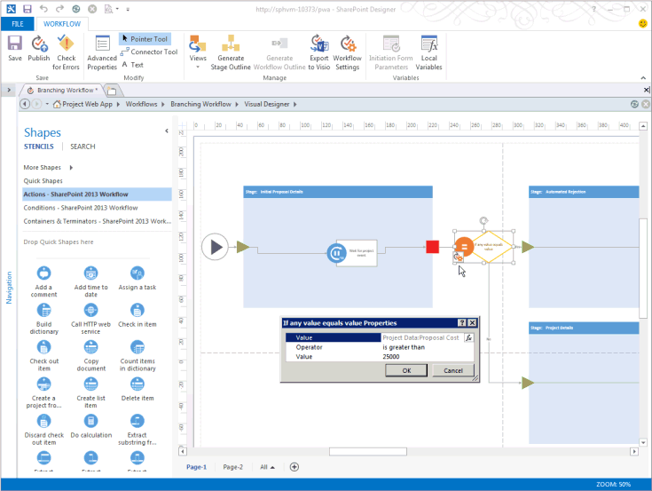

# Создание рабочего процесса Project Server для управления запросамиCreate a Project Server workflow for demand management

В этой статье описывается создание простого рабочего процесса с помощью SharePoint Designer 2013.This article describes how to create a simple workflow by using SharePoint Designer 2013. Вы можете экспортировать рабочий процесс в Visio 2013 г. для визуализации и редактирования или использовать Visio 2013 г. для разработки Project Server 2013 и импорта дизайна в SharePoint Designer 2013 для публикации в Project Web App.You can export the workflow to Visio 2013 for visualization and editing, or use Visio 2013 to design Project Server 2013 workflows and import the design into SharePoint Designer 2013 for publication to Project Web App. Дополнительные сведения о платформе рабочих процессов SharePoint и создании рабочих процессов с Visio 2013 и SharePoint Designer 2013 см. в статьях [workflows in SharePoint 2013](https://msdn.microsoft.com/library/jj163986%28office.15%29.aspx) в документации разработчика SharePoint 2013 г.For more information about the SharePoint workflow platform and creating workflows with Visio 2013 and SharePoint Designer 2013, see the [Workflows in SharePoint 2013](https://msdn.microsoft.com/library/jj163986%28office.15%29.aspx) articles in the SharePoint 2013 developer documentation. 
  
Сведения о подготовке Project Server для рабочего процесса см. в SharePoint [2013](https://msdn.microsoft.com/library/jj163276%28office.15%29.aspx)Workflow Manager.For information about preparing Project Server for workflows, see [Start: Set up and configure SharePoint 2013 Workflow Manager](https://msdn.microsoft.com/library/jj163276%28office.15%29.aspx).

## Создание общего рабочего процессаCreating a general workflow

Используйте следующие действия для создания рабочего процесса Project Server 2013 с помощью SharePoint Designer 2013.Use the following steps to create a Project Server 2013 workflow by using SharePoint Designer 2013. Рабочий процесс разрабатывается для управления запросами проектных инициатив.The workflow is designed for demand management of project proposals.
  
Подробные действия см. в [разделе Создание ветвного рабочего процесса.](#pj15_CreateWorkflowSPD_Detailed)For detailed steps, see the [Creating a branching workflow](#pj15_CreateWorkflowSPD_Detailed) section. 
  
### Создание рабочего процесса Project Server (общая процедура)To create a Project Server workflow (general procedure)

1. Определите требования, а затем разработайте рабочий процесс. Организуйте его этапы и стадии, а также определите настраиваемые поля, которые будет использовать этот рабочий процесс.Determine the requirements, and then design the workflow. Organize it into phases and stages, and determine the custom fields that the workflow will use.
    
2. В Project Web App создайте сущностями, которые требуются для рабочего процесса:In Project Web App, create the entities that the workflow requires:
    
    1. Просмотрите существующие этапы рабочего процесса; создайте этапы по мере необходимости.Review the existing workflow phases; create phases as necessary.
        
    2. Создайте корпоративные настраиваемые поля, которые будет использовать рабочий процесс. Чтобы настраиваемое поле было доступно в стадии рабочего процесса, оно должно управляться рабочим процессом.Create the enterprise custom fields that the workflow will use. To be available in a workflow stage, a custom field must be controlled by a workflow.
        
    3. Отредактируйте или создайте страницы сведений о проекте (PDP), которые будут использоваться стадиями рабочего процесса для сбора сведений для проекта. В данном примере стадии используют страницы сведений о проекте по умолчанию, которые редактируются, чтобы включить в них новое настраиваемое поле.Edit or create the project detail pages (PDPs) that your workflow stages will use to collect information for the project. In this example, the stages use default PDPs that are edited to include a new custom field.
        
    4. Создайте необходимые стадии рабочего процесса, а затем сопоставьте каждую стадию рабочего процесса с правильным этапом.Create the necessary workflow stages, and then associate each workflow stage with the correct phase.
    
3. В SharePoint Designer 2013 построй рабочий процесс с помощью декларативных заявлений в конструкторе на основе **текста:**In SharePoint Designer 2013, construct the workflow by using declarative statements in the **Text-Based Designer**:
    
    > [!NOTE]
    > Вы также можете перейти на Visual **Designer** в SharePoint Designer 2013 или импортировать существующий рабочий процесс из Visio 2013.You can also switch to the **Visual Designer** in SharePoint Designer 2013, or import an existing workflow from Visio 2013. Чтобы воспользоваться **текстовым конструктором**, выполните следующие действия.Follow these steps to use the **Text-Based Designer**: 
    > 
    > 1. Откройте сайт Project Web App, а затем создайте рабочий процесс сайта, использующий рабочий **процесс SharePoint 2013** г. — Project server.Open the Project Web App site, and then create a site workflow that uses the **SharePoint 2013 Workflow - Project Server** workflow platform. 
    > 2. Добавьте стадии, которые будет использовать рабочий процесс.Add the stages that the workflow uses.
    > 3. Вставьте шаги, условия, действия и циклы рабочего процесса, которые требуются в каждой стадии.Insert the workflow steps, conditions, actions, and loops that are required in each stage.
    > 4. Проверьте наличие каких-либо ошибок рабочего процесса и исправьте все найденные ошибки.Check for any workflow errors and fix any that you find.
    > 5. (Необязательный) Переключить представление на **Visual Designer** или экспортировать рабочий процесс в файл Visio 2013 г.(Optional) Switch the view to the **Visual Designer**, or export the workflow to a Visio 2013 file. Можно изменить представление Visio сохранить изменения текущего рабочего процесса.You can modify the Visio view and save changes to the current workflow. Вы можете изменить файл Visio и импортировать его в SharePoint Designer 2013 для создания других рабочих процессов.You can edit the Visio file and import it in SharePoint Designer 2013 to create other workflows.
    > 6. Опубликуйте рабочий процесс.Publish the workflow. После публикации рабочий процесс показывается в списке процессов для Project Web App сайта.After it is published, the workflow shows in the list of workflows for the Project Web App site.
    
4. В Project Web App используйте рабочий процесс для управления запросами предложений проектов:In Project Web App, use the workflow for demand management of project proposals:
    
    1. Создайте шаблон корпоративного проекта (EPT), использующий рабочий процесс.Create an enterprise project template (EPT) that uses the workflow.
        
    2. На странице центра проектов создайте проект, который использует шаблон EPT для рабочего процесса, а затем пройдите по стадиям рабочего процесса.On the Project Center page, create a project that uses the EPT for the workflow, and then follow through the workflow stages.
        
    3. Тщательно протестируйте рабочий процесс.Test the workflow thoroughly.
        
    4. Разверните рабочий процесс на рабочем сервере.Deploy the workflow to a production server.

## Создание ветвящегося рабочего процессаCreating a branching workflow

Прежде чем использовать SharePoint Designer 2013 для создания рабочего процесса Project Server, необходимо настроить службу Workflow Manager Client 1.0 для использования рабочих процессов Project Server 2013.Before you can use SharePoint Designer 2013 to create a Project Server workflow, the Workflow Manager Client 1.0 service must be configured to use the Project Server 2013 workflow activities. Сведения о настройке Workflow Manager 1.0 см. в статьях [workflows in SharePoint 2013](https://msdn.microsoft.com/library/jj163986%28office.15%29.aspx) г. в документации разработчика SharePoint Server 2013.For information about how to configure Workflow Manager Client 1.0, see the [Workflows in SharePoint 2013](https://msdn.microsoft.com/library/jj163986%28office.15%29.aspx) articles in the SharePoint Server 2013 developer documentation. 
  
Следующая подробная процедура включает те же действия, что и в разделе [Создание общего рабочего процесса.](#pj15_CreateWorkflowSPD_General)The following detailed procedure includes the same steps as in the [Creating a general workflow](#pj15_CreateWorkflowSPD_General) section. 
  
### Создание ветвящегося рабочего процесса Project Server (подробная процедура)To create a Project Server branching workflow (detailed procedure)

#### 1. Планирование и проектирование рабочего процесса.1. Plan and design the workflow.

Рабочий процесс Project Server может интегрироваться с несколькими стадиями и этапами в процессе управления запросами.A Project Server workflow can integrate with multiple stages and phases in a demand-management process. Поскольку рабочие процессы могут быть сложными, необходимо понимать бизнес-требования и тщательно планировать рабочий процесс.Because workflows can be complex, you must understand the business requirements and plan a workflow carefully. В качестве простого примера сконструируйте рабочий процесс, который использует оценочную стоимость проектной инициативы, чтобы определить, принимается ли эта инициатива.For a simple example, design a branching workflow that uses the estimated cost of a project proposal to determine whether the proposal is accepted. Если оценочная стоимость больше 25 000 долларов США, инициатива отклоняется; в противном случае инициатива принимается, и проект создается.If the estimated cost is greater than $25,000 USD, reject the proposal; otherwise, accept the proposal and create the project.
    
Так как вы можете использовать Visio 2013 и SharePoint Designer 2013 для разработки и создания рабочих процессов для Project Server 2013, вы можете более легко экспериментировать с рабочими процессами, чем это возможно с Project Server 2010.Because you can use Visio 2013 and SharePoint Designer 2013 to help design and create workflows for Project Server 2013, you can more easily experiment with workflows than is possible with Project Server 2010. Пример разработки рабочего процесса в этой статье такой же, как в статье [Создание](https://msdn.microsoft.com/library/a02cafdc-d881-4271-b446-d8b2cd456a52%28Office.15%29.aspx) ветвного рабочего процесса в Project 2010 SDK.The sample workflow design in this article is the same as in the [Create a branching workflow](https://msdn.microsoft.com/library/a02cafdc-d881-4271-b446-d8b2cd456a52%28Office.15%29.aspx) article in the Project 2010 SDK. Вы можете разработать и создать тестовый рабочий процесс на удаленном компьютере с помощью тестового экземпляра Project Web App— вам не нужно создавать рабочие процессы непосредственно на компьютере Project Server 2013.You can design and create a test workflow on a remote computer using a test instance of Project Web App—you do not have to create workflows directly on a Project Server 2013 computer. 
    
#### 2. Создание сущностями, которые требуются вашему рабочего процесса.2. Create the entities that your workflow requires.

В Project Web App просмотрите доступные этапы и этапы рабочего процесса и доступные корпоративные настраиваемые поля.In Project Web App, review the available workflow phases and stages, and the enterprise custom fields that are available. При необходимости создайте сущности, которые требуются вашему рабочему процессу, как показано в следующих действиях.If necessary, create the entities that your workflow requires, as in the following steps:
    
1. **Этапы рабочего процесса** По умолчанию установка Project Web App включает этапы Create, Select, Plan, Manage и Finished.**Workflow phases** The default installation of Project Web App includes the Create, Select, Plan, Manage, and Finished phases. В примере с ветвящимся рабочим процессом другие этапы создавать не требуется.For the branching workflow example, you do not have to create other phases. 
        
2. **Enterprise настраиваемые поля** Рабочий процесс ветвей требует настраиваемого поля затрат проекта, которое контролируется рабочий процессом.**Enterprise custom fields** The branching workflow requires a project cost custom field that is workflow-controlled. Значение управляемого рабочим процессом настраиваемого поля устанавливается на странице сведений о проекте, которая используется рабочим процессом.The value of a workflow-controlled custom field is set in a PDP that the workflow uses. Например, выберите значок **Параметры** вверху справа от страницы Project Web App, выберите **PWA Параметры,** а затем выберите Enterprise настраиваемые поля и таблицы **lookup**.For example, choose the **Settings** icon at the top-right of a Project Web App page, choose **PWA Settings**, and then choose **Enterprise Custom Fields and Lookup Tables**.
        
   Создайте настраиваемое поле с именем Стоимость инициативы для сущности **Проект** и выберите тип **Cost** (Стоимость).Create a custom field named Proposal Cost for the **Project** entity, and select the type **Cost**. В качестве описания введите Оценочная стоимость проектной инициативы.For the description, type Estimated cost of a project proposal. В разделе **Поведение** выберите **Поведение управляется рабочим процессом**.In the **Behavior** section, choose **Behavior controlled by workflow**.
        
3. **Project подробные страницы** Изменить или создать PDP, которые будут использовать этапы рабочего процесса.**Project detail pages** Edit or create the PDPs that the workflow stages will use. Например, выполните следующие действия.For example, do the following steps: 
        
    1. На странице параметров сервера выберите **Страницы сведений о проекте**, а затем выберите PDP **ProjectInformation**.Choose **Project Detail Pages** on the Server Settings page, and then choose the **ProjectInformation** PDP. 
            
    2. На вкладке **СТРАНИЦА** ленты в группе **Правка** выберите команду **Изменить страницу**.On the **PAGE** tab of the ribbon, in the **Edit** group, choose **Edit Page**.
            
    3. Выберите стрелку вниз в правом верхнем правой части веб-части **Basic Info,** а затем выберите **изменить веб-часть**.Choose the down arrow at the top-right of the **Basic Info** web part, and then choose **Edit web part**. Или на вкладке **WEB PART** ленты в группе **Свойства** выберите свойства веб-части, **чтобы** показать редакторскую часть.Or, on the **WEB PART** tab of the ribbon, in the **Properties** group, choose **web part Properties** to show the editor part. 
            
    4. В разделе **Отображаемые поля проекта** веб-части "Редактор" (см. рисунок 1) выберите **Изменить**.In the **Displayed Project Fields** section of the editor part (see Figure 1), choose **Modify**.
            
    5. Добавьте **пользовательское** поле "Стоимость предложения", переместив его над полем **Owner** в списке Выбранные Project поля, а затем выберите  **ОК** (см. рис. 1).Add the **Proposal Cost** custom field, move it above the **Owner** field in the **Selected Project Fields** list, and then choose **OK** (see Figure 1).
      
    6. В веб-части "Редактор" нажмите кнопку **ОК**, а затем на вкладке **СТРАНИЦА** ленты в группе **Правка** нажмите **Stop Editing** (Завершить редактирование). На рисунке 2 показано настраиваемое поле **Proposal Cost**, добавленное на страницу сведений о проекте информации по проекту.In the editor part, choose **OK**, and then choose **Stop Editing** in the **Edit** group, on the **PAGE** tab of the ribbon. Figure 2 shows the **Proposal Cost** custom field that is added to the Project Information PDP. 

    **Рис. 1. Редактирование веб-части Project Fields в PDP****Figure 1. Editing the Project Fields web part in a PDP**

    ![Редактирование веб-части Project Fields]в веб-части PDP для редактирования веб-части(media/pj15_CreateWorkflowSPD_EditPDP.gif "Project Fields в PDP")

    **Рис. 2. Измененная страница сведений о проекте с настраиваемым полем "Стоимость инициативы"****Figure 2. The edited PDP includes the Proposal Cost custom field**

    ![Отредактированная PDP включает]поле "Стоимость предложения",(media/pj15_CreateWorkflowSPD_EditedPDP.gif "измененное PDP включает поле \"Стоимость предложения\"")
  
4. **Этапы рабочего процесса** Создание этапов, необходимых для каждого этапа рабочего процесса.**Workflow stages** Create the stages that are required for each phase of the workflow. На странице параметров сервера нажмите **Стадии рабочего процесса**, а затем выберите **СОЗДАТЬ СТАДИЮ РАБОЧЕГО ПРОЦЕССА**.On the Server Settings page, choose **Workflow Stages**, and then choose **NEW WORKFLOW STAGE**. На рисунке 3 показана часть страницы добавления стадии рабочего процесса.Figure 3 shows part of the Add Workflow Stage page.
    
    **Рис. 3. Добавление стадии рабочего процесса в Project Web App****Figure 3. Adding a workflow stage in Project Web App**

    ![Добавление этапа рабочего процесса в Project Web App]этап рабочего процесса в(media/pj15_CreateWorkflowSPD_AddWorkflowStage.gif "Project Web App")
  
    В примере ветвящегося рабочего процесса используются четыре стадии, показанные в таблице 1.The branching workflow example uses the four stages that are shown in Table 1. Значения в разделе **Дополнительные параметры отображаемой страницы сведений о проекте** страницы добавления стадии рабочего процесса (не показанном на рисунке 3) не являются обязательными; они предоставляют дополнительные сведения на странице состояния рабочего процесса.In the **Additional Settings for the Visible Project Detail Page** section of the Add Workflow Stage page (not shown in Figure 3), values are optional; they provide more information on the Workflow Status page. Например, так как PDP начальных сведений о предложении требует ввода пользователя, можно выбрать страницу **подробных** сведений Project, требуемую для проверки внимания, а затем добавить определенное описание, например, Установите имя проекта и стоимость для этого PDP.For example, because the Initial Proposal Details PDP requires user input, you can select the **The Project Detail Page requires attention** check box, and then add a specific description such as Set the project name and cost for this PDP.
    
    На рисунке 4 показаны четыре стадии, завершенные на странице стадий рабочего процесса.Figure 4 shows the four stages completed on the Workflow Stages page.
    
    **Таблица 1. Стадии для ветвящегося рабочего процесса****Table 1. Stages for the branching workflow**

    |ИмяName|ОписаниеDescription|Описание для отправкиDescription for Submit|ЭтапPhase|Отображаемые PDPVisible PDPs|Настраиваемые поляCustom Fields|
    |:-----|:-----|:-----|:-----|:-----|:-----|
    |Начальные сведения об инициативеInitial Proposal Details    |Установите имя проекта и стоимость.Set the project name and cost.    |Отправьте проект как инициативу.Submit the project as a proposal.    |CreateCreate    |Информация по проектуProject Information    Сведения о проектеProject Details    |Стоимость инициативы (обязательно)Proposal Cost (required)    |
    |Сведения о проектеProject Details    |Предоставьте сведения о предложенном проекте.Provide details of the proposed project.    |Отправьте сведения, чтобы продолжить работу с проектом.Submit details to continue with the project.    |CreateCreate    |Информация по проектуProject Information    Сведения о проектеProject Details    |Стоимость инициативы (только для чтения)Proposal Cost (read-only)    |
    |Автоматическое отклонениеAutomated Rejection    |Проект отклоняется на основе предоставленной информации.The proposal is rejected, based on the information that is provided.    |   |CreateCreate    |Информация по проектуProject Information    |Стоимость инициативы (только для чтения)Proposal Cost (read-only)    |
    |ВыполнениеExecution    |Инициатива принимается и готова для управления проектами.The proposal is accepted, and ready for project management.    |   |УправлениеManage    |Информация по проектуProject Information    Сведения о проектеProject Details    |Стоимость инициативы (только для чтения)Proposal Cost (read-only)    |
   
    **Рис. 4. Список стадий рабочего процесса в Project Web App****Figure 4. List of the workflow stages in Project Web App**

    ![Список этапов]рабочего процесса в Project Web App(media/pj15_CreateWorkflowSPD_WorkflowStages.gif "списке") этапов рабочего процесса в Project Web App
  
#### 3. Построение рабочего процесса в Text-Based конструктора.3. Construct the workflow in the Text-Based Designer.

В SharePoint Конструктор 2013 построй рабочий процесс с помощью декларативных заявлений в Text-Based Конструкторе.In SharePoint Designer 2013, construct the workflow by using declarative statements in the Text-Based Designer. Вы можете приступить к вводу в оранжевой строке вставки, чтобы получить отчеты об автоматическом завершении процесса с учетом контекста для логики и действий рабочего процесса или вставить логику и шаги с помощью элементов управления в группе **Insert** на вкладке **WORKFLOW** ленты.You can start typing at the orange insertion line to get context-sensitive auto-completion statements for the workflow logic and steps, or you can insert the logic and steps by using controls in the **Insert** group on the **WORKFLOW** tab of the ribbon. 
    
1. В представлении Закулисье SharePoint Designer 2013 выберите **Open Site**.In the Backstage view of SharePoint Designer 2013, choose **Open Site**. Например, откройте  `https://ServerName/pwa` .For example, open  `https://ServerName/pwa`. В области **навигации** выберите **рабочий процесс.**In the **Navigation** pane, choose **Workflows**. Затем на **вкладке WORKFLOWS** ленты  в новой группе выберите **рабочий процесс сайта.**Then, on the **WORKFLOWS** tab of the ribbon, in the **New** group, choose **Site Workflow**. В этом примере назовем рабочий процесс Branching Workflow.For this example, name the workflow Branching Workflow. Убедитесь SharePoint что рабочий процесс **2013 Project server** выбран в выпадаемом списке **Типа** платформы (см. рис. 5).Ensure that **SharePoint 2013 Workflow - Project Server** is selected in the **Platform Type** drop-down list (see Figure 5). 
    
    **Рис. 5. Создание рабочего процесса сайта Project Server****Figure 5. Creating a Project Server site workflow**

    ![Создание рабочего Project сервера,]создание(media/pj15_CreateWorkflowSPD_CreateSiteWorkflow.gif "рабочего процесса Project сервера")
  
2. Перейдите на вкладку **Ветвящийся рабочий процесс**. Затем на вкладке **РАБОЧИЙ ПРОЦЕСС** ленты в группе **Manage** (Управление) в раскрывающемся списке **Представления** выберите **Текстовый конструктор**. Чтобы отобразить представление с мигающей оранжевой строкой вставки (см. рисунок 6), щелкните мышью где-нибудь внутри представления.Select the **Branching Workflow** tab. Then, on the **WORKFLOW** tab of the ribbon, in the **Manage** group, in the **Views** drop-down list, choose **Text-Based Designer**. To show the view with the blinking orange insertion line (see Figure 6), click within the view.
    
    **Рис. 6. Использование представления текстового конструктора для рабочего процесса****Figure 6. Using the Text-Based Designer view for the workflow**

    
  
3. В представлении **Текстовый конструктор** добавьте стадии, используемые рабочим процессом. На вкладке **РАБОЧИЙ ПРОЦЕСС** ленты в группе **Вставка** в раскрывающемся списке **Стадия** в разделе **Create** (Создание) выберите **Начальные сведения об инициативе**.In the **Text-Based Designer** view, add the stages that the workflow uses. On the **WORKFLOW** tab of the ribbon, in the **Insert** group, in the **Stage** drop-down list under **Create**, choose **Initial Proposal Details**.
    
    Аналогично, поместите оранжевую строку вставки под полем **Stage: Initial Proposal Details** (Стадия: начальные сведения об инициативе) и добавьте другие стадии, используемые рабочим процессом: **Сведения о проекте**, **Автоматическое отклонение** и **Выполнение** (см. рисунок 7).Similarly, place the orange insertion line below the **Stage: Initial Proposal Details** box, and add the other stages that the workflow uses: **Project Details**, **Automated Rejection**, and **Execution** (see Figure 7). 
    
    **Рис. 7. Добавление стадии в рабочий процесс в SharePoint Designer****Figure 7. Adding a stage to a workflow in SharePoint Designer**

    ![Добавление этапа в рабочий процесс]в SPD Добавление этапа в рабочий процесс в(media/pj15_CreateWorkflowSPD_AddStageInSPD.gif "SPD")
  
4. В каждой стадии добавьте шаги и логику рабочего процесса.Add the workflow steps and logic within each stage: 
    
    1. В стадии **Начальные сведения об инициативе** поместите оранжевую строку вставки вверху области стадии. В группе **Вставка** нажмите **Действие**, прокрутите вниз до раздела **Действия Project Web App** и выберите **Дождаться события проекта**. Нажмите **это событие проекта**, а затем выберите в раскрывающемся списке пункт **Событие: при отправке проекта**.In the **Initial Proposal Details** stage, place the orange insertion line at the top of the stage body. In the **Insert** group on the ribbon, choose **Action**, scroll down to **Project Web App Actions**, and then choose **Wait for Project Event**. Choose **this project event**, and then select **Event: When a project is submitted** in the drop-down list. 
    
    2. В разделе **Переход к стадии** для стадии **Начальные сведения об инициативе** вставьте **Если любое значение равно указанному значению**. Можно начать вводить эту инструкцию или воспользоваться элементом управления **Условие** в группе **Вставка** на ленте.In the **Transition to stage** section of the **Initial Proposal Details** stage, insert **If any value equals value**. You can start typing the statement or use the **Condition** control in the **Insert** group on the ribbon. 
    
    3. Выберите первый элемент управления **value**, а затем выберите **fx**, чтобы отобразить диалоговое окно **Определение подстановки в рабочем процессе** (см. рисунок 8). В раскрывающемся списке **Источник данных** выберите **Данные проекта**. В раскрывающемся списке **Поле из источника** выберите **Стоимость инициативы**.Choose the first **value** control, and then choose **fx** to show the **Define Workflow Lookup** dialog box (see Figure 8). In the **Data source** drop-down list, select **Project Data**. In the **Field from source** drop-down list, select **Proposal Cost**.
    
       **Рис. 8. Определение значения подстановки в рабочем процессе****Figure 8. Defining a lookup value in the workflow**

       ![Определение значения lookup в рабочего процесса,]определяющее значение(media/pj15_CreateWorkflowSPD_DefineWorkflowLookup.gif "lookup в рабочего процесса")
  
    4. Выполните утверждение таким образом, чтобы оно отображалось следующим образом: если Project `If` **data:Proposal Cost превышает 25000**Complete the  `If` statement so that it shows the following: **If Project Data:Proposal Cost is greater than 25000**
    
       > [!NOTE]
       > Вместо этого можно было бы создать переменную рабочего процесса, установить для этой переменной значение настраиваемого поля, а затем сравнивать переменную со значением. Например, в раскрывающемся списке **Локальные переменные** на ленте создайте переменную с именем **TotalCost** (без пробелов) и типом **Number**. В диалоговом окне **Определение подстановки в рабочем процессе** выберите **Переменные и параметры рабочего процесса** для источника данных, а затем выберите **Переменная: TotalCost** в качестве поля. Инструкция **Если** может быть такой: **Если Переменная: TotalCost больше 25000**Alternately, you could create a workflow variable, set the variable to the custom field value, and then compare the variable with a value. For example, from the **Local Variables** drop-down list on the ribbon, create a variable named **TotalCost** (no spaces) of type **Number**. In the **Define Workflow Lookup** dialog box, select **Workflow Variables and Parameters** for the data source, and then select **Variable: TotalCost** as the field. The **If** statement would then be: **If Variable: TotalCost is greater than 25000**
  
    5. Поместите линию оранжевой вставки в ветвь, а затем вставьте Перейти к этапу с помощью управления действиями в группе `If` **Insert** на ленте.  Place the orange insertion line within the  `If` branch, and then insert **Go to a stage** by using the **Action** control, in the **Insert** group on the ribbon. Нажмите элемент управления с раскрывающимся списком **стадия** и выберите стадию **Автоматическое отклонение**.Choose the **a stage** drop-down control and select the **Automated Rejection** stage. 
    
       Аналогичным образом в `Else` ветвь вставьте заявление **Go to Project Details.**Similarly, in the  `Else` branch, insert the **Go to Project Details** statement. На рисунке 9 показана заполненная стадия **Начальные сведения об инициативе**.Figure 9 shows the completed **Initial Proposal Details** stage. 
    
       **Рис. 9. Заполненная логика для стадии "Начальные сведения об инициативе"****Figure 9. Completed logic for the Initial Proposal Details stage**

       
  
    6. Если вы не хотите приостановить рабочий процесс и отобразить некоторые данные на странице сведений о проекте, оставьте первый раздел на стадии **Автоматическое отклонение** пустым. Раздел **Переход к стадии** должен содержать переход; поскольку нет других стадий после отклонения, введите для инструкции Перейти к завершению рабочего процесса.In the **Automated Rejection** stage, unless you want to pause the workflow and show some data in a PDP, leave the first section empty. The **Transition to stage** section must contain a transition; because there is no other stage following a rejection, type Go to End of Workflow for the statement. 
    
    7. На стадии **Сведения о проекте** в разделе Переход к стадии введите **Перейти к выполнению**. Если не требуется добавить дополнительные данные, и вы не хотите приостановить рабочий процесс, то не нужно дожидаться отправленного события.In the **Project Details** stage, add Go to Execution in the **Transition to stage** section. Unless there is additional data to add, or you want to pause the workflow, it is not necessary to wait for a submitted event. 
    
    8. Если вы не хотите приостановить рабочий процесс, на стадии **Выполнение** оставьте раздел действия стадии пустым. В разделе **Переход к стадии** добавьте **Перейти к завершению рабочего процесса**.In the **Execution** stage, unless you want to pause the workflow, leave the stage action section empty. In the **Transition to stage** section, add **Go to End of Workflow**.
    
5. В группе **Сохранить** на ленте нажмите **Check for Errors** (Проверка), чтобы выполнить проверку на наличие ошибок рабочего процесса (см. рисунок 10). Исправьте все ошибки и нажмите **Сохранить**.In the **Save** group on the ribbon, choose **Check for Errors** to check for workflow errors (see Figure 10). Fix any errors, and then choose **Save**.
    
    **Рис. 10. Проверка на наличие ошибок рабочего процесса в SharePoint Designer****Figure 10. Checking the workflow for errors in SharePoint Designer**

    
  
6. (Дополнительно.) В группе **Управление** на ленте в раскрывающемся списке **Представления** выберите **Визуальный конструктор**. На рисунке 11 это представление показано в масштабе 50 %.(Optional) In the **Manage** group on the ribbon, in the **Views** drop-down menu, choose **Visual Designer**. In Figure 11, the view is zoomed out to 50%.
    
    Элементы в рабочем процессе можно изменять с помощью визуального конструктора. Например, выберите условие **Если любое значение равно указанному значению**, нажмите значок инструмента в нижнем левом углу условия, а затем выберите **Значение**, чтобы отобразить условия сравнения в диалоговом окне **Свойства**.You can edit items in the workflow by using the Visual Designer. For example, select the **If any value equals value** condition, choose the tool icon at the bottom-left of the condition, and then select **Value** to show the comparison conditions in the **Properties** dialog box. 
    
    **Рис. 11. Использование визуального конструктора для рабочего процесса****Figure 11. Using the Visual Designer for a workflow**

    ![Использование Visio]представления рабочего процесса с Visio представления разработки(media/pj15_CreateWorkflowSPD_SwitchView.gif "рабочего процесса")
  
    Если рабочий процесс находится в представлении Visual Designer, чтобы сохранить рабочий процесс в файле Visio 2013 (vsdx) в качестве резервного копирования или для более позднего использования, можно выбрать экспорт Visio **.**When the workflow is in the Visual Designer view, to save the workflow in a Visio 2013 (.vsdx) file as a backup or for later use, you can choose **Export to Visio**.
    
7. Опубликуйте рабочий процесс.Publish the workflow. При использовании SharePoint Designer 2013 для публикации рабочего процесса на сайте active Project Web App рабочий процесс регистрируется на сайте SharePoint или в Azure и становится доступным в Project Web App для новых epTs.When you use SharePoint Designer 2013 to publish the workflow to the active Project Web App site, the workflow is registered to the SharePoint site or in Azure and becomes available within Project Web App for new EPTs.

#### 4. Создайте EPT для рабочего процесса, а затем протестировать рабочий процесс.4. Create an EPT for the workflow, and then test the workflow.

В Project Web App создайте EPT для рабочего процесса, а затем протестировать рабочий процесс, создав проектное предложение:In Project Web App, create an EPT for the workflow, and then test the workflow by creating a project proposal:
    
1. На странице PWA Параметры выберите **Enterprise Project типы,** а затем создайте рабочий процесс EPT с именем Test Branching.On the PWA Settings page, choose **Enterprise Project Types**, and then create an EPT named Test Branching Workflow. Снимите флажок **Создание новых проектов в виде проектов списка задач SharePoint**, чтобы Project Server поддерживал полное управление проектами, созданными этим EPT.Clear the **Create new projects as SharePoint Tasks List Projects** check box so that Project Server will maintain full control of projects that are created by the EPT. В раскрывающемся списке **Сопоставление рабочего процесса сайта** выберите **Ветвящийся рабочий процесс**, а затем в раскрывающемся списке **Страница нового проекта** выберите PDP **Информация по проекту** в качестве первой страницы, которую будет показывать этот рабочий процесс.Select **Branching Workflow** in the **Site Workflow Association** drop-down list, and then select the **Project Information** PDP in the **New Project Page** drop-down list to be the first page that the workflow shows. 
    
    **Рис. 12. Добавление EPT для рабочего процесса****Figure 12. Adding an EPT for the workflow**

    
  
    > [!NOTE]
    > Значение **Да** в столбце **Проект списка задач SharePoint** таблицы типов корпоративных проектов относится к EPT, который создает список задач SharePoint, причем этот список задач отображается в Project Web App, но SharePoint поддерживает управление этим проектом. Дополнительные сведения об управлении проектами как списками задач SharePoint см. в статье [Project Server 2013 architecture](project-server-2013-architecture.md).A **Yes** value in the **SharePoint Tasks List Project** column in the table of enterprise project types refers to an EPT that creates a SharePoint tasks list, where the tasks list is visible in Project Web App but SharePoint maintains control of the project. For more information about managing projects as SharePoint tasks lists, see [Project Server 2013 architecture](project-server-2013-architecture.md). 
  
2. Откройте страницу Проекты в Project Web App, а затем создайте проект с помощью нового EPT (см. рис. 13).Open the Projects page in Project Web App, and then create a project by using the new EPT (see Figure 13). Так **как рабочий процесс тестовой** ветви связан с рабочим процессом ветвей, создание проекта начинается под контролем рабочего процесса. Because **Test Branching Workflow** is associated with **Branching Workflow**, project creation starts under control of the workflow.
    
    **Рис. 13. Создание проекта с помощью EPT "Тестовый ветвящийся рабочий процесс"****Figure 13. Creating a project with the Test Branching Workflow EPT**

    
  
3. Когда рабочий процесс отображает Project **PDP,** добавьте данные в поля проекта.When the workflow displays the **Project Information** PDP, add data to the project fields. Например, введите **значение "Стоимость** предложения" в 30000.For example, enter a **Proposal Cost** value of 30000. Американская английская версия Project Server изменяет поле, чтобы показать $30 000 (см. рис. 14).The U.S. English version of Project Server changes the field to show $30,000 (see Figure 14).
    
    **Рис. 14. Использование измененной PDP "Информация по проекту"****Figure 14. Using the edited Project Information PDP**

    ![Использование отредактируемой Project PDP]с помощью(media/pj15_CreateWorkflowSPD_NewProjectStage1.gif "отредактируемой") Project PDP
  
4. На вкладке **ПРОЕКТ** ленты в группе **Проект** нажмите **Сохранить**. Project Server добавляет данные со страницы PDP в проект, а затем отображает страницу состояния рабочего процесса (см. рисунок 15). Чтобы увидеть полное описание стадии "Начальные сведения об инициативе" в схеме состояния рабочего процесса, наведите указатель на стадию в схеме визуализации рабочего процесса.On the **PROJECT** tab of the ribbon, in the **Project** group, choose **Save**. Project Server adds the data in the PDP to the project, and then shows the Workflow Status page (see Figure 15). To see the full description of the Initial Proposal Details stage in the workflow status diagram, hover the pointer over the stage in the workflow visualization diagram.
    
    Таблица **Все стадии рабочего процесса** с помощью зеленой стрелки показывает, что стадия начальных сведений об инициативе ожидает ввод. Это объясняется тем, что рабочий процесс ожидает отправку события на стадии начальных сведений об инициативе. Если бы рабочий процесс не ожидал отправку события, можно было бы нажать **Далее** в группе **Страница**, чтобы перейти к следующей PDP.The **All Workflow Stages** grid uses a green arrow to show that the Initial Proposal Details stage is waiting for input. This is because the workflow waits for a submit event in the Initial Proposal Details stage. If the workflow did not wait for a submit event, you could choose **Next** in the **Page** group to advance to the next PDP. 
    
    **Рис. 15. использование страницы состояния рабочего процесса на стадии начальных сведений об инициативе****Figure 15. Using the Workflow Status page in the Initial Proposal Details stage**

    ![Страница состояния рабочего процесса после первой страницы]состояния рабочего процесса после(media/pj15_CreateWorkflowSPD_NewProjectStage1Status.gif "первого этапа")
  
    Схема визуализации рабочего процесса показывает актуальную стадию зеленым цветом. На этапе **создания** актуальной является стадия начальных сведений об инициативе.The workflow visualization diagram shows the current stage in a green color. In the **Create** phase, the Initial Proposal Details stage is the current stage. 
    
5. В группе **Рабочий процесс** на ленте нажмите **Отправить**.On the ribbon, in the **Workflow** group, choose **Submit**.
    
    > [!TIP]
    > Если элемент управления **Отправить** отключен, обновите страницу.If the **Submit** control is disabled, refresh the page. 
  
    Если значение **Стоимость инициативы** превышает 25000 долларов США, то рабочий процесс переходит в стадию автоматического отклонения. На рисунке 16 показано состояние стадии автоматического отклонения, когда снова нажимается кнопка **Отправить**. Если **Стоимость инициативы** не превышает 25000 долларов США, то рабочий процесс переходит в стадию сведений о проекте (см. рисунок 17).If the **Proposal Cost** value is greater than $25,000 USD, the workflow moves to the Automated Rejection stage. Figure 16 shows the Automated Rejection stage status when you choose **Submit** again. If the **Proposal Cost** is $25,000 USD or less, the workflow moves to the Project Details stage (see Figure 17). 
    
    **Рис. 16. Рабочий процесс завершается на стадии автоматического отклонения****Figure 16. The workflow is completed in the Automated Rejection stage**

    ![Рабочий процесс завершен в автоматизированном]отказе, рабочий процесс завершен(media/pj15_CreateWorkflowSPD_AutomatedRejectionCompleted.gif "в автоматизированном отторжение")
  
    На рисунке 17 показан еще один тест с предложением проекта с именем **Test 2 - Branching**, где этап Project Details находится в стадии Create.Figure 17 shows another test with a project proposal named **Test 2 - Branching**, where the Project Details stage is current in the Create phase. Этап управления показан светло-голубым цветом, что указывает, что этот этап пока не активен.The Manage phase shows in a light blue color, which indicates that phase is not yet active.
    
    **Рис. 17. Рабочий процесс переходит в стадию сведений о проекте, если стоимость ниже $25000****Figure 17. The workflow continues to the Project Details stage if the cost is less than $25,000**

    ![Состояние рабочего процесса на]этапе Project этапе рабочего процесса на этапе(media/pj15_CreateWorkflowSPD_ProjectDetailsStage.gif "Project Подробные сведения")
  
6. Если вы переходите в стадию сведений о проекте, то на странице по умолчанию не нужно вводить дополнительные данные. Снова нажмите **Отправить**, чтобы перейти в стадию выполнения (см. рисунок 18).If you advance to the Project Details stage, there is no additional data to add in the default page. Choose **Submit** again to advance to the Execution stage (see Figure 18). 
    
    **Рис. 18. Рабочий процесс готов к управлению на стадии выполнения****Figure 18. The workflow is ready to manage in the Execution stage**

    ![Состояние рабочего процесса в состоянии рабочего]процесса стадии выполнения на(media/pj15_CreateWorkflowSPD_ExecutionStage.gif "этапе выполнения")
  
На стадии сведений о проекте рабочий процесс не ожидает отправки события. Если на странице PDP сведений о проекте имеются дополнительные обязательные поля, то Project Server ожидает, пока в эти поля не будут введены данные, прежде чем перейти в стадию выполнения. Как задано в ветвящемся рабочем процессе, в стадии выполнения тоже не ожидается отправка события. В стадии выполнения можно изменить проект в качестве менеджера проектов или нажать **Закрыть** на вкладке **ПРОЕКТ** ленты. Если вы нажимаете **Закрыть**, то позднее можно вернуть проект и изменить его или оставить этот проект извлеченным.In the Project Details stage, the workflow does not wait for a submit event. If the Project Details PDP includes additional required fields, Project Server waits until you add data to the fields before continuing to the Execution stage. As defined in the Branching Workflow, the Execution stage also does not wait for a submit event. In the Execution stage, you can edit the project as a project manager or choose **Close** in the **PROJECT** tab of the ribbon. When you choose **Close**, you can check in the project and edit it later or leave the project checked out.

Проект **Ветвящийся рабочий процесс** представляет простой пример только с одной проверкой сравнением. В рабочем процессе имеется три стадии на этапе создания и одна стадия на этапе управления процесса управления запросами. Чтобы полностью протестировать рабочий процесс, следует проверить все ветви рабочего процесса, используя экстремальные и типичные значения, чтобы убедиться в правильном поведении.The **Branching Workflow** project is a simple example that has only one comparison test. The workflow involves three stages in the Create phase and one stage in the Manage phase of Demand Management. To thoroughly test a workflow, you should test all branches of the workflow and use extreme and typical values to see whether the behavior is as expected. 

## Импорт рабочего процесса из VisioImporting a workflow from Visio

Чтобы изменить рабочий процесс, можно создать или изменить управляемые рабочим процессом настраиваемые поля и создать или изменить этапы и стадии рабочего процесса.To change the workflow, you can create or modify workflow-controlled custom fields and create or modify workflow phases and stages. Вы можете использовать SharePoint Designer 2013 для добавления условий, действий, циклов и этапов, а затем сохранить и переиздать рабочий процесс.You can use SharePoint Designer 2013 to add conditions, actions, loops, and stages, and then save and republish the workflow. Чтобы повторно использовать или сохранить резервное копирование рабочего процесса, его можно экспортировать в файл 2013 Visio 2013 года.To reuse or keep a backup of a workflow, you can export it to a Visio 2013 file. 
  
Вы также можете создать или изменить рабочий процесс Visio 2013 г. и импортировать файл в SharePoint Designer 2013 для использования Project Web App.You can also create or edit the workflow in Visio 2013 and import the file into SharePoint Designer 2013 for use by Project Web App. Чтобы использовать неизменененный рабочий процесс, экземпляр Project Web App должен включать свойства стадии рабочего процесса, такие же, как и в исходном экземпляре Project Web App.To use an unmodified workflow, the Project Web App instance must include workflow stage properties that are the same as those in the original Project Web App instance. Дополнительные сведения об использовании Visio для создания рабочих процессов см. в SharePoint [Workflow development in SharePoint Designer 2013 и Visio 2013 г.](https://msdn.microsoft.com/library/jj163272%28office.15%29.aspx)For more information about using Visio to help create workflows, see [Workflow development in SharePoint Designer 2013 and Visio 2013](https://msdn.microsoft.com/library/jj163272%28office.15%29.aspx).
  
> [!NOTE]
> При импорте файла Visio 2013 г. в другой экземпляр Project Web App этапы имеют различные GUID-интерфейсы стадии, даже если имена стадий одинаковы.When you import a Visio 2013 file to a different instance of Project Web App, the stages have different stage GUIDs, even if the stage names are the same. После импорта рабочего процесса необходимо настроить свойства этапов и действий для использования значений, характерных для Project Web App экземпляра.After you import the workflow, you must configure the stage and action properties to use values that are specific to the Project Web App instance. 
> 
> При создании рабочего процесса Visio 2013 г. этапы и действия не имеют свойств, определенных для экземпляра Project Web App, так как Visio не подключается к Project Web App.If you create a workflow in Visio 2013, the stages and actions have no properties that are specific for a Project Web App instance because Visio does not connect with Project Web App. При подключении SharePoint Designer 2013 с Project Web App создать рабочий процесс, а затем импортировать файл VSDX, необходимо переписать активный рабочий процесс.When you connect SharePoint Designer 2013 with Project Web App, create a workflow, and then import the VSDX file, you overwrite the active workflow. Затем необходимо настроить свойства этапов и действий, чтобы соответствовать значениям, которые SharePoint Designer 2013 Project Web App.You must then configure the stage and action properties to match the values that SharePoint Designer 2013 gets from Project Web App. 
  
### Импорт рабочего процесса из Visio в SharePoint DesignerTo import a workflow from Visio to SharePoint Designer

1. В Visio 2013 г. создайте простой рабочий процесс.In Visio 2013, create a simple workflow. Например, выполните следующие действия.For example, do the following steps:
    
   1. Откройте Visio и создайте рабочий процесс. Выберите область **КАТЕГОРИИ** для нового рабочего процесса, нажмите **Блок-схема**, выберите в области **Создать** шаблон **Рабочий процесс Microsoft SharePoint 2013** и нажмите **Создать**. Рабочий процесс откроется с фигурой Stage с именем **Stage 1**. Рабочий процесс содержит компонент Start и фигуры Enter и Exit как часть фигуры Stage.Open Visio, and then create a workflow. Choose the **CATEGORIES** pane for a new workflow, choose **Flowchart**, choose the **Microsoft SharePoint 2013 Workflow** template in the **New** pane, and then choose **Create**. The workflow opens with a Stage shape named **Stage 1**. The workflow includes a Start component, and an Enter shape and Exit shape as part of the Stage shape.
    
      Если навести указатель на фигуру Stage, то можно увидеть, что выбор значка **Свойства** отключен.When you hover over the Stage shape and choose the **Properties** icon, the selection is disabled. Свойства этапов и действий можно установить после импорта схемы рабочего процесса в SharePoint Designer 2013.You can set the stage and action properties after you import the workflow diagram to SharePoint Designer 2013. 
    
      > [!NOTE]
      >  Вы должны использовать только наборы элементов фигуры, которые имеются в списке фигур блок-схемы:The only shape stencils you should use are the following in the list of Flowchart shapes: 
      > - **Действия — SharePoint 2013****Actions - SharePoint 2013 Workflow**
      > - **Компоненты — SharePoint 2013****Components - SharePoint 2013 Workflow**
      > - **Условия — SharePoint 2013****Conditions - SharePoint 2013 Workflow**
  
   2. В области **фигур** нажмите **Экспресс-фигуры**, а затем перетащите фигуру Condition с именем **Если любое значение равно указанному значению** справа от фигуры Stage.In the **Shapes** pane, choose **Quick Shapes**, and then drag the Condition shape named **If any value equals value** to the right of the Stage shape. 
    
   3. На вкладке **ГЛАВНАЯ** ленты выберите инструмент **Соединитель**, а затем соедините фигуру Exit в стадии с фигурой Condition (см. рисунок 19).On the **HOME** tab of the ribbon, choose the **Connector** tool, and then connect the Exit shape on the stage with the Condition shape (see Figure 19). 
    
      **Рис. 19. Соединение фигур Stage и Condition в схеме рабочего процесса Visio****Figure 19. Connecting a Stage shape with a Condition shape in a Visio workflow diagram**

      ![Создание схемы рабочего]процесса в Visio(media/pj15_CreateWorkflowSPD_NewVisioWorkflow.gif "создание схемы") рабочего процесса в Visio
  
   4. Перетащите еще две фигуры Stage справа от фигуры условия. Эти фигуры называются **Stage 2** и **Stage 3**.Drag two more Stage shapes to the right of the condition shape. The shapes are named **Stage 2** and **Stage 3**.
    
   5. С помощью инструмента **Соединитель** соедините правую сторону фигуры Condition с фигурой Enter в **Stage 2**.Using the **Connector** tool, connect the right side of the Condition shape to the Enter shape of **Stage 2**. Выберите средство **Указатель,** дважды щелкните подключение, чтобы показать текстовый ящик для имени, а затем назови подключение Да.Choose the **Pointer** tool, double-click the connection to show a textbox for the name, and then name the connection Yes.
    
   6. Соедините нижнюю часть фигуры Condition с фигурой Enter в фигуре **Stage 3**. Используя инструмент **Указатель**, щелкните правой кнопкой это соединение и выберите **Нет**. Чтобы дать соединителям имя **Да** или **Нет**, сработает любой из этих способов.Connect the bottom of the Condition shape to the Enter shape of **Stage 3**. With the **Pointer** tool, right-click the connection, and then choose **No**. Either method works for naming the connectors **Yes** or **No**.
    
   7. В области Формы выберите Действия SharePoint рабочего процесса **2013** г., а затем перетащите действие Wait for **project** **event** в середину фигуры для этапа **1** (см. рис. 20).In the **Shapes** pane, choose **Actions - SharePoint 2013 Workflow**, and then drag the **Wait for project event** action to the middle of the shape for **Stage 1** (see Figure 20). 
    
      **Рис. 20. Оформление рабочего процесса в Visio****Figure 20. Completing the workflow in Visio**

      ![Завершение рабочего процесса]в Visio завершения рабочего процесса в(media/pj15_CreateWorkflowSPD_CompletedVisioWorkflow.gif "Visio")
  
   8. На вкладке **ПРОЦЕСС** ленты в группе **Проверка схемы** нажмите **Проверить схему**.On the **PROCESS** tab of the ribbon, in the **Diagram Validation** group, choose **Check Diagram**. Исправьте все ошибки и сохраните рисунок.Fix any errors, and then save the drawing. Например, дайте файлу имя Тестовый рабочий процесс из Visio.vsdx.For example, name the file Test workflow from Visio.vsdx.
    
      Сведения об устранении ошибок рабочего процесса см. в SharePoint ошибках проверки рабочего процесса [Server 2013 Visio 2013](https://msdn.microsoft.com/library/jj163971%28v=office.15%29.aspx)г.For information about fixing workflow errors, see [Troubleshooting SharePoint Server 2013 workflow validation errors in Visio 2013](https://msdn.microsoft.com/library/jj163971%28v=office.15%29.aspx).
    
2. Откройте SharePoint Designer 2013 и откройте тот же сайт Project Web App, который использовался для примера рабочего **процесса Branching.**Open SharePoint Designer 2013, and then open the same Project Web App site that you used for the **Branching Workflow** example. 
    
3. В области **навигации** выберите **Рабочие процессы**, а затем создайте рабочий процесс сайта (выберите **Рабочий процесс сайта** на вкладке **РАБОЧИЕ ПРОЦЕССЫ** ленты).Choose **Workflows** in the **Navigation** pane, and then create a site workflow (choose **Site Workflow** on the **WORKFLOWS** tab of the ribbon). Например, дайте рабочему процессу имя Простой рабочий процесс из Visio.For example, name the workflow Simple workflow from Visio.
    
   В **диалоговом** окне Create Site Workflow убедитесь, что тип платформы SharePoint **2013 г. — Project Server.**In the **Create Site Workflow** dialog box, ensure that the platform type is **SharePoint 2013 Workflow - Project Server**. Выберите **Создать** и SharePoint конструктор открывает области **конструктора** на основе текста для нового рабочего процесса.Choose **Create**, and SharePoint Designer opens the **Text-Based Designer** pane for the new workflow. 
    
4. В группе **Управление** на вкладке **РАБОЧИЙ ПРОЦЕСС** ленты нажмите **Параметры рабочего процесса**.In the **Manage** group on the **WORKFLOW** tab of the ribbon, choose **Workflow Settings**.
    
5. В группе **Управление** на вкладке **ПАРАМЕТРЫ РАБОЧЕГО ПРОЦЕССА** ленты нажмите **Импорт в Visio**, а затем импортируйте файл **Тестовый рабочий процесс из Visio.vsdx**, созданный ранее.In the **Manage** group on the **WORKFLOW SETTINGS** tab of the ribbon, choose **Import from Visio**, and then import the **Test workflow from Visio.vsdx** file that you previously saved. Диалоговое окно **Microsoft SharePoint Designer** предупреждает, что импортируемая схема не содержит свойств рабочих процессов, и спрашивает, следует ли перезаписать существующий рабочий процесс.A **Microsoft SharePoint Designer** dialog box warns that the diagram you are importing contains no workflow properties, and asks whether to overwrite the current workflow. Выберите **да;** SharePoint Конструктор импортирует схему рабочего процесса, создает трафареты для фигур и отображает поле **Visual Designer,** содержаще импортируемый рабочий процесс.Choose **Yes**; SharePoint Designer imports the workflow diagram, generates stencils for the shapes, and displays the **Visual Designer** pane that contains the imported workflow. 
    
6. Установите свойства каждой фигуры этапа в рабочего процесса.Set the properties of each stage shape in the workflow. Например, фигура первого этапа называется **Этап 1 (Недействительный),** так как она не представляет допустимую стадию в подключенной Project Web App экземпляре.For example, the first stage shape is named **Stage 1 (Invalid)**, because it does not represent a valid stage in the connected Project Web App instance. При выборе или наведении на сцене можно выбрать значок **Свойства** в левом нижнем слева от фигуры сцены, чтобы показать диалоговое окно **Stage Properties** (см. рис. 21).When you select or hover over the stage, you can choose the **Properties** icon at the lower left of the stage shape to show the **Stage Properties** dialog box (see Figure 21). Выберите этап **Начальные сведения** о предложении **в списке Project** этапе, а затем выберите **ОК.**Select the **Initial Proposal Details** stage in the **Project Stage** drop-down list, and then choose **OK**. SharePoint Конструктор переименовывает сцену.SharePoint Designer renames the stage.
    
   **Рис. 21. Установка свойства стадии в SharePoint Designer****Figure 21. Setting the stage property in SharePoint Designer**

   ![Настройка свойств в импортируемых свойствах]рабочего процесса(media/pj15_CreateWorkflowSPD_ImportFromVisio1.gif "Параметры в импортируемом рабочего процесса")
  
   Для второй стадии установите свойство **Стадия проекта** в значение **Автоматическое отклонение**. Для третьей стадии установите свойство **Стадия проекта** в значение **Выполнение**.For the second stage, set the **Project Stage** property to **Automated Rejection**. For the third stage, set the **Project Stage** property to **Execution**.
    
7. Аналогично, для действия **Дождаться события проекта** установите свойство **Имя события** в значение **Событие: при отправке проекта**.Similarly, for the **Wait for project event** action, set the **Event Name** property to **Event: When a project is submitted**.
    
8. Аналогичным образом установите свойства условия **If любое значение равно значению.**Similarly, set the properties of the **If any value equals value** condition. Например, установите первое свойство **Value** для **Project Data:Proposal Cost**.For example, set the first **Value** property to **Project Data:Proposal Cost**. Установите  свойство Operator **меньше**.Set the **Operator** property to **is less than**. Установите второе **свойство Value** до 5000.Set the second **Value** property to 5000.
    
9. Проверьте рабочий процесс на наличие ошибок, а затем сохраните его. Если ошибки отсутствуют, можно изменить представление на **Текстовый конструктор** (см. рисунок 22).Check the workflow for errors, and then save the workflow. If there are no errors, you can change the view to the **Text-Based Designer** (see Figure 22). 
    
   **Рис. 22. Просмотр импортированного рабочего процесса в текстовом конструкторе****Figure 22. Viewing the imported workflow in the Text-Based Designer**

   
  
10. Опубликуйте рабочий процесс. Если сохранить рабочий процесс, но не опубликовать его, то он не будет доступен при создании типа корпоративного проекта.Publish the workflow. If you save the workflow but do not publish it, the workflow will not be available when you create an enterprise project type.
    
11. Чтобы протестировать импортируемый простой рабочий процесс из **Visio** в Project Web App, создайте EPT, использующий рабочий процесс, а затем создайте проекты, использующие новый EPT, как это было в примере рабочего процесса **Branching.**To test the imported **Simple workflow from Visio** in Project Web App, create an EPT that uses the workflow, and then create projects that use the new EPT as you did for the **Branching Workflow** example. Однако в данном случае отклоняются проекты со стоимостью меньше $5000.In this case, however, projects that are less than $5,000 cost are rejected. 
    
При работе над этой статьей вы создали и протестировали простой рабочий процесс ветвей, используя SharePoint Designer 2013 для непосредственного набора этапов, условий и действий, которые использует рабочий процесс.In working through this article, you created and tested a simple branching workflow by using SharePoint Designer 2013 to directly set the stages, conditions, and actions that the workflow uses. Кроме того, с помощью Visio 2013 была создана схема для более простого рабочего процесса ветвей.You also created a diagram for an even simpler branching workflow by using Visio 2013. Вы импортировали схему Visio рабочего процесса в SharePoint Designer 2013, в которой вы установите свойства каждого этапа, условия и действия из подключения к Project Web App.You imported the Visio workflow diagram into SharePoint Designer 2013, where you set the properties of each stage, condition, and action from the connection with Project Web App.
  
Visio 2013 и SharePoint Конструктор вместе предоставляют удобные способы для дизайнеров, руководителей проектов, разработчиков рабочих процессов и тестировщиков для создания, обмена и настройки рабочих процессов для различных установок Project Server 2013 и Project Online.Visio 2013 and SharePoint Designer together provide convenient ways for designers, project managers, workflow developers, and testers to create, share, and customize workflow designs for different installations of Project Server 2013 and Project Online. Для процессов, которые требуют программного доступа к серверу Project Server, который SharePoint конструктор не предоставляет, можно использовать Visual Studio 2012 с клиентской объектной моделью (CSOM).For workflows that require programmatic access to Project Server that SharePoint Designer does not provide, you can use Visual Studio 2012 with the client-side object model (CSOM).
  
## Дополнительные ресурсыSee also

- [Архитектура Project Server 2013Project Server 2013 architecture](project-server-2013-architecture.md)
- [Начало: Настройка и настройка SharePoint 2013 Workflow ManagerStart: Set up and configure SharePoint 2013 Workflow Manager](https://msdn.microsoft.com/library/jj163276%28office.15%29.aspx)
- [Понимание упаковки и развертывания рабочего процесса в SharePoint 2013 г.Understanding how to package and deploy workflow in SharePoint 2013](https://msdn.microsoft.com/library/jj819316%28office.15%29.aspx)
- [Рабочие процессы в SharePoint 2013Workflows in SharePoint 2013](https://msdn.microsoft.com/library/jj163986%28office.15%29.aspx)
- [Разработка рабочих процессов в SharePoint Designer 2013 и Visio 2013Workflow development in SharePoint Designer 2013 and Visio 2013](https://msdn.microsoft.com/library/jj163272%28office.15%29.aspx)
- [Устранение SharePoint проверки рабочего процесса Server 2013 в Visio 2013 г.Troubleshooting SharePoint Server 2013 workflow validation errors in Visio 2013](https://msdn.microsoft.com/library/jj163971%28v=office.15%29.aspx)
- [Рабочий процесс и управление спросомWorkflow and Demand Management](https://msdn.microsoft.com/library/cf7433a3-a531-4467-ac0c-df0c5d6881ae%28Office.15%29.aspx)

