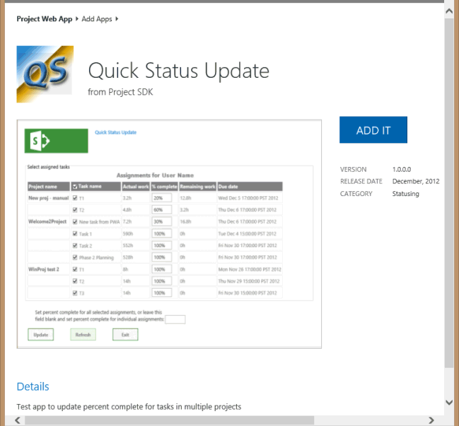

# <a name="create-a-sharepoint-hosted-project-server-add-in"></a><span data-ttu-id="8d49c-103">Создание надстройки Project Server с размещением в SharePoint</span><span class="sxs-lookup"><span data-stu-id="8d49c-103">Create a SharePoint-hosted Project Server add-in</span></span>

<span data-ttu-id="8d49c-104">Из трех типов приложений, которые можно создать для Project Online (автохозяйное, размещенное у поставщика и SharePoint размещено), размещенное SharePoint является простейшим для создания и развертывания.</span><span class="sxs-lookup"><span data-stu-id="8d49c-104">Of the three types of apps that you can create for Project Online (autohosted, provider-hosted, and SharePoint-hosted), the SharePoint-hosted app is the simplest to create and deploy.</span></span> <span data-ttu-id="8d49c-105">Приложение SharePoint не требует проверки подлинности OAuth и не использует Azure или не требует обслуживания локального сайта для ресурсов, на которые работает поставщик.</span><span class="sxs-lookup"><span data-stu-id="8d49c-105">A SharePoint-hosted app does not require OAuth authentication, and does not use Azure or require maintenance of a local site for the provider-hosted resources.</span></span> <span data-ttu-id="8d49c-106">Шаблон **App for SharePoint 2013** в Visual Studio — это удобная основа для разработки приложений, которые можно опубликовать и продать в магазине Office или развернуть в частном каталоге приложений на SharePoint.</span><span class="sxs-lookup"><span data-stu-id="8d49c-106">The **App for SharePoint 2013** template in Visual Studio is a convenient framework for developing apps that can be published and sold in the Office Store or deployed to a private app catalog on SharePoint.</span></span> 
  
<span data-ttu-id="8d49c-107">В Project это процесс, в котором член группы может использовать страницу Задачи в Project Web App, чтобы отправить состояние назначенной задачи, например количество отработаных часов каждый день недели, затраченных на выполнение задачи.</span><span class="sxs-lookup"><span data-stu-id="8d49c-107">In Project, statusing is a process where a team member can use the Tasks page in Project Web App to submit the status of an assigned task, such as the number of hours worked each day of a week spent working on the task.</span></span> <span data-ttu-id="8d49c-108">Владелец назначения (обычно руководитель проекта) может утвердить или отклонить состояние.</span><span class="sxs-lookup"><span data-stu-id="8d49c-108">The assignment owner (usually the project manager) can approve or reject the status.</span></span> <span data-ttu-id="8d49c-109">После утверждения состояния Project изменяет расписание.</span><span class="sxs-lookup"><span data-stu-id="8d49c-109">When the status is approved, Project recalculates the schedule.</span></span> <span data-ttu-id="8d49c-110">Приложение **QuickStatus** отображает назначенные задачи, при этом пользователь может быстро обновить процент завершения и отправить отчет о состоянии выбранных назначений для утверждения.</span><span class="sxs-lookup"><span data-stu-id="8d49c-110">The **QuickStatus** app displays assigned tasks, where the user can quickly update percent complete and submit status of the selected assignments for approval.</span></span> <span data-ttu-id="8d49c-111">Хотя страница Задачи в Project Web App имеет гораздо больше функциональных возможностей, приложение **QuickStatus** является примером, который предоставляет упрощенный интерфейс.</span><span class="sxs-lookup"><span data-stu-id="8d49c-111">Although the Tasks page in Project Web App has much more functionality, the **QuickStatus** app is an example that provides a simplified interface.</span></span> 
  
<span data-ttu-id="8d49c-112">Приложение **QuickStatus** — это пример для разработчиков, оно не предназначено для использования в рабочей среде.</span><span class="sxs-lookup"><span data-stu-id="8d49c-112">The **QuickStatus** app is a sample for developers; it is not intended for use in a production environment.</span></span> <span data-ttu-id="8d49c-113">Основная цель состоит в том, чтобы показать пример разработки приложения для Project Online, а не создать полностью функциональное приложение для состояния.</span><span class="sxs-lookup"><span data-stu-id="8d49c-113">The primary purpose is to show an example of app development for Project Online, not to create a fully functional statusing app.</span></span> <span data-ttu-id="8d49c-114">Более эффективный способ определения состояния см. рекомендациях в разделе [Дальнейшие действия](#pj15_StatusingApp_NextSteps).</span><span class="sxs-lookup"><span data-stu-id="8d49c-114">For a better approach to statusing, see the recommendation in [Next steps](#pj15_StatusingApp_NextSteps).</span></span>
  
<span data-ttu-id="8d49c-115">Общие сведения о состоянии см. в [перек.](https://support.office.com/article/Find-information-about-Project-Server-2013-8b08a414-15a7-4076-b2db-c90d0214ea7f?ui=en-US&rs=en-US&ad=US#BKMK_TaskProgress)</span><span class="sxs-lookup"><span data-stu-id="8d49c-115">For general information about statusing, see [Task progress](https://support.office.com/article/Find-information-about-Project-Server-2013-8b08a414-15a7-4076-b2db-c90d0214ea7f?ui=en-US&rs=en-US&ad=US#BKMK_TaskProgress).</span></span> <span data-ttu-id="8d49c-116">Дополнительные сведения о разработке надстройок для SharePoint и Project Server см. в SharePoint [надстройки.](https://msdn.microsoft.com/library/jj163230.aspx)</span><span class="sxs-lookup"><span data-stu-id="8d49c-116">For more information about developing add-ins for SharePoint and Project Server, see [SharePoint Add-ins](https://msdn.microsoft.com/library/jj163230.aspx).</span></span>

<span data-ttu-id="8d49c-117"><a name="pj15_StatusingApp_Prerequisites"> </a></span><span class="sxs-lookup"><span data-stu-id="8d49c-117"><a name="pj15_StatusingApp_Prerequisites"> </a></span></span>

## <a name="prerequisites-for-creating-an-app-for-project-server-2013"></a><span data-ttu-id="8d49c-118">Необходимые компоненты для создания приложения для Project Server 2013</span><span class="sxs-lookup"><span data-stu-id="8d49c-118">Prerequisites for creating an app for Project Server 2013</span></span>

<span data-ttu-id="8d49c-119">Для разработки относительно простых приложений, которые можно развернуть в Project Online или на локальной установке Project Server 2013, можно использовать Napa, обеспечивая среду разработки в Интернете.</span><span class="sxs-lookup"><span data-stu-id="8d49c-119">To develop relatively simple apps that can be deployed to Project Online or to an on-premises installation of Project Server 2013, you can use the Napa, which provide an online development environment.</span></span> <span data-ttu-id="8d49c-120">Для более сложных приложений, Project Web App ленты и более простой отладки во время разработки, можно использовать Visual Studio 2012 или Visual Studio 2013.</span><span class="sxs-lookup"><span data-stu-id="8d49c-120">For more complex apps, modifying the Project Web App ribbon, and easier debugging during development, you can use Visual Studio 2012 or Visual Studio 2013.</span></span> <span data-ttu-id="8d49c-121">Например, в локальной установке можно вручную проверить черновики таблиц данных на наличие изменений в базе данных Project Server.</span><span class="sxs-lookup"><span data-stu-id="8d49c-121">For example, with an on-premises installation, you can manually check the Drafts datatables for changes in the Project Server database.</span></span> <span data-ttu-id="8d49c-122">В этой статье показано, как разрабатывать приложения с помощью Visual Studio.</span><span class="sxs-lookup"><span data-stu-id="8d49c-122">This article shows how to do app development with Visual Studio.</span></span>
  
<span data-ttu-id="8d49c-123">Для разработки приложений Project Server с использованием Visual Studio требуются следующие компоненты:</span><span class="sxs-lookup"><span data-stu-id="8d49c-123">Development of Project Server apps with Visual Studio requires the following:</span></span>
  
- <span data-ttu-id="8d49c-p106">Проверьте, что на локальном компьютере разработчика установлены самые последние пакеты обновления и обновления Windows. Операционной системой может быть Windows 7, Windows 8, Windows Server 2008 или Windows Server 2012.</span><span class="sxs-lookup"><span data-stu-id="8d49c-p106">Ensure that you have installed the most recent service packs and Windows updates on your local development computer. The operating system can be Windows 7, Windows 8, Windows Server 2008, or Windows Server 2012.</span></span>
    
- <span data-ttu-id="8d49c-126">Необходимо установить компьютер с SharePoint Server 2013 и Project Server 2013, на котором компьютер настроен для изоляции приложений и загрузки приложений.</span><span class="sxs-lookup"><span data-stu-id="8d49c-126">You must have a computer that has SharePoint Server 2013 and Project Server 2013 installed, where the computer is configured for app isolation and sideloading of apps.</span></span> <span data-ttu-id="8d49c-127">При боковой загрузке Visual Studio временно установить приложение для отладки.</span><span class="sxs-lookup"><span data-stu-id="8d49c-127">Sideloading enables Visual Studio to temporarily install the app for debugging.</span></span> <span data-ttu-id="8d49c-128">Можно использовать локальное установку SharePoint и Project Server.</span><span class="sxs-lookup"><span data-stu-id="8d49c-128">You can use an on-premises installation of SharePoint and Project Server.</span></span> <span data-ttu-id="8d49c-129">Дополнительные сведения см. в статью Настройка локальной среды разработки для приложений [для SharePoint.](https://msdn.microsoft.com/library/fp179923%28Office.15%29.aspx)</span><span class="sxs-lookup"><span data-stu-id="8d49c-129">For more information, see [Set up an on-premises development environment for apps for SharePoint](https://msdn.microsoft.com/library/fp179923%28Office.15%29.aspx).</span></span>
    
   > [!NOTE]
   > <span data-ttu-id="8d49c-130">Для локальной установки настройте изолированный домен  приложения перед созданием корпоративного каталога приложений.</span><span class="sxs-lookup"><span data-stu-id="8d49c-130">For an on-premises installation, configure an isolated app domain  *before*  you create a corporate app catalog.</span></span> 
  
- <span data-ttu-id="8d49c-131">Компьютер разработки может быть удаленным компьютером, на Office для Visual Studio 2012 года.</span><span class="sxs-lookup"><span data-stu-id="8d49c-131">The development computer can be a remote computer that has Office Developer Tools for Visual Studio 2012 installed.</span></span> <span data-ttu-id="8d49c-132">Убедитесь, что установлена самая недавняя версия; см. *раздел Инструменты* [приложений для Office и SharePoint загрузки](https://msdn.microsoft.com/office/apps/fp123627.aspx).</span><span class="sxs-lookup"><span data-stu-id="8d49c-132">Ensure that you have installed the most recent version; see the  *Tools*  section of the [Apps for Office and SharePoint downloads](https://msdn.microsoft.com/office/apps/fp123627.aspx).</span></span>
    
- <span data-ttu-id="8d49c-133">Убедитесь, Project Web App экземпляр, который вы будете использовать для разработки и тестирования, доступен в браузере.</span><span class="sxs-lookup"><span data-stu-id="8d49c-133">Verify that the Project Web App instance you will be using for development and testing is accessible in the browser.</span></span>
    
<span data-ttu-id="8d49c-134">Сведения об использовании средств в Интернете см. в статью Настройка среды для разработки приложений для SharePoint [на Office 365](https://msdn.microsoft.com/library/fp161179.aspx).</span><span class="sxs-lookup"><span data-stu-id="8d49c-134">For information about using the online tools, see [Set up an environment for developing apps for SharePoint on Office 365](https://msdn.microsoft.com/library/fp161179.aspx).</span></span> <span data-ttu-id="8d49c-135">О создании простого приложения для Project Server, использующего онлайн-инструменты, см. в серии блогов EPMSource, в которую входит создание первого [приложения Project Server.](https://epmsource.com/2012/11/20/building-your-first-project-server-app-part-zerothe-introduction/)</span><span class="sxs-lookup"><span data-stu-id="8d49c-135">For a walkthrough of building a simple app for Project Server that uses the online tools, see the EPMSource blog series, [Building your first Project Server app](https://epmsource.com/2012/11/20/building-your-first-project-server-app-part-zerothe-introduction/).</span></span>

<span data-ttu-id="8d49c-136"><a name="pj15_StatusingApp_UsingVisualStudio"> </a></span><span class="sxs-lookup"><span data-stu-id="8d49c-136"><a name="pj15_StatusingApp_UsingVisualStudio"> </a></span></span>

## <a name="using-visual-studio-to-create-a-project-server-app"></a><span data-ttu-id="8d49c-137">Создание приложения для Project Server с помощью Visual Studio</span><span class="sxs-lookup"><span data-stu-id="8d49c-137">Using Visual Studio to create a Project Server app</span></span>

<span data-ttu-id="8d49c-138">Office Средства разработки Visual Studio 2012 г. включают шаблон для SharePoint приложений, которые можно использовать с Project Server 2013.</span><span class="sxs-lookup"><span data-stu-id="8d49c-138">Office Developer Tools for Visual Studio 2012 includes a template for SharePoint apps that can be used with Project Server 2013.</span></span> <span data-ttu-id="8d49c-139">При создании решения оно содержит следующие файлы для пользовательского кода:</span><span class="sxs-lookup"><span data-stu-id="8d49c-139">When you create an app solution, the solution includes the following files for your custom code:</span></span>
  
- <span data-ttu-id="8d49c-p111">**AppManifest.xml** с параметрами для названия приложения, области запроса разрешений и другими свойствами. Процедура 1 содержит действия для установки свойств с помощью конструктора манифеста.</span><span class="sxs-lookup"><span data-stu-id="8d49c-p111">**AppManifest.xml** includes settings for the app title, permission request scope, and other properties. Procedure 1 includes steps to set the properties by using the Manifest Designer.</span></span> 
    
- <span data-ttu-id="8d49c-p112">**Default.aspx** в папке "Страницы" — это главная страница приложения. В процедуре 2 показано добавление HTML5-контента для приложения **QuickStatus**.</span><span class="sxs-lookup"><span data-stu-id="8d49c-p112">**Default.aspx** in the Pages folder is the main page of the app. Procedure 2 shows how to add HTML5 content for the **QuickStatus** app.</span></span> 
    
- <span data-ttu-id="8d49c-144">**App.js** папке Scripts является основным файлом для настраиваемого кода JavaScript.</span><span class="sxs-lookup"><span data-stu-id="8d49c-144">**App.js** in the Scripts folder is the primary file for the custom JavaScript code.</span></span> <span data-ttu-id="8d49c-145">В процедуре 3 объясняется код JavaScript для **приложения QuickStatus.**</span><span class="sxs-lookup"><span data-stu-id="8d49c-145">Procedure 3 explains the JavaScript code for the **QuickStatus** app.</span></span> 
    
   <span data-ttu-id="8d49c-146">При добавлении коммерческих элементов управления, таких как сетка на основе jQuery или выборщик дат, можно добавить ссылки на дополнительные файлы JavaScript в файле Default.aspx.</span><span class="sxs-lookup"><span data-stu-id="8d49c-146">If you add commercial controls such as a jQuery-based grid or date picker, you can add references to additional JavaScript files in the Default.aspx file.</span></span>
    
- <span data-ttu-id="8d49c-p114">**App.css** в папке "Контент" — это основной файл для настраиваемых стилей CSS3. Процедура 2 и 3 процедуры содержат сведения о каскадных таблицах стилей (CSS) для приложения **QuickStatus**. В файл Default.aspx можно добавить ссылки на дополнительные CSS-файлы.</span><span class="sxs-lookup"><span data-stu-id="8d49c-p114">**App.css** in the Content folder is the primary file for custom CSS3 styles. Procedure 2 and Procedure 3 include information about cascading style sheets (CSS) styles for the **QuickStatus** app. You can add references to additional CSS files in the Default.aspx file.</span></span> 
    
- <span data-ttu-id="8d49c-150">**AppIcon.png** в папке Изображения — значок 96 x 96, отображаемый приложением в Office Магазине или каталоге приложений.</span><span class="sxs-lookup"><span data-stu-id="8d49c-150">**AppIcon.png** in the Images folder is the 96 x 96 icon that the app displays in the Office Store or the app catalog.</span></span> 
    
<span data-ttu-id="8d49c-151">Чтобы изменить Project Web App ленту, можно добавить настраиваемую ленту.</span><span class="sxs-lookup"><span data-stu-id="8d49c-151">To modify the Project Web App ribbon, you can add a ribbon custom action.</span></span> <span data-ttu-id="8d49c-152">В разделе [Пример кода приложения QuickStatus](#pj15_StatusingApp_Example) представлен полный код измененных файлов Default.aspx, App.js, App.css, Elements.xml и AppManifest.xml.</span><span class="sxs-lookup"><span data-stu-id="8d49c-152">The [Example code for the QuickStatus app](#pj15_StatusingApp_Example) section includes the complete code for the modified Default.aspx, App.js, App.css, Elements.xml, and AppManifest.xml files.</span></span> 
  
### <a name="procedure-1-to-create-an-app-project-in-visual-studio"></a><span data-ttu-id="8d49c-p116">Процедура 1. Создание проекта приложения в Visual Studio</span><span class="sxs-lookup"><span data-stu-id="8d49c-p116">Procedure 1. To create an app project in Visual Studio</span></span>

1. <span data-ttu-id="8d49c-155">Запустите Visual Studio 2012 в качестве администратора, а затем выберите **new Project** на странице Начните.</span><span class="sxs-lookup"><span data-stu-id="8d49c-155">Run Visual Studio 2012 as an administrator, and then select **New Project** on the Start page.</span></span> 
    
2. <span data-ttu-id="8d49c-p117">В диалоговом окне **Создание проекта** разверните узлы **Шаблоны**, **Visual C#** и **Office/SharePoint**, а затем выберите пункт **Приложения**. В раскрывающемся списке целевой платформы, расположенном в верхней части центральной панели, выберите **.NET Framework 4.5**, а затем выберите **Приложение для SharePoint 2013** (см. рис. 1).</span><span class="sxs-lookup"><span data-stu-id="8d49c-p117">In the **New Project** dialog box, expand the **Templates**, **Visual C#**, and **Office/SharePoint** nodes, and then select **Apps**. Use the default **.NET Framework 4.5** in the target framework drop-down list at the top of the center pane, and then select **App for SharePoint 2013** (see Figure 1).</span></span> 
    
3. <span data-ttu-id="8d49c-158">В поле **Имя** введите QuickStatus, перейдите к расположению, где нужно сохранить приложение, а затем выберите **ОК**.</span><span class="sxs-lookup"><span data-stu-id="8d49c-158">In the **Name** field, type QuickStatus, browse to the location where you want to save the app, and then choose **OK**.</span></span>
    
   <span data-ttu-id="8d49c-159">**Рис. 1. Создание приложения Project Server в Visual Studio**</span><span class="sxs-lookup"><span data-stu-id="8d49c-159">**Figure 1. Creating a Project Server app in Visual Studio**</span></span>

   <span data-ttu-id="8d49c-160"></span><span class="sxs-lookup"><span data-stu-id="8d49c-160"></span></span>
  
4. <span data-ttu-id="8d49c-161">В диалоговом окне **Создание приложения для SharePoint** заполните следующие три поля:</span><span class="sxs-lookup"><span data-stu-id="8d49c-161">In the **New app for SharePoint** dialog box, fill in the following three fields:</span></span> 
    
   - <span data-ttu-id="8d49c-162">В верхнем текстовом окне введите имя, которое вы хотите, чтобы приложение отображали в Project Web App.</span><span class="sxs-lookup"><span data-stu-id="8d49c-162">In the top text box, type the name that you want the app to display in Project Web App.</span></span> <span data-ttu-id="8d49c-163">Например, введите Быстрое обновление состояния.</span><span class="sxs-lookup"><span data-stu-id="8d49c-163">For example, type Quick Status Update.</span></span>
    
   - <span data-ttu-id="8d49c-164">Чтобы веб-сайт был использовать для отладки, введите URL-адрес экземпляра Project Web App.</span><span class="sxs-lookup"><span data-stu-id="8d49c-164">For the site to use for debugging, type the URL of the Project Web App instance.</span></span> <span data-ttu-id="8d49c-165">Например, введите  `https://ServerName/ProjectServerName` (заменив  _ServerName_ и  _ProjectServerName_ собственными значениями), а затем выберите **Проверка**.</span><span class="sxs-lookup"><span data-stu-id="8d49c-165">For example, type  `https://ServerName/ProjectServerName` (replacing  _ServerName_ and  _ProjectServerName_ with your own values), and then choose **Validate**.</span></span> <span data-ttu-id="8d49c-166">Если все пройдет успешно, Visual Studio отображает сообщение **Подключение выполнено успешно**.</span><span class="sxs-lookup"><span data-stu-id="8d49c-166">If all goes well, Visual Studio shows **Connection successful**.</span></span> <span data-ttu-id="8d49c-167">Если вы получаете сообщение об ошибке, убедитесь, что Project Web App url-адрес является правильным, а компьютер Project Server настроен для изоляции приложений и загрузки приложений.</span><span class="sxs-lookup"><span data-stu-id="8d49c-167">If you get an error message, ensure that the Project Web App URL is correct and that the Project Server computer is configured for app isolation and sideloading of apps.</span></span> <span data-ttu-id="8d49c-168">Дополнительные сведения см. в разделе Предпосылки для создания [приложения для Project Server 2013.](#pj15_StatusingApp_Prerequisites)</span><span class="sxs-lookup"><span data-stu-id="8d49c-168">For more information, see the [Prerequisites for creating an app for Project Server 2013](#pj15_StatusingApp_Prerequisites) section.</span></span> 
    
   - <span data-ttu-id="8d49c-169">В раскрывающемся списке **Как разместить приложение для SharePoint?** выберите **Размещение в SharePoint**.</span><span class="sxs-lookup"><span data-stu-id="8d49c-169">In the **How do you want to host your app for SharePoint** drop-down list, choose **SharePoint-hosted**.</span></span>
    
   > [!CAUTION]
   > <span data-ttu-id="8d49c-p120">Если вы по ошибке выбрали значение по умолчанию, **С размещением у поставщика**, Visual Studio создает два проекта в решении: **QuickStatus** и **QuickStatusWeb**. Если вы видите два проекта, удалите решение и начните заново.</span><span class="sxs-lookup"><span data-stu-id="8d49c-p120">If you choose the default **Provider-hosted** project type by mistake, Visual Studio creates two projects in the solution: a **QuickStatus** project and a **QuickStatusWeb** project. If you see two projects, delete that solution and start again.</span></span> 
  
5. <span data-ttu-id="8d49c-172">Нажмите кнопку **ОК** для создания решения **QuickStatus**, проекта **QuickStatus** и файлов по умолчанию.</span><span class="sxs-lookup"><span data-stu-id="8d49c-172">Choose **OK** to create the **QuickStatus** solution, **QuickStatus** project, and default files.</span></span> 
    
6. <span data-ttu-id="8d49c-p121">Откройте представление конструктора манифеста (например, дважды щелкните файл AppManifest.xml). На вкладке **Общие** в текстовом поле **Название** должно отобразиться имя приложения, введенное на шаге 4. Откройте вкладку **Разрешения**, чтобы добавить следующие запросы разрешений для приложения (см. рис. 2):</span><span class="sxs-lookup"><span data-stu-id="8d49c-p121">Open the Manifest Designer view (for example, double-click the AppManifest.xml file). On the **General** tab, the **Title** text box should show the app name that you typed in step 4. Choose the **Permissions** tab to add the following permission requests for the app (see Figure 2):</span></span> 
    
   - <span data-ttu-id="8d49c-p122">В первой строке списка **Запросы разрешений** в столбце **Область** выберите **Определение состояния** в раскрывающемся списке. В столбце **Разрешения** выберите **SubmitStatus**.</span><span class="sxs-lookup"><span data-stu-id="8d49c-p122">In the first row of the **Permission requests** list, in the **Scope** column, choose **Statusing** in the drop-down list. In the **Permission** column, choose **SubmitStatus**.</span></span>
    
   - <span data-ttu-id="8d49c-178">Добавьте строку, где **Область** — это **Несколько проектов**, а **Разрешение** — **Чтение**.</span><span class="sxs-lookup"><span data-stu-id="8d49c-178">Add a row where the **Scope** is **Multiple Projects** and the **Permission** is **Read**.</span></span>
    
   <span data-ttu-id="8d49c-179">**Рис. 2. Установка области разрешений для приложения определения состояния**</span><span class="sxs-lookup"><span data-stu-id="8d49c-179">**Figure 2. Setting the permission scope for a statusing app**</span></span>

   <span data-ttu-id="8d49c-180"></span><span class="sxs-lookup"><span data-stu-id="8d49c-180"></span></span>
  
<span data-ttu-id="8d49c-181">Приложение **QuickStatus** позволяет пользователю Project Web App для чтения назначений для этого пользователя из нескольких проектов, изменения процентов выполнения назначения и отправки обновления.</span><span class="sxs-lookup"><span data-stu-id="8d49c-181">The **QuickStatus** app enables a Project Web App user to read assignments for that user from multiple projects, change the assignment percent complete, and submit the update.</span></span> <span data-ttu-id="8d49c-182">Другие области запросов разрешений, показанные в выпадаемом списке на рис. 2, не требуются для этого приложения.</span><span class="sxs-lookup"><span data-stu-id="8d49c-182">The other permission request scopes shown in the drop-down list in Figure 2 are not required for this app.</span></span> <span data-ttu-id="8d49c-183">Области запросов разрешений — это разрешения, которые приложение запрашивает от имени пользователя.</span><span class="sxs-lookup"><span data-stu-id="8d49c-183">The permission request scopes are the permissions that the app requests on behalf of the user.</span></span> <span data-ttu-id="8d49c-184">Если у пользователя нет таких разрешений в Project Web App, приложение не запустится.</span><span class="sxs-lookup"><span data-stu-id="8d49c-184">If the user does not have those permissions in Project Web App, the app does not run.</span></span> <span data-ttu-id="8d49c-185">Приложение может иметь несколько областей запросов разрешений, в том числе для других разрешений SharePoint, но должно иметь только минимальный необходимый для функциональности приложения.</span><span class="sxs-lookup"><span data-stu-id="8d49c-185">An app can have multiple permission request scopes, including those for other SharePoint permissions, but should have only the minimum necessary for the app functionality.</span></span> <span data-ttu-id="8d49c-186">Ниже следующую область запросов разрешений, связанные с Project Server:</span><span class="sxs-lookup"><span data-stu-id="8d49c-186">Following are the permission request scopes that are related to Project Server:</span></span> 

- <span data-ttu-id="8d49c-187">**Enterprise ресурсы:** разрешения диспетчера ресурсов, для чтения или записи сведений о других Project Web App пользователях.</span><span class="sxs-lookup"><span data-stu-id="8d49c-187">**Enterprise Resources**: Resource manager permissions, to read or write information about other Project Web App users.</span></span>
    
- <span data-ttu-id="8d49c-188">**Несколько проектов**: чтение или запись в несколько проектов, для которых у пользователя есть запрашиваемые разрешения.</span><span class="sxs-lookup"><span data-stu-id="8d49c-188">**Multiple Projects**: Read or write to more than one project, where the user has the permissions requested.</span></span>
    
- <span data-ttu-id="8d49c-189">**Project Server:** требуется, чтобы у пользователя приложения были разрешения администратора для Project Web App.</span><span class="sxs-lookup"><span data-stu-id="8d49c-189">**Project Server**: Requires the app user to have administrator permissions for Project Web App.</span></span>
    
- <span data-ttu-id="8d49c-190">**Отчеты.** Ознакомьтесь с **службой OData ProjectData** для Project Web App (для этого требуется только войти в журнал Project Web App).</span><span class="sxs-lookup"><span data-stu-id="8d49c-190">**Reporting**: Read the **ProjectData** OData service for Project Web App (requires only log on permission for Project Web App).</span></span> 
    
- <span data-ttu-id="8d49c-191">**Один проект**: чтение или запись в проект, для которого у пользователя есть запрашиваемые разрешения.</span><span class="sxs-lookup"><span data-stu-id="8d49c-191">**Single Project**: Read or write to a project where the user has the permissions requested.</span></span>
    
- <span data-ttu-id="8d49c-192">**Определение состояния**: отправка обновлений состояния назначений, таких как время работы, процент завершения и новых назначений.</span><span class="sxs-lookup"><span data-stu-id="8d49c-192">**Statusing**: Submit updates for status of assignments, such as times worked, percent complete, and new assignments.</span></span>
    
- <span data-ttu-id="8d49c-193">**Рабочий процесс**: если у пользователя есть разрешения для запуска рабочих процессов Project Server, приложение выполняется с повышенными привилегиями для рабочего процесса.</span><span class="sxs-lookup"><span data-stu-id="8d49c-193">**Workflow**: If the user has permission to run Project Server workflows, the app then runs with elevated permissions for the workflow.</span></span>
    
<span data-ttu-id="8d49c-194">Дополнительные сведения о области запросов разрешений для Project Server 2013 см. в разделе *Project* приложения в разделе Обновления для разработчиков в [Project 2013](updates-for-developers-in-project-2013.md) г. и разрешения app [в SharePoint 2013](https://msdn.microsoft.com/library/fp142383.aspx)г. .</span><span class="sxs-lookup"><span data-stu-id="8d49c-194">For more information about permission request scopes for Project Server 2013, see the  *Project apps*  section in [Updates for developers in Project 2013](updates-for-developers-in-project-2013.md) and [App permissions in SharePoint 2013](https://msdn.microsoft.com/library/fp142383.aspx).</span></span>


<span data-ttu-id="8d49c-195"><a name="pj15_StatusingApp_HTML"> </a></span><span class="sxs-lookup"><span data-stu-id="8d49c-195"><a name="pj15_StatusingApp_HTML"> </a></span></span>

### <a name="creating-the-html-content-for-the-quickstatus-app"></a><span data-ttu-id="8d49c-196">Создание HTML-контента для приложения QuickStatus</span><span class="sxs-lookup"><span data-stu-id="8d49c-196">Creating the HTML content for the QuickStatus app</span></span>

<span data-ttu-id="8d49c-197">Прежде чем приступить к кодированию HTML-контента, разработать пользовательский интерфейс и пользовательский интерфейс для приложения QuickStatus (на рисунке 3 показан пример завершенной страницы).</span><span class="sxs-lookup"><span data-stu-id="8d49c-197">Before you start coding the HTML content, design the user interface and user experience for the QuickStatus app (Figure 3 shows an example of the completed page).</span></span> <span data-ttu-id="8d49c-198">Кроме того, проект может включать в себя контур функций JavaScript, взаимодействующих с HTML-кодом.</span><span class="sxs-lookup"><span data-stu-id="8d49c-198">A design can also include an outline of the JavaScript functions that interact with the HTML code.</span></span> <span data-ttu-id="8d49c-199">Общие сведения см. в [проекте UX для приложений в SharePoint 2013 г.](https://msdn.microsoft.com/library/fp179934.aspx)</span><span class="sxs-lookup"><span data-stu-id="8d49c-199">For general information, see [UX design for apps in SharePoint 2013](https://msdn.microsoft.com/library/fp179934.aspx).</span></span>
  
<span data-ttu-id="8d49c-200">**Рис. 3. Проект страницы приложения QuickStatus**</span><span class="sxs-lookup"><span data-stu-id="8d49c-200">**Figure 3. Design of the QuickStatus app page**</span></span>

<span data-ttu-id="8d49c-201"></span><span class="sxs-lookup"><span data-stu-id="8d49c-201"></span></span>
  
<span data-ttu-id="8d49c-202">Приложение отображает имя в верхней части, а именно значение из элемента **Title** файла AppManifest.xml.</span><span class="sxs-lookup"><span data-stu-id="8d49c-202">The app shows the display name at the top, which is the value of the **Title** element in AppManifest.xml.</span></span> 
  
<span data-ttu-id="8d49c-p125">По умолчанию страница использует HTML5. Ниже приведены стандартные HTML-элементы для основных объектов пользовательского интерфейса, которые содержатся в тексте страницы приложения **QuickStatus**:</span><span class="sxs-lookup"><span data-stu-id="8d49c-p125">By default, the page uses HTML5. Following are the standard HTML elements for the main UI objects that the **QuickStatus** app contains in the body of the page:</span></span> 
  
- <span data-ttu-id="8d49c-205">Элемент **form** содержит все другие элементы пользовательского интерфейса.</span><span class="sxs-lookup"><span data-stu-id="8d49c-205">A **form** element contains all of the other UI elements.</span></span> 
    
- <span data-ttu-id="8d49c-206">Элемент **fieldset** создает контейнер и границу таблицы назначений, дочерний элемент **legend** предоставляет метку для контейнера.</span><span class="sxs-lookup"><span data-stu-id="8d49c-206">A **fieldset** element creates a container and border for the table of assignments; the child **legend** element provides a label for the container.</span></span> 
    
- <span data-ttu-id="8d49c-207">Элемент **table** содержит название и заголовок таблицы.</span><span class="sxs-lookup"><span data-stu-id="8d49c-207">A **table** element includes a caption and only a table header.</span></span> <span data-ttu-id="8d49c-208">Функции JavaScript изменяют заголовок таблицы и добавляют строки для назначений.</span><span class="sxs-lookup"><span data-stu-id="8d49c-208">JavaScript functions change the table caption and add rows for the assignments.</span></span> 
    
   > [!NOTE]
   > <span data-ttu-id="8d49c-209">Чтобы легко добавить разбиение по страницам и сортировки, рабочее приложение, скорее всего, будет использовать коммерческий элемент управления сетки на основе jQuery вместо таблицы.</span><span class="sxs-lookup"><span data-stu-id="8d49c-209">To easily add paging and sorting, a production app would probably use a commercial jQuery-based grid control instead of a table.</span></span> 
  
   <span data-ttu-id="8d49c-210">Таблица содержит столбцы имени проекта, имени задачи с флажком, фактических трудозатрат, процента завершения, оставшихся трудозатрат и даты окончания назначения.</span><span class="sxs-lookup"><span data-stu-id="8d49c-210">The table includes columns for the project name, task name with a check box, actual work, percent complete, remaining work, and the assignment finish date.</span></span> <span data-ttu-id="8d49c-211">Функции JavaScript создают поле и поле ввода текста для процента выполнения каждой задачи.</span><span class="sxs-lookup"><span data-stu-id="8d49c-211">JavaScript functions create the check box and the text input field for the percent complete of each task.</span></span>
    
- <span data-ttu-id="8d49c-212">Элемент **input** для текстового поля задает процента завершения всех выбранных назначений.</span><span class="sxs-lookup"><span data-stu-id="8d49c-212">An **input** element for a text box sets percent complete for all selected assignments.</span></span> 
    
- <span data-ttu-id="8d49c-213">Элемент **button** отправляет изменения состояния.</span><span class="sxs-lookup"><span data-stu-id="8d49c-213">A **button** element submits the status changes.</span></span> 
    
- <span data-ttu-id="8d49c-214">Элемент **button** обновляет страницу.</span><span class="sxs-lookup"><span data-stu-id="8d49c-214">A **button** element refreshes the page.</span></span> 
    
- <span data-ttu-id="8d49c-215">Элемент **кнопки** выходит из приложения и возвращается на страницу Задачи в Project Web App.</span><span class="sxs-lookup"><span data-stu-id="8d49c-215">A **button** element exits the app and returns to the Tasks page in Project Web App.</span></span> 
    
<span data-ttu-id="8d49c-216">Нижние текстовые поля и кнопки находятся в элементах **div**, чтобы таблица CSS могла легко управлять положением и внешним видом объектов пользовательского интерфейса.</span><span class="sxs-lookup"><span data-stu-id="8d49c-216">The bottom text box and button elements are within **div** elements, so that CSS can easily manage the position and appearance of the UI objects.</span></span> <span data-ttu-id="8d49c-217">Функция JavaScript добавляет абзац в нижней части страницы, содержащий результаты для успешного или неудачного обновления состояния.</span><span class="sxs-lookup"><span data-stu-id="8d49c-217">A JavaScript function adds a paragraph at the bottom of the page that contains results for success or failure of the status update.</span></span> 
  
### <a name="procedure-2-to-create-the-html-content"></a><span data-ttu-id="8d49c-p129">Процедура 2. Создание HTML-контента</span><span class="sxs-lookup"><span data-stu-id="8d49c-p129">Procedure 2. To create the HTML content</span></span>

1. <span data-ttu-id="8d49c-220">В Visual Studio откройте файл Default.aspx.</span><span class="sxs-lookup"><span data-stu-id="8d49c-220">In Visual Studio, open the Default.aspx file.</span></span>
    
   <span data-ttu-id="8d49c-221">Файл содержит два **элемента asp:Content:** элемент с атрибутом добавляется в заголовку страницы, а элемент с атрибутом помещается в элемент `ContentPlaceHolderID="PlaceHolderAdditionalPageHead"` тела `ContentPlaceHolderID="PlaceHolderMain"`  страницы.</span><span class="sxs-lookup"><span data-stu-id="8d49c-221">The file includes two **asp:Content** elements: The element with the  `ContentPlaceHolderID="PlaceHolderAdditionalPageHead"` attribute is added within the page header, and the element with the  `ContentPlaceHolderID="PlaceHolderMain"` attribute is placed within the page **body** element.</span></span> 
    
2. <span data-ttu-id="8d49c-222">В области управления для загона страницы добавьте ссылку на файл PS.js на `<asp:Content ContentPlaceHolderID="PlaceHolderAdditionalPageHead" runat="server">` компьютере Project Server.</span><span class="sxs-lookup"><span data-stu-id="8d49c-222">In the  `<asp:Content ContentPlaceHolderID="PlaceHolderAdditionalPageHead" runat="server">` control for the page header, add a reference to the PS.js file on the Project Server computer.</span></span> <span data-ttu-id="8d49c-223">Для тестирования и отладки можно использовать PS.debug.js.</span><span class="sxs-lookup"><span data-stu-id="8d49c-223">For testing and debugging, you can use PS.debug.js.</span></span> 
    
   ```HTML
     <script type="text/javascript" src="/_layouts/15/ps.debug.js"></script>
   ```

   <span data-ttu-id="8d49c-224">Инфраструктура приложения использует `/_layouts/15/` виртуальный каталог для SharePoint в IIS.</span><span class="sxs-lookup"><span data-stu-id="8d49c-224">The app infrastructure uses the `/_layouts/15/` virtual directory for the SharePoint site in IIS.</span></span> <span data-ttu-id="8d49c-225">Физический файл  `%ProgramFiles%\Common Files\Microsoft Shared\Web Server Extensions\15\TEMPLATE\LAYOUTS\PS.debug.js` .</span><span class="sxs-lookup"><span data-stu-id="8d49c-225">The physical file is  `%ProgramFiles%\Common Files\Microsoft Shared\Web Server Extensions\15\TEMPLATE\LAYOUTS\PS.debug.js`.</span></span>
    
   > [!NOTE]
   > <span data-ttu-id="8d49c-226">Перед развертывание приложения для производственного использования удалите из скрипта ссылки для  `.debug` повышения производительности.</span><span class="sxs-lookup"><span data-stu-id="8d49c-226">Before you deploy the app for production use, remove  `.debug` from the script references to improve performance.</span></span> 
  
3. <span data-ttu-id="8d49c-227">В элементе управления для тела страницы удалите созданный элемент  `<asp:Content ContentPlaceHolderID="PlaceHolderMain" runat="server">` **div** и добавьте HTML-код для объектов пользовательского интерфейса.</span><span class="sxs-lookup"><span data-stu-id="8d49c-227">In the  `<asp:Content ContentPlaceHolderID="PlaceHolderMain" runat="server">` control for the page body, delete the generated **div** element, and then add the HTML code for the UI objects.</span></span> <span data-ttu-id="8d49c-228">Элемент **table** содержит только строку заголовка.</span><span class="sxs-lookup"><span data-stu-id="8d49c-228">The **table** element contains only a header row.</span></span> <span data-ttu-id="8d49c-229">Столбец **Имя задачи** содержит элемент управления флажком.</span><span class="sxs-lookup"><span data-stu-id="8d49c-229">The **Task name** column includes a check box input control.</span></span> <span data-ttu-id="8d49c-230">Текст для элемента **caption** заменяется обратным вызовом **onGetUserNameSuccess** для функции **getUserInfo** в файле App.js.</span><span class="sxs-lookup"><span data-stu-id="8d49c-230">Text for the **caption** element is replaced by the **onGetUserNameSuccess** callback for the **getUserInfo** function in the App.js file.</span></span> 
    
    ```HTML
    <form>
        <fieldset>
        <legend>Select assigned tasks</legend>
        <table id="assignmentsTable">
            <caption id="tableCaption">Replace caption</caption>
            <thead>
            <tr id="headerRow">
                <th>Project name</th>
                <th><input type="checkbox" id="headercheckbox" checked="checked" />Task name</th>
                <th>Actual work</th>
                <th>% complete</th>
                <th>Remaining work</th>
                <th>Due date</th>
            </tr>
            </thead>
        </table>
        </fieldset>
        <div id="inputPercentComplete" >
        Set percent complete for all selected assignments, or leave this
        <br /> field blank and set percent complete for individual assignments: 
        <input type="text" name="percentComplete" id="pctComplete" size="4"  maxlength="4" />
        </div>
        <div id="submitResult">
        <p><button id="btnSubmitUpdate" type="button" class="bottomButtons" ></button></p>
        <p id="message"></p>
        </div>
        <div id="refreshPage">
        <p><button id="btnRefresh" type="button" class="bottomButtons" >Refresh</button></p>
        </div>
        <div id="exitPage">
        <p><button id="btnExit" type="button" class="bottomButtons" >Exit</button></p>
        </div>
    </form>
    ```

4. <span data-ttu-id="8d49c-p133">В файле App.css добавьте код CSS, определяющий положение и внешний вид элементов пользовательского интерфейса. Полный код CSS приложения **QuickStatus** см. в разделе [Пример кода для приложения QuickStatus](#pj15_StatusingApp_Example).</span><span class="sxs-lookup"><span data-stu-id="8d49c-p133">In the App.css file, add CSS code for the position and appearance of the UI elements. For the complete CSS code of the **QuickStatus** app, see the [Example code for the QuickStatus app](#pj15_StatusingApp_Example) section.</span></span> 
    
<span data-ttu-id="8d49c-233">Процедура 3 добавляет функции JavaScript для чтения назначений и создания строк таблицы, а также для изменения и обновления процентов назначения.</span><span class="sxs-lookup"><span data-stu-id="8d49c-233">Procedure 3 adds the JavaScript functions to read the assignments and create the table rows, and to change and update the assignment percent complete.</span></span> <span data-ttu-id="8d49c-234">Фактические действия являются более итеративными при разработке приложения, в котором поочередно создаются некоторые htmL-коды, добавляются и тестируют связанные стили и функции JavaScript, изменяются или добавляются дополнительные HTML-коды, а затем повторяются процесс.</span><span class="sxs-lookup"><span data-stu-id="8d49c-234">The actual steps are more iterative in developing an app, where you alternately create some of the HTML code, add and test related styles and JavaScript functions, modify or add more HTML code, and then repeat the process.</span></span>

<span data-ttu-id="8d49c-235"><a name="pj15_StatusingApp_JavaScript"> </a></span><span class="sxs-lookup"><span data-stu-id="8d49c-235"><a name="pj15_StatusingApp_JavaScript"> </a></span></span>

### <a name="creating-the-javascript-functions-for-the-quickstatus-app"></a><span data-ttu-id="8d49c-236">Создание функций JavaScript для приложения QuickStatus</span><span class="sxs-lookup"><span data-stu-id="8d49c-236">Creating the JavaScript functions for the QuickStatus app</span></span>

<span data-ttu-id="8d49c-237">Шаблон Visual Studio для приложения SharePoint включает в себя файл App.js, который содержит код инициализации по умолчанию, получающий контекст клиента SharePoint и демонстрирующий базовые операции получения и установки для страницы приложения.</span><span class="sxs-lookup"><span data-stu-id="8d49c-237">The Visual Studio template for a SharePoint app includes the App.js file, which contains default initialization code that gets the SharePoint client context and demonstrates basic get and set actions for the app page.</span></span> <span data-ttu-id="8d49c-238">Пространство имен JavaScript для SharePoint клиентской SP.js является **SP**.</span><span class="sxs-lookup"><span data-stu-id="8d49c-238">The JavaScript namespace for the SharePoint client-side SP.js library is **SP**.</span></span> <span data-ttu-id="8d49c-239">Так как приложение для Project Server использует библиотеку PS.js, приложение применяет пространство имен **PS** для получения контекста клиента и доступа к JSOM для Project Server.</span><span class="sxs-lookup"><span data-stu-id="8d49c-239">Because a Project Server app uses the PS.js library, the app uses the **PS** namespace to get the client context and access the JSOM for Project Server.</span></span> 
  
<span data-ttu-id="8d49c-240">Функции JavaScript в **приложении QuickStatus** включают следующие функции:</span><span class="sxs-lookup"><span data-stu-id="8d49c-240">JavaScript functions in the **QuickStatus** app include the following:</span></span> 
  
- <span data-ttu-id="8d49c-p136">Обработчик событий документа **ready** выполняется, когда создается экземпляр объектной модели документов (DOM). Обработчик события **ready** выполняет следующие четыре действия.</span><span class="sxs-lookup"><span data-stu-id="8d49c-p136">The document **ready** event handler runs when the document object model (DOM) is instantiated. The **ready** event handler does the following four steps:</span></span> 
    
    1. <span data-ttu-id="8d49c-243">Инициализирует глобальную переменную **projContext** с клиентским контекстом для Project Server JSOM и глобальную переменную **pwaWeb**.</span><span class="sxs-lookup"><span data-stu-id="8d49c-243">Initializes the **projContext** global variable with the client context for the Project Server JSOM and the **pwaWeb** global variable.</span></span> 
        
    2. <span data-ttu-id="8d49c-244">Вызывает функцию **getUserInfo** для инициализации глобальной переменной **projUser**.</span><span class="sxs-lookup"><span data-stu-id="8d49c-244">Calls the **getUserInfo** function to initialize the **projUser** global variable.</span></span> 
        
    3. <span data-ttu-id="8d49c-245">Вызывает функцию **getAssignments**, которая возвращает указанные данные назначения пользователю.</span><span class="sxs-lookup"><span data-stu-id="8d49c-245">Calls the **getAssignments** function, which gets specified assignment data for the user.</span></span> 
        
    4. <span data-ttu-id="8d49c-p137">Привязывает обработчики событий щелчка к флажку заголовка таблицы, а также к флажкам в каждой строке таблицы. Обработчики событий щелчка управляют атрибутом **checked** флажков, когда пользователь устанавливает или снимает флажки в таблице.</span><span class="sxs-lookup"><span data-stu-id="8d49c-p137">Binds click event handlers to the table header check box, and to the check boxes in each row of the table. The click event handlers manage the **checked** attribute of the check boxes when the user selects or clears any check box in the table.</span></span> 
    
- <span data-ttu-id="8d49c-p138">Если функция **getAssignments** выполнена успешно, вызывается функция **onGetAssignmentsSuccess**. Эта функция вставляет строку в таблицу для каждого назначения, инициализирует элементы управления HTML в каждой строке, а затем инициализирует свойства нижней кнопки.</span><span class="sxs-lookup"><span data-stu-id="8d49c-p138">If the **getAssignments** function is successful, it calls the **onGetAssignmentsSuccess** function. That function inserts a row in the table for each assignment, initializes the HTML controls in each row, and then initializes the bottom button properties.</span></span> 
    
- <span data-ttu-id="8d49c-p139">Обработчик события **onClick** для кнопки **Update** вызывает функцию **updateAssignments**. Она получает процент завершения, который применяется для каждого выбранного назначения. Если поле процента завершения пусто, функция возвращает процент завершения каждого выбранного назначения в таблице. Функция **updateAssignments** сохраняет и отправляет обновления состояния и записывает сообщение о результатах в нижнюю часть страницы.</span><span class="sxs-lookup"><span data-stu-id="8d49c-p139">The **onClick** event handler for the **Update** button calls the **updateAssignments** function. That function gets the percent complete value that is applied to each selected assignment; or if the percent complete text box is empty, the function gets the percent complete of each selected assignment in the table. The **updateAssignments** function then saves and submits the status updates and writes a message about the results to the bottom of the page.</span></span> 
    
### <a name="procedure-3-to-create-the-javascript-functions"></a><span data-ttu-id="8d49c-p140">Процедура 3. Создание функций JavaScript</span><span class="sxs-lookup"><span data-stu-id="8d49c-p140">Procedure 3. To create the JavaScript functions</span></span>

1. <span data-ttu-id="8d49c-255">В Visual Studio откройте файл App.js и удалите все его содержимое.</span><span class="sxs-lookup"><span data-stu-id="8d49c-255">In Visual Studio, open the App.js file, and then delete all the content in the file.</span></span>
    
2. <span data-ttu-id="8d49c-p141">Добавьте глобальные переменные и обработчик событий **ready**. Доступ к объекту **document** осуществляется с помощью функции jQuery.</span><span class="sxs-lookup"><span data-stu-id="8d49c-p141">Add the global variables and the document **ready** event handler. The **document** object is accessed by using a jQuery function.</span></span> 
    
   <span data-ttu-id="8d49c-p142">Обработчик события щелчка для флажка заголовка таблицы задает состояние флажков строк. Если все флажки строки установлены или сняты, обработчик события щелчка задает установленное состояние флажка заголовка. Обработчики событий щелчка также задает результирующее сообщение в нижней части страницы как пустую строку.</span><span class="sxs-lookup"><span data-stu-id="8d49c-p142">The click event handler for the table header check box sets the checked state of the row check boxes. If all of the row check boxes are selected or all are clear, the click event handler for the row check boxes sets the checked state of the header check box. The click event handlers also set the results message at the bottom of the page to an empty string.</span></span>
    
   ```js
    var projContext;
    var pwaWeb;
    var projUser;
    // This code runs when the DOM is ready and creates a ProjectContext object.
    // The ProjectContext object is required to use the JSOM for Project Server.
    $(document).ready(function () {
        projContext = PS.ProjectContext.get_current();
        pwaWeb = projContext.get_web();
        getUserInfo();
        getAssignments();
        // Bind a click event handler to the table header check box, which sets the row check boxes
        // to the checked state of the header check box, and sets the results message to an empty string.
        $('#headercheckbox').live('click', function (event) {
            $('input:checkbox:not(#headercheckbox)').attr('checked', this.checked);
            $get("message").innerText = "";
        });
        // Bind a click event handler to the row check boxes. If any row check box is cleared, clear
        // the header check box. If all of the row check boxes are selected, select the header check box.
        $('input:checkbox:not(#headercheckbox)').live('click', function (event) {
            var isChecked = true;
            $('input:checkbox:not(#headercheckbox)').each(function () {
                if (this.checked == false) isChecked = false;
                $get("message").innerText = "";
            });
            $("#headercheckbox").attr('checked', isChecked);
        });
    });
   ```

3. <span data-ttu-id="8d49c-p143">Добавьте функцию **getUserInfo**, которая вызывает **onGetUserNameSuccess** при успешном выполнении запроса. Функция **onGetUserNameSuccess** заменяет содержимое абзаца **caption** на название таблицы, которое содержит имя пользователя.</span><span class="sxs-lookup"><span data-stu-id="8d49c-p143">Add the **getUserInfo** function, which calls **onGetUserNameSuccess** if the query is successful. The **onGetUserNameSuccess** function replaces the contents of the **caption** paragraph with a table caption that includes the user name.</span></span> 
    
   ```js
        // Get information about the current user.
        function getUserInfo() {
            projUser = pwaWeb.get_currentUser();
            projContext.load(projUser);
            projContext.executeQueryAsync(onGetUserNameSuccess,
                // Anonymous function to execute if getUserInfo fails.
                function (sender, args) {
                    alert('Failed to get user name. Error: ' + args.get_message());
            });
        } 
        // This function is executed if the getUserInfo call is successful.
        function onGetUserNameSuccess() {
            var prefaceInfo = 'Assignments for ' + projUser.get_title();
            $('#tableCaption').text(prefaceInfo);
        }
   ```

4. <span data-ttu-id="8d49c-p144">Добавьте функцию **getAssignments**, которая вызывает **onGetAssignmentsSuccess** (см. шаг 5) при успешном выполнении запроса назначения. Параметр **Include** ограничивает запрос для возврата только указанных полей.</span><span class="sxs-lookup"><span data-stu-id="8d49c-p144">Add the **getAssignments** function, which calls **onGetAssignmentsSuccess** (see step 5) if the assignment query is successful. The **Include** option limits the query to return only the fields specified.</span></span> 
    
   ```js
    // Get the collection of assignments for the current user.
    function getAssignments() {
        assignments = PS.EnterpriseResource.getSelf(projContext).get_assignments();
        // Register the request that you want to run on the server. The optional "Include" parameter 
        // requests only the specified properties for each assignment in the collection.
        projContext.load(assignments,
            'Include(Project, Name, ActualWork, ActualWorkMilliseconds, PercentComplete, RemainingWork, Finish, Task)');
        // Run the request on the server.
        projContext.executeQueryAsync(onGetAssignmentsSuccess,
            // Anonymous function to execute if getAssignments fails.
            function (sender, args) {
                alert('Failed to get assignments. Error: ' + args.get_message());
            });
    }
   ```

5. <span data-ttu-id="8d49c-p145">Добавьте функцию **onGetAssignmentsSuccess**, которая добавляет строку для каждого назначения в таблицу. Переменная **prevProjName** используется для определения того, предназначена ли строка для другого проекта. В этом случае имя проекта отображается полужирным шрифтом, в противном случае имя проекта — это пустая строка.</span><span class="sxs-lookup"><span data-stu-id="8d49c-p145">Add the **onGetAssignmentsSuccess** function, which adds a row for each assignment to the table. The **prevProjName** variable is used to determine whether a row is for a different project. If so, the project name is shown in a bold font; if not, the project name is set to an empty string.</span></span> 
    
   > [!NOTE]
   > <span data-ttu-id="8d49c-268">JSOM не включает свойства **TimeSpan,** которые включает CSOM, например **ActualWorkTimeSpan.**</span><span class="sxs-lookup"><span data-stu-id="8d49c-268">The JSOM does not include **TimeSpan** properties that the CSOM includes, such as **ActualWorkTimeSpan**.</span></span> <span data-ttu-id="8d49c-269">Вместо них JSOM использует свойства, определяющие время в миллисекундах, например [PS.StatusAssignment.actualWorkMilliseconds](https://msdn.microsoft.com/library/736bce1e-f734-0efe-6c5f-e0e891ab00ef%28Office.15%29.aspx).</span><span class="sxs-lookup"><span data-stu-id="8d49c-269">Instead, the JSOM uses properties for the number of milliseconds, such as the [PS.StatusAssignment.actualWorkMilliseconds](https://msdn.microsoft.com/library/736bce1e-f734-0efe-6c5f-e0e891ab00ef%28Office.15%29.aspx) property.</span></span> <span data-ttu-id="8d49c-270">Метод получения этого свойства — **получить \_ actualWorkMilliseconds,** который возвращает значение integer.</span><span class="sxs-lookup"><span data-stu-id="8d49c-270">The method to get that property is **get\_actualWorkMilliseconds**, which returns an integer value.</span></span> <span data-ttu-id="8d49c-271">> метод **get_actualWork** возвращает строку, например "3h".</span><span class="sxs-lookup"><span data-stu-id="8d49c-271">> The **get_actualWork** method returns a string such as "3h".</span></span> <span data-ttu-id="8d49c-272">В приложении **QuickStatus** можно использовать оба значения, но отображать их по-разному.</span><span class="sxs-lookup"><span data-stu-id="8d49c-272">You could use either value in the **QuickStatus** app, but display it differently.</span></span> <span data-ttu-id="8d49c-273">Запрос назначений содержит оба свойства, благодаря чему можно проверить значение во время отладки.</span><span class="sxs-lookup"><span data-stu-id="8d49c-273">The assignments query includes both properties, so you can test the value during debugging.</span></span> <span data-ttu-id="8d49c-274">Если удалить переменную **actualWork**, можно также удалить свойство **ActualWork** из запроса назначения.</span><span class="sxs-lookup"><span data-stu-id="8d49c-274">If you remove the **actualWork** variable, you can also remove the **ActualWork** property in the assignments query.</span></span> 
  
   <span data-ttu-id="8d49c-p147">Наконец, функция **onGetAssignmentsSuccess** инициализирует кнопки **Update** и **Refresh** с обработчиками события щелчка. Текстовое значение кнопки **Update** кнопки можно задать в HTML-коде.</span><span class="sxs-lookup"><span data-stu-id="8d49c-p147">Finally, the **onGetAssignmentsSuccess** function initializes the **Update** button and the **Refresh** button with click event handlers. The text value of the **Update** button could also be set in the HTML code.</span></span> 
    
   ```js
        // Get the enumerator, iterate through the assignment collection, 
        // and add each assignment to the table.
        function onGetAssignmentsSuccess(sender, args) {
            if (assignments.get_count() > 0) {
                var assignmentsEnumerator = assignments.getEnumerator();
                var projName = "";
                var prevProjName = "3D2A8045-4920-4B31-B3E7-9D0C5195FC70"; // Any unique name.
                var taskNum = 0;
                var chkTask = "";
                var txtPctComplete = "";
                // Constants for creating input controls in the table.
                var INPUTCHK = '<input type="checkbox" class="chkTask" checked="checked" id="chk';
                var LBLCHK = '<label for="chk';
                var INPUTTXT = '<input type="text" size="4"  maxlength="4" class="txtPctComplete" id="txt';
                while (assignmentsEnumerator.moveNext()) {
                    var statusAssignment = assignmentsEnumerator.get_current();
                    projName = statusAssignment.get_project().get_name();
                    // Get an integer, such as 3600000.
                    var actualWorkMilliseconds = statusAssignment.get_actualWorkMilliseconds(); 
                    // Get a string, such as "1h". Not used here.
                    var actualWork = statusAssignment.get_actualWork();
                    if (projName === prevProjName) {
                        projName = "";
                    }
                    prevProjName = statusAssignment.get_project().get_name();
                    // Create a row for the assignment information.
                    var row = assignmentsTable.insertRow();
                    taskNum++;
                    // Create an HTML string with a check box and task name label, for example:
                    // <input type="checkbox" class="chkTask" checked="checked" id="chk1" /> <label for="chk1">Task 1</label>
                    chkTask = INPUTCHK + taskNum + '" /> ' + LBLCHK + taskNum + '">' 
                        + statusAssignment.get_name() + '</label>';
                    txtPctComplete = INPUTTXT + taskNum + '" />';
                    // Insert cells for the assignment properties.
                    row.insertCell().innerHTML = '<strong>' + projName + '</strong>';
                    row.insertCell().innerHTML = chkTask;
                    row.insertCell().innerText = actualWorkMilliseconds / 3600000 + 'h';
                    row.insertCell().innerHTML = txtPctComplete;
                    row.insertCell().innerText = statusAssignment.get_remainingWork();
                    row.insertCell().innerText = statusAssignment.get_finish();
                    // Initialize the percent complete cell.
                    $get("txt" + taskNum).innerText = statusAssignment.get_percentComplete() + '%'
                }
            }
            else {
                $('p#message').attr('style', 'color: #0f3fdb');     // Blue text.
                $get("message").innerText = projUser.get_title() + ' has no assignments'
            }
            // Initialize the button properties.
            $get("btnSubmitUpdate").onclick = function() { updateAssignments(); };
            $get("btnSubmitUpdate").innerText = 'Update';
            $get('btnRefresh').onclick = function () { window.location.reload(true); };
            $get('btnExit').onclick = function () { exitToPwa(); };
        }
   ```

6. <span data-ttu-id="8d49c-p148">Добавьте обработчик события щелчка **updateAssignments** для кнопки **Update**. Если пользователь изменяет процент завершения задачи или добавляет значение в текстовом поле **percentComplete**, значение можно ввести в различных форматах, например как "60", "60%" или "60 %". Метод **getNumericValue** возвращает введенный текст как числовое значение.</span><span class="sxs-lookup"><span data-stu-id="8d49c-p148">Add the **updateAssignments** click event handler for the **Update** button. When the user changes a value for percent complete of a task, or adds a value in the **percentComplete** text box, the value could be entered in several formats such as "60", "60%", or "60 %". The **getNumericValue** method returns the numeric value of the input text.</span></span> 
    
   > [!NOTE]
   > <span data-ttu-id="8d49c-280">В приложении для рабочей среды следует реализовать проверку вводимого текста и дополнительную проверку на наличие ошибок.</span><span class="sxs-lookup"><span data-stu-id="8d49c-280">In an app that is designed for production use, input values for numeric information should include field validation and additional error checking.</span></span> 
  
   <span data-ttu-id="8d49c-281">Пример **updateAssignments** применяет базовую проверку ошибок и отображает информацию в абзаце **message** в нижней части страницы — зеленым цветом, если запрос на обновление выполнен успешно, и красным цветом, если при вводе или выполнении запроса на обновление возникла ошибка.</span><span class="sxs-lookup"><span data-stu-id="8d49c-281">The **updateAssignments** example includes some basic error checking, and displays information in the **message** paragraph at the bottom of the page—green if the update query is successful and red if there is an input error or the update query is unsuccessful.</span></span> 
    
   <span data-ttu-id="8d49c-282">Перед использованием метода **submitAllStatusUpdates** приложение должно сохранить обновления на сервере с помощью метода **PS.StatusAssignmentCollection.update**.</span><span class="sxs-lookup"><span data-stu-id="8d49c-282">Before using the **submitAllStatusUpdates** method, the app must save the updates to the server by using the **PS.StatusAssignmentCollection.update** method.</span></span> 
    
   ```js
        // Update all checked assignments. If the bottom percent complete field is blank,
        // use the value in the % complete field of each selected row in the table.
        function updateAssignments() {
            // Get percent complete from the bottom text box.
            var pctCompleteMain = getNumericValue($('#pctComplete').val()).trim();
            var pctComplete = pctCompleteMain;
            var assignmentsEnumerator = assignments.getEnumerator();
            var taskNum = 0;
            var taskRow = "";
            var indexPercent = "";
            var doSubmit = true;
            while (assignmentsEnumerator.moveNext()) {
                var pctCompleteRow = "";
                taskRow = "chk" + ++taskNum;
                if ($get(taskRow).checked) {
                    var statusAssignment = assignmentsEnumerator.get_current();
                    if (pctCompleteMain === "") {
                        // Get percent complete from the text box field in the table row.
                        pctCompleteRow = getNumericValue($('#txt' + taskNum).val());
                        pctComplete = pctCompleteRow;
                    }
                    // If both percent complete fields are empty, show an error.
                    if (pctCompleteMain === "" && pctCompleteRow === "") {
                        $('p#message').attr('style', 'color: #e11500');     // Red text.
                        $get("message").innerHTML =
                            '<b>Error:</b> Both <i>Percent complete</i> fields are empty, in row '
                            + taskNum
                            + ' and in the bottom textbox.<br/>One of those fields must have a valid percent.'
                            + '<p>Please refresh the page and try again.</p>';
                        doSubmit = false;
                        taskNum = 0;
                        break;
                    }
                    if (doSubmit) statusAssignment.set_percentComplete(pctComplete);
                }
            } 
            // Save and submit the assignment updates.
            if (doSubmit) {
                assignments.update();
                assignments.submitAllStatusUpdates();
                projContext.executeQueryAsync(function (source, args) {
                    $('p#message').attr('style', 'color: #0faa0d');     // Green text.
                    $get("message").innerText = 'Assignments have been updated.';
                }, function (source, args) {
                    $('p#message').attr('style', 'color: #e11500');     // Red text.
                    $get("message").innerText = 'Error updating assignments: ' + args.get_message();
                });
            }
        }
        // Get the numeric part for percent complete, from a string. For example, with "20 %", return "20".
        function getNumericValue(pctComplete) {
            pctComplete = pctComplete.trim();
            pctComplete = pctComplete.replace(/ /g, "");    // Remove interior spaces.
            indexPercent = pctComplete.indexOf('%', 0);
            if (indexPercent > -1) pctComplete = pctComplete.substring(0, indexPercent);
            return pctComplete;
        }
   ```

7. <span data-ttu-id="8d49c-283">Добавьте **функцию exitToPwa,** использующую параметр **строки запроса SPHostUrl** для URL Project Web App сайта.</span><span class="sxs-lookup"><span data-stu-id="8d49c-283">Add the **exitToPwa** function, which uses the **SPHostUrl** query string parameter for the URL of the host Project Web App site.</span></span> <span data-ttu-id="8d49c-284">Чтобы вернуться на страницу Задачи, задайте  `"/Tasks.aspx"` URL-адрес.</span><span class="sxs-lookup"><span data-stu-id="8d49c-284">To navigate back to the Tasks page, append  `"/Tasks.aspx"` to the URL.</span></span> <span data-ttu-id="8d49c-285">Например, переменная **spHostUrl** будет настроена на  `https://ServerName/ProjectServerName/Tasks.aspx` .</span><span class="sxs-lookup"><span data-stu-id="8d49c-285">For example, the **spHostUrl** variable would be set to  `https://ServerName/ProjectServerName/Tasks.aspx`.</span></span>
    
   <span data-ttu-id="8d49c-p150">Функция **getQueryStringParameter** разбивает URL-адрес страницы **QuickStatus** для извлечения и возврата указанного параметра в параметрах URL-адреса. Ниже приведен пример значения **document.URL** для документа **QuickStatus** (все в одной строке):</span><span class="sxs-lookup"><span data-stu-id="8d49c-p150">The **getQueryStringParameter** function splits the URL of the **QuickStatus** page to extract and return the specified parameter in the URL options. Following is an example of the **document.URL** value for the **QuickStatus** document (all on one line):</span></span> 
    
   ```HTML
    https://app-ef98082fa37e3c.servername.officeapps.selfhost.corp.microsoft.com/pwa/
        QuickStatus/Pages/Default.aspx
        ?SPHostUrl=https%3A%2F%2Fsphvm%2D85178%2Fpwa
        &SPLanguage=en%2DUS
        &SPClientTag=1
        &SPProductNumber=15%2E0%2E4420%2E1022
        &SPAppWebUrl=https%3A%2F%2Fapp%2Def98082fa37e3c%2Eservername
            %2Eofficeapps%2Eselfhost%2Ecorp%2Emicrosoft%2Ecom%2Fpwa%2FQuickStatus
   ```

   <span data-ttu-id="8d49c-288">Для предыдущего URL-адреса **функция getQueryStringParameter** возвращает значение **строки запроса SPHostUrl.** `https://ServerName/pwa`</span><span class="sxs-lookup"><span data-stu-id="8d49c-288">For the previous URL, the **getQueryStringParameter** function returns the **SPHostUrl** query string value,  `https://ServerName/pwa`.</span></span> 
    
   ```js
        // Exit the QuickStatus page and go back to the Tasks page in Project Web App.
        function exitToPwa() {
            // Get the SharePoint host URL, which is the top page of PWA, and add the Tasks page.
            var spHostUrl = decodeURIComponent(getQueryStringParameter('SPHostUrl'))
                            + "/Tasks.aspx";
            // Set the top window for the QuickStatus IFrame to the Tasks page.
            window.top.location.href = spHostUrl;
        }
        // Get a specified query string parameter from the {StandardTokens} URL option string.
        function getQueryStringParameter(urlParameterKey) {
            var docUrl = document.URL;
            var params = docUrl.split('?')[1].split('&');
            for (var i = 0; i < params.length; i++) {
                var theParam = params[i].split('=');
                if (theParam[0] == urlParameterKey)
                    return decodeURIComponent(theParam[1]);
            }
        }
   ```

<span data-ttu-id="8d49c-289">Если в этот момент вы публикуете приложение **QuickStatus** и добавляете его в Project Web App, приложение можно запустить со страницы Содержимое сайта, но оно не является легкодоступным для пользователей.</span><span class="sxs-lookup"><span data-stu-id="8d49c-289">If you publish the **QuickStatus** app at this point and add it to Project Web App, the app can be run from the Site Contents page, but it is not easily available to users.</span></span> <span data-ttu-id="8d49c-290">Чтобы помочь пользователям, можно добавить кнопку приложения на ленту на странице "Задачи".</span><span class="sxs-lookup"><span data-stu-id="8d49c-290">To help users find and run the app, you can add a button for it to the ribbon on the Tasks page.</span></span> <span data-ttu-id="8d49c-291">В процедуре 4 показано, как добавить настраиваемое действие ленты.</span><span class="sxs-lookup"><span data-stu-id="8d49c-291">Procedure 4 shows how to add a ribbon custom action.</span></span> 

<span data-ttu-id="8d49c-292"><a name="pj15_StatusingApp_ribbon"> </a></span><span class="sxs-lookup"><span data-stu-id="8d49c-292"><a name="pj15_StatusingApp_ribbon"> </a></span></span>

### <a name="adding-a-ribbon-custom-action"></a><span data-ttu-id="8d49c-293">Добавление настраиваемого действия на ленте</span><span class="sxs-lookup"><span data-stu-id="8d49c-293">Adding a ribbon custom action</span></span>

<span data-ttu-id="8d49c-294">Вкладки ленты, группы и элементы управления для Project Web App указаны в файле pwaribbon.xml, который устанавливается в каталоге на компьютере, `[Program Files]\Common Files\Microsoft Shared\Web Server Extensions\15\TEMPLATE\FEATURES\PWARibbon\listtemplates` Project Server.</span><span class="sxs-lookup"><span data-stu-id="8d49c-294">Ribbon tabs, groups, and controls for Project Web App are specified in the pwaribbon.xml file, which is installed in the  `[Program Files]\Common Files\Microsoft Shared\Web Server Extensions\15\TEMPLATE\FEATURES\PWARibbon\listtemplates` directory on the computer running Project Server.</span></span> <span data-ttu-id="8d49c-295">Чтобы помочь в разработке настраиваемых действий для ленты Project Web App, Project 2013 года загрузка SDK включает копию pwaribbon.xml.</span><span class="sxs-lookup"><span data-stu-id="8d49c-295">To help design custom actions for the Project Web App ribbon, the Project 2013 SDK download includes a copy of pwaribbon.xml.</span></span> 
  
<span data-ttu-id="8d49c-296">Project Web App для страницы Задачи используются различные определения ленты в зависимости от того, использует ли экземпляр Project Web App один режим входа, который позволяет пользователям вводить значения как для таблицы, так и для состояния задачи.</span><span class="sxs-lookup"><span data-stu-id="8d49c-296">Project Web App uses different ribbon definitions for the Tasks page, depending on whether the Project Web App instance uses single entry mode that enables users to enter values for both the timesheet and task status.</span></span> <span data-ttu-id="8d49c-297">Если у вас есть административные разрешения для Project Web App, чтобы  определить режим входа, выберите PWA Параметры в меню параметров падения в правом верхнем углу страницы.</span><span class="sxs-lookup"><span data-stu-id="8d49c-297">If you have administrative permissions for Project Web App, to determine the entry mode, choose **PWA Settings** in the drop-down settings menu at the top-right corner of the page.</span></span> <span data-ttu-id="8d49c-298">На странице "Параметры PWA" выберите **Параметры и значения по умолчанию для расписания** и посмотрите на флажок **Режим одной операции** в нижней части страницы.</span><span class="sxs-lookup"><span data-stu-id="8d49c-298">On the PWA Settings page, choose **Timesheet Settings and Defaults**, and then look at the **Single Entry Mode** check box at the bottom of the page.</span></span> 
  
<span data-ttu-id="8d49c-299">Если режим одной операции отключен, ленту на странице "Задачи" определяет область Моя работа в файле pwaribbon.xml:</span><span class="sxs-lookup"><span data-stu-id="8d49c-299">When single entry mode is off, the ribbon on the Tasks page is defined by the My Work region in pwaribbon.xml:</span></span> 
  
```XML
   <!-- REGION My Work Ribbon-->
   <CustomAction
      Id="Ribbon.ContextualTabs.MyWork"
      . . .
```

<span data-ttu-id="8d49c-300">Если режим одной операции включен, ленту на странице "Задачи" определяет область Связанный режим в файле pwaribbon.xml:</span><span class="sxs-lookup"><span data-stu-id="8d49c-300">When single entry mode is on, the Tasks page ribbon is defined by the Tied Mode region in pwaribbon.xml:</span></span> 
  
```XML
   <!-- REGION Tied Mode Ribbon-->
   <CustomAction
      Id="Ribbon.ContextualTabs.TiedMode"
      . . .
```

<span data-ttu-id="8d49c-p154">Хотя группы и элементы управления в каждой области похожи друг на друга, элемент управления для связанного режима может вызывать функции, отличные от функций того же элемента управления в другом режиме. В процедуре 4 показано, как добавить элемент управления "Кнопка" для приложения **QuickStatus**, если режим одной операции выключен (флажок **Режим одной операции** не установлен).</span><span class="sxs-lookup"><span data-stu-id="8d49c-p154">Although the groups and controls in each region look similar, a control for the tied mode can call a different function than the same control for the non-tied mode. Procedure 4 shows how to add a button control for the **QuickStatus** app when single entry mode is off (the **Single Entry Mode** check box is clear).</span></span> 
  
> [!NOTE]
> <span data-ttu-id="8d49c-303">Общие сведения о добавлении пользовательских действий в ленту или меню в приложении SharePoint см. в приложении [Create custom actions to deploy with apps for SharePoint.](https://msdn.microsoft.com/library/jj163954.aspx)</span><span class="sxs-lookup"><span data-stu-id="8d49c-303">For general information about adding custom actions to a ribbon or to a menu in a SharePoint application, see [Create custom actions to deploy with apps for SharePoint](https://msdn.microsoft.com/library/jj163954.aspx).</span></span> 
  
### <a name="procedure-4-to-add-a-ribbon-custom-action-to-the-tasks-page"></a><span data-ttu-id="8d49c-p155">Процедура 4. Добавление настраиваемого действия ленты на страницу "Задачи"</span><span class="sxs-lookup"><span data-stu-id="8d49c-p155">Procedure 4. To add a ribbon custom action to the Tasks page</span></span>

1. <span data-ttu-id="8d49c-306">Изучите ленту на странице Задачи в Project Web App.</span><span class="sxs-lookup"><span data-stu-id="8d49c-306">Examine the ribbon on the Tasks page in Project Web App.</span></span> <span data-ttu-id="8d49c-307">Откройте вкладку **ЗАДАЧИ** на ленте и спланируйте, как ее изменить.</span><span class="sxs-lookup"><span data-stu-id="8d49c-307">Select the **TASKS** tab on the ribbon and plan how to modify it.</span></span> <span data-ttu-id="8d49c-308">Существует семь групп, таких как **Отправить**, **Задачи** и **Период**.</span><span class="sxs-lookup"><span data-stu-id="8d49c-308">There are seven groups, such as **Submit**, **Tasks**, and **Period**.</span></span> <span data-ttu-id="8d49c-309">Группа **Отправить** содержит два элемента управления: кнопка **Сохранить** и раскрывающееся меню **Отправить состояние**.</span><span class="sxs-lookup"><span data-stu-id="8d49c-309">The **Submit** group has two controls, a **Save** button and a **Send Status** drop-down menu.</span></span> <span data-ttu-id="8d49c-310">Вы можете добавить элемент управления в любом месте в группе, добавить группу с новым элементом управления в любое место на вкладке **ЗАДАЧИ** или добавить другую вкладку с настраиваемыми группами и элементами управления.</span><span class="sxs-lookup"><span data-stu-id="8d49c-310">You can add a control at any location in a group, add a group with a new control at any location in the **TASKS** tab, or add another ribbon tab that has custom groups and controls.</span></span> <span data-ttu-id="8d49c-311">В этом примере мы добавляем третью кнопку для группы **Отправить**, которая вызывает URL-адрес приложения **QuickStatus**.</span><span class="sxs-lookup"><span data-stu-id="8d49c-311">In this example, we add a third button to the **Submit** group, where the button invokes the URL of the **QuickStatus** app.</span></span> 
    
2. <span data-ttu-id="8d49c-312">В области **Обозреватель** решений в Visual Studio щелкните правой кнопкой мыши проект **QuickStatus** и добавьте новый элемент.</span><span class="sxs-lookup"><span data-stu-id="8d49c-312">In the **Solution Explorer** pane in Visual Studio, right-click the **QuickStatus** project, and then add a new item.</span></span> <span data-ttu-id="8d49c-313">В **диалоговом окне Добавить новый элемент** выберите **ленту настраиваемого действия** (см. рис. 4).</span><span class="sxs-lookup"><span data-stu-id="8d49c-313">In the **Add New Item** dialog box, choose **Ribbon Custom Action** (see Figure 4).</span></span> <span data-ttu-id="8d49c-314">Например, назови настраиваемую акцию RibbonQuickStatusAction и выберите **Добавить**.</span><span class="sxs-lookup"><span data-stu-id="8d49c-314">For example, name the custom action RibbonQuickStatusAction, and then choose **Add**.</span></span>
    
   <span data-ttu-id="8d49c-315">**Рис. 4. Добавление настраиваемого действия ленты**</span><span class="sxs-lookup"><span data-stu-id="8d49c-315">**Figure 4. Adding a ribbon custom action**</span></span>

   <span data-ttu-id="8d49c-316"></span><span class="sxs-lookup"><span data-stu-id="8d49c-316"></span></span>
  
3. <span data-ttu-id="8d49c-p158">На первой странице мастера **создания настраиваемого действия ленты** оставьте параметр **Хост-сайт** выбранным, выберите **Нет** в раскрывающемся списке в качестве области настраиваемого действия, а затем нажмите кнопку **Далее** (см. рис. 5). Элементы раскрывающихся списков относятся к SharePoint, а не к Project Server. Мы заменим большую часть созданного XML для настраиваемого действия, чтобы применить XML к Project Server.</span><span class="sxs-lookup"><span data-stu-id="8d49c-p158">On the first page of the **Create Custom Action for Ribbon** wizard, leave the **Host Web** option selected, choose **None** in the drop-down list for the custom action scope, and then choose **Next** (see Figure 5). The items in the drop-down lists are relevant to SharePoint, not to Project Server. We will replace most of the generated XML for the custom action so that it applies to Project Server.</span></span> 
    
   <span data-ttu-id="8d49c-320">**Рис. 5. Указание свойств для настраиваемого действия ленты**</span><span class="sxs-lookup"><span data-stu-id="8d49c-320">**Figure 5. Specifying properties for the ribbon custom action**</span></span>

   <span data-ttu-id="8d49c-321"></span><span class="sxs-lookup"><span data-stu-id="8d49c-321"></span></span>
  
4. <span data-ttu-id="8d49c-p159">На следующей странице мастера **создания настраиваемого действия ленты** оставьте все значения параметров по умолчанию, а затем нажмите кнопку **Готово** (см. рис. 6). Visual Studio создаст папку **RibbonQuickStatusAction**, которая содержит файл Elements.xml.</span><span class="sxs-lookup"><span data-stu-id="8d49c-p159">On the next page of the **Create Custom Action for Ribbon** wizard, leave all the default values for the settings, and then choose **Finish** (see Figure 6). Visual Studio creates the **RibbonQuickStatusAction** folder, which contains an Elements.xml file.</span></span> 
    
   <span data-ttu-id="8d49c-324">**Рис. 6. Указание параметров для элемента управления "Кнопка"**</span><span class="sxs-lookup"><span data-stu-id="8d49c-324">**Figure 6. Specifying the settings for a button control**</span></span>

   <span data-ttu-id="8d49c-325"></span><span class="sxs-lookup"><span data-stu-id="8d49c-325"></span></span>
  
5. <span data-ttu-id="8d49c-p160">Измените созданный по умолчанию код в файле Elements.xml для настраиваемого действия ленты. Ниже приведен XML-код по умолчанию.</span><span class="sxs-lookup"><span data-stu-id="8d49c-p160">Modify the default generated code in the Elements.xml file for the ribbon custom action. Following is the default XML code:</span></span>
    
   ```XML
    <?xml version="1.0" encoding="utf-8"?>
    <Elements xmlns="http://schemas.microsoft.com/sharepoint/">
        <CustomAction Id="21ea3aaf-79e5-4aac-9479-8eef14b4d9df.RibbonQuickStatusAction"
                    Location="CommandUI.Ribbon"
                    Sequence="10001"
                    Title="Invoke &apos;RibbonQuickStatusAction&apos; action">
        <CommandUIExtension>
            <!-- 
            Update the UI definitions below with the controls and the command actions
            that you want to enable for the custom action.
            -->
            <CommandUIDefinitions>
            <CommandUIDefinition Location="Ribbon.ListItem.Actions.Controls._children">
                <Button Id="Ribbon.ListItem.Actions.RibbonQuickStatusActionButton"
                        Alt="Request RibbonQuickStatusAction"
                        Sequence="100"
                        Command="Invoke_RibbonQuickStatusActionButtonRequest"
                        LabelText="Request RibbonQuickStatusAction"
                        TemplateAlias="o1"
                        Image32by32="_layouts/15/images/placeholder32x32.png"
                        Image16by16="_layouts/15/images/placeholder16x16.png" />
            </CommandUIDefinition>
            </CommandUIDefinitions>
            <CommandUIHandlers>
            <CommandUIHandler Command="Invoke_RibbonQuickStatusActionButtonRequest"
                                CommandAction="~appWebUrl/Pages/Default.aspx"/>
            </CommandUIHandlers>
        </CommandUIExtension >
        </CustomAction>
    </Elements>
   ```

   1. <span data-ttu-id="8d49c-328">В элементе **CustomAction** удалите атрибуты **Sequence** и **Title**.</span><span class="sxs-lookup"><span data-stu-id="8d49c-328">In the **CustomAction** element, delete the **Sequence** attribute and the **Title** attribute.</span></span> 
    
   2. <span data-ttu-id="8d49c-329">Чтобы добавить элемент управления в группу **Отправка,** найдите первую группу в коллекции в файле pwaribbon.xml, который является элементом, который  `Ribbon.ContextualTabs.MyWork.Home.Groups` начинается,  `<Group Id="Ribbon.ContextualTabs.MyWork.Home.Page" Command="PageGroup" Sequence="10" Title="$Resources:pwafeatures,PAGE_PDP_CM_SUBMIT"` .</span><span class="sxs-lookup"><span data-stu-id="8d49c-329">To add a control to the **Submit** group, find the first group in the  `Ribbon.ContextualTabs.MyWork.Home.Groups` collection in the pwaribbon.xml file, which is the element that begins,  `<Group Id="Ribbon.ContextualTabs.MyWork.Home.Page" Command="PageGroup" Sequence="10" Title="$Resources:pwafeatures,PAGE_PDP_CM_SUBMIT"`.</span></span> <span data-ttu-id="8d49c-330">Чтобы добавить элемент управления ребенком в группу  **Отправка,** в следующем коде показан правильный атрибут Расположения элемента **CommandUIDefinition** в Elements.xml файле:</span><span class="sxs-lookup"><span data-stu-id="8d49c-330">To add a child control to the **Submit** group, the following code shows the correct **Location** attribute of the **CommandUIDefinition** element in the Elements.xml file:</span></span> 
    
      ```XML
        <CommandUIDefinitions>
          <CommandUIDefinition Location="Ribbon.ContextualTabs.MyWork.Home.Page.Controls._children">
             . . .
          </CommandUIDefinition>
        </CommandUIDefinitions>
      ```

   3. <span data-ttu-id="8d49c-331">Измените значения атрибутов дочернего элемента **Button** следующим образом:</span><span class="sxs-lookup"><span data-stu-id="8d49c-331">Change the attribute values of the child **Button** element as follows:</span></span> 
    
       ```XML
            <Button Id="Ribbon.ContextualTabs.MyWork.Home.Page.QuickStatus"
                    Alt="Quick Status app"
                    Sequence="30"
                    Command="Invoke_QuickStatus"
                    LabelText="Quick Status"
                    TemplateAlias="o1"
                    Image16by16="_layouts/15/1033/images/ps16x16.png" 
                    Image16by16Left="-80"
                    Image16by16Top="-144"
                    Image32by32="_layouts/15/1033/images/ps32x32.png" 
                    Image32by32Left="-32"
                    Image32by32Top="-288" 
                    ToolTipTitle="QuickStatus"
                    ToolTipDescription="Run the QuickStatus app" />
       ```

       - <span data-ttu-id="8d49c-332">Чтобы сделать кнопку третьим элементом управления в группе, атрибут **Sequence** может быть любым числом выше, чем значение существующего элемента состояния отправки (который является элементом `Sequence="20"`  **FlyoutAnchor** в pwaribbon.xml).</span><span class="sxs-lookup"><span data-stu-id="8d49c-332">To make the button the third control in the group, the **Sequence** attribute can be any number higher than the  `Sequence="20"` value of the existing **Send Status** control (which is a **FlyoutAnchor** element in pwaribbon.xml).</span></span> <span data-ttu-id="8d49c-333">По соглашению, последовательность номеров групп и элементов управления, что позволяет  `10, 20, 30, …` элементов, которые будут вставлены в промежуточных позициях.</span><span class="sxs-lookup"><span data-stu-id="8d49c-333">By convention, the sequence numbers of groups and controls are  `10, 20, 30, …`, which enables elements to be inserted in intermediate positions.</span></span>
    
       - <span data-ttu-id="8d49c-334">Атрибут **Command** указывает команду для запуска в **элементе CommandUIHandler** (см. следующий шаг 5.d).</span><span class="sxs-lookup"><span data-stu-id="8d49c-334">The **Command** attribute specifies the command to run in the **CommandUIHandler** element (see the following step 5.d).</span></span> <span data-ttu-id="8d49c-335">Можно упростить имя команды, чтобы упростить работу следующего разработчика.</span><span class="sxs-lookup"><span data-stu-id="8d49c-335">You can simplify the command name to make it easier for the next developer.</span></span> <span data-ttu-id="8d49c-336">Например,  `Command="Invoke_QuickStatus"` читать проще, чем  `Command="Invoke_RibbonQuickStatusActionButtonRequest"` .</span><span class="sxs-lookup"><span data-stu-id="8d49c-336">For example  `Command="Invoke_QuickStatus"` is easier to read than  `Command="Invoke_RibbonQuickStatusActionButtonRequest"`.</span></span>
    
       - <span data-ttu-id="8d49c-337">Атрибуты изображения указывают значок 16 x 16 пикселей и значок 32 x 32 пикселя для управления кнопками.</span><span class="sxs-lookup"><span data-stu-id="8d49c-337">The image attributes specify the 16 x 16-pixel icon and the 32 x 32-pixel icon for the button control.</span></span> <span data-ttu-id="8d49c-338">В файле Elements.xml по умолчанию  `Image32by32="_layouts/15/images/placeholder32x32.png"` указывается оранжевая точка.</span><span class="sxs-lookup"><span data-stu-id="8d49c-338">In the default Elements.xml file,  `Image32by32="_layouts/15/images/placeholder32x32.png"` specifies an orange dot.</span></span> <span data-ttu-id="8d49c-339">Вы можете извлечь значки из файлов карты изображений (ps16x16.png и ps32x32.png), установленных в каталоге на компьютере, `[Program Files]\Common Files\Microsoft Shared\Web Server Extensions\15\TEMPLATE\LAYOUTS\1033\IMAGES` Project Server.</span><span class="sxs-lookup"><span data-stu-id="8d49c-339">You can extract icons from the image map files (ps16x16.png and ps32x32.png) that are installed in the  `[Program Files]\Common Files\Microsoft Shared\Web Server Extensions\15\TEMPLATE\LAYOUTS\1033\IMAGES` directory on the computer running Project Server.</span></span> <span data-ttu-id="8d49c-340">Например, значок 32 x 32 пикселя находится во втором столбце значков слева и десятом ряду вниз с верхней части карты изображения ps32x32.png (верхняя часть значка находится после окончания девятого ряда; 9 строк x 32 пикселя/строки = 288 пикселей).</span><span class="sxs-lookup"><span data-stu-id="8d49c-340">For example, the 32 x 32-pixel icon is in the second column of icons from the left and the tenth row down from the top of the ps32x32.png image map (the top of the icon is after the end of the ninth row; 9 rows x 32 pixels/row = 288 pixels).</span></span> 
    
       - <span data-ttu-id="8d49c-341">Для отображения всплывающей подсказки для элемента управления "Кнопка" добавьте атрибуты **ToolTipTitle** и **ToolTipDescription**.</span><span class="sxs-lookup"><span data-stu-id="8d49c-341">To show a tool tip for the button control, add the **ToolTipTitle** attribute and the **ToolTipDescription** attribute.</span></span> 
    
    4. <span data-ttu-id="8d49c-342">Измените атрибуты элемента **CommandUIHandler**.</span><span class="sxs-lookup"><span data-stu-id="8d49c-342">Change the attributes of the **CommandUIHandler** element.</span></span> <span data-ttu-id="8d49c-343">Например, убедитесь, что атрибут **Command** соответствует значению атрибута **Command** элемента **Button**.</span><span class="sxs-lookup"><span data-stu-id="8d49c-343">For example, ensure that the **Command** attribute matches the **Command** attribute value for the **Button** element.</span></span> <span data-ttu-id="8d49c-344">Атрибут **CommandAction** — это местообладатель URL-адреса веб-страницы `~appWebUrl` **QuickStatus.**</span><span class="sxs-lookup"><span data-stu-id="8d49c-344">For the **CommandAction** attribute,  `~appWebUrl` is a placeholder for the URL of the **QuickStatus** webpage.</span></span> <span data-ttu-id="8d49c-345">Когда кнопка ленты вызывает приложение **QuickStatus**, маркер **{StandardTokens}** заменяется параметрами URL-адреса, а именно **SPHostUrl**, **SPLanguage**, **SPClientTag**, **SPProductNumber** и **SPAppWebUrl**.</span><span class="sxs-lookup"><span data-stu-id="8d49c-345">When the ribbon button invokes the **QuickStatus** app, the **{StandardTokens}** token is replaced by URL options that include **SPHostUrl**, **SPLanguage**, **SPClientTag**, **SPProductNumber**, and **SPAppWebUrl**.</span></span>
    
        ```XML
            <CommandUIHandlers>
                <CommandUIHandler Command="Invoke_QuickStatus"
                                  CommandAction="~appWebUrl/Pages/Default.aspx?{StandardTokens}"/>
            </CommandUIHandlers>
        ```

6. <span data-ttu-id="8d49c-p166">В **обозревателе решений** откройте конструктор **Feature1.feature** и переместите элемент **RibbonQuickStatusAction** из области **Элементы в решении** в область **Элементы в компоненте**. При открытии конструктора **Package.package** элемент **RibbonQuickStatusAction** будет находиться в области **Элементы в пакете**.</span><span class="sxs-lookup"><span data-stu-id="8d49c-p166">In **Solution Explorer**, open the **Feature1.feature** designer, and move the **RibbonQuickStatusAction** item from the **Items in the Solution** pane to the **Items in the Feature** pane. If you then open the **Package.package** designer, the **RibbonQuickStatusAction** item will be in the **Items in the Package** pane.</span></span> 
    
<span data-ttu-id="8d49c-348">При разработке приложения и добавлении кнопки ленты обычно тестировать приложение и устанавливать точки разрыва в коде JavaScript для отладки.</span><span class="sxs-lookup"><span data-stu-id="8d49c-348">As you develop the app and add a ribbon button, you normally test the app and set breakpoints in the JavaScript code for debugging.</span></span> <span data-ttu-id="8d49c-349">После нажатия клавиши **F5** Visual Studio компилирует приложение, развертывает его на сайте, который указан в свойстве **URL-адрес сайта** проекта **QuickStatus**, и отображает страницу с вопросом о том, доверяете ли вы приложению.</span><span class="sxs-lookup"><span data-stu-id="8d49c-349">When you press **F5** to start debugging, Visual Studio compiles the app, deploys it to the site that is specified in the **Site URL** property of the **QuickStatus** project, and displays a page that asks whether you trust the app.</span></span> <span data-ttu-id="8d49c-350">Когда вы переходите и выходите из **приложения QuickStatus,** оно возвращается на страницу Задачи в Project Web App.</span><span class="sxs-lookup"><span data-stu-id="8d49c-350">When you proceed and then exit the **QuickStatus** app, it returns to the Tasks page in Project Web App.</span></span> 

> [!NOTE]
> <span data-ttu-id="8d49c-351">На рисунке 7 показано, что кнопка **"Быстрый статус"** на вкладке **TASKS** ленты отключена.</span><span class="sxs-lookup"><span data-stu-id="8d49c-351">Figure 7 shows that the **Quick Status** button on the **TASKS** tab of the ribbon is disabled.</span></span> <span data-ttu-id="8d49c-352">После многих развертывается отлагивание с Visual Studio, настраиваемые элементы управления лентой могут быть заблокированы, когда вы продолжаете отлагировать или развернуть опубликованное приложение на том же тестовом сервере.</span><span class="sxs-lookup"><span data-stu-id="8d49c-352">After many debug deployments with Visual Studio, custom ribbon controls can be blocked when you continue to debug or deploy the published app on the same test server.</span></span> <span data-ttu-id="8d49c-353">Чтобы включить кнопку, удалите элемент **RibbonQuickStatusAction** в Visual Studio, а затем создайте новое действие ленты с иным именем и ИД.</span><span class="sxs-lookup"><span data-stu-id="8d49c-353">To enable the button, delete the **RibbonQuickStatusAction** item in Visual Studio, and then create a new ribbon action that has a different name and ID.</span></span> <span data-ttu-id="8d49c-354">Если это не решает проблему, попробуйте удалить приложение из Project Web App тестового экземпляра, а затем воссоздать приложение с другим ИД приложения.</span><span class="sxs-lookup"><span data-stu-id="8d49c-354">If that doesn't solve the problem, try removing the app from the Project Web App test instance, and then recreate the app with a different app ID.</span></span> 
  
<span data-ttu-id="8d49c-355">**Рис. 7. Просмотр подсказки отключенной кнопки "Quick Status"**</span><span class="sxs-lookup"><span data-stu-id="8d49c-355">**Figure 7. Viewing the tooltip of the disabled Quick Status button**</span></span>

<span data-ttu-id="8d49c-356"></span><span class="sxs-lookup"><span data-stu-id="8d49c-356"></span></span>
  
<span data-ttu-id="8d49c-p169">В процедуре 5 показано, как развернуть и установить приложение **QuickStatus**. В процедуре 6 показаны некоторые дополнительные действия для тестирования приложения после его установки.</span><span class="sxs-lookup"><span data-stu-id="8d49c-p169">Procedure 5 shows how to deploy and install the **QuickStatus** app. Procedure 6 shows some additional steps in testing the app after you have installed it.</span></span> 

<span data-ttu-id="8d49c-359"><a name="pj15_StatusingApp_Deploying"> </a></span><span class="sxs-lookup"><span data-stu-id="8d49c-359"><a name="pj15_StatusingApp_Deploying"> </a></span></span>

## <a name="deploying-the-quickstatus-app"></a><span data-ttu-id="8d49c-360">Развертывание приложения QuickStatus</span><span class="sxs-lookup"><span data-stu-id="8d49c-360">Deploying the QuickStatus app</span></span>

<span data-ttu-id="8d49c-361">Существует несколько способов развертывания приложения в SharePoint, например Project Web App.</span><span class="sxs-lookup"><span data-stu-id="8d49c-361">There are several ways to deploy an app to a SharePoint web application such as Project Web App.</span></span> <span data-ttu-id="8d49c-362">Какое развертывание используется, зависит от того, хотите ли вы опубликовать приложение в частный каталог SharePoint или в общедоступный Office Store, а также от того, установлена ли SharePoint локально или онлайн-аренда.</span><span class="sxs-lookup"><span data-stu-id="8d49c-362">Which deployment you use will depend on whether you want to publish the app to a private SharePoint catalog or to the public Office Store, and whether SharePoint is installed on-premises or is an online tenancy.</span></span> <span data-ttu-id="8d49c-363">В процедуре 5 показано, как развернуть приложение **QuickStatus** для локальной установки в частном каталоге приложений.</span><span class="sxs-lookup"><span data-stu-id="8d49c-363">Procedure 5 shows how to deploy the **QuickStatus** app to an on-premises installation in a private app catalog.</span></span> <span data-ttu-id="8d49c-364">Дополнительные сведения см. в [публикации Install and manage apps for SharePoint 2013](https://technet.microsoft.com/library/fp161232.aspx) и [Publish apps for SharePoint](https://msdn.microsoft.com/library/jj164070.aspx)</span><span class="sxs-lookup"><span data-stu-id="8d49c-364">For more information, see [Install and manage apps for SharePoint 2013](https://technet.microsoft.com/library/fp161232.aspx) and [Publish apps for SharePoint](https://msdn.microsoft.com/library/jj164070.aspx)</span></span>
  
> [!NOTE]
> <span data-ttu-id="8d49c-365">Для добавления приложения в каталог SharePoint требуются разрешения администратора SharePoint.</span><span class="sxs-lookup"><span data-stu-id="8d49c-365">Adding an app to a SharePoint catalog requires SharePoint administrator permissions.</span></span> 
  
### <a name="procedure-5-to-deploy-the-quickstatus-app"></a><span data-ttu-id="8d49c-p171">Процедура 5. Развертывание приложения QuickStatus</span><span class="sxs-lookup"><span data-stu-id="8d49c-p171">Procedure 5. To deploy the QuickStatus app</span></span>

1. <span data-ttu-id="8d49c-368">Сохраните все файлы в Visual Studio, а затем щелкните правой кнопкой мыши проект **QuickStatus** в **обозревателе решений** и выберите команду **Опубликовать**.</span><span class="sxs-lookup"><span data-stu-id="8d49c-368">In Visual Studio, save all of the files, and then right-click the **QuickStatus** project in the **Solution Explorer** and choose **Publish**.</span></span>
    
2. <span data-ttu-id="8d49c-p172">Так как приложение **QuickStatus** размещается в SharePoint, существует всего несколько вариантов публикации (см. рис. 8). В диалоговом окне **Публикация приложений для Office и SharePoint** нажмите кнопку **Готово**.</span><span class="sxs-lookup"><span data-stu-id="8d49c-p172">Because the **QuickStatus** app is SharePoint-hosted, there are very few options for publishing (see Figure 8). In the **Publish apps for Office and SharePoint** dialog box, choose **Finish**.</span></span>
    
   <span data-ttu-id="8d49c-371">**Рис. 8. Публикация приложения QuickStatus**</span><span class="sxs-lookup"><span data-stu-id="8d49c-371">**Figure 8. Publishing the QuickStatus app**</span></span>

   <span data-ttu-id="8d49c-372"></span><span class="sxs-lookup"><span data-stu-id="8d49c-372"></span></span>
  
3. <span data-ttu-id="8d49c-373">Скопируйте QuickStatus.app из каталога в удобный каталог на локальном компьютере (или на SharePoint для локальной `~\QuickStatus\bin\Debug\app.publish\1.0.0.0` установки).</span><span class="sxs-lookup"><span data-stu-id="8d49c-373">Copy the QuickStatus.app file from the  `~\QuickStatus\bin\Debug\app.publish\1.0.0.0` directory to a convenient directory on the local computer (or to the SharePoint computer for an on-premises installation).</span></span> 
    
4. <span data-ttu-id="8d49c-374">В центре администрирования SharePoint выберите **Приложения** на панели быстрого запуска и щелкните **Управление каталогом приложений**.</span><span class="sxs-lookup"><span data-stu-id="8d49c-374">In SharePoint Central Administration, choose **Apps** in the Quick Launch, and then choose **Manage App Catalog**.</span></span>
    
5. <span data-ttu-id="8d49c-375">Если каталог приложений не существует, создайте коллекцию сайтов для  каталога приложений, следуя сайту Настройка сайта каталога приложений для раздела веб-приложения в Разделе Управление каталогом приложений в SharePoint [2013](https://technet.microsoft.com/library/fp161234.aspx)г. .</span><span class="sxs-lookup"><span data-stu-id="8d49c-375">If an app catalog does not exist, create a site collection for the app catalog, by following the  *Configure the App Catalog site for a web application*  section in [Manage the App Catalog in SharePoint 2013](https://technet.microsoft.com/library/fp161234.aspx).</span></span>
    
   <span data-ttu-id="8d49c-376">Если каталог приложений существует, перейдите на URL-адрес сайта на странице "Управление каталогом приложений".</span><span class="sxs-lookup"><span data-stu-id="8d49c-376">If an app catalog exists, navigate to the site URL on the Manage App Catalog page.</span></span> <span data-ttu-id="8d49c-377">Например, в следующих действиях сайт каталога приложений  `https://ServerName/sites/TestApps` .</span><span class="sxs-lookup"><span data-stu-id="8d49c-377">For example, in the following steps, the app catalog site is  `https://ServerName/sites/TestApps`.</span></span>
    
6. <span data-ttu-id="8d49c-p174">На странице каталога приложений выберите **Приложения для SharePoint** на панели быстрого запуска. На странице "Приложения для SharePoint" откройте вкладку **ФАЙЛЫ** на ленте и нажмите кнопку **Отправить документ**.</span><span class="sxs-lookup"><span data-stu-id="8d49c-p174">On the app catalog page, choose **Apps for SharePoint** in the Quick Launch. On the Apps for SharePoint page, on the **FILES** tab of the ribbon, choose **Upload Document**.</span></span>
    
7. <span data-ttu-id="8d49c-380">В диалоговом окне **Добавление документа** найдите файл QuickStatus.app, добавьте комментарии для версии, а затем нажмите **ОК**.</span><span class="sxs-lookup"><span data-stu-id="8d49c-380">In the **Add a document** dialog box, browse for the QuickStatus.app file, add comments for the version, and then choose **OK**.</span></span>
    
8. <span data-ttu-id="8d49c-381">При добавлении приложения также можно добавить локальные данные, например описание приложения, значок и другие сведения.</span><span class="sxs-lookup"><span data-stu-id="8d49c-381">When you add an app, you can also add local information for the app description, icon, and other information.</span></span> <span data-ttu-id="8d49c-382">В **диалоговом окне Apps for SharePoint - QuickStatus.app** добавьте сведения, которые вы хотите показать для приложения в SharePoint веб-сайте.</span><span class="sxs-lookup"><span data-stu-id="8d49c-382">In the **Apps for SharePoint - QuickStatus.app** dialog box, add the information that you want to show for the app in the SharePoint site collection.</span></span> <span data-ttu-id="8d49c-383">Например, добавьте следующие сведения:</span><span class="sxs-lookup"><span data-stu-id="8d49c-383">For example, add the following information:</span></span> 
    
   1. <span data-ttu-id="8d49c-384">**Поле Краткое** описание. Введите тестовое приложение быстрого состояния.</span><span class="sxs-lookup"><span data-stu-id="8d49c-384">**Short Description** field: Type Quick Status test app.</span></span>
    
   2. <span data-ttu-id="8d49c-385">**Описание** поля. Приложение Type Test для обновления процентов для задач в нескольких проектах.</span><span class="sxs-lookup"><span data-stu-id="8d49c-385">**Description** field: Type Test app to update percent complete for tasks in multiple projects.</span></span>
    
   3. <span data-ttu-id="8d49c-386">**Поля URL-адресов** значок: Добавьте изображение 96 x 96 пикселей для значка приложения в ресурсы сайта для каталога приложений.</span><span class="sxs-lookup"><span data-stu-id="8d49c-386">**Icon URL** fields: Add a 96 x 96-pixel image for the app icon to the site assets for the app catalog.</span></span> <span data-ttu-id="8d49c-387">Например, выберите содержимое сайта в меню Параметры, выберите ресурсы сайта, а затем добавьте `https://ServerName/sites/TestApps` quickStatusApp.png.   </span><span class="sxs-lookup"><span data-stu-id="8d49c-387">For example, navigate to  `https://ServerName/sites/TestApps`, choose **Site contents** in the **Settings** drop-down menu, choose **Site Assets**, and then add the quickStatusApp.png image.</span></span> <span data-ttu-id="8d49c-388">Щелкните правой кнопкой **мыши элемент quickStatusApp,** выберите **свойства** и скопируйте значение **Адрес (URL)** в диалоговом окне **Свойства.**</span><span class="sxs-lookup"><span data-stu-id="8d49c-388">Right-click the **quickStatusApp** item, choose **Properties**, and then copy the **Address (URL)** value in the **Properties** dialog box.</span></span> <span data-ttu-id="8d49c-389">Например, `https://ServerName/sites/TestApps/SiteAssets/QuickStatusApp.png` скопируйте, а затем вклеите значение в поле веб-адреса **URL-адреса Icon.**</span><span class="sxs-lookup"><span data-stu-id="8d49c-389">For example, copy  `https://ServerName/sites/TestApps/SiteAssets/QuickStatusApp.png`, and then paste the value in the **Icon URL** web address field.</span></span> <span data-ttu-id="8d49c-390">Введите описание значка, например (как на рисунке 9), введите значок приложения QuickStatus.</span><span class="sxs-lookup"><span data-stu-id="8d49c-390">Type a description for the icon, for example (as in Figure 9), type QuickStatus app icon.</span></span> <span data-ttu-id="8d49c-391">Проверьте, допустим ли URL-адрес.</span><span class="sxs-lookup"><span data-stu-id="8d49c-391">Test that the URL is valid.</span></span>
    
      <span data-ttu-id="8d49c-392">**Рис. 9. Добавление URL-адреса значка для приложения QuickStatus**</span><span class="sxs-lookup"><span data-stu-id="8d49c-392">**Figure 9. Adding an icon URL for the QuickStatus app**</span></span>

      <span data-ttu-id="8d49c-393"></span><span class="sxs-lookup"><span data-stu-id="8d49c-393"></span></span>
  
   4. <span data-ttu-id="8d49c-394">Поле **Категория**: выберите существующую категорию или укажите свое значение.</span><span class="sxs-lookup"><span data-stu-id="8d49c-394">**Category** field: Choose an existing category, or specify your own value.</span></span> <span data-ttu-id="8d49c-395">Например, введите Определение состояния.</span><span class="sxs-lookup"><span data-stu-id="8d49c-395">For example, type Statusing.</span></span>
    
      > [!NOTE]
      > <span data-ttu-id="8d49c-p178">Категория с именем **Определение состояния** предназначена только для тестирования. Типичная категория для приложения Project Server — **Управление проектами**.</span><span class="sxs-lookup"><span data-stu-id="8d49c-p178">A category named **Statusing** is just for testing purposes. A typical category for Project Server apps is **Project Management**.</span></span> 
  
   5. <span data-ttu-id="8d49c-398">Поле **Имя издателя**: введите имя издателя.</span><span class="sxs-lookup"><span data-stu-id="8d49c-398">**Publisher name** field: Type the name of the publisher.</span></span> <span data-ttu-id="8d49c-399">В этом примере введите Project SDK.</span><span class="sxs-lookup"><span data-stu-id="8d49c-399">In this example, type Project SDK.</span></span>
    
   6. <span data-ttu-id="8d49c-400">**Включенное** поле. Чтобы сделать приложение видимым для Project Web App для установки, выберите **включенное** поле.</span><span class="sxs-lookup"><span data-stu-id="8d49c-400">**Enabled** field: To make the app visible to Project Web App site administrators for installation, select the **Enabled** check box.</span></span> 
    
   7. <span data-ttu-id="8d49c-p180">Дополнительные поля необязательны. Например, можно добавить URL-адрес службы поддержки и несколько изображений для страницы сведений о приложении. На рис. 9 поле **URL-адрес изображения 1** содержит URL-адрес снимка экрана приложения и его описание.</span><span class="sxs-lookup"><span data-stu-id="8d49c-p180">Additional fields are optional. For example, you can add a support URL and multiple help images for the app details page. In Figure 9, the **Image URL 1** fields include the URL for a screenshot of the app and a description of the screenshot.</span></span> 
    
   8. <span data-ttu-id="8d49c-404">В **диалоговом окне Apps for SharePoint - QuickStatus.app** выберите **Сохранить**.</span><span class="sxs-lookup"><span data-stu-id="8d49c-404">In the **Apps for SharePoint - QuickStatus.app** dialog box, choose **Save**.</span></span> <span data-ttu-id="8d49c-405">На рис. 9 элемент быстрого обновления состояния в библиотеке Приложений для SharePoint проверяется для редактирования, поэтому на вкладке **EDIT** ленты диалоговых полей необходимо выбрать check **In** для завершения процесса (см. рис. 10). </span><span class="sxs-lookup"><span data-stu-id="8d49c-405">In Figure 9, the **Quick Status Update** item in the Apps for SharePoint library is checked out for editing, so on the **EDIT** tab of the dialog box ribbon, you would choose **Check In** to complete the process (see Figure 10).</span></span> 
    
      <span data-ttu-id="8d49c-406">**Рис. 10. Приложение QuickStatus добавлено в библиотеку приложений для SharePoint.**</span><span class="sxs-lookup"><span data-stu-id="8d49c-406">**Figure 10. The QuickStatus app is added to the Apps for SharePoint library.**</span></span>

      <span data-ttu-id="8d49c-407"></span><span class="sxs-lookup"><span data-stu-id="8d49c-407"></span></span>
  
9. <span data-ttu-id="8d49c-408">В Project Web App, в **Параметры** выпадаемом меню выберите **Добавить приложение.**</span><span class="sxs-lookup"><span data-stu-id="8d49c-408">In Project Web App, in the **Settings** drop-down menu, choose **Add an app**.</span></span> <span data-ttu-id="8d49c-409">На странице "Приложения" в "Быстрый запуск" выберите "Из организации", а затем выберите сведения о приложении **для** приложения **Быстрого обновления** состояния.</span><span class="sxs-lookup"><span data-stu-id="8d49c-409">On the Your Apps page, in the Quick Launch, choose **From Your Organization**, and then choose **App Details** for the **Quick Status Update** app.</span></span> <span data-ttu-id="8d49c-410">На рисунке 11 показана страница сведений с значком приложения, скриншотом и другими сведениями, добавленными на предыдущем шаге.</span><span class="sxs-lookup"><span data-stu-id="8d49c-410">Figure 11 shows the details page with the app icon, screenshot, and other information that you added in the previous step.</span></span> 
    
   <span data-ttu-id="8d49c-411">**Рис. 11. Использование страницы сведений о приложении "Quick Status Update" в Project Web App**</span><span class="sxs-lookup"><span data-stu-id="8d49c-411">**Figure 11. Using the Quick Status Update details page in Project Web App**</span></span>

   <span data-ttu-id="8d49c-412"></span><span class="sxs-lookup"><span data-stu-id="8d49c-412"></span></span>
  
10. <span data-ttu-id="8d49c-413">На странице Сведения о быстром обновлении состояния выберите **ДОБАВИТЬ ИТ.**</span><span class="sxs-lookup"><span data-stu-id="8d49c-413">On the Quick Status Update details page, choose **ADD IT**.</span></span> <span data-ttu-id="8d49c-414">Project Web App диалоговое окно, в которое перечислены операции, которые может выполнять приложение QuickStatus (см. рис. 12).</span><span class="sxs-lookup"><span data-stu-id="8d49c-414">Project Web App displays a dialog box that lists the operations that the QuickStatus app can perform (see Figure 12).</span></span> <span data-ttu-id="8d49c-415">Список операций получен из элементов **AppPermissionRequest** в AppManifest.xml файле.</span><span class="sxs-lookup"><span data-stu-id="8d49c-415">The list of operations is derived from the **AppPermissionRequest** elements in the AppManifest.xml file.</span></span> 
    
    <span data-ttu-id="8d49c-416">**Рис. 12. Проверка доверия приложению Quick Status**</span><span class="sxs-lookup"><span data-stu-id="8d49c-416">**Figure 12. Verifying that you trust the Quick Status app**</span></span>

    <span data-ttu-id="8d49c-417"></span><span class="sxs-lookup"><span data-stu-id="8d49c-417"></span></span>
  
11. <span data-ttu-id="8d49c-418">В **диалоговом окне "Доверяйте** ли вы быстрому обновлению состояния", выберите **Trust It**.</span><span class="sxs-lookup"><span data-stu-id="8d49c-418">In the **Do you trust Quick Status Update** dialog box, choose **Trust It**.</span></span> <span data-ttu-id="8d49c-419">Приложение добавляется на страницу содержимого Project Web App сайта (см. рис. 13).</span><span class="sxs-lookup"><span data-stu-id="8d49c-419">The app is added to the Project Web App Site Contents page (see Figure 13).</span></span>
    
    <span data-ttu-id="8d49c-420">**Рис. 13. Просмотр приложения "Quick Status" на странице "Контент сайта"**</span><span class="sxs-lookup"><span data-stu-id="8d49c-420">**Figure 13. Viewing the Quick Status app on the Site Contents page**</span></span>

    <span data-ttu-id="8d49c-421"></span><span class="sxs-lookup"><span data-stu-id="8d49c-421"></span></span>
  
<span data-ttu-id="8d49c-422">На странице "Контент сайта" щелкните значок **Quick Status Update**, чтобы запустить приложение.</span><span class="sxs-lookup"><span data-stu-id="8d49c-422">On the Site Contents page, you can select the **Quick Status Update** icon to run the app.</span></span>

> [!NOTE]
> <span data-ttu-id="8d49c-423">Дополнительные команды, которые предоставляют сведения о приложении, на странице Содержимое сайта выберите регион, содержащий имя **быстрого** обновления состояния и ellipsis (...). Вы можете просмотреть страницу О приложении, просмотреть страницу Сведения о приложении, которая содержит сведения об ошибках приложения, просмотреть страницу разрешений приложения или удалить приложение из Project Web App.</span><span class="sxs-lookup"><span data-stu-id="8d49c-423">For additional commands that provide information about the app, on the Site Contents page, choose the region that contains the **Quick Status Update** name and the ellipsis (...). You can review the About page for the app, view the App Details page that contains information about app errors, review the app permissions page, or remove the app from Project Web App.</span></span> 
  
<span data-ttu-id="8d49c-424">На странице Задачи в Project Web App (см. рис. 14) кнопка **QuickStatus** должна быть включена на ленте.</span><span class="sxs-lookup"><span data-stu-id="8d49c-424">On the Tasks page in Project Web App (see Figure 14), the **QuickStatus** button should be enabled on the ribbon.</span></span> <span data-ttu-id="8d49c-425">Если **кнопка "Быстрый** статус" отключена, попробуйте действия, описанные в заметке для рисунка 7.</span><span class="sxs-lookup"><span data-stu-id="8d49c-425">If the **Quick Status** button is disabled, try the actions described in the note for Figure 7.</span></span> 

<span data-ttu-id="8d49c-426">**Рис. 14. Запуск приложения QuickStatus на вкладке "ЗАДАЧИ"**</span><span class="sxs-lookup"><span data-stu-id="8d49c-426">**Figure 14. Starting the QuickStatus app from the TASKS tab**</span></span>

<span data-ttu-id="8d49c-427"></span><span class="sxs-lookup"><span data-stu-id="8d49c-427"></span></span>
  
<span data-ttu-id="8d49c-428">В процедуре 6 показано несколько тестов для проверки приложения QuickStatus.</span><span class="sxs-lookup"><span data-stu-id="8d49c-428">Procedure 6 shows some tests to make with the QuickStatus app.</span></span>

<span data-ttu-id="8d49c-429"><a name="pj15_StatusingApp_Testing"> </a></span><span class="sxs-lookup"><span data-stu-id="8d49c-429"><a name="pj15_StatusingApp_Testing"> </a></span></span>

## <a name="testing-the-quickstatus-app"></a><span data-ttu-id="8d49c-430">Тестирование приложения QuickStatus</span><span class="sxs-lookup"><span data-stu-id="8d49c-430">Testing the QuickStatus app</span></span>

<span data-ttu-id="8d49c-431">Каждая операция, которую пользователь может попробовать в приложении **QuickStatus,** должна быть проверена на тестовой установке Project Server перед развертыванием приложения на производственном сервере или на производственном клиенте Project Online.</span><span class="sxs-lookup"><span data-stu-id="8d49c-431">Every operation that a user might try in the **QuickStatus** app should be tested on a test installation of Project Server before deploying the app to a production server or to a production tenant of Project Online.</span></span> <span data-ttu-id="8d49c-432">Тестовая установка позволяет изменять и удалять назначения для пользователей, не влияя на фактические проекты.</span><span class="sxs-lookup"><span data-stu-id="8d49c-432">A test installation enables you to change and delete assignments for users without affecting actual projects.</span></span> <span data-ttu-id="8d49c-433">В тестирование также следует включить несколько пользователей с различными наборами разрешений, например администратора, руководителя проекта и участника группы.</span><span class="sxs-lookup"><span data-stu-id="8d49c-433">Testing should also involve several users who have different sets of permissions, such as administrator, project manager, and team member.</span></span> <span data-ttu-id="8d49c-434">Тщательное тестирование поможет обнаружить изменения, которые необходимо внести в приложение, которые не были очевидны при тестировании во время разработки.</span><span class="sxs-lookup"><span data-stu-id="8d49c-434">Thorough testing can uncover changes that should be made in the app, which were not apparent in testing during development.</span></span> <span data-ttu-id="8d49c-435">В процедуре 6 показано всего несколько тестов для приложения **QuickStatus**, а полный исчерпывающий ряд проверок.</span><span class="sxs-lookup"><span data-stu-id="8d49c-435">Procedure 6 lists several tests for the **QuickStatus** app, but does not include an exhaustive series of tests.</span></span> 
  
### <a name="procedure-6-to-test-the-quickstatus-app"></a><span data-ttu-id="8d49c-p187">Процедура 6. Тестирование приложения QuickStatus</span><span class="sxs-lookup"><span data-stu-id="8d49c-p187">Procedure 6. To test the QuickStatus app</span></span>

1. <span data-ttu-id="8d49c-p188">Запустите приложение **QuickStatus**, при этом у пользователя нет назначений. Приложения должно показать сообщение синим цветом в нижней части страницы, например **У имени пользователя нет назначений**.</span><span class="sxs-lookup"><span data-stu-id="8d49c-p188">Run the **QuickStatus** app where the user has no assignments. The app should show a blue message at the bottom of the page, for example, **User Name has no assignments**.</span></span>
    
   <span data-ttu-id="8d49c-440">Нажмите кнопку **Update**, после чего сообщение изменится на зеленое сообщение **Assignments have been updated**.</span><span class="sxs-lookup"><span data-stu-id="8d49c-440">Choose **Update**, and the message changes to a green **Assignments have been updated**.</span></span>
    
   > [!NOTE]
   > <span data-ttu-id="8d49c-441">Поведение приложения необходимо изменить, чтобы отключить кнопку **Update**, если назначений не существует.</span><span class="sxs-lookup"><span data-stu-id="8d49c-441">The app behavior should be changed so that the **Update** button is disabled when there are no assignments.</span></span> 
  
2. <span data-ttu-id="8d49c-p189">Запустите приложение, в котором у пользователя несколько назначений в различных проектах, при этом некоторые назначения не завершены. Обратите внимание на внешний вид приложения и выполните следующие действия (см. рис. 15).</span><span class="sxs-lookup"><span data-stu-id="8d49c-p189">Run the app where the user has multiple assignments in several different projects and some assignments are not complete. Notice the appearance of the app and perform actions as follows (see Figure 15):</span></span>
    
   1. <span data-ttu-id="8d49c-p190">Функция **onGetAssignmentsSuccess** создает строку в таблице для каждого назначения текущего пользователя. Имя проекта показано только один раз полужирным шрифтом для первого назначения в каждом проекте.</span><span class="sxs-lookup"><span data-stu-id="8d49c-p190">The **onGetAssignmentsSuccess** function creates a row in the table for each assignment for the current user. The project name shows only once, in a bold font, for the first assignment in each project.</span></span> 
    
   2. <span data-ttu-id="8d49c-p191">Снимите флажок в заголовке столбца **Имя задачи**. Обработчик события щелчка заголовка таблицы снимает все другие флажки в строках задач.</span><span class="sxs-lookup"><span data-stu-id="8d49c-p191">Clear the check box in the **Task name** column header. The table header click event handler clears all of the other check boxes in the task rows.</span></span> 
    
   3. <span data-ttu-id="8d49c-p192">Выберите все задачи. Обработчик события щелчка для каждой строки определяет, выбраны ли все строки, и, если это так, выбирает заголовок столбца **Имя задачи**.</span><span class="sxs-lookup"><span data-stu-id="8d49c-p192">Select all of the tasks. The click event handler for each row determines whether all rows are selected, and if so, selects the **Task name** column header.</span></span> 
    
   4. <span data-ttu-id="8d49c-p193">Снимите все флажки еще раз и выберите одно назначение с оставшимися трудозатратами. Например, на рис. 15 показана задача T1 с 20 % оставшихся трудозатрат.</span><span class="sxs-lookup"><span data-stu-id="8d49c-p193">Clear all of the check boxes again, and then select one assignment that has some remaining work. For example, Figure 15 shows the top task T1 has 20% remaining work to complete.</span></span>
    
   5. <span data-ttu-id="8d49c-452">В **текстовом окне Set%** введите 80 и выберите **Обновление**.</span><span class="sxs-lookup"><span data-stu-id="8d49c-452">In the **Set percent complete** text box, type 80, and then choose **Update**.</span></span> <span data-ttu-id="8d49c-453">Внизу страницы появится зеленое сообщение **Assignments have been updated**.</span><span class="sxs-lookup"><span data-stu-id="8d49c-453">The bottom of the page should show a green message, **Assignments have been updated**.</span></span>
    
      <span data-ttu-id="8d49c-454">**Рис. 15. Обновление назначения в приложении QuickStatus**</span><span class="sxs-lookup"><span data-stu-id="8d49c-454">**Figure 15. Updating an assignment in the QuickStatus app**</span></span>

      <span data-ttu-id="8d49c-455"></span><span class="sxs-lookup"><span data-stu-id="8d49c-455"></span></span>
  
3. <span data-ttu-id="8d49c-p195">Щелкните **Refresh** (см. рис. 16). Все задачи будут выбраны еще раз, а в верхней части будет показано, что задача завершена на 80 %.</span><span class="sxs-lookup"><span data-stu-id="8d49c-p195">Choose **Refresh** (see Figure 16). All of the tasks are selected again, and the top task shows 80% complete.</span></span> 
    
      <span data-ttu-id="8d49c-458">**Рис. 16. Обновление страницы "Quick Status Update"**</span><span class="sxs-lookup"><span data-stu-id="8d49c-458">**Figure 16. Refreshing the Quick Status Update page**</span></span>

      <span data-ttu-id="8d49c-459"></span><span class="sxs-lookup"><span data-stu-id="8d49c-459"></span></span>
  
4. <span data-ttu-id="8d49c-p196">Снимите все флажки и выберите другую задачу. Например, выберите **New task from PWA**. Оставьте поле **Set percent complete** пустым, удалите весь текст в столбце **% complete** для выбранной задачи, а затем нажмите **Update**. Так как оба поля пусты, приложение отображает красное сообщение об ошибке (см. рис. 17).</span><span class="sxs-lookup"><span data-stu-id="8d49c-p196">Clear all of the check boxes, and then select another task. For example, select **New task from PWA**. Leave the **Set percent complete** text box empty, delete all text in the **% complete** column for the selected task, and then choose **Update**. Because both text boxes are empty, the app shows a red error message (see Figure 17).</span></span>
    
      <span data-ttu-id="8d49c-464">**Рис. 17. Тестирование сообщения об ошибке**</span><span class="sxs-lookup"><span data-stu-id="8d49c-464">**Figure 17. Testing the error message**</span></span>

      <span data-ttu-id="8d49c-465"></span><span class="sxs-lookup"><span data-stu-id="8d49c-465"></span></span>
  
5. <span data-ttu-id="8d49c-466">Обнови предыдущую задачу до 80% завершенной, а затем выберите **Exit**.</span><span class="sxs-lookup"><span data-stu-id="8d49c-466">Update the previous task to 80% complete, and then choose **Exit**.</span></span> <span data-ttu-id="8d49c-467">Функция **exitToPwa** изменяет расположение окна браузера на страницу Задачи в SharePoint хост-приложении (то есть URL-адрес меняется на https://ServerName/pwa/Tasks.aspx) .</span><span class="sxs-lookup"><span data-stu-id="8d49c-467">The **exitToPwa** function changes the browser window location to the Tasks page in the SharePoint host application (that is, the URL changes to https://ServerName/pwa/Tasks.aspx).</span></span> <span data-ttu-id="8d49c-468">На рисунке 18 показано, что задача **T1** и новая задача из **PWA** каждой из них показывают 80% выполнения.</span><span class="sxs-lookup"><span data-stu-id="8d49c-468">Figure 18 shows that the **T1** task and the **New task from PWA** task each show 80% complete.</span></span> 
    
      <span data-ttu-id="8d49c-469">**Рис. 18. Проверка обновления задач в Project Web App**</span><span class="sxs-lookup"><span data-stu-id="8d49c-469">**Figure 18. Verifying the tasks are updated in Project Web App**</span></span>

      <span data-ttu-id="8d49c-470"></span><span class="sxs-lookup"><span data-stu-id="8d49c-470"></span></span>
  
6. <span data-ttu-id="8d49c-471">Прежде чем обновленный статус будет показан в Project профессиональный 2013 г., изменения должны быть отправлены на утверждение, а затем утверждены руководителем проекта.</span><span class="sxs-lookup"><span data-stu-id="8d49c-471">Before the updated status shows in Project Professional 2013, the changes must be submitted for approval, and then approved by the project manager.</span></span>
    
<span data-ttu-id="8d49c-p198">Тестирование показывает несколько изменений, которые необходимо внести в приложение **QuickStatus** для повышения удобства использования. Например:</span><span class="sxs-lookup"><span data-stu-id="8d49c-p198">Testing reveals several other changes that should be made in the **QuickStatus** app for improved usability. For example:</span></span>

- <span data-ttu-id="8d49c-p199">Следует реализовать дополнительные проверки ошибок и значений текстовых полей. В настоящее время пользователь может ввести нечисловое или отрицательное значение процента завершения, что приводит к сообщению об ошибке. Например, для отрицательного значения отображается сообщение об ошибке **Ошибка обновления назначений: PJClientCallableException: StatusingSetDataValueInvalid**.</span><span class="sxs-lookup"><span data-stu-id="8d49c-p199">There should be additional error checks and validation of text box values. Currently, a user can enter a non-numeric value or a negative value for percent complete, which results in an unfriendly error message. For example, with a negative value, the error message is **Error updating assignments: PJClientCallableException: StatusingSetDataValueInvalid**.</span></span>
    
- <span data-ttu-id="8d49c-477">В сообщении об ошибке для пустых текстовых полей могут перечисляться проекты и задачи, а также номер строки.</span><span class="sxs-lookup"><span data-stu-id="8d49c-477">The error message for blank text boxes could list the project and task, in addition to the row number.</span></span>
    
- <span data-ttu-id="8d49c-478">Сообщение об успешном выполнении может включать в себя список обновленных задач или, если функция **updateAssignments** выполнена успешно, она может обновить страниц автоматически и показать обновленные задачи или процентные значения другим цветом и полужирным шрифтом.</span><span class="sxs-lookup"><span data-stu-id="8d49c-478">The success message could include a list of the tasks updated; or if the **updateAssignments** function is successful, it could perform an automatic page refresh and show updated tasks or percentages in a different color and bold font.</span></span> 
    
- <span data-ttu-id="8d49c-p200">Чтобы избежать получения очень большой таблицы, в таблице назначений следует добавлять только задачи, выполненные не на 100 %. Или можно добавить параметр для отображения всех задач. Эту проблему также можно устранить, используя сетку на основе jQuery вместо таблицы, где вы легко можете реализовать фильтрацию и разбиения таблицы по страницам.</span><span class="sxs-lookup"><span data-stu-id="8d49c-p200">To avoid a very large table, the table of assignments should be limited to tasks that are less than 100% complete. Or, add an option to show all tasks. This problem could also be solved by using a jQuery-based grid instead of a table, where you can easily implement filtering and grid paging.</span></span>
    
- <span data-ttu-id="8d49c-482">Так как приложение **QuickStatus** не отправляет отчет о состоянии, значок **Quick Status** на вкладке **ЗАДАЧИ** ленты будет логичнее сделать первым значком в группе **ЗАДАЧИ**, а не последним значком в группе **Отправить**.</span><span class="sxs-lookup"><span data-stu-id="8d49c-482">Because the **QuickStatus** app does not submit status, the **Quick Status** icon on the **TASKS** tab of the ribbon would more logically be the first icon in the **Tasks** group, rather than the last icon in the **Submit** group.</span></span> 
    
- <span data-ttu-id="8d49c-p201">Так как функция **onGetAssignmentsSuccess** инициализирует текст кнопки **btnSubmitUpdate**, но другие текстовые значения кнопки инициализируются в HTML, страница остается в частично инициализированном состоянии при выполнении функции **getAssignments**. Кнопки на странице будут более согласованными, если текстовые значения инициализировать в HTML.</span><span class="sxs-lookup"><span data-stu-id="8d49c-p201">Because the **onGetAssignmentsSuccess** function initializes the **btnSubmitUpdate** button text, but the other button text values are initialized in HTML, the page is left in a partially initialized state while the **getAssignments** function runs. Buttons on the page would appear more consistent if the text values were all initialized in HTML.</span></span> 
    
<span data-ttu-id="8d49c-p202">Самое главное, подход, используемый приложением **QuickStatus**, где оно изменяет процент завершения для назначений, следует изменить в рабочем приложении. Дополнительные сведения см. в разделе [Дальнейшие действия](#pj15_StatusingApp_NextSteps).</span><span class="sxs-lookup"><span data-stu-id="8d49c-p202">Most importantly, the approach that the **QuickStatus** app uses, where it changes percent complete for assignments, should be revised in a production app. For more information, see the [Next steps](#pj15_StatusingApp_NextSteps) section.</span></span> 

<span data-ttu-id="8d49c-487"><a name="pj15_StatusingApp_Example"> </a></span><span class="sxs-lookup"><span data-stu-id="8d49c-487"><a name="pj15_StatusingApp_Example"> </a></span></span>

## <a name="example-code-for-the-quickstatus-app"></a><span data-ttu-id="8d49c-488">Пример кода для приложения QuickStatus</span><span class="sxs-lookup"><span data-stu-id="8d49c-488">Example code for the QuickStatus app</span></span>

### <a name="defaultaspx-file"></a><span data-ttu-id="8d49c-489">Файл Default.aspx.</span><span class="sxs-lookup"><span data-stu-id="8d49c-489">Default.aspx file</span></span>

<span data-ttu-id="8d49c-490">Следующий код в `Pages\Default.aspx` файле проекта **QuickStatus:**</span><span class="sxs-lookup"><span data-stu-id="8d49c-490">The following code is in the  `Pages\Default.aspx` file of the **QuickStatus** project:</span></span> 
  
```HTML
    <%-- The following lines are ASP.NET directives needed when using SharePoint components --%>
    <%@ Page Inherits="Microsoft.SharePoint.WebPartPages.WebPartPage, Microsoft.SharePoint, Version=15.0.0.0, 
    Culture=neutral, PublicKeyToken=71e9bce111e9429c" MasterPageFile="~masterurl/default.master" Language="C#" %>
    <%@ Register TagPrefix="Utilities" Namespace="Microsoft.SharePoint.Utilities" Assembly="Microsoft.SharePoint, Version=15.0.0.0, 
    Culture=neutral, PublicKeyToken=71e9bce111e9429c" %>
    <%@ Register TagPrefix="WebPartPages" Namespace="Microsoft.SharePoint.WebPartPages" Assembly="Microsoft.SharePoint, Version=15.0.0.0, 
    Culture=neutral, PublicKeyToken=71e9bce111e9429c" %>
    <%@ Register TagPrefix="SharePoint" Namespace="Microsoft.SharePoint.WebControls" Assembly="Microsoft.SharePoint, Version=15.0.0.0, 
    Culture=neutral, PublicKeyToken=71e9bce111e9429c" %>
    <%-- The markup and script in the following Content element will be placed in the <head> of the page.
        For production deployment, change the .debug.js JavaScript references to .js. --%>
    <asp:Content ContentPlaceHolderID="PlaceHolderAdditionalPageHead" runat="server">
    <script type="text/javascript" src="../Scripts/jquery-1.7.1.min.js"></script>
    <script type="text/javascript" src="/_layouts/15/sp.runtime.debug.js"></script>
    <script type="text/javascript" src="/_layouts/15/sp.debug.js"></script>
    <script type="text/javascript" src="/_layouts/15/ps.debug.js"></script>
    <!-- CSS styles -->
    <link rel="Stylesheet" type="text/css" href="../Content/App.css" />
    <!-- Add your JavaScript to the following file -->
    <script type="text/javascript" src="../Scripts/App.js"></script>
    </asp:Content>
    <%-- The markup and script in the following Content element will be placed in the <body> of the page --%>
    <asp:Content ContentPlaceHolderID="PlaceHolderMain" runat="server">
    <form>
        <fieldset>
        <legend>Select assigned tasks</legend>
        <table id="assignmentsTable">
            <caption id="tableCaption">Replace caption</caption>
            <thead>
            <tr id="headerRow">
                <th>Project name</th>
                <th><input type="checkbox" id="headercheckbox" checked="checked" />Task name</th>
                <th>Actual work</th>
                <th>% complete</th>
                <th>Remaining work</th>
                <th>Due date</th>
            </tr>
            </thead>
        </table>
        </fieldset>
        <div id="inputPercentComplete" >
        Set percent complete for all selected assignments, or leave this
        <br /> field blank and set percent complete for individual assignments: 
        <input type="text" name="percentComplete" id="pctComplete" size="4"  maxlength="4" />
        </div>
        <div id="submitResult">
        <p><button id="btnSubmitUpdate" type="button" class="bottomButtons" ></button></p>
        <p id="message"></p>
        </div>
        <div id="refreshPage">
        <p><button id="btnRefresh" type="button" class="bottomButtons" >Refresh</button></p>
        </div>
    <div id="exitPage">
        <p><button id="btnExit" type="button" class="bottomButtons" >Exit</button></p>
    </div>
    </form>
    </asp:Content>
```

<br/>

### <a name="appjs-file"></a><span data-ttu-id="8d49c-491">Файл App.js.</span><span class="sxs-lookup"><span data-stu-id="8d49c-491">App.js file</span></span>

<span data-ttu-id="8d49c-492">Следующий код в `Scripts\App.js` файле проекта **QuickStatus:**</span><span class="sxs-lookup"><span data-stu-id="8d49c-492">The following code is in the  `Scripts\App.js` file of the **QuickStatus** project:</span></span> 
  
```js
    var projContext;
    var pwaWeb;
    var projUser;
    // This code runs when the DOM is ready and creates a ProjectContext object.
    // The ProjectContext object is required to use the JSOM for Project Server.
    $(document).ready(function () {
        projContext = PS.ProjectContext.get_current();
        pwaWeb = projContext.get_web();
        getUserInfo();
        getAssignments();
        // Bind a click event handler to the table header check box, which sets the row check boxes
        // to the selected state of the header check box, and sets the results message to an empty string.
        $('#headercheckbox').live('click', function (event) {
            $('input:checkbox:not(#headercheckbox)').attr('checked', this.checked);
            $get("message").innerText = "";
        });
        // Bind a click event handler to the row check boxes. If any row check box is cleared, clear
        // the header check box. If all of the row check boxes are selected, select the header check box.
        $('input:checkbox:not(#headercheckbox)').live('click', function (event) {
            var isChecked = true;
            $('input:checkbox:not(#headercheckbox)').each(function () {
                if (this.checked == false) isChecked = false;
                $get("message").innerText = "";
            });
            $("#headercheckbox").attr('checked', isChecked);
        });
    });
    // Get information about the current user.
    function getUserInfo() {
        projUser = pwaWeb.get_currentUser();
        projContext.load(projUser);
        projContext.executeQueryAsync(onGetUserNameSuccess,
            // Anonymous function to execute if getUserInfo fails.
            function (sender, args) {
                alert('Failed to get user name. Error: ' + args.get_message());
        });
    }
    // This function is executed if the getUserInfo call is successful.
    // Replace the contents of the 'caption' paragraph with the project user name.
    function onGetUserNameSuccess() {
        var prefaceInfo = 'Assignments for ' + projUser.get_title();
        $('#tableCaption').text(prefaceInfo);
    }
    // Get the collection of assignments for the current user.
    function getAssignments() {
        assignments = PS.EnterpriseResource.getSelf(projContext).get_assignments();
        // Register the request that you want to run on the server. The optional "Include" parameter 
        // requests only the specified properties for each assignment in the collection.
        projContext.load(assignments,
            'Include(Project, Name, ActualWork, ActualWorkMilliseconds, PercentComplete, RemainingWork, Finish, Task)');
        // Run the request on the server.
        projContext.executeQueryAsync(onGetAssignmentsSuccess,
            // Anonymous function to execute if getAssignments fails.
            function (sender, args) {
                alert('Failed to get assignments. Error: ' + args.get_message());
            });
    }
    // Get the enumerator, iterate through the assignment collection, 
    // and add each assignment to the table.
    function onGetAssignmentsSuccess(sender, args) {
        if (assignments.get_count() > 0) {
            var assignmentsEnumerator = assignments.getEnumerator();
            var projName = "";
            var prevProjName = "3D2A8045-4920-4B31-B3E7-9D0C5195FC70"; // Any unique name.
            var taskNum = 0;
            var chkTask = "";
            var txtPctComplete = "";
            // Constants for creating input controls in the table.
            var INPUTCHK = '<input type="checkbox" class="chkTask" checked="checked" id="chk';
            var LBLCHK = '<label for="chk';
            var INPUTTXT = '<input type="text" size="4"  maxlength="4" class="txtPctComplete" id="txt';
            while (assignmentsEnumerator.moveNext()) {
                var statusAssignment = assignmentsEnumerator.get_current();
                projName = statusAssignment.get_project().get_name();
                // Get an integer value for the number of milliseconds of actual work, such as 3600000.
                var actualWorkMilliseconds = statusAssignment.get_actualWorkMilliseconds();
                // Get a string value for the assignment actual work, such as "1h". Not used here.
                var actualWork = statusAssignment.get_actualWork();                         
                if (projName === prevProjName) {
                    projName = "";
                }
                prevProjName = statusAssignment.get_project().get_name();
                // Create a row for the assignment information.
                var row = assignmentsTable.insertRow();
                taskNum++;
                // Create an HTML string with a check box and task name label, for example:
                //     <input type="checkbox" class="chkTask" checked="checked" id="chk1" /> 
                //     <label for="chk1">Task 1</label>
                chkTask = INPUTCHK + taskNum + '" /> ' + LBLCHK + taskNum + '">'
                    + statusAssignment.get_name() + '</label>';
                txtPctComplete = INPUTTXT + taskNum + '" />';
                // Insert cells for the assignment properties.
                row.insertCell().innerHTML = '<strong>' + projName + '</strong>';
                row.insertCell().innerHTML = chkTask;
                row.insertCell().innerText = actualWorkMilliseconds / 3600000 + 'h';
                row.insertCell().innerHTML = txtPctComplete;
                row.insertCell().innerText = statusAssignment.get_remainingWork();
                row.insertCell().innerText = statusAssignment.get_finish();
                // Initialize the percent complete cell.
                $get("txt" + taskNum).innerText = statusAssignment.get_percentComplete() + '%'
            }
        }
        else {
            $('p#message').attr('style', 'color: #0f3fdb');     // Blue text.
            $get("message").innerText = projUser.get_title() + ' has no assignments'
        }
        // Initialize the button properties.
        $get("btnSubmitUpdate").onclick = function() { updateAssignments(); };
        $get("btnSubmitUpdate").innerText = 'Update';
        $get('btnRefresh').onclick = function () { window.location.reload(true); };
        $get('btnExit').onclick = function () { exitToPwa(); };
    }
    // Update all selected assignments. If the bottom percent complete field is blank,
    // use the value in the % complete field of each selected row in the table.
    function updateAssignments() {
        // Get percent complete from the bottom text box.
        var pctCompleteMain = getNumericValue($('#pctComplete').val()).trim();
        var pctComplete = pctCompleteMain;
        var assignmentsEnumerator = assignments.getEnumerator();
        var taskNum = 0;
        var taskRow = "";
        var indexPercent = "";
        var doSubmit = true;
        while (assignmentsEnumerator.moveNext()) {
            var pctCompleteRow = "";
            taskRow = "chk" + ++taskNum;
            if ($get(taskRow).checked) {
                var statusAssignment = assignmentsEnumerator.get_current();
                if (pctCompleteMain === "") {
                    // Get percent complete from the text box field in the table row.
                    pctCompleteRow = getNumericValue($('#txt' + taskNum).val());
                    pctComplete = pctCompleteRow;
                }
                // If both percent complete fields are empty, show an error.
                if (pctCompleteMain === "" && pctCompleteRow === "") {
                    $('p#message').attr('style', 'color: #e11500');     // Red text.
                    $get("message").innerHTML =
                        '<b>Error:</b> Both <i>Percent complete</i> fields are empty, in row '
                        + taskNum
                        + ' and in the bottom textbox.<br/>One of those fields must have a valid percent.'
                        + '<p>Please refresh the page and try again.</p>';
                    doSubmit = false;
                    taskNum = 0;
                    break;
                }
                if (doSubmit) statusAssignment.set_percentComplete(pctComplete);
            }
        } 
        // Save and submit the assignment updates.
        if (doSubmit) {
            assignments.update();
            assignments.submitAllStatusUpdates();
            projContext.executeQueryAsync(function (source, args) {
                $('p#message').attr('style', 'color: #0faa0d');     // Green text.
                $get("message").innerText = 'Assignments have been updated.';
            }, function (source, args) {
                $('p#message').attr('style', 'color: #e11500');     // Red text.
                $get("message").innerText = 'Error updating assignments: ' + args.get_message();
            });
        }
    }
    // Get the numeric part for percent complete, from a string. 
    // For example, with "20 %", return "20".
    function getNumericValue(pctComplete) {
        pctComplete = pctComplete.trim();
        pctComplete = pctComplete.replace(/ /g, "");    // Remove interior spaces.
        indexPercent = pctComplete.indexOf('%', 0);
        if (indexPercent > -1) pctComplete = pctComplete.substring(0, indexPercent);
        return pctComplete;
    }
    // Exit the QuickStatus page and go back to the Tasks page in Project Web App.
    function exitToPwa() {
        // Get the SharePoint host URL, which is the top page of PWA, and add the Tasks page.
        var spHostUrl = decodeURIComponent(getQueryStringParameter('SPHostUrl'))
                        + "/Tasks.aspx";
        // Set the top window for the QuickStatus IFrame to the Tasks page.
        window.top.location.href = spHostUrl;
    }
    // Get a specified query string parameter from the {StandardTokens} URL option string.
    function getQueryStringParameter(urlParameterKey) {
        var docUrl = document.URL;
        var params = docUrl.split('?')[1].split('&');
        for (var i = 0; i < params.length; i++) {
            var theParam = params[i].split('=');
            if (theParam[0] == urlParameterKey)
                return decodeURIComponent(theParam[1]);
        }
    }
```

<br/>

### <a name="appcss-file"></a><span data-ttu-id="8d49c-493">Файл App.css</span><span class="sxs-lookup"><span data-stu-id="8d49c-493">App.css file</span></span>

<span data-ttu-id="8d49c-494">В файле проекта QuickStatus находится следующий код `Content\App.css` **CSS:**</span><span class="sxs-lookup"><span data-stu-id="8d49c-494">The following CSS code is in the  `Content\App.css` file of the **QuickStatus** project:</span></span> 
  
```css
    /* Custom styles for the QuickStatus app. */
    /*============= Table elements ========================================*/
    table {
        width: 90%;
    }
    caption {
        font-size: 16px;
        padding-bottom: 5px;
        font-weight: bold;
        color: gray;
    }
    table th {
        background-color: gray;
        color: white;
    }
    table td, th {
        width: auto;
        text-align: left;
        padding: 2px;
        border: solid 1px whitesmoke;
        color: gray;
    }
    /*=== Class for check boxes added to rows 
    */
    .chkTask {
        width: 12px;
        height: 12px;
        color: gray;
    }
    /*========== DIV id for the Percent Complete text box ================*/
    #inputPercentComplete {
        position: fixed;
        top: auto;
        height: auto;
        padding-top: 20px;
        margin-left: 30px;
    }
    /*========== DIV id for the Submit Result button ====================*/
    #submitResult {
        position: fixed;
        top: auto;
        height: auto;
        padding-top: 60px;
    }
    /*========== DIV id for the Refresh Page button ====================*/
    #refreshPage {
        position: fixed;
        top: auto;
        height: auto;
        padding-top: 60px;
        margin-left: 120px;
    }
    /*========== DIV id for the Exit Page button ====================*/
    #exitPage {
        position: fixed;
        top: auto;
        height: auto;
        padding-top: 60px;
        margin-left: 240px;
    }
    /*========== Class for the buttons at the bottom of the page =======*/
    .bottomButtons {
        color: gray;
        font-weight: bold; 
        font-size: 12px; 
        border-color: darkgreen;
        border-width: thin;
    }
```

<br/>

### <a name="elementsxml-file-for-the-ribbon"></a><span data-ttu-id="8d49c-495">Файл Elements.xml для ленты.</span><span class="sxs-lookup"><span data-stu-id="8d49c-495">Elements.xml file for the ribbon</span></span>

<span data-ttu-id="8d49c-496">Следующее определение XML для добавленной кнопки на вкладке **TASKS** на ленте находится в файле проекта `RibbonQuickStatusAction\Elements.xml` **QuickStatus:**</span><span class="sxs-lookup"><span data-stu-id="8d49c-496">The following XML definition, for the added button on the **TASKS** tab on the ribbon, is in the  `RibbonQuickStatusAction\Elements.xml` file of the **QuickStatus** project:</span></span> 
  
```XML
    <?xml version="1.0" encoding="utf-8"?>
    <Elements xmlns="http://schemas.microsoft.com/sharepoint/">
    <CustomAction Id="21ea3aaf-79e5-4aac-9479-8eef14b4d9df.RibbonQuickStatusAction"
                    Location="CommandUI.Ribbon">
        <CommandUIExtension>
        <!-- 
        Add a button that invokes the QuickStatus app. The Quick Status button is displayed as  
        the third control in the Page group (the group title is "Submit").
        -->
        <CommandUIDefinitions>
            <CommandUIDefinition Location="Ribbon.ContextualTabs.MyWork.Home.Page.Controls._children">
            <Button Id="Ribbon.ContextualTabs.MyWork.Home.Page.QuickStatus"
                    Alt="Quick Status app"
                    Sequence="30"
                    Command="Invokae_QuickStatus"
                    LabelText="Quick Status"
                    TemplateAlias="o1"
                    Image16by16="_layouts/15/1033/images/ps16x16.png" 
                    Image16by16Left="-80"
                    Image16by16Top="-144"
                    Image32by32="_layouts/15/1033/images/ps32x32.png" 
                    Image32by32Left="-32"
                    Image32by32Top="-288" 
                    ToolTipTitle="Quick Status"
                    ToolTipDescription="Run the QuickStatus app" />
            </CommandUIDefinition>
        </CommandUIDefinitions>
        <CommandUIHandlers>
            <CommandUIHandler Command="Invoke_QuickStatus"
                            CommandAction="~appWebUrl/Pages/Default.aspx?{StandardTokens}"/>
        </CommandUIHandlers>
        </CommandUIExtension >
    </CustomAction>
    </Elements>
```

<br/>

### <a name="appmanifestxml-file"></a><span data-ttu-id="8d49c-497">Файл AppManifest.xml</span><span class="sxs-lookup"><span data-stu-id="8d49c-497">AppManifest.xml file</span></span>

<span data-ttu-id="8d49c-498">Ниже приведен XML-код для манифеста приложения проекта **QuickStatus**, содержащий две области запроса разрешений, которые необходимы для обновления состояния назначения пользователя в нескольких проектах:</span><span class="sxs-lookup"><span data-stu-id="8d49c-498">Following is the XML for the app manifest of the **QuickStatus** project, which includes the two permission request scopes that are necessary for updating the app user's assignment status in multiple projects:</span></span> 
  
```XML
    <?xml version="1.0" encoding="utf-8" ?>
    <!--Created:cb85b80c-f585-40ff-8bfc-12ff4d0e34a9-->
    <App xmlns="http://schemas.microsoft.com/sharepoint/2012/app/manifest"
        Name="QuickStatus"
        ProductID="{bbc497e7-1221-4d7b-a0ae-141a99546008}"
        Version="1.0.0.0"
        SharePointMinVersion="15.0.0.0"
    >
    <Properties>
        <Title>Quick Status Update</Title>
        <StartPage>~appWebUrl/Pages/Default.aspx?{StandardTokens}</StartPage>
    </Properties>
    <AppPrincipal>
        <Internal />
    </AppPrincipal>
    <AppPermissionRequests>
        <AppPermissionRequest Scope="https://sharepoint/projectserver/statusing" Right="SubmitStatus" />
        <AppPermissionRequest Scope="https://sharepoint/projectserver/projects" Right="Read" />
    </AppPermissionRequests>
    </App>
```

<br/>

### <a name="appiconpng-file"></a><span data-ttu-id="8d49c-499">Файл AppIcon.png.</span><span class="sxs-lookup"><span data-stu-id="8d49c-499">AppIcon.png file</span></span>

<span data-ttu-id="8d49c-500">Полное решение Visual Studio для приложения **QuickStatus** содержит настраиваемые файл AppIcon.png.</span><span class="sxs-lookup"><span data-stu-id="8d49c-500">The complete Visual Studio solution for the **QuickStatus** app includes a custom AppIcon.png file.</span></span> <span data-ttu-id="8d49c-501">Решение будет включено в Project 2013 года.</span><span class="sxs-lookup"><span data-stu-id="8d49c-501">The solution will be included in the Project 2013 SDK download.</span></span> 

<span data-ttu-id="8d49c-502"><a name="pj15_StatusingApp_NextSteps"> </a></span><span class="sxs-lookup"><span data-stu-id="8d49c-502"><a name="pj15_StatusingApp_NextSteps"> </a></span></span>

## <a name="next-steps"></a><span data-ttu-id="8d49c-503">Дальнейшие действия</span><span class="sxs-lookup"><span data-stu-id="8d49c-503">Next steps</span></span>

<span data-ttu-id="8d49c-504">Приложение **QuickStatus** — относительно простой пример записи приложений, которые можно установить на Project Server 2013 и Project Online.</span><span class="sxs-lookup"><span data-stu-id="8d49c-504">The **QuickStatus** app is a relatively simple example of how to write apps that can be installed on Project Server 2013 and Project Online.</span></span> <span data-ttu-id="8d49c-505">В разделе [Тестирование приложения QuickStatus](#pj15_StatusingApp_Testing) перечислены несколько улучшений, которые могут сделать приложение более удобным.</span><span class="sxs-lookup"><span data-stu-id="8d49c-505">The [Testing the QuickStatus app](#pj15_StatusingApp_Testing) section lists several improvements that can be made for better usability.</span></span> <span data-ttu-id="8d49c-506">Приложение **QuickStatus использует** функции JavaScript для обновления статуса назначения для Project Web App.</span><span class="sxs-lookup"><span data-stu-id="8d49c-506">The **QuickStatus** app uses JavaScript functions to update assignment status for Project Web App.</span></span> <span data-ttu-id="8d49c-507">Однако изменение процента завершения назначения — нерекомендуемый метод для управления проектами.</span><span class="sxs-lookup"><span data-stu-id="8d49c-507">But, changing the assignment percent complete is not a recommended project management practice.</span></span> <span data-ttu-id="8d49c-508">Другой подход состоит в обновлении фактической начальной даты и оставшейся длительности назначенных задач.</span><span class="sxs-lookup"><span data-stu-id="8d49c-508">Another approach would be to update the actual start date and remaining duration of assigned tasks.</span></span> <span data-ttu-id="8d49c-509">Подробнее о проблемах см. в выпуске [Update Better](https://www.mpug.com/articles/update-better) в бюллетене MPUG.</span><span class="sxs-lookup"><span data-stu-id="8d49c-509">For a discussion of the issues, see [Update Better](https://www.mpug.com/articles/update-better) in the MPUG newsletter.</span></span> 

<span data-ttu-id="8d49c-510"><a name="pj15_StatusingApp_AdditionalResources"> </a></span><span class="sxs-lookup"><span data-stu-id="8d49c-510"><a name="pj15_StatusingApp_AdditionalResources"> </a></span></span>

## <a name="see-also"></a><span data-ttu-id="8d49c-511">См. также</span><span class="sxs-lookup"><span data-stu-id="8d49c-511">See also</span></span>

- [<span data-ttu-id="8d49c-512">Задачи программирования Project Server</span><span class="sxs-lookup"><span data-stu-id="8d49c-512">Project Server programming tasks</span></span>](project-programming-tasks.md)
- [<span data-ttu-id="8d49c-513">Надстройки SharePoint</span><span class="sxs-lookup"><span data-stu-id="8d49c-513">SharePoint Add-ins</span></span>](https://msdn.microsoft.com/library/jj163230.aspx)
- [<span data-ttu-id="8d49c-514">Управление обновлениями задач в Project Web App</span><span class="sxs-lookup"><span data-stu-id="8d49c-514">Managing task updates in Project Web App</span></span>](https://technet.microsoft.com/library/hh767481%28v=office.14%29.aspx)
- [<span data-ttu-id="8d49c-515">Создание дополнительных действий для развертывания с надстройками SharePoint</span><span class="sxs-lookup"><span data-stu-id="8d49c-515">Create custom actions to deploy with SharePoint Add-ins</span></span>](https://msdn.microsoft.com/library/jj163954.aspx)
    

