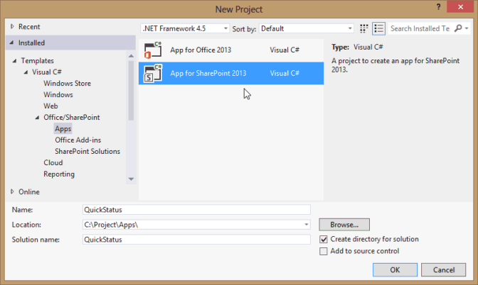
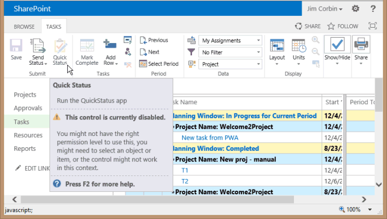

# <a name="create-a-sharepoint-hosted-project-server-add-in"></a>Создание надстройки Project Server с размещением в SharePoint

Из трех типов приложений, которые можно создать для Project Online (с автоматическим размещением, размещением у поставщика и размещением в SharePoint), проще всего создать и развернуть приложение, размещаемое в SharePoint. Приложение, размещаемое в SharePoint, не требует проверки подлинности OAuth и не использует Azure или не требует обслуживания локального сайта для ресурсов, размещаемых у поставщика. Шаблон **приложения для SharePoint 2013** в Visual Studio — это удобная платформа для разработки приложений, которые могут быть опубликованы и проданы в магазине Office или развернуты в частном каталоге приложений в SharePoint. 
  
В Project состояние — это процесс, в котором участник команды может использовать страницу "задачи" в Project Web App для отправления состояния назначенной задачи, например количество часов, отработанных в течение дня недели, затраченного на работу над задачей. Владелец назначения (обычно руководитель проекта) может утвердить или отклонить состояние. После утверждения состояния Project изменяет расписание. Приложение **QuickStatus** отображает назначенные задачи, при этом пользователь может быстро обновить процент завершения и отправить отчет о состоянии выбранных назначений для утверждения. Несмотря на то, что страница "задачи" в Project Web App обладает гораздо большим количеством функциональных возможностей, приложение **QuickStatus** является примером упрощения интерфейса. 
  
Приложение **QuickStatus** — это пример для разработчиков, оно не предназначено для использования в рабочей среде. Основная цель — показать пример разработки приложений для Project Online, а не для создания полностью функционального приложения со статусом. Более эффективный способ определения состояния см. рекомендациях в разделе [Дальнейшие действия](#pj15_StatusingApp_NextSteps).
  
Общие сведения об управлении состоянием можно узнать в разделе [ход выполнения задачи](https://support.office.com/article/Find-information-about-Project-Server-2013-8b08a414-15a7-4076-b2db-c90d0214ea7f?ui=en-US&rs=en-US&ad=US#BKMK_TaskProgress). Дополнительные сведения о разработке надстроек для SharePoint и Project Server можно найти в статье надстройки [SharePoint](https://msdn.microsoft.com/library/jj163230.aspx).

<a name="pj15_StatusingApp_Prerequisites"> </a>

## <a name="prerequisites-for-creating-an-app-for-project-server-2013"></a>Необходимые компоненты для создания приложения для Project Server 2013

Для разработки относительно простых приложений, которые можно развернуть в Project Online или локальной установки Project Server 2013, можно использовать Napa, который предоставляет среду разработки в Интернете. Для более сложных приложений, изменения ленты Project Web App и упрощения отладки во время разработки можно использовать Visual Studio 2012 или Visual Studio 2013. Например, в локальной установке можно вручную проверить черновики таблиц данных на наличие изменений в базе данных Project Server. В этой статье показано, как разрабатывать приложения с помощью Visual Studio.
  
Для разработки приложений Project Server с использованием Visual Studio требуются следующие компоненты:
  
- Проверьте, что на локальном компьютере разработчика установлены самые последние пакеты обновления и обновления Windows. Операционной системой может быть Windows 7, Windows 8, Windows Server 2008 или Windows Server 2012.
    
- На компьютере должен быть установлен сервер SharePoint Server 2013 и Project Server 2013, на котором настроена изоляция приложений и неопубликованные приложения. Для загрузки неопубликованных приложений Visual Studio позволяет временно установить приложение для отладки. Вы можете использовать локальную установку SharePoint и Project Server. Дополнительные сведения см. [в статье Настройка локальной среды разработки для приложений для SharePoint](https://msdn.microsoft.com/library/fp179923%28Office.15%29.aspx).
    
   > [!NOTE]
   > Для локальной установки настройте изолированный домен приложений *перед* созданием корпоративного каталога приложений. 
  
- Компьютер для разработки может быть удаленным компьютером, на котором установлены инструменты разработчика Office для Visual Studio 2012. Убедитесь, что вы установили самую последнюю версию; в разделе " *инструменты* " [для загрузки приложений для Office и SharePoint](https://msdn.microsoft.com/office/apps/fp123627.aspx).
    
- Убедитесь, что экземпляр Project Web App, который вы будете использовать для разработки и тестирования, доступен в браузере.
    
Сведения об использовании интерактивных средств можно найти в статье [Настройка среды для разработки приложений для SharePoint в Office 365](https://msdn.microsoft.com/library/fp161179.aspx). Пошаговое руководство по созданию простого приложения для Project Server, использующего веб-инструменты, можно найти в статье Епмсаурце Blog, посвященной [созданию первого приложения Project Server](https://epmsource.com/2012/11/20/building-your-first-project-server-app-part-zerothe-introduction/).

<a name="pj15_StatusingApp_UsingVisualStudio"> </a>

## <a name="using-visual-studio-to-create-a-project-server-app"></a>Создание приложения для Project Server с помощью Visual Studio

Инструменты разработчика Office для Visual Studio 2012 включают шаблон для приложений SharePoint, которые можно использовать с Project Server 2013. При создании решения оно содержит следующие файлы для пользовательского кода:
  
- **AppManifest.xml** с параметрами для названия приложения, области запроса разрешений и другими свойствами. Процедура 1 содержит действия для установки свойств с помощью конструктора манифеста. 
    
- **Default.aspx** в папке "Страницы" — это главная страница приложения. В процедуре 2 показано добавление HTML5-контента для приложения **QuickStatus**. 
    
- **App. js** в папке Scripts — это основной файл пользовательского кода JavaScript. В процедуре 3 описывается код JavaScript для приложения **QuickStatus** . 
    
   Если вы добавляете коммерческие элементы управления, такие как сетка на основе jQuery или элемент управления "Выбор даты", вы можете добавить ссылки на дополнительные файлы JavaScript в файле Default. aspx.
    
- **App.css** в папке "Контент" — это основной файл для настраиваемых стилей CSS3. Процедура 2 и 3 процедуры содержат сведения о каскадных таблицах стилей (CSS) для приложения **QuickStatus**. В файл Default.aspx можно добавить ссылки на дополнительные CSS-файлы. 
    
- **AppIcon. png** в папке Images — это значок 96 x 96, который приложение отображает в магазине Office или каталоге приложений. 
    
Чтобы изменить ленту Project Web App, можно добавить дополнительное действие ленты. В разделе [Пример кода приложения QuickStatus](#pj15_StatusingApp_Example) представлен полный код измененных файлов Default.aspx, App.js, App.css, Elements.xml и AppManifest.xml. 
  
### <a name="procedure-1-to-create-an-app-project-in-visual-studio"></a>Процедура 1. Создание проекта приложения в Visual Studio

1. Запустите Visual Studio 2012 от имени администратора, а затем выберите **создать проект** на начальной странице. 
    
2. В диалоговом окне **Создание проекта** разверните узлы **Шаблоны**, **Visual C#** и **Office/SharePoint**, а затем выберите пункт **Приложения**. В раскрывающемся списке целевой платформы, расположенном в верхней части центральной панели, выберите **.NET Framework 4.5**, а затем выберите **Приложение для SharePoint 2013** (см. рис. 1). 
    
3. В поле **имя** введите QuickStatus, перейдите к папке, в которой нужно сохранить приложение, а затем нажмите кнопку **ОК**.
    
   **Рис. 1. Создание приложения Project Server в Visual Studio**

   
  
4. В диалоговом окне **Создание приложения для SharePoint** заполните следующие три поля: 
    
   - В верхнем текстовом поле введите имя, которое должно отображаться в приложении Project Web App. Например, введите Быстрое обновление состояния.
    
   - Чтобы сайт использовался для отладки, введите URL-адрес экземпляра Project Web App. `https://ServerName/ProjectServerName` Например, введите (замените _ServerName_ и _прожектсервернаме_ на свои собственные значения), а затем нажмите кнопку **проверить**. Если все пройдет успешно, Visual Studio отображает сообщение **Подключение выполнено успешно**. При получении сообщения об ошибке убедитесь, что указан правильный URL-адрес Project Web App и что компьютер Project Server настроен для изоляции приложений и неопубликованных приложений. Для получения дополнительных сведений обратитесь к разделу [необходимые условия для создания приложения для Project Server 2013](#pj15_StatusingApp_Prerequisites) . 
    
   - В раскрывающемся списке **Как разместить приложение для SharePoint?** выберите **Размещение в SharePoint**.
    
   > [!CAUTION]
   > Если вы по ошибке выбрали значение по умолчанию, **С размещением у поставщика**, Visual Studio создает два проекта в решении: **QuickStatus** и **QuickStatusWeb**. Если вы видите два проекта, удалите решение и начните заново. 
  
5. Нажмите кнопку **ОК** для создания решения **QuickStatus**, проекта **QuickStatus** и файлов по умолчанию. 
    
6. Откройте представление конструктора манифеста (например, дважды щелкните файл AppManifest.xml). На вкладке **Общие** в текстовом поле **Название** должно отобразиться имя приложения, введенное на шаге 4. Откройте вкладку **Разрешения**, чтобы добавить следующие запросы разрешений для приложения (см. рис. 2): 
    
   - В первой строке списка **Запросы разрешений** в столбце **Область** выберите **Определение состояния** в раскрывающемся списке. В столбце **Разрешения** выберите **SubmitStatus**.
    
   - Добавьте строку, где **Область** — это **Несколько проектов**, а **Разрешение** — **Чтение**.
    
   **Рис. 2. Установка области разрешений для приложения определения состояния**

   
  
Приложение **QuickStatus** позволяет пользователю Project Web App считывать назначения для этого пользователя из нескольких проектов, изменять процент завершения назначения и отправить обновление. Другие области запроса разрешений, показанные в раскрывающемся списке на рисунке 2, не требуются для этого приложения. Области запросов разрешений — это разрешения, которые приложение запрашивает от имени пользователя. Если у пользователя нет таких разрешений в Project Web App, приложение не запустится. Приложение может иметь несколько областей запросов разрешений, в том числе для других разрешений SharePoint, но должно иметь только минимальное значение, необходимое для функциональных возможностей приложения. Ниже перечислены области запросов разрешений, связанные с Project Server. 

- **Корпоративные ресурсы**: разрешения диспетчера ресурсов, предназначенные для чтения и записи сведений о других пользователях Project Web App.
    
- **Несколько проектов**: чтение или запись в несколько проектов, для которых у пользователя есть запрашиваемые разрешения.
    
- **Project Server**: требуется, чтобы у пользователя приложения были разрешения администратора для Project Web App.
    
- **Создание отчетов**: Read the **ProjectData** OData Service for Project Web App (требуется только разрешение на вход для Project Web App). 
    
- **Один проект**: чтение или запись в проект, для которого у пользователя есть запрашиваемые разрешения.
    
- **Определение состояния**: отправка обновлений состояния назначений, таких как время работы, процент завершения и новых назначений.
    
- **Рабочий процесс**: если у пользователя есть разрешения для запуска рабочих процессов Project Server, приложение выполняется с повышенными привилегиями для рабочего процесса.
    
Для получения дополнительных сведений об областях запросов разрешений для Project Server 2013, ознакомьтесь с разделом *Project Apps* in [Updates for Developers in Project 2013](updates-for-developers-in-project-2013.md) и [разрешениями приложений в SharePoint 2013](https://msdn.microsoft.com/library/fp142383.aspx).


<a name="pj15_StatusingApp_HTML"> </a>

### <a name="creating-the-html-content-for-the-quickstatus-app"></a>Создание HTML-контента для приложения QuickStatus

Прежде чем приступать к кодированию содержимого HTML, разработайте пользовательский интерфейс и пользовательский интерфейс приложения QuickStatus (на рисунке 3 показан пример завершенной страницы). Проект также может включать в себя структуру функций JavaScript, которые взаимодействуют с HTML-кодом. Общие сведения можно найти в статье Проектирование пользовательского интерфейса [для приложений в SharePoint 2013](https://msdn.microsoft.com/library/fp179934.aspx).
  
**Рис. 3. Проект страницы приложения QuickStatus**


  
Приложение отображает имя в верхней части, а именно значение из элемента **Title** файла AppManifest.xml. 
  
По умолчанию страница использует HTML5. Ниже приведены стандартные HTML-элементы для основных объектов пользовательского интерфейса, которые содержатся в тексте страницы приложения **QuickStatus**: 
  
- Элемент **form** содержит все другие элементы пользовательского интерфейса. 
    
- Элемент **fieldset** создает контейнер и границу таблицы назначений, дочерний элемент **legend** предоставляет метку для контейнера. 
    
- Элемент **table** содержит название и заголовок таблицы. Функции JavaScript изменяют заголовок таблицы и добавляют строки для назначений. 
    
   > [!NOTE]
   > Чтобы легко добавить разбиение по страницам и сортировки, рабочее приложение, скорее всего, будет использовать коммерческий элемент управления сетки на основе jQuery вместо таблицы. 
  
   Таблица содержит столбцы имени проекта, имени задачи с флажком, фактических трудозатрат, процента завершения, оставшихся трудозатрат и даты окончания назначения. Функции JavaScript создают флажки и поля ввода текста для процента завершения каждой задачи.
    
- Элемент **input** для текстового поля задает процента завершения всех выбранных назначений. 
    
- Элемент **button** отправляет изменения состояния. 
    
- Элемент **button** обновляет страницу. 
    
- Элемент **Button** выполняет выход из приложения и возвращает страницу задач в Project Web App. 
    
Нижние текстовые поля и кнопки находятся в элементах **div**, чтобы таблица CSS могла легко управлять положением и внешним видом объектов пользовательского интерфейса. Функция JavaScript добавляет в нижней части страницы абзац, содержащий результаты для успешного или неудачного обновления состояния. 
  
### <a name="procedure-2-to-create-the-html-content"></a>Процедура 2. Создание HTML-контента

1. В Visual Studio откройте файл Default. aspx.
    
   Файл содержит два элемента **ASP: Content** : элемент с `ContentPlaceHolderID="PlaceHolderAdditionalPageHead"` атрибутом добавляется в заголовок страницы, а элемент с `ContentPlaceHolderID="PlaceHolderMain"` атрибутом помещается в элемент **Body** страницы. 
    
2. В `<asp:Content ContentPlaceHolderID="PlaceHolderAdditionalPageHead" runat="server">` элементе управления для заголовка страницы добавьте ссылку на файл PS. js на компьютере Project Server. Для тестирования и отладки можно использовать PS.debug.js. 
    
   ```HTML
     <script type="text/javascript" src="/_layouts/15/ps.debug.js"></script>
   ```

   В инфраструктуре приложений для `/_layouts/15/` сайта SharePoint используется виртуальный каталог в службах IIS. Физический файл `%ProgramFiles%\Common Files\Microsoft Shared\Web Server Extensions\15\TEMPLATE\LAYOUTS\PS.debug.js`.
    
   > [!NOTE]
   > Перед развертыванием приложения для использования в рабочей среде удалите `.debug` из ссылок на скрипты, чтобы увеличить производительность. 
  
3. В `<asp:Content ContentPlaceHolderID="PlaceHolderMain" runat="server">` элементе управления для текста страницы удалите созданный элемент **div** , а затем добавьте HTML-код для объектов пользовательского интерфейса. Элемент **table** содержит только строку заголовка. Столбец **Имя задачи** содержит элемент управления флажком. Текст для элемента **caption** заменяется обратным вызовом **onGetUserNameSuccess** для функции **getUserInfo** в файле App.js. 
    
    ```HTML
    <form>
        <fieldset>
        <legend>Select assigned tasks</legend>
        <table id="assignmentsTable">
            <caption id="tableCaption">Replace caption</caption>
            <thead>
            <tr id="headerRow">
                <th>Project name</th>
                <th><input type="checkbox" id="headercheckbox" checked="checked" />Task name</th>
                <th>Actual work</th>
                <th>% complete</th>
                <th>Remaining work</th>
                <th>Due date</th>
            </tr>
            </thead>
        </table>
        </fieldset>
        <div id="inputPercentComplete" >
        Set percent complete for all selected assignments, or leave this
        <br /> field blank and set percent complete for individual assignments: 
        <input type="text" name="percentComplete" id="pctComplete" size="4"  maxlength="4" />
        </div>
        <div id="submitResult">
        <p><button id="btnSubmitUpdate" type="button" class="bottomButtons" ></button></p>
        <p id="message"></p>
        </div>
        <div id="refreshPage">
        <p><button id="btnRefresh" type="button" class="bottomButtons" >Refresh</button></p>
        </div>
        <div id="exitPage">
        <p><button id="btnExit" type="button" class="bottomButtons" >Exit</button></p>
        </div>
    </form>
    ```

4. В файле App.css добавьте код CSS, определяющий положение и внешний вид элементов пользовательского интерфейса. Полный код CSS приложения **QuickStatus** см. в разделе [Пример кода для приложения QuickStatus](#pj15_StatusingApp_Example). 
    
В процедуре 3 добавляются функции JavaScript для считывания назначений и создания строк таблицы, а также для изменения и обновления процента выполнения назначения. Фактические шаги более итеративно разрабатывать приложение, где вы можете создать код HTML, добавить и протестировать связанные стили и функции JavaScript, изменить или добавить код HTML, а затем повторить этот процесс.

<a name="pj15_StatusingApp_JavaScript"> </a>

### <a name="creating-the-javascript-functions-for-the-quickstatus-app"></a>Создание функций JavaScript для приложения QuickStatus

Шаблон Visual Studio для приложения SharePoint включает в себя файл App.js, который содержит код инициализации по умолчанию, получающий контекст клиента SharePoint и демонстрирующий базовые операции получения и установки для страницы приложения. Пространство имен JavaScript для клиентской библиотеки SP. js SharePoint — **SP**. Так как приложение для Project Server использует библиотеку PS.js, приложение применяет пространство имен **PS** для получения контекста клиента и доступа к JSOM для Project Server. 
  
Функции JavaScript в приложении **QuickStatus** включают следующее: 
  
- Обработчик событий документа **ready** выполняется, когда создается экземпляр объектной модели документов (DOM). Обработчик события **ready** выполняет следующие четыре действия. 
    
    1. Инициализирует глобальную переменную **projContext** с клиентским контекстом для Project Server JSOM и глобальную переменную **pwaWeb**. 
        
    2. Вызывает функцию **getUserInfo** для инициализации глобальной переменной **projUser**. 
        
    3. Вызывает функцию **getAssignments**, которая возвращает указанные данные назначения пользователю. 
        
    4. Привязывает обработчики событий щелчка к флажку заголовка таблицы, а также к флажкам в каждой строке таблицы. Обработчики событий щелчка управляют атрибутом **checked** флажков, когда пользователь устанавливает или снимает флажки в таблице. 
    
- Если функция **getAssignments** выполнена успешно, вызывается функция **onGetAssignmentsSuccess**. Эта функция вставляет строку в таблицу для каждого назначения, инициализирует элементы управления HTML в каждой строке, а затем инициализирует свойства нижней кнопки. 
    
- Обработчик события **OnClick** для кнопки **обновления** вызывает функцию **упдатеассигнментс** . Эта функция получает значение процента завершения, которое применяется к каждому выбранному назначению; или, если текстовое поле "процент завершения" пусто, функция получает процент завершения каждого выбранного назначения в таблице. Затем функция **упдатеассигнментс** сохраняет и отправит обновления состояния и записывает сообщение о результатах в нижнюю часть страницы. 
    
### <a name="procedure-3-to-create-the-javascript-functions"></a>Процедура 3. Создание функций JavaScript

1. В Visual Studio откройте файл App.js и удалите все его содержимое.
    
2. Добавьте глобальные переменные и обработчик событий **ready**. Доступ к объекту **document** осуществляется с помощью функции jQuery. 
    
   Обработчик события щелчка для флажка заголовка таблицы задает состояние флажков строк. Если все флажки строки установлены или сняты, обработчик события щелчка задает установленное состояние флажка заголовка. Обработчики событий щелчка также задает результирующее сообщение в нижней части страницы как пустую строку.
    
   ```js
    var projContext;
    var pwaWeb;
    var projUser;
    // This code runs when the DOM is ready and creates a ProjectContext object.
    // The ProjectContext object is required to use the JSOM for Project Server.
    $(document).ready(function () {
        projContext = PS.ProjectContext.get_current();
        pwaWeb = projContext.get_web();
        getUserInfo();
        getAssignments();
        // Bind a click event handler to the table header check box, which sets the row check boxes
        // to the checked state of the header check box, and sets the results message to an empty string.
        $('#headercheckbox').live('click', function (event) {
            $('input:checkbox:not(#headercheckbox)').attr('checked', this.checked);
            $get("message").innerText = "";
        });
        // Bind a click event handler to the row check boxes. If any row check box is cleared, clear
        // the header check box. If all of the row check boxes are selected, select the header check box.
        $('input:checkbox:not(#headercheckbox)').live('click', function (event) {
            var isChecked = true;
            $('input:checkbox:not(#headercheckbox)').each(function () {
                if (this.checked == false) isChecked = false;
                $get("message").innerText = "";
            });
            $("#headercheckbox").attr('checked', isChecked);
        });
    });
   ```

3. Добавьте функцию **getUserInfo**, которая вызывает **onGetUserNameSuccess** при успешном выполнении запроса. Функция **onGetUserNameSuccess** заменяет содержимое абзаца**caption** на название таблицы, которое содержит имя пользователя. 
    
   ```js
        // Get information about the current user.
        function getUserInfo() {
            projUser = pwaWeb.get_currentUser();
            projContext.load(projUser);
            projContext.executeQueryAsync(onGetUserNameSuccess,
                // Anonymous function to execute if getUserInfo fails.
                function (sender, args) {
                    alert('Failed to get user name. Error: ' + args.get_message());
            });
        } 
        // This function is executed if the getUserInfo call is successful.
        function onGetUserNameSuccess() {
            var prefaceInfo = 'Assignments for ' + projUser.get_title();
            $('#tableCaption').text(prefaceInfo);
        }
   ```

4. Добавьте функцию **getAssignments** онжетассигнментссукцесс, которая вызывает метод **onGetAssignmentsSuccess** (см. шаг 5), если запрос на назначение выполнен успешно. Параметр **include** ограничит запрос, возвращающий только указанные поля. 
    
   ```js
    // Get the collection of assignments for the current user.
    function getAssignments() {
        assignments = PS.EnterpriseResource.getSelf(projContext).get_assignments();
        // Register the request that you want to run on the server. The optional "Include" parameter 
        // requests only the specified properties for each assignment in the collection.
        projContext.load(assignments,
            'Include(Project, Name, ActualWork, ActualWorkMilliseconds, PercentComplete, RemainingWork, Finish, Task)');
        // Run the request on the server.
        projContext.executeQueryAsync(onGetAssignmentsSuccess,
            // Anonymous function to execute if getAssignments fails.
            function (sender, args) {
                alert('Failed to get assignments. Error: ' + args.get_message());
            });
    }
   ```

5. Добавьте функцию **onGetAssignmentsSuccess**, которая добавляет строку для каждого назначения в таблицу. Переменная **prevProjName** используется для определения того, предназначена ли строка для другого проекта. В этом случае имя проекта отображается полужирным шрифтом, в противном случае имя проекта — это пустая строка. 
    
   > [!NOTE]
   > JSOM не включает свойства **TimeSpan** , включаемые в CSOM, такие как **актуалворктимеспан**. Вместо них JSOM использует свойства, определяющие время в миллисекундах, например [PS.StatusAssignment.actualWorkMilliseconds](https://msdn.microsoft.com/library/736bce1e-f734-0efe-6c5f-e0e891ab00ef%28Office.15%29.aspx). Метод, получающий свойство, **—\_Get актуалворкмиллисекондс**, который возвращает целое значение. > метод **get_actualWork** возвращает строку, например "3h". В приложении **QuickStatus** можно использовать оба значения, но отображать их по-разному. Запрос назначений содержит оба свойства, благодаря чему можно проверить значение во время отладки. Если удалить переменную **actualWork**, можно также удалить свойство **ActualWork** из запроса назначения. 
  
   Наконец, функция **onGetAssignmentsSuccess** инициализирует кнопки **Update** и **Refresh** с обработчиками события щелчка. Текстовое значение кнопки **Update** кнопки можно задать в HTML-коде. 
    
   ```js
        // Get the enumerator, iterate through the assignment collection, 
        // and add each assignment to the table.
        function onGetAssignmentsSuccess(sender, args) {
            if (assignments.get_count() > 0) {
                var assignmentsEnumerator = assignments.getEnumerator();
                var projName = "";
                var prevProjName = "3D2A8045-4920-4B31-B3E7-9D0C5195FC70"; // Any unique name.
                var taskNum = 0;
                var chkTask = "";
                var txtPctComplete = "";
                // Constants for creating input controls in the table.
                var INPUTCHK = '<input type="checkbox" class="chkTask" checked="checked" id="chk';
                var LBLCHK = '<label for="chk';
                var INPUTTXT = '<input type="text" size="4"  maxlength="4" class="txtPctComplete" id="txt';
                while (assignmentsEnumerator.moveNext()) {
                    var statusAssignment = assignmentsEnumerator.get_current();
                    projName = statusAssignment.get_project().get_name();
                    // Get an integer, such as 3600000.
                    var actualWorkMilliseconds = statusAssignment.get_actualWorkMilliseconds(); 
                    // Get a string, such as "1h". Not used here.
                    var actualWork = statusAssignment.get_actualWork();
                    if (projName === prevProjName) {
                        projName = "";
                    }
                    prevProjName = statusAssignment.get_project().get_name();
                    // Create a row for the assignment information.
                    var row = assignmentsTable.insertRow();
                    taskNum++;
                    // Create an HTML string with a check box and task name label, for example:
                    // <input type="checkbox" class="chkTask" checked="checked" id="chk1" /> <label for="chk1">Task 1</label>
                    chkTask = INPUTCHK + taskNum + '" /> ' + LBLCHK + taskNum + '">' 
                        + statusAssignment.get_name() + '</label>';
                    txtPctComplete = INPUTTXT + taskNum + '" />';
                    // Insert cells for the assignment properties.
                    row.insertCell().innerHTML = '<strong>' + projName + '</strong>';
                    row.insertCell().innerHTML = chkTask;
                    row.insertCell().innerText = actualWorkMilliseconds / 3600000 + 'h';
                    row.insertCell().innerHTML = txtPctComplete;
                    row.insertCell().innerText = statusAssignment.get_remainingWork();
                    row.insertCell().innerText = statusAssignment.get_finish();
                    // Initialize the percent complete cell.
                    $get("txt" + taskNum).innerText = statusAssignment.get_percentComplete() + '%'
                }
            }
            else {
                $('p#message').attr('style', 'color: #0f3fdb');     // Blue text.
                $get("message").innerText = projUser.get_title() + ' has no assignments'
            }
            // Initialize the button properties.
            $get("btnSubmitUpdate").onclick = function() { updateAssignments(); };
            $get("btnSubmitUpdate").innerText = 'Update';
            $get('btnRefresh').onclick = function () { window.location.reload(true); };
            $get('btnExit').onclick = function () { exitToPwa(); };
        }
   ```

6. Добавьте обработчик события щелчка **updateAssignments** для кнопки **Update**. Если пользователь изменяет процент завершения задачи или добавляет значение в текстовом поле **percentComplete**, значение можно ввести в различных форматах, например как "60", "60%" или "60 %". Метод **getNumericValue** возвращает введенный текст как числовое значение. 
    
   > [!NOTE]
   > В приложении для рабочей среды следует реализовать проверку вводимого текста и дополнительную проверку на наличие ошибок. 
  
   Пример **updateAssignments** применяет базовую проверку ошибок и отображает информацию в абзаце **message** в нижней части страницы — зеленым цветом, если запрос на обновление выполнен успешно, и красным цветом, если при вводе или выполнении запроса на обновление возникла ошибка. 
    
   Перед использованием метода **submitAllStatusUpdates** приложение должно сохранить обновления на сервере с помощью метода **PS.StatusAssignmentCollection.update**. 
    
   ```js
        // Update all checked assignments. If the bottom percent complete field is blank,
        // use the value in the % complete field of each selected row in the table.
        function updateAssignments() {
            // Get percent complete from the bottom text box.
            var pctCompleteMain = getNumericValue($('#pctComplete').val()).trim();
            var pctComplete = pctCompleteMain;
            var assignmentsEnumerator = assignments.getEnumerator();
            var taskNum = 0;
            var taskRow = "";
            var indexPercent = "";
            var doSubmit = true;
            while (assignmentsEnumerator.moveNext()) {
                var pctCompleteRow = "";
                taskRow = "chk" + ++taskNum;
                if ($get(taskRow).checked) {
                    var statusAssignment = assignmentsEnumerator.get_current();
                    if (pctCompleteMain === "") {
                        // Get percent complete from the text box field in the table row.
                        pctCompleteRow = getNumericValue($('#txt' + taskNum).val());
                        pctComplete = pctCompleteRow;
                    }
                    // If both percent complete fields are empty, show an error.
                    if (pctCompleteMain === "" && pctCompleteRow === "") {
                        $('p#message').attr('style', 'color: #e11500');     // Red text.
                        $get("message").innerHTML =
                            '<b>Error:</b> Both <i>Percent complete</i> fields are empty, in row '
                            + taskNum
                            + ' and in the bottom textbox.<br/>One of those fields must have a valid percent.'
                            + '<p>Please refresh the page and try again.</p>';
                        doSubmit = false;
                        taskNum = 0;
                        break;
                    }
                    if (doSubmit) statusAssignment.set_percentComplete(pctComplete);
                }
            } 
            // Save and submit the assignment updates.
            if (doSubmit) {
                assignments.update();
                assignments.submitAllStatusUpdates();
                projContext.executeQueryAsync(function (source, args) {
                    $('p#message').attr('style', 'color: #0faa0d');     // Green text.
                    $get("message").innerText = 'Assignments have been updated.';
                }, function (source, args) {
                    $('p#message').attr('style', 'color: #e11500');     // Red text.
                    $get("message").innerText = 'Error updating assignments: ' + args.get_message();
                });
            }
        }
        // Get the numeric part for percent complete, from a string. For example, with "20 %", return "20".
        function getNumericValue(pctComplete) {
            pctComplete = pctComplete.trim();
            pctComplete = pctComplete.replace(/ /g, "");    // Remove interior spaces.
            indexPercent = pctComplete.indexOf('%', 0);
            if (indexPercent > -1) pctComplete = pctComplete.substring(0, indexPercent);
            return pctComplete;
        }
   ```

7. Добавьте функцию **екситтопва** , которая использует параметр строки запроса **SPHostUrl** для URL-адреса сайта ведущего Project Web App. Чтобы вернуться к странице "задачи", добавьте `"/Tasks.aspx"` к URL-адресу. Например, переменной **spHostUrl** будет присвоено значение `https://ServerName/ProjectServerName/Tasks.aspx`.
    
   Функция **getQueryStringParameter** разбивает URL-адрес страницы **QuickStatus** для извлечения и возврата указанного параметра в параметрах URL-адреса. Ниже приведен пример значения **document.URL** для документа **QuickStatus** (все в одной строке): 
    
   ```HTML
    https://app-ef98082fa37e3c.servername.officeapps.selfhost.corp.microsoft.com/pwa/
        QuickStatus/Pages/Default.aspx
        ?SPHostUrl=https%3A%2F%2Fsphvm%2D85178%2Fpwa
        &SPLanguage=en%2DUS
        &SPClientTag=1
        &SPProductNumber=15%2E0%2E4420%2E1022
        &SPAppWebUrl=https%3A%2F%2Fapp%2Def98082fa37e3c%2Eservername
            %2Eofficeapps%2Eselfhost%2Ecorp%2Emicrosoft%2Ecom%2Fpwa%2FQuickStatus
   ```

   Для предыдущего URL-адреса функция **жеткуеристрингпараметер** возвращает значение строки запроса **SPHostUrl** , `https://ServerName/pwa`. 
    
   ```js
        // Exit the QuickStatus page and go back to the Tasks page in Project Web App.
        function exitToPwa() {
            // Get the SharePoint host URL, which is the top page of PWA, and add the Tasks page.
            var spHostUrl = decodeURIComponent(getQueryStringParameter('SPHostUrl'))
                            + "/Tasks.aspx";
            // Set the top window for the QuickStatus IFrame to the Tasks page.
            window.top.location.href = spHostUrl;
        }
        // Get a specified query string parameter from the {StandardTokens} URL option string.
        function getQueryStringParameter(urlParameterKey) {
            var docUrl = document.URL;
            var params = docUrl.split('?')[1].split('&');
            for (var i = 0; i < params.length; i++) {
                var theParam = params[i].split('=');
                if (theParam[0] == urlParameterKey)
                    return decodeURIComponent(theParam[1]);
            }
        }
   ```

Если вы публикуете приложение **QuickStatus** на этом шаге и добавляете его в Project Web App, приложение можно запустить на странице "содержимое сайта", но оно недоступно для пользователей. Чтобы помочь пользователям, можно добавить кнопку приложения на ленту на странице "Задачи". В процедуре 4 показано, как добавить настраиваемое действие ленты. 

<a name="pj15_StatusingApp_ribbon"> </a>

### <a name="adding-a-ribbon-custom-action"></a>Добавление настраиваемого действия на ленте

Вкладки, группы и элементы управления ленты для Project Web App указаны в файле файле pwaribbon. XML, который устанавливается в `[Program Files]\Common Files\Microsoft Shared\Web Server Extensions\15\TEMPLATE\FEATURES\PWARibbon\listtemplates` каталоге на компьютере, на котором работает Project Server. Для разработки дополнительных действий на ленте Project Web App Загрузка пакета SDK для Project 2013 включает копию файла файле pwaribbon. XML. 
  
Project Web App использует различные определения ленты на странице "задачи" в зависимости от того, использует ли экземпляр Project Web App режим одной операции, позволяющий пользователям вводить значения как для расписания, так и для состояния задачи. Если у вас есть разрешения администратора для Project Web App, для определения режима записи выберите **Параметры PWA** в раскрывающемся меню Параметры в правом верхнем углу страницы. На странице "Параметры PWA" выберите **Параметры и значения по умолчанию для расписания** и посмотрите на флажок **Режим одной операции** в нижней части страницы. 
  
Если режим одной операции отключен, ленту на странице "Задачи" определяет область Моя работа в файле pwaribbon.xml: 
  
```XML
   <!-- REGION My Work Ribbon-->
   <CustomAction
      Id="Ribbon.ContextualTabs.MyWork"
      . . .
```

Если режим одной операции включен, ленту на странице "Задачи" определяет область Связанный режим в файле pwaribbon.xml: 
  
```XML
   <!-- REGION Tied Mode Ribbon-->
   <CustomAction
      Id="Ribbon.ContextualTabs.TiedMode"
      . . .
```

Хотя группы и элементы управления в каждой области похожи друг на друга, элемент управления для связанного режима может вызывать функции, отличные от функций того же элемента управления в другом режиме. В процедуре 4 показано, как добавить элемент управления "Кнопка" для приложения **QuickStatus**, если режим одной операции выключен (флажок **Режим одной операции** не установлен). 
  
> [!NOTE]
> Общие сведения о добавлении настраиваемых действий на ленту или в меню в приложении SharePoint можно найти в статье [Создание настраиваемых действий для развертывания с помощью приложений для SharePoint](https://msdn.microsoft.com/library/jj163954.aspx). 
  
### <a name="procedure-4-to-add-a-ribbon-custom-action-to-the-tasks-page"></a>Процедура 4. Добавление настраиваемого действия ленты на страницу "Задачи"

1. Проверьте ленту на странице "задачи" в Project Web App. Откройте вкладку **ЗАДАЧИ** на ленте и спланируйте, как ее изменить. Существует семь групп, таких как **Отправить**, **Задачи** и **Период**. Группа **Отправить** содержит два элемента управления: кнопка **Сохранить** и раскрывающееся меню **Отправить состояние**. Вы можете добавить элемент управления в любом месте в группе, добавить группу с новым элементом управления в любое место на вкладке **ЗАДАЧИ** или добавить другую вкладку с настраиваемыми группами и элементами управления. В этом примере мы добавляем третью кнопку для группы **Отправить**, которая вызывает URL-адрес приложения **QuickStatus**. 
    
2. В области **Обозреватель решений** в Visual Studio щелкните правой кнопкой мыши проект **QuickStatus** и добавьте новый элемент. В диалоговом окне **Добавление нового элемента** выберите пункт **настраиваемое действие ленты** (см. рисунок 4). Например, введите имя настраиваемого действия Риббонкуиккстатусактион, а затем нажмите кнопку **Добавить**.
    
   **Рис. 4. Добавление настраиваемого действия ленты**

   
  
3. На первой странице мастера **создания настраиваемого действия ленты** оставьте параметр **Хост-сайт** выбранным, выберите **Нет** в раскрывающемся списке в качестве области настраиваемого действия, а затем нажмите кнопку **Далее** (см. рис. 5). Элементы раскрывающихся списков относятся к SharePoint, а не к Project Server. Мы заменим большую часть созданного XML для настраиваемого действия, чтобы применить XML к Project Server. 
    
   **Рис. 5. Указание свойств для настраиваемого действия ленты**

   
  
4. На следующей странице мастера **создания настраиваемого действия ленты** оставьте все значения параметров по умолчанию, а затем нажмите кнопку **Готово** (см. рис. 6). Visual Studio создаст папку **RibbonQuickStatusAction**, которая содержит файл Elements.xml. 
    
   **Рис. 6. Указание параметров для элемента управления "Кнопка"**

   
  
5. Измените созданный по умолчанию код в файле Elements.xml для настраиваемого действия ленты. Ниже приведен XML-код по умолчанию.
    
   ```XML
    <?xml version="1.0" encoding="utf-8"?>
    <Elements xmlns="http://schemas.microsoft.com/sharepoint/">
        <CustomAction Id="21ea3aaf-79e5-4aac-9479-8eef14b4d9df.RibbonQuickStatusAction"
                    Location="CommandUI.Ribbon"
                    Sequence="10001"
                    Title="Invoke &apos;RibbonQuickStatusAction&apos; action">
        <CommandUIExtension>
            <!-- 
            Update the UI definitions below with the controls and the command actions
            that you want to enable for the custom action.
            -->
            <CommandUIDefinitions>
            <CommandUIDefinition Location="Ribbon.ListItem.Actions.Controls._children">
                <Button Id="Ribbon.ListItem.Actions.RibbonQuickStatusActionButton"
                        Alt="Request RibbonQuickStatusAction"
                        Sequence="100"
                        Command="Invoke_RibbonQuickStatusActionButtonRequest"
                        LabelText="Request RibbonQuickStatusAction"
                        TemplateAlias="o1"
                        Image32by32="_layouts/15/images/placeholder32x32.png"
                        Image16by16="_layouts/15/images/placeholder16x16.png" />
            </CommandUIDefinition>
            </CommandUIDefinitions>
            <CommandUIHandlers>
            <CommandUIHandler Command="Invoke_RibbonQuickStatusActionButtonRequest"
                                CommandAction="~appWebUrl/Pages/Default.aspx"/>
            </CommandUIHandlers>
        </CommandUIExtension >
        </CustomAction>
    </Elements>
   ```

   1. В элементе **CustomAction** удалите атрибуты **Sequence** и **Title**. 
    
   2. Чтобы добавить элемент управления в группу **отсылки** , найдите первую группу в `Ribbon.ContextualTabs.MyWork.Home.Groups` коллекции в файле файле pwaribbon. XML, который начинается с этого элемента. `<Group Id="Ribbon.ContextualTabs.MyWork.Home.Page" Command="PageGroup" Sequence="10" Title="$Resources:pwafeatures,PAGE_PDP_CM_SUBMIT"` Чтобы добавить дочерний элемент управления в группу **отсылки** , в следующем коде показан правильный атрибут **Location** элемента **CommandUIDefinition** в файле Elements. XML: 
    
      ```XML
        <CommandUIDefinitions>
          <CommandUIDefinition Location="Ribbon.ContextualTabs.MyWork.Home.Page.Controls._children">
             . . .
          </CommandUIDefinition>
        </CommandUIDefinitions>
      ```

   3. Измените значения атрибутов дочернего элемента **Button** следующим образом: 
    
       ```XML
            <Button Id="Ribbon.ContextualTabs.MyWork.Home.Page.QuickStatus"
                    Alt="Quick Status app"
                    Sequence="30"
                    Command="Invoke_QuickStatus"
                    LabelText="Quick Status"
                    TemplateAlias="o1"
                    Image16by16="_layouts/15/1033/images/ps16x16.png" 
                    Image16by16Left="-80"
                    Image16by16Top="-144"
                    Image32by32="_layouts/15/1033/images/ps32x32.png" 
                    Image32by32Left="-32"
                    Image32by32Top="-288" 
                    ToolTipTitle="QuickStatus"
                    ToolTipDescription="Run the QuickStatus app" />
       ```

       - Чтобы сделать кнопку третьим элементом управления в группе, атрибут **Sequence** может иметь любое число, `Sequence="20"` превышающее значение существующего элемента управления **состоянием отправки** (элемент **флйоутанчор** в файле pwaribbon. XML). По соглашению порядковые номера групп и элементов управления `10, 20, 30, …`, позволяющие вставлять элементы в промежуточные позиции.
    
       - Атрибут **Command** указывает команду, которую необходимо выполнить в элементе **CommandUIHandler** (см. шаг 5. d). Вы можете упростить имя команды для упрощения следующего разработчика. Например `Command="Invoke_QuickStatus"` , легче читать, чем `Command="Invoke_RibbonQuickStatusActionButtonRequest"`.
    
       - Атрибуты изображения задают значок 16 x 16 пикселов и значок 32 x 32 x для элемента управления Button. В файле Defaults. XML `Image32by32="_layouts/15/images/placeholder32x32.png"` указывает оранжевые точки. Вы можете извлечь значки из файлов карты изображений (ps16x16. png и ps32x32. png), которые установлены в `[Program Files]\Common Files\Microsoft Shared\Web Server Extensions\15\TEMPLATE\LAYOUTS\1033\IMAGES` каталоге на компьютере, на котором работает Project Server. Например, значок 32 x 32-пиксель находится во втором столбце значков слева и десятой строке, начиная с верхней границы карты изображений ps32x32. png (верхняя часть значка находится после конца девятой строки; 9 строк x 32 пикселей/строка = 288 пикселя). 
    
       - Для отображения всплывающей подсказки для элемента управления "Кнопка" добавьте атрибуты **ToolTipTitle** и **ToolTipDescription**. 
    
    4. Измените атрибуты элемента **CommandUIHandler**. Например, убедитесь, что атрибут **Command** соответствует значению атрибута **Command** элемента **Button**. Для атрибута **CommandAction** `~appWebUrl` — это URL-адрес веб-страницы **QuickStatus** . Когда кнопка ленты вызывает приложение **QuickStatus**, маркер **{StandardTokens}** заменяется параметрами URL-адреса, а именно **SPHostUrl**, **SPLanguage**, **SPClientTag**, **SPProductNumber** и **SPAppWebUrl**.
    
        ```XML
            <CommandUIHandlers>
                <CommandUIHandler Command="Invoke_QuickStatus"
                                  CommandAction="~appWebUrl/Pages/Default.aspx?{StandardTokens}"/>
            </CommandUIHandlers>
        ```

6. В **обозревателе решений**откройте конструктор **Feature1.feature** и переместите элемент **RibbonQuickStatusAction** из области **Элементы в решении** в область **Элементы в компоненте**. При открытии конструктора **Package.package** элемент **RibbonQuickStatusAction** будет находиться в области **Элементы в пакете**. 
    
Когда вы разрабатываете приложение и добавляете кнопку ленты, вы обычно тестируете приложение и устанавливаете точки останова в коде JavaScript для отладки. После нажатия клавиши **F5** Visual Studio компилирует приложение, развертывает его на сайте, который указан в свойстве **URL-адрес сайта** проекта **QuickStatus**, и отображает страницу с вопросом о том, доверяете ли вы приложению. Когда вы продолжите, а затем выйдите из приложения **QuickStatus** , он вернется на страницу задач в Project Web App. 

> [!NOTE]
> На рисунке 7 показано, что кнопка " **быстрое состояние** " на вкладке " **задачи** " ленты отключена. После многих развертываний отладки в Visual Studio настраиваемые элементы управления ленты могут быть заблокированы при отладке или развертывании опубликованного приложения на том же тестовом сервере. Чтобы включить кнопку, удалите элемент **риббонкуиккстатусактион** в Visual Studio, а затем создайте новое действие ленты с другим именем и идентификатором. Если проблема не устранена, попытайтесь удалить приложение из тестового экземпляра Project Web App, а затем повторно создайте приложение с другим ИДЕНТИФИКАТОРом приложения. 
  
**Рис. 7. Просмотр подсказки отключенной кнопки "Quick Status"**


  
В процедуре 5 показано, как развернуть и установить приложение **QuickStatus**. В процедуре 6 показаны некоторые дополнительные действия для тестирования приложения после его установки. 

<a name="pj15_StatusingApp_Deploying"> </a>

## <a name="deploying-the-quickstatus-app"></a>Развертывание приложения QuickStatus

Существует несколько способов развертывания приложения в веб-приложении SharePoint, например Project Web App. Выбор используемого развертывания зависит от того, хотите ли вы опубликовать приложение в частном каталоге SharePoint или в общедоступном магазине Office, а также от того, установлен ли SharePoint в локальной среде или в сети. В процедуре 5 показано, как развернуть приложение **QuickStatus** для локальной установки в частном каталоге приложений. Дополнительные сведения см. в [статье Установка и настройка приложений для sharepoint 2013](https://technet.microsoft.com/library/fp161232.aspx) и [Публикация приложений для SharePoint](https://msdn.microsoft.com/library/jj164070.aspx)
  
> [!NOTE]
> Для добавления приложения в каталог SharePoint требуются разрешения администратора SharePoint. 
  
### <a name="procedure-5-to-deploy-the-quickstatus-app"></a>Процедура 5. Развертывание приложения QuickStatus

1. Сохраните все файлы в Visual Studio, а затем щелкните правой кнопкой мыши проект **QuickStatus** в **обозревателе решений** и выберите команду **Опубликовать**.
    
2. Так как приложение **QuickStatus** размещается в SharePoint, существует очень немного вариантов публикации (см. рисунок 8). В диалоговом окне **Публикация приложений для Office и SharePoint** нажмите кнопку **Готово**.
    
   **Рис. 8. Публикация приложения QuickStatus**

   
  
3. Скопируйте файл QuickStatus. app из `~\QuickStatus\bin\Debug\app.publish\1.0.0.0` каталога в удобный каталог на локальном компьютере (или на компьютер SharePoint для локальной установки). 
    
4. В центре администрирования SharePoint выберите **Приложения** на панели быстрого запуска и щелкните **Управление каталогом приложений**.
    
5. Если каталог приложений не существует, создайте семейство веб-сайтов для каталога приложений, следуя разделу *Настройка сайта каталога приложений для веб-приложения* в разделе [Управление каталогом приложений в SharePoint 2013](https://technet.microsoft.com/library/fp161234.aspx).
    
   Если каталог приложений существует, перейдите на URL-адрес сайта на странице "Управление каталогом приложений". Например, на приведенных ниже шагах сайт каталога приложений — это `https://ServerName/sites/TestApps`.
    
6. На странице каталога приложений выберите **Приложения для SharePoint** на панели быстрого запуска. На странице "Приложения для SharePoint" откройте вкладку **ФАЙЛЫ** на ленте и нажмите кнопку **Отправить документ**.
    
7. В диалоговом окне **Добавление документа** найдите файл QuickStatus.app, добавьте комментарии для версии, а затем нажмите **ОК**.
    
8. При добавлении приложения также можно добавить локальные данные, например описание приложения, значок и другие сведения. В диалоговом окне **приложения для SharePoint-QuickStatus. app** добавьте сведения, которые требуется отобразить для приложения в семействе веб-сайтов SharePoint. Например, добавьте следующие сведения: 
    
   1. Поле **Краткое описание** : Введите тестовое приложение быстрого состояния.
    
   2. Поле **Description** : введите test App, чтобы обновить процент завершения для задач в нескольких проектах.
    
   3. Поля **URL-адреса значков** : добавьте изображение 96 x 96-пиксель для значка приложения в ресурсы сайта каталога приложений. `https://ServerName/sites/TestApps`Например, перейдите к разделу " **содержимое сайта** " в раскрывающемся меню **Параметры** , выберите **ресурсы сайта**и добавьте изображение куиккстатусапп. png. Щелкните элемент **куиккстатусапп** правой кнопкой мыши, выберите пункт **свойства**, а затем СКОПИРУЙТЕ значение **Address (URL)** в диалоговом окне **Свойства** . Например, скопируйте `https://ServerName/sites/TestApps/SiteAssets/QuickStatusApp.png`и вставьте значение в поле веб-адрес URL-адрес **значка** . Введите описание значка, например (как показано на рис. 9), введите QuickStatus App Icon (как показано на рис. 9). Проверьте правильность URL-адреса.
    
      **Рис. 9. Добавление URL-адреса значка для приложения QuickStatus**

      
  
   4. Поле **Категория**: выберите существующую категорию или укажите свое значение. Например, введите Определение состояния.
    
      > [!NOTE]
      > Категория с именем **Определение состояния** предназначена только для тестирования. Типичная категория для приложения Project Server — **Управление проектами**. 
  
   5. Поле **Имя издателя**: введите имя издателя. В этом примере введите Project SDK.
    
   6. **Включенное** поле: чтобы приложение было видимо для установки в разделе "Администраторы сайта Project Web App", установите флажок **включено** . 
    
   7. Дополнительные поля необязательны. Например, можно добавить URL-адрес службы поддержки и несколько изображений для страницы сведений о приложении. На рис. 9 поле **URL-адрес изображения 1** содержит URL-адрес снимка экрана приложения и его описание. 
    
   8. В диалоговом окне **приложения для SharePoint — QuickStatus. app** нажмите кнопку **сохранить**. На рисунке 9 элемент " **краткий статус** " в библиотеке приложений для SharePoint извлечен для редактирования, поэтому на вкладке **изменение** ленты диалогового окна можно выбрать команду **вернуть** , чтобы завершить процесс (см. рис. 10). 
    
      **Рис. 10. Приложение QuickStatus добавлено в библиотеку приложений для SharePoint.**

      
  
9. В Project Web App в раскрывающемся меню **Параметры** выберите пункт **Добавить приложение**. На странице "приложения" в панели быстрого запуска выберите **из вашей организации**, а затем выберите **сведения о приложении** для приложения " **быстрое обновление состояния** ". На рисунке 11 показана страница сведений с значком приложения, снимком экрана и другой информацией, добавленной на предыдущем шаге. 
    
   **Рис. 11. Использование страницы сведений о приложении "Quick Status Update" в Project Web App**

   
  
10. На странице сведения об обновлении быстрого состояния нажмите **Добавить**. В Project Web App отображается диалоговое окно со списком операций, которые может выполнить приложение QuickStatus (см рисунок рис. 12). Список операций является производным от элементов **AppPermissionRequest** в файле AppManifest. XML. 
    
    **Рис. 12. Проверка доверия приложению Quick Status**

    
  
11. В диалоговом окне **быстрое обновление состояния** выберите **доверять**. Приложение добавляется на страницу содержимого сайта Project Web App (см. рисунок 13).
    
    **Рис. 13. Просмотр приложения "Quick Status" на странице "Контент сайта"**

    
  
На странице "Контент сайта" щелкните значок **Quick Status Update**, чтобы запустить приложение.

> [!NOTE]
> Для получения дополнительных команд, которые предоставляют сведения о приложении, на странице "содержимое сайта" выберите регион, **содержащий имя и** многоточие (...). Вы можете ознакомиться со страницей "сведения о приложении", просмотреть страницу сведений о приложении, содержащую сведения об ошибках приложений, просмотреть страницу разрешений приложения или удалить приложение из Project Web App. 
  
На странице "задачи" в Project Web App (см. рисунок 14) на ленте должна быть включена кнопка **QuickStatus** . Если кнопка **быстрого состояния** отключена, выполните действия, описанные в заметке на рисунке 7. 

**Рис. 14. Запуск приложения QuickStatus на вкладке "ЗАДАЧИ"**


  
В процедуре 6 показано несколько тестов для проверки приложения QuickStatus.

<a name="pj15_StatusingApp_Testing"> </a>

## <a name="testing-the-quickstatus-app"></a>Тестирование приложения QuickStatus

Каждая операция, которую может выполнить пользователь в приложении **QuickStatus** , должна тестироваться в тестовой установке Project Server перед развертыванием приложения на рабочем сервере или в рабочем клиенте Project Online. Тестовая установка позволяет изменять и удалять назначения для пользователей, не влияя на фактические проекты. В тестирование также следует включить несколько пользователей с различными наборами разрешений, например администратора, руководителя проекта и участника группы. Тщательное тестирование поможет обнаружить изменения, которые необходимо внести в приложение, которые не были очевидны при тестировании во время разработки. В процедуре 6 показано всего несколько тестов для приложения **QuickStatus**, а полный исчерпывающий ряд проверок. 
  
### <a name="procedure-6-to-test-the-quickstatus-app"></a>Процедура 6. Тестирование приложения QuickStatus

1. Запустите приложение **QuickStatus**, при этом у пользователя нет назначений. Приложения должно показать сообщение синим цветом в нижней части страницы, например **У имени пользователя нет назначений**.
    
   Нажмите кнопку **Update**, после чего сообщение изменится на зеленое сообщение **Assignments have been updated**.
    
   > [!NOTE]
   > Поведение приложения необходимо изменить, чтобы отключить кнопку **Update**, если назначений не существует. 
  
2. Запустите приложение, в котором у пользователя несколько назначений в различных проектах, при этом некоторые назначения не завершены. Обратите внимание на внешний вид приложения и выполните следующие действия (см. рис. 15).
    
   1. Функция **onGetAssignmentsSuccess** создает строку в таблице для каждого назначения текущего пользователя. Имя проекта показано только один раз полужирным шрифтом для первого назначения в каждом проекте. 
    
   2. Снимите флажок в заголовке столбца **Имя задачи**. Обработчик события щелчка заголовка таблицы снимает все другие флажки в строках задач. 
    
   3. Выберите все задачи. Обработчик события щелчка для каждой строки определяет, выбраны ли все строки, и, если это так, выбирает заголовок столбца **Имя задачи**. 
    
   4. Снимите все флажки еще раз и выберите одно назначение с оставшимися трудозатратами. Например, на рис. 15 показана задача T1 с 20 % оставшихся трудозатрат.
    
   5. В текстовом поле **задать процент завершения** введите 80, а затем нажмите кнопку **Обновить**. Внизу страницы появится зеленое сообщение **Assignments have been updated**.
    
      **Рис. 15. Обновление назначения в приложении QuickStatus**

      
  
3. Нажмите кнопку **Обновить** (см рис. 16). Все задачи выделены повторно, а верхняя задача показывает 80% завершено. 
    
      **Рис. 16. Обновление страницы "Quick Status Update"**

      
  
4. Снимите все флажки и выберите другую задачу. Например, выберите **New task from PWA**. Оставьте поле **Set percent complete** пустым, удалите весь текст в столбце **% complete** для выбранной задачи, а затем нажмите **Update**. Так как оба поля пусты, приложение отображает красное сообщение об ошибке (см. рис. 17).
    
      **Рис. 17. Тестирование сообщения об ошибке**

      
  
5. Обновите предыдущую задачу до 80% завершения, а затем нажмите кнопку **выход**. Функция **екситтопва** изменяет расположение окна браузера на страницу Tasks в ведущем приложении SharePoint (то есть URL-адрес меняется на https://ServerName/pwa/Tasks.aspx). На рисунке 18 показано, что задача **T1** и **Новая задача в** задаче PWA каждый показ 80% завершен. 
    
      **Рис. 18. Проверка обновления задач в Project Web App**

      
  
6. Перед отображением обновленного состояния в Project профессиональный 2013 изменения должны быть отправлены на утверждение, а затем утверждены руководителем проекта.
    
Тестирование показывает несколько изменений, которые необходимо внести в приложение **QuickStatus** для повышения удобства использования. Например:

- Следует реализовать дополнительные проверки ошибок и значений текстовых полей. В настоящее время пользователь может ввести нечисловое или отрицательное значение процента завершения, что приводит к сообщению об ошибке. Например, для отрицательного значения отображается сообщение об ошибке **Ошибка обновления назначений: PJClientCallableException: StatusingSetDataValueInvalid**.
    
- В сообщении об ошибке для пустых текстовых полей могут перечисляться проекты и задачи, а также номер строки.
    
- Сообщение об успешном выполнении может включать в себя список обновленных задач или, если функция **updateAssignments** выполнена успешно, она может обновить страниц автоматически и показать обновленные задачи или процентные значения другим цветом и полужирным шрифтом. 
    
- Чтобы избежать получения очень большой таблицы, в таблице назначений следует добавлять только задачи, выполненные не на 100 %. Или можно добавить параметр для отображения всех задач. Эту проблему также можно устранить, используя сетку на основе jQuery вместо таблицы, где вы легко можете реализовать фильтрацию и разбиения таблицы по страницам.
    
- Так как приложение **QuickStatus** не отправляет отчет о состоянии, значок **Quick Status** на вкладке **ЗАДАЧИ** ленты будет логичнее сделать первым значком в группе **ЗАДАЧИ**, а не последним значком в группе **Отправить**. 
    
- Так как функция **onGetAssignmentsSuccess** инициализирует текст кнопки **btnSubmitUpdate**, но другие текстовые значения кнопки инициализируются в HTML, страница остается в частично инициализированном состоянии при выполнении функции **getAssignments**. Кнопки на странице будут более согласованными, если текстовые значения инициализировать в HTML. 
    
Самое главное, подход, используемый приложением **QuickStatus**, где оно изменяет процент завершения для назначений, следует изменить в рабочем приложении. Дополнительные сведения см. в разделе [Дальнейшие действия](#pj15_StatusingApp_NextSteps). 

<a name="pj15_StatusingApp_Example"> </a>

## <a name="example-code-for-the-quickstatus-app"></a>Пример кода для приложения QuickStatus

### <a name="defaultaspx-file"></a>Файл Default.aspx.

Следующий код находится в `Pages\Default.aspx` файле проекта **QuickStatus** : 
  
```HTML
    <%-- The following lines are ASP.NET directives needed when using SharePoint components --%>
    <%@ Page Inherits="Microsoft.SharePoint.WebPartPages.WebPartPage, Microsoft.SharePoint, Version=15.0.0.0, 
    Culture=neutral, PublicKeyToken=71e9bce111e9429c" MasterPageFile="~masterurl/default.master" Language="C#" %>
    <%@ Register TagPrefix="Utilities" Namespace="Microsoft.SharePoint.Utilities" Assembly="Microsoft.SharePoint, Version=15.0.0.0, 
    Culture=neutral, PublicKeyToken=71e9bce111e9429c" %>
    <%@ Register TagPrefix="WebPartPages" Namespace="Microsoft.SharePoint.WebPartPages" Assembly="Microsoft.SharePoint, Version=15.0.0.0, 
    Culture=neutral, PublicKeyToken=71e9bce111e9429c" %>
    <%@ Register TagPrefix="SharePoint" Namespace="Microsoft.SharePoint.WebControls" Assembly="Microsoft.SharePoint, Version=15.0.0.0, 
    Culture=neutral, PublicKeyToken=71e9bce111e9429c" %>
    <%-- The markup and script in the following Content element will be placed in the <head> of the page.
        For production deployment, change the .debug.js JavaScript references to .js. --%>
    <asp:Content ContentPlaceHolderID="PlaceHolderAdditionalPageHead" runat="server">
    <script type="text/javascript" src="../Scripts/jquery-1.7.1.min.js"></script>
    <script type="text/javascript" src="/_layouts/15/sp.runtime.debug.js"></script>
    <script type="text/javascript" src="/_layouts/15/sp.debug.js"></script>
    <script type="text/javascript" src="/_layouts/15/ps.debug.js"></script>
    <!-- CSS styles -->
    <link rel="Stylesheet" type="text/css" href="../Content/App.css" />
    <!-- Add your JavaScript to the following file -->
    <script type="text/javascript" src="../Scripts/App.js"></script>
    </asp:Content>
    <%-- The markup and script in the following Content element will be placed in the <body> of the page --%>
    <asp:Content ContentPlaceHolderID="PlaceHolderMain" runat="server">
    <form>
        <fieldset>
        <legend>Select assigned tasks</legend>
        <table id="assignmentsTable">
            <caption id="tableCaption">Replace caption</caption>
            <thead>
            <tr id="headerRow">
                <th>Project name</th>
                <th><input type="checkbox" id="headercheckbox" checked="checked" />Task name</th>
                <th>Actual work</th>
                <th>% complete</th>
                <th>Remaining work</th>
                <th>Due date</th>
            </tr>
            </thead>
        </table>
        </fieldset>
        <div id="inputPercentComplete" >
        Set percent complete for all selected assignments, or leave this
        <br /> field blank and set percent complete for individual assignments: 
        <input type="text" name="percentComplete" id="pctComplete" size="4"  maxlength="4" />
        </div>
        <div id="submitResult">
        <p><button id="btnSubmitUpdate" type="button" class="bottomButtons" ></button></p>
        <p id="message"></p>
        </div>
        <div id="refreshPage">
        <p><button id="btnRefresh" type="button" class="bottomButtons" >Refresh</button></p>
        </div>
    <div id="exitPage">
        <p><button id="btnExit" type="button" class="bottomButtons" >Exit</button></p>
    </div>
    </form>
    </asp:Content>
```

<br/>

### <a name="appjs-file"></a>Файл App.js.

Следующий код находится в `Scripts\App.js` файле проекта **QuickStatus** : 
  
```js
    var projContext;
    var pwaWeb;
    var projUser;
    // This code runs when the DOM is ready and creates a ProjectContext object.
    // The ProjectContext object is required to use the JSOM for Project Server.
    $(document).ready(function () {
        projContext = PS.ProjectContext.get_current();
        pwaWeb = projContext.get_web();
        getUserInfo();
        getAssignments();
        // Bind a click event handler to the table header check box, which sets the row check boxes
        // to the selected state of the header check box, and sets the results message to an empty string.
        $('#headercheckbox').live('click', function (event) {
            $('input:checkbox:not(#headercheckbox)').attr('checked', this.checked);
            $get("message").innerText = "";
        });
        // Bind a click event handler to the row check boxes. If any row check box is cleared, clear
        // the header check box. If all of the row check boxes are selected, select the header check box.
        $('input:checkbox:not(#headercheckbox)').live('click', function (event) {
            var isChecked = true;
            $('input:checkbox:not(#headercheckbox)').each(function () {
                if (this.checked == false) isChecked = false;
                $get("message").innerText = "";
            });
            $("#headercheckbox").attr('checked', isChecked);
        });
    });
    // Get information about the current user.
    function getUserInfo() {
        projUser = pwaWeb.get_currentUser();
        projContext.load(projUser);
        projContext.executeQueryAsync(onGetUserNameSuccess,
            // Anonymous function to execute if getUserInfo fails.
            function (sender, args) {
                alert('Failed to get user name. Error: ' + args.get_message());
        });
    }
    // This function is executed if the getUserInfo call is successful.
    // Replace the contents of the 'caption' paragraph with the project user name.
    function onGetUserNameSuccess() {
        var prefaceInfo = 'Assignments for ' + projUser.get_title();
        $('#tableCaption').text(prefaceInfo);
    }
    // Get the collection of assignments for the current user.
    function getAssignments() {
        assignments = PS.EnterpriseResource.getSelf(projContext).get_assignments();
        // Register the request that you want to run on the server. The optional "Include" parameter 
        // requests only the specified properties for each assignment in the collection.
        projContext.load(assignments,
            'Include(Project, Name, ActualWork, ActualWorkMilliseconds, PercentComplete, RemainingWork, Finish, Task)');
        // Run the request on the server.
        projContext.executeQueryAsync(onGetAssignmentsSuccess,
            // Anonymous function to execute if getAssignments fails.
            function (sender, args) {
                alert('Failed to get assignments. Error: ' + args.get_message());
            });
    }
    // Get the enumerator, iterate through the assignment collection, 
    // and add each assignment to the table.
    function onGetAssignmentsSuccess(sender, args) {
        if (assignments.get_count() > 0) {
            var assignmentsEnumerator = assignments.getEnumerator();
            var projName = "";
            var prevProjName = "3D2A8045-4920-4B31-B3E7-9D0C5195FC70"; // Any unique name.
            var taskNum = 0;
            var chkTask = "";
            var txtPctComplete = "";
            // Constants for creating input controls in the table.
            var INPUTCHK = '<input type="checkbox" class="chkTask" checked="checked" id="chk';
            var LBLCHK = '<label for="chk';
            var INPUTTXT = '<input type="text" size="4"  maxlength="4" class="txtPctComplete" id="txt';
            while (assignmentsEnumerator.moveNext()) {
                var statusAssignment = assignmentsEnumerator.get_current();
                projName = statusAssignment.get_project().get_name();
                // Get an integer value for the number of milliseconds of actual work, such as 3600000.
                var actualWorkMilliseconds = statusAssignment.get_actualWorkMilliseconds();
                // Get a string value for the assignment actual work, such as "1h". Not used here.
                var actualWork = statusAssignment.get_actualWork();                         
                if (projName === prevProjName) {
                    projName = "";
                }
                prevProjName = statusAssignment.get_project().get_name();
                // Create a row for the assignment information.
                var row = assignmentsTable.insertRow();
                taskNum++;
                // Create an HTML string with a check box and task name label, for example:
                //     <input type="checkbox" class="chkTask" checked="checked" id="chk1" /> 
                //     <label for="chk1">Task 1</label>
                chkTask = INPUTCHK + taskNum + '" /> ' + LBLCHK + taskNum + '">'
                    + statusAssignment.get_name() + '</label>';
                txtPctComplete = INPUTTXT + taskNum + '" />';
                // Insert cells for the assignment properties.
                row.insertCell().innerHTML = '<strong>' + projName + '</strong>';
                row.insertCell().innerHTML = chkTask;
                row.insertCell().innerText = actualWorkMilliseconds / 3600000 + 'h';
                row.insertCell().innerHTML = txtPctComplete;
                row.insertCell().innerText = statusAssignment.get_remainingWork();
                row.insertCell().innerText = statusAssignment.get_finish();
                // Initialize the percent complete cell.
                $get("txt" + taskNum).innerText = statusAssignment.get_percentComplete() + '%'
            }
        }
        else {
            $('p#message').attr('style', 'color: #0f3fdb');     // Blue text.
            $get("message").innerText = projUser.get_title() + ' has no assignments'
        }
        // Initialize the button properties.
        $get("btnSubmitUpdate").onclick = function() { updateAssignments(); };
        $get("btnSubmitUpdate").innerText = 'Update';
        $get('btnRefresh').onclick = function () { window.location.reload(true); };
        $get('btnExit').onclick = function () { exitToPwa(); };
    }
    // Update all selected assignments. If the bottom percent complete field is blank,
    // use the value in the % complete field of each selected row in the table.
    function updateAssignments() {
        // Get percent complete from the bottom text box.
        var pctCompleteMain = getNumericValue($('#pctComplete').val()).trim();
        var pctComplete = pctCompleteMain;
        var assignmentsEnumerator = assignments.getEnumerator();
        var taskNum = 0;
        var taskRow = "";
        var indexPercent = "";
        var doSubmit = true;
        while (assignmentsEnumerator.moveNext()) {
            var pctCompleteRow = "";
            taskRow = "chk" + ++taskNum;
            if ($get(taskRow).checked) {
                var statusAssignment = assignmentsEnumerator.get_current();
                if (pctCompleteMain === "") {
                    // Get percent complete from the text box field in the table row.
                    pctCompleteRow = getNumericValue($('#txt' + taskNum).val());
                    pctComplete = pctCompleteRow;
                }
                // If both percent complete fields are empty, show an error.
                if (pctCompleteMain === "" && pctCompleteRow === "") {
                    $('p#message').attr('style', 'color: #e11500');     // Red text.
                    $get("message").innerHTML =
                        '<b>Error:</b> Both <i>Percent complete</i> fields are empty, in row '
                        + taskNum
                        + ' and in the bottom textbox.<br/>One of those fields must have a valid percent.'
                        + '<p>Please refresh the page and try again.</p>';
                    doSubmit = false;
                    taskNum = 0;
                    break;
                }
                if (doSubmit) statusAssignment.set_percentComplete(pctComplete);
            }
        } 
        // Save and submit the assignment updates.
        if (doSubmit) {
            assignments.update();
            assignments.submitAllStatusUpdates();
            projContext.executeQueryAsync(function (source, args) {
                $('p#message').attr('style', 'color: #0faa0d');     // Green text.
                $get("message").innerText = 'Assignments have been updated.';
            }, function (source, args) {
                $('p#message').attr('style', 'color: #e11500');     // Red text.
                $get("message").innerText = 'Error updating assignments: ' + args.get_message();
            });
        }
    }
    // Get the numeric part for percent complete, from a string. 
    // For example, with "20 %", return "20".
    function getNumericValue(pctComplete) {
        pctComplete = pctComplete.trim();
        pctComplete = pctComplete.replace(/ /g, "");    // Remove interior spaces.
        indexPercent = pctComplete.indexOf('%', 0);
        if (indexPercent > -1) pctComplete = pctComplete.substring(0, indexPercent);
        return pctComplete;
    }
    // Exit the QuickStatus page and go back to the Tasks page in Project Web App.
    function exitToPwa() {
        // Get the SharePoint host URL, which is the top page of PWA, and add the Tasks page.
        var spHostUrl = decodeURIComponent(getQueryStringParameter('SPHostUrl'))
                        + "/Tasks.aspx";
        // Set the top window for the QuickStatus IFrame to the Tasks page.
        window.top.location.href = spHostUrl;
    }
    // Get a specified query string parameter from the {StandardTokens} URL option string.
    function getQueryStringParameter(urlParameterKey) {
        var docUrl = document.URL;
        var params = docUrl.split('?')[1].split('&');
        for (var i = 0; i < params.length; i++) {
            var theParam = params[i].split('=');
            if (theParam[0] == urlParameterKey)
                return decodeURIComponent(theParam[1]);
        }
    }
```

<br/>

### <a name="appcss-file"></a>Файл App.css

Приведенный ниже код CSS находится в `Content\App.css` файле проекта **QuickStatus** : 
  
```css
    /* Custom styles for the QuickStatus app. */
    /*============= Table elements ========================================*/
    table {
        width: 90%;
    }
    caption {
        font-size: 16px;
        padding-bottom: 5px;
        font-weight: bold;
        color: gray;
    }
    table th {
        background-color: gray;
        color: white;
    }
    table td, th {
        width: auto;
        text-align: left;
        padding: 2px;
        border: solid 1px whitesmoke;
        color: gray;
    }
    /*=== Class for check boxes added to rows 
    */
    .chkTask {
        width: 12px;
        height: 12px;
        color: gray;
    }
    /*========== DIV id for the Percent Complete text box ================*/
    #inputPercentComplete {
        position: fixed;
        top: auto;
        height: auto;
        padding-top: 20px;
        margin-left: 30px;
    }
    /*========== DIV id for the Submit Result button ====================*/
    #submitResult {
        position: fixed;
        top: auto;
        height: auto;
        padding-top: 60px;
    }
    /*========== DIV id for the Refresh Page button ====================*/
    #refreshPage {
        position: fixed;
        top: auto;
        height: auto;
        padding-top: 60px;
        margin-left: 120px;
    }
    /*========== DIV id for the Exit Page button ====================*/
    #exitPage {
        position: fixed;
        top: auto;
        height: auto;
        padding-top: 60px;
        margin-left: 240px;
    }
    /*========== Class for the buttons at the bottom of the page =======*/
    .bottomButtons {
        color: gray;
        font-weight: bold; 
        font-size: 12px; 
        border-color: darkgreen;
        border-width: thin;
    }
```

<br/>

### <a name="elementsxml-file-for-the-ribbon"></a>Файл Elements.xml для ленты.

Следующее XML-определение, добавленное к кнопке на вкладке **задачи** на ленте, находится в `RibbonQuickStatusAction\Elements.xml` файле проекта **QuickStatus** : 
  
```XML
    <?xml version="1.0" encoding="utf-8"?>
    <Elements xmlns="http://schemas.microsoft.com/sharepoint/">
    <CustomAction Id="21ea3aaf-79e5-4aac-9479-8eef14b4d9df.RibbonQuickStatusAction"
                    Location="CommandUI.Ribbon">
        <CommandUIExtension>
        <!-- 
        Add a button that invokes the QuickStatus app. The Quick Status button is displayed as  
        the third control in the Page group (the group title is "Submit").
        -->
        <CommandUIDefinitions>
            <CommandUIDefinition Location="Ribbon.ContextualTabs.MyWork.Home.Page.Controls._children">
            <Button Id="Ribbon.ContextualTabs.MyWork.Home.Page.QuickStatus"
                    Alt="Quick Status app"
                    Sequence="30"
                    Command="Invokae_QuickStatus"
                    LabelText="Quick Status"
                    TemplateAlias="o1"
                    Image16by16="_layouts/15/1033/images/ps16x16.png" 
                    Image16by16Left="-80"
                    Image16by16Top="-144"
                    Image32by32="_layouts/15/1033/images/ps32x32.png" 
                    Image32by32Left="-32"
                    Image32by32Top="-288" 
                    ToolTipTitle="Quick Status"
                    ToolTipDescription="Run the QuickStatus app" />
            </CommandUIDefinition>
        </CommandUIDefinitions>
        <CommandUIHandlers>
            <CommandUIHandler Command="Invoke_QuickStatus"
                            CommandAction="~appWebUrl/Pages/Default.aspx?{StandardTokens}"/>
        </CommandUIHandlers>
        </CommandUIExtension >
    </CustomAction>
    </Elements>
```

<br/>

### <a name="appmanifestxml-file"></a>Файл AppManifest.xml

Ниже приведен XML-код для манифеста приложения проекта **QuickStatus**, содержащий две области запроса разрешений, которые необходимы для обновления состояния назначения пользователя в нескольких проектах: 
  
```XML
    <?xml version="1.0" encoding="utf-8" ?>
    <!--Created:cb85b80c-f585-40ff-8bfc-12ff4d0e34a9-->
    <App xmlns="http://schemas.microsoft.com/sharepoint/2012/app/manifest"
        Name="QuickStatus"
        ProductID="{bbc497e7-1221-4d7b-a0ae-141a99546008}"
        Version="1.0.0.0"
        SharePointMinVersion="15.0.0.0"
    >
    <Properties>
        <Title>Quick Status Update</Title>
        <StartPage>~appWebUrl/Pages/Default.aspx?{StandardTokens}</StartPage>
    </Properties>
    <AppPrincipal>
        <Internal />
    </AppPrincipal>
    <AppPermissionRequests>
        <AppPermissionRequest Scope="https://sharepoint/projectserver/statusing" Right="SubmitStatus" />
        <AppPermissionRequest Scope="https://sharepoint/projectserver/projects" Right="Read" />
    </AppPermissionRequests>
    </App>
```

<br/>

### <a name="appiconpng-file"></a>Файл AppIcon.png.

Полное решение Visual Studio для приложения **QuickStatus** содержит настраиваемые файл AppIcon.png. Решение будет включено в загрузку пакета SDK для Project 2013. 

<a name="pj15_StatusingApp_NextSteps"> </a>

## <a name="next-steps"></a>Дальнейшие действия

Приложение **QuickStatus** — это сравнительно простой пример того, как создавать приложения, которые можно установить в project Server 2013 и Project Online. В разделе [Тестирование приложения QuickStatus](#pj15_StatusingApp_Testing) перечислены несколько улучшений, которые могут сделать приложение более удобным. Приложение **QuickStatus** использует функции JavaScript, чтобы обновить состояние назначения для Project Web App. Однако изменение процента завершения назначения — нерекомендуемый метод для управления проектами. Другой подход состоит в обновлении фактической начальной даты и оставшейся длительности назначенных задач. Обсуждение вопросов приведено в [статье Update улучшения](https://www.mpug.com/articles/update-better) в бюллетене по мпуг. 

<a name="pj15_StatusingApp_AdditionalResources"> </a>

## <a name="see-also"></a>См. также

- [Задачи программирования Project Server](project-programming-tasks.md)
- [Надстройки SharePoint](https://msdn.microsoft.com/library/jj163230.aspx)
- [Управление обновлениями задач в Project Web App](https://technet.microsoft.com/library/hh767481%28v=office.14%29.aspx)
- [Создание дополнительных действий для развертывания с надстройками SharePoint](https://msdn.microsoft.com/library/jj163954.aspx)
    

