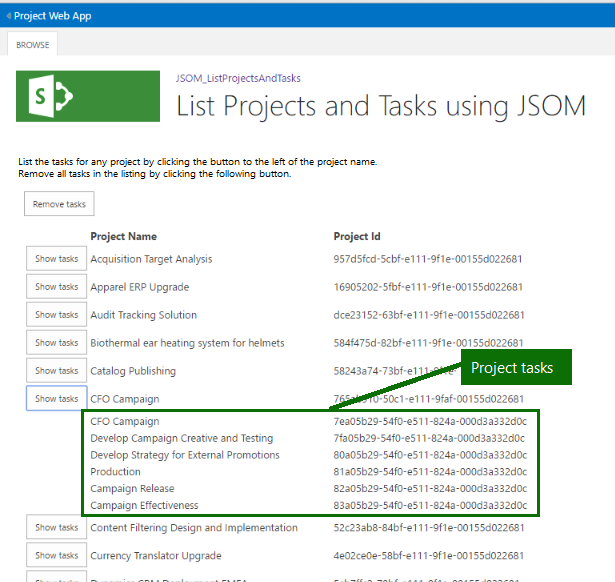

# <a name="developing-a-project-online-add-in-using-the-javascript-object-model-jsom"></a><span data-ttu-id="370fe-105">Разработка Project Online надстройки с помощью модели объектов JavaScript (JSOM)</span><span class="sxs-lookup"><span data-stu-id="370fe-105">Developing a Project Online add-in using the JavaScript Object Model (JSOM)</span></span>

<span data-ttu-id="370fe-106">В этой статье описываются разработки надстройки Microsoft Project сети для улучшения работы с Project Online.</span><span class="sxs-lookup"><span data-stu-id="370fe-106">This article describes Microsoft Project Online Add-in development to enhance your experience with the Project Online.</span></span> <span data-ttu-id="370fe-107">Разработка проект реализован в виде Пошаговое руководство.</span><span class="sxs-lookup"><span data-stu-id="370fe-107">The development project is implemented as a walkthrough.</span></span> <span data-ttu-id="370fe-108">Надстройки, используемые для данной статьи считывает и отображает имена проектов и идентификаторы опубликованные проекты из учетной записи Project Online и позволяет перейти получение задачи, связанные с отдельными проектами.</span><span class="sxs-lookup"><span data-stu-id="370fe-108">The add-in used for this article reads and displays the project names and IDs of the published projects from your Project Online account and allows you to drill down to retrieve tasks associated with individual projects.</span></span>
  
<span data-ttu-id="370fe-109">Во время выполнения добавить в список выглядит примерно на следующем рисунке:</span><span class="sxs-lookup"><span data-stu-id="370fe-109">At run time, the add-in listing looks similar to the following illustration:</span></span>
  
<span data-ttu-id="370fe-110">![Снимок экрана с отображением список элементов JSOM проектов и задач] (media/766e5914-f048-48f4-9282-291f55e6e90d.png "Снимок экрана с отображением список элементов JSOM проектов и задач")</span><span class="sxs-lookup"><span data-stu-id="370fe-110"></span></span>
  
<span data-ttu-id="370fe-111">В примере выделена взаимодействия с Project Online, выполнения запросов и установки контекста для каждого запроса в службе.</span><span class="sxs-lookup"><span data-stu-id="370fe-111">The focus of the example is the interaction with the Project Online, making queries and setting the context for each request from the service.</span></span> <span data-ttu-id="370fe-112">Элементы пользовательского интерфейса (UI) получают минимальной внимания.</span><span class="sxs-lookup"><span data-stu-id="370fe-112">User interface (UI) elements receive minimal attention.</span></span> <span data-ttu-id="370fe-113">Перечни источника предоставляют комментарии относительно пользовательского интерфейса.</span><span class="sxs-lookup"><span data-stu-id="370fe-113">Instead, the source listings provide comments regarding the UI.</span></span>
  
> [!NOTE]
> <span data-ttu-id="370fe-114">Исходные файлы для примера надстройки, проекта Visual Studio, доступном по адресу: https://github.com/OfficeDev/Project-JSOM-List-Projects-Tasks.....</span><span class="sxs-lookup"><span data-stu-id="370fe-114">The source files for the example add-in, a Visual Studio project, are available at: https://github.com/OfficeDev/Project-JSOM-List-Projects-Tasks.....</span></span> <span data-ttu-id="370fe-115">Сохранить исходные файлы под рукой справки во время ознакомьтесь со статьей как друг с другом дополняет.</span><span class="sxs-lookup"><span data-stu-id="370fe-115">Keep the source files handy as a reference while you read the article, as each complements the other.</span></span> <span data-ttu-id="370fe-116">Файлы в Visual Studio проекта построения и исполняемый файл с минимальными изменениями, подставляя URL-адрес для клиента Project Online вниз до папки веб-клиента Project.</span><span class="sxs-lookup"><span data-stu-id="370fe-116">The files in the Visual Studio project build and are executable with minimal changes—substituting the URL for your Project Online tenant down to the PWA folder.</span></span> 
  
## <a name="background"></a><span data-ttu-id="370fe-117">Общие сведения</span><span class="sxs-lookup"><span data-stu-id="370fe-117">Background</span></span>

<span data-ttu-id="370fe-118">Project Online — это служба Office 365, который предоставляет компании с помощью управления портфелем проектов (PPM) и office (PMO) решение для управления проектами для координации и управления портфелей, программ и проектов.</span><span class="sxs-lookup"><span data-stu-id="370fe-118">Project Online is a Office 365 service that provides companies with a project portfolio management (PPM) and project management office (PMO) solution to coordinate and manage portfolios, programs, and projects.</span></span> <span data-ttu-id="370fe-119">Project Online — это различные предложения, чем выпуски рабочего стола Project; еще Project Online по-прежнему содержит функциональные возможности для обслуживания и отслеживания сведений о проекте в течение всего жизненного цикла проекта.</span><span class="sxs-lookup"><span data-stu-id="370fe-119">Project Online is a different offering than the Project desktop editions; yet, Project Online still contains the functionality to maintain and track project details throughout the life of a project.</span></span> <span data-ttu-id="370fe-120">Project Online построена на SharePoint Online.</span><span class="sxs-lookup"><span data-stu-id="370fe-120">Project Online is built on SharePoint Online.</span></span>
  
<span data-ttu-id="370fe-121">Project Online размещенных надстройки состоит из файлов JavaScript и ресурсов, которые взаимодействуют с использованием интерфейса API клиентской стороне-объектной модели.</span><span class="sxs-lookup"><span data-stu-id="370fe-121">A Project Online hosted add-in consists of JavaScript and resource files that interact with the Client-Side-Object-Model API.</span></span> <span data-ttu-id="370fe-122">При посещении надстройки, JavaScript и ресурсы, загружаются и выполнена в браузере.</span><span class="sxs-lookup"><span data-stu-id="370fe-122">When the user visits the add-in, the JavaScript and resources are downloaded and executed within the browser.</span></span> <span data-ttu-id="370fe-123">Надстройка вызывает в асинхронном Project Online для взаимодействия со службой, будет ли создание, получение, обновление или удаление данных.</span><span class="sxs-lookup"><span data-stu-id="370fe-123">The add-In makes asynchronous calls to Project Online to interact with the service, whether creating, retrieving, updating, or deleting data.</span></span> 
  
<span data-ttu-id="370fe-124">Project Online выполняет одного дополнительные действия для защиты информации, к которой относится к другим клиентам из надстройки; а именно Project Online создает изолированной сайта для взаимодействия с запросов от надстройки.</span><span class="sxs-lookup"><span data-stu-id="370fe-124">Project Online performs one more action to protect information that belongs to other tenants from the add-in; namely, Project Online creates an isolated site to interact with the requests from the add-in.</span></span> <span data-ttu-id="370fe-125">Пользовательский код не выполняется на узле Project Online.</span><span class="sxs-lookup"><span data-stu-id="370fe-125">No custom code runs on the Project Online host.</span></span> 
  
<span data-ttu-id="370fe-126">Программа установки разработки для Project Online надстроек использует тип проекта Visual Studio SharePoint надстройки.</span><span class="sxs-lookup"><span data-stu-id="370fe-126">The development setup for Project Online add-ins uses the Visual Studio SharePoint Add-in project type.</span></span> <span data-ttu-id="370fe-127">Надстройки, записывается в JavaScript и для взаимодействия с Project Online службы с помощью объектной модели Project JavaScript (JSOM).</span><span class="sxs-lookup"><span data-stu-id="370fe-127">The add-in is written in JavaScript, and uses the Project JavaScript object model (JSOM) to interact with the Project Online service.</span></span> <span data-ttu-id="370fe-128">JSOM наследует большую часть его функциональные возможности SharePoint JSOM.</span><span class="sxs-lookup"><span data-stu-id="370fe-128">The JSOM inherits much of its functionality from the SharePoint JSOM.</span></span>
  
> [!NOTE]
> <span data-ttu-id="370fe-129">Надстройки могут публикации и продается в магазин Office или развернут в частном каталоге приложений на сайте SharePoint.</span><span class="sxs-lookup"><span data-stu-id="370fe-129">Add-ins can be published and sold in the Office Store or deployed to a private app catalog on SharePoint.</span></span> <span data-ttu-id="370fe-130">Дополнительные сведения можно [Развернуть и публикация надстройки Office](https://docs.microsoft.com/office/dev/add-ins/publish/publish).</span><span class="sxs-lookup"><span data-stu-id="370fe-130">For more information, see [Deploy and publish your Office Add-in](https://docs.microsoft.com/office/dev/add-ins/publish/publish).</span></span>
> 
> <span data-ttu-id="370fe-131">Надстройки, используемые в этой статье приведен пример для разработчиков; он не предназначен для использования в рабочей среде.</span><span class="sxs-lookup"><span data-stu-id="370fe-131">The add-in used in this article is a sample for developers; it is not intended for use in a production environment.</span></span> <span data-ttu-id="370fe-132">Основной целью является Показать пример разработки приложений для Project Online.</span><span class="sxs-lookup"><span data-stu-id="370fe-132">The primary purpose is to show an example of app development for Project Online.</span></span> 
  
## <a name="prerequisites"></a><span data-ttu-id="370fe-133">Необходимые разрешения</span><span class="sxs-lookup"><span data-stu-id="370fe-133">Prerequisites</span></span>

<span data-ttu-id="370fe-134">Поддерживаемые среды Windows добавьте следующие элементы:</span><span class="sxs-lookup"><span data-stu-id="370fe-134">Add the following items to a supported Windows environment:</span></span>
  
- <span data-ttu-id="370fe-135">**.NET framework 4.0 или более поздней версии**: совместимы полной версии framework версии 4.0.</span><span class="sxs-lookup"><span data-stu-id="370fe-135">**.NET Framework 4.0 or later**: Complete versions of the framework from version 4.0 are compatible.</span></span> <span data-ttu-id="370fe-136">Сайт загрузки — это https://msdn.microsoft.com/vstudio/aa496123.aspx.</span><span class="sxs-lookup"><span data-stu-id="370fe-136">The download site is https://msdn.microsoft.com/vstudio/aa496123.aspx.</span></span>
    
- <span data-ttu-id="370fe-137">**Visual Studio 2013 или более поздней версии**:</span><span class="sxs-lookup"><span data-stu-id="370fe-137">**Visual Studio 2013 or later**:</span></span>  
    
   - <span data-ttu-id="370fe-138">Профессиональный выпуск Visual Studio 2015 готова к работе out-встроенным и доступны в https://www.visualstudio.com/en-us/products/visual-studio-professional-with-msdn-vs.aspx.</span><span class="sxs-lookup"><span data-stu-id="370fe-138">The professional edition of Visual Studio 2015 is ready to go out-of-the box and is available at https://www.visualstudio.com/en-us/products/visual-studio-professional-with-msdn-vs.aspx.</span></span>
    
   - <span data-ttu-id="370fe-139">Сообщество выпуск Visual Studio 2015 доступном по адресу https://www.visualstudio.com/en-us/products/visual-studio-community-vs.aspx.</span><span class="sxs-lookup"><span data-stu-id="370fe-139">The community edition of Visual Studio 2015 is available at https://www.visualstudio.com/en-us/products/visual-studio-community-vs.aspx.</span></span> <span data-ttu-id="370fe-140">В этом выпуске требуется ручная установка инструментов разработчика Microsoft Office для Visual Studio.</span><span class="sxs-lookup"><span data-stu-id="370fe-140">This edition requires manual installation of the Microsoft Office Developer Tools for Visual Studio.</span></span>
    
   <span data-ttu-id="370fe-141">Инструменты разработчика Microsoft Office для Visual Studio доступны на https://www.visualstudio.com/en-us/features/office-tools-vs.aspx.</span><span class="sxs-lookup"><span data-stu-id="370fe-141">The Microsoft Office Developer Tools for Visual Studio are available at https://www.visualstudio.com/en-us/features/office-tools-vs.aspx.</span></span>
    
- <span data-ttu-id="370fe-142">**Учетная запись A Project Online**: Это обеспечивает доступ к службе размещения.</span><span class="sxs-lookup"><span data-stu-id="370fe-142">**A Project Online account**: This provides access to the hosting service.</span></span> <span data-ttu-id="370fe-143">Дополнительные сведения о получении учетной записи Project Online можно https://products.office.com/en-us/Project/project-online-portfolio-management.</span><span class="sxs-lookup"><span data-stu-id="370fe-143">For more information about obtaining a Project Online account, see https://products.office.com/en-us/Project/project-online-portfolio-management.</span></span>
    
   <span data-ttu-id="370fe-144">Убедитесь, что пользователь надстройки имеет недостаточно прав на доступ к некоторых проектов в Project Online для клиентов.</span><span class="sxs-lookup"><span data-stu-id="370fe-144">Ensure that the add-in user has sufficient authorization to access some projects in the Project Online tenant.</span></span> 
    
- <span data-ttu-id="370fe-145">**Проекты на узле размещения** , заполненный сведения.</span><span class="sxs-lookup"><span data-stu-id="370fe-145">**Projects on the hosting site** that are populated with information.</span></span>
    
> [!NOTE]
> <span data-ttu-id="370fe-146">Стандартный .NET Framework — это правильный framework для использования.</span><span class="sxs-lookup"><span data-stu-id="370fe-146">The standard .NET Framework is the correct framework to use.</span></span> <span data-ttu-id="370fe-147">Не используйте «Профиль .NET Framework 4 клиента».</span><span class="sxs-lookup"><span data-stu-id="370fe-147">Do not use the ".NET Framework 4 Client Profile".</span></span> 
  
### <a name="set-up-the-visual-studio-project"></a><span data-ttu-id="370fe-148">Настройка проекта Visual Studio</span><span class="sxs-lookup"><span data-stu-id="370fe-148">Set up the Visual Studio project</span></span>

<span data-ttu-id="370fe-149">Настройка приложения состоит из создания нового проекта, связывание соответствующие библиотеки и объявление необходимых пространств имен.</span><span class="sxs-lookup"><span data-stu-id="370fe-149">The application setup consists of creating a new project, linking the appropriate libraries and declaring the needed namespaces.</span></span> <span data-ttu-id="370fe-150">Visual Studio содержит несколько типов проектов разработки.</span><span class="sxs-lookup"><span data-stu-id="370fe-150">Visual Studio presents several types of development projects.</span></span> <span data-ttu-id="370fe-151">Раздел представляет краткий и основные.</span><span class="sxs-lookup"><span data-stu-id="370fe-151">The section is brief and very basic.</span></span> <span data-ttu-id="370fe-152">Значение является наличие совместно в одном месте.</span><span class="sxs-lookup"><span data-stu-id="370fe-152">The value is having the information is coalesced in one place.</span></span>
  
#### <a name="select-a-visual-studio-project"></a><span data-ttu-id="370fe-153">Выбор проекта Visual Studio</span><span class="sxs-lookup"><span data-stu-id="370fe-153">Select a Visual Studio project</span></span>

<span data-ttu-id="370fe-154">Создание проекта соответствующего типа для надстройки, необходимо выполнить следующие действия.</span><span class="sxs-lookup"><span data-stu-id="370fe-154">To create a project of the appropriate type for the add-in, you must do the following steps.</span></span> <span data-ttu-id="370fe-155">Ключевые слова, на экране иметь атрибут **полужирного шрифта** :</span><span class="sxs-lookup"><span data-stu-id="370fe-155">Keywords encountered on the screen have a **bold** attribute:</span></span> 
  
1. <span data-ttu-id="370fe-156">В меню Файл выберите команду **файл** > **New** > **проекта**.</span><span class="sxs-lookup"><span data-stu-id="370fe-156">From the File menu, choose **File** > **New** > **Project**.</span></span> 
    
2. <span data-ttu-id="370fe-157">Установленные шаблоны в левой области выберите **C#** > **Office/SharePoint** > **Web - надстройки**.</span><span class="sxs-lookup"><span data-stu-id="370fe-157">From the Installed templates in the left pane, select **C#** > **Office/SharePoint** > **Web Add-ins**.</span></span> 
    
3. <span data-ttu-id="370fe-158">В верхней области центра, установите **.NET Framework 4** или более поздняя версия; Текущая версия — 4.6.</span><span class="sxs-lookup"><span data-stu-id="370fe-158">At the top of the central pane, select **.NET Framework 4** or later; the current version is 4.6.</span></span> 
    
4. <span data-ttu-id="370fe-159">Типы приложений в центральной области выберите **Добавить в SharePoint**.</span><span class="sxs-lookup"><span data-stu-id="370fe-159">From the application types in the central pane, choose **SharePoint Add-in**.</span></span> 
    
5. <span data-ttu-id="370fe-160">В нижней части укажите имя и расположение проекта и имя решения.</span><span class="sxs-lookup"><span data-stu-id="370fe-160">In the bottom section, specify a name and location for the project, and a solution name.</span></span> 
    
6. <span data-ttu-id="370fe-161">Также в нижней части установите флажок **Создать каталог для решения** .</span><span class="sxs-lookup"><span data-stu-id="370fe-161">Also in the bottom section, check the **Create directory for solution** box.</span></span> 
    
7. <span data-ttu-id="370fe-162">Нажмите **кнопку ОК** , чтобы создать исходный проект.</span><span class="sxs-lookup"><span data-stu-id="370fe-162">Click **OK** to create the initial project.</span></span> 
    
<span data-ttu-id="370fe-163">Мастер Visual Studio указываются Project Online параметров сайта (называемое параметры SharePoint в диалоговых окнах) ряда звонящему вопросов в нескольких диалоговых окон, следуйте.</span><span class="sxs-lookup"><span data-stu-id="370fe-163">The Visual Studio Wizard asks a few follow-up questions about the Project Online settings site (called SharePoint settings in the dialogs) in a couple of dialogs that follow.</span></span> <span data-ttu-id="370fe-164">Ниже приведены вопросы.</span><span class="sxs-lookup"><span data-stu-id="370fe-164">Here are the questions:</span></span>
  
1. <span data-ttu-id="370fe-165">Какой сайт SharePoint вы хотите использовать для отладки надстройки?</span><span class="sxs-lookup"><span data-stu-id="370fe-165">What SharePoint site do you want to use for debugging your add-in?</span></span> <span data-ttu-id="370fe-166">Укажите URL-адрес для веб-узла веб-клиента Project, таких как https://contoso.sharepoint.com/sites/pwa.</span><span class="sxs-lookup"><span data-stu-id="370fe-166">Specify the URL to your PWA site, such as https://contoso.sharepoint.com/sites/pwa.</span></span>
    
2. <span data-ttu-id="370fe-167">Как требуется размещать надстройки SharePoint?</span><span class="sxs-lookup"><span data-stu-id="370fe-167">How do you want to host your SharePoint Add-in?</span></span> <span data-ttu-id="370fe-168">Выберите [X] **Размещение в SharePoint**.</span><span class="sxs-lookup"><span data-stu-id="370fe-168">Choose [X] **SharePoint-hosted**.</span></span>
    
   <span data-ttu-id="370fe-169">Дополнительные сведения о SharePoint надстройках включая варианты размещения, можно [надстройки SharePoint](https://docs.microsoft.com/sharepoint/dev/sp-add-ins/sharepoint-add-ins).</span><span class="sxs-lookup"><span data-stu-id="370fe-169">For more information about SharePoint Add-ins, including hosting options, see [SharePoint Add-ins](https://docs.microsoft.com/sharepoint/dev/sp-add-ins/sharepoint-add-ins).</span></span>
    
3. <span data-ttu-id="370fe-170">Нажмите кнопку **Далее**.</span><span class="sxs-lookup"><span data-stu-id="370fe-170">Click **Next**.</span></span> 
    
<span data-ttu-id="370fe-171">Второй диалоговое окно дополнительных запрашивает можно использовать для определения версии SharePoint Online для надстройки:</span><span class="sxs-lookup"><span data-stu-id="370fe-171">The second additional dialog asks you to specify the SharePoint Online version for the add-in:</span></span> 
  
1. <span data-ttu-id="370fe-172">Что такое самая ранняя версия SharePoint, которое надстройки к целевому?</span><span class="sxs-lookup"><span data-stu-id="370fe-172">What's the earliest version of SharePoint that you want your add-in to target?</span></span> <span data-ttu-id="370fe-173">Выберите [X] S **harePoint Online**.</span><span class="sxs-lookup"><span data-stu-id="370fe-173">Choose [X] S **harePoint-Online**.</span></span> 
    
2. <span data-ttu-id="370fe-174">Нажмите кнопку **Готово**.</span><span class="sxs-lookup"><span data-stu-id="370fe-174">Click **Finish**.</span></span> 
    
<span data-ttu-id="370fe-175">Visual Studio создает проект и получает доступ к Project Online сайта.</span><span class="sxs-lookup"><span data-stu-id="370fe-175">Visual Studio creates the project and accesses the Project Online site.</span></span> 
  
### <a name="enable-sideloading-on-the-project-online-site"></a><span data-ttu-id="370fe-176">Включить sideloading на сайт Project Online</span><span class="sxs-lookup"><span data-stu-id="370fe-176">Enable sideloading on the Project Online site</span></span>

<span data-ttu-id="370fe-177">Sideloading — это механизм для тестирования и отладки Project Online надстроек. Необходимо два сценария для sideloading: один для включения sideloading на сайте Project Online, а другой для отключения sideloading после завершения тестирования и отладки надстройки.</span><span class="sxs-lookup"><span data-stu-id="370fe-177">Sideloading is the mechanism for testing and debugging Project Online add-ins. You need two scripts for sideloading: one to enable sideloading on your Project Online site and another to disable sideloading once you finish testing and debugging the add-in.</span></span>
  
<span data-ttu-id="370fe-178">Дополнительные сведения о настройке sideloading [приложения SideLoading в семействе веб-сайтов не разработчика](https://blogs.msdn.microsoft.com/officeapps/2013/12/10/enable-app-sideloading-in-your-non-developer-site-collection/)см.</span><span class="sxs-lookup"><span data-stu-id="370fe-178">For more information about setting up sideloading, see [Enable app SideLoading in your non-developer site collection](https://blogs.msdn.microsoft.com/officeapps/2013/12/10/enable-app-sideloading-in-your-non-developer-site-collection/).</span></span>
  
> [!NOTE]
> <span data-ttu-id="370fe-179">Sideloading приложения — это функция разработчика/test.</span><span class="sxs-lookup"><span data-stu-id="370fe-179">Sideloading apps is a developer/test feature.</span></span> <span data-ttu-id="370fe-180">Это **не предназначенный для использования в рабочей среде**.</span><span class="sxs-lookup"><span data-stu-id="370fe-180">It is **not intended for production use**.</span></span> <span data-ttu-id="370fe-181">Регулярно выполните не sideload приложения или оставьте включена поддержка больше, чем вы активно использующих функцию sideloading приложения.</span><span class="sxs-lookup"><span data-stu-id="370fe-181">Do not sideload apps regularly, or keep app sideloading enabled for longer than you are actively using the feature.</span></span> 
  
## <a name="add-content-to-the-add-in-project"></a><span data-ttu-id="370fe-182">Добавление контента в проект надстройки</span><span class="sxs-lookup"><span data-stu-id="370fe-182">Add content to the add-in project</span></span>

<span data-ttu-id="370fe-183">После создания проекта и настройка механизм отладки, добавление контента в приложение включает в себя следующие задачи:</span><span class="sxs-lookup"><span data-stu-id="370fe-183">After creating a project and setting up the debugging mechanism, adding content to the app includes the following tasks:</span></span>
  
- <span data-ttu-id="370fe-184">Задание области приложения</span><span class="sxs-lookup"><span data-stu-id="370fe-184">Setting the application scope</span></span>
    
- <span data-ttu-id="370fe-185">Связывание библиотекой JSOM</span><span class="sxs-lookup"><span data-stu-id="370fe-185">Linking the JSOM library</span></span>
    
- <span data-ttu-id="370fe-186">Добавление элементов пользовательского интерфейса для надстройки</span><span class="sxs-lookup"><span data-stu-id="370fe-186">Adding UI Elements to the add-in</span></span>
    
- <span data-ttu-id="370fe-187">Инициализация и подключение к службе Project Online</span><span class="sxs-lookup"><span data-stu-id="370fe-187">Initializing and connecting to the Project Online service</span></span>
    
- <span data-ttu-id="370fe-188">Получение проектов и сведений и свойства</span><span class="sxs-lookup"><span data-stu-id="370fe-188">Retrieving projects and details/properties</span></span>
    
- <span data-ttu-id="370fe-189">Отображение проектов</span><span class="sxs-lookup"><span data-stu-id="370fe-189">Displaying projects</span></span>
    
- <span data-ttu-id="370fe-190">Отображение задачи для проекта</span><span class="sxs-lookup"><span data-stu-id="370fe-190">Displaying tasks for a Project</span></span>
    
<span data-ttu-id="370fe-191">Проект надстройки состоит из нескольких файлов.</span><span class="sxs-lookup"><span data-stu-id="370fe-191">The add-in project consists of many files.</span></span> <span data-ttu-id="370fe-192">В этом примере вам потребуется изменить следующие файлы:</span><span class="sxs-lookup"><span data-stu-id="370fe-192">In this example, you'll need to edit the following files:</span></span> 
  
- <span data-ttu-id="370fe-193">Файл AppManifest.xml</span><span class="sxs-lookup"><span data-stu-id="370fe-193">AppManifest.xml</span></span>
    
- <span data-ttu-id="370fe-194">Default.aspx</span><span class="sxs-lookup"><span data-stu-id="370fe-194">Default.aspx</span></span>
    
- <span data-ttu-id="370fe-195">App.js</span><span class="sxs-lookup"><span data-stu-id="370fe-195">App.js</span></span>
    
- <span data-ttu-id="370fe-196">App.CSS - необязательный; содержит определения стилей, разработанных для надстройки</span><span class="sxs-lookup"><span data-stu-id="370fe-196">App.css - optional; contains style definitions developed for the add-in</span></span>
    
<span data-ttu-id="370fe-197">При изменении проекта интерактивного клиента, такие как перемещение из пробную версию подписки на сайт, можно обновить свойства проекта, включая подключение к серверу и URL-адрес сайта с помощью окно свойств, доступных в **представлении** > **Свойства Окно** команды.</span><span class="sxs-lookup"><span data-stu-id="370fe-197">If the Project Online tenant changes, such as moving from a trial to a subscription site, you can update the project properties, including the Server Connection and Site URL, using the Properties Window available through the **View** > **Properties Window** command.</span></span> 
  
<span data-ttu-id="370fe-198">Также можно добавить файлы в проект.</span><span class="sxs-lookup"><span data-stu-id="370fe-198">You can also add files to the project.</span></span> <span data-ttu-id="370fe-199">Если это так, то необходимо обновить файл Elements.xml, расположенный в той же группе (контент, изображения, страницы или сценарии) для включения новых файлов.</span><span class="sxs-lookup"><span data-stu-id="370fe-199">If so, you'll need to update the Elements.xml file located in the same group (Content, Images, Pages, or Scripts) to include the new files.</span></span> <span data-ttu-id="370fe-200">Дополнительные сведения о файлах проекта [Изучите Структура манифеста приложения и пакет из SharePoint надстройки](https://docs.microsoft.com/sharepoint/dev/sp-add-ins/explore-the-app-manifest-structure-and-the-package-of-a-sharepoint-add-in)см.</span><span class="sxs-lookup"><span data-stu-id="370fe-200">For more information about the project files, see [Explore the app manifest structure and the package of a SharePoint Add-in](https://docs.microsoft.com/sharepoint/dev/sp-add-ins/explore-the-app-manifest-structure-and-the-package-of-a-sharepoint-add-in).</span></span>
  
### <a name="set-application-scope"></a><span data-ttu-id="370fe-201">Область приложения Set</span><span class="sxs-lookup"><span data-stu-id="370fe-201">Set application scope</span></span>

<span data-ttu-id="370fe-202">Надстройка должна области или разрешение уровней определенных перед служба возвращает сведения в результатах запроса.</span><span class="sxs-lookup"><span data-stu-id="370fe-202">The add-in needs scope or permission levels defined before the service returns information in query results.</span></span> <span data-ttu-id="370fe-203">Для этой надстройки используйте следующие области действия в проект Visual Studio.</span><span class="sxs-lookup"><span data-stu-id="370fe-203">For this add-in, use the following scope to the Visual Studio project.</span></span> <span data-ttu-id="370fe-204">Это изменение внесено для файла AppManifest.xml на вкладке разрешения:</span><span class="sxs-lookup"><span data-stu-id="370fe-204">This change is made to the AppManifest.xml file in the Permissions tab:</span></span>

|<span data-ttu-id="370fe-205">Область</span><span class="sxs-lookup"><span data-stu-id="370fe-205">Scope</span></span>|<span data-ttu-id="370fe-206">Permission</span><span class="sxs-lookup"><span data-stu-id="370fe-206">Permission</span></span>|
|:-----|:-----|
|<span data-ttu-id="370fe-207">Несколько проектов (Project Server)</span><span class="sxs-lookup"><span data-stu-id="370fe-207">Multiple Projects (Project Server)</span></span>  <br/> |<span data-ttu-id="370fe-208">Read</span><span class="sxs-lookup"><span data-stu-id="370fe-208">Read</span></span>  <br/> |
   
<span data-ttu-id="370fe-209">Сохраните файл после настройки области приложения.</span><span class="sxs-lookup"><span data-stu-id="370fe-209">Save the file after setting the application scope.</span></span> <span data-ttu-id="370fe-210">В противном случае данные не будут возвращены из службы.</span><span class="sxs-lookup"><span data-stu-id="370fe-210">Otherwise, no data will be returned from the service.</span></span> 
  
### <a name="link-the-jsom-library"></a><span data-ttu-id="370fe-211">Связать с библиотекой JSOM</span><span class="sxs-lookup"><span data-stu-id="370fe-211">Link the JSOM library</span></span>

<span data-ttu-id="370fe-212">Библиотеки времени выполнения Project Online, PS.js и PS.debug.js, с Project Online и всегда являются наиболее поздней версии.</span><span class="sxs-lookup"><span data-stu-id="370fe-212">The runtime Project Online libraries, PS.js and PS.debug.js, are provided by Project Online and are always the most recent version.</span></span> <span data-ttu-id="370fe-213">Надстройки JavaScript, использующие JSOM необходимо связать с одним из этих библиотек.</span><span class="sxs-lookup"><span data-stu-id="370fe-213">JavaScript add-ins that use JSOM must link with one of these libraries.</span></span> <span data-ttu-id="370fe-214">Связи определения добавляются в файл Default.aspx.</span><span class="sxs-lookup"><span data-stu-id="370fe-214">The linking definitions are added in the Default.aspx file.</span></span> <span data-ttu-id="370fe-215">Команды, чтобы использовать PS.js и/или PS.debug.js являются частью кода, находится в файле App.js.</span><span class="sxs-lookup"><span data-stu-id="370fe-215">The commands to use the PS.js and/or PS.debug.js are part of the code located in the App.js file.</span></span>
  
<span data-ttu-id="370fe-216">Добавьте следующую команду для определения PS.js или PS.debug.js в `<asp:Content ContentPlaceHolderID="PlaceHolderAdditionalPageHead"` элемент после «SharePoint:ScriptLink» для sp.js.</span><span class="sxs-lookup"><span data-stu-id="370fe-216">Add the following command for PS.js or PS.debug.js definition in the  `<asp:Content ContentPlaceHolderID="PlaceHolderAdditionalPageHead"` element following the "SharePoint:ScriptLink" for sp.js.</span></span> 
  
```js
<SharePoint:ScriptLink name="PS.js" runat="server" OnDemand="false" LoadAfterUI="true" Localizable="false" />
```

> [!NOTE]
> <span data-ttu-id="370fe-217">Атрибут **OnDemand** для PS.js или PS.debug.js значение **false**.</span><span class="sxs-lookup"><span data-stu-id="370fe-217">The **OnDemand** attribute for PS.js or PS.debug.js set to **false**.</span></span> 
  
### <a name="add-ui-elements-to-the-add-in"></a><span data-ttu-id="370fe-218">Добавление элементов пользовательского интерфейса для надстройки</span><span class="sxs-lookup"><span data-stu-id="370fe-218">Add UI elements to the add-in</span></span>

<span data-ttu-id="370fe-219">Пример добавления в состоит из нескольких компонентов.</span><span class="sxs-lookup"><span data-stu-id="370fe-219">The example add-in consists of a few components.</span></span> <span data-ttu-id="370fe-220">Описания статических элементов, находятся в файл Default.aspx.</span><span class="sxs-lookup"><span data-stu-id="370fe-220">Static element descriptions are located in the Default.aspx file.</span></span> <span data-ttu-id="370fe-221">Описание динамических элементов и код для всех компонентов, находятся в файле App.js.</span><span class="sxs-lookup"><span data-stu-id="370fe-221">Dynamic element descriptions and code for all components are located in the App.js file.</span></span> <span data-ttu-id="370fe-222">Комментарии относительно компонентов можно найти исходного кода.</span><span class="sxs-lookup"><span data-stu-id="370fe-222">For comments regarding the components, refer to the source code listings.</span></span> <span data-ttu-id="370fe-223">Далее представлен список компонентов пользовательского интерфейса в надстройку:</span><span class="sxs-lookup"><span data-stu-id="370fe-223">Here is a list of the UI components in the add-in:</span></span>
  
- <span data-ttu-id="370fe-224">Title</span><span class="sxs-lookup"><span data-stu-id="370fe-224">Title</span></span>
    
- <span data-ttu-id="370fe-225">Ознакомительные формулировки</span><span class="sxs-lookup"><span data-stu-id="370fe-225">Introductory verbiage</span></span>
    
- <span data-ttu-id="370fe-226">Нажмите кнопку, чтобы удалить задачи из таблицы</span><span class="sxs-lookup"><span data-stu-id="370fe-226">Button to remove tasks from the table</span></span>
    
- <span data-ttu-id="370fe-227">Таблица, перечисляющая код проекта и имя и сведения о задаче.</span><span class="sxs-lookup"><span data-stu-id="370fe-227">Table that lists the project ID and name, and the task information.</span></span>
    
- <span data-ttu-id="370fe-228">Обзор задач кнопки (клонировании один раз для каждого проекта), импортирует данные задачи в таблице.</span><span class="sxs-lookup"><span data-stu-id="370fe-228">Tasks Button (cloned once for each project) that imports task data into the table.</span></span>
    
<span data-ttu-id="370fe-229">Для получения дополнительных сведений о пользовательском интерфейсе, такие как название и область заголовка в таблице проекта просмотрите файл Default.aspx проекта.</span><span class="sxs-lookup"><span data-stu-id="370fe-229">For details of the user interface, such as the title and the header portion of the project table, see the Default.aspx project file.</span></span>
  
### <a name="initialize-and-connect-to-the-host-system"></a><span data-ttu-id="370fe-230">Инициализация и подключения к системе узла</span><span class="sxs-lookup"><span data-stu-id="370fe-230">Initialize and connect to the host system</span></span>

<span data-ttu-id="370fe-231">Файл App.js содержит код JavaScript.</span><span class="sxs-lookup"><span data-stu-id="370fe-231">The App.js file contains the JavaScript code.</span></span> <span data-ttu-id="370fe-232">Надстройка загружается PS.js в браузере и затем вызывает функцию initializePage.</span><span class="sxs-lookup"><span data-stu-id="370fe-232">The add-in loads PS.js in the browser, and then calls the initializePage function.</span></span> <span data-ttu-id="370fe-233">InitializePage получает контекст к конечной точке Project Online и запускает функцию loadProjects.</span><span class="sxs-lookup"><span data-stu-id="370fe-233">InitializePage retrieves a context to the Project Online endpoint and starts the loadProjects function.</span></span>
  
```js
    'use strict';
    SP.SOD.executeOrDelayUntilScriptLoaded(initializePage, "PS.js");
    //Project PWA Context and published projects in PWA
    var projContext;
    var projects;
    function initializePage() {
        //Get the Project context for this web
        projContext = PS.ProjectContext.get_current();
        loadProjects();
    }
    //General CSOM failure event handler
    //Invoked when ExecuteQueryAsync returns unsuccessfully
    function onRequestFailed(sender, args) {
        alert("Failed to execute: " + args.get_message());
        return;
    };

```

### <a name="retrieve-the-projects"></a><span data-ttu-id="370fe-234">Получение проектов</span><span class="sxs-lookup"><span data-stu-id="370fe-234">Retrieve the projects</span></span>

<span data-ttu-id="370fe-235">Функция loadProjects запрашивает службу для проекта имена и идентификаторы.</span><span class="sxs-lookup"><span data-stu-id="370fe-235">The loadProjects function queries the service for the project names and IDs.</span></span> 
  
<span data-ttu-id="370fe-236">Приложение получает имя проекта и проекта код. Другие сведения о проекте доступен и осуществляется путем изменения метод load для идентификации явно свойства для извлечения.</span><span class="sxs-lookup"><span data-stu-id="370fe-236">The application retrieves the project name and project Id. Other information about the project is available and can be accessed by modifying the load method to identify explicitly the properties to retrieve.</span></span> <span data-ttu-id="370fe-237">Пример предоставляется в коде комментария.</span><span class="sxs-lookup"><span data-stu-id="370fe-237">An example is provided in the code as a comment.</span></span> 
  
<span data-ttu-id="370fe-238">Если запрос пройдет успешно, надстройка продолжает путем вызова displayProjects.</span><span class="sxs-lookup"><span data-stu-id="370fe-238">If the query succeeds, the add-in continues by calling displayProjects.</span></span> 
  
```js
    //Query CSOM and get the list of projects in PWA
    function loadProjects() {
        projects = projContext.get_projects();
    //Request to server - identifies what to retrieve
        projContext.load(projects, 'Include(Name, Id)');
        //Notice to server to execute query
        projContext.executeQueryAsync(displayProjects, onRequestFailed);
        // Syntax for requesting more fields to pull down from server
        // projContext.load(projects, 'Include(Name, Description, StartDate, 
        // Id, IsCheckedOut)');
    }

```

### <a name="display-the-projects"></a><span data-ttu-id="370fe-239">Отображение проектов</span><span class="sxs-lookup"><span data-stu-id="370fe-239">Display the projects</span></span>

<span data-ttu-id="370fe-240">Функция displayProjects создает таблицы, одной строке для каждого проекта и кнопка для отображения задач для конкретного проекта.</span><span class="sxs-lookup"><span data-stu-id="370fe-240">The displayProjects function creates a table, one row per project, and a button to show the tasks for the specific project.</span></span> 
  
```js
    //Display the projects with names and ids in a table
    function displayProjects() {
        //Current published project and ID
        var p, projId;
        //Project table rows to publish collectively
        var pTable = []; 
        var pEnum = projects.getEnumerator();
        //Build a 3-column table, with one project per row.
        while (pEnum.moveNext()) {
            p = pEnum.get_current();
        
            //Items used in getting information for table rows:
            //Current published project object, and ID and name
            // var project = p;
            // var projId = p.get_id();
            // var projName = p.get_name();
        
            //Continue processing/working with project object as needed.
        }
    }

```

> [!NOTE]
> <span data-ttu-id="370fe-241">Цикл while обращается к идентификатор и имя свойства.</span><span class="sxs-lookup"><span data-stu-id="370fe-241">The while loop accesses the ID and name properties.</span></span> <span data-ttu-id="370fe-242">Это отличается от проект исходного кода, которая вызывает функцию, в свою очередь, обращается к те же свойства.</span><span class="sxs-lookup"><span data-stu-id="370fe-242">This is slightly different than the source code project that calls a function that, in turn, accesses the same properties.</span></span> 
  
### <a name="display-the-tasks-for-a-project"></a><span data-ttu-id="370fe-243">Отображение задачи для проекта</span><span class="sxs-lookup"><span data-stu-id="370fe-243">Display the tasks for a project</span></span>

<span data-ttu-id="370fe-244">Задачи, при частью надстройки, не являющихся частью начальной загрузки.</span><span class="sxs-lookup"><span data-stu-id="370fe-244">The tasks, while part of the add-in, are not part of the initial loading.</span></span> <span data-ttu-id="370fe-245">Если пользователь заинтересована в задачи, связанные с проектом, нажав кнопку «Показать задачи» вызывает задачи для отображения в списке с помощью обработчика событий btnLoadTasks.</span><span class="sxs-lookup"><span data-stu-id="370fe-245">If the user is interested in the tasks associated with a project, clicking the "Show Tasks" button causes the tasks to display in the list using the btnLoadTasks event handler.</span></span> 
  
<span data-ttu-id="370fe-246">Обработчик событий btnLoadTasks с Идентификатором соответствующий проект запрашивает задачи для указанного проекта с сервера.</span><span class="sxs-lookup"><span data-stu-id="370fe-246">The btnLoadTasks event handler, with the appropriate project ID, requests the tasks for the specified project from the server.</span></span> <span data-ttu-id="370fe-247">После извлечения, btnLoadTasks передает список задач displayTasks до настоящего времени задачи на экране.</span><span class="sxs-lookup"><span data-stu-id="370fe-247">Once retrieved, btnLoadTasks passes the task list to displayTasks to present the tasks onscreen.</span></span>
  
```js
    //Query CSOM and get the list of tasks for a specific project
    function btnLoadTasks(pid) {
        //Event handler for the "Show tasks" buttons. 
        //
        //The project ID is the sole argument and is used to get the appropriate task 
        //info from the service.
        //The project ID is also the button name, and is used to identify where to place
        //the task information in the table.
        //
        //Project ID to pass to the event handler
        var projId = pid;
        //
        //Get the project reference
        var pProj = projects.getById(projId);
        //
        //Get the tasks collection reference associated with the project.
        var tasks = pProj.get_tasks();
        //
        projContext.load(tasks, 'Include(Id, Name, Start, ScheduledStart, Completion)');
        //
        //If the query succeeds, displayTasks presents the tasks to the user.
        projContext.executeQueryAsync(function () { displayTasks(tasks, projId) }, onRequestFailed);
    }

```

<span data-ttu-id="370fe-248">Функция displayTasks отображает задачи, связанные с указанной проекта непосредственно под записью проекта.</span><span class="sxs-lookup"><span data-stu-id="370fe-248">The displayTasks function displays the tasks associated with a specified project immediately beneath the project entry.</span></span>
  
```js
    //Insert tasks for the specified project immediately underneath the project entry 
    //in the table.
    function displayTasks(tasks, projId) {
        //selected project ID
        var pId = projId;
        //individual task
        var t;
        //Task table rows to publish collectively
        var tTable = [];
        var tEnum = tasks.getEnumerator();
        //Build table one task per row.
        while (tEnum.moveNext()) {
            t = tEnum.get_current();
            //
            //Items used in getting information for table rows:
            //Current task object, and ID and name
            // var task = t;
            // var taskId = t.get_id();
            // var taskName = t.get_name();
            
            //Continue processing/working with task object as needed.
        }
    }

```

> [!NOTE]
> <span data-ttu-id="370fe-249">Цикл while обращается к идентификатор задачи и имя свойства.</span><span class="sxs-lookup"><span data-stu-id="370fe-249">The while loop accesses the task ID and name properties.</span></span> <span data-ttu-id="370fe-250">Это отличается от проект исходного кода, которая вызывает функцию, в свою очередь, обращается к те же свойства.</span><span class="sxs-lookup"><span data-stu-id="370fe-250">This is slightly different than the source code project that calls a function that, in turn, accesses the same properties.</span></span> 
  
<span data-ttu-id="370fe-251">Следует пример выходных данных для задач одного проекта.</span><span class="sxs-lookup"><span data-stu-id="370fe-251">Sample output for the tasks of a single project follows.</span></span>
  
<span data-ttu-id="370fe-252">![Снимок экрана: выходных данных для задачи проекта] (media/f6500a3f-000b-4f3e-9be6-9a74d0bea15e.png "Снимок экрана: выходных данных для задачи проекта")</span><span class="sxs-lookup"><span data-stu-id="370fe-252"></span></span>
  
## <a name="see-also"></a><span data-ttu-id="370fe-253">См. также</span><span class="sxs-lookup"><span data-stu-id="370fe-253">See also</span></span>

<span data-ttu-id="370fe-254">Документация и примеры, связанные с Project Online и разработки приложений с помощью CSOM в разделе [Портал проектов разработки](https://developer.microsoft.com/en-us/project).</span><span class="sxs-lookup"><span data-stu-id="370fe-254">For documentation and samples related to Project Online and application development using CSOM, see the [Project Development Portal](https://developer.microsoft.com/en-us/project).</span></span>
    


