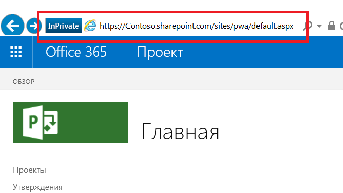

# <a name="developing-a-project-online-application-using-the-client-side-object-model"></a><span data-ttu-id="29074-104">Разработка приложений для Project Online с помощью клиентской объектной модели</span><span class="sxs-lookup"><span data-stu-id="29074-104">Developing a Project Online application using the client-side object model</span></span>

<span data-ttu-id="29074-105">В этой статье описана разработка приложений Microsoft Project Online для классических приложений с помощью .NET Framework 4.0.</span><span class="sxs-lookup"><span data-stu-id="29074-105">This article describes Microsoft Project Online application development for desktop applications using the .NET Framework 4.0.</span></span> <span data-ttu-id="29074-106">Приложения, представленные в данной статье, загружают сведения с сервера размещения.</span><span class="sxs-lookup"><span data-stu-id="29074-106">The application described in this article retrieves information from the hosting server.</span></span> 
  
## <a name="background"></a><span data-ttu-id="29074-107">Общие сведения</span><span class="sxs-lookup"><span data-stu-id="29074-107">Background</span></span>

<span data-ttu-id="29074-108">Программа Microsoft Project стала использоваться в качестве классического приложения в начале 1990-х.</span><span class="sxs-lookup"><span data-stu-id="29074-108">Microsoft Project started as desktop application in the early 1990's.</span></span> <span data-ttu-id="29074-109">На сегодня возможности Project значительно расширились, что подтверждают различные версии данной программы:</span><span class="sxs-lookup"><span data-stu-id="29074-109">Today, Project is much more, as its several varieties attest:</span></span>
  
- <span data-ttu-id="29074-110">Project стандартный — классическое приложение, которое работает как автономное.</span><span class="sxs-lookup"><span data-stu-id="29074-110">Project standard edition is a desktop application that runs as a stand-alone application.</span></span>
    
- <span data-ttu-id="29074-111">Project профессиональный — классическое приложение, которое предоставляет возможности совместного использования данных с сервера и взаимодействия с ними в крупных масштабах, а также может выполнять функции Project стандартный.</span><span class="sxs-lookup"><span data-stu-id="29074-111">Project professional edition is a desktop application that can interact and share data with a server on a larger scale, as well as perform the functionality found in Project standard edition.</span></span>
    
- <span data-ttu-id="29074-112">Project Online — служба, размещаемая на серверах корпорации Майкрософт, которая предоставляет компаниям решение уровня проектного офиса (PMO) для согласования и управления проектами, программами и портфелями.</span><span class="sxs-lookup"><span data-stu-id="29074-112">Project Online is a Microsoft-hosted service that provides companies with a PMO-level solution to coordinate and manage projects, programs, and portfolios.</span></span> <span data-ttu-id="29074-113">В отличии от выпусков для настольных систем, Project Online может поддерживать и отслеживать сведения о проекте на протяжении всего его жизненного цикла.</span><span class="sxs-lookup"><span data-stu-id="29074-113">A different offering than the desktop editions, Project Online can maintain and track project details throughout the life of a project.</span></span> 
    
- <span data-ttu-id="29074-114">Project Server — служба, размещаемая на корпоративных серверах. С ее помощью предприятие управляет сведениями о проекте, программе и портфеле, содержащимися на сервере, а также обеспечивает их защиту.</span><span class="sxs-lookup"><span data-stu-id="29074-114">Project Server is an enterprise-hosted service in which the enterprise manages and secures the server containing project, program, and portfolio information.</span></span> <span data-ttu-id="29074-115">В Project Server реализована внутренняя защита сервера и доступны функции с широкими возможностями настройки, ориентированные на проекты, программы и портфели Project Online с внешним размещением.</span><span class="sxs-lookup"><span data-stu-id="29074-115">Project Server, by virtue of securing the server in-house, offers the project, program, and portfolio oriented features of externally-hosted Project Online with a greater capacity for customization.</span></span>
    
<span data-ttu-id="29074-116">Project Online обладает тремя онлайн-наборами API: клиентской объектной моделью (CSOM), объектной моделью JavaScript (JSOM) и службой передачи репрезентативного состояния (REST).</span><span class="sxs-lookup"><span data-stu-id="29074-116">Project Online has three online API sets: Client-side Object Model (CSOM), JavaScript Object Model (JSOM), and Representational State Transfer (REST).</span></span> 
  
- <span data-ttu-id="29074-117">Реализация .NET CSOM — это предпочтительный интерфейс при разработке приложений Windows, которые взаимодействуют с клиентами Project Online.</span><span class="sxs-lookup"><span data-stu-id="29074-117">The .NET CSOM implementation is the preferred interface when developing Windows applications that interact with Project Online tenants.</span></span> <span data-ttu-id="29074-118">Типичные среды, ориентированные на пользователей приложений, включают настольные компьютеры с Windows и устройства Microsoft Surface.</span><span class="sxs-lookup"><span data-stu-id="29074-118">Typical environments for user-centric applications include Windows desktops and Microsoft Surface devices.</span></span> <span data-ttu-id="29074-119">Внутренние приложения Project Online, написанные с помощью .NET CSOM, могут подключаться к внешним серверам с бизнес-логикой и источниками данных.</span><span class="sxs-lookup"><span data-stu-id="29074-119">Back-end applications written with .NET CSOM can connect to other servers for business logic and data sources that are external to Project Online.</span></span> <span data-ttu-id="29074-120">В запросах на получение данных из Project Online применяется система запросов по типу LINQ, которая обладает расширенным возможностями в сравнении со стандартными функциями получения.</span><span class="sxs-lookup"><span data-stu-id="29074-120">Retrieval requests to Project Online use a LINQ-like query system that offers several enhancements over basic retrieval functions.</span></span>
    
- <span data-ttu-id="29074-121">Интерфейс объектной модели JavaScript (JSOM) обеспечивает поддержку разных браузеров для надстроек Project Online. Надстройка — это веб-приложение, которое хранится в клиенте Project Online.</span><span class="sxs-lookup"><span data-stu-id="29074-121">The JavaScript Object Model (JSOM) interface provides cross-browser support for Project Online Add-ins. An add-in is a web application that is stored in the Project Online tenant.</span></span> <span data-ttu-id="29074-122">Когда пользователю нужно запустить надстройку, код надстройки скачивается и запускается в браузере на компьютере пользователя.</span><span class="sxs-lookup"><span data-stu-id="29074-122">When a user wants to run an add-in, the code for the add-in downloads and runs in the browser on the user machine.</span></span> 
    
- <span data-ttu-id="29074-123">Модель REST/Odata обеспечивает связь по протоколу HTTP. Мы рекомендуем применять этот интерфейс для приложений в средах, отличных от Windows.</span><span class="sxs-lookup"><span data-stu-id="29074-123">The REST/Odata model provides HTTP-based communication, This interface is recommended for applications in non-Windows environments.</span></span> <span data-ttu-id="29074-124">Конечные точки связи — объекты на сайте веб-приложения Project (PWA).</span><span class="sxs-lookup"><span data-stu-id="29074-124">Communication endpoints are the objects in the Project Web Application (PWA) site.</span></span> <span data-ttu-id="29074-125">В качестве результатов выступают обычные коды состояния HTTP.</span><span class="sxs-lookup"><span data-stu-id="29074-125">Results provide normal HTTP status codes.</span></span>
    
<span data-ttu-id="29074-126">В этой статье рассматриваются приложения, использующие интерфейс .NET CSOM.</span><span class="sxs-lookup"><span data-stu-id="29074-126">This article focuses on an application that uses the .NET CSOM interface.</span></span>
  
## <a name="prerequisites"></a><span data-ttu-id="29074-127">Предварительные условия</span><span class="sxs-lookup"><span data-stu-id="29074-127">Prerequisites</span></span>

<span data-ttu-id="29074-128">Запустите базовую систему под управлением Windows 10 и добавьте следующие элементы:</span><span class="sxs-lookup"><span data-stu-id="29074-128">Start with a base system running Windows 10, and add the following items:</span></span>
  
- <span data-ttu-id="29074-129">.NET Framework 4.0 или более поздний полный выпуск.</span><span class="sxs-lookup"><span data-stu-id="29074-129">.Net Framework 4.0 or later -- Use the complete framework.</span></span> <span data-ttu-id="29074-130">Сайт загрузки файлов — https://msdn.microsoft.com/vstudio/aa496123.aspx.</span><span class="sxs-lookup"><span data-stu-id="29074-130">The download site is https://msdn.microsoft.com/vstudio/aa496123.aspx.</span></span>
    
- <span data-ttu-id="29074-131">Visual Studio 2013 или более поздний выпуск. Допустимо использовать любой выпуск.</span><span class="sxs-lookup"><span data-stu-id="29074-131">Visual Studio 2013 or later -- Any edition is acceptable.</span></span> <span data-ttu-id="29074-132">Для разработки примера приложения использовалась среда Visual Studio 2015 Community Edition.</span><span class="sxs-lookup"><span data-stu-id="29074-132">The community edition of Visual Studio 2015 was used to develop the sample application.</span></span> <span data-ttu-id="29074-133">Выпуск Community Edition доступен по адресу https://www.visualstudio.com/en-us/products/visual-studio-community-vs.aspx.</span><span class="sxs-lookup"><span data-stu-id="29074-133">The community edition is available at https://www.visualstudio.com/en-us/products/visual-studio-community-vs.aspx.</span></span>
    
- <span data-ttu-id="29074-134">Пакет SDK клиентских компонентов SharePoint. Project Online и Project Server возглавляют список компонентов SharePoint и сборок SharePoint.</span><span class="sxs-lookup"><span data-stu-id="29074-134">SharePoint Client Components SDK -- Project Online and Project Server sit on top of SharePoint, and SharePoint assemblies.</span></span> <span data-ttu-id="29074-135">Клиентские компоненты SharePoint включены в выпуски Visual Studio Professional Edition и Visual Studio Enterprise Edition.</span><span class="sxs-lookup"><span data-stu-id="29074-135">The SharePoint Client Components are included in Visual Studio Professional and Enterprise editions.</span></span> <span data-ttu-id="29074-136">Если вы используете выпуск Visual Studio Community Edition, последняя версия пакета SDK для инструментов разработчика Office доступна по адресу https://www.microsoft.com/en-us/download/details.aspx?id=35585.</span><span class="sxs-lookup"><span data-stu-id="29074-136">If you use Visual Studio Community edition, the latest version of the Office Developer Tools SDK is available at the following site: https://www.microsoft.com/en-us/download/details.aspx?id=35585.</span></span>
    
- <span data-ttu-id="29074-137">Учетная запись Project Online. Учетные данные необходимы для доступа к сайту размещения.</span><span class="sxs-lookup"><span data-stu-id="29074-137">A Project Online account -- This provides access to the hosting site.</span></span> <span data-ttu-id="29074-138">Дополнительные сведения о получении учетной записи Project Online см. здесь: https://products.office.com/en-us/Project/project-online-portfolio-management.</span><span class="sxs-lookup"><span data-stu-id="29074-138">For more information about obtaining a Project Online account, see https://products.office.com/en-us/Project/project-online-portfolio-management.</span></span>
    
- <span data-ttu-id="29074-139">Проекты с данными на сайте размещения.</span><span class="sxs-lookup"><span data-stu-id="29074-139">Projects on the hosting site that are populated with information</span></span>
    
> [!NOTE]
> <span data-ttu-id="29074-140">Рекомендуется использовать стандартную среду .NET Framework (4.0 или более поздний выпуск).</span><span class="sxs-lookup"><span data-stu-id="29074-140">The standard .NET Framework (4.0 or later) is the correct framework to use.</span></span> <span data-ttu-id="29074-141">Не используйте клиентский профиль .NET Framework 4.</span><span class="sxs-lookup"><span data-stu-id="29074-141">Do not use the .NET Framework 4 Client Profile.</span></span> 
  
## <a name="develop-the-application"></a><span data-ttu-id="29074-142">Разработка приложения</span><span class="sxs-lookup"><span data-stu-id="29074-142">Develop the application</span></span>

<span data-ttu-id="29074-143">При разработке классического приложения для SharePoint предпочтительным интерфейсом выступает клиентская объектная модель (CSOM).</span><span class="sxs-lookup"><span data-stu-id="29074-143">In developing a desktop application for SharePoint, the preferred interface is the Project client side object model (CSOM).</span></span> 
  
<span data-ttu-id="29074-144">Готовый пример можно скачать здесь: https://github.com/OfficeDev/Project-CSOM-List-Projects-Tasks.</span><span class="sxs-lookup"><span data-stu-id="29074-144">You can download the complete sample at https://github.com/OfficeDev/Project-CSOM-List-Projects-Tasks.</span></span>
  
<span data-ttu-id="29074-145">В первых двух разделах рассказывается об основных проблемах — создании проекта Visual Studio с соответствующим пространством имен и сборками и получении доступа к серверу размещения.</span><span class="sxs-lookup"><span data-stu-id="29074-145">The first two topics cover basic issues: creating a Visual Studio project with appropriate namespaces and assemblies, and accessing the hosting server.</span></span> <span data-ttu-id="29074-146">В оставшихся разделах рассматривается получение данных с помощью CSOM из одного или нескольких объектов.</span><span class="sxs-lookup"><span data-stu-id="29074-146">The remaining topics deal with retrieving information through the CSOM, from one and many objects.</span></span> 
  
<span data-ttu-id="29074-147">Извлечение данных из клиентских приложений выполняется с узла в два этапа.</span><span class="sxs-lookup"><span data-stu-id="29074-147">Retrieving information from the host is a two-action process from client applications.</span></span> <span data-ttu-id="29074-148">Первый этап: приложение составляет и отправляет серверу один или несколько запросов на получение данных.</span><span class="sxs-lookup"><span data-stu-id="29074-148">First, the application specifies and sends one or more retrieval requests to the server.</span></span> <span data-ttu-id="29074-149">Второй этап: приложение направляет серверу уведомление на выполнение отправленных запросов.</span><span class="sxs-lookup"><span data-stu-id="29074-149">Second, the application issues a notification to the server to execute the submitted queries.</span></span> <span data-ttu-id="29074-150">Сервер отвечает на запрос, отправляя результаты клиенту.</span><span class="sxs-lookup"><span data-stu-id="29074-150">The server responds by sending the query results to the client.</span></span>
  
### <a name="set-up-the-visual-studio-project"></a><span data-ttu-id="29074-151">Настройка проекта Visual Studio</span><span class="sxs-lookup"><span data-stu-id="29074-151">Set up the Visual Studio project</span></span>

<span data-ttu-id="29074-152">Настройка приложения состоит из создания нового проекта, компоновки соответствующих сборок и объявления требуемых пространств имен.</span><span class="sxs-lookup"><span data-stu-id="29074-152">The application setup consists of creating a new project, linking the appropriate assemblies and declaring the needed namespaces.</span></span> <span data-ttu-id="29074-153">Visual Studio поддерживает нескольких типов проектов разработки.</span><span class="sxs-lookup"><span data-stu-id="29074-153">Visual Studio presents several types of development projects.</span></span> 
  
#### <a name="select-a-visual-studio-project"></a><span data-ttu-id="29074-154">Выберите проект Visual Studio</span><span class="sxs-lookup"><span data-stu-id="29074-154">Select a Visual Studio project</span></span>

1. <span data-ttu-id="29074-155">Запустите Visual Studio и выберите **Создать проект** на начальной странице.</span><span class="sxs-lookup"><span data-stu-id="29074-155">Launch Visual Studio and select **Start A New Project** on the Start Page.</span></span> 
    
   <span data-ttu-id="29074-156">В диалоговом окне нового проекта перечисляются доступные шаблоны приложений и поля данных для любого выбранного шаблона.</span><span class="sxs-lookup"><span data-stu-id="29074-156">The New Project dialog displays available application templates, and data fields for any selected template.</span></span> 
    
2. <span data-ttu-id="29074-157">Для этого приложения укажите приведенные ниже элементы.</span><span class="sxs-lookup"><span data-stu-id="29074-157">For this application, specify the following items.</span></span> <span data-ttu-id="29074-158">На экране появятся ключевые слова с атрибутом Bold.</span><span class="sxs-lookup"><span data-stu-id="29074-158">Keywords encountered on the screen have a bold attribute:</span></span>
    
   1. <span data-ttu-id="29074-159">Из установленных шаблонов на левой панели выберите **C#** => **Windows** => **Классическое приложение**.</span><span class="sxs-lookup"><span data-stu-id="29074-159">From the Installed templates in the left pane, select **C#** => **Windows** => **Classic desktop**.</span></span> 
    
   2. <span data-ttu-id="29074-160">В верхней части центральной панели выберите **.NET Framework 4**.</span><span class="sxs-lookup"><span data-stu-id="29074-160">At the top of the central pane, select **.NET Framework 4**.</span></span> 
    
   3. <span data-ttu-id="29074-161">В центральной области укажите следующий тип приложения: **Консольное приложение**.</span><span class="sxs-lookup"><span data-stu-id="29074-161">From the application types in the central pane, choose **Console Application**.</span></span> 
    
   4. <span data-ttu-id="29074-162">В нижней части укажите имя и расположение проекта, а также имя решения.</span><span class="sxs-lookup"><span data-stu-id="29074-162">In the bottom section, specify a name and location for the project, and a solution name.</span></span> 
    
   5. <span data-ttu-id="29074-163">Кроме того, в нижней части установите флажок **Создать каталог для решения**.</span><span class="sxs-lookup"><span data-stu-id="29074-163">Also in the bottom section, check the **Create directory for solution** box.</span></span> 
    
3. <span data-ttu-id="29074-164">Нажмите кнопку **ОК**, чтобы создать начальный проект.</span><span class="sxs-lookup"><span data-stu-id="29074-164">Click **OK** to create the initial project.</span></span> 
    
#### <a name="add-assemblies"></a><span data-ttu-id="29074-165">Добавление сборок</span><span class="sxs-lookup"><span data-stu-id="29074-165">Add assemblies</span></span>

<span data-ttu-id="29074-166">Для решения VS необходимы следующие сборки: ProjectServerClient из пакета SDK Project 2103, несколько сборок из пакета SDK SharePoint и .NET Framework System.Security.</span><span class="sxs-lookup"><span data-stu-id="29074-166">The VS solution needs the ProjectServerClient assembly from the Project 2103 SDK, a couple of assemblies from the SharePoint SDK, and the .NET Framework System.Security assembly.</span></span>
  
1. <span data-ttu-id="29074-167">В обозревателе решений VS щелкните правой кнопкой мыши по записи "Ссылки" и выберите **Добавить ссылку...**</span><span class="sxs-lookup"><span data-stu-id="29074-167">In the VS Solution Explorer, right-click the References entry, and select **Add Reference…**</span></span> <span data-ttu-id="29074-168">из контекстного меню.</span><span class="sxs-lookup"><span data-stu-id="29074-168">from the shortcut menu.</span></span> 
    
2. <span data-ttu-id="29074-169">Отметьте **Microsoft.ProjectServer.Client.dll**.</span><span class="sxs-lookup"><span data-stu-id="29074-169">Check the **Microsoft.ProjectServer.Client.dll**.</span></span> 
    
   <span data-ttu-id="29074-170">При необходимости нажмите кнопку **Обзор...**</span><span class="sxs-lookup"><span data-stu-id="29074-170">If needed, click the **Browse…**</span></span> <span data-ttu-id="29074-171">в нижней части диалогового окна и перейдите в каталог установки пакета SDK Project 2013, чтобы найти сборку.</span><span class="sxs-lookup"><span data-stu-id="29074-171">button at the bottom of the dialog and navigate to the Project 2013 SDK installation directory to locate the assembly.</span></span> 
    
3. <span data-ttu-id="29074-172">Нажмите кнопку **ОК**.</span><span class="sxs-lookup"><span data-stu-id="29074-172">Click **OK**.</span></span> 
    
4. <span data-ttu-id="29074-173">Добавьте пространство имен PrjoctServer Client в CS-файл.</span><span class="sxs-lookup"><span data-stu-id="29074-173">Add the PrjoctServer Client namespace to the .cs file.</span></span>
    
   ```cs
    using Microsoft.ProjectServer.Client;
   ```

<span data-ttu-id="29074-174">Добавьте сборку пакета SDK SharePoint 2013 с помощью консоли диспетчера пакетов NuGet.</span><span class="sxs-lookup"><span data-stu-id="29074-174">Add the SharePoint 2013 SDK assemblies using the NuGet Package Manager Console.</span></span> 
  
1. <span data-ttu-id="29074-175">В меню VS "Сервис" выберите следующее: **Сервис =\> Диспетчер пакетов NuGet =\> Консоль диспетчера пакетов**.</span><span class="sxs-lookup"><span data-stu-id="29074-175">From the VS Tools menu, click the following menus: **Tools =\> NuGet Package Manager =\> Package Manager Console**.</span></span> 
    
2. <span data-ttu-id="29074-176">В консоли диспетчера пакетов введите следующую команду и нажмите клавишу \<ВВОД\>:</span><span class="sxs-lookup"><span data-stu-id="29074-176">In the Package Manager Console, enter the following command and press \<ENTER\>:</span></span>
    
   ```cs
    Install-Package Microsoft.SharePointOnline.CSOM
   ```

   <span data-ttu-id="29074-177">**Консоль диспетчера пакетов** предоставит описание результатов команды. Номер сборки SharePoint показывается в обозревателе решений VS в ссылках проекта.</span><span class="sxs-lookup"><span data-stu-id="29074-177">The **Package Manager Console** provides a description of the command results; and, the VS Solution Explorer displays the SharePoint assemblies in the project references.</span></span> 
    
3. <span data-ttu-id="29074-178">Добавьте пространство имен в CS-файл:</span><span class="sxs-lookup"><span data-stu-id="29074-178">Add the namespaces to the .cs file:</span></span>
    
   ```cs
    using Microsoft.SharePoint.Client;
   ```

<span data-ttu-id="29074-179">Сборка System.Security входит в состав среды .NET Framework и устанавливается вместе с ней.</span><span class="sxs-lookup"><span data-stu-id="29074-179">The System.Security assembly is part of .NET Framework and was installed with the framework.</span></span> <span data-ttu-id="29074-180">Для примера приложения требуется дополнительное пространство имен, используемое для проверки подлинности при шифровании строк в размещающей системе.</span><span class="sxs-lookup"><span data-stu-id="29074-180">The sample application needs one more namespace that provides an encrypted string to the hosting system for authentication.</span></span> <span data-ttu-id="29074-181">После проверки подлинности приложение получает доступ к проектам размещающей системы.</span><span class="sxs-lookup"><span data-stu-id="29074-181">Once authenticated, the application can access projects on the hosting system.</span></span> <span data-ttu-id="29074-182">Добавьте пространство имен System.Security в CS-файл следующим образом:</span><span class="sxs-lookup"><span data-stu-id="29074-182">Add the System.Security namespace to the .cs file in this way:</span></span>
  
1. <span data-ttu-id="29074-183">В обозревателе решений VS щелкните правой кнопкой мыши по записи "Ссылки" и выберите **Добавить ссылку...**</span><span class="sxs-lookup"><span data-stu-id="29074-183">In the VS Solution Explorer, right-click the References entry, and select **Add Reference…**</span></span> <span data-ttu-id="29074-184">из контекстного меню.</span><span class="sxs-lookup"><span data-stu-id="29074-184">from the shortcut menu.</span></span> 
    
2. <span data-ttu-id="29074-185">Выберите **Сборки =\> Платформа** в левой части диалогового окна "Диспетчер ссылок", затем установите флажок **System.Security**.</span><span class="sxs-lookup"><span data-stu-id="29074-185">Select **Assemblies =\> Framework** in the left pane of the References Manager dialog, then check **System.Security**.</span></span> 
    
3. <span data-ttu-id="29074-186">Нажмите кнопку **ОК**.</span><span class="sxs-lookup"><span data-stu-id="29074-186">Click **OK**.</span></span> 
    
4. <span data-ttu-id="29074-187">Добавьте пространство имен System.Security в CS-файл.</span><span class="sxs-lookup"><span data-stu-id="29074-187">Add the System.Security namespace to the .cs file:</span></span>
    
   ```cs
    using System.Security;
   ```

<span data-ttu-id="29074-188">Начало CS-файла должно содержать следующие пространства имен:</span><span class="sxs-lookup"><span data-stu-id="29074-188">The start of the .cs file should contain the following namespaces:</span></span>
  
- <span data-ttu-id="29074-189">System;</span><span class="sxs-lookup"><span data-stu-id="29074-189">System</span></span>
    
- <span data-ttu-id="29074-190">System.Collections.Generic;</span><span class="sxs-lookup"><span data-stu-id="29074-190">System.Collections.Generic</span></span>
    
- <span data-ttu-id="29074-191">System.Linq;</span><span class="sxs-lookup"><span data-stu-id="29074-191">System.Linq</span></span>
    
- <span data-ttu-id="29074-192">System.Test;</span><span class="sxs-lookup"><span data-stu-id="29074-192">System.Test</span></span>
    
- <span data-ttu-id="29074-193">Microsoft.ProjectServer.Client;</span><span class="sxs-lookup"><span data-stu-id="29074-193">Microsoft.ProjectServer.Client</span></span>
    
- <span data-ttu-id="29074-194">Microsoft.SharePoint.Client;</span><span class="sxs-lookup"><span data-stu-id="29074-194">Microsoft.SharePoint.Client</span></span>
    
- <span data-ttu-id="29074-195">System.Security.</span><span class="sxs-lookup"><span data-stu-id="29074-195">System.Security</span></span>
    
### <a name="connect-to-the-host-system"></a><span data-ttu-id="29074-196">Подключение к размещающей системе</span><span class="sxs-lookup"><span data-stu-id="29074-196">Connect to the host system</span></span>

<span data-ttu-id="29074-197">Project Online — приложение SharePoint, поэтому разумно воспользоваться проверкой подлинности в SharePoint.</span><span class="sxs-lookup"><span data-stu-id="29074-197">Project Online is a SharePoint application, so using SharePoint authentication is the correct approach.</span></span> <span data-ttu-id="29074-198">С помощью указанного ниже фрагмента кода можно подготовить доступ к размещенной среде.</span><span class="sxs-lookup"><span data-stu-id="29074-198">The following code fragment prepares to access the hosted environment.</span></span>
  
```cs
    class Program
    {
        private static ProjectContext projContext;
        static void Main (string[] args)
        {
            using (ProjectContext projContext = new ProjectContext("https://Contoso.sharepoint.com/sites/pwa"))
            {
                SecureString password - new SecureString();
                foreach (char c in "password".ToCharArray()) password.AppendChar(c);
                //Using SharePoint method to load Credentials
                projContext.Credentials = new SharePointOnlineCredentials("sarad@Contoso.onmicrosoft.com", password);

```

<span data-ttu-id="29074-199">Действия по подготовке доступа к размещенной среде включают следующие шаги:</span><span class="sxs-lookup"><span data-stu-id="29074-199">Preparations to access the hosted environment include the following items:</span></span>
  
1. <span data-ttu-id="29074-200">Создайте контекст объекта для проектов. Код для данного действия содержится в предыдущем фрагменте кода.</span><span class="sxs-lookup"><span data-stu-id="29074-200">Create a context object for the projects -- this is contained in the following code of the preceding code fragment.</span></span> 
    
   ```cs
    private static ProjectContext projContext;
    
   ```

   <span data-ttu-id="29074-201">Контекст наследуется другими компонентами, позволяя системе управлять контекстом объектной модели проектов.</span><span class="sxs-lookup"><span data-stu-id="29074-201">The context is inherited by other components, allowing the system to manage the context of the Project object model.</span></span>
    
2. <span data-ttu-id="29074-202">Определите сайт размещения. Данное действие выполняется приведенным ниже кодом из предыдущего фрагмента кода.</span><span class="sxs-lookup"><span data-stu-id="29074-202">Identify the host site -- this is done in the following code from the preceding code fragment.</span></span>
    
   ```cs
    using (ProjectContext projContext = new ProjectContext("https://Contoso.sharepoint.com/sites/pwa"))
   ```

   <span data-ttu-id="29074-203">При создании экземпляра контекста проектов необходимо предоставить доступ к корню приложения для семейства веб-сайтов проектов.</span><span class="sxs-lookup"><span data-stu-id="29074-203">When instantiating the projects context, the application needs to provide the root of the Projects site collection.</span></span> <span data-ttu-id="29074-204">Приложение использует подстроку URL-адреса корня проектов.</span><span class="sxs-lookup"><span data-stu-id="29074-204">The application uses a substring of the URL of the root of the Projects.</span></span> <span data-ttu-id="29074-205">Снимок этого расположения выделен красным прямоугольником на приведенном ниже рисунке.</span><span class="sxs-lookup"><span data-stu-id="29074-205">A snapshot of this location is highlighted with a red rectangle in the following illustration.</span></span> <span data-ttu-id="29074-206">Для проверки подлинности нужна строка от начала до подстроки "pwa".</span><span class="sxs-lookup"><span data-stu-id="29074-206">The authentication needs the string from its start through the substring "pwa".</span></span> <span data-ttu-id="29074-207">В листинге кода приложение использует строку "https://XXXXXXXX.sharepoint.com/sites/pwa".</span><span class="sxs-lookup"><span data-stu-id="29074-207">In the code listing, the application uses the string "https://XXXXXXXX.sharepoint.com/sites/pwa".</span></span>
        
   <span data-ttu-id="29074-208"></span><span class="sxs-lookup"><span data-stu-id="29074-208"></span></span>
  
3. <span data-ttu-id="29074-209">Поместите пароль в защищенную строку. Данное действие выполняется приведенным ниже кодом из предыдущего фрагмента кода.</span><span class="sxs-lookup"><span data-stu-id="29074-209">Place the password in a secure string -- this is done in the following code from the preceding code fragment.</span></span>
    
   ```cs
    SecureString password - new SecureString();
    foreach (char c in "password".ToCharArray()) password.AppendChar(c);
    
   ```

   <span data-ttu-id="29074-210">Учетная запись пользователя и пароль — учетные данные для доступа к сайту размещения.</span><span class="sxs-lookup"><span data-stu-id="29074-210">The password and user account are the credentials to access the host site.</span></span> 
    
4. <span data-ttu-id="29074-211">Добавьте учетную запись пользователя и пароль к учетным данным контекста объекта. Данное действие выполняется приведенным ниже кодом из предыдущего фрагмента кода.</span><span class="sxs-lookup"><span data-stu-id="29074-211">Add the user account and password to the credentials portion of the context object -- this is done in the following code from the preceding code fragment.</span></span>
    
   ```cs
    projContext.Credentials = new SharePointOnlineCredentials("sarad@Contoso.onmicrosoft.com", password);
   ```

<span data-ttu-id="29074-212">Созданный экземпляр контекста проекта готов к использованию.</span><span class="sxs-lookup"><span data-stu-id="29074-212">The instantiated project context is ready to use.</span></span>
  
### <a name="list-all-published-projects"></a><span data-ttu-id="29074-213">Перечисление всех опубликованных проектов</span><span class="sxs-lookup"><span data-stu-id="29074-213">List all published projects</span></span>

<span data-ttu-id="29074-214">Project Online и ProjectServer используют прокси-серверы для операций создания, отчетности, обновления и удаления (CRUD).</span><span class="sxs-lookup"><span data-stu-id="29074-214">Project Online and ProjectServer use proxies to communicate with the server for create, report, update, and delete (CRUD) operations.</span></span> <span data-ttu-id="29074-215">Узел/сервер эффективно обрабатывает запросы, а клиент выполняет следующие действия при взаимодействии с сервером:</span><span class="sxs-lookup"><span data-stu-id="29074-215">The host/server handles requests in an efficient manner and has the client perform the following actions in communicating with the server:</span></span>
  
1. <span data-ttu-id="29074-216">Определят контекст для взаимодействия.</span><span class="sxs-lookup"><span data-stu-id="29074-216">Establish a context for communication.</span></span> 
    
   <span data-ttu-id="29074-217">Контекст используется коллекцией проектов, а также другими объектами и коллекциями через наследование, включая коллекции задач, семейства назначений, промежуточные объекты и настраиваемые поля.</span><span class="sxs-lookup"><span data-stu-id="29074-217">The context is used by the projects collection, as well as other objects and collections through inheritance, including the tasks collection, assignments collection, the stage object, and custom fields.</span></span> 
    
2. <span data-ttu-id="29074-218">Используйте объектную модель для получения объекта, коллекции или данных.</span><span class="sxs-lookup"><span data-stu-id="29074-218">Use the object model to specify an object, collection, or data to retrieve.</span></span>
    
   <span data-ttu-id="29074-219">На этом шаге используется система LINQ в качестве запроса или метода.</span><span class="sxs-lookup"><span data-stu-id="29074-219">This step uses LINQ as a query or as a method.</span></span> <span data-ttu-id="29074-220">Спецификация контролирует получаемые результаты.</span><span class="sxs-lookup"><span data-stu-id="29074-220">The specification controls what you receive.</span></span> <span data-ttu-id="29074-221">Часто этот шаг внедряется как основа метода загрузки (шаг 3).</span><span class="sxs-lookup"><span data-stu-id="29074-221">Often, this step is embedded as the body of the Load method (step 3).</span></span> 
    
3. <span data-ttu-id="29074-222">Загрузите спецификацию получения из предыдущего шага с помощью метода Load() или LoadQuery().</span><span class="sxs-lookup"><span data-stu-id="29074-222">Load the retrieval specification from the previous step using the Load() or LoadQuery() method.</span></span>
    
   <span data-ttu-id="29074-223">Для загрузки коллекций и объектов используйте Load().</span><span class="sxs-lookup"><span data-stu-id="29074-223">For loading collections and objects, use Load().</span></span> <span data-ttu-id="29074-224">Для запросов с условиями по типу "where" и "group" используйте LoadQuery().</span><span class="sxs-lookup"><span data-stu-id="29074-224">For queries with clauses such as "where" and "group", use LoadQuery().</span></span> 
    
4. <span data-ttu-id="29074-225">Выполните запрос, применив метод ExecuteQuery().</span><span class="sxs-lookup"><span data-stu-id="29074-225">Execute the request using the ExecuteQuery() method.</span></span>
    
   <span data-ttu-id="29074-226">Метод ExecuteQuery() уведомляет узел о готовности выполнения запроса или запросов.</span><span class="sxs-lookup"><span data-stu-id="29074-226">The ExecuteQuery() method notifies the host that the query or queries are ready to execute.</span></span> <span data-ttu-id="29074-227">После получения уведомления узел выполнит запросы и отправит результаты клиенту.</span><span class="sxs-lookup"><span data-stu-id="29074-227">Once the host receives notification, it executes the queries and sends the results to the client.</span></span> 
    
<span data-ttu-id="29074-228">Приложение сможет использовать сведения клиента.</span><span class="sxs-lookup"><span data-stu-id="29074-228">With the information at the client, the application can use it.</span></span> <span data-ttu-id="29074-229">Приведенный ниже фрагмент кода выполняет перебор опубликованных проектов и выводит на печать идентификатор и имя каждого опубликованного проекта на узле.</span><span class="sxs-lookup"><span data-stu-id="29074-229">The following code fragment cycles through the published projects and prints the Id and Name for each published project on the host.</span></span>
  
```cs
// Get the list of projects in Project Web App.
var projects = projContext.Projects;
projContext.Load(projects);
projcontext.ExecuteQuery();
foreach (PublishedProject pubProj in projContext.Projects)
{
    Console.WriteLine("\n{0}. {1}   {2} \t{3} \n", j++, pubProj.Id, pubProj.Name, pubProj.CreatedDate);
}

```

<span data-ttu-id="29074-230">Вывод:</span><span class="sxs-lookup"><span data-stu-id="29074-230">Output:</span></span>
  
```cs
Published Project count:2
1. be80a848-b2ef-e511-80f4-00155dc84e01   A second Project     3/21/2016 10:14:40 PM
2. 9d730a1a-60ed-e511-80f6-00155dc87d01   Ent_Proj_1   3/18/2016 11:21:14 PM

```

### <a name="make-a-request"></a><span data-ttu-id="29074-231">Создание запроса</span><span class="sxs-lookup"><span data-stu-id="29074-231">Make a request</span></span>

<span data-ttu-id="29074-232">Используя действия из предыдущего фрагмента кода, приложение извлечет список проектов указанной учетной записи на сайте размещения.</span><span class="sxs-lookup"><span data-stu-id="29074-232">Using the actions from the previous code fragment, the application retrieves the list of projects in the specified account on the hosting site.</span></span> 
  
1. <span data-ttu-id="29074-233">ProjectContext указывается для проектов списка.</span><span class="sxs-lookup"><span data-stu-id="29074-233">The ProjectContext is specified for the projects to list.</span></span> 
    
   ```cs
    var projects = projContext.Projects;
   ```

2. <span data-ttu-id="29074-234">Укажите элемент для получения.</span><span class="sxs-lookup"><span data-stu-id="29074-234">Specify the item to retrieve.</span></span> 
    
   ```cs
    projContext.Load(projects);
   ```

   <span data-ttu-id="29074-235">Если указать только коллекцию, сервер извлечет коллекцию проектов, заполняя каждый проект значениями согласно установленным по умолчанию свойствам.</span><span class="sxs-lookup"><span data-stu-id="29074-235">By only stating the collection, the server retrieves the project collection, populating each project with values for the default set of properties.</span></span> <span data-ttu-id="29074-236">Попытка доступа к свойствам, входящим в набор свойств по умолчанию, приведет к успешным результатам.</span><span class="sxs-lookup"><span data-stu-id="29074-236">Accessing properties that are part of the default property set gives successful results.</span></span> <span data-ttu-id="29074-237">При попытке доступа к свойствам, которые не входят в набор свойств по умолчанию, отобразится исключение "Не инициализировано".</span><span class="sxs-lookup"><span data-stu-id="29074-237">Accessing properties that are not part of the default set results in a "Not initialized" exception.</span></span>
    
3. <span data-ttu-id="29074-238">Загрузите запрос (projContext.Load).</span><span class="sxs-lookup"><span data-stu-id="29074-238">Load the request (projContext.Load).</span></span>
    
   <span data-ttu-id="29074-239">Загрузка описывается в предыдущем шаге.</span><span class="sxs-lookup"><span data-stu-id="29074-239">This is part of the previous step.</span></span>
    
4. <span data-ttu-id="29074-240">Выполните запрос (ExecuteQuery).</span><span class="sxs-lookup"><span data-stu-id="29074-240">Execute the query (ExecuteQuery).</span></span> 
    
   ```cs
    projContext.ExecuteQuery();
   ```

### <a name="retrieve-high-level-project-information"></a><span data-ttu-id="29074-241">Извлечение сведений верхнего уровня о проекте</span><span class="sxs-lookup"><span data-stu-id="29074-241">Retrieve high-level project information</span></span>

<span data-ttu-id="29074-242">Свойства не по умолчанию необходимо указать в запросе к серверу.</span><span class="sxs-lookup"><span data-stu-id="29074-242">Properties that are not default properties must be specified in the request to the server.</span></span> <span data-ttu-id="29074-243">Приведенный ниже фрагмент кода загружает контекст коллекции проектов, как в предыдущем примере.</span><span class="sxs-lookup"><span data-stu-id="29074-243">The next code fragment loads the projects collection context as in the previous example.</span></span> <span data-ttu-id="29074-244">Затем спецификация запрашивает дополнительные свойства не по умолчанию, чтобы включить их в результат.</span><span class="sxs-lookup"><span data-stu-id="29074-244">Then, the specification requests additional non-default properties to include in the result.</span></span> 
  
```cs
var projects = projContext.Projects;
projContext.Load(projects,
    ps => ps.IncludeWithDefaultProperties(
        p => p.StartDate, p => p.Phase, p => p.Stage));
projContext.ExecuteQuery();

```

<span data-ttu-id="29074-245">Оператор Load определяет контекст коллекции проектов и добавляет к результатам запроса StartDate, Phase и Stage.</span><span class="sxs-lookup"><span data-stu-id="29074-245">The load statement specifies the projects collection context, and adds the StartDate, Phase, and Stage to the query result.</span></span> <span data-ttu-id="29074-246">Допустимые дополнительные свойства: скаляры, объекты или коллекции.</span><span class="sxs-lookup"><span data-stu-id="29074-246">The additional properties can be scalar, objects, or collections.</span></span> <span data-ttu-id="29074-247">К скалярным элементам можно обращаться напрямую.</span><span class="sxs-lookup"><span data-stu-id="29074-247">Scalar items can be accessed directly.</span></span> <span data-ttu-id="29074-248">Для объектов и коллекций нужна дополнительная обработка, как показано в приведенном ниже фрагменте кода.</span><span class="sxs-lookup"><span data-stu-id="29074-248">Objects and collections require additional processing, as in the following code fragment.</span></span>
  
```cs
// Using the previous definition and Load statement …
projContext.ExecuteQuery();
foreach (PublishedProject pubProj in projContext.Projects)
{
Console.WriteLine("\n\t{0}. \t{1} \n\t{2} \n\t{3} \n", j++, pubProj.Id, pubProj.Name,
    pubProj.CreatedDate);
             // The following statement generates an exception about the object 
             // reference not being set to an instance on the server. 
             // Console.WriteLine("\tCurrent Phase:\t{0}", pubProj.Phase.Name);
             // Phase and Stage are not published with the rest of the data. Need to pull these objects from the server.
             Phase oPhase = pubProj.Phase;
             projContext.Load(oPhase);
             projContext.ExecuteQuery();
             //if-else fails because the else case fails with "Microsoft.SharePoint.Client.ServerObjectNullReferenceException".
             //if (oPhase.ServerObjectIsNull != null)
             //Using try-catch instead
             try
             {
                  Console.WriteLine("\tCurrent Phase:\t{0}", oPhase.Name);
             }
             
             catch
             {
                  Console.WriteLine("\tCurrent Phase:\t Not available");
             }
             
             Stage oStage = pubProj.Stage;
             projContext.Load(oStage);
             projContext.ExecuteQuery();
             //Again, not using if-else combination for the same reason as above.
             try
             {
                  Console.WriteLine("\tCurrent Stage:\t{0}", oStage.Name);
             }
             
             catch
             {
                  Console.WriteLine("\tCurrent Stage:\t Not available");
    }

```

<span data-ttu-id="29074-249">Результат выполнения первых трех проектов:</span><span class="sxs-lookup"><span data-stu-id="29074-249">Output of the first three projects:</span></span>
  
```cs
Project counts:31
1. Project ID:  957d5fcd-5cbf-e111-9f1e-00155d022681
        Name:           Acquisition Target Analysis
        CreatedDate:            3/22/2016 5:14:34 PM
        Current Phase:  3. Plan
        Current Stage:  6. Plan
2. Project ID:  16905202-5fbf-e111-9f1e-00155d022681
        Name:           Apparel ERP Upgrade
        CreatedDate:            3/22/2016 5:36:40 PM
        Current Phase:  3. Plan
        Current Stage:  6. Plan
3. Project ID:  dce23152-63bf-e111-9f1e-00155d022681
        Name:           Audit Tracking Solution
        CreatedDate:            3/22/2016 5:02:24 PM
        Current Phase:  2. Select
        Current Stage:  4. Select Gate

```

### <a name="retrieve-all-tasks-in-a-project"></a><span data-ttu-id="29074-250">Получение всех задач проекта</span><span class="sxs-lookup"><span data-stu-id="29074-250">Retrieve all tasks in a project</span></span>

<span data-ttu-id="29074-251">Каждый проект содержит множество задач.</span><span class="sxs-lookup"><span data-stu-id="29074-251">Each project has many tasks.</span></span> <span data-ttu-id="29074-252">Получение задач одного проекта включает указанные ниже этапы.</span><span class="sxs-lookup"><span data-stu-id="29074-252">So, pulling the tasks for a single project consists of the following:</span></span>
  
1. <span data-ttu-id="29074-253">Определите контекст коллекции проектов.</span><span class="sxs-lookup"><span data-stu-id="29074-253">Establish the context of the projects collection.</span></span>
    
   ```cs
    var projects = projContext.Projects;
   ```

2. <span data-ttu-id="29074-254">Получите сведения о проекте, включая свойства задач.</span><span class="sxs-lookup"><span data-stu-id="29074-254">Retrieve the project information, including the Task properties.</span></span>
    
   ```cs
    projContext.Load(projects);
    ProjContext.ExecuteQuery();
    foreach (PublishedProject pubProj in projContext.Projects){
    
   ```

    <span data-ttu-id="29074-255">Примечание. Приложение обращается к опубликованным проектам.</span><span class="sxs-lookup"><span data-stu-id="29074-255">Note that the application is addressing published projects.</span></span> <span data-ttu-id="29074-256">Контекст для текущих опубликованных проектов — pubProj.</span><span class="sxs-lookup"><span data-stu-id="29074-256">The context for the current published project is pubProj.</span></span> 
    
3. <span data-ttu-id="29074-257">Определите контекст для коллекции задач.</span><span class="sxs-lookup"><span data-stu-id="29074-257">Establish the context for the Tasks collection.</span></span>
    
   ```cs
    PublishedTaskCollection collTask = pubProj.Tasks;
   ```

   <span data-ttu-id="29074-258">Свойство `pubProj.Tasks` ссылается на задачи текущего опубликованного проекта.</span><span class="sxs-lookup"><span data-stu-id="29074-258">The `pubProj.Tasks` property references the tasks of the current published project.</span></span> 
    
4. <span data-ttu-id="29074-259">Загрузите спецификацию для извлечения коллекции задач, включая соответствующие свойства не по умолчанию.</span><span class="sxs-lookup"><span data-stu-id="29074-259">Load the specification to retrieve Task collection, including the appropriate non-default properties.</span></span>
    
   ```cs
    projContext.Load(collTask,
        tsk => tsk.IncludeWithDefaultProperties(
            t => t.Id, t => t.Name, t => t.Start,
            t => t.ScheduledStart, t => t.Completion));
    
   ```

5. <span data-ttu-id="29074-260">Выполните запрос, чтобы получить коллекцию задач с соответствующими свойствами.</span><span class="sxs-lookup"><span data-stu-id="29074-260">Execute the query to retrieve the Task collection with the appropriate properties.</span></span>
    
   ```cs
    projContext.ExecuteQuery();
   ```

<span data-ttu-id="29074-261">Теперь данные сведения доступны локально.</span><span class="sxs-lookup"><span data-stu-id="29074-261">The information is now local.</span></span> <span data-ttu-id="29074-262">Приведенный ниже фрагмент кода обрабатывает коллекцию опубликованных задач с помощью ввода команд в консоли.</span><span class="sxs-lookup"><span data-stu-id="29074-262">The following code fragment processes the published tasks collection by writing the information to the console.</span></span>
  
```cs
    Console.WriteLine("Task collection count: {0}", collTask.Count.ToString());
    if (collTask.Count > 0)
    {
        int k = 1;    //Task counter.
        foreach (PublishedTask t in collTask)
        {
            Console.WriteLine("{0}. Id:{1} \tName:{2}", k++, t.Id, t.Name);
            Console.WriteLine("\t ScheduledStart:{0} \tStart:{1} \tCompletion:{2}", k, t.ScheduledStart, t.Start, t.Completion);
        }
    }

```

<span data-ttu-id="29074-263">Результат выполнения задач для одного проекта:</span><span class="sxs-lookup"><span data-stu-id="29074-263">Output of tasks for one project:</span></span>
  
```cs
Task collection count: 5
1. Id:256fa850-b2ef-e511-80f6-00155dc87d01      Name:Load software onto computer
         ScheduledStart:2       Start:4/4/2016 8:00:00 AM       Completion:4/4/2016 8:00:00 AM
2. Id:266fa850-b2ef-e511-80f6-00155dc87d01      Name:Locate and load Project Online SDK
         ScheduledStart:3       Start:4/5/2016 8:00:00 AM       Completion:4/5/2016 8:00:00 AM
3. Id:276fa850-b2ef-e511-80f6-00155dc87d01      Name:Locate and load SP SDK
         ScheduledStart:4       Start:4/5/2016 1:00:00 PM       Completion:4/5/2016 1:00:00 PM
4. Id:286fa850-b2ef-e511-80f6-00155dc87d01      Name:Build app that accesses Proj Online
         ScheduledStart:5       Start:4/6/2016 8:00:00 AM       Completion:4/6/2016 8:00:00 AM
5. Id:296fa850-b2ef-e511-80f6-00155dc87d01      Name:Build app that accesses task assignments
         ScheduledStart:6       Start:4/7/2016 8:00:00 AM       Completion:4/7/2016 8:00:00 AM

```

### <a name="access-information-at-multiple-levels"></a><span data-ttu-id="29074-264">Доступ к сведениям на нескольких уровнях</span><span class="sxs-lookup"><span data-stu-id="29074-264">Access information at multiple levels</span></span>

<span data-ttu-id="29074-265">Каждая задача может относиться к одному или нескольким людям (другое название —</span><span class="sxs-lookup"><span data-stu-id="29074-265">Each task can have one or more persons (a.k.a.</span></span> <span data-ttu-id="29074-266">ресурс), способствующим выполнению задачи.</span><span class="sxs-lookup"><span data-stu-id="29074-266">resource) contributing toward its completion.</span></span> <span data-ttu-id="29074-267">Коллекции назначений и ресурсов содержат эти сведения для каждой задачи.</span><span class="sxs-lookup"><span data-stu-id="29074-267">The Assignments and Resources collections contain this information for each task.</span></span> 
  
<span data-ttu-id="29074-268">Процесс состоит из следующих этапов:</span><span class="sxs-lookup"><span data-stu-id="29074-268">The processing consists of the following:</span></span>
  
1. <span data-ttu-id="29074-269">Получение контекста для задачи проекта.</span><span class="sxs-lookup"><span data-stu-id="29074-269">Obtaining a context for the project task.</span></span>
    
2. <span data-ttu-id="29074-270">Создание запроса и загрузка запроса для назначений, привязанных к задаче.</span><span class="sxs-lookup"><span data-stu-id="29074-270">Build a request and load the request for the assignments tied to the task.</span></span> 
    
3. <span data-ttu-id="29074-271">Выполнение запроса для назначений.</span><span class="sxs-lookup"><span data-stu-id="29074-271">Execute the query for the assignments.</span></span>
    
4. <span data-ttu-id="29074-272">Создание запроса и загрузка запроса для ресурса, связанного с индивидуальным назначением.</span><span class="sxs-lookup"><span data-stu-id="29074-272">Build a request and load the request for the resource associated with an individual assignment.</span></span> 
    
5. <span data-ttu-id="29074-273">Выполнение запроса для ресурса.</span><span class="sxs-lookup"><span data-stu-id="29074-273">Execute the query for the resource.</span></span>
    
> [!NOTE] 
> - <span data-ttu-id="29074-274">Коллекция назначений явно указывается при запросе сведений с сервера, так как не относится к свойству по умолчанию для коллекции задач.</span><span class="sxs-lookup"><span data-stu-id="29074-274">The Assignments collection is explicitly requested in the information from the server because it is not a default property of the Tasks collection.</span></span> <span data-ttu-id="29074-275">Последующий запрос выполняется для извлечения коллекции с сервера.</span><span class="sxs-lookup"><span data-stu-id="29074-275">As a collection, a subsequent query is made to pull the collection from the server.</span></span> 
> - <span data-ttu-id="29074-276">Ресурс — это объект.</span><span class="sxs-lookup"><span data-stu-id="29074-276">The Resource is an object.</span></span> <span data-ttu-id="29074-277">Запрос назначения содержит имя ресурса, связанного с назначением.</span><span class="sxs-lookup"><span data-stu-id="29074-277">The query for an assignment includes the resource name associated with the assignment.</span></span>
    
```cs
PublishedTaskCollection collTask = pubProj.Tasks;
    projContext.Load(collTask,
        tsk => tsk.IncludeWithDefaultProperties(
            t => t.Id, t => t.Name, 
            t => t.Assignments));
    projContext.Load(collTask);
    projContext.ExecuteQuery();
    Console.WriteLine("Task collection count: {0}", collTask.Count.ToString());
    if (collTask.Count > 0)
    {
        int k = 1;    //Task counter.
        //Processing task list for current project
        foreach (PublishedTask t in collTask)
        {
            Console.WriteLine("{0}. Id:{1} \tName:{2}", k, t.Id, t.Name);
            k++;
            //Define and retrieve Assignments for current task
            PublishedAssignmentCollection collAssgns = t.Assignments;
            projContext.Load(collAssgns);
            projContext.ExecuteQuery();
            Console.WriteLine("    Assignment collection count: {0}", collAssgns.Count);
            if (collAssgns.Count > 0)
            {
                //Output string for resources assigned to task
                StringBuilder output = new StringBuilder();
                output.AppendFormat("\t Assignments: ");
                foreach (PublishedAssignment a in collAssgns)
                {
                    //Define and retrieve resource name for current assignment 
                    //(an object)
                    projContext.Load(a,
                        b => b.Resource.Name);
                    projContext.ExecuteQuery();
                    output.AppendFormat("{0}, ", a.Resource.Name);
                }
                Console.WriteLine(output);
            }
            else
            {
                Console.WriteLine("\t Assignments: None");
            }
        }
    }   // endif

```

<span data-ttu-id="29074-278">Результат выполнения для задач 52, 75 и 76 проекта:</span><span class="sxs-lookup"><span data-stu-id="29074-278">Output for tasks 52, 75, and 76 of a project:</span></span>
  
```cs
52. Id:2c729e96-54f0-e511-80c6-000d3a33235f     Name:Develop training materials
    Assignment collection count: 1
         Assignments: Robert Lyon,
75. Id:43729e96-54f0-e511-80c6-000d3a33235f     Name:Determine final deployment strategy
    Assignment collection count: 0
         Assignments: None
76. Id:44729e96-54f0-e511-80c6-000d3a33235f     Name:Develop deployment methodology
    Assignment collection count: 4
         Assignments: Molly Dempsey, Sara Davis, Shammi Mohamed, Zainal Arifin, 

```

### <a name="access-custom-enterprise-level-fields"></a><span data-ttu-id="29074-279">Доступ к настраиваемым полям уровня предприятия</span><span class="sxs-lookup"><span data-stu-id="29074-279">Access custom enterprise-level fields</span></span>

<span data-ttu-id="29074-280">Настраиваемые поля доступны в Project Online.</span><span class="sxs-lookup"><span data-stu-id="29074-280">Custom fields exist for Project Online.</span></span> <span data-ttu-id="29074-281">Далее приводятся поля уровня предприятия, которые можно связать с отдельным проектом.</span><span class="sxs-lookup"><span data-stu-id="29074-281">These are enterprise-level fields that can be associated with individual project.</span></span> <span data-ttu-id="29074-282">В этом разделе описано, как получить доступ к этим полям.</span><span class="sxs-lookup"><span data-stu-id="29074-282">This section describes how to access these fields.</span></span> 
  
<span data-ttu-id="29074-283">Настраиваемые поля не включаются в набор свойств по умолчанию, связанный с проектом.</span><span class="sxs-lookup"><span data-stu-id="29074-283">Custom fields are not included in the default set of properties associated with a project.</span></span> <span data-ttu-id="29074-284">Поэтому их необходимо явно указать в спецификации получения.</span><span class="sxs-lookup"><span data-stu-id="29074-284">So, they need explicit identification in the retrieval specification.</span></span> <span data-ttu-id="29074-285">Высокоуровневое представление процесса состоит из следующих элементов:</span><span class="sxs-lookup"><span data-stu-id="29074-285">The high-level view of the process consists of the following items:</span></span>
  
1. <span data-ttu-id="29074-286">Туннель к настраиваемому полю по его общему имени.</span><span class="sxs-lookup"><span data-stu-id="29074-286">Tunnel to the custom field using its common name.</span></span>
    
2. <span data-ttu-id="29074-287">Получение внутреннего имени настраиваемого поля.</span><span class="sxs-lookup"><span data-stu-id="29074-287">Retrieve the internal name of the custom field.</span></span>
    
3. <span data-ttu-id="29074-288">Возврат к глобальному контексту и опрос системы с помощью внутреннего имени настраиваемого поля.</span><span class="sxs-lookup"><span data-stu-id="29074-288">Return to the global context and query the system using the internal name of the custom field.</span></span>
    
#### <a name="tunnel-to-the-custom-field-retrieve-its-internal-name-and-used-it-to-query-the-system"></a><span data-ttu-id="29074-289">Туннель к настраиваемому полю возвращает его внутреннее имя, которое используется при опросе системы.</span><span class="sxs-lookup"><span data-stu-id="29074-289">Tunnel to the custom field, retrieve its internal name, and used it to query the system</span></span>

<span data-ttu-id="29074-290">Эта задача определяет получение, при котором используется свойство не по умолчанию, с одной добавленной деталью.</span><span class="sxs-lookup"><span data-stu-id="29074-290">This task specifies a retrieval that uses a non-default property with one added detail.</span></span>
  
1. <span data-ttu-id="29074-291">Начните с использования контекста проекта, как описано в начале этой статьи.</span><span class="sxs-lookup"><span data-stu-id="29074-291">Begin by using the projects context, as described at the beginning of this article.</span></span>
    
   ```cs
    // Get the list of published projects in Project Web App.
    var projects = projContext.Projects;
    
   ```

2. <span data-ttu-id="29074-292">Дополнительно добавьте два элемента к запросу получения коллекций проектов для получения любых свойств не по умолчанию:</span><span class="sxs-lookup"><span data-stu-id="29074-292">Add two items to the projects collection retrieval request in addition to any other non-default properties to retrieve:</span></span>
    
   ```cs
    projContext.Load(projects,
        ps => ps.IncludeWithDefaultProperties(
            p => p.Phase, p => p.Stage,                  // Other nondefault properties
            p => p.IncludeCustomFields,                  // Gets PublishedProject object 
                                                        // that contains custom fields
            p => p.IncludeCustomFields.CustomFields));   // Populates the custom fields
                    projContext.ExecuteQuery();
    
   ```

   <span data-ttu-id="29074-293">Условие `p => p.IncludeCustomFields` определяет необходимость использования объекта проекта, который поддерживает настраиваемые поля.</span><span class="sxs-lookup"><span data-stu-id="29074-293">The  `p => p.IncludeCustomFields` clause identifies the need to use a project object that supports custom fields.</span></span> 
    
   <span data-ttu-id="29074-294">Условие `p => p.IncludeCustomFields.CustomFields` запрашивает включение данных настраиваемого поля в результаты запроса.</span><span class="sxs-lookup"><span data-stu-id="29074-294">The  `p => p.IncludeCustomFields.CustomFields` clause requests the inclusion of custom field data in the query result.</span></span> <span data-ttu-id="29074-295">Эти сведения используются после получения внутреннего имени настраиваемого поля.</span><span class="sxs-lookup"><span data-stu-id="29074-295">This information is used after the custom field internal name is retrieved.</span></span> 
    
3. <span data-ttu-id="29074-296">Загрузите запрос.</span><span class="sxs-lookup"><span data-stu-id="29074-296">Load the request.</span></span>
    
   <span data-ttu-id="29074-297">Загрузка описана в предыдущем шаге.</span><span class="sxs-lookup"><span data-stu-id="29074-297">This is part of the previous step.</span></span>
    
4. <span data-ttu-id="29074-298">Выполните запрос.</span><span class="sxs-lookup"><span data-stu-id="29074-298">Execute the Query.</span></span>
    
   ```cs
    projContext.ExecuteQuery()
   ```

5. <span data-ttu-id="29074-299">Используйте эти сведения на стороне клиента, чтобы создать запрос для получения настраиваемых полей, связанных с текущим проектом.</span><span class="sxs-lookup"><span data-stu-id="29074-299">With this information on the client, build a request to retrieve the custom fields associated with the current project.</span></span>
    
   ```cs
    foreach (PublishedProject pubProj in projContext.Projects)
    {
        //Console.WriteLine("\n\t{0}. \t{1} \n\t\t{2} \n\t\t{3} \n", 
                j++, pubProj.Id, pubProj.Name, pubProj.CreatedDate);
        CustomFieldCollection collCustF = pubProj.CustomFields;
                        
        projContext.Load(collCustF);
        projContext.ExecuteQuery();
    
   ```

6. <span data-ttu-id="29074-300">Найдите соответствующее настраиваемое поле и получите внутреннее имя поля.</span><span class="sxs-lookup"><span data-stu-id="29074-300">Locate the appropriate custom field and retrieve the internal name of the field.</span></span> 
    
   ```cs
        foreach (CustomField oCF in collCustF)
        {
            if (oCF.Name == "Project Health")
            {
                Console.WriteLine("Name: {0}", oCF.Name);
                Console.WriteLine("InternalName: {0}", oCF.InternalName);
    
   ```

   <span data-ttu-id="29074-301">Внутреннее имя настраиваемого поля получено.</span><span class="sxs-lookup"><span data-stu-id="29074-301">The internal name of the custom field is retrieved.</span></span> <span data-ttu-id="29074-302">Высокоуровневые элементы 1 и 2 готовы.</span><span class="sxs-lookup"><span data-stu-id="29074-302">High-level items 1 and 2 are now complete.</span></span>
    
7. <span data-ttu-id="29074-303">Вернитесь к контексту проекта и получите значение элемента настраиваемого поля.</span><span class="sxs-lookup"><span data-stu-id="29074-303">Return to the project context and retrieve the value of the custom field.</span></span>
    
   ```cs
    Console.WriteLine("Value: {0}", 
        pubProj.IncludeCustomFields.FieldValues[oCF.InternalName]);
    
   ```

   > [!NOTE]
   > <span data-ttu-id="29074-304">При получении значения настраиваемого поля его внутреннее имя используется в качестве индекса.</span><span class="sxs-lookup"><span data-stu-id="29074-304">The value of the custom field is retrieved using the internal name as an index.</span></span> 
  
<span data-ttu-id="29074-305">Результат выполнения трех проектов содержит идентификатор проекта, имя проекта, имя настраиваемого поля, внутреннее имя настраиваемого поля и значение настраиваемого поля.</span><span class="sxs-lookup"><span data-stu-id="29074-305">Output of three projects consisting of project ID, project Name, custom field name, custom field internal name, and custom field value.</span></span>
  
```cs
Project counts:31
1. Project ID:  957d5fcd-5cbf-e111-9f1e-00155d022681
        Name:           Acquisition Target Analysis
Name: Project Health
InternalName: Custom_745de6dfcfb4e11195dc00155d02c97f
Value: Green
2. Project ID:  16905202-5fbf-e111-9f1e-00155d022681
        Name:           Apparel ERP Upgrade
Name: Project Health
InternalName: Custom_745de6dfcfb4e11195dc00155d02c97f
Value: Green
3. Project ID:  dce23152-63bf-e111-9f1e-00155d022681
        Name:           Audit Tracking Solution
Name: Project Health
InternalName: Custom_745de6dfcfb4e11195dc00155d02c97f
Value: Red

```

## <a name="see-also"></a><span data-ttu-id="29074-306">Дополнительные ресурсы</span><span class="sxs-lookup"><span data-stu-id="29074-306">See also</span></span>

<span data-ttu-id="29074-307">Документы и примеры, относящиеся к Project Online и разработке приложений с помощью CSOM, находятся на [портале разработчиков Project](https://developer.microsoft.com/ru-RU/project).</span><span class="sxs-lookup"><span data-stu-id="29074-307">For documentation and samples related to Project Online and application development using CSOM, see the [Project Development Portal](https://developer.microsoft.com/ru-RU/project).</span></span>
    

