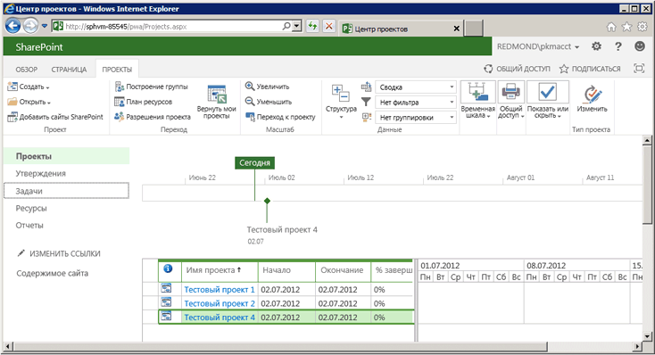

# <a name="getting-started-with-the-project-server-csom-and-net"></a><span data-ttu-id="e8984-105">Начало работы с CSOM Project Server и .NET</span><span class="sxs-lookup"><span data-stu-id="e8984-105">Getting started with the Project Server CSOM and .NET</span></span>

<span data-ttu-id="e8984-106">Клиентскую объектную модель (CSOM) Project Server 2013 можно использовать для разработки решений Project Online и локальных решений с помощью .NET Framework 4.</span><span class="sxs-lookup"><span data-stu-id="e8984-106">You can use the Project Server 2013 client-side object model (CSOM) to develop Project Online and on-premises solutions with the .NET Framework 4.</span></span> <span data-ttu-id="e8984-107">В этой статье описано создание консольного приложения, использующего CSOM для создания и публикации проектов.</span><span class="sxs-lookup"><span data-stu-id="e8984-107">This article describes how to create a console application that uses the CSOM to create and publish projects.</span></span> <span data-ttu-id="e8984-108">После публикации проекта приложение ожидает, пока служба очередей Project Server не завершит публикацию, а затем выводит список опубликованных проектов.</span><span class="sxs-lookup"><span data-stu-id="e8984-108">After publishing a project, the application waits for the Project Server Queue Service to finish with the publish action, and then lists the published projects.</span></span>
  
<span data-ttu-id="e8984-109">Общие сведения о CSOM Project Server см. в статье [Обновления для разработчиков решений в Project 2013](updates-for-developers-in-project-2013.md).</span><span class="sxs-lookup"><span data-stu-id="e8984-109">For a general introduction to the Project Server CSOM, see [Updates for developers in Project 2013](updates-for-developers-in-project-2013.md).</span></span> <span data-ttu-id="e8984-110">Справочные материалы по пространству имен CSOM см. в статье [Microsoft.ProjectServer.Client](https://msdn.microsoft.com/library/Microsoft.ProjectServer.Client.aspx).</span><span class="sxs-lookup"><span data-stu-id="e8984-110">For reference topics in the CSOM namespace, see [Microsoft.ProjectServer.Client](https://msdn.microsoft.com/library/Microsoft.ProjectServer.Client.aspx) .</span></span> 
  
## <a name="creating-a-csom-project-in-visual-studio"></a><span data-ttu-id="e8984-111">Создание проекта CSOM в Visual Studio</span><span class="sxs-lookup"><span data-stu-id="e8984-111">Creating a CSOM project in Visual Studio</span></span>
<span data-ttu-id="e8984-112"><a name="pj15_GettingStartedCSOM_CreatingVSProject"> </a></span><span class="sxs-lookup"><span data-stu-id="e8984-112"></span></span>

<span data-ttu-id="e8984-113">Разрабатывать решения, использующие CSOM Project Server, можно в Visual Studio 2010 или Visual Studio 2012.</span><span class="sxs-lookup"><span data-stu-id="e8984-113">You can use Visual Studio 2010 or Visual Studio 2012 to develop solutions that use the Project Server CSOM.</span></span> <span data-ttu-id="e8984-114">CSOM Project Server включает в себя три сборки для разработки клиентских приложений, приложений Microsoft Silverlight и приложений для Windows Phone 8 с помощью .NET Framework 4.</span><span class="sxs-lookup"><span data-stu-id="e8984-114">The Project Server CSOM includes three assemblies for development of client applications, Microsoft Silverlight applications, and Windows Phone 8 applications by using the .NET Framework 4.</span></span> <span data-ttu-id="e8984-115">CSOM также включает файл JavaScript для разработки веб-приложений, как описано в статье [Microsoft.ProjectServer.Client](https://msdn.microsoft.com/library/Microsoft.ProjectServer.Client.aspx).</span><span class="sxs-lookup"><span data-stu-id="e8984-115">The CSOM also includes a JavaScript file for development of web applications, as described in [Microsoft.ProjectServer.Client](https://msdn.microsoft.com/library/Microsoft.ProjectServer.Client.aspx) .</span></span> 
  
<span data-ttu-id="e8984-116">Вы можете скопировать необходимую сборку CSOM с компьютера с Project Server или из скачанного пакета SDK для Project 2013 на удаленный компьютер разработчика.</span><span class="sxs-lookup"><span data-stu-id="e8984-116">You can copy the CSOM assembly that you need from the Project Server computer or from the Project 2013 SDK download to a remote development computer.</span></span> <span data-ttu-id="e8984-117">Консольное приложение **QueueCreateProject**, описанное в этой статье, не является приложением Silverlight или приложением для Windows Phone 8, поэтому вам понадобится сборка Microsoft.ProjectServer.Client.dll.</span><span class="sxs-lookup"><span data-stu-id="e8984-117">The **QueueCreateProject** console application that is described in this topic is not a Silverlight application or a Windows Phone 8 application, so you need the Microsoft.ProjectServer.Client.dll assembly.</span></span> <span data-ttu-id="e8984-118">Так как CSOM не зависит от интерфейса Project Server (PSI) на основе WCF или ASMX, добавлять ссылки на службы для PSI или использовать пространство имен **Microsoft.Office.Project.Server.Library** необязательно.</span><span class="sxs-lookup"><span data-stu-id="e8984-118">Because the CSOM is independent of the WCF-based or ASMX-based Project Server Interface (PSI), you do not have to set service references for the PSI or use the **Microsoft.Office.Project.Server.Library** namespace.</span></span> 
  
<span data-ttu-id="e8984-p106">В приложении **QueueCreateProject** в качестве имени создаваемого проекта и максимального времени ожидания очереди используются аргументы командной строки. В процедуре 1 создается базовое консольное приложение, добавляется подпрограмма анализа командной строки, а также сообщение об использовании, если в командной строке есть ошибки.</span><span class="sxs-lookup"><span data-stu-id="e8984-p106">The **QueueCreateProject** application uses command-line arguments for the name of the project to create and for the queue timeout limit. In Procedure 1, you create the basic console application, add a routine to parse the command line, and add a usage message if there are errors in the command line.</span></span> 
  
### <a name="procedure-1-to-create-a-csom-project-in-visual-studio"></a><span data-ttu-id="e8984-p107">Процедура 1. Создание проекта CSOM в Visual Studio</span><span class="sxs-lookup"><span data-stu-id="e8984-p107">Procedure 1. To create a CSOM project in Visual Studio</span></span>

1. <span data-ttu-id="e8984-123">Скопируйте сборку Microsoft.ProjectServer.Client.dll из папки `%ProgramFiles%\Common Files\Microsoft Shared\Web Server Extensions\15\ISAPI\` на компьютер разработчика.</span><span class="sxs-lookup"><span data-stu-id="e8984-123">Copy the Microsoft.ProjectServer.Client.dll assembly from the  `%ProgramFiles%\Common Files\Microsoft Shared\Web Server Extensions\15\ISAPI\` folder to your development computer.</span></span> <span data-ttu-id="e8984-124">Скопируйте сборку в папку с удобным расположением для других сборок Project Server и SharePoint, на которые вы собираетесь ссылаться (например, `C:\Project\Assemblies`).</span><span class="sxs-lookup"><span data-stu-id="e8984-124">Copy the assembly to a convenient folder for other Project Server and SharePoint reference assemblies that you will use, such as  `C:\Project\Assemblies`.</span></span>
    
2. <span data-ttu-id="e8984-p109">Скопируйте сборки Microsoft.SharePoint.Client.dll и Microsoft.SharePoint.Client.Runtime.dll из той же исходной папки на компьютер разработчика. Сборка Microsoft.ProjectServer.Client.dll зависит от связанных сборок SharePoint.</span><span class="sxs-lookup"><span data-stu-id="e8984-p109">Copy the Microsoft.SharePoint.Client.dll assembly and the Microsoft.SharePoint.Client.Runtime.dll assembly from the same source folder to your development computer. The Microsoft.ProjectServer.Client.dll assembly has dependencies on the related SharePoint assemblies.</span></span>
    
3. <span data-ttu-id="e8984-127">В Visual Studio создайте консольное приложение Windows и задайте требуемую версию .NET Framework 4.</span><span class="sxs-lookup"><span data-stu-id="e8984-127">In Visual Studio, create a Windows console application, and set the target framework to .NET Framework 4.</span></span> <span data-ttu-id="e8984-128">Например, присвойте приложению имя QueueCreateProject.</span><span class="sxs-lookup"><span data-stu-id="e8984-128">For example, name the application QueueCreateProject.</span></span>
    
   > [!NOTE]
   > <span data-ttu-id="e8984-p111">Если вы забыли задать требуемую версию, после создания проекта в Visual Studio откройте окно **Свойства QueueCreateProject** в меню **Проект**. На вкладке **Приложение** в раскрывающемся списке **Требуемая версия .NET Framework** выберите **.NET Framework 4**. Не используйте вариант **Клиентский профиль .NET Framework 4**.</span><span class="sxs-lookup"><span data-stu-id="e8984-p111">If you forget to set the correct target, after Visual Studio creates the project, open **QueueCreateProject Properties** in the **Project** menu. On the **Application** tab, in the **Target framework** drop-down list, choose **.NET Framework 4**. Do not use the **.NET Framework 4 Client Profile**.</span></span> 
  
4. <span data-ttu-id="e8984-132">В обозревателе решений добавьте ссылки на указанные ниже сборки.</span><span class="sxs-lookup"><span data-stu-id="e8984-132">In Solution Explorer, set references to the following assemblies:</span></span>
    
   - <span data-ttu-id="e8984-133">Microsoft.ProjectServer.Client.dll</span><span class="sxs-lookup"><span data-stu-id="e8984-133">Microsoft.ProjectServer.Client.dll</span></span>
   - <span data-ttu-id="e8984-134">Microsoft.SharePoint.Client.dll</span><span class="sxs-lookup"><span data-stu-id="e8984-134">Microsoft.SharePoint.Client.dll</span></span>
   - <span data-ttu-id="e8984-135">Microsoft.SharePoint.Client.Runtime.dll</span><span class="sxs-lookup"><span data-stu-id="e8984-135">Microsoft.SharePoint.Client.Runtime.dll</span></span>
    
5. <span data-ttu-id="e8984-136">В файле Program.cs измените операторы `using`, как показано ниже.</span><span class="sxs-lookup"><span data-stu-id="e8984-136">In the Program.cs file, edit the  `using` statements, as follows.</span></span> 
    
   ```cs
    using System;
    using System.Collections.Generic;
    using System.Linq;
    using System.Text;
    using Microsoft.ProjectServer.Client;
   ```

6. <span data-ttu-id="e8984-p112">Добавьте методы анализа аргументов командной строки для имени проекта и укажите время ожидания очереди, отображения сведений об использовании и выхода из приложения (в секундах). Замените основной код в файле Program.cs указанным ниже кодом.</span><span class="sxs-lookup"><span data-stu-id="e8984-p112">Add methods to parse the command-line arguments for the project name and the number of seconds for queue timeout, show usage information, and exit the application. Replace the main body of code in the Program.cs file with the following code.</span></span>
    
   ```cs
    namespace QueueCreateProject
    {
        class Program
        {
            static void Main(string[] args)
            {
                if (!ParseCommandLine(args))
                {
                    Usage();
                    ExitApp();
                }
                /* Add calls to methods here to get the project context and create a project. */
                ExitApp();
            }
            // Parse the command line. Return true if there are no errors.
            private static bool ParseCommandLine(string[] args)
            {
                bool error = false;
                int argsLen = args.Length;
                try
                {
                    for (int i = 0; i < argsLen; i++)
                    {
                        if (error) break;
                        if (args[i].StartsWith("-") || args[i].StartsWith("/"))
                            args[i] = "*" + args[i].Substring(1).ToLower();
                        switch (args[i])
                        {
                            case "*projname":
                            case "*n":
                                if (++i >= argsLen) return false;
                                projName = args[i];
                                break;
                            case "*timeout":
                            case "*t":
                                if (++i >= argsLen) return false;
                                timeoutSeconds = Convert.ToInt32(args[i]);
                                break;
                            case "*?":
                            default:
                                error = true;
                                break;
                        }
                    }
                }
                catch (FormatException)
                {
                    error = true;
                }
                if (string.IsNullOrEmpty(projName)) error = true;
                return !error;
            }
            private static void Usage()
            {
                string example = "Usage: QueueCreateProject -projName | -n \"New project name\" [-timeout | -t sec]";
                example += "\nExample: QueueCreateProject -n \"My new project\"";
                example += "\nDefault timeout seconds = " + timeoutSeconds.ToString();
                Console.WriteLine(example);
            }
            private static void ExitApp()
            {
                Console.Write("\nPress any key to exit... ");
                Console.ReadKey(true);
                Environment.Exit(0);
            }
        }
    }
   ```

## <a name="getting-the-project-context"></a><span data-ttu-id="e8984-139">Получение контекста проекта</span><span class="sxs-lookup"><span data-stu-id="e8984-139">Getting the project context</span></span>
<span data-ttu-id="e8984-140"><a name="pj15_GettingStartedCSOM_GettingContext"> </a></span><span class="sxs-lookup"><span data-stu-id="e8984-140"></span></span>

<span data-ttu-id="e8984-141">При разработке CSOM требуется инициализировать объект **ProjectContext** с помощью URL-адреса Project Web App.</span><span class="sxs-lookup"><span data-stu-id="e8984-141">CSOM development requires the **ProjectContext** object to be initialized with the Project Web App URL.</span></span> <span data-ttu-id="e8984-142">В коде в процедуре 2 используется константа **pwaPath**.</span><span class="sxs-lookup"><span data-stu-id="e8984-142">The code in Procedure 2 uses the **pwaPath** constant.</span></span> <span data-ttu-id="e8984-143">Если вы планируете использовать приложение для нескольких экземпляров Project Web App, можете сделать **pwaPath** переменной и добавить еще один аргумент командной строки.</span><span class="sxs-lookup"><span data-stu-id="e8984-143">If you plan to use the application for multiple instances of Project Web App, you could make **pwaPath** a variable and add another command-line argument.</span></span> 
  
### <a name="procedure-2-to-get-the-project-context"></a><span data-ttu-id="e8984-p114">Процедура 2. Получение контекста проекта</span><span class="sxs-lookup"><span data-stu-id="e8984-p114">Procedure 2. To get the project context</span></span>

1. <span data-ttu-id="e8984-146">Добавьте константы и переменные класса **Program**, которые будет использовать приложение **QueueCreateProject**.</span><span class="sxs-lookup"><span data-stu-id="e8984-146">Add **Program** class constants and variables that the **QueueCreateProject** application will use.</span></span> <span data-ttu-id="e8984-147">Кроме URL-адреса Project Web App, приложение использует имя типа корпоративного проекта (EPT) по умолчанию, имя создаваемого проекта и максимальное время ожидания очереди в секундах.</span><span class="sxs-lookup"><span data-stu-id="e8984-147">In addition to the Project Web App URL, the application uses the name of the default enterprise project type (EPT), the name of the project to create, and a maximum queue timeout in seconds.</span></span> <span data-ttu-id="e8984-148">В этом случае переменная **timeoutSeconds** позволяет проверить влияние различных значений времени ожидания на приложение.</span><span class="sxs-lookup"><span data-stu-id="e8984-148">In this case, the **timeoutSeconds** variable enables you to test how various values for the timeout affect the application.</span></span> <span data-ttu-id="e8984-149">Объект **ProjectContext** является основным для доступа к CSOM.</span><span class="sxs-lookup"><span data-stu-id="e8984-149">The **ProjectContext** object is the primary object for access to the CSOM.</span></span> 
    
   ```cs
    private const string pwaPath = "https://ServerName /pwa/"; // Change the path to your Project Web App instance.
    private static string basicEpt = "Enterprise Project";   // Basic enterprise project type.
    private static string projName = string.Empty;
    private static int timeoutSeconds = 10;  // The maximum wait time for a queue job, in seconds.
    private static ProjectContext projContext;
   ```

2. <span data-ttu-id="e8984-150">Замените комментарий `/* Add calls to methods here to get the project context and create a project. */` приведенным ниже кодом.</span><span class="sxs-lookup"><span data-stu-id="e8984-150">Replace the  `/* Add calls to methods here to get the project context and create a project. */` comment with the following code.</span></span> <span data-ttu-id="e8984-151">Объект **Microsoft.ProjectServer.Client.ProjectContext** инициализируется с использованием URL-адреса Project Web App.</span><span class="sxs-lookup"><span data-stu-id="e8984-151">The **Microsoft.ProjectServer.Client.ProjectContext** object is initialized with the Project Web App URL.</span></span> <span data-ttu-id="e8984-152">Методы **CreateTestProject** и **ListPublishedProjects** показаны в процедуре 4 и процедуре 5.</span><span class="sxs-lookup"><span data-stu-id="e8984-152">The **CreateTestProject** method and the **ListPublishedProjects** method are shown in Procedure 4 and Procedure 5.</span></span> 
    
   ```cs
    projContext = new ProjectContext(pwaPath);
    if (CreateTestProject())
        ListPublishedProjects();
    else
        Console.WriteLine("\nProject creation failed: {0}", projName);
   ```

## <a name="getting-an-enterprise-project-type"></a><span data-ttu-id="e8984-153">Получение типа корпоративного проекта</span><span class="sxs-lookup"><span data-stu-id="e8984-153">Getting an enterprise project type</span></span>
<span data-ttu-id="e8984-154"><a name="pj15_GettingStartedCSOM_GettingEPT"> </a></span><span class="sxs-lookup"><span data-stu-id="e8984-154"></span></span>

<span data-ttu-id="e8984-p117">В примере приложения **QueueCreateProject** показан выбор типа корпоративного проекта Enterprise Project. Если в сведениях о создании проекта не указан GUID EPT, приложение будет использовать EPT по умолчанию. Метод **GetEptUid** используется методом **CreateTestProject**, описанным в процедуре 4.</span><span class="sxs-lookup"><span data-stu-id="e8984-p117">The **QueueCreateProject** sample application explicitly selects the Enterprise Project EPT, to show how an application can select the EPT for a project. If the project creation information does not specify the EPT GUID, an application would use the default EPT. The **GetEptUid** method is used by the **CreateTestProject** method that is described in Procedure 4.</span></span> 
  
<span data-ttu-id="e8984-p118">Метод **GetEptUid** запрашивает в объекте **ProjectContext** коллекцию объектов **EnterpriseProjectTypes** с указанным именем EPT. После выполнения запроса для переменной **eptUid** задается GUID первого объекта **EnterpriseProjectType** в коллекции **eptList**. Так как имена EPT уникальны, имеется только один объект **EnterpriseProjectType** с указанным именем.</span><span class="sxs-lookup"><span data-stu-id="e8984-p118">The **GetEptUid** method queries the **ProjectContext** object for the collection of **EnterpriseProjectTypes** where the EPT name equals the specified name. After executing the query, the **eptUid** variable is set to the GUID of the first **EnterpriseProjectType** object in the **eptList** collection. Because EPT names are unique, there is only one **EnterpriseProjectType** object that has the specified name.</span></span> 
  
### <a name="procedure-3-to-get-the-guid-of-an-ept-for-a-new-project"></a><span data-ttu-id="e8984-p119">Процедура 3. Получение GUID EPT для нового проекта</span><span class="sxs-lookup"><span data-stu-id="e8984-p119">Procedure 3. To get the GUID of an EPT for a new project</span></span>

- <span data-ttu-id="e8984-163">Добавьте метод **GetEptUid** в класс **Program**.</span><span class="sxs-lookup"><span data-stu-id="e8984-163">Add the **GetEptUid** method to the **Program** class.</span></span> 
    
   ```cs
    // Get the GUID of the specified enterprise project type.
    private static Guid GetEptUid(string eptName)
    {
        Guid eptUid = Guid.Empty;
        try
        {
            // Get the list of EPTs that have the specified name. 
            // If the EPT name exists, the list will contain only one EPT.
            var eptList = projContext.LoadQuery(
                projContext.EnterpriseProjectTypes.Where(
                    ept => ept.Name == eptName));
            projContext.ExecuteQuery();
            eptUid = eptList.First().Id;
        }
        catch (Exception ex)
        {
            string msg = string.Format("GetEptUid: eptName = \"{0}\"\n\n{1}",
                eptName, ex.GetBaseException().ToString());
            throw new ArgumentException(msg);
        }
        return eptUid;
    }
   ```

<span data-ttu-id="e8984-p120">Найти GUID EPT можно несколькими способами. Показанный в методе **GetEptUid** запрос эффективен, так как он скачивает только один объект **EnterpriseProjectType**, который соответствует имени EPT. Приведенная ниже альтернативная подпрограмма менее эффективна, так как она скачивает полный список EPT в клиентское приложение и выполняет итерацию по списку.</span><span class="sxs-lookup"><span data-stu-id="e8984-p120">There are several ways to find the EPT GUID. The query shown in the **GetEptUid** method is efficient because it downloads only the one **EnterpriseProjectType** object that matches the EPT name. The following alternate routine is less efficient, because it downloads the complete list of EPTs to the client application and iterates through the list.</span></span> 

```cs
foreach (EnterpriseProjectType ept in projSvr.EnterpriseProjectTypes)
{
    if (ept.Name == eptName)
    {
        eptUid = ept.Id;
        break;
    }
}
```

<span data-ttu-id="e8984-167">Указанная ниже подпрограмма использует запрос LINQ и лямбда-выражение для выбора объекта EPT, но все равно скачивает все объекты **EnterpriseProjectType**.</span><span class="sxs-lookup"><span data-stu-id="e8984-167">The following routine uses a LINQ query and lambda expression to select the EPT object, but still downloads all of the **EnterpriseProjectType** objects.</span></span> 

```cs
var eptList = projContext.LoadQuery(projContext.EnterpriseProjectTypes);
projContext.ExecuteQuery();
eptUid = eptList.First(ept => ept.Name == eptName).Id;
```

## <a name="setting-the-creation-information-and-publishing-the-project"></a><span data-ttu-id="e8984-168">Задание сведений о создании и публикация проекта</span><span class="sxs-lookup"><span data-stu-id="e8984-168">Setting the creation information and publishing the project</span></span>
<span data-ttu-id="e8984-169"><a name="pj15_GettingStartedCSOM_ProjectCreation"> </a></span><span class="sxs-lookup"><span data-stu-id="e8984-169"></span></span>

<span data-ttu-id="e8984-p121">Метод **CreateTestProject** создает объект **ProjectCreationInformation** и указывает сведения, необходимые для создания проекта. Требуется указать GUID и имя проекта. Дату начала, описание проекта и GUID EPT указывать необязательно.</span><span class="sxs-lookup"><span data-stu-id="e8984-p121">The **CreateTestProject** method creates a **ProjectCreationInformation** object and specifies the information that is required to create a project. The project GUID and name are required; the start date, project description, and EPT GUID are optional.</span></span> 
  
<span data-ttu-id="e8984-p122">После того как свойства нового проекта заданы, метод **Projects.Add** добавляет его в коллекцию **Projects**. Чтобы сохранить и опубликовать проект, необходимо вызвать метод **Projects.Update**, чтобы отправить сообщение в очередь Project Server и создать проект.</span><span class="sxs-lookup"><span data-stu-id="e8984-p122">After setting the new project properties, the **Projects.Add** method adds the project to the **Projects** collection. To save and publish the project, you must call the **Projects.Update** method to send a message to the Project Server queue and create the project.</span></span> 
  
### <a name="procedure-4-to-set-the-new-project-properties-create-the-project-and-publish-the-project"></a><span data-ttu-id="e8984-p123">Процедура 4. Задание свойств нового проекта, его создание и публикация</span><span class="sxs-lookup"><span data-stu-id="e8984-p123">Procedure 4. To set the new project properties, create the project, and publish the project</span></span>

1. <span data-ttu-id="e8984-p124">Добавьте метод **CreateTestProject** в класс **Program**. Приведенный ниже код создает и публикует проект, но не дожидается завершения задания в очереди.</span><span class="sxs-lookup"><span data-stu-id="e8984-p124">Add the **CreateTestProject** method to the **Program** class. The following code creates and publishes a project, but does not wait for the queue job to complete.</span></span> 
    
   ```cs
    // Create a project.
    private static bool CreateTestProject()
    {
        bool projCreated = false;
        try
        {
            Console.Write("\nCreating project: {0} ...", projName);
            ProjectCreationInformation newProj = new ProjectCreationInformation();
            newProj.Id = Guid.NewGuid();
            newProj.Name = projName;
            newProj.Description = "Test creating a project with CSOM";
            newProj.Start = DateTime.Today.Date;
            // Setting the EPT GUID is optional. If no EPT is specified, Project Server  
            // uses the default EPT. 
            newProj.EnterpriseProjectTypeId = GetEptUid(basicEpt);
            PublishedProject newPublishedProj = projContext.Projects.Add(newProj);
            QueueJob qJob = projContext.Projects.Update();
            /* Add code here to wait for the queue. */
        }
        catch(Exception ex)
        {
            Console.ForegroundColor = ConsoleColor.Red;
            Console.WriteLine("\nError: {0}", ex.Message);
            Console.ResetColor();
        }
        return projCreated;
    }
   ```

2. <span data-ttu-id="e8984-178">Замените комментарий `/* Add code here to wait for the queue. */` приведенным ниже кодом, чтобы дождаться завершения задания в очереди.</span><span class="sxs-lookup"><span data-stu-id="e8984-178">Replace the  `/* Add code here to wait for the queue. */` comment with the following code to wait for the queue job.</span></span> <span data-ttu-id="e8984-179">Подпрограмма ожидает завершения в течение указанного времени в секундах (**timeoutSeconds**) или продолжает работу, если задание в очереди завершается раньше.</span><span class="sxs-lookup"><span data-stu-id="e8984-179">The routine waits a maximum of the specified **timeoutSeconds** number of seconds, or proceeds if the queue job completes before the timeout.</span></span> <span data-ttu-id="e8984-180">Возможные состояния заданий в очереди см. в статье [Microsoft.ProjectServer.Client.JobState](https://msdn.microsoft.com/library/Microsoft.ProjectServer.Client.JobState.aspx).</span><span class="sxs-lookup"><span data-stu-id="e8984-180">For possible queue job states, see [Microsoft.ProjectServer.Client.JobState](https://msdn.microsoft.com/library/Microsoft.ProjectServer.Client.JobState.aspx) .</span></span> 
    
   <span data-ttu-id="e8984-p126">Вызывать методы **Load** и **ExecuteQuery** для объекта **QueueJob** необязательно. Если объект **QueueJob** не инициализируется при вызове метода **WaitForQueue**, его инициализирует Project Server.</span><span class="sxs-lookup"><span data-stu-id="e8984-p126">Calling the **Load** method and the **ExecuteQuery** method for the **QueueJob** object is optional. If the **QueueJob** object is not initialized when you call the **WaitForQueue** method, Project Server initializes it.</span></span> 
    
   ```cs
    // Calling Load and ExecuteQuery for the queue job is optional.
    // projContext.Load(qJob);
    // projContext.ExecuteQuery();
    JobState jobState = projContext.WaitForQueue(qJob, timeoutSeconds);
    if (jobState == JobState.Success)
    {
        projCreated = true;
    }
    else
    {
        Console.ForegroundColor = ConsoleColor.Yellow;
        Console.WriteLine("\nThere is a problem in the queue. Timeout is {0} seconds.", 
            timeoutSeconds);
        Console.WriteLine("\tQueue JobState: {0}", jobState.ToString());
        Console.ResetColor();
    }
    Console.WriteLine();
   ```

## <a name="listing-the-published-projects"></a><span data-ttu-id="e8984-183">Перечисление опубликованных проектов</span><span class="sxs-lookup"><span data-stu-id="e8984-183">Listing the published projects</span></span>
<span data-ttu-id="e8984-184"><a name="pj15_GettingStartedCSOM_ListingPublished"> </a></span><span class="sxs-lookup"><span data-stu-id="e8984-184"></span></span>

<span data-ttu-id="e8984-185">Метод **ListPublishedProjects** получает коллекцию всех проектов, опубликованных в Project Web App.</span><span class="sxs-lookup"><span data-stu-id="e8984-185">The **ListPublishedProjects** method gets the collection of all projects that are published in Project Web App.</span></span> <span data-ttu-id="e8984-186">Новый проект не включается в коллекцию **Projects**, если задание в очереди, которое создает проект в процедуре 4, не удается выполнить или время его ожидания истекает.</span><span class="sxs-lookup"><span data-stu-id="e8984-186">If the queue job that creates a project in Procedure 4 does not complete successfully or times out, the new project is not included in the **Projects** collection.</span></span> 
  
### <a name="procedure-5-to-list-the-published-projects"></a><span data-ttu-id="e8984-p128">Процедура 5. Перечисление опубликованных проектов</span><span class="sxs-lookup"><span data-stu-id="e8984-p128">Procedure 5. To list the published projects</span></span>

1. <span data-ttu-id="e8984-189">Добавьте метод **ListPublishedProjects** в класс **Program**.</span><span class="sxs-lookup"><span data-stu-id="e8984-189">Add the **ListPublishedProjects** method to the **Program** class.</span></span> 
    
   ```cs
    // List the published projects.
    private static void ListPublishedProjects()
    {
        // Get the list of projects on the server.
        projContext.Load(projContext.Projects);
        projContext.ExecuteQuery();
        Console.WriteLine("\nProject ID : Project name : Created date");
        foreach (PublishedProject pubProj in projContext.Projects)
        {
            Console.WriteLine("\n\t{0} :\n\t{1} : {2}", pubProj.Id.ToString(), pubProj.Name,
                pubProj.CreatedDate.ToString());
        }
    }
   ```

2. <span data-ttu-id="e8984-190">Задайте правильное значение для URL-адреса Project Web App, скомпилируйте приложение **QueueCreateProject**, а затем протестируйте его, как описано в процедуре 6.</span><span class="sxs-lookup"><span data-stu-id="e8984-190">Set the correct value for your Project Web App URL, compile the **QueueCreateProject** application, and then test the application as in Procedure 6.</span></span> 
    
## <a name="testing-the-queuecreateproject-application"></a><span data-ttu-id="e8984-191">Тестирование приложения QueueCreateProject</span><span class="sxs-lookup"><span data-stu-id="e8984-191">Testing the QueueCreateProject application</span></span>
<span data-ttu-id="e8984-192"><a name="pj15_GettingStartedCSOM_Testing"> </a></span><span class="sxs-lookup"><span data-stu-id="e8984-192"></span></span>

<span data-ttu-id="e8984-193">Для первого запуска приложения **QueueCreateProject** в тестовом экземпляре Project Web App, особенно если Project Server установлен на виртуальной машине, приложению может потребоваться больше десяти секунд (время ожидания очереди по умолчанию).</span><span class="sxs-lookup"><span data-stu-id="e8984-193">When you first run the **QueueCreateProject** application on a test instance of Project Web App, especially if Project Server is installed on a virtual machine, the application may require more time to run than the default queue timeout of ten seconds.</span></span> 
  
### <a name="procedure-6-to-test-the-queuecreateproject-application"></a><span data-ttu-id="e8984-p129">Процедура 6. Тестирование приложения QueueCreateProject</span><span class="sxs-lookup"><span data-stu-id="e8984-p129">Procedure 6. To test the QueueCreateProject application</span></span>

1. <span data-ttu-id="e8984-196">Откройте окно **Свойства QueueCreateProject**, перейдите на вкладку **Отладка**, а затем добавьте следующие аргументы командной строки в раздел **Параметры запуска**: `-n "Test proj 1" -t 20`.</span><span class="sxs-lookup"><span data-stu-id="e8984-196">Open the **QueueCreateProject Properties** window, select the **Debug** tab, and then add the following command-line arguments in the **Start Options** section:  `-n "Test proj 1" -t 20`</span></span>
    
   <span data-ttu-id="e8984-197">Запустите приложение (например, нажмите клавишу **F5**).</span><span class="sxs-lookup"><span data-stu-id="e8984-197">Run the application (for example, press **F5**).</span></span> <span data-ttu-id="e8984-198">Если времени ожидания достаточно, в приложении отобразятся следующие данные (если в экземпляре Project Web App есть другие опубликованные проекты, они также будут показаны):</span><span class="sxs-lookup"><span data-stu-id="e8984-198">If the timeout value is long enough, the application shows the following output (if other published projects exist in your Project Web App instance, they will also be shown):</span></span>
    
   ```MS-DOS
    Creating project: Test proj 1 ...
    Project ID : Project name : Created date
            b34d7009-753f-4abb-9191-f4b15a82aac3 :
            Test proj 1 : 9/22/2011 11:27:57 AM
    Press any key to exit...
   ```

2. <span data-ttu-id="e8984-199">Чтобы использовать время ожидания очереди по умолчанию (10 с), выполните еще одну проверку со следующими аргументами командной строки: `-n "Test proj 1"`.</span><span class="sxs-lookup"><span data-stu-id="e8984-199">Run another test with the following command-line arguments, to use the default 10-second queue timeout: `-n "Test proj 1"`</span></span>
    
   <span data-ttu-id="e8984-200">Так как проект Test proj 1 уже существует, в приложении отобразятся указанные ниже данные.</span><span class="sxs-lookup"><span data-stu-id="e8984-200">Because Test proj 1 already exists, the application shows the following output.</span></span>
    
   ```MS-DOS
    Creating project: Test proj 1 ...
    Error: PJClientCallableException: ProjectNameAlreadyExists
    ProjectNameAlreadyExists
    projName = Test proj 1
    Project creation failed: Test proj 1
    Press any key to exit...
   ```

3. <span data-ttu-id="e8984-201">Чтобы использовать время ожидания очереди по умолчанию (10 с), выполните еще одну проверку со следующими аргументами командной строки: `-n "Test proj 2"`.</span><span class="sxs-lookup"><span data-stu-id="e8984-201">Run another test with the following command-line arguments, to use the default 10-second queue timeout:  `-n "Test proj 2"`</span></span>
    
   <span data-ttu-id="e8984-202">Приложение **QueueCreateProject** создаст и опубликует проект Test proj 2.</span><span class="sxs-lookup"><span data-stu-id="e8984-202">The **QueueCreateProject** application creates and publishes the project named Test proj 2.</span></span> 
    
4. <span data-ttu-id="e8984-203">Задав время ожидания, недостаточное для завершения задания в очереди, выполните еще одну проверку со следующими аргументами командной строки: `-n "Test proj 3" -t 1`.</span><span class="sxs-lookup"><span data-stu-id="e8984-203">Run another test with the following command-line arguments, and set the timeout to be too short for the queue job to finish:  `-n "Test proj 3" -t 1`</span></span>
    
   <span data-ttu-id="e8984-p131">Так как времени ожидания очереди недостаточно, проект не будет создан. В приложении отобразятся приведенные ниже данные.</span><span class="sxs-lookup"><span data-stu-id="e8984-p131">Because the queue timeout is too short, the project is not created. The application shows the following output.</span></span>
    
   ```MS-DOS
    Creating project: Test proj 3 ...
    There is a problem in the queue. Timeout is 1 seconds.
            Queue JobState: Unknown
    Project creation failed: Test proj 3
    Press any key to exit...
   ```

5. <span data-ttu-id="e8984-206">Измените код, чтобы приложение не дожидалось завершения задания в очереди.</span><span class="sxs-lookup"><span data-stu-id="e8984-206">Modify the code so that the application does not wait for the queue job.</span></span> <span data-ttu-id="e8984-207">Например, закомментируйте код ожидания очереди (кроме строки `projCreated = true`), как показано ниже.</span><span class="sxs-lookup"><span data-stu-id="e8984-207">For example, comment out the code that waits for the queue, except for the  `projCreated = true` line, as follows.</span></span> 
    
   ```cs
    //JobState jobState = projContext.WaitForQueue(qJob, timeoutSeconds);
    //if (jobState == JobState.Success)
    //{
    projCreated = true;
    //}
    //else
    //{
    //    Console.ForegroundColor = ConsoleColor.Yellow;
    //    Console.WriteLine("\nThere is a problem in the queue. Timeout is {0} seconds.",
    //        timeoutSeconds);
    //    Console.WriteLine("\tQueue JobState: {0}", jobState.ToString());
    //    Console.ResetColor();
    //}
    
   ```

6. <span data-ttu-id="e8984-208">Повторно скомпилируйте приложение и выполните еще одну проверку со следующими аргументами командной строки: `-n "Test proj 4"`.</span><span class="sxs-lookup"><span data-stu-id="e8984-208">Recompile the application and run another test with the following command-line arguments:  `-n "Test proj 4"`</span></span>
    
   <span data-ttu-id="e8984-p133">Так как подпрограмма **WaitForQueue** закомментирована, приложение не использует значение времени ожидания по умолчанию. Несмотря на то, что приложение не ждет очереди, в нем может отобразиться проект Test proj 4, если публикация на Project Server будет выполнена достаточно быстро.</span><span class="sxs-lookup"><span data-stu-id="e8984-p133">Because the **WaitForQueue** routine is commented out, the application does not use the default timeout value. Even though the application does not wait for the queue, it may show Test proj 4, if the publish action in Project Server is fast enough.</span></span> 
    
   ```MS-DOS
    Creating project: Test proj 4 ...
    Project ID : Project name : Created date
            cdd54103-082f-425c-b075-9ff52ac7d4e6 :
            Test proj 2 : 9/25/2011 4:28:55 PM
            b34d7009-753f-4abb-9191-f4b15a82aac3 :
            Test proj 1 : 9/22/2011 11:27:57 AM
            5c0c73f2-f5dd-499b-8bd8-ebb74bf8c122 :
            Test proj 4 : 9/25/2011 4:39:21 PM
    Press any key to exit...
   ```

<span data-ttu-id="e8984-211">Обновите страницу центра проектов в Project Web App (`https://ServerName/ProjectServerName/Projects.aspx`), чтобы отобразить опубликованные проекты.</span><span class="sxs-lookup"><span data-stu-id="e8984-211">Refresh the Project Center page in Project Web App (`https://ServerName/ProjectServerName/Projects.aspx`), to show the published projects.</span></span> <span data-ttu-id="e8984-212">На приведенном ниже рисунке видно, что тестовые проекты опубликованы.</span><span class="sxs-lookup"><span data-stu-id="e8984-212">The following figure shows that the test projects are published.</span></span>

<span data-ttu-id="e8984-213">**Проверка опубликованных проектов в Project Web App**</span><span class="sxs-lookup"><span data-stu-id="e8984-213">**Checking the published projects in Project Web App**</span></span>

<span data-ttu-id="e8984-214"></span><span class="sxs-lookup"><span data-stu-id="e8984-214"></span></span>
  
<span data-ttu-id="e8984-215">На примере приложения **QueueCreateProject** мы показали, как создать проект с помощью CSOM, используя класс **ProjectCreationInformation**, добавить проект в опубликованную коллекцию, дождаться завершения задания в очереди с помощью метода **WaitForQueue** и перечислить коллекцию опубликованных проектов.</span><span class="sxs-lookup"><span data-stu-id="e8984-215">The **QueueCreateProject** sample application shows a typical example of how to create a project entity with the CSOM by using the **ProjectCreationInformation** class, how to add the project to the published collection, how to wait for a queue job by using the **WaitForQueue** method, and how to enumerate the collection of published projects.</span></span> 
  
## <a name="complete-code-example"></a><span data-ttu-id="e8984-216">Полный пример кода</span><span class="sxs-lookup"><span data-stu-id="e8984-216">Complete code example</span></span>
<span data-ttu-id="e8984-217"><a name="pj15_GettingStartedCSOM_CompleteCode"> </a></span><span class="sxs-lookup"><span data-stu-id="e8984-217"></span></span>

<span data-ttu-id="e8984-218">Ниже приведен полный код приложения **QueueCreateProject**.</span><span class="sxs-lookup"><span data-stu-id="e8984-218">The following is the complete code for the **QueueCreateProject** sample application.</span></span> <span data-ttu-id="e8984-219">Ссылка на класс [Microsoft.ProjectServer.Client.ProjectCreationInformation](https://msdn.microsoft.com/library/Microsoft.ProjectServer.Client.ProjectCreationInformation.aspx) также содержит код в этой статье.</span><span class="sxs-lookup"><span data-stu-id="e8984-219">The [Microsoft.ProjectServer.Client.ProjectCreationInformation](https://msdn.microsoft.com/library/Microsoft.ProjectServer.Client.ProjectCreationInformation.aspx) class reference also includes the code in this topic.</span></span> 
  
```cs
using System;
using System.Collections.Generic;
using System.Linq;
using System.Text;
using Microsoft.ProjectServer.Client;
namespace QueueCreateProject
{
    class Program
    {
        private const string pwaPath = "https://ServerName /pwa/"; // Change the path to your Project Web App instance.
        private static string basicEpt = "Enterprise Project";   // Basic enterprise project type.
        private static string projName = string.Empty;
        private static int timeoutSeconds = 10;  // The maximum wait time for a queue job, in seconds.
        private static ProjectContext projContext;
        static void Main(string[] args)
        {
            if (!ParseCommandLine(args))
            {
                Usage();
                ExitApp();
            }
            projContext = new ProjectContext(pwaPath);
            if (CreateTestProject())
                ListPublishedProjects();
            else
                Console.WriteLine("\nProject creation failed: {0}", projName);
            ExitApp();
        }
        // Create a project.
        private static bool CreateTestProject()
        {
            bool projCreated = false;
            try
            {
                Console.Write("\nCreating project: {0} ...", projName);
                ProjectCreationInformation newProj = new ProjectCreationInformation();
                newProj.Id = Guid.NewGuid();
                newProj.Name = projName;
                newProj.Description = "Test creating a project with CSOM";
                newProj.Start = DateTime.Today.Date;
                // Setting the EPT GUID is optional. If no EPT is specified, Project Server uses 
                // the default EPT. 
                newProj.EnterpriseProjectTypeId = GetEptUid(basicEpt);
                PublishedProject newPublishedProj = projContext.Projects.Add(newProj);
                QueueJob qJob = projContext.Projects.Update();
                // Calling Load and ExecuteQuery for the queue job is optional. If qJob is 
                // not initialized when you call WaitForQueue, Project Server initializes it.
                // projContext.Load(qJob);
                // projContext.ExecuteQuery();
                JobState jobState = projContext.WaitForQueue(qJob, timeoutSeconds);
                if (jobState == JobState.Success)
                {
                    projCreated = true;
                }
                else
                {
                    Console.ForegroundColor = ConsoleColor.Yellow;
                    Console.WriteLine("\nThere is a problem in the queue. Timeout is {0} seconds.", 
                        timeoutSeconds);
                    Console.WriteLine("\tQueue JobState: {0}", jobState.ToString());
                    Console.ResetColor();
                }
                Console.WriteLine();
            }
            catch(Exception ex)
            {
                Console.ForegroundColor = ConsoleColor.Red;
                Console.WriteLine("\nError: {0}", ex.Message);
                Console.ResetColor();
            }
            return projCreated;
        }
        // Get the GUID of the specified enterprise project type.
        private static Guid GetEptUid(string eptName)
        {
            Guid eptUid = Guid.Empty;
            try
            {
                // Get the list of EPTs that have the specified name. 
                // If the EPT name exists, the list will contain only one EPT.
                var eptList = projContext.LoadQuery(
                    projContext.EnterpriseProjectTypes.Where(
                        ept => ept.Name == eptName));
                projContext.ExecuteQuery();
                eptUid = eptList.First().Id;
                // Alternate routines to find the EPT GUID. Both (a) and (b) download the entire list of EPTs.
                // (a) Using a foreach block:
                //foreach (EnterpriseProjectType ept in projSvr.EnterpriseProjectTypes)
                //{
                //    if (ept.Name == eptName)
                //    {
                //        eptUid = ept.Id;
                //        break;
                //    }
                //}
                // (b) Querying for the EPT list, and then using a lambda expression to select the EPT:
                //var eptList = projContext.LoadQuery(projContext.EnterpriseProjectTypes);
                //projContext.ExecuteQuery();
                //eptUid = eptList.First(ept => ept.Name == eptName).Id;
            }
            catch (Exception ex)
            {
                string msg = string.Format("GetEptUid: eptName = \"{0}\"\n\n{1}",
                    eptName, ex.GetBaseException().ToString());
                throw new ArgumentException(msg);
            }
            return eptUid;
        }
        // List the published projects.
        private static void ListPublishedProjects()
        {
            // Get the list of projects on the server.
            projContext.Load(projContext.Projects);
            projContext.ExecuteQuery();
            Console.WriteLine("\nProject ID : Project name : Created date");
            foreach (PublishedProject pubProj in projContext.Projects)
            {
                Console.WriteLine("\n\t{0} :\n\t{1} : {2}", pubProj.Id.ToString(), pubProj.Name,
                    pubProj.CreatedDate.ToString());
            }
        }
        // Parse the command line. Return true if there are no errors.
        private static bool ParseCommandLine(string[] args)
        {
            bool error = false;
            int argsLen = args.Length;
            try
            {
                for (int i = 0; i < argsLen; i++)
                {
                    if (error) break;
                    if (args[i].StartsWith("-") || args[i].StartsWith("/"))
                        args[i] = "*" + args[i].Substring(1).ToLower();
                    switch (args[i])
                    {
                        case "*projname":
                        case "*n":
                            if (++i >= argsLen) return false;
                            projName = args[i];
                            break;
                        case "*timeout":
                        case "*t":
                            if (++i >= argsLen) return false;
                            timeoutSeconds = Convert.ToInt32(args[i]);
                            break;
                        case "*?":
                        default:
                            error = true;
                            break;
                    }
                }
            }
            catch (FormatException)
            {
                error = true;
            }
            if (string.IsNullOrEmpty(projName)) error = true;
            return !error;
        }
        private static void Usage()
        {
            string example = "Usage: QueueCreateProject -projName | -n \"New project name\" [-timeout | -t sec]";
            example += "\nExample: QueueCreateProject -n \"My new project\"";
            example += "\nDefault timeout seconds = " + timeoutSeconds.ToString();
            Console.WriteLine(example);
        }
        private static void ExitApp()
        {
            Console.Write("\nPress any key to exit... ");
            Console.ReadKey(true);
            Environment.Exit(0);
        }
    }
}
```

## <a name="see-also"></a><span data-ttu-id="e8984-220">См. также</span><span class="sxs-lookup"><span data-stu-id="e8984-220">See also</span></span>

- [<span data-ttu-id="e8984-221">Обновления для разработчиков решений в Project 2013</span><span class="sxs-lookup"><span data-stu-id="e8984-221">Updates for developers in Project 2013</span></span>](updates-for-developers-in-project-2013.md) 
- [<span data-ttu-id="e8984-222">Клиентская объектная модель (CSOM) для Project 2013</span><span class="sxs-lookup"><span data-stu-id="e8984-222">Client-side object model (CSOM) for Project 2013</span></span>](client-side-object-model-csom-for-project-2013.md)
    

