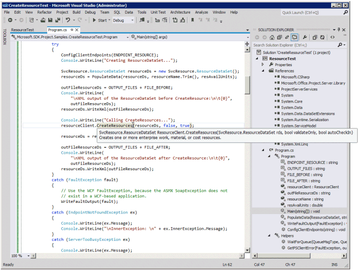
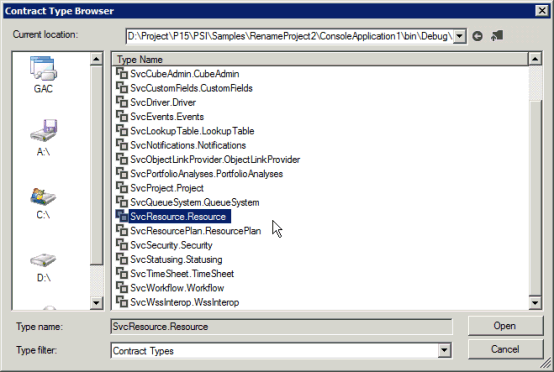

# <a name="prerequisites-for-wcf-based-code-samples-in-project"></a>Необходимые условия для примеров кода на основе WCF в Project

Узнайте, как создавать проекты в Visual Studio с помощью примеров кода на основе WCF, включенных в справочные разделы по интерфейсу Project Server (PSI).
   
Многие примеры кода на основе WCF, включенные в библиотеку классов [Project Server 2013](https://msdn.microsoft.com/library/ef1830e0-3c9a-4f98-aa0a-5556c298e7d1%28Office.15%29.aspx) и справочник по веб-службам, изначально были созданы для документации разработчика Project 2010 и использовали стандартный формат для веб-служб WCF. Примеры по-прежнему работают в Project Server 2013 и предназначены для копирования в консольное приложение и выполнения в качестве полного блока. Исключения из этого правила отмечаются в примере. 
  
В примерах кода в документации для разработчиков Project 2013, которые не изменились по сравнению с примерами, разработанными для Office Project Server 2007, используются веб-службы ASMX. Примеры на основе ASMX можно также адаптировать для использования служб WCF. В данной статье показывается, как использовать эти примеры со службами WCF. Сведения об использовании примеров с веб-службами ASMX см. в предварительных условия для примеров кода на основе [ASMX в Project.](prerequisites-for-asmx-based-code-samples-in-project.md)
  
> [!NOTE]
> Если клиентская объектная модель (CSOM) включает методы, необходимые для вашего приложения, то новые приложения следует разрабатывать с использованием этой CSOM. CSOM позволяет приложениям работать с Project Online или локальной установкой Project Server 2013. В противном случае, если ваше приложение использует интерфейс PSI, то оно должно использовать интерфейс WCF, что является рекомендуемой технологией для сетевого взаимодействия. Приложения, которые используют интерфейс ASMX или интерфейс WCF, могут работать только для локальной установки Project Server 2013. 
>
> Дополнительные сведения об CSOM см. в архитектуре [Project Server 2013](project-server-2013-architecture.md) и клиентской объектной модели [(CSOM) для Project 2013.](client-side-object-model-csom-for-project-2013.md) 
  
Перед запуском примеров кода необходимо настроить среду разработки, настроить приложение, добавить файл конфигурации службы (или настроить службы WCF программными средствами), а также изменить значения универсальных констант, чтобы они соответствовали вашей среде.
  
## <a name="setting-up-the-development-environment"></a>Настройка среды разработки
<a name="pj15_PrerequisitesWCF_Setup"> </a>

1. **Настройте тестовую систему Project Server.**
    
    При разработке или тестировании рекомендуется всегда использовать тестовую систему Project Server. Даже если ваш код работает отлично, взаимозависимости между проектами, отчеты или другие факторы среды могут привести к непредвиденным последствиям. 
    
    > [!NOTE]
    > Убедитесь, что вы являетесь допустимым пользователем на сервере, и проверьте наличие достаточных разрешений для выполнения вызовов PSI, используемых вашим приложением. В разделе документации для разработчиков по каждому методу PSI имеется таблица разрешений Project Server. Например, [методу Project.QueueCreateProject](https://msdn.microsoft.com/library/WebSvcProject.Project.QueueCreateProject.aspx) требуются глобальное разрешение **NewProject** и **saveProjectTemplate.** 
  
    В некоторых ситуациях может требоваться выполнение удаленной отладки на сервере. Кроме того, может потребоваться настроить обработщик событий, установив сборку обработщика событий на каждом компьютере Project Server в ферме SharePoint, а затем настроив обработщик событий для экземпляра Project Web App с помощью страницы параметров Project Server в общих параметрах приложения центра администрирования SharePoint.
    
2. **Настройте компьютер разработки.**
    
    Обычно доступ к интерфейсу PSI осуществляется по сети. Примеры кода разработаны для запуска на клиенте, находящемся отдельно от сервера, если не указано иное.
    
    1. **Установите правильную версию Visual Studio.** Если не указано иное, то примеры кода написаны на Visual C#. Их можно использовать с Visual Studio 2010 или Visual Studio 2012. Убедитесь, что установлен самый последний пакет обновления. 
    
    2. **Скопируйте библиотеки DDL Project Server на компьютер разработки.** Скопируйте следующие сборки с  `[Program Files]\Microsoft Office Servers\15.0\Bin` компьютера Project Server на компьютер разработки: 
    
       - Microsoft.Office.Project.Server.Events.Receivers.dll;
    
       - Microsoft.Office.Project.Server.Library.dll;
    
    3. Сведения о порядке компиляции и использования сборки прокси ProjectServerServices.dll для служб WCF в PSI см. в разделе [Использование сборки прокси PSI и описаний IntelliSense](#pj15_PrerequisitesWCF_BuildingProxy).
    
3. **Установите файлы IntelliSense.**
    
    Чтобы использовать IntelliSense для классов и членов в сборках Project Server, скопируйте обновленные XML-файлы IntelliSense из загружаемого SDK Project 2013 в тот же каталог, где расположены сборки Project Server. Например, скопируйте файл Microsoft.Office.Project.Server.Library.xml в каталог, где ваше приложение будет устанавливать ссылку на сборку Microsoft.Office.Project.Server.Library.dll.
    
    IntelliSense для служб PSI необходимо создать сборку прокси PSI с помощью скрипта CompileWCFProxyAssembly.cmd в подпапке загрузки  `Documentation\IntelliSense\WCF` project 2013 SDK. Этот скрипт создает сборку прокси ProjectServerServices.dll на основе WCF. Дополнительные сведения см. в файле [ReadMe_IntelliSense].mht в загрузке пакета SDK. 
    
## <a name="creating-the-application-and-adding-a-service-reference"></a>Создание приложения и добавление ссылки на службу
<a name="pj15_PrerequisitesWCF_Configure"> </a>

1. **Создайте консольное приложение.**
    
    При создании консольного приложения в раскрывающемся списке диалогового окна **New Project** (Создание проекта) выберите **.NET Framework 4**. В новое приложение можно скопировать пример кода PSI.
    
2. **Добавьте ссылки, необходимые для WCF.**
    
    В обозревателе решений добавьте ссылку **на System.ServiceModel** (см. рис. 1). Веб-приложение будет использовать **System.ServiceModel.Web.**
    
    Также добавьте ссылку на **System.Runtime.Serialization**.
    
    **Рис. 1. Добавление ссылок в Visual Studio для приложения WCF**

    
  
3. **Скопируйте код**.
    
    Скопируйте весь пример кода в файл Program.cs консольного приложения.
    
4. **Установите пространство имен для примера приложения.**
    
    Можно либо изменить пространство имен, указанное вверху примера, на пространство имен по умолчанию для приложения, либо изменить пространство имен по умолчанию для приложения, чтобы оно соответствовало примеру. Чтобы изменить пространство имен по умолчанию для приложения, следует изменить свойства приложения. 
    
    Например, пример кода [для ReadResource](https://msdn.microsoft.com/library/WebSvcResource.Resource.ReadResource.aspx) имеет пространство имен **Microsoft.SDK.Project.Samples.CreateResourceTest**. Если проект Visual Studio имеет имя **ResourceTest**, скопируйте пространство имен из файла Program.cs, а затем откройте панель **Свойства** (выберите в меню **Проект** пункт **Свойства ResourceTest**). На вкладке **Приложение** вставьте скопированное пространство имен в текстовое поле **Пространство имен по умолчанию**. 
    
5. **Установите ссылки на службы.**
    
    Во многих примерах требуются ссылки на одну или несколько служб PSI. Они перечисляются в самом примере или в комментариях перед примером. Чтобы получить правильное пространство имен ссылок на службы, убедитесь, что предварительно было установлено пространство имен по умолчанию для приложения.
    
    Существует три способа добавления ссылки на службу WCF.
    
    - Постройте сборку прокси PSI с именем ProjectServerServices.dll, а затем установите ссылку на эту сборку. См. раздел [Использование сборки прокси PSI и описаний IntelliSense](#pj15_PrerequisitesWCF_BuildingProxy).
    
    - Добавьте файл прокси из выходных данных svcutil.exe в решение Visual Studio. См. раздел [Добавление файла прокси PSI](#pj15_PrerequisitesWCF_AddingProxyFile).
    
    - Добавьте ссылку на службу с помощью Visual Studio. См. раздел [Добавление ссылки на службу](#pj15_PrerequisitesWCF_AddingServiceReference).
    
### <a name="using-a-psi-proxy-assembly-and-intellisense-descriptions"></a>Использование сборки прокси PSI и описаний IntelliSense.
<a name="pj15_PrerequisitesWCF_BuildingProxy"> </a>

Сборку прокси можно использовать для всех общедоступных служб WCF в PSI. Скомпилируйте сборку ProjectServerServices.dll прокси-сервера с помощью сценария в загружаемом SDK Project 2013, а затем скопируйте сборку прокси-сервера на компьютер  `Documentation\IntelliSense\WCF\CompileWCFProxyAssembly.cmd` разработки. Скопируйте файл ProjectServerServices.xml для IntelliSense в то же расположение. В Visual Studio установите ссылку на сборку прокси ProjectServerServices.dll. 
  
Для пакетов обновления и обновлений Project Server можно обновить исходные файлы прокси и создать новую сборку прокси с помощью скрипта GenWCFProxyAssembly.cmd в той же самой папке загрузки пакета SDK. Ссылку на загрузку SDK см. в документации для [разработчиков Project 2013.](project-2013-developer-documentation.md) Дополнительные сведения см. в разделе [Добавление ссылки на службу](#pj15_PrerequisitesWCF_AddingServiceReference). 
  
> [!NOTE]
> При извлечении исходных файлов прокси-сервера из файла Source.zip файлы в папке актуальны на дату публикации загрузки  `Documentation\IntelliSense\WCF\Source` SDK Project 2013. Чтобы создать обновленные исходные файлы прокси PSI, запустите скрипт GenASMXProxyAssembly.cmd на компьютере Project Server. Дополнительные сведения см. в разделе [Добавление ссылки на службу](#pj15_PrerequisitesWCF_AddingServiceReference). 
> 
> Сценарии в  `Documentation\IntelliSense\ASMX` папке не работают для приложений на основе WCF. Скрипт GenASMXProxyAssembly.cmd вызывает файл Wsdl.exe, который создает файлы исходного кода для служб ASMX. Файлы прокси ASMX включают разные классы и свойства. Например, веб-служба Resource на основе ASMX включает класс **Resource**, в то время как служба Resource на основе WCF включает интерфейс **Resource**, интерфейс **ResourceChannel** и класс **ResourceClient**. 
  
Произвольные пространства имен, созданные как для веб-службы ASMX, так и для службы WCF, одинаковые, поэтому файл ProjectServerServices.xml для IntelliSense работает с любой сборкой. Например, пространство имен службы Resource в сборке прокси на основе WCF и в сборке прокси на основе ASMX — **SvcResource**. Конечно, имена пространств имен можно изменить, но необходимо убедиться, что имена в сборке прокси и в файле IntelliSense ProjectServerServices.xml совпадают.
  
Если в примере кода для пространства имен службы PSI используется другое имя, например **ProjectWebSvc**, то для обеспечения работы IntelliSense необходимо изменить его на **SvcProject**, чтобы это пространство имен соответствовало сборке прокси. 
  
Можно указать следующие преимущества использования сборки прокси на основе WCF.
  
- Можно разрабатывать большинство решений со сборкой прокси на компьютере, отличном от компьютера Project Server. Для настройки отдельной ссылки на службу требуется разработка на компьютере Project Server.
    
- Сборка прокси включает все пространства имен служб PSI, поэтому не придется добавлять несколько файлов прокси.
    
- Если файл ProjectServerServices.xml добавляется в тот же каталог, в котором установлена ссылка на сборку прокси ProjectServerServices.dll, то можно получить описания IntelliSense для классов и членов PSI. Дополнительные сведения см. в файле [ReadMe_IntelliSense] в папке загрузки  `Documentation\IntelliSense` project 2013 SDK. 
    
**Рис. 2. Использование IntelliSense для метода в службе Resource**


  
Недостаток использования сборки прокси состоит в том, что решение имеет больший размер, и необходимо распространять и устанавливать сборку прокси с решением. Кроме того, необходимо либо использовать одни и те же пространства имен в сборке прокси и в файлах IntelliSense, либо изменить скрипт для построения сборки прокси и изменения файла IntelliSense ProjectServerServices.xml, чтобы он использовал другие пространства имен.
  
### <a name="adding-a-psi-proxy-file"></a>Добавление файла прокси PSI
<a name="pj15_PrerequisitesWCF_AddingProxyFile"> </a>

Загрузка project 2013 SDK включает исходные файлы, созданные командой SvcUtil.exe сборки прокси. Исходные файлы находятся в Source.zip в  `Documentation\IntelliSense\WCF` подкафакторе. Вместо установки ссылки на сборку прокси можно добавить один или несколько исходных файлов в решение Visual Studio. Например, для использования службы Project и службы Resource добавьте в решение файлы wcf.Project.cs и wcf.Resource.cs. 
  
В WCF основной класс в каждой службе PSI определяется интерфейсом и реализуется в классе клиента для доступа к членам. Например, интерфейс **SvcProject.Resource** реализуется в классе **SvcProject.ResourceClient**. Чтобы задать объект **ResourceClient** как переменную класса с именем **resourceClient**, можно использовать следующий код. В этом примере метод **SetClientEndpoints** создает объект **resourceClient**, который использует конечную точку **basicHttp_Project**, заданную в файле app.config. Дополнительные сведения о файле app.config см. в разделе [Добавление файла конфигурации службы](#pj15_PrerequisitesWCF_AddConfig). 
  
```cs
private static SvcResource.ResourceClient resourceClient;
. . .
private static void SetClientEndpoints()
{
  resourceClient = new SvcResource.ResourceClient("basicHttp_Resource");
  . . .
}
public void DisposeClients()
{
  resourceClient.Close();
  . . .
}
```

> [!NOTE]
> Независимо от того, используется ли сборка прокси PSI или добавляется файл прокси для ссылки на службу Project с именем **SvcResource**, необходимо применять этот же код для создания и размещения объекта **resourceClient**. 
  
### <a name="adding-a-service-reference"></a>Добавление ссылки службы
<a name="pj15_PrerequisitesWCF_AddingServiceReference"> </a>

Если не используется сборка прокси на основе WCF и не добавляется файл прокси для службы PSI, можно установить отдельные ссылки на службы непосредственно в Visual Studio. Вы также можете использовать шаг 1 из следующей процедуры для создания обновленных файлов прокси-сервера для подготовки сценария, включенного в загрузку  `Documentation\IntelliSense\WCF\GenWCFProxyAssembly.cmd` SDK Project 2013. 
  
> [!NOTE]
> Устанавливать ссылку на службу необходимо в Visual Studio на компьютере Project Server. Вместо непосредственного добавления ссылок на службы в Visual Studio рекомендуется использовать сборку прокси ProjectServerServices.dll или добавлять исходные файлы прокси. 
  
Ниже покажите, как установить ссылку на службу с помощью Visual Studio 2012 на компьютере с тестовой установкой Project Server:
  
1. Для доступа к внутренним службам WCF запустите Visual Studio на компьютере Project Server.
    
2. В **обозревателе решений** щелкните правой кнопкой мыши папку **References** (Ссылки), а затем выберите команду **Add Service Reference** (Добавить ссылку на службу). 
    
3. В **диалоговом** окне "Добавление ссылки на службу" в текстовом поле "Адрес"  введите https://localhost:32843/ _GUID_/psi/ _ServiceName_.svc и нажмите ввод.  Замените  _GUID_ именем виртуального каталога приложения-службы Project Server, например 534c37eb00d74ccfadcecf9827e95239. Замените  _ServiceName_ именем службы, например Resource (см. рис. 3). 
    
   Имя виртуального каталога службы Project Server можно получить одним из следующих способов.
    
   - Откройте приложение центра администрирования SharePoint 2013 в браузере. Выберите элемент **Управление приложениями-службами**, а затем выберите нужное приложение-службу PSI Project Server. Например, выберите **ProjectServerService**. URL-адрес страницы "Управление Project Web App сайтов" содержит имя виртуального каталога. Например, в  `https://ServerName:8080/_admin/pwa/managepwa.aspx?appid=534c37eb-00d7-4ccf-adce-cf9827e95239` имени виртуального каталога (имя каталога не содержит  `534c37eb00d74ccfadcecf9827e95239` тире). 
    
   - Откройте диалоговое окно **диспетчера служб IIS** на компьютере Project Server. Разверните узел **Веб-службы SharePoint** в области **Подключения**, а затем разворачивайте виртуальные каталоги службы, пока не найдете каталог, включающий папку PSI. Выберите этот каталог, затем в области **Действия** выберите пункт **Дополнительные параметры** и скопируйте имя каталога в поле **Виртуальный путь**. 
    
      > [!NOTE]
      > Может существовать несколько виртуальных каталогов служб Project Server. Убедитесь, что вы выбрали виртуальный каталог, содержащий нужный Project Web App экземпляра. 
  
   - Используйте в sharePoint 2013 Windows PowerShell **get-SPServiceApplication.** В меню **Пуск** панели задач последовательно выберите **Программы**, **Продукты Microsoft SharePoint 2013** и **Командная консоль SharePoint 2013**. Далее приводится команда и результаты в окне **командной консоли SharePoint 2013** для заданных приложений-служб (ваши GUID будут отличаться). Скопируйте GUID для приложения-службы Project Server. 
    
        ```powershell
            PS > get-SPServiceApplication
            DisplayName          TypeName             Id
            -----------          --------             --
            State Service        State Service        04041cfa-4ab3-4473-8bc8-3967b02eff39
            ProjectServerSer...  Project Server PS... 534c37eb-00d7-4ccf-adce-cf9827e95239
            Security Token Se... Security Token Se... 7243732e-edea-405d-8cc8-1716b99faef5
            Application Disco... Application Disco... 3bfbdeb0-bc20-4a21-801c-cc6f1ce6c643
            SharePoint Server... SharePoint Server... 09912f49-3b72-462f-a44c-6533b578286a  
        ```

      Если известно полное имя приложения-службы Project Server, с его помощью можно получить значение GUID, например:
    
        ```powershell
        PS > $projectService = "ProjectServerService"
        PS > (get-SPServiceApplication -Name $projectService).Id
        Guid
        ----
        534c37eb-00d7-4ccf-adce-cf9827e95239
       ```

      > [!NOTE]
      > Удалите дефисы в GUID, чтобы получить имя виртуального каталога. 
  
   URL-адреса, такие  `https://localhost:32843/534c37eb00d74ccfadcecf9827e95239/PSI/Resource.svc` как стандартные для служб Project Server. 
    
4. После того как будет разрешена ссылка на службу, введите имя ссылки в текстовое поле **Пространство имен**. В примерах кода в документации разработчика Project 2013 используется произвольное имя пространства имен **Svc _ServiceName._** Например, служба Resource в примерах кода называется **SvcResource**.
    
    **Рис. 3. Добавление ссылки на службу Resource на основе WCF**

    ![Добавление ссылки на службу]ресурсов на основе WCF добавление ссылки на службу ресурсов на основе(media/pj15_PrerequisitesWCF_AddSvcReference.gif "WCF")
  
5. Замените временный web.config в каталоге службы Project на исходный (переименованный в web.config), а затем  `iisreset` повторно.
    
## <a name="setting-other-references"></a>Настройка других ссылок
<a name="pj15_PrerequisitesWCF_OtherReferences"> </a>

Приложения Project Server часто используют другие службы, такие как веб-службы SharePoint 2013. Если требуются другие службы или ссылки, то они указываются в примере кода.
  
Локальные ссылки для примера кода перечисляются в операторах **using** вверху примера. 
  
1. В **обозревателе решений** щелкните правой кнопкой мыши папку **References** (Ссылки), а затем выберите команду **Add Service Reference** (Добавить ссылку).
    
2. Нажмите кнопку **Обзор**, а затем найдите расположение, в котором сохранены ранее скопированные библиотеки DLL Project Server. Выберите нужные библиотеки DLL и нажмите кнопку **ОК**.
    
> [!NOTE]
> Убедитесь, что версии сборок на компьютере разработки точно соответствуют версиям на целевом компьютере Project Server. 
  
## <a name="adding-a-service-configuration-file"></a>Добавление файла конфигурации службы
<a name="pj15_PrerequisitesWCF_AddConfig"> </a>

Если приложение настраивает службы WCF программными средствами, то оно не использует файл конфигурации службы. В противном случае приложение windows или консольное приложение использует элемент **system.serviceModel** в app.config файла; веб-приложение включает **system.serviceModel** в web.config. Дополнительные сведения об использовании app.config файла или программной настройке служб WCF см. в по [walkthrough: Developing PSI applications using WCF](https://msdn.microsoft.com/library/65707234-c3da-44e4-8364-32a6be28f645%28Office.15%29.aspx).
  
При создании исходного файла прокси службы команда SvcUtil.exe также создает файл output.config, который является основой для элемента **system.serviceModel** по умолчанию в файле app.config или web.config. Загрузка project 2013 SDK включает пример output.config файла  `Documentation\IntelliSense\WCF\Source.zip` . Например, файл output.config по умолчанию, создаваемый командой SvcUtil.exe для службы Resource, включает две привязки с именами **BasicHttpBinding_Resource** и **BasicHttpBinding_Resource1**. Элемент **client** включает две конечные точки по умолчанию. Одна конечная точка предназначена для безопасного доступа к HTTP-адресу в порте 32843, а другая — для обычного доступа в порте 32843, как показано ниже. 
  
```XML
<client>
    <endpoint address="https://ServerName.domain:32843/GUID/PSI/Resource.svc/secure"
        binding="basicHttpBinding" bindingConfiguration="BasicHttpBinding_Resource"
        contract="SvcResource.Resource" name="BasicHttpBinding_Resource" />
address="https://ServerName.domain:32843/GUID/PSI/Resource.svc"
        binding="basicHttpBinding" bindingConfiguration="BasicHttpBinding_Resource1"
        contract="SvcResource.Resource" name="BasicHttpBinding_Resource1" />
</client>
```

В конфигурации службы PSI не используются привязки и конечные точки по умолчанию. В Project Server требуется, чтобы приложения получали доступ к службам PSI через внутренний файл ProjectServer.svc, который действует как маршрутизатор для вызовов внутренних служб. Чтобы создать файл app.config, выполните следующие действия.
  
1. Если устанавливается ссылка на сборку прокси ProjectServerServices.dll или добавляется исходный файл прокси для службы, то приложение не содержит файл app.config. Добавьте новый элемент в проект Visual Studio. В **диалоговом окне** "Добавление нового элемента" выберите шаблон "Файл конфигурации приложения", назовите его app.config и выберите **"Добавить".** 
    
2. Удалите весь текст в файле app.config и скопируйте в этот файл следующий код. Вы можете использовать ту же привязку,  `basicHttpConf` например, для каждой конечной точки службы. Если требуется использовать несколько привязок, например, чтобы привязать протоколы HTTP и HTTPS, то необходимо создавать привязку для каждого протокола.
    
    ```XML
        <?xml version="1.0" encoding="utf-8" ?>
        <configuration>
            <system.serviceModel>
                <behaviors>
                    <endpointBehaviors>
                        <behavior name="basicHttpBehavior">
                            <clientCredentials>
                                <windows allowedImpersonationLevel="Impersonation" />
                            </clientCredentials>
                        </behavior>
                    </endpointBehaviors>
                </behaviors>
                <bindings>
                    <basicHttpBinding>
                        <binding name="basicHttpConf" sendTimeout="01:00:00" 
                            maxBufferSize="500000000" maxReceivedMessageSize="500000000">
                            <readerQuotas maxDepth="32" maxStringContentLength="8192" 
                                maxArrayLength="16384" maxBytesPerRead="4096" 
                                maxNameTableCharCount="500000000" />
                            <security mode="TransportCredentialOnly">
                                <transport clientCredentialType="Ntlm" realm="https://SecurityDomain" />
                            </security>
                        </binding>
                    </basicHttpBinding>
                </bindings>
                <client>
                    <endpoint address="https://ServerName/ProjectServerName/_vti_bin/PSI/ProjectServer.svc"
                        behaviorConfiguration="basicHttpBehavior" binding="basicHttpBinding"
                        bindingConfiguration="basicHttpConf" 
                        contract="SvcServiceName.ServiceName"
                        name="basicHttp_ServiceName" />
                </client>
            </system.serviceModel>
        </configuration>
    ```

3. Замените в адресе конечной точки клиента именем сервера и Project Web App  `ServerName/ProjectServerName` экземпляра. 
    
4. Замените  `ServiceName` имя службы PSI, например Resource. Убедитесь, что заменили все три экземпляра имени службы, например:
    
    ```XML
        <endpoint address="https://myserver/pwa/_vti_bin/PSI/ProjectServer.svc"
            behaviorConfiguration="basicHttpBehavior" binding="basicHttpBinding"
            bindingConfiguration="basicHttpConf" 
            contract="SvcResource.Resource"
            name="basicHttp_Resource" />
    ```

5. Чтобы использовать несколько служб PSI, создайте по одному элементу **endpoint** для каждой службы и для каждого элемента **binding**, используемого этой службой. Например, следующие конечные точки настраивают клиент таким образом, чтобы базовая привязка HTTP использовалась для службы Project и службы QueueSystem. 
    
    > [!NOTE]
    > Если вы запустили приложение и получили сообщение об ошибке, говорящее, что сервер перегружен, или что запрос HTTP не разрешен, проверьте правильность адресов конечных точек в файле app.config. 
  
    ```XML
        <client>
        <endpoint address="https://ServerName/pwa/_vti_bin/PSI/ProjectServer.svc"
            behaviorConfiguration="basicHttpBehavior" binding="basicHttpBinding"
            bindingConfiguration="basicHttpConf" 
            contract="SvcProject.Project"
            name="basicHttp_Project" />
        <endpoint address="https://ServerName/pwa/_vti_bin/PSI/ProjectServer.svc"
            behaviorConfiguration="basicHttpBehavior" binding="basicHttpBinding"
            bindingConfiguration="basicHttpConf" 
            contract="SvcQueueSystem.QueueSystem"
            name="basicHttp_QueueSystem" />
        </client>
    ```

Изменить файл app.config можно с помощью редактора конфигурации **службы WCF** в Visual Studio (в меню **"Сервис").** На рисунке 4 показано, как установить **элемент контракта** в диалоговом окне **редактора** конфигурации служб Майкрософт. Если решение использует сборку прокси PSI, откройте ProjectServerServices.dll в каталоге Visual Studio  `bin\debug` решения. В **диалоговом** окне "Браузер типов контрактов" показаны все контракты службы WCF (см. рис. 5). 
  
**Рис. 4. Использование редактора конфигураций службы WCF**


  
Если решение использует прокси-файл службы, например wcfResource.cs, скомпилировать приложение и открыть исполняемый файл в  `bin\debug` каталоге. Дополнительные сведения о редактировании файла app.config см. в пошаговом руководстве [Разработка приложений PSI с использованием WCF](https://msdn.microsoft.com/library/65707234-c3da-44e4-8364-32a6be28f645%28Office.15%29.aspx).
  
**Рис. 5. Использование браузера типов контрактов в редакторе конфигураций службы WCF**


  
## <a name="using-multiple-authentication"></a>Использование нескольких методов проверки подлинности
<a name="pj15_PrerequisitesWCF_ClaimsMultiAuth"> </a>

Проверка подлинности локальных пользователей Project Server, с помощью Windows или на основе форм, выполняется путем обработки утверждений в SharePoint. Многократная проверка подлинности означает, что веб-приложение, в котором Project Web App, поддерживает как проверку подлинности Windows, так и проверку подлинности на основе форм. В этом случае любой вызов службы WCF, использующий проверку подлинности Windows, завершится неудачно, поскольку процесс обработки утверждений не может определить тип пользователя, для которого нужно выполнить проверку подлинности:
  
`The server was unable to process the request due to an internal error. For more information about the error, either turn on Include ExceptionDetailInFaults (either from ServiceBehaviorAttribute or from the <serviceDebug> configuration behavior) on the server in order to send the exception information back to the client, or turn on tracing as per the Microsoft .NET Framework 3.0 SDK documentation and inspect the server trace logs.`

Для устранения этой проблемы в WCF все вызовы методов PSI должны быть в области **OperationContextScope**, которая задается для каждой службы PSI. Не следует вкладывать области для нескольких служб; например, при использовании вызовов служб Resource и Project каждый ряд вызовов должен быть в своей собственной области. 
  
В следующем примере метод **DisableFormsAuth** может вызываться из каждого раздела **OperationContextScope** в приложении. Этот метод удаляет все значения заголовок, которые ранее отключали проверку подлинности на формах, чтобы проверка подлинности forms продолжалась, если параметр _isWindowsAuth_ имеет значение **false.** Если  _isWindowsAuth_ имеет **true,** метод **DisableFormsAuth** отключает проверку подлинности на форме. 
  
В методе **WcfSample** объект **projectClient** является экземпляром класса **SvcProject.ProjectClient** PSI. 
  
```cs
// Class variable that determines whether to disable Forms authentication.
private bool isWindowsUser = true;
public void DisableFormsAuth(bool isWindowsAuth)
{
    WebOperationContext.Current.OutgoingRequest.Headers.Remove(
        "X-FORMS_BASED_AUTH_ACCEPTED");
    if (isWindowsAuth)
    {
        // Disable Forms authentication, to enable Windows authentication.
        WebOperationContext.Current.OutgoingRequest.Headers.Add(
            "X-FORMS_BASED_AUTH_ACCEPTED", "f");
    }
}
private void WcfSample()
{
    // Limit the scope of WCF calls to the client channel. 
    using (OperationContextScope scope = new OperationContextScope(projectClient.InnerChannel))
    {
        // Add a web request header to enable Windows authentication in 
        // multiple authentication installations.
        DisableFormsAuth(isWindowsUser);
        // Add calls to the projectClient methods here:
        // . . .
    }
}
```

> [!NOTE]
> Выполнение вызовов PSI в области **OperationContextScope** необходимо только для приложений, которые выполняются в среде с использованием нескольких методов проверки подлинности. Если Project Server использует только проверку подлинности Windows, то не требуется устанавливать область и добавлять заголовок веб-запроса, который отключает проверку подлинности на основе форм. 
> 
> Решение для приложения на основе ASMX отличается. Дополнительные сведения см. в разделе "Использование нескольких способов проверки подлинности" в разделе "Предварительные условия для примеров кода на основе [ASMX" в Project.](prerequisites-for-asmx-based-code-samples-in-project.md)  
  
## <a name="changing-values-of-generic-constants"></a>Изменение значений универсальных констант
<a name="pj15_PrerequisitesWCF_ChangeValues"> </a>

В большинстве примеров используется одна или несколько переменных, которые необходимо обновить, чтобы пример работал в текущей среде соответствующим образом. В следующем примере при наличии SSL используйте протокол HTTPS вместо протокола HTTP. Замените  _имя сервера_ именем используемого сервера. Замените  _ProjectServerName_ именем виртуального каталога сайта сервера проектов, например PWA. 
  
```cs
const string PROJECT_SERVER_URI = "https://ServerName/ProjectServerName/";
```

Все прочие переменные, которые необходимо изменить, указываются вверху примера кода.
  
## <a name="verifying-the-results"></a>Проверка результатов
<a name="pj15_PrerequisitesWCF_Verify"> </a>

Получение и интерпретация результатов примера кода не всегда бывает простой задачей. Например, если вы создаете проект, его необходимо опубликовать, прежде чем он появится на странице центра проектов в Project Web App.
  
Результаты примера кода можно проверить несколькими способами; некоторые из них приведены ниже.
  
- Используйте клиент Project профессиональный 2013, чтобы открыть проект с компьютера Project Server и просмотреть нужные элементы.
    
- Просмотр опубликованных проектов на странице центра проектов Project Web App ( `https://ServerName/ProjectServerName/projects.aspx` ).
    
- Просмотр журнала очереди в Project Web App. Откройте страницу "Параметры  сервера" (выберите значок "Параметры"  в правом верхнем углу), а затем выберите "Мои задания в очереди" в разделе **"Личные** параметры" ( `https://ServerName/ProjectServerName/MyJobs.aspx` ). В раскрывающемся списке **View** (Просмотр) можно выполнить сортировку по состоянию заданий. Состояние по умолчанию — **Задания в ходе выполнения и с ошибками за прошлую неделю**. 
    
- Используйте страницу "Параметры сервера" в Project Web App ( ) для управления всеми заданиями в очереди и удаления или принудительного `https://ServerName/ProjectServerName/_layouts/15/pwa/admin/admin.aspx` регистрации корпоративных объектов. Для доступа к этим ссылкам на странице параметров сервера требуются административные разрешения.
    
- Используйте **Microsoft SQL Server Management Studio** для выполнения запроса в таблице базы данных Project Server. Например, с помощью следующего запроса можно получить верхние 200 строк таблицы MSP_WORKFLOW_STAGE_PDPS, чтобы просмотреть информацию о страницах сведений о проекте (PDP) на этапах рабочего процесса. 
    
```sql
        SELECT TOP 200 [STAGE_UID]
                ,[PDP_UID]
                ,[PDP_NAME]
                ,[PDP_POSITION]
                ,[PDP_ID]
                ,[PDP_STAGE_DESCRIPTION]
                ,[PDP_REQUIRES_ATTENTION]
        FROM [ProjectService].[pub].[MSP_WORKFLOW_STAGE_PDPS]
```

## <a name="cleaning-up"></a>Очистка
<a name="pj15_PrerequisitesWCF_Cleanup"> </a>

После тестирования некоторых примеров кода остаются корпоративные объекты и параметры, которые следует удалить или сбросить. Вы можете использовать страницу "Параметры сервера" в Project Web App для управления корпоративными данными ( `https://ServerName/ProjectServerName/_layouts/15/pwa/admin/admin.aspx` ). С помощью ссылок на странице параметров сервера можно удалять старые элементы, принудительно возвращать проекты, управлять очередью заданий для всех пользователей и выполнять другие административные задачи.
  
Далее перечисляются некоторые ссылки на странице параметров сервера, которые можно использовать для выполнения обычных действий по очистке после выполнения примеров кода.
  
- **Корпоративные настраиваемые поля и таблицы подстановки**
    
- **Управление заданиями в очереди**
    
- **Удаление корпоративных объектов**
    
- **Принудительный возврат корпоративных объектов**
    
- **Типы корпоративных проектов**
    
- **Этапы рабочего процесса**
    
- **Стадии рабочего процесса**
    
- **Страницы сведений о проекте**
    
- **Отчетные периоды**
    
- **Параметры и значения по умолчанию для расписания**
    
- **Классификации строк**
    
Дополнительные параметры управляются SharePoint Server 2013 для каждого экземпляра Project Web App, а не определенной страницей Project Web App параметров сервера. В приложении центра администрирования SharePoint выберите  "Общие параметры приложения", выберите "Управление" в параметрах Project **Server,** а затем выберите экземпляр Project Web App в выпадаемом списке на странице "Параметры сервера". Например, выберите  обработчики событий на стороне сервера, чтобы добавить или удалить обработчики событий для выбранного Project Web App экземпляра. 
  
## <a name="see-also"></a>См. также

- [Предварительные требования для примеров кода на основе ASMX в Project](prerequisites-for-asmx-based-code-samples-in-project.md)   
- [Пошаговое руководство. Разработка приложений PSI с использованием WCF](https://msdn.microsoft.com/library/65707234-c3da-44e4-8364-32a6be28f645%28Office.15%29.aspx)   
- [Использование поднастояния с WCF](https://msdn.microsoft.com/library/e3597901-2f02-44a2-8076-d32aae540b38%28Office.15%29.aspx)  
- [Обзор справочника по Project PSI](project-psi-reference-overview.md) 
- [Центр по разработке для SharePoint](https://msdn.microsoft.com/sharepoint/default.aspx)
    

