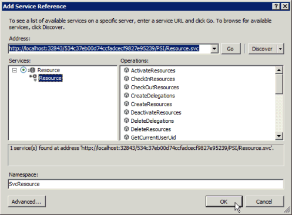

# <a name="prerequisites-for-wcf-based-code-samples-in-project"></a><span data-ttu-id="97b09-103">Необходимые условия для примеров кода на основе WCF в Project</span><span class="sxs-lookup"><span data-stu-id="97b09-103">Prerequisites for WCF-based code samples in Project</span></span>

<span data-ttu-id="97b09-104">Сведения о создании проектов в Visual Studio с помощью образцов кода на основе WCF, включенных в справочные разделы Project интерфейса сервера (PSI).</span><span class="sxs-lookup"><span data-stu-id="97b09-104">Learn information to help you create projects in Visual Studio by using the WCF-based code samples that are included in the Project Server Interface (PSI) reference topics.</span></span>
   
<span data-ttu-id="97b09-105">Многие образцы кода на основе WCF, включенные в библиотеку классов [Project Server 2013](https://msdn.microsoft.com/library/ef1830e0-3c9a-4f98-aa0a-5556c298e7d1%28Office.15%29.aspx) и ссылку на веб-службы, изначально были созданы для документации разработчика Project 2010 г., а для веб-служб WCF используется стандартный формат.</span><span class="sxs-lookup"><span data-stu-id="97b09-105">Many of the WCF-based code samples included in the [Project Server 2013 class library and web service reference](https://msdn.microsoft.com/library/ef1830e0-3c9a-4f98-aa0a-5556c298e7d1%28Office.15%29.aspx) were originally created for the Project 2010 developer documentation, and use a standard format for WCF web services.</span></span> <span data-ttu-id="97b09-106">Образцы по-прежнему работают в Project Server 2013 и предназначены для копирования в консольное приложение и выполнения в качестве полного подразделения.</span><span class="sxs-lookup"><span data-stu-id="97b09-106">The samples still work in Project Server 2013 and are designed to be copied into a console application and run as a complete unit.</span></span> <span data-ttu-id="97b09-107">Исключения из этого правила отмечаются в примере.</span><span class="sxs-lookup"><span data-stu-id="97b09-107">Exceptions are noted in the sample.</span></span> 
  
<span data-ttu-id="97b09-108">Образцы кода в документации Project 2013 г., которые не изменились из образцов, разработанных для Office Project Server 2007, используют веб-службы ASMX.</span><span class="sxs-lookup"><span data-stu-id="97b09-108">Code samples in the Project 2013 developer documentation that are unchanged from the samples developed for Office Project Server 2007 use ASMX Web services.</span></span> <span data-ttu-id="97b09-109">Примеры на основе ASMX можно также адаптировать для использования служб WCF.</span><span class="sxs-lookup"><span data-stu-id="97b09-109">The ASMX-based samples can also be adapted to use WCF services.</span></span> <span data-ttu-id="97b09-110">В данной статье показывается, как использовать эти примеры со службами WCF.</span><span class="sxs-lookup"><span data-stu-id="97b09-110">This article shows how to use the samples with WCF services.</span></span> <span data-ttu-id="97b09-111">Сведения об использовании образцов с помощью веб-служб ASMX см. в странице [Prerequisites for ASMX-based code samples in Project.](prerequisites-for-asmx-based-code-samples-in-project.md)</span><span class="sxs-lookup"><span data-stu-id="97b09-111">For information about how to use the samples with ASMX web services, see [Prerequisites for ASMX-based code samples in Project](prerequisites-for-asmx-based-code-samples-in-project.md).</span></span>
  
> [!NOTE]
> <span data-ttu-id="97b09-112">Если клиентская объектная модель (CSOM) включает методы, необходимые для вашего приложения, то новые приложения следует разрабатывать с использованием этой CSOM.</span><span class="sxs-lookup"><span data-stu-id="97b09-112">If the client-side object model (CSOM) includes the methods that your application requires, new applications should be developed with the CSOM.</span></span> <span data-ttu-id="97b09-113">CSOM позволяет приложениям работать с Project Online или локальной установкой Project Server 2013.</span><span class="sxs-lookup"><span data-stu-id="97b09-113">The CSOM enables applications to work with Project Online or an on-premises installation of Project Server 2013.</span></span> <span data-ttu-id="97b09-114">В противном случае, если ваше приложение использует интерфейс PSI, то оно должно использовать интерфейс WCF, что является рекомендуемой технологией для сетевого взаимодействия.</span><span class="sxs-lookup"><span data-stu-id="97b09-114">Otherwise, if your application uses the PSI, it should use the WCF interface, which is the technology that we recommend for network communications.</span></span> <span data-ttu-id="97b09-115">Приложения, которые используют интерфейс ASMX или интерфейс WCF, могут работать только для локальной установки Project Server 2013.</span><span class="sxs-lookup"><span data-stu-id="97b09-115">Applications that use the ASMX interface or the WCF interface can work only for on-premises installations of Project Server 2013.</span></span> 
>
> <span data-ttu-id="97b09-116">Дополнительные сведения о CSOM см. в [Project Server 2013 и](project-server-2013-architecture.md) клиентской объектной модели [(CSOM) за Project 2013](client-side-object-model-csom-for-project-2013.md)г.</span><span class="sxs-lookup"><span data-stu-id="97b09-116">For more information about the CSOM, see [Project Server 2013 architecture](project-server-2013-architecture.md) and [Client-side object model (CSOM) for Project 2013](client-side-object-model-csom-for-project-2013.md).</span></span> 
  
<span data-ttu-id="97b09-117">Перед запуском примеров кода необходимо настроить среду разработки, настроить приложение, добавить файл конфигурации службы (или настроить службы WCF программными средствами), а также изменить значения универсальных констант, чтобы они соответствовали вашей среде.</span><span class="sxs-lookup"><span data-stu-id="97b09-117">Before running the code samples, you must set up the development environment, configure the application, add a service configuration file (or configure the WCF services programmatically), and change generic constant values to match your environment.</span></span>
  
## <a name="setting-up-the-development-environment"></a><span data-ttu-id="97b09-118">Настройка среды разработки</span><span class="sxs-lookup"><span data-stu-id="97b09-118">Setting up the development environment</span></span>
<span data-ttu-id="97b09-119"><a name="pj15_PrerequisitesWCF_Setup"> </a></span><span class="sxs-lookup"><span data-stu-id="97b09-119"><a name="pj15_PrerequisitesWCF_Setup"> </a></span></span>

1. <span data-ttu-id="97b09-120">**Настройте тестовую систему Project Server.**</span><span class="sxs-lookup"><span data-stu-id="97b09-120">**Set up a test Project Server system.**</span></span>
    
    <span data-ttu-id="97b09-p104">При разработке или тестировании рекомендуется всегда использовать тестовую систему Project Server. Даже если ваш код работает отлично, взаимозависимости между проектами, отчеты или другие факторы среды могут привести к непредвиденным последствиям.</span><span class="sxs-lookup"><span data-stu-id="97b09-p104">Use a test Project Server system whenever you are developing or testing. Even when your code works perfectly, interproject dependencies, reporting, or other environmental factors can cause unintended consequences.</span></span> 
    
    > [!NOTE]
    > <span data-ttu-id="97b09-123">Убедитесь, что вы являетесь допустимым пользователем на сервере, и проверьте наличие достаточных разрешений для выполнения вызовов PSI, используемых вашим приложением.</span><span class="sxs-lookup"><span data-stu-id="97b09-123">Ensure that you are a valid user on the server, and check that you have sufficient permissions for the PSI calls that your application uses.</span></span> <span data-ttu-id="97b09-124">В разделе документации для разработчиков по каждому методу PSI имеется таблица разрешений Project Server.</span><span class="sxs-lookup"><span data-stu-id="97b09-124">The developer documentation topic for each PSI method includes a Project Server Permissions table.</span></span> <span data-ttu-id="97b09-125">Например, [Project. Метод QueueCreateProject](https://msdn.microsoft.com/library/WebSvcProject.Project.QueueCreateProject.aspx) требует глобального **разрешения NewProject** и **разрешения SaveProjectTemplate.**</span><span class="sxs-lookup"><span data-stu-id="97b09-125">For example, the [Project.QueueCreateProject](https://msdn.microsoft.com/library/WebSvcProject.Project.QueueCreateProject.aspx) method requires the global **NewProject** permission and the **SaveProjectTemplate** permission.</span></span> 
  
    <span data-ttu-id="97b09-126">В некоторых ситуациях может требоваться выполнение удаленной отладки на сервере.</span><span class="sxs-lookup"><span data-stu-id="97b09-126">In some cases, you may have to do remote debugging on the server.</span></span> <span data-ttu-id="97b09-127">Возможно, вам также придется настроить обработщик событий, установив сборку обработщика событий на каждом компьютере Project Server в ферме SharePoint, а затем настроить обработщик событий для экземпляра Project Web App с помощью страницы Project Server Параметры в общем приложении Параметры центрального администрирования SharePoint.</span><span class="sxs-lookup"><span data-stu-id="97b09-127">You may also have to set up an event handler by installing an event handler assembly on each Project Server computer in the SharePoint farm, and then configuring the event handler for the Project Web App instance by using the Project Server Settings page in the General Application Settings of SharePoint Central Administration.</span></span>
    
2. <span data-ttu-id="97b09-128">**Настройте компьютер разработки.**</span><span class="sxs-lookup"><span data-stu-id="97b09-128">**Set up a development computer.**</span></span>
    
    <span data-ttu-id="97b09-p107">Обычно доступ к интерфейсу PSI осуществляется по сети. Примеры кода разработаны для запуска на клиенте, находящемся отдельно от сервера, если не указано иное.</span><span class="sxs-lookup"><span data-stu-id="97b09-p107">You usually access the PSI through a network. The code samples are designed to be run on a client that is separate from the server, except where noted.</span></span>
    
    1. <span data-ttu-id="97b09-131">**Установите правильную версию Visual Studio.**</span><span class="sxs-lookup"><span data-stu-id="97b09-131">**Install the correct version of Visual Studio.**</span></span> <span data-ttu-id="97b09-132">Если не указано иное, то примеры кода написаны на Visual C#.</span><span class="sxs-lookup"><span data-stu-id="97b09-132">Except where noted, the code samples are written in Visual C#.</span></span> <span data-ttu-id="97b09-133">Они могут использоваться с Visual Studio 2010 или Visual Studio 2012.</span><span class="sxs-lookup"><span data-stu-id="97b09-133">They can be used with Visual Studio 2010 or Visual Studio 2012.</span></span> <span data-ttu-id="97b09-134">Убедитесь, что установлен самый последний пакет обновления.</span><span class="sxs-lookup"><span data-stu-id="97b09-134">Ensure that you have the most recent service pack installed.</span></span> 
    
    2. <span data-ttu-id="97b09-135">**Скопируйте библиотеки DDL Project Server на компьютер разработки.**</span><span class="sxs-lookup"><span data-stu-id="97b09-135">**Copy Project Server DLLs to the development computer.**</span></span> <span data-ttu-id="97b09-136">Скопируйте следующие сборки с компьютера Project Server на `[Program Files]\Microsoft Office Servers\15.0\Bin` компьютер разработки:</span><span class="sxs-lookup"><span data-stu-id="97b09-136">Copy the following assemblies from  `[Program Files]\Microsoft Office Servers\15.0\Bin` on the Project Server computer to the development computer:</span></span> 
    
       - <span data-ttu-id="97b09-137">Microsoft.Office.Project.Server.Events.Receivers.dll;</span><span class="sxs-lookup"><span data-stu-id="97b09-137">Microsoft.Office.Project.Server.Events.Receivers.dll</span></span>
    
       - <span data-ttu-id="97b09-138">Microsoft.Office.Project.Server.Library.dll;</span><span class="sxs-lookup"><span data-stu-id="97b09-138">Microsoft.Office.Project.Server.Library.dll</span></span>
    
    3. <span data-ttu-id="97b09-139">Сведения о порядке компиляции и использования сборки прокси ProjectServerServices.dll для служб WCF в PSI см. в разделе [Использование сборки прокси PSI и описаний IntelliSense](#pj15_PrerequisitesWCF_BuildingProxy).</span><span class="sxs-lookup"><span data-stu-id="97b09-139">For information about how to compile and use the ProjectServerServices.dll proxy assembly for the WCF services in the PSI, see [Using a PSI proxy assembly and IntelliSense descriptions](#pj15_PrerequisitesWCF_BuildingProxy).</span></span>
    
3. <span data-ttu-id="97b09-140">**Установите файлы IntelliSense.**</span><span class="sxs-lookup"><span data-stu-id="97b09-140">**Install the IntelliSense files.**</span></span>
    
    <span data-ttu-id="97b09-141">Чтобы использовать IntelliSense для классов и участников сборки Project Server, скопируйте обновленные IntelliSense XML-файлы из загрузки SDK Project 2013 г. в тот же каталог, где расположены сборки Project Server.</span><span class="sxs-lookup"><span data-stu-id="97b09-141">To use IntelliSense descriptions for classes and members in Project Server assemblies, copy the updated IntelliSense XML files from the Project 2013 SDK download to the same directory where the Project Server assemblies are located.</span></span> <span data-ttu-id="97b09-142">Например, скопируйте файл Microsoft.Office.Project.Server.Library.xml в каталог, где ваше приложение будет устанавливать ссылку на сборку Microsoft.Office.Project.Server.Library.dll.</span><span class="sxs-lookup"><span data-stu-id="97b09-142">For example, copy the Microsoft.Office.Project.Server.Library.xml file to the directory where your application will set a reference to the Microsoft.Office.Project.Server.Library.dll assembly.</span></span>
    
    <span data-ttu-id="97b09-143">IntelliSense описания для служб PSI требуют создания прокси-сборки PSI с помощью скрипта CompileWCFProxyAssembly.cmd в подпрограмме в загрузке `Documentation\IntelliSense\WCF` SDK Project 2013 г.</span><span class="sxs-lookup"><span data-stu-id="97b09-143">IntelliSense descriptions for the PSI services require that you create a PSI proxy assembly by using the CompileWCFProxyAssembly.cmd script in the  `Documentation\IntelliSense\WCF` subdirectory in the Project 2013 SDK download.</span></span> <span data-ttu-id="97b09-144">Этот скрипт создает сборку прокси ProjectServerServices.dll на основе WCF.</span><span class="sxs-lookup"><span data-stu-id="97b09-144">The script creates the WCF-based ProjectServerServices.dll proxy assembly.</span></span> <span data-ttu-id="97b09-145">Дополнительные сведения см. в файле [ReadMe_IntelliSense].mht в загрузке пакета SDK.</span><span class="sxs-lookup"><span data-stu-id="97b09-145">For more information, see the [ReadMe_IntelliSense].mht file in the SDK download.</span></span> 
    
## <a name="creating-the-application-and-adding-a-service-reference"></a><span data-ttu-id="97b09-146">Создание приложения и добавление ссылки на службу</span><span class="sxs-lookup"><span data-stu-id="97b09-146">Creating the application and adding a service reference</span></span>
<span data-ttu-id="97b09-147"><a name="pj15_PrerequisitesWCF_Configure"> </a></span><span class="sxs-lookup"><span data-stu-id="97b09-147"><a name="pj15_PrerequisitesWCF_Configure"> </a></span></span>

1. <span data-ttu-id="97b09-148">**Создайте консольное приложение.**</span><span class="sxs-lookup"><span data-stu-id="97b09-148">**Create a console application.**</span></span>
    
    <span data-ttu-id="97b09-p112">При создании консольного приложения в раскрывающемся списке диалогового окна **New Project** (Создание проекта) выберите **.NET Framework 4**. В новое приложение можно скопировать пример кода PSI.</span><span class="sxs-lookup"><span data-stu-id="97b09-p112">When you create a console application, in the drop-down list of the **New Project** dialog box, select **.NET Framework 4**. You can copy the PSI example code into the new application.</span></span>
    
2. <span data-ttu-id="97b09-151">**Добавьте ссылки, необходимые для WCF.**</span><span class="sxs-lookup"><span data-stu-id="97b09-151">**Add references required for WCF.**</span></span>
    
    <span data-ttu-id="97b09-152">В Обозревателе решений добавьте ссылку **на System.ServiceModel** (см. рис. 1).</span><span class="sxs-lookup"><span data-stu-id="97b09-152">In Solution Explorer, add a reference to **System.ServiceModel** (see Figure 1).</span></span> <span data-ttu-id="97b09-153">Веб-приложение будет использовать **System.ServiceModel.Web**.</span><span class="sxs-lookup"><span data-stu-id="97b09-153">A web application would use **System.ServiceModel.Web**.</span></span>
    
    <span data-ttu-id="97b09-154">Также добавьте ссылку на **System.Runtime.Serialization**.</span><span class="sxs-lookup"><span data-stu-id="97b09-154">Also add a reference to **System.Runtime.Serialization**.</span></span>
    
    <span data-ttu-id="97b09-155">**Рис. 1. Добавление ссылок в Visual Studio для приложения WCF**</span><span class="sxs-lookup"><span data-stu-id="97b09-155">**Figure 1. Adding the references in Visual Studio for a WCF-based application**</span></span>

    <span data-ttu-id="97b09-156"></span><span class="sxs-lookup"><span data-stu-id="97b09-156"></span></span>
  
3. <span data-ttu-id="97b09-157">**Скопируйте код**.</span><span class="sxs-lookup"><span data-stu-id="97b09-157">**Copy the code**.</span></span>
    
    <span data-ttu-id="97b09-158">Скопируйте весь пример кода в файл Program.cs консольного приложения.</span><span class="sxs-lookup"><span data-stu-id="97b09-158">Copy the complete code example into the Program.cs file of the console application.</span></span>
    
4. <span data-ttu-id="97b09-159">**Установите пространство имен для примера приложения.**</span><span class="sxs-lookup"><span data-stu-id="97b09-159">**Set the namespace for the sample application.**</span></span>
    
    <span data-ttu-id="97b09-p114">Можно либо изменить пространство имен, указанное вверху примера, на пространство имен по умолчанию для приложения, либо изменить пространство имен по умолчанию для приложения, чтобы оно соответствовало примеру. Чтобы изменить пространство имен по умолчанию для приложения, следует изменить свойства приложения.</span><span class="sxs-lookup"><span data-stu-id="97b09-p114">You can either change the namespace listed at the top of the sample to the application default namespace, or change the default application namespace to match the sample. You can change the default application namespace by changing the application properties.</span></span> 
    
    <span data-ttu-id="97b09-162">Например, пример кода [для ReadResource имеет](https://msdn.microsoft.com/library/WebSvcResource.Resource.ReadResource.aspx) пространство имен **Microsoft.SDK.Project. Samples.CreateResourceTest**.</span><span class="sxs-lookup"><span data-stu-id="97b09-162">For example, the code sample for [ReadResource](https://msdn.microsoft.com/library/WebSvcResource.Resource.ReadResource.aspx) has the namespace **Microsoft.SDK.Project.Samples.CreateResourceTest**.</span></span> <span data-ttu-id="97b09-163">Если проект Visual Studio имеет имя **ResourceTest**, скопируйте пространство имен из файла Program.cs, а затем откройте панель **Свойства** (выберите в меню **Проект** пункт **Свойства ResourceTest**).</span><span class="sxs-lookup"><span data-stu-id="97b09-163">If the name of the Visual Studio project is **ResourceTest**, copy the namespace from the Program.cs file, and then open the project **Properties** pane (on the **Project** menu, choose **ResourceTest Properties**).</span></span> <span data-ttu-id="97b09-164">На вкладке **Приложение** вставьте скопированное пространство имен в текстовое поле **Пространство имен по умолчанию**.</span><span class="sxs-lookup"><span data-stu-id="97b09-164">On the **Application** tab, copy the namespace into the **Default namespace** text box.</span></span> 
    
5. <span data-ttu-id="97b09-165">**Установите ссылки на службы.**</span><span class="sxs-lookup"><span data-stu-id="97b09-165">**Set the service references.**</span></span>
    
    <span data-ttu-id="97b09-p116">Во многих примерах требуются ссылки на одну или несколько служб PSI. Они перечисляются в самом примере или в комментариях перед примером. Чтобы получить правильное пространство имен ссылок на службы, убедитесь, что предварительно было установлено пространство имен по умолчанию для приложения.</span><span class="sxs-lookup"><span data-stu-id="97b09-p116">Many examples require a reference to one or more of the PSI services. These are listed in the sample itself or in comments that precede the sample. To get the correct namespace of the service references, ensure that you first set the default application namespace.</span></span>
    
    <span data-ttu-id="97b09-169">Существует три способа добавления ссылки на службу WCF.</span><span class="sxs-lookup"><span data-stu-id="97b09-169">There are three ways to add a WCF service reference:</span></span>
    
    - <span data-ttu-id="97b09-p117">Постройте сборку прокси PSI с именем ProjectServerServices.dll, а затем установите ссылку на эту сборку. См. раздел [Использование сборки прокси PSI и описаний IntelliSense](#pj15_PrerequisitesWCF_BuildingProxy).</span><span class="sxs-lookup"><span data-stu-id="97b09-p117">Build a PSI proxy assembly named ProjectServerServices.dll, and then set a reference to the assembly. See [Using a PSI proxy assembly and IntelliSense descriptions](#pj15_PrerequisitesWCF_BuildingProxy).</span></span>
    
    - <span data-ttu-id="97b09-p118">Добавьте файл прокси из выходных данных svcutil.exe в решение Visual Studio. См. раздел [Добавление файла прокси PSI](#pj15_PrerequisitesWCF_AddingProxyFile).</span><span class="sxs-lookup"><span data-stu-id="97b09-p118">Add a proxy file from the svcutil.exe output to the Visual Studio solution. See [Adding a PSI proxy file](#pj15_PrerequisitesWCF_AddingProxyFile).</span></span>
    
    - <span data-ttu-id="97b09-p119">Добавьте ссылку на службу с помощью Visual Studio. См. раздел [Добавление ссылки на службу](#pj15_PrerequisitesWCF_AddingServiceReference).</span><span class="sxs-lookup"><span data-stu-id="97b09-p119">Add a service reference by using Visual Studio. See [Adding a service reference](#pj15_PrerequisitesWCF_AddingServiceReference).</span></span>
    
### <a name="using-a-psi-proxy-assembly-and-intellisense-descriptions"></a><span data-ttu-id="97b09-176">Использование сборки прокси PSI и описаний IntelliSense.</span><span class="sxs-lookup"><span data-stu-id="97b09-176">Using a PSI proxy assembly and IntelliSense descriptions</span></span>
<span data-ttu-id="97b09-177"><a name="pj15_PrerequisitesWCF_BuildingProxy"> </a></span><span class="sxs-lookup"><span data-stu-id="97b09-177"><a name="pj15_PrerequisitesWCF_BuildingProxy"> </a></span></span>

<span data-ttu-id="97b09-178">Сборку прокси можно использовать для всех общедоступных служб WCF в PSI.</span><span class="sxs-lookup"><span data-stu-id="97b09-178">You can use a proxy assembly for all public WCF services in the PSI.</span></span> <span data-ttu-id="97b09-179">Компиляйте сборку ProjectServerServices.dll с помощью скрипта в загрузке SDK Project 2013 г., а затем скопируйте сборку прокси на компьютер `Documentation\IntelliSense\WCF\CompileWCFProxyAssembly.cmd` разработки.</span><span class="sxs-lookup"><span data-stu-id="97b09-179">Compile the ProjectServerServices.dll proxy assembly by using the  `Documentation\IntelliSense\WCF\CompileWCFProxyAssembly.cmd` script in the Project 2013 SDK download, and then copy the proxy assembly to your development computer.</span></span> <span data-ttu-id="97b09-180">Скопируйте файл ProjectServerServices.xml для IntelliSense в то же расположение.</span><span class="sxs-lookup"><span data-stu-id="97b09-180">Copy the ProjectServerServices.xml file for IntelliSense to the same location.</span></span> <span data-ttu-id="97b09-181">В Visual Studio установите ссылку на сборку прокси ProjectServerServices.dll.</span><span class="sxs-lookup"><span data-stu-id="97b09-181">In Visual Studio, set a reference to the ProjectServerServices.dll proxy assembly.</span></span> 
  
<span data-ttu-id="97b09-182">Для пакетов обновления и обновлений Project Server можно обновить исходные файлы прокси и создать новую сборку прокси с помощью скрипта GenWCFProxyAssembly.cmd в той же самой папке загрузки пакета SDK.</span><span class="sxs-lookup"><span data-stu-id="97b09-182">For Project Server service packs and updates, you can update the proxy source files and create a new proxy assembly by using the GenWCFProxyAssembly.cmd script in the same SDK download folder.</span></span> <span data-ttu-id="97b09-183">Ссылку на загрузку SDK см. в Project [2013 г.](project-2013-developer-documentation.md)</span><span class="sxs-lookup"><span data-stu-id="97b09-183">For a link to the SDK download, see [Project 2013 developer documentation](project-2013-developer-documentation.md).</span></span> <span data-ttu-id="97b09-184">Дополнительные сведения см. в разделе [Добавление ссылки на службу](#pj15_PrerequisitesWCF_AddingServiceReference).</span><span class="sxs-lookup"><span data-stu-id="97b09-184">For more information, see the [Adding a service reference](#pj15_PrerequisitesWCF_AddingServiceReference) section.</span></span> 
  
> [!NOTE]
> <span data-ttu-id="97b09-185">При извлечении файлов источника прокси из Source.zip файла файлы в папке актуальны с даты публикации загрузки `Documentation\IntelliSense\WCF\Source` SDK Project 2013 г.</span><span class="sxs-lookup"><span data-stu-id="97b09-185">When you extract the proxy source files from the Source.zip file, the files in the  `Documentation\IntelliSense\WCF\Source` folder are current as of the publication date of the Project 2013 SDK download.</span></span> <span data-ttu-id="97b09-186">Чтобы создать обновленные исходные файлы прокси PSI, запустите скрипт GenASMXProxyAssembly.cmd на компьютере Project Server.</span><span class="sxs-lookup"><span data-stu-id="97b09-186">To generate updated PSI proxy source files, run the GenASMXProxyAssembly.cmd script on the Project Server computer.</span></span> <span data-ttu-id="97b09-187">Дополнительные сведения см. в разделе [Добавление ссылки на службу](#pj15_PrerequisitesWCF_AddingServiceReference).</span><span class="sxs-lookup"><span data-stu-id="97b09-187">For more information, see [Adding a service reference](#pj15_PrerequisitesWCF_AddingServiceReference).</span></span> 
> 
> <span data-ttu-id="97b09-188">Сценарии в папке не работают для приложений на  `Documentation\IntelliSense\ASMX` основе WCF.</span><span class="sxs-lookup"><span data-stu-id="97b09-188">The scripts in the  `Documentation\IntelliSense\ASMX` folder do not work for WCF-based applications.</span></span> <span data-ttu-id="97b09-189">Скрипт GenASMXProxyAssembly.cmd вызывает файл Wsdl.exe, который создает файлы исходного кода для служб ASMX.</span><span class="sxs-lookup"><span data-stu-id="97b09-189">The GenASMXProxyAssembly.cmd script calls Wsdl.exe, which generates source code files for the ASMX services.</span></span> <span data-ttu-id="97b09-190">Файлы прокси ASMX включают разные классы и свойства.</span><span class="sxs-lookup"><span data-stu-id="97b09-190">The ASMX proxy files include different classes and properties.</span></span> <span data-ttu-id="97b09-191">Например, веб-служба Resource на основе ASMX включает класс **Resource**, в то время как служба Resource на основе WCF включает интерфейс **Resource**, интерфейс **ResourceChannel** и класс **ResourceClient**.</span><span class="sxs-lookup"><span data-stu-id="97b09-191">For example, the ASMX-based Resource web service includes the **Resource** class, whereas the WCF-based Resource service includes the **Resource** interface, the **ResourceChannel** interface, and the **ResourceClient** class.</span></span> 
  
<span data-ttu-id="97b09-p124">Произвольные пространства имен, созданные как для веб-службы ASMX, так и для службы WCF, одинаковые, поэтому файл ProjectServerServices.xml для IntelliSense работает с любой сборкой. Например, пространство имен службы Resource в сборке прокси на основе WCF и в сборке прокси на основе ASMX — **SvcResource**. Конечно, имена пространств имен можно изменить, но необходимо убедиться, что имена в сборке прокси и в файле IntelliSense ProjectServerServices.xml совпадают.</span><span class="sxs-lookup"><span data-stu-id="97b09-p124">The arbitrary namespaces created for both the ASMX web services and the WCF services are the same, so that the ProjectServerServices.xml file for IntelliSense works with either assembly. For example, the namespace of the Resource service in the WCF-based proxy assembly and in the ASMX-based proxy assembly is **SvcResource**. You can, of course, change the namespace names— if you ensure that they match in the proxy assembly and in the ProjectServerServices.xml IntelliSense file.</span></span>
  
<span data-ttu-id="97b09-195">Если в примере кода для пространства имен службы PSI используется другое имя, например **ProjectWebSvc**, то для обеспечения работы IntelliSense необходимо изменить его на **SvcProject**, чтобы это пространство имен соответствовало сборке прокси.</span><span class="sxs-lookup"><span data-stu-id="97b09-195">If a code sample uses a different name for a PSI service namespace, for example **ProjectWebSvc**, for IntelliSense to work you must change the sample to use **SvcProject** so that the namespace matches the proxy assembly.</span></span> 
  
<span data-ttu-id="97b09-196">Можно указать следующие преимущества использования сборки прокси на основе WCF.</span><span class="sxs-lookup"><span data-stu-id="97b09-196">Advantages to using the WCF-based proxy assembly include the following:</span></span>
  
- <span data-ttu-id="97b09-p125">Можно разрабатывать большинство решений со сборкой прокси на компьютере, отличном от компьютера Project Server. Для настройки отдельной ссылки на службу требуется разработка на компьютере Project Server.</span><span class="sxs-lookup"><span data-stu-id="97b09-p125">You can develop most solutions with the proxy assembly on a different computer than the Project Server computer. Setting an individual service reference requires development on the Project Server computer.</span></span>
    
- <span data-ttu-id="97b09-199">Сборка прокси включает все пространства имен служб PSI, поэтому не придется добавлять несколько файлов прокси.</span><span class="sxs-lookup"><span data-stu-id="97b09-199">The proxy assembly includes all PSI service namespaces, so you do not have to add multiple proxy files.</span></span>
    
- <span data-ttu-id="97b09-200">Если файл ProjectServerServices.xml добавляется в тот же каталог, в котором установлена ссылка на сборку прокси ProjectServerServices.dll, то можно получить описания IntelliSense для классов и членов PSI.</span><span class="sxs-lookup"><span data-stu-id="97b09-200">If you add the ProjectServerServices.xml file to the same directory where you set a reference to the ProjectServerServices.dll proxy assembly, you can get IntelliSense descriptions for the PSI classes and members.</span></span> <span data-ttu-id="97b09-201">Дополнительные сведения см. в файле [ReadMe_IntelliSense] в папке загрузки `Documentation\IntelliSense` SDK Project 2013 г.</span><span class="sxs-lookup"><span data-stu-id="97b09-201">For more information, see the [ReadMe_IntelliSense] file in the  `Documentation\IntelliSense` folder of the Project 2013 SDK download.</span></span> 
    
<span data-ttu-id="97b09-202">**Рис. 2. Использование IntelliSense для метода в службе Resource**</span><span class="sxs-lookup"><span data-stu-id="97b09-202">**Figure 2. Using IntelliSense for a method in the Resource service**</span></span>

<span data-ttu-id="97b09-203"></span><span class="sxs-lookup"><span data-stu-id="97b09-203"></span></span>
  
<span data-ttu-id="97b09-p127">Недостаток использования сборки прокси состоит в том, что решение имеет больший размер, и необходимо распространять и устанавливать сборку прокси с решением. Кроме того, необходимо либо использовать одни и те же пространства имен в сборке прокси и в файлах IntelliSense, либо изменить скрипт для построения сборки прокси и изменения файла IntelliSense ProjectServerServices.xml, чтобы он использовал другие пространства имен.</span><span class="sxs-lookup"><span data-stu-id="97b09-p127">Disadvantages to using the proxy assembly are that the solution is larger and you must distribute and install the proxy assembly with the solution. You must also use the same namespaces that are in the proxy assembly and IntelliSense files, unless you change the script to build a proxy assembly and change the ProjectServerServices.xml IntelliSense file to use different namespaces.</span></span>
  
### <a name="adding-a-psi-proxy-file"></a><span data-ttu-id="97b09-206">Добавление файла прокси PSI</span><span class="sxs-lookup"><span data-stu-id="97b09-206">Adding a PSI proxy file</span></span>
<span data-ttu-id="97b09-207"><a name="pj15_PrerequisitesWCF_AddingProxyFile"> </a></span><span class="sxs-lookup"><span data-stu-id="97b09-207"><a name="pj15_PrerequisitesWCF_AddingProxyFile"> </a></span></span>

<span data-ttu-id="97b09-208">Загрузка Project SDK 2013 включает исходные файлы, созданные командой SvcUtil.exe сборки прокси.</span><span class="sxs-lookup"><span data-stu-id="97b09-208">The Project 2013 SDK download includes the source files that are generated by the SvcUtil.exe command for the proxy assembly.</span></span> <span data-ttu-id="97b09-209">Исходные файлы находятся в Source.zip в  `Documentation\IntelliSense\WCF` подтекстом.</span><span class="sxs-lookup"><span data-stu-id="97b09-209">The source files are in the Source.zip file in the  `Documentation\IntelliSense\WCF` subdirectory.</span></span> <span data-ttu-id="97b09-210">Вместо установки ссылки на сборку прокси можно добавить один или несколько исходных файлов в решение Visual Studio.</span><span class="sxs-lookup"><span data-stu-id="97b09-210">Instead of setting a reference to the proxy assembly, you can add one or more of the source files to a Visual Studio solution.</span></span> <span data-ttu-id="97b09-211">Например, для использования службы Project и службы Resource добавьте в решение файлы wcf.Project.cs и wcf.Resource.cs.</span><span class="sxs-lookup"><span data-stu-id="97b09-211">For example, to use the Project service and the Resource service, add the wcf.Project.cs and wcf.Resource.cs files to the solution.</span></span> 
  
<span data-ttu-id="97b09-p129">В WCF основной класс в каждой службе PSI определяется интерфейсом и реализуется в классе клиента для доступа к членам. Например, интерфейс **SvcProject.Resource** реализуется в классе **SvcProject.ResourceClient**. Чтобы задать объект **ResourceClient** как переменную класса с именем **resourceClient**, можно использовать следующий код. В этом примере метод **SetClientEndpoints** создает объект **resourceClient**, который использует конечную точку **basicHttp_Project**, заданную в файле app.config. Дополнительные сведения о файле app.config см. в разделе [Добавление файла конфигурации службы](#pj15_PrerequisitesWCF_AddConfig).</span><span class="sxs-lookup"><span data-stu-id="97b09-p129">In WCF, the primary class in each PSI service is defined by an interface and implemented in a client class for access to the members. For example, the **SvcProject.Resource** interface is implemented in the **SvcProject.ResourceClient** class. To define a **ResourceClient** object as a class variable named **resourceClient**, for example, use the following code. In the example, the **SetClientEndpoints** method creates a **resourceClient** object that uses the **basicHttp_Project** endpoint, which is defined in the app.config file. For more information about the app.config file, see the [Adding a service configuration file](#pj15_PrerequisitesWCF_AddConfig) section.</span></span> 
  
```cs
private static SvcResource.ResourceClient resourceClient;
. . .
private static void SetClientEndpoints()
{
  resourceClient = new SvcResource.ResourceClient("basicHttp_Resource");
  . . .
}
public void DisposeClients()
{
  resourceClient.Close();
  . . .
}
```

> [!NOTE]
> <span data-ttu-id="97b09-217">Независимо от того, используется ли сборка прокси PSI или добавляется файл прокси для ссылки на службу Project с именем **SvcResource**, необходимо применять этот же код для создания и размещения объекта **resourceClient**.</span><span class="sxs-lookup"><span data-stu-id="97b09-217">Whether you use a PSI proxy assembly or add a proxy file for a Project service reference named **SvcResource**, you would use the same code to create and dispose a **resourceClient** object.</span></span> 
  
### <a name="adding-a-service-reference"></a><span data-ttu-id="97b09-218">Добавление ссылки службы</span><span class="sxs-lookup"><span data-stu-id="97b09-218">Adding a service reference</span></span>
<span data-ttu-id="97b09-219"><a name="pj15_PrerequisitesWCF_AddingServiceReference"> </a></span><span class="sxs-lookup"><span data-stu-id="97b09-219"><a name="pj15_PrerequisitesWCF_AddingServiceReference"> </a></span></span>

<span data-ttu-id="97b09-220">Если не используется сборка прокси на основе WCF и не добавляется файл прокси для службы PSI, можно установить отдельные ссылки на службы непосредственно в Visual Studio.</span><span class="sxs-lookup"><span data-stu-id="97b09-220">If you do not use the WCF-based proxy assembly or add a proxy file for a PSI service, you can set one or more individual service references directly in Visual Studio.</span></span> <span data-ttu-id="97b09-221">Вы также можете использовать шаг 1 из следующей процедуры для создания обновленных прокси-файлов, чтобы подготовиться к сценарию, включенного в Project `Documentation\IntelliSense\WCF\GenWCFProxyAssembly.cmd` загрузки SDK 2013.</span><span class="sxs-lookup"><span data-stu-id="97b09-221">You can also use step 1 of the following procedure to create updated proxy files, to prepare for the  `Documentation\IntelliSense\WCF\GenWCFProxyAssembly.cmd` script that is included in the Project 2013 SDK download.</span></span> 
  
> [!NOTE]
> <span data-ttu-id="97b09-p131">Устанавливать ссылку на службу необходимо в Visual Studio на компьютере Project Server. Вместо непосредственного добавления ссылок на службы в Visual Studio рекомендуется использовать сборку прокси ProjectServerServices.dll или добавлять исходные файлы прокси.</span><span class="sxs-lookup"><span data-stu-id="97b09-p131">To set a service reference, you must use Visual Studio on the Project Server computer. We recommend that you use the ProjectServerServices.dll proxy assembly or add proxy source files, instead of directly adding service references in Visual Studio.</span></span> 
  
<span data-ttu-id="97b09-224">Ниже покажите, как установить ссылку на службу с помощью Visual Studio 2012 г. на компьютере с тестовой установкой Project Server:</span><span class="sxs-lookup"><span data-stu-id="97b09-224">The following steps show how to set a service reference by using Visual Studio 2012 on a computer running a test installation of Project Server:</span></span>
  
1. <span data-ttu-id="97b09-225">Для доступа к внутренним службам WCF запустите Visual Studio на компьютере Project Server.</span><span class="sxs-lookup"><span data-stu-id="97b09-225">To get access to the back-end WCF services, run Visual Studio on the Project Server computer.</span></span>
    
2. <span data-ttu-id="97b09-226">В **обозревателе решений** щелкните правой кнопкой мыши папку **References** (Ссылки), а затем выберите команду **Add Service Reference** (Добавить ссылку на службу).</span><span class="sxs-lookup"><span data-stu-id="97b09-226">In **Solution Explorer**, right-click the **References** folder, and then choose **Add Service Reference**.</span></span> 
    
3. <span data-ttu-id="97b09-227">В **диалоговом окне** Добавить ссылку на службу в текстовом окне **Адрес** введите https://localhost:32843/ _GUID_/psi/ _ServiceName_.svc и нажмите **кнопку Ввод**.</span><span class="sxs-lookup"><span data-stu-id="97b09-227">In the **Add Service Reference** dialog box, in the **Address** text box, type https://localhost:32843/ _GUID_/psi/ _ServiceName_.svc, and then press **Enter**.</span></span> <span data-ttu-id="97b09-228">Замените _GUID_ виртуальным именем каталога приложения-службы Project Server, например 534c37eb00d74ccfadcecf9827e95239.</span><span class="sxs-lookup"><span data-stu-id="97b09-228">Replace  _GUID_ with the virtual directory name of the Project Server service application, such as 534c37eb00d74ccfadcecf9827e95239.</span></span> <span data-ttu-id="97b09-229">Замените  _Имя службы_ и имя службы, например Ресурс (см. рис. 3).</span><span class="sxs-lookup"><span data-stu-id="97b09-229">Replace  _ServiceName_ with the name of the service, such as Resource (see Figure 3).</span></span> 
    
   <span data-ttu-id="97b09-230">Имя виртуального каталога службы Project Server можно получить одним из следующих способов.</span><span class="sxs-lookup"><span data-stu-id="97b09-230">You can get the name of the Project Server Service virtual directory in one of the following ways:</span></span>
    
   - <span data-ttu-id="97b09-231">Откройте приложение SharePoint 2013 года в браузере.</span><span class="sxs-lookup"><span data-stu-id="97b09-231">Open the SharePoint 2013 Central Administration application in your browser.</span></span> <span data-ttu-id="97b09-232">Выберите элемент **Управление приложениями-службами**, а затем выберите нужное приложение-службу PSI Project Server.</span><span class="sxs-lookup"><span data-stu-id="97b09-232">Choose **Manage service applications**, and then choose the Project Server PSI Service application that you want.</span></span> <span data-ttu-id="97b09-233">Например, выберите **ProjectServerService**.</span><span class="sxs-lookup"><span data-stu-id="97b09-233">For example, choose **ProjectServerService**.</span></span> <span data-ttu-id="97b09-234">URL-адрес страницы Управление Project Web App сайтов содержит имя виртуального каталога.</span><span class="sxs-lookup"><span data-stu-id="97b09-234">The URL of the Manage Project Web App Sites page contains the virtual directory name.</span></span> <span data-ttu-id="97b09-235">Например, в имени виртуального каталога  `https://ServerName:8080/_admin/pwa/managepwa.aspx?appid=534c37eb-00d7-4ccf-adce-cf9827e95239`  `534c37eb00d74ccfadcecf9827e95239` (имя каталога не содержит тире).</span><span class="sxs-lookup"><span data-stu-id="97b09-235">For example, in  `https://ServerName:8080/_admin/pwa/managepwa.aspx?appid=534c37eb-00d7-4ccf-adce-cf9827e95239`, the virtual directory name is  `534c37eb00d74ccfadcecf9827e95239` (the directory name contains no dashes).</span></span> 
    
   - <span data-ttu-id="97b09-p134">Откройте диалоговое окно **диспетчера служб IIS** на компьютере Project Server. Разверните узел **Веб-службы SharePoint** в области **Подключения**, а затем разворачивайте виртуальные каталоги службы, пока не найдете каталог, включающий папку PSI. Выберите этот каталог, затем в области **Действия** выберите пункт **Дополнительные параметры** и скопируйте имя каталога в поле **Виртуальный путь**.</span><span class="sxs-lookup"><span data-stu-id="97b09-p134">Open the **Internet Information Services (IIS) Manager** dialog box on the Project Server computer. Expand the **SharePoint Web Services** node in the **Connections** pane, and then expand the service virtual directories below that, until you find the directory that includes a PSI folder. Select the directory, choose **Advanced Settings** in the **Actions** pane, and then copy the directory name in the **Virtual Path** field.</span></span> 
    
      > [!NOTE]
      > <span data-ttu-id="97b09-239">Может существовать несколько виртуальных каталогов служб Project Server.</span><span class="sxs-lookup"><span data-stu-id="97b09-239">There can be more than one Project Server Service virtual directory.</span></span> <span data-ttu-id="97b09-240">Убедитесь, что вы выбираете виртуальный каталог, содержащий Project Web App экземпляр, который вы хотите.</span><span class="sxs-lookup"><span data-stu-id="97b09-240">Ensure that you choose the virtual directory that contains the Project Web App instance that you want.</span></span> 
  
   - <span data-ttu-id="97b09-241">Используйте **комлет get-SPServiceApplication** в Windows PowerShell, установленном с SharePoint 2013 г.</span><span class="sxs-lookup"><span data-stu-id="97b09-241">Use the **get-SPServiceApplication** cmdlet in Windows PowerShell that is installed with SharePoint 2013.</span></span> <span data-ttu-id="97b09-242">В меню **Пуск** панели задач последовательно выберите **Программы**, **Продукты Microsoft SharePoint 2013** и **Командная консоль SharePoint 2013**.</span><span class="sxs-lookup"><span data-stu-id="97b09-242">On the taskbar **Start** menu, choose **All Programs**, choose **Microsoft SharePoint 2013 Products**, and then choose **SharePoint 2013 Management Shell**.</span></span> <span data-ttu-id="97b09-243">Далее приводится команда и результаты в окне **командной консоли SharePoint 2013** для заданных приложений-служб (ваши GUID будут отличаться).</span><span class="sxs-lookup"><span data-stu-id="97b09-243">Following is the command and the results in the **SharePoint 2013get- Management Shell** window for the defined service applications (your GUIDs will be different).</span></span> <span data-ttu-id="97b09-244">Скопируйте GUID для приложения-службы Project Server.</span><span class="sxs-lookup"><span data-stu-id="97b09-244">Copy the GUID for the Project Server service application.</span></span> 
    
        ```powershell
            PS > get-SPServiceApplication
            DisplayName          TypeName             Id
            -----------          --------             --
            State Service        State Service        04041cfa-4ab3-4473-8bc8-3967b02eff39
            ProjectServerSer...  Project Server PS... 534c37eb-00d7-4ccf-adce-cf9827e95239
            Security Token Se... Security Token Se... 7243732e-edea-405d-8cc8-1716b99faef5
            Application Disco... Application Disco... 3bfbdeb0-bc20-4a21-801c-cc6f1ce6c643
            SharePoint Server... SharePoint Server... 09912f49-3b72-462f-a44c-6533b578286a  
        ```

      <span data-ttu-id="97b09-245">Если известно полное имя приложения-службы Project Server, с его помощью можно получить значение GUID, например:</span><span class="sxs-lookup"><span data-stu-id="97b09-245">If you know the full name of the Project Server Service application, you can use it to get the GUID value, for example:</span></span>
    
        ```powershell
        PS > $projectService = "ProjectServerService"
        PS > (get-SPServiceApplication -Name $projectService).Id
        Guid
        ----
        534c37eb-00d7-4ccf-adce-cf9827e95239
       ```

      > [!NOTE]
      > <span data-ttu-id="97b09-246">Удалите дефисы в GUID, чтобы получить имя виртуального каталога.</span><span class="sxs-lookup"><span data-stu-id="97b09-246">Remove the dashes in the GUID to get the virtual directory name.</span></span> 
  
   <span data-ttu-id="97b09-247">URL-адреса, `https://localhost:32843/534c37eb00d74ccfadcecf9827e95239/PSI/Resource.svc` такие как стандартные для Project серверов.</span><span class="sxs-lookup"><span data-stu-id="97b09-247">URLs such as  `https://localhost:32843/534c37eb00d74ccfadcecf9827e95239/PSI/Resource.svc` are standard for Project Server services.</span></span> 
    
4. <span data-ttu-id="97b09-248">После того как будет разрешена ссылка на службу, введите имя ссылки в текстовое поле **Пространство имен**.</span><span class="sxs-lookup"><span data-stu-id="97b09-248">After the service reference resolves, type the reference name in the **Namespace** text box.</span></span> <span data-ttu-id="97b09-249">Примеры кода в документации разработчика Project 2013 г. используют произвольное имя пространства имен **Svc _ServiceName_**.</span><span class="sxs-lookup"><span data-stu-id="97b09-249">Code examples in the Project 2013 developer documentation use the arbitrary namespace name **Svc _ServiceName_**.</span></span> <span data-ttu-id="97b09-250">Например, служба Resource в примерах кода называется **SvcResource**.</span><span class="sxs-lookup"><span data-stu-id="97b09-250">For example, the Resource service in the code examples is named **SvcResource**.</span></span>
    
    <span data-ttu-id="97b09-251">**Рис. 3. Добавление ссылки на службу Resource на основе WCF**</span><span class="sxs-lookup"><span data-stu-id="97b09-251">**Figure 3. Adding the WCF-based Resource service reference**</span></span>

    <span data-ttu-id="97b09-252">![Добавление ссылки службы]ресурсов на основе(media/pj15_PrerequisitesWCF_AddSvcReference.gif "WCF,") добавив ссылку на службу ресурсов на основе WCF</span><span class="sxs-lookup"><span data-stu-id="97b09-252"></span></span>
  
5. <span data-ttu-id="97b09-253">Замените временный файл web.config в каталоге Project службы оригиналом (переименован в web.config), а затем `iisreset` повторно.</span><span class="sxs-lookup"><span data-stu-id="97b09-253">Replace the temporary web.config file in the Project Service directory with the original (renamed to web.config), and then rerun  `iisreset`.</span></span>
    
## <a name="setting-other-references"></a><span data-ttu-id="97b09-254">Настройка других ссылок</span><span class="sxs-lookup"><span data-stu-id="97b09-254">Setting other references</span></span>
<span data-ttu-id="97b09-255"><a name="pj15_PrerequisitesWCF_OtherReferences"> </a></span><span class="sxs-lookup"><span data-stu-id="97b09-255"><a name="pj15_PrerequisitesWCF_OtherReferences"> </a></span></span>

<span data-ttu-id="97b09-256">Project Серверные приложения часто используют другие службы, SharePoint веб-службы 2013 года.</span><span class="sxs-lookup"><span data-stu-id="97b09-256">Project Server applications often use other services, such as SharePoint 2013 web services.</span></span> <span data-ttu-id="97b09-257">Если требуются другие службы или ссылки, то они указываются в примере кода.</span><span class="sxs-lookup"><span data-stu-id="97b09-257">If other services or references are required, they are noted in the code example.</span></span>
  
<span data-ttu-id="97b09-258">Локальные ссылки для примера кода перечисляются в операторах **using** вверху примера.</span><span class="sxs-lookup"><span data-stu-id="97b09-258">Local references for the code sample are listed in **using** statements at the top of the sample.</span></span> 
  
1. <span data-ttu-id="97b09-259">В **обозревателе решений** щелкните правой кнопкой мыши папку **References** (Ссылки), а затем выберите команду **Add Service Reference** (Добавить ссылку).</span><span class="sxs-lookup"><span data-stu-id="97b09-259">In **Solution Explorer**, right-click the **References** folder, and then choose **Add Reference**.</span></span>
    
2. <span data-ttu-id="97b09-p139">Нажмите кнопку **Обзор**, а затем найдите расположение, в котором сохранены ранее скопированные библиотеки DLL Project Server. Выберите нужные библиотеки DLL и нажмите кнопку **ОК**.</span><span class="sxs-lookup"><span data-stu-id="97b09-p139">Choose **Browse**, and then browse to the location where you stored the Project Server DLLs that you copied previously. Choose the DLLs that you want, and then choose **OK**.</span></span>
    
> [!NOTE]
> <span data-ttu-id="97b09-262">Убедитесь, что версии сборок на компьютере разработки точно соответствуют версиям на целевом компьютере Project Server.</span><span class="sxs-lookup"><span data-stu-id="97b09-262">Ensure that the assembly versions on your development computer exactly match those on the target Project Server computer.</span></span> 
  
## <a name="adding-a-service-configuration-file"></a><span data-ttu-id="97b09-263">Добавление файла конфигурации службы</span><span class="sxs-lookup"><span data-stu-id="97b09-263">Adding a service configuration file</span></span>
<span data-ttu-id="97b09-264"><a name="pj15_PrerequisitesWCF_AddConfig"> </a></span><span class="sxs-lookup"><span data-stu-id="97b09-264"><a name="pj15_PrerequisitesWCF_AddConfig"> </a></span></span>

<span data-ttu-id="97b09-p140">Если приложение настраивает службы WCF программными средствами, то оно не использует файл конфигурации службы. В противном случае приложение Windows или консольное приложение использует элемент **system.serviceModel** в файле app.config; веб-приложение включает **system.serviceModel** в web.config. Дополнительные сведения об использовании файла app.config и о настройке служб WCF программными средствами см. в пошаговом руководстве [Разработка приложений PSI с использованием WCF](https://msdn.microsoft.com/library/65707234-c3da-44e4-8364-32a6be28f645%28Office.15%29.aspx).</span><span class="sxs-lookup"><span data-stu-id="97b09-p140">If an application programmatically configures the WCF services, it does not use a service configuration file. Otherwise, a Windows application or console application uses the **system.serviceModel** element in an app.config file; a web application includes **system.serviceModel** in web.config. For more information about using an app.config file or programmatically configuring the WCF services, see [Walkthrough: Developing PSI applications using WCF](https://msdn.microsoft.com/library/65707234-c3da-44e4-8364-32a6be28f645%28Office.15%29.aspx).</span></span>
  
<span data-ttu-id="97b09-267">При создании исходного файла прокси службы команда SvcUtil.exe также создает файл output.config, который является основой для элемента **system.serviceModel** по умолчанию в файле app.config или web.config.</span><span class="sxs-lookup"><span data-stu-id="97b09-267">When it generates a service proxy source file, the SvcUtil.exe command also creates an output.config file that is the basis for the default **system.serviceModel** element in an app.config file or web.config file.</span></span> <span data-ttu-id="97b09-268">Загрузка Project SDK 2013 включает пример output.config в `Documentation\IntelliSense\WCF\Source.zip` .</span><span class="sxs-lookup"><span data-stu-id="97b09-268">The Project 2013 SDK download includes a sample output.config file in  `Documentation\IntelliSense\WCF\Source.zip`.</span></span> <span data-ttu-id="97b09-269">Например, файл output.config по умолчанию, создаваемый командой SvcUtil.exe для службы Resource, включает две привязки с именами **BasicHttpBinding_Resource** и **BasicHttpBinding_Resource1**.</span><span class="sxs-lookup"><span data-stu-id="97b09-269">For example, the default output.config file that SvcUtil.exe creates for the Resource service includes two bindings, named **BasicHttpBinding_Resource** and **BasicHttpBinding_Resource1**.</span></span> <span data-ttu-id="97b09-270">Элемент **client** включает две конечные точки по умолчанию.</span><span class="sxs-lookup"><span data-stu-id="97b09-270">The **client** element includes two default endpoints.</span></span> <span data-ttu-id="97b09-271">Одна конечная точка предназначена для безопасного доступа к HTTP-адресу в порте 32843, а другая — для обычного доступа в порте 32843, как показано ниже.</span><span class="sxs-lookup"><span data-stu-id="97b09-271">One endpoint is for the secure access to the HTTP address on port 32843 and the other is for normal access on port 32843, as follows:</span></span> 
  
```XML
<client>
    <endpoint address="https://ServerName.domain:32843/GUID/PSI/Resource.svc/secure"
        binding="basicHttpBinding" bindingConfiguration="BasicHttpBinding_Resource"
        contract="SvcResource.Resource" name="BasicHttpBinding_Resource" />
address="https://ServerName.domain:32843/GUID/PSI/Resource.svc"
        binding="basicHttpBinding" bindingConfiguration="BasicHttpBinding_Resource1"
        contract="SvcResource.Resource" name="BasicHttpBinding_Resource1" />
</client>
```

<span data-ttu-id="97b09-p142">В конфигурации службы PSI не используются привязки и конечные точки по умолчанию. В Project Server требуется, чтобы приложения получали доступ к службам PSI через внутренний файл ProjectServer.svc, который действует как маршрутизатор для вызовов внутренних служб. Чтобы создать файл app.config, выполните следующие действия.</span><span class="sxs-lookup"><span data-stu-id="97b09-p142">PSI service configuration does not use the default bindings and endpoints. Project Server requires that applications access PSI services through the front-end ProjectServer.svc, which acts as a router for calls to the back-end services. To create the app.config file, do the following steps:</span></span>
  
1. <span data-ttu-id="97b09-275">Если устанавливается ссылка на сборку прокси ProjectServerServices.dll или добавляется исходный файл прокси для службы, то приложение не содержит файл app.config.</span><span class="sxs-lookup"><span data-stu-id="97b09-275">If you set a reference to the ProjectServerServices.dll proxy assembly, or add the proxy source file for a service, the application does not contain an app.config file.</span></span> <span data-ttu-id="97b09-276">Добавьте новый элемент в проект Visual Studio.</span><span class="sxs-lookup"><span data-stu-id="97b09-276">Add a new item to the Visual Studio project.</span></span> <span data-ttu-id="97b09-277">В **диалоговом окне** Добавить новый элемент выберите шаблон **файла** конфигурации приложений, назовите его app.config, а затем **добавьте**.</span><span class="sxs-lookup"><span data-stu-id="97b09-277">In the **Add New Item** dialog box, choose the **Application Configuration File** template, name it app.config, and then choose **Add**.</span></span>
    
2. <span data-ttu-id="97b09-278">Удалите весь текст в файле app.config и скопируйте в этот файл следующий код.</span><span class="sxs-lookup"><span data-stu-id="97b09-278">Delete all text in the app.config file, and then copy the following code into the file.</span></span> <span data-ttu-id="97b09-279">Для каждой конечной точки службы можно использовать один и тот же  `basicHttpConf` привязку.</span><span class="sxs-lookup"><span data-stu-id="97b09-279">You can use the same binding, for example  `basicHttpConf`, for each service endpoint.</span></span> <span data-ttu-id="97b09-280">Если требуется использовать несколько привязок, например, чтобы привязать протоколы HTTP и HTTPS, то необходимо создавать привязку для каждого протокола.</span><span class="sxs-lookup"><span data-stu-id="97b09-280">If you want to use more than one binding, for example, to bind both HTTP and HTTPS protocols, you must create a binding for each protocol.</span></span>
    
    ```XML
        <?xml version="1.0" encoding="utf-8" ?>
        <configuration>
            <system.serviceModel>
                <behaviors>
                    <endpointBehaviors>
                        <behavior name="basicHttpBehavior">
                            <clientCredentials>
                                <windows allowedImpersonationLevel="Impersonation" />
                            </clientCredentials>
                        </behavior>
                    </endpointBehaviors>
                </behaviors>
                <bindings>
                    <basicHttpBinding>
                        <binding name="basicHttpConf" sendTimeout="01:00:00" 
                            maxBufferSize="500000000" maxReceivedMessageSize="500000000">
                            <readerQuotas maxDepth="32" maxStringContentLength="8192" 
                                maxArrayLength="16384" maxBytesPerRead="4096" 
                                maxNameTableCharCount="500000000" />
                            <security mode="TransportCredentialOnly">
                                <transport clientCredentialType="Ntlm" realm="https://SecurityDomain" />
                            </security>
                        </binding>
                    </basicHttpBinding>
                </bindings>
                <client>
                    <endpoint address="https://ServerName/ProjectServerName/_vti_bin/PSI/ProjectServer.svc"
                        behaviorConfiguration="basicHttpBehavior" binding="basicHttpBinding"
                        bindingConfiguration="basicHttpConf" 
                        contract="SvcServiceName.ServiceName"
                        name="basicHttp_ServiceName" />
                </client>
            </system.serviceModel>
        </configuration>
    ```

3. <span data-ttu-id="97b09-281">Замените в конечной точке клиента имя сервера `ServerName/ProjectServerName` и Project Web App экземпляра.</span><span class="sxs-lookup"><span data-stu-id="97b09-281">Replace  `ServerName/ProjectServerName` in the client endpoint address with the name of your server and Project Web App instance.</span></span> 
    
4. <span data-ttu-id="97b09-282">Замените  `ServiceName` имя службы PSI, например Resource.</span><span class="sxs-lookup"><span data-stu-id="97b09-282">Replace  `ServiceName` with the name of the PSI service, such as Resource.</span></span> <span data-ttu-id="97b09-283">Убедитесь, что заменили все три экземпляра имени службы, например:</span><span class="sxs-lookup"><span data-stu-id="97b09-283">Ensure that you replace all three instances of the service name, for example:</span></span>
    
    ```XML
        <endpoint address="https://myserver/pwa/_vti_bin/PSI/ProjectServer.svc"
            behaviorConfiguration="basicHttpBehavior" binding="basicHttpBinding"
            bindingConfiguration="basicHttpConf" 
            contract="SvcResource.Resource"
            name="basicHttp_Resource" />
    ```

5. <span data-ttu-id="97b09-p146">Чтобы использовать несколько служб PSI, создайте по одному элементу **endpoint** для каждой службы и для каждого элемента **binding**, используемого этой службой. Например, следующие конечные точки настраивают клиент таким образом, чтобы базовая привязка HTTP использовалась для службы Project и службы QueueSystem.</span><span class="sxs-lookup"><span data-stu-id="97b09-p146">To use more than one PSI service, create one **endpoint** element for each service, and for each **binding** element that service uses. For example, the following endpoints configure the client to use the basic HTTP binding for the Project service and the QueueSystem service.</span></span> 
    
    > [!NOTE]
    > <span data-ttu-id="97b09-286">Если вы запустили приложение и получили сообщение об ошибке, говорящее, что сервер перегружен, или что запрос HTTP не разрешен, проверьте правильность адресов конечных точек в файле app.config.</span><span class="sxs-lookup"><span data-stu-id="97b09-286">If you run an application and get an error that the server is too busy, or that the HTTP request is unauthorized, ensure that the endpoint addresses are correct in the app.config file.</span></span> 
  
    ```XML
        <client>
        <endpoint address="https://ServerName/pwa/_vti_bin/PSI/ProjectServer.svc"
            behaviorConfiguration="basicHttpBehavior" binding="basicHttpBinding"
            bindingConfiguration="basicHttpConf" 
            contract="SvcProject.Project"
            name="basicHttp_Project" />
        <endpoint address="https://ServerName/pwa/_vti_bin/PSI/ProjectServer.svc"
            behaviorConfiguration="basicHttpBehavior" binding="basicHttpBinding"
            bindingConfiguration="basicHttpConf" 
            contract="SvcQueueSystem.QueueSystem"
            name="basicHttp_QueueSystem" />
        </client>
    ```

<span data-ttu-id="97b09-287">Изменить файл app.config можно с помощью редактора конфигурации **службы WCF** в Visual Studio (в меню **Tools).**</span><span class="sxs-lookup"><span data-stu-id="97b09-287">You can edit an app.config file by using the **WCF Service Configuration Editor** in Visual Studio (on the **Tools** menu).</span></span> <span data-ttu-id="97b09-288">На рисунке 4 показано, как установить элемент **контракта** в диалоговом окне **Редактор** конфигурации службы Майкрософт.</span><span class="sxs-lookup"><span data-stu-id="97b09-288">Figure 4 shows how to set the **contract** element in the **Microsoft Service Configuration Editor** dialog box.</span></span> <span data-ttu-id="97b09-289">Если решение использует прокси-сборку PSI, откройте ProjectServerServices.dll в каталоге `bin\debug` Visual Studio решения.</span><span class="sxs-lookup"><span data-stu-id="97b09-289">If the solution is using the PSI proxy assembly, open ProjectServerServices.dll in the  `bin\debug` directory of the Visual Studio solution.</span></span> <span data-ttu-id="97b09-290">В **диалоговом** окне Браузер типа контракта показаны все контракты службы WCF (см. рис. 5).</span><span class="sxs-lookup"><span data-stu-id="97b09-290">The **Contract Type Browser** dialog box shows all of the WCF service contracts (see Figure 5).</span></span> 
  
<span data-ttu-id="97b09-291">**Рис. 4. Использование редактора конфигураций службы WCF**</span><span class="sxs-lookup"><span data-stu-id="97b09-291">**Figure 4. Using the WCF Service Configuration Editor**</span></span>

<span data-ttu-id="97b09-292"></span><span class="sxs-lookup"><span data-stu-id="97b09-292"></span></span>
  
<span data-ttu-id="97b09-293">Если решение использует файл прокси-службы, например wcfResource.cs, составить приложение и открыть исполняемый  `bin\debug` файл в каталоге.</span><span class="sxs-lookup"><span data-stu-id="97b09-293">If the solution is using a service proxy file, such as wcfResource.cs, compile the application and then open the executable file in the  `bin\debug` directory.</span></span> <span data-ttu-id="97b09-294">Дополнительные сведения о редактировании файла app.config см. в пошаговом руководстве [Разработка приложений PSI с использованием WCF](https://msdn.microsoft.com/library/65707234-c3da-44e4-8364-32a6be28f645%28Office.15%29.aspx).</span><span class="sxs-lookup"><span data-stu-id="97b09-294">For more information about editing the app.config file, see [Walkthrough: Developing PSI applications using WCF](https://msdn.microsoft.com/library/65707234-c3da-44e4-8364-32a6be28f645%28Office.15%29.aspx).</span></span>
  
<span data-ttu-id="97b09-295">**Рис. 5. Использование браузера типов контрактов в редакторе конфигураций службы WCF**</span><span class="sxs-lookup"><span data-stu-id="97b09-295">**Figure 5. Using the Contract Type Browser in the WCF Service Configuration Editor**</span></span>

<span data-ttu-id="97b09-296"></span><span class="sxs-lookup"><span data-stu-id="97b09-296"></span></span>
  
## <a name="using-multiple-authentication"></a><span data-ttu-id="97b09-297">Использование нескольких методов проверки подлинности</span><span class="sxs-lookup"><span data-stu-id="97b09-297">Using multiple authentication</span></span>
<span data-ttu-id="97b09-298"><a name="pj15_PrerequisitesWCF_ClaimsMultiAuth"> </a></span><span class="sxs-lookup"><span data-stu-id="97b09-298"><a name="pj15_PrerequisitesWCF_ClaimsMultiAuth"> </a></span></span>

<span data-ttu-id="97b09-299">Проверка подлинности локальных пользователей Project Server, с помощью Windows или на основе форм, выполняется путем обработки утверждений в SharePoint.</span><span class="sxs-lookup"><span data-stu-id="97b09-299">Authentication of on-premises Project Server users, whether by Windows authentication or Forms authentication, is done through claims processing in SharePoint.</span></span> <span data-ttu-id="97b09-300">Многократная проверка подлинности означает, что веб-приложение Project Web App на котором Project Web App, поддерживает проверку подлинности Windows и проверку подлинности на основе форм.</span><span class="sxs-lookup"><span data-stu-id="97b09-300">Multiple authentication means that the web application on which Project Web App is provisioned supports both Windows authentication and Forms-based authentication.</span></span> <span data-ttu-id="97b09-301">В этом случае любой вызов службы WCF, использующий проверку подлинности Windows, завершится неудачно, поскольку процесс обработки утверждений не может определить тип пользователя, для которого нужно выполнить проверку подлинности:</span><span class="sxs-lookup"><span data-stu-id="97b09-301">If that is the case, any call to a WCF service that uses Windows authentication will fail with the following error, because the claims process cannot determine which type of user to authenticate:</span></span>
  
`The server was unable to process the request due to an internal error. For more information about the error, either turn on Include ExceptionDetailInFaults (either from ServiceBehaviorAttribute or from the <serviceDebug> configuration behavior) on the server in order to send the exception information back to the client, or turn on tracing as per the Microsoft .NET Framework 3.0 SDK documentation and inspect the server trace logs.`

<span data-ttu-id="97b09-p150">Для устранения этой проблемы в WCF все вызовы методов PSI должны быть в области **OperationContextScope**, которая задается для каждой службы PSI. Не следует вкладывать области для нескольких служб; например, при использовании вызовов служб Resource и Project каждый ряд вызовов должен быть в своей собственной области.</span><span class="sxs-lookup"><span data-stu-id="97b09-p150">To fix the problem for WCF, all calls to PSI methods should be within an **OperationContextScope** that is defined for each PSI service. Do not nest scopes for multiple services; for example, when using calls to the Resource and Project services, each set of calls should be within its own scope.</span></span> 
  
<span data-ttu-id="97b09-304">В следующем примере метод **DisableFormsAuth** может вызываться из каждого раздела **OperationContextScope** в приложении.</span><span class="sxs-lookup"><span data-stu-id="97b09-304">In the following example, the **DisableFormsAuth** method can be called from every **OperationContextScope** section in an application.</span></span> <span data-ttu-id="97b09-305">Метод удаляет любое значение заголовки, которое ранее отключалось от проверки подлинности Форм, чтобы проверка подлинности Forms была продолжаться, если параметр _isWindowsAuth_ является **ложным.**</span><span class="sxs-lookup"><span data-stu-id="97b09-305">The method removes any header value that previously disabled Forms authentication, so that Forms authentication can proceed if the  _isWindowsAuth_ parameter is **false**.</span></span> <span data-ttu-id="97b09-306">Если _верно isWindowsAuth,_ метод **DisableFormsAuth** отключает проверку подлинности Forms. </span><span class="sxs-lookup"><span data-stu-id="97b09-306">If  _isWindowsAuth_ is **true**, the **DisableFormsAuth** method disables Forms authentication.</span></span> 
  
<span data-ttu-id="97b09-307">В методе **WcfSample** объект **projectClient** является экземпляром класса **SvcProject.ProjectClient** PSI.</span><span class="sxs-lookup"><span data-stu-id="97b09-307">In the **WcfSample** method, the **projectClient** object is an instance of the PSI **SvcProject.ProjectClient** class.</span></span> 
  
```cs
// Class variable that determines whether to disable Forms authentication.
private bool isWindowsUser = true;
public void DisableFormsAuth(bool isWindowsAuth)
{
    WebOperationContext.Current.OutgoingRequest.Headers.Remove(
        "X-FORMS_BASED_AUTH_ACCEPTED");
    if (isWindowsAuth)
    {
        // Disable Forms authentication, to enable Windows authentication.
        WebOperationContext.Current.OutgoingRequest.Headers.Add(
            "X-FORMS_BASED_AUTH_ACCEPTED", "f");
    }
}
private void WcfSample()
{
    // Limit the scope of WCF calls to the client channel. 
    using (OperationContextScope scope = new OperationContextScope(projectClient.InnerChannel))
    {
        // Add a web request header to enable Windows authentication in 
        // multiple authentication installations.
        DisableFormsAuth(isWindowsUser);
        // Add calls to the projectClient methods here:
        // . . .
    }
}
```

> [!NOTE]
> <span data-ttu-id="97b09-p152">Выполнение вызовов PSI в области **OperationContextScope** необходимо только для приложений, которые выполняются в среде с использованием нескольких методов проверки подлинности. Если Project Server использует только проверку подлинности Windows, то не требуется устанавливать область и добавлять заголовок веб-запроса, который отключает проверку подлинности на основе форм.</span><span class="sxs-lookup"><span data-stu-id="97b09-p152">Making PSI calls within an **OperationContextScope** is required only for applications that run in a multiple authentication environment. If Project Server uses only Windows authentication, it is not necessary to set a scope and add a web request header that disables Forms authentication.</span></span> 
> 
> <span data-ttu-id="97b09-310">Решение для приложения на основе ASMX отличается.</span><span class="sxs-lookup"><span data-stu-id="97b09-310">The fix for an ASMX-based application is different.</span></span> <span data-ttu-id="97b09-311">Дополнительные сведения см. в разделе *Using multiple-authentication* section in [Prerequisites for ASMX-based code samples in Project.](prerequisites-for-asmx-based-code-samples-in-project.md)</span><span class="sxs-lookup"><span data-stu-id="97b09-311">For more information, see the  *Using multiple-authentication*  section in [Prerequisites for ASMX-based code samples in Project](prerequisites-for-asmx-based-code-samples-in-project.md).</span></span> 
  
## <a name="changing-values-of-generic-constants"></a><span data-ttu-id="97b09-312">Изменение значений универсальных констант</span><span class="sxs-lookup"><span data-stu-id="97b09-312">Changing values of generic constants</span></span>
<span data-ttu-id="97b09-313"><a name="pj15_PrerequisitesWCF_ChangeValues"> </a></span><span class="sxs-lookup"><span data-stu-id="97b09-313"><a name="pj15_PrerequisitesWCF_ChangeValues"> </a></span></span>

<span data-ttu-id="97b09-314">В большинстве примеров используется одна или несколько переменных, которые необходимо обновить, чтобы пример работал в текущей среде соответствующим образом.</span><span class="sxs-lookup"><span data-stu-id="97b09-314">Most samples have one or more variables that you must update for the sample to work properly in your environment.</span></span> <span data-ttu-id="97b09-315">В следующем примере при наличии SSL используйте протокол HTTPS вместо протокола HTTP.</span><span class="sxs-lookup"><span data-stu-id="97b09-315">In the following example, if you have SSL installed, use the HTTPS protocol instead of the HTTP protocol.</span></span> <span data-ttu-id="97b09-316">Замените  _ServerName_ именем используемого сервера.</span><span class="sxs-lookup"><span data-stu-id="97b09-316">Replace  _ServerName_ with the name of the server that you are using.</span></span> <span data-ttu-id="97b09-317">Замените _ProjectServerName_ виртуальным именем каталога сайта сервера проекта, например PWA.</span><span class="sxs-lookup"><span data-stu-id="97b09-317">Replace  _ProjectServerName_ with the virtual directory name of your project server site, such as PWA.</span></span> 
  
```cs
const string PROJECT_SERVER_URI = "https://ServerName/ProjectServerName/";
```

<span data-ttu-id="97b09-318">Все прочие переменные, которые необходимо изменить, указываются вверху примера кода.</span><span class="sxs-lookup"><span data-stu-id="97b09-318">Any other variables that you must change are noted at the top of the code example.</span></span>
  
## <a name="verifying-the-results"></a><span data-ttu-id="97b09-319">Проверка результатов</span><span class="sxs-lookup"><span data-stu-id="97b09-319">Verifying the results</span></span>
<span data-ttu-id="97b09-320"><a name="pj15_PrerequisitesWCF_Verify"> </a></span><span class="sxs-lookup"><span data-stu-id="97b09-320"><a name="pj15_PrerequisitesWCF_Verify"> </a></span></span>

<span data-ttu-id="97b09-321">Получение и интерпретация результатов примера кода не всегда бывает простой задачей.</span><span class="sxs-lookup"><span data-stu-id="97b09-321">Getting and interpreting results from a code sample is not always straightforward.</span></span> <span data-ttu-id="97b09-322">Например, при создании проекта необходимо опубликовать проект, прежде чем он появится на Project центре в Project Web App.</span><span class="sxs-lookup"><span data-stu-id="97b09-322">For example, if you create a project, you must publish the project before it can appear on the Project Center page in Project Web App.</span></span>
  
<span data-ttu-id="97b09-323">Результаты примера кода можно проверить несколькими способами; некоторые из них приведены ниже.</span><span class="sxs-lookup"><span data-stu-id="97b09-323">You can verify code sample results in several ways, for example:</span></span>
  
- <span data-ttu-id="97b09-324">Используйте клиент Project профессиональный 2013 года, чтобы открыть проект с компьютера Project Server и просмотреть нужные элементы.</span><span class="sxs-lookup"><span data-stu-id="97b09-324">Use the Project Professional 2013 client to open the project from the Project Server computer, and view the items that you want.</span></span>
    
- <span data-ttu-id="97b09-325">Просмотр опубликованных проектов на Project центральной странице Project Web App ( `https://ServerName/ProjectServerName/projects.aspx` ).</span><span class="sxs-lookup"><span data-stu-id="97b09-325">View published projects on the Project Center page of Project Web App ( `https://ServerName/ProjectServerName/projects.aspx`).</span></span>
    
- <span data-ttu-id="97b09-326">Просмотр журнала Очереди в Project Web App.</span><span class="sxs-lookup"><span data-stu-id="97b09-326">View the Queue log in Project Web App.</span></span> <span data-ttu-id="97b09-327">Откройте страницу Параметры сервера (выберите значок **Параметры** в правом верхнем углу),  а затем выберите мои задания в очереди в разделе **Personal Параметры** ( `https://ServerName/ProjectServerName/MyJobs.aspx` ).</span><span class="sxs-lookup"><span data-stu-id="97b09-327">Open the Server Settings page (choose the **Settings** icon in the top-right corner), and then choose **My Queued Jobs** under the **Personal Settings** section (  `https://ServerName/ProjectServerName/MyJobs.aspx`).</span></span> <span data-ttu-id="97b09-328">В раскрывающемся списке **View** (Просмотр) можно выполнить сортировку по состоянию заданий.</span><span class="sxs-lookup"><span data-stu-id="97b09-328">In the **View** drop-down list, you can sort by the job status.</span></span> <span data-ttu-id="97b09-329">Состояние по умолчанию — **Задания в ходе выполнения и с ошибками за прошлую неделю**.</span><span class="sxs-lookup"><span data-stu-id="97b09-329">The default status is **In Progress and Failed Jobs in the Past Week**.</span></span> 
    
- <span data-ttu-id="97b09-330">Используйте страницу Сервер Параметры в Project Web App ( ) для управления всеми заданиями очереди и удаления или принудительной проверки `https://ServerName/ProjectServerName/_layouts/15/pwa/admin/admin.aspx` корпоративных объектов.</span><span class="sxs-lookup"><span data-stu-id="97b09-330">Use the Server Settings page in Project Web App ( `https://ServerName/ProjectServerName/_layouts/15/pwa/admin/admin.aspx`) to manage all queue jobs and delete or force check-in enterprise objects.</span></span> <span data-ttu-id="97b09-331">Для доступа к этим ссылкам на странице параметров сервера требуются административные разрешения.</span><span class="sxs-lookup"><span data-stu-id="97b09-331">You must have administrative permissions to access those links on the Server Settings page.</span></span>
    
- <span data-ttu-id="97b09-p158">Используйте **Microsoft SQL Server Management Studio** для выполнения запроса в таблице базы данных Project Server. Например, с помощью следующего запроса можно получить верхние 200 строк таблицы MSP_WORKFLOW_STAGE_PDPS, чтобы просмотреть информацию о страницах сведений о проекте (PDP) на этапах рабочего процесса.</span><span class="sxs-lookup"><span data-stu-id="97b09-p158">Use **Microsoft SQL Server Management Studio** to run a query on a table of a Project Server database. For example, use the following query to select the top 200 rows of the MSP_WORKFLOW_STAGE_PDPS table to show information about the project detail pages (PDPs) in workflow stages.</span></span> 
    
```sql
        SELECT TOP 200 [STAGE_UID]
                ,[PDP_UID]
                ,[PDP_NAME]
                ,[PDP_POSITION]
                ,[PDP_ID]
                ,[PDP_STAGE_DESCRIPTION]
                ,[PDP_REQUIRES_ATTENTION]
        FROM [ProjectService].[pub].[MSP_WORKFLOW_STAGE_PDPS]
```

## <a name="cleaning-up"></a><span data-ttu-id="97b09-334">Очистка</span><span class="sxs-lookup"><span data-stu-id="97b09-334">Cleaning up</span></span>
<span data-ttu-id="97b09-335"><a name="pj15_PrerequisitesWCF_Cleanup"> </a></span><span class="sxs-lookup"><span data-stu-id="97b09-335"><a name="pj15_PrerequisitesWCF_Cleanup"> </a></span></span>

<span data-ttu-id="97b09-336">После тестирования некоторых примеров кода остаются корпоративные объекты и параметры, которые следует удалить или сбросить.</span><span class="sxs-lookup"><span data-stu-id="97b09-336">After you test some code samples, there are enterprise objects and settings that should be deleted or reset.</span></span> <span data-ttu-id="97b09-337">Вы можете использовать страницу server Параметры в Project Web App для управления корпоративными данными ( `https://ServerName/ProjectServerName/_layouts/15/pwa/admin/admin.aspx` ).</span><span class="sxs-lookup"><span data-stu-id="97b09-337">You can use the Server Settings page in Project Web App to manage enterprise data ( `https://ServerName/ProjectServerName/_layouts/15/pwa/admin/admin.aspx`).</span></span> <span data-ttu-id="97b09-338">С помощью ссылок на странице параметров сервера можно удалять старые элементы, принудительно возвращать проекты, управлять очередью заданий для всех пользователей и выполнять другие административные задачи.</span><span class="sxs-lookup"><span data-stu-id="97b09-338">Links on the Server Settings page enable you to delete old items, force check-in projects, manage the job queue for all users, and perform other administrative tasks.</span></span>
  
<span data-ttu-id="97b09-339">Далее перечисляются некоторые ссылки на странице параметров сервера, которые можно использовать для выполнения обычных действий по очистке после выполнения примеров кода.</span><span class="sxs-lookup"><span data-stu-id="97b09-339">Following are some of the links on the Server Settings page to use for typical cleanup activities after running code samples:</span></span>
  
- <span data-ttu-id="97b09-340">**Корпоративные настраиваемые поля и таблицы подстановки**</span><span class="sxs-lookup"><span data-stu-id="97b09-340">**Enterprise Custom Fields and Lookup Tables**</span></span>
    
- <span data-ttu-id="97b09-341">**Управление заданиями в очереди**</span><span class="sxs-lookup"><span data-stu-id="97b09-341">**Manage Queue Jobs**</span></span>
    
- <span data-ttu-id="97b09-342">**Удаление корпоративных объектов**</span><span class="sxs-lookup"><span data-stu-id="97b09-342">**Delete Enterprise Objects**</span></span>
    
- <span data-ttu-id="97b09-343">**Принудительный возврат корпоративных объектов**</span><span class="sxs-lookup"><span data-stu-id="97b09-343">**Force Check-in Enterprise Objects**</span></span>
    
- <span data-ttu-id="97b09-344">**Типы корпоративных проектов**</span><span class="sxs-lookup"><span data-stu-id="97b09-344">**Enterprise Project Types**</span></span>
    
- <span data-ttu-id="97b09-345">**Этапы рабочего процесса**</span><span class="sxs-lookup"><span data-stu-id="97b09-345">**Workflow Phases**</span></span>
    
- <span data-ttu-id="97b09-346">**Стадии рабочего процесса**</span><span class="sxs-lookup"><span data-stu-id="97b09-346">**Workflow Stages**</span></span>
    
- <span data-ttu-id="97b09-347">**Страницы сведений о проекте**</span><span class="sxs-lookup"><span data-stu-id="97b09-347">**Project Detail Pages**</span></span>
    
- <span data-ttu-id="97b09-348">**Отчетные периоды**</span><span class="sxs-lookup"><span data-stu-id="97b09-348">**Time Reporting Periods**</span></span>
    
- <span data-ttu-id="97b09-349">**Параметры и значения по умолчанию для расписания**</span><span class="sxs-lookup"><span data-stu-id="97b09-349">**Timesheet Settings and Defaults**</span></span>
    
- <span data-ttu-id="97b09-350">**Классификации строк**</span><span class="sxs-lookup"><span data-stu-id="97b09-350">**Line Classifications**</span></span>
    
<span data-ttu-id="97b09-351">Дополнительные параметры управляются SharePoint Server 2013 для каждого экземпляра Project Web App, а не определенной страницей Project Web App Server Параметры.</span><span class="sxs-lookup"><span data-stu-id="97b09-351">Additional settings are managed by SharePoint Server 2013 for each Project Web App instance, rather than by a specific Project Web App Server Settings page.</span></span> <span data-ttu-id="97b09-352">В приложении SharePoint центра администрирования выберите общие приложения  **Параметры,** выберите Управление под **Project Server Параметры,** а затем выберите экземпляр Project Web App в выпадаемом списке на странице Сервер Параметры.</span><span class="sxs-lookup"><span data-stu-id="97b09-352">In the SharePoint Central Administration application, choose **General Application Settings**, choose **Manage** under **Project Server Settings**, and then choose the Project Web App instance in the drop-down list on the Server Settings page.</span></span> <span data-ttu-id="97b09-353">Например, выберите **обработчики** событий на стороне сервера, чтобы добавить или удалить обработчики событий для выбранного Project Web App экземпляра.</span><span class="sxs-lookup"><span data-stu-id="97b09-353">For example, choose **Server Side Event Handlers** to add or delete event handlers for the selected Project Web App instance.</span></span> 
  
## <a name="see-also"></a><span data-ttu-id="97b09-354">См. также</span><span class="sxs-lookup"><span data-stu-id="97b09-354">See also</span></span>

- [<span data-ttu-id="97b09-355">Предварительные требования для примеров кода на основе ASMX в Project</span><span class="sxs-lookup"><span data-stu-id="97b09-355">Prerequisites for ASMX-based code samples in Project</span></span>](prerequisites-for-asmx-based-code-samples-in-project.md)   
- [<span data-ttu-id="97b09-356">Пошаговое руководство. Разработка приложений PSI с использованием WCF</span><span class="sxs-lookup"><span data-stu-id="97b09-356">Walkthrough: Developing PSI applications using WCF</span></span>](https://msdn.microsoft.com/library/65707234-c3da-44e4-8364-32a6be28f645%28Office.15%29.aspx)   
- [<span data-ttu-id="97b09-357">Использование обезличения с помощью WCF</span><span class="sxs-lookup"><span data-stu-id="97b09-357">Use Impersonation with WCF</span></span>](https://msdn.microsoft.com/library/e3597901-2f02-44a2-8076-d32aae540b38%28Office.15%29.aspx)  
- [<span data-ttu-id="97b09-358">Обзор справочника по Project PSI</span><span class="sxs-lookup"><span data-stu-id="97b09-358">Project PSI reference overview</span></span>](project-psi-reference-overview.md) 
- [<span data-ttu-id="97b09-359">Центр по разработке для SharePoint</span><span class="sxs-lookup"><span data-stu-id="97b09-359">SharePoint Developer Center</span></span>](https://msdn.microsoft.com/sharepoint/default.aspx)
    

