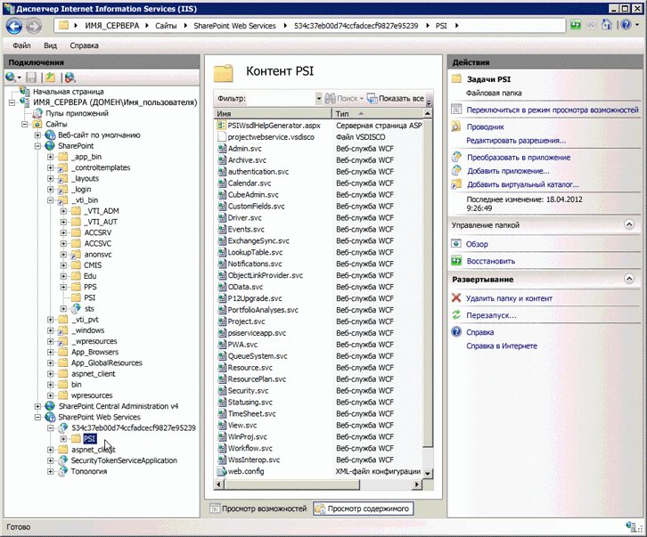

# <a name="project-psi-reference-overview"></a>Общий справочник по Project PSI

Интерфейс Project Server (PSI) — это интерфейс API, используемый для разработки приложений, которые локально интегрируются с Project Server 2013.
  
В этой статье приведены общие сведения о задокументированных сборках, пространствах имен и службах в интерфейсе PSI. [Справочник по библиотеке классов и веб-службам Project Server 2013](https://msdn.microsoft.com/library/ef1830e0-3c9a-4f98-aa0a-5556c298e7d1%28Office.15%29.aspx) в пакете SDK содержит всю документацию по управляемому коду для PSI и пространства имен [Microsoft.ProjectServer.Client](https://msdn.microsoft.com/library/Microsoft.ProjectServer.Client.aspx) в Project Server 2013. При разработке приложений для Project Online необходимо вместо интерфейса PSI использовать пространство имен **Microsoft.ProjectServer.Client**. 

PSI в Project Server 2013 имеет двойной интерфейс. Интерфейс ASMX для веб-служб определяется файлами обнаружения (disco) и WSDL в виртуальном каталоге `https://ServerName/ProjectServerName/_vti_bin/psi/` (например, Projectdisco.aspx и Projectwsdl.aspx). К интерфейсу ASMX можно получить доступ только с помощью URL-адреса локально установленной версии Project Web App (например, `https://ServerName/ProjectServerName/_vti_bin/psi/project.asmx?wsdl)`). Чтобы отобразить веб-службу в браузере, необходимо включить параметр URL-адреса `?wsdl`. Так как интерфейс ASMX создается на основе инфраструктуры Windows Communication Foundation (WCF), в виртуальном каталоге PSI фактически нет ASMX-файлов для веб-служб Project Server. 
  
Интерфейс служб WCF определяется SVC-файлами в тыловом виртуальном каталоге `https://ServerName:32843/GUID/PSI/` в приложении веб-служб SharePoint. URL-адрес служб PSI в виртуальном каталоге приложения-службы Project (например, `https://ServerName:32843/GUID/PSI/project.svc`) включает SVC-файлы. Однако с помощью тылового URL-адреса невозможно непосредственно задать ссылку на службу WCF. Разработать приложение или компонент, использующие службы WCF, которые входят в интерфейс PSI, можно с помощью сборки прокси-сервера или прокси-файла. Доступный для скачивания пакет для SDK Project 2013 включает прокси-файлы для служб WCF в Project Server 2013, а также сценарии для получения обновленных прокси-файлов WCF и их последующей компиляции в сборку прокси-сервера для более новых сборок Project Server.
  
Имя каталога приложения службы Project представляет собой значение GUID, которое совпадает с GUID локального экземпляра Project Web App. В окне **диспетчера Internet Information Services (IIS)** разверните узел **Веб-службы SharePoint**, выберите имя каталога GUID, а затем нажмите **Дополнительные параметры**, чтобы скопировать значение **Виртуальный путь**. 
  
> [!IMPORTANT]
> Интерфейс веб-службы ASMX PSI признан нерекомендуемым в Project Server 2013, однако все еще поддерживается. В новых приложениях необходимо использовать интерфейс WCF PSI или CSOM. Дополнительные сведения о нерекомендуемых компонентах см. в статье [Обновления для разработчиков в Project 2013](updates-for-developers-in-project-2013.md).
> 
> Новые приложения и компоненты ПО промежуточного слоя, которые выполняются только в локально установленной версии Project Server, должны использовать интерфейс WCF. Именно эту технологию мы рекомендуем использовать для сетевых подключений. Приложения прежних версий, в которых используется интерфейс ASMX, должны использовать URL-адрес в Project Web App, который отвечает за проверку разрешений Project Server. 
> 
> Дополнительные сведения об интерфейсе ASMX и использовании интерфейса WCF см. в статьях [Предварительные требования для примеров кода на основе ASMX в Project](prerequisites-for-asmx-based-code-samples-in-project.md) и [Предварительные требования для примеров кода на основе WCF в Project](prerequisites-for-wcf-based-code-samples-in-project.md). 
  
Разрабатывать приложения, в которых используется интерфейс WCF, можно с помощью Visual Studio 2010 или Visual Studio 2012. Для создания декларативных бизнес-процессов Project Server можно использовать SharePoint Designer 2013. Бизнес-процессы Project Server, которым требуется доступ к PSI или CSOM, можно разрабатывать с помощью Visual Studio 2012.
  
### <a name="using-the-psi-reference"></a>Использование справочника по PSI
<a name="pj15_PSIRefOverview_Using"> </a>

Объектная модель PSI отличается большим размером. Ряд классов и элементов предназначен исключительно для внутреннего использования. Поэтому вам может быть сложно найти необходимые разделы в [справочнике по библиотеке классов и веб-службам Project Server 2013](https://msdn.microsoft.com/library/ef1830e0-3c9a-4f98-aa0a-5556c298e7d1%28Office.15%29.aspx). Большинство разделов справки, которые используются при разработке, находятся в следующих группах:
  
- **Методы основных классов.** Каждая служба в интерфейсе PSI включает основной класс, которому присваивается имя службы. Например, служба **Resource** содержит класс [Resource](https://msdn.microsoft.com/library/WebSvcResource.Resource.aspx), который входит в пространство имен [WebSvcResource](https://msdn.microsoft.com/library/WebSvcResource.aspx). Чтобы просмотреть список методов, доступных в классе **Resource**, разверните узел класса в области содержимого, а затем выберите раздел **Методы Resource**. 
    
- **Свойства DataRow.** Многие методы основных классов используют или возвращают класс **DataSet**. Каждый объект **DataTable** в классе **DataSet** содержит данные в одном или нескольких объектах **DataRow**. В большинстве случаев вам нужно просмотреть только свойства строки, а не все другие элементы классов **DataSet**, **DataTable** или **DataRow**. Например, класс **ResourceAssignmentDataSet** включает подклассы для классов **ResourceAssignmentDataTable** и [ResourceAssignmentDataSet.ResourceAssignmentRow](https://msdn.microsoft.com/library/WebSvcResource.ResourceAssignmentDataSet.ResourceAssignmentRow.aspx). Чтобы просмотреть список свойств, доступных в классе **ResourceAssignmentRow**, разверните узел класса в области содержимого, а затем выберите раздел **ResourceAssignmentDataSet.ResourceAssignmentRow Properties**. 
    
Кроме пространств имен служб, раздел [справочника по библиотеке классов и веб-службам Project Server 2013](https://msdn.microsoft.com/library/ef1830e0-3c9a-4f98-aa0a-5556c298e7d1%28Office.15%29.aspx) содержит ссылки на три сборки Project Server, которые используются при разработке сторонних приложений для локальных установок. Документация по этим сборкам представлена в минимальном объеме. В справочнике по PSI описываются основные классы и элементы, которые входят в 23 общедоступные службы. Шесть служб PSI предназначены исключительно для внутреннего использования и не представлены в справочнике. 
  
> [!NOTE]
> Классы в клиентской объектной модели (CSOM) можно использовать независимо от других сборок и служб Project Server. Вы можете использовать пространство имен **Microsoft.ProjectServer.Client** в среде удаленной разработки с компьютера Project Server и разрабатывать приложения, которые интегрируются с Project Online или локально установленной версией Project Server. Однако CSOM содержит подмножество функций полного решения PSI. CSOM обеспечивает разработку наиболее распространенных сценариев для интеграции с Project Server. Дополнительные сведения см. в статьях [Какие задачи CSOM выполняет, а какие — нет](what-the-csom-does-and-does-not-do.md) и [Microsoft.ProjectServer.Client](https://msdn.microsoft.com/library/Microsoft.ProjectServer.Client.aspx). 
  
Для разработки большинства приложений, в которых используется интерфейс PSI, не требуется компьютер с установленным Project Server. Кроме того, вам не нужно задавать ссылки на сборки Project Server в глобальном кэше сборок. Вы можете скопировать сборки Project Server на свой компьютер, используемый для разработки. Project Server 2013 устанавливает следующие сборки в раздел _[Program Files]_ `\Microsoft Office Servers\15.0\Bin`: 
  
- Microsoft.Office.Project.Server.Events.Receivers.dll; 
- Microsoft.Office.Project.Server.Library.dll;
- Microsoft.Office.Project.Server.Workflow.dll.
    
Пространствам имен для служб PSI присваиваются произвольные имена, созданные для сборки прокси-сервера PSI (ProjectServerServices.dll), выполняемой в целях документации. В ссылке на PSI каждое пространство имен службы содержит имя-заполнитель, такое как _[Веб-служба Project]_, и веб-ссылку (например, `https://ServerName/ProjectServerName/_vti_bin/psi/Project.asmx?wsdl`). 
  
## <a name="project-server-assemblies-and-namespaces"></a>Сборки и пространства имен Project Server
<a name="pj15_PSIRefOverview_Assemblies"> </a>

Многие сборки устанавливаются при установке Project Server. Задокументированы только четыре сборки Project Server. Как правило, сторонние разработчики используют только несколько классов и элементов в этих сборках. К незадокументированным сборкам Project Server относятся пространства имен и классы, которые используются в Project Server для внутренних целей. Например, классы для Project Web App, бизнес-элементы и компонент DAL (Data Access Layer). Если в Visual Studio вы задали ссылку на одну из задокументированных сборок Project Server, все пространства имен, классы и элементы отобразятся в обозревателе объектов Visual Studio.
  
> [!NOTE]
> Многие элементы задокументированных пространств имен Project Server используются только во внутренних целях и представлены в документации в минимальном объеме. 
  
При разработке для Project Online можно использовать только CSOM для доступа к функциональным возможностям Project Server. У вас не будет доступа к службам PSI или другим сборкам Project Server.
  
[Справочник по библиотеке классов и веб-службам Project Server 2013](https://msdn.microsoft.com/library/ef1830e0-3c9a-4f98-aa0a-5556c298e7d1%28Office.15%29.aspx) для PSI включает пространства имен из следующих сборок: 
  
- **Microsoft.Office.Project.Server.Library.dll**. Эта сборка содержит одно задокументированное и три незадокументированных пространства имен, как указано ниже. 
    
  - Пространство имен [Microsoft.Office.Project.Server.Library](https://msdn.microsoft.com/library/Microsoft.Office.Project.Server.Library.aspx) включает ряд перечислений, поля и свойства классов, которые часто используются в локальных приложениях для Project Server. Например, разработчики обычно используют такие перечисления, как **CustomField.Type**, а также классы **PSClientError**, **PSErrorInfo** и **Filter**. 
    
    Пространство имен **Microsoft.Office.Project.Server.Library** также включает следующие семь классов свойств, в которые входят более чем 3200 подклассов: 
    
      - **AssignmentProperties**;  
      - **CalendarProperties**;
      - **ConstraintProperties**;
      - **LookupTableProperties**;
      - **ProjectProperties**;
      - **ResourceProperties**;
      - **TaskProperties**.
    
    Классы свойств используются для внутренних целей и не документируются. Классы свойств также используются для сериализации между Project профессиональный 2013 и Project Server. Когда вы работаете с пространством имен **Microsoft.Office.Project.Server.Library** в Visual Studio, в обозревателе объектов отображаются все классы свойств, что усложняет поиск классов, необходимых для сторонней разработки. Так как сторонним разработчикам не нужно использовать классы свойств, они не документируются в пакете SDK. 
    
  - **Microsoft.Office.Project.Server.DataServices.** Классы и элементы этого пространства имен используются службой **OData** во внутренних целях в Project Online для доступа к таблицам отчетов в базе данных Project. Классы **DataServices** не задокументированы. 
    
  - **Microsoft.Office.Project.Server.Administration.** Класс и элементы этого пространства имен используются во внутренних целях для журнала ведения диагностики и не документируются. 
    
  - **Microsoft.Office.Project.Server.Base.** Классы и элементы этого пространства имен используются во внутренних целях как базовые классы и не документируются. 
    
  - **Microsoft.Office.Project.Server.Library.FilterSchema.** Это пространство имен используется во внутренних целях для создания схем фильтров и не документируется. 
    
- **Microsoft.Office.Project.Server.Workflow.dll.** Эта сборка используется для бизнес-процессов Project Server 2010 прежних версий, которые могут работать в Project Server 2013. Для создания бизнес-процессов следует использовать SharePoint Designer 2013 или Visual Studio 2012 с классом [Microsoft.ProjectServer.Client.WorkflowActivities](https://msdn.microsoft.com/library/Microsoft.ProjectServer.Client.WorkflowActivities.aspx). Сборка Microsoft.Office.Project.Server.Workflow.dll включает три следующих пространства имен: 
    
  - [Microsoft.Office.Project.Server.Workflow.](https://msdn.microsoft.com/library/Microsoft.Office.Project.Server.Workflow.aspx) Это пространство имен включает классы, которые используются для действий бизнес-процессов Project Server. К действиям относятся чтение, сравнение и обновление свойств проектов. Другие классы управляют бизнес-процессами и включают обратные вызовы бизнес-процессов при изменении проектов. 
    
  - **Microsoft.Office.Project.PWA.** Это пространство имен содержит внутренний прокси для PSI, который используется с Project Web App и настраиваемыми действиями бизнес-процессов. Данное пространство имен не документируется. 
    
    Для доступа ко всем классам в службах PSI настраиваемому действию бизнес-процесса требуется ссылка на **Microsoft.Office.Project.PWA**. Например, класс **Microsoft.Office.Project.PWA.PSI** включает свойство **ProjectWebService**, которое позволяет получить прокси для пространства имен [WebSvcProject](https://msdn.microsoft.com/library/WebSvcProject.aspx). 
    
  - **Microsoft.Office.Project.Server.WebServiceProxy.** Это пространство имен включает внутренние прокси-классы для основного класса в каждой службе PSI. Используя повышенные права пользователя бизнес-процесса, бизнес-процесс может вызывать методы PSI с помощью прокси-классов. Прокси-классы не задокументированы. 
    
- **Microsoft.Office.Project.Server.Events.Receivers.dll**[Microsoft.Office.Project.Server.Events](https://msdn.microsoft.com/library/Microsoft.Office.Project.Server.Events.aspx) — единственное пространство имен в этой сборке. Включает приемник событий и классы аргументов событий для служб PSI и других внутренних классов. 
    
  Разработчики пишут обработчики событий, производные от классов приемника события. Большинство основных классов в службах PSI имеет соответствующий класс приемника события. Например, класс **ProjectEventReceiver** содержит методы приемника события до операции и события после операции, которые соответствуют методам в классе **Project** в PSI. Методы **OnCreating** и **OnCreated** являются методами приемника события до операции и события после операции для метода **QueueCreateProject**. 
    
  Разработчики обычно используют следующие классы приемников событий:
  <br/>  
  - [AdminEventReceiver](https://msdn.microsoft.com/library/Microsoft.Office.Project.Server.Events.AdminEventReceiver.aspx);
  - [CalendarEventReceiver](https://msdn.microsoft.com/library/Microsoft.Office.Project.Server.Events.CalendarEventReceiver.aspx);
  - [CubeAdminEventReceiver](https://msdn.microsoft.com/library/Microsoft.Office.Project.Server.Events.CubeAdminEventReceiver.aspx);
  - [CustomFieldsEventReceiver](https://msdn.microsoft.com/library/Microsoft.Office.Project.Server.Events.CustomFieldsEventReceiver.aspx);
  - [LookupTableEventReceiver](https://msdn.microsoft.com/library/Microsoft.Office.Project.Server.Events.LookupTableEventReceiver.aspx);
  - [ProjectEventReceiver](https://msdn.microsoft.com/library/Microsoft.Office.Project.Server.Events.ProjectEventReceiver.aspx);
  - [OptimizerEventReceiver](https://msdn.microsoft.com/library/Microsoft.Office.Project.Server.Events.OptimizerEventReceiver.aspx);
  - [ReportingEventReceiver](https://msdn.microsoft.com/library/Microsoft.Office.Project.Server.Events.ReportingEventReceiver.aspx);
  - [ResourceEventReceiver](https://msdn.microsoft.com/library/Microsoft.Office.Project.Server.Events.ResourceEventReceiver.aspx);
  - [SecurityEventReceiver](https://msdn.microsoft.com/library/Microsoft.Office.Project.Server.Events.SecurityEventReceiver.aspx);
  - [StatusingEventReceiver](https://msdn.microsoft.com/library/Microsoft.Office.Project.Server.Events.StatusingEventReceiver.aspx);
  - [TimesheetEventReceiver](https://msdn.microsoft.com/library/Microsoft.Office.Project.Server.Events.TimesheetEventReceiver.aspx);
  - [UserDelegationEventReceiver](https://msdn.microsoft.com/library/Microsoft.Office.Project.Server.Events.UserDelegationEventReceiver.aspx);
  - [WorkflowEventReceiver](https://msdn.microsoft.com/library/Microsoft.Office.Project.Server.Events.WorkflowEventReceiver.aspx);
  - [WssInteropEventReceiver](https://msdn.microsoft.com/library/Microsoft.Office.Project.Server.Events.WssInteropEventReceiver.aspx).
    
  Классы **RulesEventReceiver** и **StatusReportsEventReceiver** используются в Project Web App для внутренних целей. 
    
- **Microsoft.ProjectServer.Client.dll.** Эта сборка содержит CSOM для разработки с помощью .NET Framework 4. Она расположена здесь: `%ProgramFiles%\Common Files\Microsoft Shared\Web Server Extensions\15\ISAPI\Microsoft.ProjectServer.Client.dll`. Разработка приложений с помощью пространства имен **Microsoft.ProjectServer.Client** не зависит от локальных API и служб Project Server, хотя приложения могут работать как с локальной, так и с сетевой версией Project Server. Сведения о связанных сборках CSOM, которые можно использовать для Windows Phone 8, Microsoft Silverlight или JavaScript с веб-приложениями, см. в статье [Microsoft.ProjectServer.Client](https://msdn.microsoft.com/library/Microsoft.ProjectServer.Client.aspx). 
    
- **Microsoft.Office.Project.Server.Schema.dll.** В пакете SDK для Project 2013 не задокументировано пространство имен **Microsoft.Office.Project.Server.Schema**, которое входит в сборку `[Windows]\Microsoft.NET\assembly\GAC_MSIL\Microsoft.Office.Project.Schema\v4.0_15.0.0.0__71e9bce111e9429c\Microsoft.Office.Project.Schema.dll`. Это пространство имен содержит определения всех классов **DataSet**, **DataTable** и **DataRow**, используемых в PSI, а также ряд других похожих классов, которые используются в Project Server во внутренних целях. Общедоступные классы в каждой службе PSI задокументированы в справочниках по соответствующим службам. Например, класс **DriverDataSet.DriverRow** задокументирован в пространстве имен [WebSvcDriver](https://msdn.microsoft.com/library/WebSvcDriver.aspx). 
    
  > [!NOTE]
  > В приложениях, которые используют CSOM, применяют удаленные обработчики событий или получают доступ к Project Online, не используется пространство имен **Microsoft.Office.Project.Server.Schema**. 
  
  В некоторых приложениях, использующих обработчики событий с полным доверием, когда обработчики событий устанавливаются на компьютере Project Server, необходимо установить ссылку на сборку Microsoft.Office.Project.Schema.dll. Далее приводятся два примера.
    
  - В обработчике события после операции **OnCreated** с полным доверием для настраиваемых полей можно использовать аргумент события **e.CustomFieldInformation** со ссылкой на пространство имен **Microsoft.Office.Project.Server.Schema** для определений **CustomFieldDataSet** и **CustomFieldsRow**. 
   
     ```cs
        using PSLibrary = Microsoft.Office.Project.Server.Library;
        using Microsoft.Office.Project.Server.Schema;
        . . .
        // Event handler for the OnCreated event of a custom field.
        public override void OnCreated(
            PSLibrary.PSContextInfo contextInfo, 
            CustomFieldsPostEventArgs e)
        {
            // Get information from the event arguments. 
            string userName = contextInfo.UserName.ToString();
            CustomFieldDataSet customFieldDs = e.CustomFieldInformation;
            CustomFieldsRow customFieldRow = customFieldDs.CustomFields.Rows[0];
            string customFieldName = customFieldRow["MD_PROP_NAME"].ToString();
            byte customFieldType = (byte)customFieldRow["MD_PROP_TYPE_ENUM"];
            Guid customFieldUid = (Guid)customFieldRow["MD_PROP_UID"];
            . . .
        }
     ```

  - Настраиваемому действию бизнес-процесса может требоваться ссылка на пространство имен **Microsoft.Office.Project.Server.Schema** для определений **DataSet**. 
    
## <a name="psi-services"></a>Службы PSI
<a name="pj15_PSIRefOverview_PSI"> </a>

PSI — это набор служб WCF и идентичных веб-служб ASMX для Project Server 2013. Чтобы использовать службу в проекте Visual Studio, необходимо задать ссылку на URL-адрес файла с расширением `.svc` или службы `.asmx?wsdl`, используя произвольное имя для службы имен. Затем служебная программа wsdl.exe или svcutil.exe генерирует исходный код прокси-сервера для этого пространства имен, после чего компилятор создает сборку прокси-службы, которую необходимо включить в приложение. 
  
> [!NOTE]
> Справочник по PSI включает имена-заполнители службы имен для служб PSI, такие как _[Веб-служба администрирования]_, _[Веб-служба драйверов]_ и _[Веб-служба проектов]_. Каждая служба имен PSI содержит основной класс, в который входят веб-методы для этой службы. Например, если задать ссылку на службу **Admin** и присвоить ей имя **WebSvcAdmin**, в вашем приложении служба имен **WebSvcAdmin** будет включать основной класс **Admin** с веб-методами **GetServerCurrency**, **ListInstalledLanguages**, **ReadServerVersion** и т. д. Список нерекомендуемых служб PSI см. в статье [Обновления для разработчиков в Project 2013](updates-for-developers-in-project-2013.md). 
  
Всего насчитывается 30 служб PSI. Службы **authentication**, **ExchangeSync**, **OData**, **P12Upgrade**, **psiserviceapp**, **PWA**, **View** и **WinProj** используются в Project Web App и Project профессиональный во внутренних целях и не задокументированы. Хотя вы можете создать прокси-файлы или сборку прокси-сервера, в которую входят внутренние службы PSI, они не предназначены для использования сторонними разработчиками. Эти службы не задокументированы в справочнике по PSI. На рисунке ниже показано расположение серверных служб PSI в диспетчере Internet Information Services. 
  
**Поиск служб PSI в IIS**


  
Ниже перечислены все классы, содержащие веб-методы в службах PSI.
  
1. [Admin.](https://msdn.microsoft.com/library/WebSvcAdmin.Admin.aspx) Включает методы, которые используются на страницах **Администрирование Project Server** в Project Web App. Определяет финансовые года, управляет параметрами отчетов о состоянии и валют, определяет отчетные периоды, журнал аудита и настройки Active Directory. 
    
2. [Archive.](https://msdn.microsoft.com/library/WebSvcArchive.Archive.aspx) Включает методы для управления резервным копированием и восстановлением проектов, категориями безопасности, настраиваемыми полями, ресурсами, системными параметрами, представлениями и глобальными корпоративными проектами. Считывает и обновляет расписание архивирования. Сохраняет все проекты в архиве или удаляет указанные архивированные проекты. Сохраняет объекты резервных копий в архивных таблицах баз данных и восстанавливает резервные копии объектов в опубликованных таблицах баз данных. 
    
3. **authentication.** Включает методы, которые используются в Project профессиональный и Project Web App исключительно во внутренних целях. 
    
4. [Calendar.](https://msdn.microsoft.com/library/WebSvcCalendar.Calendar.aspx) Управляет исключениями в корпоративном календаре. Извлекает и возвращает ресурсы календаря. Используется для перечисления всех исключений календаря, а также их создания, удаления, обновления и возврата. 
    
5. [CubeAdmin.](https://msdn.microsoft.com/library/WebSvcCubeAdmin.CubeAdmin.aspx) Управляет параметрами куба OLAP. Получает сведения о состоянии сервера анализа данных и базы данных, а также список кубов. Переводит запрос службы построения куба в очередь. Используется для считывания и обновления определений вычисляемых элементов и параметров полей для измерений в кубе. 
    
6. [CustomFields.](https://msdn.microsoft.com/library/WebSvcCustomFields.CustomFields.aspx) Управляет корпоративными настраиваемыми полями. Включает методы извлечения и возврата, а также методы создания, чтения, обновления и удаления (CRUD) для корпоративных настраиваемых полей. 
    
7. [Driver.](https://msdn.microsoft.com/library/WebSvcDriver.Driver.aspx) Управляет целями анализа портфеля, а также определением приоритетов целей для создания проектов и управления запросами. Содержит методы CRUD для целей проекта. 
    
8. [Events.](https://msdn.microsoft.com/library/WebSvcEvents.Events.aspx) Управляет связями с обработчиками событий. Содержит методы CRUD для связей обработчиков событий Project Server для конкретного события или для всех связей обработчиков событий. 
    
9. **ExchangeSync.** Это внутренняя служба Project Server, которая управляет событиями Exchange Server. **ExchangeSync** используется в Project Web App для синхронизации назначений между Project Server и Exchange Server вместо непосредственной синхронизации с клиентом Outlook, как в Office Project Server 2007. 
    
    Доступ к службе **ExchangeSync** предоставляется только через URL-адрес **ProjectServiceApplication**. Классы и элементы **ExchangeSync** не поддерживаются для сторонней разработки. 
    
10. [LoginForms.](https://msdn.microsoft.com/library/WebSvcLoginForms.LoginForms.aspx) Предоставляет методы **Login** и **Logoff** с проверкой подлинности на основе форм. Доступ к службе **LoginForms** предоставляется только с сайта Project Web App переднего плана. 
    
11. [LoginWindows.](https://msdn.microsoft.com/library/WebSvcLoginWindows.LoginWindows.aspx) Обеспечивает методы **Login** и **Logoff**, которые позволяют выполнять проверку подлинности Windows в приложениях на основе ASMX для установленных версий Project Server 2013 с использованием нескольких способов (на основе утверждений и форм). Доступ к службе **LoginWindows** предоставляется только с внешнего сайта Project Web App. 
    
    > [!CAUTION]
    > Служба **LoginWindows** не используется в приложениях на основе WCF и для приложений, работающих в установках Project Server, применяющих только проверку подлинности на основе утверждений или **OAuth**; в этих случаях метод **Login** всегда возвращает **false**. Интегрированная проверка подлинности Windows основана на утверждениях. 
  
12. [LookupTable.](https://msdn.microsoft.com/library/WebSvcLookupTable.LookupTable.aspx) Управляет таблицами подстановки (в том числе многоязыковыми) и соответствующими масками кодов. Извлекает, возвращает, считывает, создает, удаляет и обновляет эти таблицы. 
    
13. [Notifications.](https://msdn.microsoft.com/library/WebSvcNotifications.Notifications.aspx) Управляет оповещениями и напоминаниями. Включает методы для получения, установки, регистрации и отмены регистрации результатов оповещений. 
    
14. [ObjectLinkProvider.](https://msdn.microsoft.com/library/WebSvcObjectLinkProvider.ObjectLinkProvider.aspx) Управляет веб-объектами и ссылками для документов и элементов списков на сайтах SharePoint. Создает, удаляет или считывает проекты, задачи, а также связанные с проектами и задачами веб-объекты. 
    
    > [!NOTE]
    > Службу **ObjectLinkProvider** не рекомендуется использовать в Project Server 2013. Дополнительные сведения см. в разделе *Нерекомендуемые компоненты* статьи [Обновления для разработчиков в Project 2013](updates-for-developers-in-project-2013.md). 
  
15. **OData.** Предоставляет внутренний интерфейс **OData** для таблиц и представлений отчетов. Доступ к службе **OData** предоставляется только через URL-адрес серверной части **ProjectServiceApplication**. В частной службе **OData** в PSI предусмотрен один метод (**ODataClient.ProcessOdataMessage**), который используется в Project Server во внутренних целях для обработки запросов, связанных с данными отчетов. HTTP-запросы направляются через интерфейсную службу **ProjectData**. 
    
    Сведения о службе **ProjectData** и протоколе OData для считывания данных отчетов см. в статье [ProjectData — справочник по службе OData](https://msdn.microsoft.com/library/office/jj163015.aspx).
    
16. **P12Upgrade.** Обеспечивает внутренние методы, используемые установщиком Project Server 2013 для обновления установленной версии Office Project Server 2007. Доступ к службе **P12Upgrade** предоставляется только через URL-адрес **ProjectServiceApplication**. Методы **P12Upgrade** не поддерживаются для сторонней разработки. 
    
17. [PortfolioAnalyses.](https://msdn.microsoft.com/library/WebSvcPortfolioAnalyses.PortfolioAnalyses.aspx) Содержит методы CRUD для зависимостей проекта, а также для решений по оптимизатору, Планировщику и анализу. 
    
18. [Project.](https://msdn.microsoft.com/library/WebSvcProject.Project.aspx) Управляет проектами. Извлекает, возвращает, создает, удаляет, считывает или обновляет проекты в черновых или опубликованных таблицах в базах данных Project. Переводит сообщение в очередь на публикацию. 
    
    Создает или удаляет сущности в проектах (задачи, ресурсы, назначения и т. д.). Извлекает сведения или обновляет группу проекта или адрес сайта проекта. Извлекает состояние проекта, список проектов в черновых таблицах, все суммарные задачи, задачи, которые можно назначить указанному ресурсу, или все проекты, в которых ресурс имеет назначения.
    
    Создает обязательства и управляет ими, создает предложения по проекту и проекты из списков задач SharePoint, а также находит отношения между проектами и главными проектами.
    
19. **psiserviceapp.** Используется в Project Online во внутренних целях. Классы и элементы **psiserviceapp** не поддерживаются для сторонней разработки. 
    
20. **PWA.** Содержит ряд методов, оптимизированных для Project Web App, в том числе методы для правил утверждения обновления задач и для управления отчетами о состоянии. Методы **PWA** часто являются специализированными и в некоторой мере избыточными по сравнению с эквивалентными методами в других службах PSI. Методы **PWA** часто используют или возвращают те же наборы данных, что и другие методы PSI. 
    
    Доступ к службе **PWA** предоставляется только через URL-адрес **ProjectServiceApplication**. Классы и элементы **PWA** не поддерживаются для сторонней разработки. 
    
21. [QueueSystem.](https://msdn.microsoft.com/library/WebSvcQueueSystem.QueueSystem.aspx) Управляет очередью Project Server. Извлекает счетчик заданий, время ожидания задания или группы заданий, состояние всех заданий, указанные задания, задания, принадлежащие вызывающему объекту, или задания для указанных проектов. Управляет корреляцией заданий и настраивает очередь. 
    
22. [Resource.](https://msdn.microsoft.com/library/WebSvcResource.Resource.aspx) Управляет корпоративными ресурсами. Извлекает, возвращает, обновляет или создает ресурсы либо пользователей Project Server и их параметры авторизации. Обнаруживает ресурсы по имени или GUID. Считывает данные ресурса или пользователя, а также структурную декомпозицию ресурсов (СДРес) и соответствующие сведения о безопасности. Извлекает все назначения для ресурса и сбрасывает пароли пользователей. Класс **Resource** содержит методы CRUD для делегирования пользователей. 
    
23. [ResourcePlan.](https://msdn.microsoft.com/library/WebSvcResourcePlan.ResourcePlan.aspx) Управляет планами ресурсов. Извлекает, возвращает, публикует и включает методы CRUD для планов ресурсов. 
    
24. [Security.](https://msdn.microsoft.com/library/WebSvcSecurity.Security.aspx) Содержит методы CRUD для шаблонов безопасности, категорий безопасности, организационных и глобальных разрешений, а также групповых разрешений. Класс **Security** включает методы для категорий проекта. 
    
25. [Statusing.](https://msdn.microsoft.com/library/WebSvcStatusing.Statusing.aspx) Управляет обновлениями состояния и назначениями. Применяет обновления состояния или утверждения, отправляет обновления состояния, устанавливает сводные сведения для отправленных обновлений, удаляет утвержденные обновления состояния или историю утверждений для конкретного пользователя, а также удаляет все сведения о состоянии для набора проектов. Создает, извлекает или делегирует назначения, а также устанавливает длительность работ назначения. Извлекает новые назначения для текущего пользователя. Извлекает журнал назначений или транзакций задач, повременные фактические данные или иерархию суммарных задач. 
    
    Выполняет предварительный просмотр или импорт данных расписания или читает рабочее и нерабочее время пользователя. Находит ожидающие обновления состояния, сведения для отправленных обновлений или запись транзакции изменений в отправленном обновлении. Читает состояние группы.
    
26. [TimeSheet.](https://msdn.microsoft.com/library/WebSvcTimeSheet.TimeSheet.aspx) Управляет расписаниями. Включает методы CRUD для расписаний и отправляет или повторно вызывает расписания. Находит расписания, которые просрочены или ожидают утверждения. Выполняет поиск расписаний по дате или периоду. Получает список утверждающих расписания. Предварительно загружает фактические данные расписаний и проверяет строки расписаний. Класс **TimeSheet** включает методы **ReadProjectTimesheetLines** и **SubmitTimesheetLines** для считывания и отправки расписаний для другого ресурса без необходимости в олицетворении. 
    
27. **View.** Служба **View** разработана для использования только в Project Web App. Методы в классе **View** управляют представлениями, просматривают отчеты и считывают поля в представлениях. 
    
    Доступ к службе **View** предоставляется только через URL-адрес **ProjectServiceApplication**. Методы **View** не поддерживаются для сторонней разработки. 
    
28. **WinProj.** Служба **WinProj** предназначена для использования только в Project профессиональный. Сторонние разработчики не должны использовать методы **WinProj** для программирования в Project Server. 
    
    Некоторые методы **WinProj** используют наборы данных, например **ProjectRelationsDataSet** и **ResourceDataSet**, которые также используются службами **Project** и **Resource**, но в Project Professional для них требуются особые свойства и функции. 
    
    Доступ к службе **WinProj** предоставляется только через URL-адрес **ProjectServiceApplication**. Методы **WinProj** не поддерживаются для сторонней разработки. 
    
29. [Workflow.](https://msdn.microsoft.com/library/WebSvcWorkflow.Workflow.aspx) Включает методы CRUD для корпоративных типов проектов, а также управления этапами и стадиями бизнес-процессов. Запускает бизнес-процессы, задает сведения о состоянии и управляет стадиями создания страницы сведений о проекте (PDP) в бизнес-процессах управления запросами. При разработке бизнес-процессов Project Server разработчики могут использовать SharePoint Designer 2013 для декларативных бизнес-процессов или использовать "Инструменты разработчика Office для Visual Studio 2012" для разработки с помощью .NET Framework 4 и класса [Microsoft.ProjectServer.Client.WorkflowActivities](https://msdn.microsoft.com/library/Microsoft.ProjectServer.Client.WorkflowActivities.aspx) в CSOM. 
    
30. [WssInterop.](https://msdn.microsoft.com/library/WebSvcWssInterop.WssInterop.aspx) Управляет сайтами проектов. Создает и удаляет сайты проектов. Получает сведения, а также обновляет параметры и сайты администрирования SharePoint. Синхронизирует и обновляет данные членства и группы для сайтов проектов. 
    
Пространство имен каждой службы включает все классы схемы **DataSet** и обработчик событий, используемые службой. Например, `Calendar.svc` (или `Calendar.asmx?wsdl` для веб-службы ASMX) описывает службу **Calendar**. Если вы присвоите ссылке имя **WebSvcCalendar**, пространство имен прокси-сервера будет содержать основной класс **Calendar** с методами **CheckInCalendars**, **CheckOutCalendars** и т. д. Пространство имен прокси-сервера **WebSvcCalendar** также включает класс **CalendarDataSet** со всеми его подклассами. 
  
Некоторые службы PSI содержат дублированные классы **DataSet**. Например, службы **Project** и **Statusing** включают класс **ProjectDataSet**. Это объясняется тем, что методы в обеих службах **Project** и **Statusing** включают ссылки на **ProjectDataSet**, и сборки прокси, созданные при установке ссылок и компиляции приложения, включают соответствующие наборы данных. Службы **Project** и **Statusing** могут требовать значения для различных полей в классе **ProjectDataSet.ProjectRow**. 
  
При переходе по пространствам имен и классам в справке PSI, например, для просмотра веб-методов для службы **Project**, разверните пространство имен **[Веб-служба Project]** в списке **Содержимое**, а затем разверните класс **Project**. 
  
## <a name="see-also"></a>Дополнительные ресурсы

- [Архитектура Project Server 2013](project-server-2013-architecture.md)
- [Возможности программирования для Project Server](project-server-programmability.md)   
- [Какие задачи PSI выполняет, а какие — нет](what-the-psi-does-and-does-not-do.md)   
- [Предварительные требования для примеров кода на основе ASMX в Project](prerequisites-for-asmx-based-code-samples-in-project.md)   
- [Предварительные требования для примеров кода на основе WCF в Project](prerequisites-for-wcf-based-code-samples-in-project.md)   
- [Центр разработчика .NET Framework](https://msdn.microsoft.com/netframework/aa496123.aspx)
    

