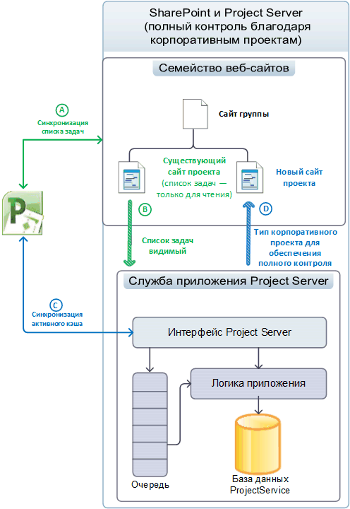
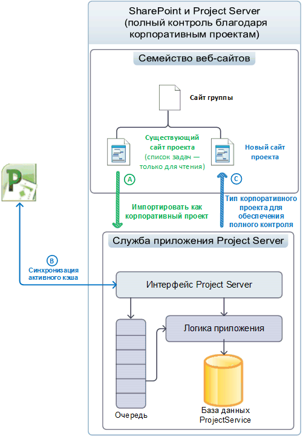
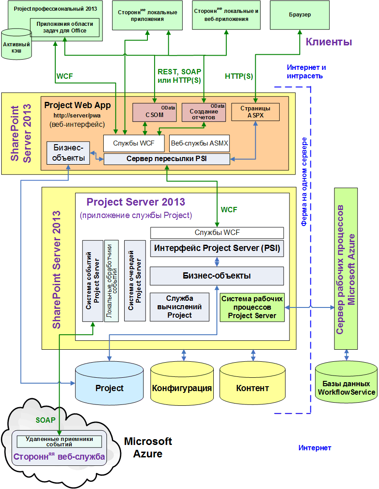
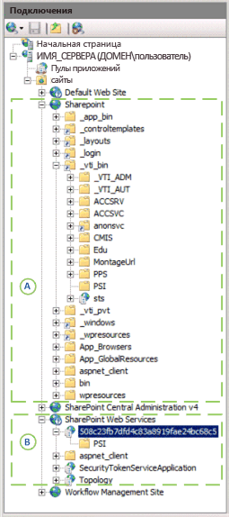

# Архитектура Project Server

Project Server 2013 интегрирует функции управления проектами в ферму SharePoint и позволяет использовать Microsoft Project Online с клиентской объектной моделью (CSOM) и интерфейсом OData для данных отчетов.
   
Project Server 2013 — это многоуровневая система, расширяющая архитектуру, представленную в Office Project Server 2007. Изменения в архитектуре включают связь службы приложения Project Server с семействами веб-сайтов SharePoint, добавление нескольких бизнес-объектов в веб-интерфейс (WFE), клиентскую объектную модель (CSOM) для удаленного доступа, единую базу данных Project, интерфейс OData для таблиц и представлений отчетов, интеграцию Windows Workflow Foundation версии 4 (WF4) посредством Workflow Manager Client 1.0 в облако или локальный сервер, а также удаленные приемники событий, доступные из множества установок Project Server. Помимо локальных пользовательских решений, можно создавать приложения, включающие удаленные приемники событий и компоненты, которые обращаются к интерфейсам CSOM и OData.
  
Интерфейсный уровень включает Project профессиональный 2013, Project Web App и сторонние приложения. Клиентские приложения взаимодействуют со средним уровнем через интерфейс Project Server (PSI) или через конечные точки CSOM, которые взаимодействуют с PSI и уровнем бизнес-объектов. Доступ к базе данных интегрирован в бизнес-объекты. Система обработки событий Project Server имеет доступ как к локальным обработчикам событий, так и к удаленным приемникам событий. Служба вычислений Project обеспечивает работу механизма планирования Project профессиональный на сервере Project Server. Клиентские приложения не обращаются (или не должны обращаться) непосредственно к базе данных Project; Project Server скрывает бизнес-объекты от клиентов.
  
> [!NOTE]
> Компонент Project Server встроен в архитектуру SharePoint. Дополнительные сведения об архитектуре SharePoint Server 2013 и модели приложений SharePoint см. в разделе *Приступая к разработке в SharePoint* документации разработчика Office 2013. 

## Интеграция с семействами веб-сайтов SharePoint

Службу приложения Project Server в Project Server 2013 можно связать с семейством веб-сайтов SharePoint, чтобы получить возможность работать со списками задач SharePoint. Эта служба также может импортировать списки задач SharePoint в виде корпоративного проекта для полного доступа к Project Server. С помощью списка задач SharePoint компонент SharePoint обслуживает сайт проекта в семействе веб-сайтов. Project профессиональный может синхронизироваться с этим списком задач и обновлять его. Сайт проекта может представлять собой независимый список задач SharePoint или список задач, который синхронизирован с MPP-файлом. MPP-файл может храниться локально или в библиотеке SharePoint. 
  
При наличии полного доступа Project Server обслуживает проекты. Project профессиональный сохраняет данные непосредственно в Project Server. В таблице 1 сравнивается поведение списка задач, веб-части расписания и других функций для управления списками задач SharePoint и для импортированных проектов при наличии у Project Server полного доступа. Веб-часть расписания содержит таблицу на странице Project Web App, в которой вы можете изменить расписание проекта. В связанном режиме данные о состоянии указываются сразу и для задач, и для расписаний. В режиме одной операции данные о состоянии задач указываются отдельно от данных о состоянии расписаний.
  
**Таблица 1. Сравнение списков задач SharePoint и уровня доступа**

| Функция | Список задач | Уровень доступа |
|:-----|:-----|:-----|
|**Список задач в SharePoint**   |Чтение и запись    |Только чтение    |
|**Веб-часть расписания**   |Только чтение    |Чтение и запись    |
|**Создание отчетов**   |Создание подробных отчетов в Project Server    |Создание подробных отчетов в Project Server    |
|**Другие функции Project Server**   | Заблокированные функции:   - Редактирование проекта на стороне сервера в Project Web App или других клиентских приложениях.   - Определение состояния.   - Задачи не видны в связанном режиме.    |Доступны все функции    |
   
### Управление проектами как списками задач SharePoint

Когда Project Server связан с семейством веб-сайтов SharePoint, где SharePoint обеспечивает управление, списки задач и файлы Project профессиональный 2013 (.mpp) в библиотеках документов видимы для службы приложений Project Server, но основные данные для синхронизации обслуживает SharePoint (см. рис. 1). Составление расписания на стороне сервера с помощью веб-части расписания не поддерживается. С помощью Project профессиональный можно выполнить синхронизацию со списком задач и отредактировать этот список на сайте проекта. Начав работу со списками задач SharePoint, организации могут постепенно развиваться и использовать все возможности Project Server.
  
На рис. 1 представлены следующие процессы при сохранении проектов в списке задач SharePoint. 
  
- (А) Project Professional может выполнять синхронизацию со списками задач и создавать новые сайты проектов в семействе сайтов до или после связывания с приложением-службой Project.
    
- (Б) Project Server выполняет синхронизацию с данными сайта проекта для создания отчетов, однако основные данные обслуживаются SharePoint; к спискам задач предоставляется доступ на чтение и запись.
    
- (В) После связывания Project Professional может создавать новые проекты и сохранять их или публиковать в Project Server. Активный кэш в Project Professional обслуживает синхронизацию данных с Project Server.
    
- (D) При публикации нового проекта в Project профессиональный пользователь может создать для него сайт проекта. Проект также можно создать в Project Web App как тип проекта списка задач SharePoint или тип корпоративного проекта (EPT) с полным доступом. Шаг (D) показывает тип корпоративного проекта с полным доступом.
    
**Рисунок 1. Использование сайтов проектов в качестве списков задач SharePoint**

 

### Управление проектами с полным доступом

Когда Project Server связан с семейством веб-сайтов и имеет полный доступ, он импортирует списки задач SharePoint как корпоративные проекты и может удалять любые связанные MPP-файлы. Project Server обслуживает основные данные для синхронизации списков задач. Списки задач в семействе веб-сайтов становятся доступны только для чтения (см. рис. 2). Импортированные проекты можно редактировать с помощью Project профессиональный или Project Web App.
  
> [!NOTE]
> После того как Project Server импортирует проект, пользователь выбирает, требуется ли удалить проект с сайта или разорвать связь, прежде чем приступить к его редактированию. Этот выбор можно сделать в Project Professional. 
  
На рис. 2 приведены следующие процессы при обслуживании корпоративных проектов Project Server с уровнем полного доступа.
  
- (А) Пользователь может выбрать конкретные сайты проектов для импорта. Project Server импортирует сайты проектов и при необходимости удаляет связанные MPP-файлы. Список задач SharePoint, состоящий из импортированных проектов, становится доступным только для чтения.
    
- (B) После связывания Project профессиональный создает новые проекты и сохраняет или публикует их на Project Server. Активный кэш в Project профессиональный обеспечивает синхронизацию данных с Project Server. Веб-часть расписания в Project Web App может выполнять планирование на стороне сервера.
    
- (C) При публикации нового проекта в Project профессиональный пользователь может создать сайт проекта для этого проекта. Проект можно также создать в Project Web App как тип корпоративного проекта EPT с полным доступом и опубликовать как список задач, доступный только для чтения, на сайте проекта в семействе веб-сайтов.
    
**Рисунок 2. Использование сайтов проектов с полным доступом**

  
## Общая архитектура

На рис. 3 приведено общее представление архитектуры Project Server 2013, включая службу приложения Project Server, один экземпляр Project Web App в веб-интерфейсе и несколько других клиентских приложений, в том числе Project профессиональный 2013.
  
Экземпляров Project Web App, которые взаимодействуют с серверной службой приложения Project Server, может быть множество. Для локальной установки веб-интерфейс может находиться на отдельном сервере в ферме SharePoint либо на том же сервере SharePoint, где расположена служба приложения Project Server. Microsoft Project Online содержит веб-интерфейс, службу приложения Project Server и локальный или удаленный сервер Workflow Manager Client 1.0. 
  
**Рисунок 3. Общая архитектура Project Server 2013**

 

К рис. 3 применяются следующие примечания.
  
- **Project Online.** Вы можете создавать приложения, использующие интерфейсы CSOM, REST и OData. Пакет приложения также может устанавливать удаленные приемники событий в пользовательской веб-службе на локальном сервере, на сервере Azure или в Microsoft Azure. Project Online не поддерживает сторонние локальные решения, интерфейсы WCF и ASMX, а также локальные обработчики событий. 
    
- **Приемники событий.** Приемники событий также называют обработчиками событий. Project Online поддерживает регистрацию удаленных приемников событий Project Server, которые экземпляр Project Web App в облаке или локально установленный экземпляр Project Server могут использовать. Любой локально установленный экземпляр Project Server поддерживает удаленные приемники событий и локальные обработчики событий с полным доверием. 
    
- **Браузеры.** Просмотр страниц Project Web App возможен в любом браузере (без ограничений, как в Project Server 2010). Следующие браузеры поддерживают работу с Project Web App в полном объеме: 
    
  - Internet Explorer 8.x (в Windows 7 и более ранних версиях Microsoft Windows), Internet Explorer 9.x и Internet Explorer 10.x; 
  - Firefox 4.x (в Windows, Mac OS-X и Linux/Unix);
  - Safari 5.x (в Windows и Mac OS-X);
  - Chrome.
    
- **Программные интерфейсы.** Microsoft Project Online предоставляет сторонним приложениям доступ к интерфейсу HTTP/HTTPS (включая REST), интерфейсу CSOM, службе OData для CSOM и службе OData для отчетов. В случае локальных клиентских приложений от сторонних разработчиков (в интрасети) можно использовать интерфейс WCF для PSI либо интерфейсы CSOM, OData и REST по протоколу HTTP. Клиенты Project Web App и Project профессиональный 2013 используют интерфейс WCF. При установке на одном сервере внешние веб-службы ASMX, CSOM и REST совершают внутренние вызовы внутренних служб WCF. 
    
    > [!NOTE]
    > Основанный на SOAP интерфейс ASMX для веб-служб в интерфейсе PSI по-прежнему доступен в Project Server 2013, однако использовать его не рекомендуется. 
  
    Службу OData для отчетов реализует внутренняя служба WCF OData.svc. Вы можете получить документ метаданных службы для данных отчетов с помощью  `https://ServerName/ProjectServerName/_api/ProjectData/$metadata`. 
    
    Служба OData для CSOM предназначена для таких платформ, как Windows RT, iOS и Android, где можно использовать интерфейс REST с JavaScript на HTML-страницах. 
    
    > [!NOTE]
    > Хотя параметр `$metadata` допустим для службы отчетов **ProjectData**, параметр `$metadata` для службы **ProjectServer** CSOM удален в выпущенной версии Project Server 2013. Дополнительные сведения о запросах REST см. в статье [Клиентская объектная модель (CSOM) для Project Server](client-side-object-model-csom-for-project-2013.md). 
  
- **Сервер пересылки PSI.** Программный доступ к PSI на отдельном веб-интерфейсе проходит через сервер пересылки PSI, включающий в себя сервер пересылки WCF и сервер пересылки веб-служб. Клиенты, использующие интерфейс ASMX, получают доступ к PSI через сервер пересылки веб-служб. Клиенты, использующие интерфейс WCF, получают доступ к PSI через сервер пересылки WCF. Программный доступ через CSOM, OData и REST передается через сервер пересылки WCF. 
    
- **Рабочие процессы.** Декларативные рабочие процессы (рабочие процессы, которые определены в SharePoint Designer 2013) выгружаются Workflow Manager Client 1.0 для обработки. Workflow Manager Client 1.0 может выполняться на отдельном сервере в ферме SharePoint, на Microsoft Azure в облаке или на одном компьютере Project Server для тестирования или демонстраций. Кодированные рабочие процессы, созданные в Visual Studio 2012, обрабатываются в среде выполнения рабочих процессов в SharePoint, как и в Project Server 2010. Дополнительные сведения см. в статье [Начало разработки рабочих процессов Project Server](getting-started-developing-project-server-workflows.md).
    
- **Сеть периметра (DMZ).** На рис. 3 не показано, что локальный сервер веб-интерфейса можно изолировать с помощью дополнительного брандмауэра в сети периметра (также называемой "демилитаризованной зоной", или DMZ). Сеть периметра позволяет веб-клиентам получать доступ к SharePoint и Project Server через брандмауэр. 
    
- **Веб-службы SharePoint.** На рис. 3 не показана инфраструктура SharePoint, например внутреннее приложение веб-служб SharePoint, которое является частью SharePoint Server 2013. При установке Project Server приложение службы Project добавляется в веб-службы SharePoint. 
    
Интерфейсный уровень включает сторонние приложения, Project профессиональный и Project Web App. Браузер отображает страницы ASP.NET 4.0 (ASPX-страницы) в Project Web App. На страницах Project Web App используются веб-части Project Server, которые обращаются к PSI, а также стандартные веб-части SharePoint. 
  
Средний уровень включает PSI и уровень бизнес-объектов, который состоит из логических объектов, представляющих собой бизнес-элементы Project Server. Бизнес-элементы включают проект, задачу, ресурс, назначение и т. д. PSI и уровень бизнес-объектов бизнеса тесно связаны и находятся на одном сервере. Клиентское приложение вызывает PSI через один из доступных интерфейсов, и PSI вызывает бизнес-объекты. Для повышения производительности веб-интерфейс Project Server 2013 содержит некоторые бизнес-объекты для запросов, которые не используют систему очередей Project Server и не требуют наличия службы вычислений Project. Бизнес-объекты веб-интерфейса взаимодействуют с базой данных Project напрямую.
  
Компоненты Project Web App сервера Project Server используют базу данных конфигурации SharePoint 2013 для настройки сайта проекта и базу данных контента для содержимого сайта проекта, например списков задач, пользовательских страниц, рабочих процессов, параметров управления, документов, а также списков вопросов, рисков и обязательств. Конфигурация SharePoint и базы данных контента поддерживают дополнительные возможности для управления проектами, например рабочие области и шаблоны проектов, настраиваемые списки для совместной работы группы пользователей и отчеты.
  
### Project Web App и веб-интерфейс

Вы можете настроить несколько экземпляров Project Web App в веб-интерфейсе и на нескольких серверах веб-интерфейса в корпоративной интрасети, чтобы включить распределение загрузки для клиентов интрасети. Если клиентское приложение использует экземпляр Project Web App на отдельном сервере веб-интерфейса, вызовы PSI направляются через сервер пересылки PSI. Сервер пересылки PSI (сервер пересылки WCF или сервер пересылки веб-служб) выполняет следующие функции:
  
- оптимизация вызовов PSI из удаленных клиентов;
    
- разделение вызовов PSI на те, которым требуется служба очередей Project Server, и те, которым она не требуется (имена асинхронных методов PSI начинаются с Queue, например **QueueCreateProject**);
    
- идентификация вызовов PSI, активизирующих зарегистрированные обработчики локальных событий;
    
- определение вызовов PSI, для которых требуется служба вычислений Project;
    
- использование серверного кэша, работающего с клиентским активным кэшем в Project профессиональный, для сокращения вызовов "туда-обратно" на Project Server.
    
После того как пользователь Project Server проходит проверку подлинности на SharePoint Server, сервер пересылки PSI открыто отправляет запросы, использующие серверные службы, службам PSI на компьютере, на котором запущен Project Server. Запросы, в которых серверные службы не требуются, отправляются к бизнес-объектам на локальном экземпляре Project Web App. Сервер пересылки PSI улучшает масштабируемость, производительность и надежность обработки Project Server по локальной и глобальной сети, а также в Microsoft Project Online.
  
Компонент Project Web App был разработан с помощью ASP.NET 4.0. Визуальные элементы в ASPX-файлах (HTML, элементы управления сервера и статический текст) отделены от программной логики в классах поддерживающего кода, находящихся в скомпилированных сборках (DLL-файлах). Страницы сайтов в Project Web App, например страницу верхнего уровня, центр проектов и центр отчетов, можно настроить с помощью веб-частей. Страницы приложений, не имеющие параметра **Изменить страницу** в меню **Действия сайта**, такие как страница "Параметры сервера" и "Просмотр расписания", не могут быть отредактированы. 
  
### CSOM и интерфейс Project Server

PSI включает 22 общедоступные службы, такие как **Project**, **Resource**, **CustomField** и **Statusing**. PSI также содержит семь частных служб, предназначенных для внутреннего использования. PSI является фундаментальным API сервера Project Server. Он предоставляет функциональные возможности Project Server для CSOM и внешних приложений. CSOM содержит классы, которые обращаются к наиболее часто используемым классам PSI и участникам, применяемым для сторонних приложений. В Project Server 2013 некоторые функциональные возможности Project Server не доступны в CSOM (например, службы **Admin**, **Calendar**, **PortfolioAnalyses** и **Security**). 
  
Project профессиональный 2013 и Project Web App используют PSI для получения доступа к данным Project Server в черновиках, опубликованных и архивных таблицах, а также представлениях базы данных Project. Получить доступ к службе PSI (как для служб WCF, так и веб-служб ASMX) можно через файл прокси или сборку прокси.
  
> [!NOTE]
> CSOM является предпочтительным интерфейсом для сторонних разработчиков Project Server. Его можно использовать для приложений, которые имеют доступ как к локальной установке Project Server, так и к Microsoft Project Online. Мы рекомендуем использовать CSOM для разработки новых приложений, если CSOM содержит требуемую для приложения функциональность. 
  
Для некоторых бизнес-приложений (LOB) и приложений сторонних разработчиков, созданных для Project Server 2010, требуются службы PSI, которые еще не представлены в CSOM. Если приложения предназначены только для локальной установки Project Server, они могут продолжать использовать интерфейс WCF или интерфейс ASMX PSI.
  
Клиентские приложения вызывают PSI через прокси служб. Клиенты, использующие интерфейс WCF, получают доступ ко всем службам PSI через `https://ServerName/ProjectServerName/_vti_bin/psi/ProjectServer.svc`. Клиенты, работающие с интерфейсом веб-службы ASMX, используют URL-адрес Project Web App для конкретной службы. Например, служба **Resource** находится по адресу `https://ServerName/ProjectServerName/_vti_bin/psi/resource.asmx?wsdl`. Если приложения не имеют доступа к Project Server из интрасети, они могут использовать сервер Project Web App в сети периметра (не показано на рис. 3).
  
На рис. 4 показана панель **Подключения** в **диспетчере Internet Information Services (IIS)** для односерверной установки SharePoint Server 2013, Project Server 2013 и локального сайта управления рабочими процессами для Workflow Manager Client 1.0. Семейство веб-сайтов SharePoint (A) включает интерфейсные службы PSI в виртуальном подкаталоге `_vti_bin\PSI`. Приложение веб-служб SharePoint (B) включает службу приложения Project Server с серверными службами PSI в виртуальном подкаталоге `508c23fb7dfd4c83a8919fae24bc68c5/PSI`. GUID — это имя экземпляра службы приложения Project Server для этой установки Project Server. 
  
**Рисунок 4. Диспетчер IIS, показывающий интерфейсные PSI (A) и серверные PSI (B)**

  
Клиентские приложения не могут напрямую обращаться к службам WCF для PSI в серверной службе приложения Project Server. Если им не требуется доступ к Microsoft Project Online, клиентские приложения и компоненты LOB-приложений используют прокси для PSI. На рис. 4 внутренним URL-адресом для интерфейса WCF службы **Resource** может быть, например, `https://ServerName:32843/508c23fb7dfd4c83a8919fae24bc68c5/psi/resource.svc`. Порт 32843 является HTTP-портом по умолчанию для приложения веб-служб SharePoint (для взаимодействия по протоколу HTTPS используется порт 32844). Однако файл web.config для Project Web App блокирует прямой доступ к серверным службам PSI.
  
> [!NOTE]
> Пакет загрузки набора SDK Project 2013 включает прокси-файлы PSI для служб WCF и ASMX, а также инструкции по компиляции файлов в прокси-сборки. Чтобы создать обновленные прокси-файлы PSI, использующие интерфейс WCF, необходимо использовать служебную программу svcutil.exe или Visual Studio непосредственно на компьютере Project Server. 
  
Участники служб PSI, как правило, производят или потребляют типизированные объекты **DataSet** в качестве средства обмена информацией с бизнес-объектами. Существует также несколько различных моделей для разработки PSI. Например, службы PSI **Resource**, **CustomFields** и **LookupTable** используют объекты фильтра XML для манипулирования объектами **DataSet**, а другие службы — нет. Некоторые методы в службе **Statusing** используют параметр _changeXml_, в то время как другие методы и сервисы его не используют. CSOM не использует наборы данных. Хотя CSOM имеет модель программирования, отличную от модели PSI, и вы можете использовать сборки .NET или JavaScript, разработка с использованием CSOM, как правило, проще и понятнее, чем разработка с PSI. 
  
Дополнительные сведения о PSI см. в статье [Обзор справочника по Project PSI](project-psi-reference-overview.md). Дополнительные сведения о модели CSOM см. в статье [Клиентская объектная модель (CSOM) для Project 2013](client-side-object-model-csom-for-project-2013.md).
  
### Бизнес-объекты в веб-интерфейсе и службе приложения Project Server

Внутренняя объектная модель Project Server включает бизнес-объекты, которые представляют логические сущности, такие как "Проект" и "Ресурс". Клиентские приложения получают доступ к бизнес-объектам только через CSOM или PSI. Бизнес-объекты, в свою очередь, получают доступ к черновикам, опубликованным и архивным таблицам и представлениям в базе данных Project.
  
Бизнес-объекты не предоставляются сторонним разработчикам. Интерфейс PSI обрабатывает сопоставление API с бизнес-объектами, а модель CSOM сопоставляет свои API с PSI. Логические сущности бизнес-объектов можно разделить на три типа.
  
- **Основные сущности:** такие объекты, как проекты, задачи, назначения, ресурсы и календари. Основные объекты включают основную бизнес-логику, такую как разрешения и правила именования. 
    
- **Бизнес-сущности:** такие объекты, как расписания, портфели проектов и модели. Бизнес-сущности включают дополнительную бизнес-логику и, как правило, создаются на основе основных сущностей. 
    
- **Вспомогательные сущности:** объекты, такие как объекты безопасности и проверки. 
    
В Project Server 2010 все бизнес-объекты внедрены в службу приложения Project Server. В Project Server 2013 в компоненте веб-интерфейса размещаются многие бизнес-объекты, которые обрабатывают синхронные методы и не требуют наличия службы вычислений Project. Синхронные методы PSI, такие как **DeleteProject** и **ReadAssignments**, не используют службу очередей Project Server. Имена асинхронных методов в PSI начинаются с `Queue` (например, **QueueCreateProject** и **QueueUpdateTimesheet**). Асинхронный метод отправляет сообщение в службу очередей Project Server, которая планирует обработку метода, в то время как управление возвращается пользователю.
  
Сервер пересылки PSI определяет, какие запросы отправляются в приложение-службу Project, а какие могут обрабатываться бизнес-объектами в веб-интерфейсе. Бизнес-объекты в веб-интерфейсе обходят службу-приложение Project и получают прямой доступ к базе данных Project (так же как и другие процессы SharePoint в веб-интерфейсе получают прямой доступ к базам данных конфигурации и контента). Выполнение многих бизнес-объектов в веб-интерфейсе повышает эффективность работы Project Server, снижает нагрузку на уровень приложений и оптимизирует масштабируемость Project Server при возрастании нагрузки.
  
> [!NOTE]
> В Project Server 2013 локальные обработчики событий должны быть развернуты в веб-интерфейсе и на внутреннем компьютере Project Server. 
  
### База данных Project Server

В Project Server 2013 четыре базы данных Project Server предыдущих версий объединены в одну базу данных Project в SQL Server. Имя базы данных Project по умолчанию — ProjectService. Таблицы и представления отчетов сохраняют свои предыдущие имена с префиксом `dbo` (например, dbo.MSP_EpmProject и dbo.MSP_EpmProject_UserView). Таблицы и представления, которые раньше находились в базе данных черновиков, имеют префикс `draft`. Таблицы и представления, которые раньше находились в базе данных опубликованных проектов, имеют префикс `pub`. Таблицы и представления, которые раньше находились в базе данных архивов, имеют префикс `ver`. 
  
> [!IMPORTANT]
> Прямой доступ не поддерживается для таблиц и представлений черновиков (префикс `draft`), публикаций (префикс `pub`) и архивов (префикс `ver`). В отчетах следует использовать только таблицы и представления отчетов с префиксом `dbo`. 
  
Данные Project Server разделены в базе данных Project следующим образом:
  
- Черновики таблиц и представлений содержат данные из неопубликованных проектов, которые были созданы Project профессиональный и другими приложениями. Project Web App не отображает данные проектов из черновиков таблиц и представлений.
    
- Опубликованные таблицы и представления содержат все опубликованные проекты и корпоративные ресурсы, глобальные данные для типов корпоративных проектов (EPT) и другие шаблоны проектов. Опубликованные проекты видны в Project Web App. Опубликованные данные также включают таблицы, относящиеся к Project Web App (расписания, модели, представления и т. д.), и таблицы глобальных данных (настраиваемые поля, таблицы поиска, разрешения авторизации Project Server и метаданные).
    
- В данных архива сохраняются резервные версии проектов, ресурсов, пользовательских полей и других данных.
    
- Данные отчетов могут использоваться только для чтения в сторонних приложениях и для отчетов. Кубы OLAP Project Server используют представления отчетов с суффиксом `_OlapView`. Кубы OLAP доступны в локально установленной версии Project Server, но недоступны в Microsoft Project Online. 
    
    Данные отчетов — полные и обновляются практически в режиме реального времени. Таблицы и представления отчетов оптимизированы для создания отчетов только для чтения; например, таблицы отчетов не нормализованы, чтобы предоставлять избыточные данные и сократить число реляционных таблиц.
    
Логические сущности, такие как "Ресурс" или "Проект" могут охватывать несколько таблиц; все таблицы для конкретной сущности будут иметь тот же основной ключ. Основной ключ представляет собой GUID в отдельном столбце, который однозначно идентифицирует один экземпляр конкретной сущности.
  
Данные Project Server для каждого экземпляра Project Web App хранятся в отдельной базе данных Project с другим именем. Клиентские приложения, имеющие прямой доступ к Project Server, могут напрямую считывать таблицы и представления отчетов. При удаленном доступе клиентские приложения могут использовать интерфейс OData и интерфейс REST для получения данных для отчетов. Для доступа к таблицам и представлениям черновиков, публикаций и архивов клиенты должны использовать только CSOM или PSI. Служба данных отчетов (RDS, которая не показана на рис. 3) обновляет данные отчетов из опубликованных данных практически в режиме реального времени. База данных Project может располагаться на отдельном сервере.
  
Схемы документируются только для таблиц и представлений отчетов. Для локальной установки Project Server можно добавить таблицы и представления отчетов для сущностей, которые не определены в схеме базы данных Project. Вы также можете создавать отдельные базы данных для пользовательских локальных приложений. Модификация не поддерживается для таблиц и представлений черновиков, публикаций и архивов. Так как база данных Project не доступна напрямую в Microsoft Project Online, таблицы отчетов и представления изменить нельзя. Однако если у вас есть учетная запись SQL Azure, вы можете создать отдельные базы данных для собственного пользования с Microsoft Project Online.
  
### Получатели событий

Локальные обработчики событий и удаленные приемники событий для Project Server обеспечивают расширяемость для сторонних приложений в ответ на события Project Server, такие как создание или публикация проекта. В Project Server 2010 все обработчики событий являются локальными и написаны с использованием кода, который имеет полное доверие, развернут непосредственно на компьютере с Project Server и веб-интерфейсами и выполняется внутри системы обработки событий Project Server. Так как Microsoft Project Online не может использовать обработчики событий с полным доверием, Project Server 2013 применяет удаленные приемники событий, аналогичные удаленным приемникам событий в SharePoint Server 2013. Локально установленный экземпляр Project Server 2013 может использовать традиционные обработчики событий с полным доверием и удаленные приемники событий.
  
Удаленный приемник событий Project Server может быть реализован в пользовательской веб-службе с конечной точкой SOAP, которая работает в Microsoft Azure или других средах, поддерживающих веб-службы SOAP. Пакет приложения Project Server может содержать удаленные приемники событий, которые устанавливаются вместе с приложением.
  
Удаленные приемники событий могут выполнять обратный вызов Project Server, используя конечные точки CSOM (не показано на рис. 3). Данные вызова удаленного приемника событий содержат информацию из системы обработки событий Project Server и экземпляра Project Web App (или клиента Project Web App в Microsoft Project Online), который выполняет вызов. Удаленные приемники событий позволяют создать и разместить одну веб-службу, которая может использоваться несколькими установленными версиями Project Server. Локальные обработчики событий с полным доверием, напротив, должны быть развернуты в каждой установленной версии Project Server.
  
### Публикация и планирование на стороне сервера

Project Server 2013 поддерживает как ручное, так и автоматическое обновление расписания проекта. По умолчанию обновление расписания выполняется вручную. То есть диспетчер проектов проверяет и открывает проект в Project профессиональный или Project Web App, вносит изменения, а затем сохраняет и публикует проект, чтобы изменения стали доступны всем пользователям. Project профессиональный имеет механизм планирования, который вычисляет изменения, а затем сохраняет их в Project Server. В Project Server 2010 серверный механизм планирования отличается от механизма планирования в Project профессиональный.
  
В Project Server 2013 служба вычислений Project применяет тот же механизм планирования, что и в Project профессиональный 2013. Служба вычислений Project работает в службе Windows с именем **Служба вычислений Microsoft Project Server**. При редактировании расписания проекта в Project Web App или с помощью сторонних приложений, использующих CSOM, в расписание вносятся точно такие же изменения, как если бы редактирование было выполнено с помощью Project профессиональный.
  
> [!NOTE]
> В сторонних приложениях, использующих PSI, расписание может несколько отличаться от расписания, рассчитанного Project Web App. Чтобы обеспечить обратную совместимость, общедоступные методы PSI для составления расписания на стороне сервера по-прежнему используют механизм планирования, представленный в Project Server 2010. Исключение составляет метод **QueueUpdateProject2**, который является новым методом PSI в Project Server 2013. Например, более старый механизм планирования не создает расписание для вложенных проектов или ссылок на другие проекты и не вычисляет поля освоенного объема. Чтобы избежать возможных различий в планировании между сторонними приложениями и Project профессиональный или Project Web App, рекомендуется по возможности разрабатывать приложения с использованием модели CSOM. 
  
Project Server позволяет диспетчеру проектов обновлять опубликованную версию проекта из черновика следующим образом.
  
1. Project Server применяет изменения и перепланирует опубликованную версию.
    
2. Project Server сохраняет обновление для применения к черновой версии, если происходит одно из следующих событий:
    
   - Project Professional открывает проект;
    
   - Project Professional пытается опубликовать проект.
    
3. При возникновении конфликта диспетчер проектов получает уведомление и должен разрешить конфликт до того, как будет опубликована черновая версия.
    
## Дополнительные ресурсы

- [Общие сведения о Project 2013 для разработчиков](https://msdn.microsoft.com/library/8da91ab0-af4f-429f-8241-490600e3f7bd%28Office.15%29.aspx)
- [Возможности программирования для Project Server](project-server-programmability.md)  
- [Клиентская объектная модель (CSOM) для Project 2013](client-side-object-model-csom-for-project-2013.md)  
- [Какие задачи PSI выполняет, а какие — нет](what-the-psi-does-and-does-not-do.md)  
- [Начало разработки рабочих процессов Project Server](getting-started-developing-project-server-workflows.md)   
- [Обзор справочника по Project PSI](project-psi-reference-overview.md)   
- [Протокол Open Data Protocol](https://www.odata.org/)
    

