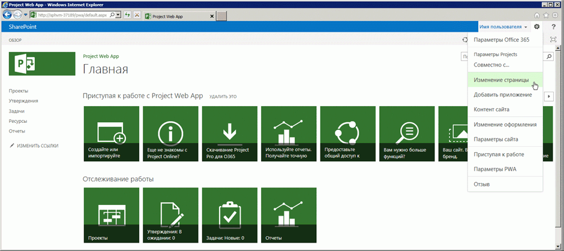
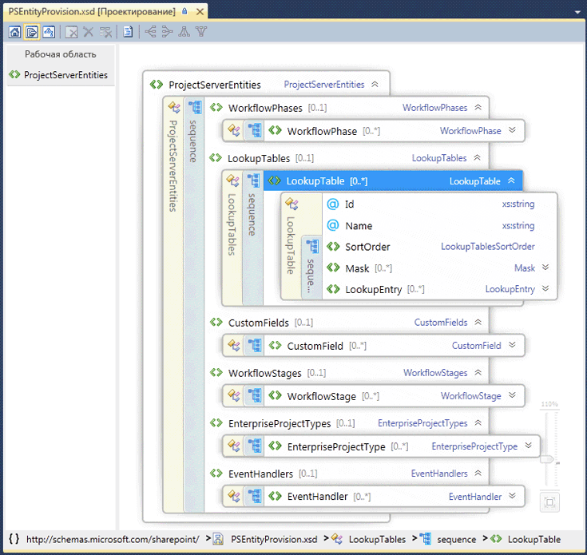

# Возможности программирования для Project ServerProject Server programmability

Узнайте о наиболее важных функциях программирования в Project Server 2013.Learn about the major programmability features in Project Server 2013. В этой статье содержатся сведения о переносе приложений, созданных для предыдущих версий Project Server.This article includes information about porting applications that were built for previous versions of Project Server.

Project Server 2013 предназначен для поддержки большинства приложений, которые были разработаны для Project Server 2010, и новых решений для разных платформ, в которых доступ к приложениям можно получать онлайн и из локальных экземпляров Project Server.Project Server 2013 is designed to support most applications that were developed for Project Server 2010 and new solutions for multiple platforms, where apps can access both online and on-premises Project Server installations. Для использования клиентской объектной модели (CSOM) или интерфейса Project Server интерфейс (PSI) необходимо изменить приложения и расширения, которые были разработаны для Project Server 2003 или более ранней версии.Applications and extensions that were developed for Project Server 2003 or earlier must be redesigned to use the client-side object model (CSOM) or the Project Server Interface (PSI). Приложения, которые были разработаны для Office Project Server 2007 или Project Server 2010, могут потребовать некоторых изменений и повторной компиляции для использования PSI. Чтобы использовать CSOM, эти приложения нужно изменить.Applications that were developed for Office Project Server 2007 or Project Server 2010 may require some changes and recompiling to use the PSI; to use the CSOM, those applications require a redesign.
  
Платформа Project Server позволяет программистам добиться высокой продуктивности за счет использования SharePoint Server 2013, .NET Framework 4 и протокола OData с CSOM.The Project Server platform enables high levels of programmer productivity by building on SharePoint Server 2013, .NET Framework 4, and the OData protocol with the CSOM. Разработчики могут расширить Project Web App с помощью приложений, частей приложений и веб-частей, определить рабочие процессы с помощью SharePoint Designer 2013 и принудительно применить бизнес-правила с помощью удаленных приемников событий Project Server.Developers can extend Project Web App with apps, app parts, and Web Parts, define workflows by using SharePoint Designer 2013, and enforce business rules by using remote event receivers for Project Server events.
  
## Project Server и SharePoint ServerProject Server and SharePoint Server

Приложение Project Web App создано на основе SharePoint Server 2013 и использует эталонные страницы и веб-части, что упрощает создание пользовательских приложений и решений Project Web App.Project Web App is built upon SharePoint Server 2013, and uses master pages and Web Parts to make it easier to build custom apps and Project Web App solutions. Project Server 2013 тесно интегрируется с SharePoint Server 2013 как платформа для совместной работы над проектом, отчетности, администрирования сайтов, безопасности и управления рабочими процессами.Project Server 2013 integrates deeply with SharePoint Server 2013 as the platform for project collaboration, reporting, site administration, security, and workflow management.
  
Сайты проектов включают дополнительные сведения и параметры совместной работы для участников группы, здесь можно добавить стандартные приложения, которые включают сводку по проекту, специальные списки SharePoint для задач с временной шкалой, отслеживание вопросов, риски, конечные результаты проекта и календарь группы, а также библиотеку документов и коллективные обсуждения.The project sites include more information and collaboration options for team members, where you can add default apps that include a project summary, specialized SharePoint lists for tasks with a timeline, tracking issues, risks, project deliverables, and the team calendar, along with the document library and team discussions. Пользовательские приложения для Project Server 2013 содержат расширения и предоставляют гибкие возможности для совместной работы участников группы.Custom apps for Project Server 2013 provide extensions and flexibility for team collaboration. Можно также настраивать приложения, добавляя их части с помощью того же механизма, который используется для добавления и изменения веб-частей при редактировании страницы.You can also add app parts to customize an app, by using the same mechanism to add and edit Web Parts when you edit a page. Вы можете разместить сайты проектов в любом месте фермы SharePoint, где установлен Project Server.You can locate project sites anywhere within the SharePoint farm where Project Server is installed. Чтобы использовать другие основные службы SharePoint Server 2013, например службы Excel и поиск в корпоративной среде, администратор может включить и настроить службы.To use other core services of SharePoint Server 2013, such as Excel Services and Enterprise Search, an administrator can enable and configure the services. 
  
Во время установки Project Server 2013 подготавливается приложение-служба Project на сайте веб-служб SharePoint.When you install Project Server 2013, you provision the Project Service Application in the SharePoint Web Services site. Приложение-служба Project содержит локальные службы Windows Communication Foundation (WCF) и веб-службы ASMX для PSI.The Project Service Application includes the local Windows Communication Foundation (WCF) services and ASMX web services for the PSI. Другие примеры приложений-служб: поиск SharePoint и управление документами SharePoint.Other examples of service applications include SharePoint Search and SharePoint Document Management. Дополнительные сведения см. в документации SharePoint Server 2013 для разработчиков.For more information, see the SharePoint Server 2013 developer documentation.
  
Приложение службы Project — это поставщик логической службы, которая может управлять несколькими экземплярами Project Web App.The Project Service Application is a logical service provider that can manage multiple instances of Project Web App. Во время подготовки Project Server создается определенный сайт Project Web App в веб-приложении SharePoint.Project Server provisioning creates a specific Project Web App site within a SharePoint web application. Домашняя страница Project Web App содержит ссылки на страницу центра проектов, страницу центра ресурсов и страницу центра бизнес-аналитики для отчетности, а также страницу, которая содержит список дополнительных стандартных приложений.The Home page of Project Web App contains links to the Project Center page, Resource Center page, and the Business Intelligence Center page for reporting, plus a page that contains a list of additional standard apps. На рис. 1 показана команда **Изменить страницу** в раскрывающемся списке **Параметры** на домашней странице Project Web App, где можно добавить или изменить веб-части.Figure 1 shows the **Edit Page** command in the **Setttings** drop-down list on the Home page of Project Web App, which allows you to add or edit Web Parts. 
  
> [!NOTE]
> Некоторые административные страницы в Project Web App, например страницу "Параметры PWA", изменить невозможно, на них не отображается команда **Изменить страницу**.Some administrative pages in Project Web App—such as the PWA Settings page—are not editable, and do not show the **Edit Page** command. Project Web App не позволяет редактировать страницы с помощью SharePoint Designer 2013.Project Web App does not allow you to edit pages by using SharePoint Designer 2013. Редактировать страницы на сайте проекта можно с помощью SharePoint Designer 2013.You can edit project site pages with SharePoint Designer 2013. 
  
**Рис. 1. Использование меню "Изменить страницу" в Project Web App****Figure 1. Using the Edit Page menu in Project Web App**

  
Чтобы получить доступ к странице "Параметры сайта" в Project Web App, выберите значок **Параметры** в правом верхнем углу страницы.To access the Site Settings page in Project Web App, choose the **Settings** icon in the top-right corner of the page. Страница "Параметры сайта" (`https://ServerName/ProjectServerName/_layouts/15/settings.aspx`) позволяет изменять внешний вид, функции и тему сайта, добавлять пользовательские веб-части, а также изменять или создавать эталонные страницы для сайтов проектов.The Site Settings page (  `https://ServerName/ProjectServerName/_layouts/15/settings.aspx`) enables changing the look and feel and the site theme, adding custom Web Parts, and modifying or creating master pages for project sites.
  
Настройка кода на ASPX-страницах и настройка эталонных страниц Project Web App с помощью SharePoint Designer 2013 не поддерживается.Customization of the code in ASPX pages, or customization of Project Web App master pages with SharePoint Designer 2013, is not supported. Настройка кода на страницах Project Web App может привести к проблемам с обновлениями Project Server и пакетов обновления.Customization of the code in Project Web App pages can cause problems with Project Server updates and service packs. 
  
### Настройка Project Web App с помощью пакетов SharePointCustomization of Project Web App with SharePoint packages

Так как Project Web App — это приложение SharePoint, а сайты проектов — это сайты SharePoint, можно добавлять пользовательские приложения, веб-части, обработчики событий, настраиваемые поля и другие функции с помощью пакетов SharePoint (файлов WSP) или приложений SharePoint (файлов SPAPP).Because Project Web App is a SharePoint application, and project sites are SharePoint sites, you can add custom apps, Web Parts, event handlers, custom fields, and other features by using SharePoint packages (.wsp files) or SharePoint apps (.spapp files). Пакет SharePoint или пакет приложения может содержать несколько сущностей Project Server, где определения сущности приведены в файле elements.xml из пакета.A SharePoint package or an app package can include multiple Project Server entities, where entity definitions are specified in an elements.xml file within the package.
  
Для использования Microsoft Project Online можно добавить кнопки на ленту Project Web App, но невозможно удалить или переименовать существующие кнопки продукта, как и создать новые вкладки ленты.For Project Online, you can add buttons to the Project Web App ribbon, but you can't remove or rename existing product buttons, and you can't create new ribbon tabs. Дополнительные сведения см. в статье [Выполнение пользовательских действий для развертывания приложений для SharePoint](https://docs.microsoft.com/sharepoint/dev/sp-add-ins/create-custom-actions-to-deploy-with-sharepoint-add-ins).For more information, see [Create custom actions to deploy with apps for SharePoint](https://docs.microsoft.com/sharepoint/dev/sp-add-ins/create-custom-actions-to-deploy-with-sharepoint-add-ins).
  
> [!CAUTION]
> При установке пакета SharePoint или пакета приложения типы сущностей Project Server должны появляться в порядке, заданном схемой PSEntityProvision.xsd, иначе проверка схемы пакета завершится неудачно, и установка не будет завершена.When you install a SharePoint package or an app package, the types of Project Server entities must appear in the order that the PSEntityProvision.xsd schema specifies or schema validation of the package fails and installation is not completed. 
  
Файл схемы PSEntityProvision.xsd доступен в загружаемом пакете SDK Project 2013 в подкаталоге `Documentation\Schemas\AppProvisioning`.The PSEntityProvision.xsd schema file is available in the Project 2013 SDK download, in the  `Documentation\Schemas\AppProvisioning` subdirectory. На рис. 2 показано представление проводника схемы XML в Visual Studio из схемы **PSEntityProvision**, где развернута последовательность **LookupTable**.Figure 2 shows the XML Schema Explorer view in Visual Studio of the **PSEntityProvision** schema, where the **LookupTable** sequence is expanded. 
  
**Рис. 2. Представление Visual Studio схемы подготовки сущностей Project Server****Figure 2. Visual Studio view of the Project Server entity provisioning schema**

  
Пакеты SharePoint, которые устанавливают компоненты для Project Server, могут содержать один или несколько файлов elements.xml, придерживающихся схемы **PSEntityProvision**. Сущности Project Server в одном XML-файле должны появляться в следующем порядке:SharePoint packages that install features for Project Server can contain one or more elements.xml files that follow the **PSEntityProvision** schema. The Project Server entities in a single XML file must appear in the following order: 
  
1. этапы рабочего процесса;Workflow phases
    
2. таблицы подстановки;Lookup tables
    
3. настраиваемые поля;Custom fields
    
4. стадии рабочего процесса;Workflow stages
    
5. типы корпоративных проектов;Enterprise project types
    
6. обработчики событий.Event handlers
    
При создании пакета SharePoint, содержащего сущности Project Server, возможно поместить определения сущностей в несколько файлов elements.xml. Каждый XML-файл может проходить проверку схемы, но сущности во всем пакете могут не находиться в правильном порядке. Например, сущность "настраиваемое поле" в первом XML-файле может ссылаться на таблицу подстановки во втором XML-файле. Во время установки это настраиваемое поле не удастся создать, поскольку еще не будет создана таблица подстановки.When you create a SharePoint package that contains Project Server entities, it is possible to put the entity definitions in multiple elements.xml files. Each XML file could pass the schema validation, but the entities in the whole package might not be in the correct order. For example, a custom field entity in the first XML file could refer to a lookup table in the second XML file. During installation, the custom field cannot be created because the lookup table has not yet been created.
  
Если установить пакет не удается, объекты, которые были созданы, остаются в Project Web App, но полная установка пакета не выполняется.If a package installation fails, objects that have been created remain in Project Web App, but the package does not install completely. Переустановка пакета может принести нужный результат, но впечатления клиентов при этом ухудшатся.Reinstalling the package can work, but that is not a good experience for customers. Если определения сущности охватывают несколько файлов elements.xml, нужно упорядочить сущности Project Server во всем пакете SharePoint, чтобы убедиться, что установка выполняется в правильном порядке.When the entity definitions span multiple elements.xml files, organize the Project Server entities in the entire SharePoint package to ensure that installation follows the correct order. С помощью схемы PSEntityProvision.xsd из загружаемого пакета SDK Project 2013 поддерживается разработка инструмента, который проверяет предписанный порядок сущностей в XML-файлах.With the PSEntityProvision.xsd schema in the Project 2013 SDK download, it is possible to develop a tool that checks for the prescribed order of entities in the XML files.
  
## Обновление приложений с помощью интерфейсов API Project ServerUpgrading applications with the Project Server APIs

При обновлении приложения, разработанного для предыдущей версии Project Server, можно использовать в качестве программного интерфейса, включающего методы для создания, чтения, обновления и удаления сущностей проекта (операции CRUD), либо CSOM, либо PSI. Хотя CSOM внутренним образом вызывает PSI, она полностью не заменяет все методы PSI. Сценарии и ограничения PSI и CSOM см. в статьях [What the PSI does and does not do](what-the-psi-does-and-does-not-do.md) и [What the CSOM does and does not do](what-the-csom-does-and-does-not-do.md).When you upgrade an application that was developed for a previous version of Project Server, you can choose to use either the CSOM or the PSI for a programmatic interface that includes methods to create, read, update, and delete project entities (the CRUD operations). Although the CSOM internally calls the PSI, it does not fully replace all PSI methods. For scenarios and limitations of the PSI and of the CSOM, see [What the PSI does and does not do](what-the-psi-does-and-does-not-do.md) and [What the CSOM does and does not do](what-the-csom-does-and-does-not-do.md).
  
> [!NOTE]
> Если CSOM включает необходимые вам функции, рекомендуем обновить приложения для использования CSOM.If the CSOM includes the functionality you require, we recommend that you upgrade applications to use the CSOM. CSOM позволяет использовать приложения, предназначенные для локальных и онлайновых экземпляров Project Server 2013.The CSOM enables applications to be used for both on-premises and online installations of Project Server 2013. 
  
Если ваше приложение главным образом считывает данные из Project Server, вы можете использовать представления и таблицы отчетов в базе данных Project Server для сценария локального развертывания.If your application primarily reads data from Project Server, you can use the reporting tables and views in the Project Server database for an on-premises scenario. Если вы планируете использовать приложение с Microsoft Project Online, можно использовать протокол OData для службы **ProjectData**, которая предоставляет доступ к локальным и онлайновым данным отчетов.If you intend to use the application with Project Online, you can use the OData protocol for the **ProjectData** service, which provides both on-premises and online access to the reporting data. Дополнительные сведения см. в статье [Справочник по службе ProjectData](https://docs.microsoft.com/previous-versions/office/project-odata/jj163015(v=office.15)).For more information, see [ProjectData - Project OData service reference](https://docs.microsoft.com/previous-versions/office/project-odata/jj163015(v=office.15))
  
### Использование PSIUsing the PSI

PSI поддерживает клиентские приложения с полным доверием, включая Project профессиональный 2013, Project Web App и бизнес-приложения, для доступа к данным Project Server в ферме SharePoint.The PSI enables full-trust client applications, including Project Professional 2013, Project Web App, and LOB applications, to access Project Server data within a SharePoint farm. PSI создан и используется с .NET Framework 4 и предоставляет такие преимущества, как хорошо знакомая среда разработки со встроенными средствами безопасности, обработкой ошибок и сбором мусора.The PSI is built and used with .NET Framework 4 and provides advantages such as a well-known development environment with built-in security, error handling, and garbage collection.
  
Доступ к PSI осуществляется с помощью служб WCF или веб-служб ASMX.The PSI is accessed through WCF services or ASMX web services. Интерфейс ASMX основан на WCF.The ASMX interface is based on WCF. Каждая служба PSI обычно содержит базовый класс с методами CRUD для элементов в пределах этого класса.Each PSI service typically contains a base class with CRUD methods for items within that class. Элементы определены с помощью связанных классов **DataSet**.Items are specified by related **DataSet** classes. Например, служба **CustomFields** содержит класс **CustomFields** с такими методами, как [CreateCustomFields2](https://docs.microsoft.com/previous-versions/office/ee767959(v=office.14)).For example, the **CustomFields** service contains the **CustomFields** class with methods such as [CreateCustomFields2](https://docs.microsoft.com/previous-versions/office/ee767959(v=office.14)) . Данные для одного или нескольких корпоративных настраиваемых полей указаны в **CustomFieldDataSet**.Data for one or more enterprise custom fields are specified in the **CustomFieldDataSet**.
  
> [!NOTE]
> Интерфейс PSI веб-служб ASMX не рекомендуется в Project Server 2013.The ASMX web services interface of the PSI is deprecated in Project Server 2013. Хотя интерфейс ASMX все еще доступен, в новых приложениях, использующих PSI, следует использовать интерфейс WCF или, если это возможно, CSOM вместо PSI.Although the ASMX interface is still available, new applications that use the PSI should use the WCF interface, or if possible, new applications should use the CSOM instead of the PSI. Для будущих версий Project Server понадобится обновить существующие приложения на базе ASMX, чтобы использовать интерфейс PSI WCF или CSOM.Future versions of Project Server will require an upgrade of existing ASMX-based applications to use the WCF interface of the PSI or to use the CSOM. 
  
Существует 22 общедоступные и задокументированные службы PSI, которые дублируются в интерфейсах WCF и ASMX.There are 22 public, documented PSI services, which are duplicated in the WCF interface and the ASMX interface. PSI включает также восемь закрытых, не задокументированных служб.The PSI also includes eight private, undocumented services. В Project Web App и Project профессиональный используются общедоступные и закрытые службы PSI.Project Web App and Project Professional use the public PSI services and the private PSI services. PSI обычно учитываются в соответствии с бизнес-объектами.The PSI is generally factored to match the business objects. Иными словами, каждый метод PSI связан с бизнес-объектом, примером которых может быть **Календарь** или **Ресурс**.That is, each PSI method is associated with a business object such as **Calendar** or **Resource**. PSI — это основной интерфейс для бизнес-объектов.The PSI is the primary interface to the business objects. Так как уровень бизнеса сдержит компоненты бизнес-логики для повторного использования, различные приложения, взаимодействующие с данными Project Server, используют одну и ту же бизнес-логику.Because the business layer provides reusable business logic components, different applications that interact with Project Server data use the same business logic.
  
Имена методов PSI, асинхронно взаимодействующих с Project Server, начинаются с **Queue**.PSI methods that asynchronously interact with Project Server have names that begin with **Queue**. Каждый метод PSI внедрен с отдельным интерфейсом, в котором используются данные, строго разделенные по типам.Each PSI method is implemented with a separate interface that uses strongly typed data. Например, метод **QueueCreateProject** в службе **Project** принимает параметр _dataset_ типа **ProjectDataSet**.For example, the **QueueCreateProject** method in the **Project** service accepts the  _dataset_ parameter of type **ProjectDataSet**. Класс **ProjectDataSet** — производный от типа **DataSet**.The **ProjectDataSet** class is derived from the **DataSet** type. Проверка типов в .NET Framework и IntelliSense в справке Visual Studio помогает уменьшить ошибки при разработке PSI.Type checking in the .NET Framework and IntelliSense completion in Visual Studio help to reduce errors in development with the PSI. Общие сведения с подробной справкой о пространстве имен, классах, методах, свойствах, событиях и связанных сборках PSI см. в статье [Общий справочник по Project PSI](project-psi-reference-overview.md).For an introduction to the detailed reference for PSI namespaces, classes, methods, properties, events, and related assemblies, see [Project PSI reference overview](project-psi-reference-overview.md).
  
В Project Server 2013 используется обработка исключений .NET Framework.Project Server 2013 uses the exception handling of the .NET Framework. Все ошибки записываются на сервере, в верхней части стека PSI.All errors are logged in the server, at the top of the PSI stack. Некоторые ошибки отправляют простой отчет клиенту, например объект **SoapException** для интерфейса ASMX или объект **FaultException** для интерфейса WCF.Some errors send a simple report to the client, such as a **SoapException** object for the ASMX interface or a **FaultException** object for the WCF interface. Исключения можно записывать в журнале событий приложения, а в случае некоторых ошибок записывается также подробный отчет на сервер в журналы трассировки единой службы ведения журналов (ULS).Exceptions can be recorded in the application event log, and some errors also record a detailed report on the server in the Unified Logging Service (ULS) trace logs. 
  
Для локальных приложений с полным доверием PSI также может расширяться. Можно добавить сборку .NET со службой, предоставляющей новую функциональность, использующей туже инфраструктуру безопасности Project Server и вызывающей другие методы PSI или наследующей от классов PSI. Расширение PSI может также предоставлять бизнес-логику и доступ к базе данных, которые необходимы для новой функциональности.For local full-trust applications, the PSI is also extensible. You can add a .NET assembly with a service that provides new functionality, uses the same Project Server security infrastructure, and calls other PSI methods or inherits from PSI classes. A PSI extension can also provide the business logic and database access required for new functionality.
  
### Использование CSOMUsing the CSOM

С помощью CSOM можно разрабатывать приложения, которые получают доступ к Microsoft Project Online или Project Server 2013 на локальных ресурсах.With the CSOM, you can develop apps that access Project Online or an on-premises Project Server 2013 installation. Приложения можно распространять через общедоступный Магазин Office или каталог частных приложений.Apps can be distributed in a public Office Store or a private app catalog. CSOM — это легкий в использовании интерфейс API, который непосредственно получает или предоставляет данные по имени с помощью запросов LINQ, а не путем передачи наборов данных и создания параметров _changeXml_ или _фильтра_ XML.The CSOM is designed to be an easy-to-use API that directly consumes or provides data by name with LINQ queries, rather than by passing datasets and constructing  _changeXml_ parameters or XML  _filter_ parameters. CSOM реализует основные функциональные возможности интерфейса Project Server (PSI) для основных сущностей, таких как **Project**, **Task**, **EnterpriseResource** и \*\* Assignment\*\*.The CSOM implements the main functionality of the Project Server Interface (PSI) for the primary entities such as **Project**, **Task**, **EnterpriseResource**, and **Assignment**. CSOM включает множество дополнительных сущностей, таких как **CustomField**, **LookupTable**, **WorkflowActivities**, **EventHandler** и **QueueJob**, которые поддерживают другие распространенные функциональные возможности Project Server.The CSOM includes many additional entities such as **CustomField**, **LookupTable**, **WorkflowActivities**, **EventHandler**, and **QueueJob**, which support other common Project Server functionality.
  
CSOM может использоваться путем копирования указанных ниже ресурсов на локальный компьютер разработки.The CSOM can be used by copying the following resources to your local development computer:
  
- Для разработки в .NET Framework 4 необходимо скопировать сборку `%ProgramFiles%\Common Files\Microsoft Shared\Web Server Extensions\15\ISAPI\Microsoft.ProjectServer.Client.dll`.For .NET Framework 4 development, copy the  `%ProgramFiles%\Common Files\Microsoft Shared\Web Server Extensions\15\ISAPI\Microsoft.ProjectServer.Client.dll` assembly. 
    
  Для получения документации о классах и членах CSOM см. пространство имен [Microsoft.ProjectServer.Client](https://docs.microsoft.com/previous-versions/office/dn529530(v=office.15)).For documentation of the CSOM classes and members, see the [Microsoft.ProjectServer.Client](https://docs.microsoft.com/previous-versions/office/dn529530(v=office.15)) namespace. Пример приложения см. в статье [Начало работы с CSOM и .NET](getting-started-with-the-project-server-csom-and-net.md).For an example application, see [Getting started with the CSOM and .NET](getting-started-with-the-project-server-csom-and-net.md).
    
- Для разработки в Microsoft Silverlight скопируйте сборку `%ProgramFiles%\Common Files\Microsoft Shared\Web Server Extensions\15\TEMPLATE\LAYOUTS\ClientBin\Microsoft.ProjectServer.Client.Silverlight.dll`.For Microsoft Silverlight development, copy the  `%ProgramFiles%\Common Files\Microsoft Shared\Web Server Extensions\15\TEMPLATE\LAYOUTS\ClientBin\Microsoft.ProjectServer.Client.Silverlight.dll` assembly. 
    
- Для разработки приложений для Windows Phone 8 скопируйте сборку `%ProgramFiles%\Common Files\Microsoft Shared\Web Server Extensions\15\TEMPLATE\LAYOUTS\ClientBin\Microsoft.ProjectServer.Client.Phone.dll`.To develop apps for Windows Phone 8, copy the  `%ProgramFiles%\Common Files\Microsoft Shared\Web Server Extensions\15\TEMPLATE\LAYOUTS\ClientBin\Microsoft.ProjectServer.Client.Phone.dll` assembly. 
    
- Чтобы использовать JavaScript для разработки веб-приложений и приложений для других устройств, скопируйте файлы `%ProgramFiles%\Common Files\Microsoft Shared\Web Server Extensions\15\TEMPLATE\LAYOUTS\PS.js` и `PS.debug.js`.To use JavaScript for developing web apps and apps for other devices, copy the  `%ProgramFiles%\Common Files\Microsoft Shared\Web Server Extensions\15\TEMPLATE\LAYOUTS\PS.js` file and the  `PS.debug.js` file. Пример веб-приложения см. в статье [Начало работы с объектной моделью JavaScript Project Server 2013](getting-started-with-the-project-server-2013-javascript-object-model.md).For an example web app, see [Getting started with the Project Server 2013 JavaScript object model](getting-started-with-the-project-server-2013-javascript-object-model.md).
    
CSOM выполняет внутренний вызов PSI, поэтому если PSI не сможет выполнить задание, CSOM тоже не сможет.The CSOM internally calls the PSI; therefore, if the PSI cannot do a job, neither can the CSOM. Ограничения CSOM см. в статьях [Какие задачи CSOM выполняет, а какие — нет](what-the-csom-does-and-does-not-do.md) и [Какие задачи PSI выполняет, а какие — нет](what-the-psi-does-and-does-not-do.md).For limitations of the CSOM, see [What the CSOM does and does not do](what-the-csom-does-and-does-not-do.md) and [What the PSI does and does not do](what-the-psi-does-and-does-not-do.md). Дополнительные сведения о разработке с помощью CSOM см. в статьях [Обновления для разработчиков решений в Project 2013](updates-for-developers-in-project-2013.md) и [Клиентская объектная модель (CSOM) для Project 2013](client-side-object-model-csom-for-project-2013.md).For more information about developing with the CSOM, see [Updates for developers in Project 2013](updates-for-developers-in-project-2013.md) and [Client-side object model (CSOM) for Project 2013](client-side-object-model-csom-for-project-2013.md).
  
### Перенос приложений, построенных для Project Server 2003Porting applications built for Project Server 2003

В Project Server 2003 многие данные и функциональные возможности доступны только с помощью Project Professional 2003 или путем прямого доступа к базе данных. PSI, появившийся в Project Server 2007, устраняет большую часть этих ограничений. В отличие от Project Data Service (PDS) в Project Server 2003, PSI и CSOM предоставляют полные интерфейсы к бизнес-объектам в Project Server.In Project Server 2003, much data and functionality is available only with Project Professional 2003 or by direct database access. The PSI, introduced in Project Server 2007, removes much of that restriction. Unlike the Project Data Service (PDS) in Project Server 2003, the PSI and the CSOM provide comprehensive interfaces to business objects in Project Server.
  
Приложения, разработанные для PDS несовместимы с последующими версиями Project Server. CSOM и PSI предоставляют функциональный эквивалент для PDS, но не соответствуют методам и параметрам PDS.Applications developed for the PDS are not compatible with later versions of Project Server. The CSOM and the PSI provide functional parity for the PDS, but do not match PDS methods or parameters.
  
> [!NOTE]
> Поскольку конструкции приложений PDS должны полностью перерабатываться для Project Server 2013, рекомендуется использовать CSOM.Because PDS applications must be completely redesigned for Project Server 2013, we recommend that you use the CSOM. 
  
Дополнительные сведения о совместимости PDS и рекомендации по переносу расширений PDS в PSI см. в статье [Четность PDS в веб-службах PSI](https://docs.microsoft.com/previous-versions/office/developer/office-2007/ms197081(v=office.12)).For more information about PDS compatibility and guidelines for porting PDS extensions to the PSI, see [PDS Parity in PSI Web Services](https://docs.microsoft.com/previous-versions/office/developer/office-2007/ms197081(v=office.12)).
  
### Перенос приложений, созданных для Project Server 2007 и Project Server 2010Porting applications built for Project Server 2007 and Project Server 2010

PSI в Project Server 2013 является подмножеством объектной модели PSI в Office Project Server 2007 и Project Server 2010.The PSI in Project Server 2013 is a superset of the PSI object model in Office Project Server 2007 and Project Server 2010. Многие приложения, созданные для двух предыдущих версий Project Server, продолжают работать на локальных экземплярах Project Server 2013 с полным доверием.Many applications built for the two previous versions of Project Server continue to work in local full-trust, on-premises installations of Project Server 2013. Тем не менее указанные ниже виды приложений необходимо обновить или изменить.However, the following kinds of applications require updates or redesign:
  
- Используйте CSOM для приложений, адаптированных для Microsoft Project Online.Use the CSOM for applications that are adapted for use with Project Online.
    
- Используйте CSOM для приложений, адаптированных для мобильных устройств и планшетных компьютеров.Use the CSOM for applications that are adapted for use on mobile devices and tablet computers.
    
- Используйте CSOM для приложений, доступных как приложения в Магазине Office или в частном каталоге приложений.Use the CSOM for applications that are available as apps in the Office Store or a private app catalog.
    
- Для приложений, изменяющих планирование проекта, используйте CSOM или применяйте метод PSI [QueueUpdateProject2](https://docs.microsoft.com/previous-versions/office/project-class/jj236245(v=office.15)) в самом приложении.For applications that modify project scheduling, use the CSOM, or change the application to use the [QueueUpdateProject2](https://docs.microsoft.com/previous-versions/office/project-class/jj236245(v=office.15)) PSI method. 
    
- В локальных или веб-приложениях, с помощью которых пользователи входят в разные экземпляры Project Web App, следует использовать программные параметры для конечных точек WCF CSOM или PSI.Local or web applications that log on users to different instances of Project Web App should use programmatic settings for WCF endpoints of the CSOM or the PSI. Эти методы устарели.The methods are deprecated. В приложениях следует использовать проверку подлинности OAuth вместо проверки подлинности форм, а также для Microsoft Project Online.Apps should use OAuth authentication in place of Forms authentication and for use with Project Online. Дополнительные сведения см. в статье [Авторизация и проверка подлинности приложений для SharePoint 2013](https://docs.microsoft.com/sharepoint/dev/sp-add-ins/authorization-and-authentication-of-sharepoint-add-ins).For more information, see [Authorization and authentication for apps in SharePoint 2013](https://docs.microsoft.com/sharepoint/dev/sp-add-ins/authorization-and-authentication-of-sharepoint-add-ins).
    
- Приложения, которые зависят от конкретных параметров безопасности Project Server или изменяют их.Applications that rely on or modify specific Project Server security settings.
    
  > [!NOTE]
  > По умолчанию на локальном сервере Project Server 2013 используется режим разрешений SharePoint, где параметры безопасности Project Server не доступны через PSI.A default on-premises installation of Project Server 2013 uses the SharePoint permission mode, where Project Server security settings are not accessible through the PSI. Сведения о переходе в режим разрешений Project см. в разделе *Режим разрешений SharePoint* статьи [Новые возможности для ИТ-специалистов в Project Server 2013](https://docs.microsoft.com/project/what-s-new-for-it-pros-in-project-server-2016).To change to the Project permission mode, see the  *SharePoint Permission Mode*  section in [What's new for IT pros in Project Server 2013](https://docs.microsoft.com/project/what-s-new-for-it-pros-in-project-server-2016). 
  
- Для многих пользовательских бизнес-процессов Project Server можно создавать декларативные бизнес-процессы с помощью SharePoint Designer 2013.For many custom Project Server workflows, you can use SharePoint Designer 2013 to create declarative workflows. Для пользовательских рабочих процессов, требующих дополнительного программирования, *не* следует непосредственно использовать классы или члены в пространстве имен **Microsoft.Office.Project.Server.Workflow**.For custom workflows that require additional programming, you should  *not*  directly use classes or members in the **Microsoft.Office.Project.Server.Workflow** namespace. Вместо этого используйте класс [Microsoft.ProjectServer.Client.WorkflowActivities](https://docs.microsoft.com/previous-versions/office/mt780562(v=office.15)) в CSOM.Instead, use the [Microsoft.ProjectServer.Client.WorkflowActivities](https://docs.microsoft.com/previous-versions/office/mt780562(v=office.15)) class in the CSOM. 
    
- Как правило, приложения, использующие олицетворение, следует переписывать для применения интерфейса PSI WCF.In general, applications that use impersonation should be rewritten to use the WCF interface of the PSI. Приложения, которые просто обновляют статус для других пользователей, не требуют олицетворения.Applications that do simple status updates for other users do not require impersonation. Они могут использовать метод [StatusAssignment.SubmitStatusUpdates](https://docs.microsoft.com/previous-versions/office/project-class/jj235883(v=office.15)) в CSOM или метод [Statusing.SubmitStatusForResource](https://docs.microsoft.com/previous-versions/office/ee755393(v=office.14)) в PSI.They can use the [StatusAssignment.SubmitStatusUpdates](https://docs.microsoft.com/previous-versions/office/project-class/jj235883(v=office.15)) method in the CSOM or the [Statusing.SubmitStatusForResource](https://docs.microsoft.com/previous-versions/office/ee755393(v=office.14)) method in the PSI. 
    
- Компоненты промежуточного слоя, которые выполняются на компьютере с Project Server, можно установить только для локального использования, в них нужно применять интерфейс PSI WCF.Middleware components that run on the Project Server computer can be installed only for on-premises use, and must use the WCF interface of the PSI. Например, компонент промежуточного слоя, который использует интерфейс ASMX для обмена данными между локальным Project Web App и внешним приложением расписания, придется переписать для применения интерфейса PSI WCF.For example, a middleware component that uses the ASMX interface to exchange data between Project Web App on-premises and an external timesheet application would have to be rewritten to use the WCF interface of the PSI. Для работы с Microsoft Project Online компонент необходимо изменить, сделав его приложением, и использовать CSOM.To work with Project Online, the component would have to be redesigned as an app and use the CSOM.
    
### Миграция и совместимость пользовательских решенийMigration and compatibility of custom solutions

Классы и члены общедоступных интерфейсов PSI ASMX и WCF идентичны.Classes and members in the public ASMX and WCF interfaces of the PSI are identical. Однако количество столбцов и размер таблиц данных, используемых или возвращаемых методами PSI в Project Server 2013, могут быть не такими, как в двух предыдущих версиях Project Server.But, the number of columns and size of datatables used or returned by PSI methods can be different between Project Server 2013 and the two previous Project Server versions. Кроме того, существуют отличия в таблицах отчетов и представлениях по сравнению с базой данных отчетов в предыдущих версиях.There are also differences in the reporting tables and views, compared with the Reporting database in previous versions.
  
> [!IMPORTANT]
> Мы настоятельно рекомендуем тщательно тестировать решения в тестовой установке Project Server 2013 перед их развертыванием на рабочем сервере.We strongly recommend that you thoroughly test solutions on a non-production installation of Project Server 2013 before deploying them to a production server. 
  
Если решение переносят на Project Server 2013 или если оно не работает должным образом, следует как минимум выполнить указанные ниже действия.When you migrate a solution to Project Server 2013, or if a solution does not work as expected, you should at a minimum do the following:
  
- Обновите решение, открыв его в Visual Studio 2012.Update the solution by opening it in Visual Studio 2012. Некоторые решения также могут использовать Visual Studio 2010.Some solutions can also use Visual Studio 2010.
    
- Измените целевой объект на .NET Framework 4.Change the target to .NET Framework 4.
    
- Измените ссылки на сборку, чтобы использовались сборки Project Server 2013, такие как Microsoft.Office.Project.Server.Library.dll и Microsoft.Office.Project.Server.Events.Receivers.dll.Change assembly references to use the Project Server 2013 assemblies, such as Microsoft.Office.Project.Server.Library.dll and Microsoft.Office.Project.Server.Events.Receivers.dll.
    
- Создайте список веб-ссылок ASMX или ссылок на службу WCF и имен пространства имен, а затем удалите ссылки Project Server.Make a list of the ASMX web references or the WCF service references and namespace names, and then delete the Project Server references.
    
- Добавьте сборку прокси-класса ProjectServerServices.dll, которую можно создать из исходных файлов прокси WCF в загружаемом пакете SDK Project 2013, или добавьте исходные файлы прокси для необходимых служб WCF.Add the ProjectServerServices.dll proxy assembly that you can build from the WCF proxy source files in the Project 2013 SDK download, or add the proxy source files for the required WCF services. Для служб ASMX добавьте ссылки на интерфейсные веб-службы ASMX еще раз, используя имена того же пространства имен, или добавьте сборку прокси-класса ProjectServerServices.dll, которую можно создать из источников WSDL в загружаемом пакете SDK Project 2013.For ASMX services, add the front-end ASMX web service references again, by using the same namespace names; or add the ProjectServerServices.dll proxy assembly that you can build from the WSDL sources in the Project 2013 SDK download.
    
  > [!NOTE]
  > В загружаемом пакете SDK Project 2013 все пространства имен в исходных файлах прокси начинаются с *Svc*.In the Project 2013 SDK download, the namespaces in the proxy source files all start with  *Svc*  . Например, пространство имен **Resource** в файлах прокси WCF и ASMX — **SvcResource**.For example, the **Resource** service namespace in the WCF proxy file and in the ASMX proxy file is **SvcResource**. > Если ваше приложение использует имена из другого пространства имен, вы можете или перекомпилировать сборку прокси-класса для использования вашего пространства имен или изменить пространства имен PSI в приложении.> If your application uses different namespace names, you can either recompile the proxy assembly to use your namespaces, or change the PSI namespaces in your application. Например, можно изменить скрипт CompileWCFProxyAssembly.cmd и перекомпилировать ProjectServerServices.dll из исходных файлов прокси, находящихся в загружаемом пакете SDK.For example, you can modify the CompileWCFProxyAssembly.cmd script and recompile ProjectServerServices.dll from the proxy source files in the SDK download. 
  
- При переходе от использования интерфейса ASMX PSI к интерфейсу WCF можно инициализировать клиентские классы либо программными средствами, либо с помощью конечных точек WCF в app.config. Применяйте инициализацию программными средствами, когда необходимо быстро переключиться на другие экземпляры Project Web App или когда разрабатывается веб-часть, использующая PSI.If you change from using the ASMX interface of the PSI to the WCF interface, you can initialize the client classes either programmatically or by using WCF endpoints in app.config. Use programmatic initialization when you have to quickly switch to different instances of Project Web App, or when you are developing a web part that uses the PSI.
    
- Существует несколько новых методов и наборов данных в службах PSI в Project Server 2013, некоторые классы **DataRow** содержат новые свойства.There are several new methods and datasets in the PSI services in Project Server 2013 and some **DataRow** classes contain new properties. Например, метод [QueueUpdateProject2](https://docs.microsoft.com/previous-versions/office/project-class/jj236245(v=office.15)) в PSI использует механизм планирования Project Server для повторного планирования обновленного проекта без необходимости открытия проекта в Project профессиональный 2013, а также позволяет добавлять или удалять сущности проекта в одном и том же вызове.For example, the [QueueUpdateProject2](https://docs.microsoft.com/previous-versions/office/project-class/jj236245(v=office.15)) method in the PSI uses the Project Server scheduling engine to reschedule an updated project without you having to open the project in Project Professional 2013, and also allows adding or deleting project entities in the same call. 
    
- Скомпилируйте и протестируйте решение.Compile and test the solution.
    
## Планирование проекта на сервереProject scheduling on the server

В Project Server 2013 два механизма планирования.Project Server 2013 has two scheduling engines. Более новый механизм планирования такой же, как и тот, что используется в Project профессиональный 2013.The newer scheduling engine is the same as the scheduling engine in Project Professional 2013. Если внести изменения в план и опубликовать их с помощью веб-части "Планирование" (на странице "Сведения о проекте") в Project Web App или на сайте проекта либо с помощью CSOM, вычисление значений даты, затрат, длительности, оставшихся трудозатрат, базовых показателей и другие изменения, связанные с планированием, будут такими же, как если бы вы внесли изменения и опубликовали проект с помощью Project профессиональный 2013.When you make scheduling changes and publish the changes by using the Scheduling web part (Project Details page) in Project Web App or a project site, or by using the CSOM, the calculation of dates, costs, duration, remaining work, baselines, and other changes related to scheduling are the same as if you made the changes and published the project by using Project Professional 2013. Тем не менее в методах PSI, за исключением [QueueUpdateProject2](https://docs.microsoft.com/previous-versions/office/project-class/jj236245(v=office.15)), используется более старый механизм планирования, перенесенный из Project Server 2010.However, except for the [QueueUpdateProject2](https://docs.microsoft.com/previous-versions/office/project-class/jj236245(v=office.15)) method, PSI methods use the older scheduling engine that was migrated from Project Server 2010. Причина в том, что поведение устаревших приложений в Project Server 2013 не должно измениться.The reason is to ensure that legacy applications behave the same in Project Server 2013 as they previously did. 
  
> [!NOTE]
> Для применения обновленного механизма планирования в Project Server 2013 приложения могут использовать CSOM.To use the updated scheduling engine in Project Server 2013, applications can use the CSOM. 
  
И старый, и новый механизмы планирования имеют перечисленные ниже ограничения.Both the older and the newer scheduling engines have the following limitations:
  
- **Планирование только одного проекта.** Планирование влияет только на текущий проект, когда изменения вносятся через обновления состояния задач с помощью PSI, CSOM или Project Web App.**Single project scheduling only** Scheduling affects only the current project, when changes are made through task status updates with the PSI or the CSOM, or with Project Web App. Если в текущем проекте есть ссылки на другие проекты, подпроекты или главные проекты, связанные проекты не меняются.If the current project has links to other projects, subprojects, or master projects, the linked projects are not changed. 
    
- **Суммарные задачи.** Суммарные задачи на Project Server обычно доступны только для чтения.**Summary tasks** Summary tasks are generally read-only on Project Server. Например, невозможно создать назначения для суммарных задач и изменить процент выполнения.For example, assignments for summary tasks cannot be created, and percent completion cannot be modified. Тем не менее Project Server поддерживает редактирование дат и длительности суммарных задач, запланированных вручную.However, Project Server does support editing the dates and duration of manually scheduled summary tasks. 
    
    Фактические данные в Project Server не добавляются в назначение суммарной задачи автоматически, поскольку таки образом обходился бы процесс утверждения в Project Server. При добавлении фактических данных в подзадачу в Project Professional эти фактические данные также добавляются для назначения в суммарную задачу. Эта разница в поведении может ввести пользователя в заблуждение.Actuals on Project Server are not added automatically to a summary task assignment, because that would bypass the approval process in Project Server. In Project Professional, when you add actuals to a subtask, the actuals are also added for an assignment on the summary task. The difference in behavior can be confusing for a user.
    
    Project Server удаляет фактические данные в назначении суммарной задачи, если сокращается длительность подзадачи или изменяется дата окончания.Project Server deletes actuals on a summary task assignment if the subtask duration shortens or the finish date is changed.
    
    > [!CAUTION]
    > Хотя Project Professional может это делать, рекомендуется не выполнять назначения в суммарных задачах.Although Project Professional can do it, we recommend that you do not make assignments on summary tasks. 
  
Далее приводятся проблемы и ограничения при программировании PSI с использованием старого механизма планирования Project Server.Following are issues and limitations of PSI programming with the older Project Server scheduling engine:
  
- **Изменение активного состояния задачи.** Старый механизм планирования Project Server может показывать несогласованное время начала или окончания при использовании метода [QueueUpdateProject](https://docs.microsoft.com/previous-versions/office/ms471014(v=office.14)) для изменения активного состояния задачи, если есть несколько изменений в объекте **ProjectDataSet** для параметра _dataset_.**Changing the active status of a task** The older Project Server scheduling engine can show inconsistent start or finish times when you use the [QueueUpdateProject](https://docs.microsoft.com/previous-versions/office/ms471014(v=office.14)) method to change the active status of a task, if there are multiple changes in the **ProjectDataSet** object for the  _dataset_ parameter. Если изменено только свойство **TASK_IS_ACTIVE** в параметре _dataset_ **QueueUpdateProject**, проект можно обновить.If the **TASK_IS_ACTIVE** property is the only change in the  _dataset_ parameter of **QueueUpdateProject**, you can update the project.
    
    Дополнительные сведения о неактивных задачах и старом механизме планирования см. в статьях блога [Общие сведения о неактивных задачах в Project 2010](https://blogs.msdn.com/b/project/archive/2010/06/10/introducing-inactive-tasks-in-project-2010.aspx) и [Project Server 2010: планирование в Интернете, PSI и Project профессиональный](https://blogs.msdn.com/b/brismith/archive/2010/09/10/project-server-2010-scheduling-on-the-web-the-psi-and-project-professional.aspx?wa=wsignin1.0).For more information about inactive tasks and the older scheduling engine, see the blog articles [Introducing inactive tasks in Project 2010](https://blogs.msdn.com/b/project/archive/2010/06/10/introducing-inactive-tasks-in-project-2010.aspx) and [Project Server 2010: Scheduling on the web, the PSI and Project Professional](https://blogs.msdn.com/b/brismith/archive/2010/09/10/project-server-2010-scheduling-on-the-web-the-psi-and-project-professional.aspx?wa=wsignin1.0). Сравнение планирования в Project профессиональный 2010 и Project Web App в Project Server 2010 см. на странице [Сравнение управления планированием через Интернет](https://blogs.msdn.microsoft.com/brismith/2010/09/10/project-server-2010-scheduling-on-the-web-the-psi-and-project-professional/).For a comparison of scheduling in Project Professional 2010 and Project Web App in Project Server 2010, see [Web-based schedule management comparison](https://blogs.msdn.microsoft.com/brismith/2010/09/10/project-server-2010-scheduling-on-the-web-the-psi-and-project-professional/).
    
- **Освоенный объем не вычисляется.** Старый механизм планирования не вычисляет поля освоенного объема: ФСВР, БПЗ, БСВР, БСЗР, ИОС, ОПС, ОПС%, РС, ИОКП, ОКП, ОКП%, ПЭВ, ОПЗ, Отклонение длительности, Отклонение начала, Отклонение окончания, Отклонение стоимости и Отклонение по трудозатратам.**Earned value not calculated** The older scheduling engine does not calculate the earned value fields: ACWP, BAC, BCWP, BCWS, CPI, CV, CV%, EAC, SPI, SV, SV%, TCPI, VAC, Duration Variance, Start Variance, Finish Variance, Cost Variance, and Work Variance. Если в проекте имеются значения для этих полей и проект обновляется с помощью метода **QueueUpdateProject**, значения полей не изменяются.If a project has values for these fields and the project is updated by using the **QueueUpdateProject** method, the field values do not change. Чтобы эта проблема не возникала, используйте метод **QueueUpdateProject2**.To avoid the problem, use the **QueueUpdateProject2** method. 
    
Ограничения планирования PSI можно обойти указанными ниже способами.You can handle the PSI scheduling limitations in the following ways:
  
- Если в CSOM имеются методы, необходимые для приложения, используйте CSOM вместо PSI.If the CSOM has the methods the application requires, use the CSOM instead of the PSI.
    
- Открывайте проекты в Project Professional и сохраняйте их обратно в Project Server.Open projects in Project Professional and save them back to Project Server.
    
- Не включайте в отчетах поля, которые PSI не обновляет.In reports, do not include fields that the PSI does not update.
    
- Добавляйте в отчеты примечание о данных, которые могут быть устаревшими.Add a note in reports about data that may be stale.
    
В таблицах отчетов и кубах имеются флаги, помогающие заметить, когда некоторые данные не обновляются. Данные отчетов в таблице MSP_EpmProject и в MSP_EpmProject_UserView содержат следующие поля.There are flags in the reporting tables and the cubes that help you detect when some project data is not updated. The reporting data in the MSP_EpmProject table and in MSP_EpmProject_UserView includes the following fields: 
  
-  _ProjectWbsIsStale_ указывает, не устарела ли структурная декомпозиция работ (иерархическая структура задач)._ProjectWbsIsStale_ &ndash; Indicates whether the work breakdown structure (task outline hierarchy) is stale. 
    
-  _ProjectEarnedValueIsStale_ указывает, что поля освоенного объема устарели._ProjectEarnedValueIsStale_ &ndash; Indicates the earned value fields are stale. 
    
-  _ProjectRollupsAreStale_ указывает, что в базе данных черновиков подпроект обновлен, а главный проект — нет._ProjectRollupsAreStale_ &ndash; Indicates that a subproject is updated in the draft database, but the master project is not updated. Сведенные значения из подпроекта устарели.The rolled-up values from the subproject are stale. 
    
-  _ProjectHierarchyNotSynchronized_ указывает, что главный проект не синхронизирован с дочерними._ProjectHierarchyNotSynchronized_ &ndash; The master project is not synchronized with its children. Это происходит, когда дочерние проекты публикуются явно, а не как часть публикации главного проекта.This happens when the child projects are published explicitly, not as part of the master project publishing. 
    
-  _ProjectCalculationsAreStale_ указывает, что Project профессиональный сохранил проект без вычисления плана (то есть для режима расчета на вкладке **План** в диалоговом окне **Параметры проекта** установлено значение **Вручную**)._ProjectCalculationsAreStale_ &ndash; Project Professional saved a project without calculating the schedule (that is, the calculation mode is set to **Manual** on the **Schedule** tab in the **Project Options** dialog box). 
    
-  _ProjectGhostTaskAreStale_ аналогичен _ProjectHierarchyNotSynchronized_, но предупреждает о данных связи между задачами проектов._ProjectGhostTaskAreStale_ &ndash; Similar to  _ProjectHierarchyNotSynchronized_, but warns on cross-project link data. Возможно, главный проект не существует, но данные проекта с одной стороны связи свежее, чем данные с другой стороны.It is possible that no master project exists, but the project data on one side of the link is newer than on the other side.
    
## О доступе к базе данных Project ServerAbout accessing the Project Server database

Если у вас есть разрешения Microsoft SQL Server для доступа к базе данных Project Server, вы можете считывать таблицы и представления отчетов.If you have permissions in Microsoft SQL Server to access the Project Server database, you can read the reporting tables and views. Если у вас есть необходимые разрешения Project Server, вы также можете считывать данные из таблиц отчетов с помощью запросов OData.If you have the necessary Project Server permissions, you can also read data from the reporting tables by using OData queries. Разработчикам настоятельно не рекомендуется выполнять прямой доступ к таблицам черновиков, опубликованным или архивным таблицам через запросы SQL Server в базу данных Project Server.Developers are strongly discouraged from directly accessing the draft, published, or archive tables through SQL Server queries in the Project Server database. Внесение прямых изменений в любую таблицу базы данных Project Server может привести к повреждению целостности данных и создать помехи для доступа к базе данных через службу очереди Project Server.Making direct changes in any of the tables in the Project Server database can damage referential integrity and interfere with database access through the Project Server Queuing Service.
  
> [!IMPORTANT]
> Ничто не препятствует использованию прямого программного доступа к базе данных для обновления данных. Следует помнить, что кэш, опубликованные таблицы и таблицы отчетов Project Professional зависят от протокола синхронизации кэша, который может быть поврежден в результате прямого изменения данных. Если вы повредили базу данных Project Server или испортили клиентские кэши Project Professional, используя прямой доступ для изменения данных, то техническая поддержка по продукту не сможет вам помочь!There is nothing to actively prevent you from using direct programmatic database access to update data. You should be aware that the Project Professional cache, the published tables, and the reporting tables all rely on a cache synchronization protocol that can be disrupted by direct data editing. If you damage your Project Server database or corrupt Project Professional client-side caches by using direct access to change data, be warned that product support won't be able to help! 
  
Приложения, которые напрямую получают доступ к таблицам и представлениям черновиков, опубликованным или архивным таблицам и представлениям, также зависят от схем базы данных, которые могут измениться в пакетах обновления или более поздних версиях Project Server 2013.Applications that directly access the draft, published, or archive tables and views are also dependent on the database schemas, which can change in service packs or later versions of Project Server 2013. Кроме того, приложения, которые непосредственно получают доступ к базам данных, теряют встроенные средства безопасности Project Server, общую бизнес-логику, отслеживание, аудит, проверку на ошибки, отчетность, рабочий процесс и другие функции.Applications that directly access the databases also lose the built-in Project Server security, common business logic, tracking, audits, error checking, reporting, workflow, and other features. Скорее всего, вам придется переписать такие приложения после обновления Project Server 2013.You would likely have to rewrite such an application after Project Server 2013 updates. 
  
По всем этим причинам Project профессиональный и Project Web App не выполняют прямые вызовы таблиц черновиков, опубликованных или архивных таблиц; это не должно делать никакое другое приложение, интегрированное с Project Server.For all of these reasons, Project Professional and Project Web App do not make direct calls to the draft, published, or archive tables; neither should any other application that integrates with Project Server.
  
Схемы для таблиц черновиков, опубликованных и архивных таблиц не задокументированы.The schemas for the draft, published, and archive tables are not documented. Таблицы отчетов упрощают создание отчетов, а схемы для таблиц и представлений отчетов задокументированы в загружаемом SDK Project 2013.You can use the reporting tables to help generate reports, and the schema for the reporting tables and views is documented in the Project 2013 SDK download. Для получения информации о схеме данных отчета OData см. статью [ProjectData — Справочник по службе Project OData](https://docs.microsoft.com/previous-versions/office/project-odata/jj163015(v=office.15)).For the OData schema of the reporting data, see [ProjectData - Project OData service reference](https://docs.microsoft.com/previous-versions/office/project-odata/jj163015(v=office.15)).
  
## См. такжеSee also

- [Обновления для разработчиков решений в Project 2013Updates for developers in Project 2013](updates-for-developers-in-project-2013.md)    
- [Архитектура Project Server 2013Project Server 2013 architecture](project-server-2013-architecture.md)    
- [Какие задачи PSI выполняет, а какие — нетWhat the PSI does and does not do](what-the-psi-does-and-does-not-do.md)   
- [Какие задачи CSOM выполняет, а какие — нетWhat the CSOM does and does not do](what-the-csom-does-and-does-not-do.md)    
- [Клиентская объектная модель (CSOM) для Project 2013Client-side object model (CSOM) for Project 2013](client-side-object-model-csom-for-project-2013.md)    
- [Начало разработки рабочих процессов Project ServerGetting started developing Project Server workflows](getting-started-developing-project-server-workflows.md)    
- [Руководства по программированию в Project 2013Project 2013 programming references](project-2013-programming-references.md)    
- [Обзор справочника по Project PSIProject PSI reference overview](project-psi-reference-overview.md)    
- [Выполнение пользовательских действий для развертывания приложений для SharePointCreate custom actions to deploy with apps for SharePoint](https://docs.microsoft.com/sharepoint/dev/sp-add-ins/create-custom-actions-to-deploy-with-sharepoint-add-ins)    
- [Общие сведения о неактивных задачах в Project 2010Introducing Inactive Tasks in Project 2010](https://blogs.msdn.com/b/project/archive/2010/06/10/introducing-inactive-tasks-in-project-2010.aspx)    
- [Project Server 2010: планирование в Интернете, PSI и Project профессиональныйProject Server 2010: Scheduling on the Web, the PSI and Project Professional](https://blogs.msdn.microsoft.com/brismith/2010/09/10/project-server-2010-scheduling-on-the-web-the-psi-and-project-professional/)

