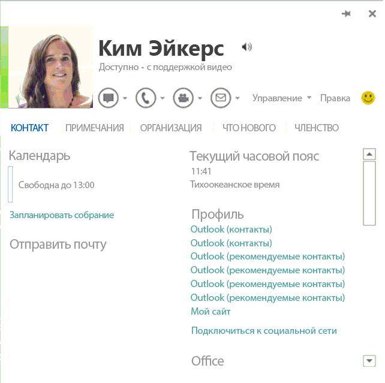

# <a name="integrating-im-applications-with-office"></a><span data-ttu-id="15eb5-103">Интеграция приложений для обмена мгновенными сообщениями с приложениями Office</span><span class="sxs-lookup"><span data-stu-id="15eb5-103">Integrating IM applications with Office</span></span>

<span data-ttu-id="15eb5-104">В этой статье описано, как настроить клиентское приложение для обмена мгновенными сообщениями так, чтобы интегрировать его с социальными функциями в Office 2013, Office 2016, Office 2019, и Office 365, включая отображение сведений о присутствии и отправку мгновенных сообщений из карточки контакта.</span><span class="sxs-lookup"><span data-stu-id="15eb5-104">This article describes how to configure an instant message (IM) client application so that it integrates with the social features in Office 2013, Office 2016, Office 2019, and Office 365, including displaying presence and sending instant messages from the contact card.</span></span>
  
## <a name="introduction"></a><span data-ttu-id="15eb5-105">Введение</span><span class="sxs-lookup"><span data-stu-id="15eb5-105">Introduction</span></span>
<span data-ttu-id="15eb5-106"><a name="off15_IMIntegration_Intro"> </a></span><span class="sxs-lookup"><span data-stu-id="15eb5-106"><a name="off15_IMIntegration_Intro"> </a></span></span>

<span data-ttu-id="15eb5-107">Office 2013 (и более поздние версии) располагает широкими возможностями интеграции с клиентскими приложениями для обмена мгновенными сообщениями, включая Lync 2013 и Teams.</span><span class="sxs-lookup"><span data-stu-id="15eb5-107">Office 2013 (and later versions) provides rich integration with IM client applications, including Lync 2013 and Teams.</span></span> <span data-ttu-id="15eb5-108">Такая интеграция позволяет пользователям обмениваться мгновенными сообщениями из Word, Excel, PowerPoint, Outlook, Visio, Project и OneNote, а также обеспечивает интеграцию сведений о присутствии на страницах SharePoint.</span><span class="sxs-lookup"><span data-stu-id="15eb5-108">This integration provides users with IM capabilities from within Word, Excel, PowerPoint, Outlook, Visio, Project, and OneNote as well as providing presence integration on SharePoint pages.</span></span> <span data-ttu-id="15eb5-109">Пользователи могут просматривать фотографию, имя, состояние присутствия и контактные данные людей в своем списке контактов.</span><span class="sxs-lookup"><span data-stu-id="15eb5-109">Users can see the photo, name, presence status, and contact data for people in their contacts list.</span></span> <span data-ttu-id="15eb5-110">Можно начать сеанс обмена мгновенными сообщениями, видеозвонок или телефонный звонок прямо из карточки контакта (элемент пользовательского интерфейса в Office, содержащий контактную информацию и опции взаимодействия).</span><span class="sxs-lookup"><span data-stu-id="15eb5-110">They can start an IM session, video call, or phone call directly from the contact card (the UI element in Office that surfaces contact information and communication options).</span></span> <span data-ttu-id="15eb5-111">Office позволяет легко поддерживать связь с пользователями из списка контактов, не откладывая работу с электронной почтой и документами.</span><span class="sxs-lookup"><span data-stu-id="15eb5-111">Office makes it easy to stay connected to your contacts without taking you outside of your email or documents.</span></span> 
  
> [!NOTE]
> <span data-ttu-id="15eb5-112">В этой статье используется термин "клиентское приложение для обмена мгновенными сообщениями", означающий конкретное приложение, установленное на компьютере пользователя, которое осуществляет взаимодействие со службой обмена мгновенными сообщениями.</span><span class="sxs-lookup"><span data-stu-id="15eb5-112">This article uses the term IM client application to refer specifically to the application installed on a user's computer that communicates to the IM service.</span></span> <span data-ttu-id="15eb5-113">Например приложение Lync 2013 и Teams считаются клиентскими приложениями для обмена мгновенными сообщениями.</span><span class="sxs-lookup"><span data-stu-id="15eb5-113">For example, Lync 2013 and Teams are considered an IM client applications.</span></span> <span data-ttu-id="15eb5-114">В этой статье не приводятся подробные сведения о том, как клиентское приложение для обмена мгновенными сообщениями взаимодействует со службой обмена мгновенными сообщениями, а также о самой службе обмена мгновенными сообщениями.</span><span class="sxs-lookup"><span data-stu-id="15eb5-114">This article does not provide details about how the IM client application communicates to the IM service or about the IM service itself.</span></span> 
  
<span data-ttu-id="15eb5-115">Вы можете настраивать клиентское приложение для обмена мгновенными сообщениями таким образом, чтобы оно осуществляло взаимодействие с Office.</span><span class="sxs-lookup"><span data-stu-id="15eb5-115">You can customize an IM client application so that it communicates with Office.</span></span> <span data-ttu-id="15eb5-116">В частности вы можете внести изменения в свое приложение для обмена мгновенными сообщениями так, чтобы оно отображало приведенные ниже сведения в пользовательском интерфейсе Office:</span><span class="sxs-lookup"><span data-stu-id="15eb5-116">Specifically, you can modify your IM application so that it displays the following information within the Office UI:</span></span>
  
- <span data-ttu-id="15eb5-117">фотография контакта;</span><span class="sxs-lookup"><span data-stu-id="15eb5-117">Contact photo.</span></span>
    
- <span data-ttu-id="15eb5-118">имя контакта;</span><span class="sxs-lookup"><span data-stu-id="15eb5-118">Contact name.</span></span>
    
- <span data-ttu-id="15eb5-119">примечание о личном статусе контакта;</span><span class="sxs-lookup"><span data-stu-id="15eb5-119">Contact personal status note.</span></span>
    
- <span data-ttu-id="15eb5-120">состояние присутствия контакта;</span><span class="sxs-lookup"><span data-stu-id="15eb5-120">Contact presence status.</span></span>
    
- <span data-ttu-id="15eb5-121">строка доступности контакта (например, "Доступен" или "Нет на месте");</span><span class="sxs-lookup"><span data-stu-id="15eb5-121">Contact availability string (for example, "Available" or "Out of Office").</span></span>
    
- <span data-ttu-id="15eb5-122">строка возможностей контакта (например, "Видео готово");</span><span class="sxs-lookup"><span data-stu-id="15eb5-122">Contact capability string (for example, "Video Ready").</span></span>
    
- <span data-ttu-id="15eb5-123">запуск обмена мгновенными сообщениями одним щелчком;</span><span class="sxs-lookup"><span data-stu-id="15eb5-123">One-click IM launch.</span></span>
    
- <span data-ttu-id="15eb5-124">запуск видеозвонка одним щелчком;</span><span class="sxs-lookup"><span data-stu-id="15eb5-124">One-click video call launch.</span></span>
    
- <span data-ttu-id="15eb5-125">запуск телефонного звонка одним щелчком (в том числе SIP, номер телефона, голосовая почта и звонок на новый номер);</span><span class="sxs-lookup"><span data-stu-id="15eb5-125">One-click phone call launch (including SIP, phone number, voice mail, and call new number).</span></span>
    
- <span data-ttu-id="15eb5-126">управление контактами (добавление в группу обмена мгновенными сообщениями);</span><span class="sxs-lookup"><span data-stu-id="15eb5-126">Contact management (add to IM group).</span></span>
    
- <span data-ttu-id="15eb5-127">местонахождение контакта и часовой пояс;</span><span class="sxs-lookup"><span data-stu-id="15eb5-127">Contact location and time zone.</span></span>
    
- <span data-ttu-id="15eb5-128">данные контакта, номер телефона, адрес электронной почты, должность и название компании.</span><span class="sxs-lookup"><span data-stu-id="15eb5-128">Contact data, phone number, email address, title, and company name.</span></span>
    
<span data-ttu-id="15eb5-129">**Рис. 1. Карточка контакта в Office 2013**</span><span class="sxs-lookup"><span data-stu-id="15eb5-129">**Figure 1. Contact card in Office 2013**</span></span>

<span data-ttu-id="15eb5-130"></span><span class="sxs-lookup"><span data-stu-id="15eb5-130"></span></span>
  
<span data-ttu-id="15eb5-131">Чтобы сделать возможной такую интеграцию с Office, в клиентском приложении для обмена мгновенными сообщениями должен быть реализован набор интерфейсов, предоставляемых Office для подключения к нему.</span><span class="sxs-lookup"><span data-stu-id="15eb5-131">To enable this integration with Office, an IM client application must implement a set of interfaces that Office provides to connect to it.</span></span> <span data-ttu-id="15eb5-132">API для такой интеграции включены в пространство имен [UCCollborationLib](https://docs.microsoft.com/previous-versions/office/communications/ff398475(v=ocs.14)), которое содержится в файле Microsoft.Office.UC.dll, установленном вместе с версиями Office 2013, которые включают Lync / Skype для бизнеса.</span><span class="sxs-lookup"><span data-stu-id="15eb5-132">The APIs for this integration are included in the [UCCollborationLib](https://docs.microsoft.com/previous-versions/office/communications/ff398475(v=ocs.14)) namespace that is contained in the Microsoft.Office.UC.dll file, which is installed with versions of Office 2013 that include Lync / Skype for Business.</span></span> <span data-ttu-id="15eb5-133">Пространство имен **UCCollaborationLib** включает интерфейсы, которые следует реализовать для интеграции с Office.</span><span class="sxs-lookup"><span data-stu-id="15eb5-133">The **UCCollaborationLib** namespace includes the interfaces that you must implement to integrate with Office.</span></span> 
  
> [!IMPORTANT] 
> <span data-ttu-id="15eb5-134">Библиотека типов обязательных интерфейсов встроена в Lync 2013 / Skype для бизнеса.</span><span class="sxs-lookup"><span data-stu-id="15eb5-134">The type library for the required interfaces is embedded in Lync 2013/Skype for Business.</span></span> <span data-ttu-id="15eb5-135">Для сторонних интеграторов это применимо только в том случае, если и Lync 2013, и Skype для бизнеса установлены на целевой компьютер.</span><span class="sxs-lookup"><span data-stu-id="15eb5-135">For third-party integrators, this works only when both Lync 2013 and Skype for Business are installed on the target machine.</span></span> <span data-ttu-id="15eb5-136">Если вы выполняете интеграцию, используя Office стандартный, вам потребуется извлечь библиотеку типов и установить ее на целевой компьютер.</span><span class="sxs-lookup"><span data-stu-id="15eb5-136">If you are integrating using Office Standard, you need to extract the type library and install it on the target machine.</span></span> <span data-ttu-id="15eb5-137">[Lync 2013 SDK](https://www.microsoft.com/download/details.aspx?id=36824) включает файл Microsoft.Office.UC.dll.</span><span class="sxs-lookup"><span data-stu-id="15eb5-137">The [Lync 2013 SDK](https://www.microsoft.com/download/details.aspx?id=36824) includes the Microsoft.Office.UC.dll file.</span></span> 
  
> [!NOTE]
>  <span data-ttu-id="15eb5-138">Некоторые приложения Office 2010 могут подобным образом интегрироваться со сторонним приложением для обмена мгновенными сообщениями: Outlook 2010, Word 2010, Excel 2010, PowerPoint 2010 и SharePoint Server 2010 (используя элемент ActiveX).</span><span class="sxs-lookup"><span data-stu-id="15eb5-138">A handful of Office 2010 applications can integrate similarly with a third-party IM provider application: Outlook 2010, Word 2010, Excel 2010, PowerPoint 2010, and SharePoint Server 2010 (using an ActiveX control).</span></span> <span data-ttu-id="15eb5-139">Многие действия, необходимые для интеграции с Office 2013, также применимы к Office 2010.</span><span class="sxs-lookup"><span data-stu-id="15eb5-139">Many of the steps required for integration with Office 2013 apply to Office 2010 as well.</span></span> <span data-ttu-id="15eb5-140">Есть несколько важных различий в том, как Office 2010 интегрируется с приложением для обмена мгновенными сообщениями.</span><span class="sxs-lookup"><span data-stu-id="15eb5-140">There are several key differences in how Office 2010 integrates with an IM provider application:</span></span> 
>  - <span data-ttu-id="15eb5-141">В Office 2010 фото контакта не отображается.</span><span class="sxs-lookup"><span data-stu-id="15eb5-141">Office 2010 does not display the contact's photo.</span></span> 
>  - <span data-ttu-id="15eb5-142">Необходимо скачать файл Microsoft.Office.Uc.dll отдельно от Office 2010.</span><span class="sxs-lookup"><span data-stu-id="15eb5-142">You must download the Microsoft.Office.Uc.dll file separately from Office 2010.</span></span> <span data-ttu-id="15eb5-143">[Lync 2010 SDK](https://www.microsoft.com/en-us/download/details.aspx?id=18898) включает файл Microsoft.Office.UC.dll для Office 2010.</span><span class="sxs-lookup"><span data-stu-id="15eb5-143">The [Lync 2010 SDK](https://www.microsoft.com/en-us/download/details.aspx?id=18898) includes the Microsoft.Office.UC.dll file for Office 2010.</span></span> 
>  - <span data-ttu-id="15eb5-144">Когда приложение Office вызывает метод [IUCOfficeIntegration.GetAuthenticationInfo](integrating-im-applications-with-office.md#off15_IMIntegration_ImplementRequired_IUCOfficeIntegration) в клиентском приложении для обмена мгновенными сообщениями, оно передает строку "14.0.0.0".</span><span class="sxs-lookup"><span data-stu-id="15eb5-144">When the Office application calls the [IUCOfficeIntegration.GetAuthenticationInfo](integrating-im-applications-with-office.md#off15_IMIntegration_ImplementRequired_IUCOfficeIntegration) method on the IM client application, it passes in the string "14.0.0.0".</span></span> 
>  - <span data-ttu-id="15eb5-145">Office 2010 перечисляет все группы и контакты, как только устанавливает подключение к клиентскому приложению для обмена мгновенными сообщениями.</span><span class="sxs-lookup"><span data-stu-id="15eb5-145">Office 2010 enumerates all groups and contacts as soon as it connects to an IM client application.</span></span> 
  
## <a name="how-office-integrates-with-an-im-client-application"></a><span data-ttu-id="15eb5-146">Как выполняется интеграция Office с клиентским приложением для обмена мгновенными сообщениями</span><span class="sxs-lookup"><span data-stu-id="15eb5-146">How Office integrates with an IM client application</span></span>
<span data-ttu-id="15eb5-147"><a name="off15_IMIntegration_How"> </a></span><span class="sxs-lookup"><span data-stu-id="15eb5-147"><a name="off15_IMIntegration_How"> </a></span></span>

<span data-ttu-id="15eb5-148">При запуске приложения Office 2013 (или более поздних версий) выполняется указанный ниже порядок действий для интеграции с клиентским приложением для обмена мгновенными сообщениями по умолчанию.</span><span class="sxs-lookup"><span data-stu-id="15eb5-148">When an Office 2013 (or higher) application starts, it goes through the following process to integrate with the default IM client application:</span></span>
  
1. <span data-ttu-id="15eb5-149">Оно выполняет проверку реестра для обнаружения клиентского приложения для обмена мгновенными сообщениями по умолчанию, а затем подключается к нему.</span><span class="sxs-lookup"><span data-stu-id="15eb5-149">It checks the registry to discover the default IM client application and then connects to it.</span></span>
    
2. <span data-ttu-id="15eb5-150">Оно выполняете проверку подлинности с помощью клиентского приложения для обмена мгновенными сообщениями.</span><span class="sxs-lookup"><span data-stu-id="15eb5-150">It authenticates with the IM client application.</span></span>
    
3. <span data-ttu-id="15eb5-151">Оно подключается к определенным интерфейсам, которые отображаются клиентским приложением для обмена мгновенными сообщениями.</span><span class="sxs-lookup"><span data-stu-id="15eb5-151">It connects to specific interfaces that are exposed by the IM client application.</span></span>
    
4. <span data-ttu-id="15eb5-152">Оно определяет возможности пользователя, который в настоящий момент выполнил вход в систему (локальный пользователь), включая получение контактов пользователя, определение сведений о присутствии пользователя и определение возможностей пользователя в отношении обмена мгновенными сообщениями (обмен мгновенными сообщениями, видеочат, VOIP и т. д.).</span><span class="sxs-lookup"><span data-stu-id="15eb5-152">It determines the capabilities of the currently signed-in user (local user), including getting the user's contacts, determining the user's presence, and determining the user's IM capabilities (instant messaging, video chat, VOIP, and so on).</span></span>
    
5. <span data-ttu-id="15eb5-153">Оно получает сведения о присутствии для контактов локального пользователя.</span><span class="sxs-lookup"><span data-stu-id="15eb5-153">It gets presence information for the local user's contacts.</span></span>
    
6. <span data-ttu-id="15eb5-154">Когда клиентское приложение для обмена мгновенными сообщениями завершает работу, приложение Office отключается без уведомления.</span><span class="sxs-lookup"><span data-stu-id="15eb5-154">When the IM client application shuts down, the Office application silently disconnects.</span></span>
    
### <a name="discovering-the-im-application"></a><span data-ttu-id="15eb5-155">Обнаружение приложения для обмена мгновенными сообщениями</span><span class="sxs-lookup"><span data-stu-id="15eb5-155">Discovering the IM application</span></span>

<span data-ttu-id="15eb5-156">Приложение Office выполняет поиск нескольких определенных разделов и записей в реестре, чтобы обнаружить клиентское приложение для обмена мгновенными сообщениями по умолчанию.</span><span class="sxs-lookup"><span data-stu-id="15eb5-156">The Office application looks for several specific keys and entries in the registry to discover the default IM client application.</span></span> <span data-ttu-id="15eb5-157">Если оно находит клиентское приложение для обмена мгновенными сообщениями по умолчанию, выполняет попытку подключиться к нему.</span><span class="sxs-lookup"><span data-stu-id="15eb5-157">If it discovers a default IM client application, it then attempts to connect to it.</span></span>
  
<span data-ttu-id="15eb5-158">Порядок действий, которые выполняет приложение Office, чтобы обнаружить клиентское приложение для обмена мгновенными сообщениями по умолчанию, приводится ниже.</span><span class="sxs-lookup"><span data-stu-id="15eb5-158">The process that the Office application goes through to discover the default IM client application is as follows:</span></span>
  
1. <span data-ttu-id="15eb5-159">Приложение Office выполняет поиск, чтобы выяснить, задан ли подраздел HKEY_CURRENT_USER\Software\IM Providers\DefaultIMApp в реестре и считывает ли он имя приложения, указанное в нем.</span><span class="sxs-lookup"><span data-stu-id="15eb5-159">The Office application looks to see if the HKEY_CURRENT_USER\Software\IM Providers\DefaultIMApp subkey in the registry is set and reads the application name listed there.</span></span>
    
2. <span data-ttu-id="15eb5-160">Затем приложение Office считывает раздел HKEY_CURRENT_USER\Software\IM Providers\ _Имя приложения_\UpAndRunning и отслеживает значение на предмет изменений.</span><span class="sxs-lookup"><span data-stu-id="15eb5-160">The Office application then reads the HKEY_CURRENT_USER\Software\IM Providers\ _Application name_\UpAndRunning key and monitors the value for changes.</span></span>
    
3. <span data-ttu-id="15eb5-161">Затем приложение Office считывает раздел реестра HKEY_LOCAL_MACHINE\Software\IM Providers\ _Имя приложения_ и получает значения ProcessName и идентификатор класса (CLSID), хранящиеся в нем.</span><span class="sxs-lookup"><span data-stu-id="15eb5-161">The Office application next reads the HKEY_LOCAL_MACHINE\Software\IM Providers\ _Application name_ registry key and gets the ProcessName and class ID (CLSID) values stored there.</span></span> 
    
4. <span data-ttu-id="15eb5-162">После того как клиентское приложение для обмена мгновенными сообщениями успешно завершит последовательность запуска и правильно зарегистрирует все классы для интеграции сведений о присутствии, оно задает для раздела HKEY_CURRENT_USER\Software\IM Providers\ _Имя приложения_\ UpAndRunning значение "2", указывая, что клиентское приложение выполняется.</span><span class="sxs-lookup"><span data-stu-id="15eb5-162">Once the IM client application has completed its start sequence successfully and registered all of the classes correctly for the presence integration, it sets the HKEY_CURRENT_USER\Software\IM Providers\ _Application name_\UpAndRunning key to "2", indicating that the client application is running.</span></span>
    
5. <span data-ttu-id="15eb5-163">Когда приложение Office обнаруживает, что для раздела HKEY_CURRENT_USER\Software\IM Providers\ _Имя приложения_\UpAndRunning задано значение "2", оно проверяет список выполняемых процессов на компьютере для выявления имени процесса клиентского приложения для обмена мгновенными сообщениями.</span><span class="sxs-lookup"><span data-stu-id="15eb5-163">When the Office application discovers that the HKEY_CURRENT_USER\Software\IM Providers\ _Application name_\UpAndRunning key has been set to "2", it checks the list of running processes on the computer for the process name of the IM client application.</span></span>
    
6. <span data-ttu-id="15eb5-164">После того как приложение Office находит процесс, используемый клиентским приложением для обмена мгновенными сообщениями, оно вызывает **CoCreateInstance**, используя CLSID для установления подключения к клиентскому приложению для обмена мгновенными сообщениями, как внепроцессный сервер COM.</span><span class="sxs-lookup"><span data-stu-id="15eb5-164">Once the Office application finds the process that the IM client application uses, the Office application calls **CoCreateInstance** using the CLSID to establish a connection to the IM client application as an out-of-process COM server.</span></span> 
    
### <a name="authenticating-the-connection-to-the-im-application"></a><span data-ttu-id="15eb5-165">Аутентификация подключения к приложению для обмена мгновенными сообщениями</span><span class="sxs-lookup"><span data-stu-id="15eb5-165">Authenticating the connection to the IM application</span></span>

<span data-ttu-id="15eb5-166">После того как приложение Office установит подключение к клиентскому приложению для обмена мгновенными сообщениями, оно выполняет указанные ниже действия.</span><span class="sxs-lookup"><span data-stu-id="15eb5-166">After the Office application establishes a connection to the IM client application, it then does the following:</span></span>
  
1. <span data-ttu-id="15eb5-167">Приложение Office вызывает метод [IUnknown::QueryInterface](https://msdn.microsoft.com/library/ms682521%28v=VS.85%29.aspx) для выявления интерфейса [IUCOfficeIntegration](integrating-im-applications-with-office.md#off15_IMIntegration_ImplementRequired_IUCOfficeIntegration).</span><span class="sxs-lookup"><span data-stu-id="15eb5-167">The Office application calls [IUnknown::QueryInterface](https://msdn.microsoft.com/library/ms682521%28v=VS.85%29.aspx) method to check for the [IUCOfficeIntegration](integrating-im-applications-with-office.md#off15_IMIntegration_ImplementRequired_IUCOfficeIntegration) interface.</span></span> 
    
2. <span data-ttu-id="15eb5-168">Затем приложение Office вызывает метод **IUCOfficeIntegration.GetAuthenticationInfo**, передавая самую последнюю поддерживаемую версию интеграции (например, "15.0.0.0").</span><span class="sxs-lookup"><span data-stu-id="15eb5-168">The Office application then calls the **IUCOfficeIntegration.GetAuthenticationInfo** method, passing in the highest supported integration version (for example, "15.0.0.0").</span></span> 
    
3. <span data-ttu-id="15eb5-169">Если клиентское приложение для обмена мгновенными сообщениями поддерживает версию, переданную приложением Office в качестве параметра, приложение возвращает следующую жестко заданную строку XML коду вызова:</span><span class="sxs-lookup"><span data-stu-id="15eb5-169">If the IM client application supports the version of Office passed in as a parameter, the application returns the following hard-coded XML string to the calling code:</span></span>
    
    `<authenticationinfo>`
    
   > [!NOTE]
   > <span data-ttu-id="15eb5-170">По причине возможного устаревания клиентское приложение для обмена мгновенными сообщениями должно вернуть точное значение `<authenticationinfo>` для вызова **GetAuthenticationInfo**, если оно поддерживает версию Office, переданную в качестве параметра.</span><span class="sxs-lookup"><span data-stu-id="15eb5-170">For legacy reasons, the IM client application must return the exact value  `<authenticationinfo>` to the call to **GetAuthenticationInfo** if it supports the version of Office passed in as a parameter.</span></span> 
  
4. <span data-ttu-id="15eb5-171">Если клиентское приложение для обмена мгновенными сообщениями не может вернуть значение, приложение Office вызывает метод **GetAuthenticationInfo** снова, используя следующую наиболее актуальную версию Office (например, "14.0.0.0").</span><span class="sxs-lookup"><span data-stu-id="15eb5-171">If the IM client application fails to return a value, the Office application calls the **GetAuthenticationInfo** method again with the next highest supported version of Office (for example, "14.0.0.0").</span></span> 
    
5. <span data-ttu-id="15eb5-172">После того как приложение Office определяет, что клиентское приложение для обмена мгновенными сообщениями поддерживает интеграцию обмена мгновенными сообщениями и сведений о присутствии, оно подключается к обязательному набору интерфейсов для завершения инициализации.</span><span class="sxs-lookup"><span data-stu-id="15eb5-172">Once Office determines that the IM client application supports IM and presence integration, it connects to a required set of interfaces to finish initializing.</span></span> <span data-ttu-id="15eb5-173">(Для получения дополнительной информации см. статью [Подключение к обязательным интерфейсам](#off15_IMIntegration_HowConnect).)</span><span class="sxs-lookup"><span data-stu-id="15eb5-173">(For more information, see [Connecting to required interfaces](#off15_IMIntegration_HowConnect).)</span></span>
    
<span data-ttu-id="15eb5-174">Если приложение Office обнаруживает ошибку в ходе выполнения любого из описанных выше действий, оно отменяет выполненное ранее, и интеграция сведений о присутствии больше не будет устанавливаться во время сеанса приложения Office.</span><span class="sxs-lookup"><span data-stu-id="15eb5-174">If the Office application encounters an error on any of the steps above, it backs out and presence integration is not established again during the session of the Office application.</span></span> 
  
### <a name="connecting-to-required-interfaces"></a><span data-ttu-id="15eb5-175">Подключение к обязательным интерфейсам</span><span class="sxs-lookup"><span data-stu-id="15eb5-175">Connecting to required interfaces</span></span>
<span data-ttu-id="15eb5-176"><a name="off15_IMIntegration_HowConnect"> </a></span><span class="sxs-lookup"><span data-stu-id="15eb5-176"><a name="off15_IMIntegration_HowConnect"> </a></span></span>

<span data-ttu-id="15eb5-177">После аутентификации подключения к клиентскому приложению для обмена мгновенными сообщениями приложение Office пытается подключиться к набору обязательных интерфейсов, которые клиентское приложение для обмена мгновенными сообщениями должно представлять.</span><span class="sxs-lookup"><span data-stu-id="15eb5-177">After authenticating the connection to the IM client application, the Office application attempts to connect to a set of required interfaces that the IM client application must expose.</span></span> <span data-ttu-id="15eb5-178">Приложение Office выполняет это в указанном ниже порядке.</span><span class="sxs-lookup"><span data-stu-id="15eb5-178">The Office application accomplishes this by doing the following:</span></span>
  
- <span data-ttu-id="15eb5-179">Приложение Office получает объект [ILyncClient](integrating-im-applications-with-office.md#off15_IMIntegration_ImplementRequired_ILyncClient), вызывая метод **IUCOfficeIntegration.GetInterface** посредством передачи константы **oiInterfaceLyncClient** из перечисления [UCCollaborationLib.OIInterface](https://msdn.microsoft.com/library/UCCollaborationLib.OIInterface).</span><span class="sxs-lookup"><span data-stu-id="15eb5-179">The Office application gets an [ILyncClient](integrating-im-applications-with-office.md#off15_IMIntegration_ImplementRequired_ILyncClient) object by calling the **IUCOfficeIntegration.GetInterface** method, passing in the **oiInterfaceLyncClient** constant from the [UCCollaborationLib.OIInterface](https://msdn.microsoft.com/library/UCCollaborationLib.OIInterface) enumeration.</span></span> 
    
- <span data-ttu-id="15eb5-180">Приложение Office получает объект [IAutomation](integrating-im-applications-with-office.md#off15_IMIntegration_ImplementRequired_IAutomation), вызывая метод **IUCOfficeIntegration.GetInterface** посредством передачи константы **oiInterfaceAutomation** из перечисления **OIInterface**.</span><span class="sxs-lookup"><span data-stu-id="15eb5-180">The Office application gets an [IAutomation](integrating-im-applications-with-office.md#off15_IMIntegration_ImplementRequired_IAutomation) object by calling the **IUCOfficeIntegration.GetInterface** method, passing in the **oiInterfaceAutomation** constant from the **OIInterface** enumeration.</span></span> 
    
- <span data-ttu-id="15eb5-181">Приложение Office задает прослушиватель событий [_ILyncClientEvents](integrating-im-applications-with-office.md#off15_IMIntegration_ImplementRequired_ILyncClient).</span><span class="sxs-lookup"><span data-stu-id="15eb5-181">The Office application sets up the [_ILyncClientEvents](integrating-im-applications-with-office.md#off15_IMIntegration_ImplementRequired_ILyncClient) event listener.</span></span> 
    
- <span data-ttu-id="15eb5-182">Приложение Office задает прослушиватель событий [_IUCOfficeIntegrationEvents](integrating-im-applications-with-office.md#off15_IMIntegration_ImplementRequired_IUCOfficeIntegration).</span><span class="sxs-lookup"><span data-stu-id="15eb5-182">The Office application sets up the [_IUCOfficeIntegrationEvents](integrating-im-applications-with-office.md#off15_IMIntegration_ImplementRequired_IUCOfficeIntegration) event listener.</span></span> 
    
- <span data-ttu-id="15eb5-183">Приложение Office получает состояние выполнения входа из клиентского приложения для обмена мгновенными сообщениями, выполняя доступ к свойству **ILyncClient.State**.</span><span class="sxs-lookup"><span data-stu-id="15eb5-183">The Office application gets the sign-in state from the IM client application by accessing the **ILyncClient.State** property.</span></span> 
    
- <span data-ttu-id="15eb5-184">Приложение Office получает возможности клиентского приложения для обмена мгновенными сообщениями, вызывая метод **IUCOfficeIntegration.GetSupportedFeatures**, который возвращает отметку из перечисления [UCCollaborationLib.OIFeature](https://msdn.microsoft.com/library/UCCollaborationLib.OIFeature).</span><span class="sxs-lookup"><span data-stu-id="15eb5-184">The Office application gets the capabilities of the IM client application by calling the **IUCOfficeIntegration.GetSupportedFeatures** method, which returns a flag from the [UCCollaborationLib.OIFeature](https://msdn.microsoft.com/library/UCCollaborationLib.OIFeature) enumeration.</span></span> 
    
- <span data-ttu-id="15eb5-185">Приложение Office выполняет доступ к свойству **ILyncClient.Self**, чтобы получить ссылку на объект [ISelf](integrating-im-applications-with-office.md#off15_IMIntegration_ImplementRequired_ISelf).</span><span class="sxs-lookup"><span data-stu-id="15eb5-185">The Office application accesses the **ILyncClient.Self** property to get a reference to an [ISelf](integrating-im-applications-with-office.md#off15_IMIntegration_ImplementRequired_ISelf) object.</span></span> 
    
### <a name="retrieving-the-capabilities-of-the-local-user"></a><span data-ttu-id="15eb5-186">Получение возможностей локального пользователя</span><span class="sxs-lookup"><span data-stu-id="15eb5-186">Retrieving the capabilities of the local user</span></span>
<span data-ttu-id="15eb5-187"><a name="off15_IMIntegration_HowConnect"> </a></span><span class="sxs-lookup"><span data-stu-id="15eb5-187"><a name="off15_IMIntegration_HowConnect"> </a></span></span>

<span data-ttu-id="15eb5-188">Приложение Office получает возможности локального пользователя в указанном ниже порядке.</span><span class="sxs-lookup"><span data-stu-id="15eb5-188">The Office application gets the capabilities of the local user by doing the following:</span></span>
  
1. <span data-ttu-id="15eb5-189">Если клиентское приложение для обмена мгновенными сообщениями поддерживает интерфейс **IClient2**, Office пытается получить объект [IContactManager](integrating-im-applications-with-office.md#off15_IMIntegration_ImplementRequired_IContactManager), выполняя доступ к свойству **IClient2.PrivateContactManager**.</span><span class="sxs-lookup"><span data-stu-id="15eb5-189">If the IM client application supports the **IClient2** interface, Office tries to get an [IContactManager](integrating-im-applications-with-office.md#off15_IMIntegration_ImplementRequired_IContactManager) object by accessing the **IClient2.PrivateContactManager** property.</span></span> 
    
2. <span data-ttu-id="15eb5-190">Если приложение для обмена мгновенными сообщениями не поддерживает интерфейс **IClient2**, приложение Office получает объект **IContactManager**, выполняя доступ к свойству **ILyncClient.ContactManager**.</span><span class="sxs-lookup"><span data-stu-id="15eb5-190">If the IM application does not support the **IClient2** interface, Office application gets an **IContactManager** object by accessing the **ILyncClient.ContactManager** property.</span></span> <span data-ttu-id="15eb5-191">Клиентское приложение для обмена мгновенными сообщениями должно успешно вернуть объект **IContactManager**, прежде чем можно будет установить любую из других возможностей обмена мгновенными сообщениями.</span><span class="sxs-lookup"><span data-stu-id="15eb5-191">The IM client application must successfully return an **IContactManager** object before any other IM capabilities can be established.</span></span> 
    
3. <span data-ttu-id="15eb5-192">Приложение Office выполняет доступ к свойству **ILyncClient.Uri**, а затем вызывает **IContactManager.GetContactByUri**, чтобы получить объект [IContact](integrating-im-applications-with-office.md#off15_IMIntegration_ImplementRequired_IContact), связанный с локальным пользователем.</span><span class="sxs-lookup"><span data-stu-id="15eb5-192">The Office application accesses the **ILyncClient.Uri** property and then calls **IContactManager.GetContactByUri** to get the [IContact](integrating-im-applications-with-office.md#off15_IMIntegration_ImplementRequired_IContact) object associated with the local user.</span></span> 
    
4. <span data-ttu-id="15eb5-193">Затем приложение Office выполняет несколько вызовов **IContact.CanStart**, чтобы установить возможности локального пользователя, последовательно передавая значения для **ModalityTypes.ucModalityInstantMessage** и **ModalityTypes.ucModalityAudioVideo**.</span><span class="sxs-lookup"><span data-stu-id="15eb5-193">The Office application then makes several calls to **IContact.CanStart** to establish the capabilities of the local user, passing in the values for **ModalityTypes.ucModalityInstantMessage** and **ModalityTypes.ucModalityAudioVideo** successively.</span></span> 
    
### <a name="retrieving-contact-presence"></a><span data-ttu-id="15eb5-194">Получение сведений о присутствии контакта</span><span class="sxs-lookup"><span data-stu-id="15eb5-194">Retrieving contact presence</span></span>
<span data-ttu-id="15eb5-195"><a name="off15_IMIntegration_HowConnect"> </a></span><span class="sxs-lookup"><span data-stu-id="15eb5-195"><a name="off15_IMIntegration_HowConnect"> </a></span></span>

<span data-ttu-id="15eb5-196">Приложение Office получает сведения о присутствии контакта, в том числе локального пользователя, выполняя указанные ниже действия.</span><span class="sxs-lookup"><span data-stu-id="15eb5-196">The Office application gets contact presence, including the local user, by doing the following:</span></span> 
  
1. <span data-ttu-id="15eb5-197">Приложение Office вызывает **IContact.GetContactInformation**, чтобы получить элемент сведений о присутствии от контакта.</span><span class="sxs-lookup"><span data-stu-id="15eb5-197">The Office application calls **IContact.GetContactInformation** to get a presence item from the contact.</span></span> 
    
2. <span data-ttu-id="15eb5-198">Затем приложение Office подписывается на получение сведений об изменении состояния присутствия от контакта.</span><span class="sxs-lookup"><span data-stu-id="15eb5-198">The Office application then subscribes to presence status changes from the contact.</span></span> <span data-ttu-id="15eb5-199">Оно вызывает **IContactManager.CreateSubscription**, чтобы получить объект [IContactSubscription](integrating-im-applications-with-office.md#off15_IMIntegration_ImplementRequired_IContactSubscription).</span><span class="sxs-lookup"><span data-stu-id="15eb5-199">It calls **IContactManager.CreateSubscription** to get an [IContactSubscription](integrating-im-applications-with-office.md#off15_IMIntegration_ImplementRequired_IContactSubscription) object.</span></span> <span data-ttu-id="15eb5-200">Затем оно вызывает **IContactSubscription.AddContact**, чтобы добавить контакт в подписку, а после вызывает **IContactSubscription.Subscribe** для получения сведений об изменении статуса контакта.</span><span class="sxs-lookup"><span data-stu-id="15eb5-200">It then calls **IContactSubscription.AddContact** to add the contact to the subscription and then calls **IContactSubscription.Subscribe** to get changes in the contact's status.</span></span> 
    
3. <span data-ttu-id="15eb5-201">Если приложение для обмена мгновенными сообщениями поддерживает **IContact2**, приложение Office выполняет попытку получить сведения о присутствии, вызывая **IContact2.BatchGetContactInformation2**.</span><span class="sxs-lookup"><span data-stu-id="15eb5-201">If the IM application supports **IContact2**, Office attempts to get presence information by calling **IContact2.BatchGetContactInformation2**.</span></span>
    
4. <span data-ttu-id="15eb5-202">Затем приложение Office получает свойства присутствия для контакта, вызывая **IContact.BatchGetContactInformation**.</span><span class="sxs-lookup"><span data-stu-id="15eb5-202">The Office application then retrieves the presence properties for the contact by calling **IContact.BatchGetContactInformation**.</span></span> <span data-ttu-id="15eb5-203">Приложение Office может получить второй набор свойств присутствия, выполнив доступ к свойству **IContact.Settings**.</span><span class="sxs-lookup"><span data-stu-id="15eb5-203">The Office application can get a second set of presence properties by accessing the **IContact.Settings** property.</span></span> 
    
5. <span data-ttu-id="15eb5-204">И наконец, приложение Office получает сведения об участии контакта в группах, выполняя доступ к свойству **IContact.CustomGroups**.</span><span class="sxs-lookup"><span data-stu-id="15eb5-204">Finally, the Office application gets the contact's group membership by accessing the **IContact.CustomGroups** property.</span></span> <span data-ttu-id="15eb5-205">Это возвращает коллекцию [IGroupCollection](integrating-im-applications-with-office.md#off15_IMIntegration_ImplementRequired_IGroup), которая включает все объекты [IGroup](integrating-im-applications-with-office.md#off15_IMIntegration_ImplementRequired_IGroup), которым принадлежит контакт.</span><span class="sxs-lookup"><span data-stu-id="15eb5-205">This returns an [IGroupCollection](integrating-im-applications-with-office.md#off15_IMIntegration_ImplementRequired_IGroup) collection that includes all of the [IGroup](integrating-im-applications-with-office.md#off15_IMIntegration_ImplementRequired_IGroup) objects that the contact belongs to.</span></span> 
    
### <a name="disconnecting-from-the-im-application"></a><span data-ttu-id="15eb5-206">Отключение от приложения для обмена мгновенными сообщениями</span><span class="sxs-lookup"><span data-stu-id="15eb5-206">Disconnecting from the IM application</span></span>
<span data-ttu-id="15eb5-207"><a name="off15_IMIntegration_HowConnect"> </a></span><span class="sxs-lookup"><span data-stu-id="15eb5-207"><a name="off15_IMIntegration_HowConnect"> </a></span></span>

<span data-ttu-id="15eb5-208">Когда приложение Office обнаруживает событие **OnShuttingDown** от приложения для обмена мгновенными сообщениями, оно отключается без уведомлений.</span><span class="sxs-lookup"><span data-stu-id="15eb5-208">When the Office application detects the **OnShuttingDown** event from the IM application, it disconnects silently.</span></span> <span data-ttu-id="15eb5-209">Тем не менее, если приложение Office завершает работу раньше приложения для обмена мгновенными сообщениями, нет гарантий, что сведения о подключении и в приложении Office будут очищены.</span><span class="sxs-lookup"><span data-stu-id="15eb5-209">However, if the Office application shuts down before the IM application, the Office application does not guarantee that the connection is cleaned up.</span></span> <span data-ttu-id="15eb5-210">Приложение для обмена мгновенными сообщениями должно устранять возможность утечки сведений подключения клиента.</span><span class="sxs-lookup"><span data-stu-id="15eb5-210">The IM application must handle client connection leaks.</span></span> 
  
## <a name="setting-registry-keys-and-entries"></a><span data-ttu-id="15eb5-211">Настройка записей и разделов реестра</span><span class="sxs-lookup"><span data-stu-id="15eb5-211">Setting registry keys and entries</span></span>
<span data-ttu-id="15eb5-212"><a name="off15_IMIntegration_SetRegistry"> </a></span><span class="sxs-lookup"><span data-stu-id="15eb5-212"><a name="off15_IMIntegration_SetRegistry"> </a></span></span>

<span data-ttu-id="15eb5-213">Как уже было сказано, приложения Office, поддерживающие обмен мгновенными сообщениями, выполняют поиск определенных разделов, записей и значений в реестре, чтобы обнаружить клиентское приложение для обмена мгновенными сообщениями, к которому следует подключиться.</span><span class="sxs-lookup"><span data-stu-id="15eb5-213">As mentioned previously, the IM-capable Office applications look for specific keys, entries, and values in the registry to discover the IM client application to connect to.</span></span> <span data-ttu-id="15eb5-214">Такие значения реестра указывают приложению Office имя процесса и CLSID класса, выступающего в качестве точки входа в модель объекта клиентского приложения для обмена мгновенными сообщениями (т. е. класс, который реализует интерфейс **IUCOfficeIntegration**).</span><span class="sxs-lookup"><span data-stu-id="15eb5-214">These registry values provide the Office application with the process name and CLSID of the class that acts as the entry point to the IM client application's object model (that is, the class that implements the **IUCOfficeIntegration** interface).</span></span> <span data-ttu-id="15eb5-215">Приложение Office воссоздает такой класс и устанавливает подключение в качестве клиента к внепроцессному серверу COM в клиентском приложении для обмена мгновенными сообщениями.</span><span class="sxs-lookup"><span data-stu-id="15eb5-215">The Office application co-creates that class and connects as a client to the out-of-process COM server in the IM client application.</span></span> 
  
<span data-ttu-id="15eb5-216">Используйте Таблицу 1 для определения разделов, записей и значений, которые должны быть записаны в реестре для интеграции клиентского приложения для обмена мгновенными сообщениями с Office.</span><span class="sxs-lookup"><span data-stu-id="15eb5-216">Use Table 1 to identify the keys, entries, and values that must be written in the registry to integrate an IM client application with Office.</span></span>
  
<span data-ttu-id="15eb5-217">**Таблица 1. Разделы реестра, позволяющие задать клиентское приложение для обмена мгновенными сообщениями по умолчанию**</span><span class="sxs-lookup"><span data-stu-id="15eb5-217">**Table 1. Registry keys for setting the default IM client application**</span></span>

|<span data-ttu-id="15eb5-218">**Раздел**</span><span class="sxs-lookup"><span data-stu-id="15eb5-218">**Key**</span></span>|<span data-ttu-id="15eb5-219">**Запись**</span><span class="sxs-lookup"><span data-stu-id="15eb5-219">**Entry**</span></span>|<span data-ttu-id="15eb5-220">**Тип**</span><span class="sxs-lookup"><span data-stu-id="15eb5-220">**Type**</span></span>|<span data-ttu-id="15eb5-221">**Значение**</span><span class="sxs-lookup"><span data-stu-id="15eb5-221">**Value**</span></span>|<span data-ttu-id="15eb5-222">**Пример**</span><span class="sxs-lookup"><span data-stu-id="15eb5-222">**Example**</span></span>|
|:-----|:-----|:-----|:-----|:-----|
|<span data-ttu-id="15eb5-223">HKEY_LOCAL_MACHINE\Software\IM Providers\\<Имя приложения\></span><span class="sxs-lookup"><span data-stu-id="15eb5-223">HKEY_LOCAL_MACHINE\Software\IM Providers\\<Application name\></span></span>  <br/> |<span data-ttu-id="15eb5-224">FriendlyName</span><span class="sxs-lookup"><span data-stu-id="15eb5-224">FriendlyName</span></span>  <br/> |<span data-ttu-id="15eb5-225">REG_SZ</span><span class="sxs-lookup"><span data-stu-id="15eb5-225">REG_SZ</span></span>  <br/> |<span data-ttu-id="15eb5-226">Имя стороннего клиентского приложения для обмена мгновенными сообщениями.</span><span class="sxs-lookup"><span data-stu-id="15eb5-226">The name of the third-party IM client application.</span></span>  <br/> |<span data-ttu-id="15eb5-227">Litware IM 2012</span><span class="sxs-lookup"><span data-stu-id="15eb5-227">Litware IM 2012</span></span>  <br/> |
||<span data-ttu-id="15eb5-228">ProcessName</span><span class="sxs-lookup"><span data-stu-id="15eb5-228">ProcessName</span></span>  <br/> |<span data-ttu-id="15eb5-229">REG_SZ</span><span class="sxs-lookup"><span data-stu-id="15eb5-229">REG_SZ</span></span>  <br/> |<span data-ttu-id="15eb5-230">Имя процесса стороннего клиентского приложения для обмена мгновенными сообщениями.</span><span class="sxs-lookup"><span data-stu-id="15eb5-230">The process name of the third-party IM client application.</span></span>  <br/> |<span data-ttu-id="15eb5-231">litware.exe</span><span class="sxs-lookup"><span data-stu-id="15eb5-231">litware.exe</span></span>  <br/> |
||<span data-ttu-id="15eb5-232">GUID</span><span class="sxs-lookup"><span data-stu-id="15eb5-232">GUID</span></span>  <br/> |<span data-ttu-id="15eb5-233">REG_SZ</span><span class="sxs-lookup"><span data-stu-id="15eb5-233">REG_SZ</span></span>  <br/> |<span data-ttu-id="15eb5-234">Идентификатор класса (CLSID) для корневого, воссоздаваемого класса в приложении для обмена мгновенными сообщениями (класс, который реализует интерфейс **IUCOfficeIntegration**).</span><span class="sxs-lookup"><span data-stu-id="15eb5-234">A class ID (CLSID) for the root, cocreatable class in the IM application (the class that implements the **IUCOfficeIntegration** interface).</span></span>  <br/> |<span data-ttu-id="15eb5-235">(A GUID)</span><span class="sxs-lookup"><span data-stu-id="15eb5-235">(A GUID)</span></span>  <br/> |
|<span data-ttu-id="15eb5-236">HKEY_CURRENT_USER\Software\IM Providers</span><span class="sxs-lookup"><span data-stu-id="15eb5-236">HKEY_CURRENT_USER\Software\IM Providers</span></span>  <br/> |<span data-ttu-id="15eb5-237">DefaultIMApp</span><span class="sxs-lookup"><span data-stu-id="15eb5-237">DefaultIMApp</span></span>  <br/> |<span data-ttu-id="15eb5-238">REG_SZ</span><span class="sxs-lookup"><span data-stu-id="15eb5-238">REG_SZ</span></span>  <br/> |<span data-ttu-id="15eb5-239">Имя клиентского приложения для обмена мгновенными сообщениями.</span><span class="sxs-lookup"><span data-stu-id="15eb5-239">The name of the IM client application.</span></span> <span data-ttu-id="15eb5-240">Должно быть таким же, как и имя в разделе реестра верхнего уровня (куст) в HKEY_LOCAL_MACHINE.</span><span class="sxs-lookup"><span data-stu-id="15eb5-240">This must be the same as the name at the top-level registry key (hive) in the HKEY_LOCAL_MACHINE.</span></span>  <br/> |<span data-ttu-id="15eb5-241">Litware</span><span class="sxs-lookup"><span data-stu-id="15eb5-241">Litware</span></span>  <br/> |
|<span data-ttu-id="15eb5-242">HKEY_CURRENT_USER\Software\IM Providers\\<Имя приложения\></span><span class="sxs-lookup"><span data-stu-id="15eb5-242">HKEY_CURRENT_USER\Software\IM Providers\\<Application name\></span></span>  <br/> |<span data-ttu-id="15eb5-243">UpAndRunning</span><span class="sxs-lookup"><span data-stu-id="15eb5-243">UpAndRunning</span></span>  <br/> |<span data-ttu-id="15eb5-244">REG_DWORD</span><span class="sxs-lookup"><span data-stu-id="15eb5-244">REG_DWORD</span></span>  <br/> | <span data-ttu-id="15eb5-245">Целое число от 0 до 2:</span><span class="sxs-lookup"><span data-stu-id="15eb5-245">An integer value between 0 and 2:</span></span>  <br/>  <span data-ttu-id="15eb5-246">0 — не выполняется;</span><span class="sxs-lookup"><span data-stu-id="15eb5-246">0—Not running</span></span>  <br/>  <span data-ttu-id="15eb5-247">1 — выполняется запуск;</span><span class="sxs-lookup"><span data-stu-id="15eb5-247">1—Starting</span></span>  <br/>  <span data-ttu-id="15eb5-248">2 — выполняется.</span><span class="sxs-lookup"><span data-stu-id="15eb5-248">2—Running</span></span>  <br/> <br/><span data-ttu-id="15eb5-249">**ПРИМЕЧАНИЕ**: раздел реестра имени приложения должен быть таким же, как значение записи DefaultIMApp.</span><span class="sxs-lookup"><span data-stu-id="15eb5-249">**NOTE**:  The application name registry key must be the same as the value of the DefaultIMApp entry.</span></span>           ||
   
## <a name="implementing-the-required-interfaces-for-integration-with-office"></a><span data-ttu-id="15eb5-250">Реализация обязательных интерфейсов для интеграции с Office</span><span class="sxs-lookup"><span data-stu-id="15eb5-250">Implementing the required interfaces for integration with Office</span></span>
<span data-ttu-id="15eb5-251"><a name="off15_IMIntegration_ImplementRequired"> </a></span><span class="sxs-lookup"><span data-stu-id="15eb5-251"><a name="off15_IMIntegration_ImplementRequired"> </a></span></span>

<span data-ttu-id="15eb5-252">Существует три интерфейса из пространства имен **UCCollaborationLib**, которые исполняемый файл (или сервер COM) клиентского приложения для обмена мгновенными сообщениями должен реализовать, чтобы можно было выполнить интеграцию с Office.</span><span class="sxs-lookup"><span data-stu-id="15eb5-252">There are three interfaces from the **UCCollaborationLib** namespace that the executable (or COM server) of an IM client application must implement so that it can integrate with Office.</span></span> <span data-ttu-id="15eb5-253">Если такие интерфейсы реализованы не будут, приложение Office отменяет выполненные действия во время процесса инициализации, и подключение к клиентскому приложению для обмена мгновенными сообщениями не устанавливается.</span><span class="sxs-lookup"><span data-stu-id="15eb5-253">If these interfaces are not implemented, the Office application backs out during the initialization process and the connection with the IM client application is not established.</span></span> 
  
<span data-ttu-id="15eb5-254">Обязательные интерфейсы приведены ниже.</span><span class="sxs-lookup"><span data-stu-id="15eb5-254">The required interfaces are as follows:</span></span>
  
- <span data-ttu-id="15eb5-255">[IUCOfficeIntegration](integrating-im-applications-with-office.md#off15_IMIntegration_ImplementRequired_IUCOfficeIntegration) — несмотря на то, что данный интерфейс не является обязательным, интерфейс **_IUCOfficeIntegrationEvents** также следует реализовать в том же производном классе.</span><span class="sxs-lookup"><span data-stu-id="15eb5-255">[IUCOfficeIntegration](integrating-im-applications-with-office.md#off15_IMIntegration_ImplementRequired_IUCOfficeIntegration)—Although not required, the **_IUCOfficeIntegrationEvents** interface should also be implemented in the same derived class.</span></span> 
    
- <span data-ttu-id="15eb5-256">[ILyncClient](integrating-im-applications-with-office.md#off15_IMIntegration_ImplementRequired_ILyncClient) — несмотря на то, что данный интерфейс не является обязательным, интерфейс **_ILyncClientEvents** также следует реализовать в том же производном классе.</span><span class="sxs-lookup"><span data-stu-id="15eb5-256">[ILyncClient](integrating-im-applications-with-office.md#off15_IMIntegration_ImplementRequired_ILyncClient)—Although not required, the **_ILyncClientEvents** interface should also be implemented in the same derived class.</span></span> 
    
- [<span data-ttu-id="15eb5-257">IAutomation</span><span class="sxs-lookup"><span data-stu-id="15eb5-257">IAutomation</span></span>](integrating-im-applications-with-office.md#off15_IMIntegration_ImplementRequired_IAutomation)
    
### <a name="iucofficeintegration-interface"></a><span data-ttu-id="15eb5-258">Интерфейс IUCOfficeIntegration</span><span class="sxs-lookup"><span data-stu-id="15eb5-258">IUCOfficeIntegration interface</span></span>
<span data-ttu-id="15eb5-259"><a name="off15_IMIntegration_ImplementRequired_IUCOfficeIntegration"> </a></span><span class="sxs-lookup"><span data-stu-id="15eb5-259"><a name="off15_IMIntegration_ImplementRequired_IUCOfficeIntegration"> </a></span></span>

<span data-ttu-id="15eb5-260">Интерфейс **IUCOfficeIntegration** обеспечивает точку входа для приложения Office, чтобы выполнить подключение к клиентскому приложению для обмена мгновенными сообщениями.</span><span class="sxs-lookup"><span data-stu-id="15eb5-260">The **IUCOfficeIntegration** interface provides the entry-point for an Office application to connect to the IM client application.</span></span> <span data-ttu-id="15eb5-261">Интерфейс определяет три метода, которые приложение Office вызывает в рамках процесса инициализации подключения к клиентскому приложению для обмена мгновенными сообщениями.</span><span class="sxs-lookup"><span data-stu-id="15eb5-261">The interface defines three methods that an Office application calls as part of the process of initiating a connection with the IM client application.</span></span> <span data-ttu-id="15eb5-262">Класс, который реализует интерфейс **IUCOfficeIntegration**, должен быть воспроизводимым, так чтобы приложение Office могло воссоздать его экземпляр.</span><span class="sxs-lookup"><span data-stu-id="15eb5-262">The class that implements the **IUCOfficeIntegration** interface must be co-creatable so that Office can co-create an instance of it.</span></span> <span data-ttu-id="15eb5-263">Кроме того, он должен отображать CLSID, который вводится как значение для записи GUID в разделе реестра HKEY_LOCAL_MACHINE\Software\IM Providers\  _Имя приложения_.</span><span class="sxs-lookup"><span data-stu-id="15eb5-263">In addition, it must expose the CLSID that is entered as the value for the GUID entry in the HKEY_LOCAL_MACHINE\Software\IM Providers\  _Application name_ registry key.</span></span> 
  
<span data-ttu-id="15eb5-264">Класс, наследуемый от **IUCOfficeIntegration**, также должен реализовать интерфейс **_IUCOfficeIntegrationEvents**.</span><span class="sxs-lookup"><span data-stu-id="15eb5-264">The class that inherits from **IUCOfficeIntegration** should also implement the **_IUCOfficeIntegrationEvents** interface.</span></span> <span data-ttu-id="15eb5-265">Интерфейс **_IUCOfficeIntegrationEvents** содержит элементы, которые отображают обработчики событий интерфейса **IUCOfficeIntegration**.</span><span class="sxs-lookup"><span data-stu-id="15eb5-265">The **_IUCOfficeIntegrationEvents** interface contains the members that expose the event handlers of the **IUCOfficeIntegration** interface.</span></span> 
  
<span data-ttu-id="15eb5-266">В Таблице 2 показаны элементы, которые должны быть реализованы в классе, наследуемом от **IUCOfficeIntegration** и **_IUCOfficeIntegration**.</span><span class="sxs-lookup"><span data-stu-id="15eb5-266">Table 2 shows the members that must be implemented in the class that inherits from **IUCOfficeIntegration** and **_IUCOfficeIntegration**.</span></span>
  
> [!NOTE]
> <span data-ttu-id="15eb5-267">Для получения дополнительных сведений об интерфейсах **IUCOfficeIntegration** и **_IUCOfficeIntegrationEvents** и их элементах см. [UCCollaborationLib.IUCOfficeIntegration](https://msdn.microsoft.com/library/UCCollaborationLib.IUCOfficeIntegration) и [UCCollaborationLib._IUCOfficeIntegrationEvents](https://msdn.microsoft.com/library/UCCollaborationLib._IUCOfficeIntegrationEvents).</span><span class="sxs-lookup"><span data-stu-id="15eb5-267">For more information about the **IUCOfficeIntegration** and **_IUCOfficeIntegrationEvents** interfaces and their members, see [UCCollaborationLib.IUCOfficeIntegration](https://msdn.microsoft.com/library/UCCollaborationLib.IUCOfficeIntegration) and [UCCollaborationLib._IUCOfficeIntegrationEvents](https://msdn.microsoft.com/library/UCCollaborationLib._IUCOfficeIntegrationEvents).</span></span> 
  
<span data-ttu-id="15eb5-268">**Таблица 2. Реализация интерфейсов IUCOfficeIntegration и _IUCOfficeIntegrationEvents**</span><span class="sxs-lookup"><span data-stu-id="15eb5-268">**Table 2. Implementation of the IUCOfficeIntegration and _IUCOfficeIntegrationEvents interfaces**</span></span>

|<span data-ttu-id="15eb5-269">**Интерфейс**</span><span class="sxs-lookup"><span data-stu-id="15eb5-269">**Interface**</span></span>|<span data-ttu-id="15eb5-270">**Элемент**</span><span class="sxs-lookup"><span data-stu-id="15eb5-270">**Member**</span></span>|<span data-ttu-id="15eb5-271">**Описание**</span><span class="sxs-lookup"><span data-stu-id="15eb5-271">**Description**</span></span>|
|:-----|:-----|:-----|
|<span data-ttu-id="15eb5-272">**IUCOfficeIntegration**</span><span class="sxs-lookup"><span data-stu-id="15eb5-272">**IUCOfficeIntegration**</span></span> <br/> |<span data-ttu-id="15eb5-273">Метод **GetAuthenticationInfo**</span><span class="sxs-lookup"><span data-stu-id="15eb5-273">**GetAuthenticationInfo** method</span></span>  <br/> |<span data-ttu-id="15eb5-274">Получает строку сведений аутентификации.</span><span class="sxs-lookup"><span data-stu-id="15eb5-274">Gets the authentication info string.</span></span>  <br/> |
||<span data-ttu-id="15eb5-275">Метод **GetInterface**</span><span class="sxs-lookup"><span data-stu-id="15eb5-275">**GetInterface** method</span></span>  <br/> |<span data-ttu-id="15eb5-276">Получает интерфейс определенной версии.</span><span class="sxs-lookup"><span data-stu-id="15eb5-276">Gets the interface of a particular version.</span></span>  <br/> |
||<span data-ttu-id="15eb5-277">Метод **GetSupportedFeatures**</span><span class="sxs-lookup"><span data-stu-id="15eb5-277">**GetSupportedFeatures** method</span></span>  <br/> |<span data-ttu-id="15eb5-278">Получает поддерживаемые функции интеграции Office.</span><span class="sxs-lookup"><span data-stu-id="15eb5-278">Gets the supported Office integration features.</span></span>  <br/> |
|<span data-ttu-id="15eb5-279">**_IUCOfficeIntegrationEvents**</span><span class="sxs-lookup"><span data-stu-id="15eb5-279">**_IUCOfficeIntegrationEvents**</span></span> <br/> |<span data-ttu-id="15eb5-280">Событие **OnShuttingDown**</span><span class="sxs-lookup"><span data-stu-id="15eb5-280">**OnShuttingDown** event</span></span>  <br/> |<span data-ttu-id="15eb5-281">Событие, созданное, когда клиентское приложение для обмена мгновенными сообщениями пыталось завершить работу.</span><span class="sxs-lookup"><span data-stu-id="15eb5-281">The event raised when the IM client application is trying to shut down.</span></span>  <br/> |
   
<span data-ttu-id="15eb5-282">Используйте следующий код для определения класса, наследуемого из интерфейсов **IUCOfficeIntegration** и **_IUCOfficeIntegration** в пределах клиентского приложения для обмена мгновенными сообщениями.</span><span class="sxs-lookup"><span data-stu-id="15eb5-282">Use the following code to define a class that inherits from the **IUCOfficeIntegration** and **_IUCOfficeIntegration** interfaces within an IM client application.</span></span> 
  
```cs
// An example of a class that can be co-created and can integrate
// with Office as an IM provider.
[ClassInterface(ClassInterfaceType.None)]
[ComSourceInterfaces(typeof(_IUCOfficeIntegrationEvents))]
[Guid("{CLSID value}"), ComVisible(true)]
public class LitwareClientAppObject : IUCOfficeIntegration
{
    // Implementation details omitted.
}

```

<span data-ttu-id="15eb5-283">Метод **GetAuthenticationInfo** занимает строку в качестве аргумента для параметра _version_.</span><span class="sxs-lookup"><span data-stu-id="15eb5-283">The **GetAuthenticationInfo** method takes a string as an argument for the  _version_ parameter.</span></span> <span data-ttu-id="15eb5-284">Когда приложение Office вызывает этот метод, он передается в одну из двух строк для аргумента, в зависимости от версии Office.</span><span class="sxs-lookup"><span data-stu-id="15eb5-284">When the Office application calls this method, it passes in one of two strings for the argument, depending on the version of Office.</span></span> <span data-ttu-id="15eb5-285">Когда приложение Office указывает методу версию Office, которую поддерживает клиентское приложение для обмена мгновенными сообщениями (а именно, поддерживает функционал), метод **GetAuthenticationInfo** возвращает жестко заданную строку XML `<authenticationinfo>`.</span><span class="sxs-lookup"><span data-stu-id="15eb5-285">When the Office application supplies the method with the version of Office that the IM client application supports (that is, supports the functionality), the **GetAuthenticationInfo** method returns a hard-coded XML string `<authenticationinfo>`.</span></span> 
  
<span data-ttu-id="15eb5-286">Используйте следующий код для реализации метода **GetAuthentication** в пределах кода клиентского приложения для обмена мгновенными сообщениями.</span><span class="sxs-lookup"><span data-stu-id="15eb5-286">Use the following code to implement the **GetAuthentication** method within the IM client application code.</span></span> 
  
```cs
public string GetAuthenticationInfo(string _version)
{
    // Define the version of Office that the IM client application supports.
    string supportedOfficeVersion = "15.0.0.0";
    // Do a simple check for equivalency.
    if (supportedOfficeVersion == _version)
    {
        // If the version of Office is supported, this method must 
        // return the string literal "<authenticationinfo>" exactly.
        return "<authenticationinfo>";
    }
    else
    {
        return null;
    }
}

```

<span data-ttu-id="15eb5-287">Метод **GetInterface** передает ссылки классам на вызывающий код, в зависимости от того, что передается в качестве аргумента для параметра _interface_.</span><span class="sxs-lookup"><span data-stu-id="15eb5-287">The **GetInterface** method shuttles references to classes to the calling code, depending on what is passed in as an argument for the  _interface_ parameter.</span></span> <span data-ttu-id="15eb5-288">Когда приложение Office вызывает метод **GetInterface**, оно передает одно из двух значений для параметра интерфейса: либо константу **oiInterfaceILyncClient** (1), либо константу **oiInterfaceIAutomation** (2) перечисления [UCCollaborationLib.OIInterface](https://msdn.microsoft.com/library/UCCollaborationLib.OIInterface).</span><span class="sxs-lookup"><span data-stu-id="15eb5-288">When an Office application calls the **GetInterface** method, it passes in one of two values for the interface parameter: either the **oiInterfaceILyncClient** constant (1) or the **oiInterfaceIAutomation** constant (2) of the [UCCollaborationLib.OIInterface](https://msdn.microsoft.com/library/UCCollaborationLib.OIInterface) enumeration.</span></span> <span data-ttu-id="15eb5-289">Если приложение Office передает константу **oiInterfaceILyncClient**, метод **GetInterface** возвращает ссылку на класс, который реализует интерфейс **ILyncClient**.</span><span class="sxs-lookup"><span data-stu-id="15eb5-289">If the Office application passes in the **oiInterfaceILyncClient** constant, the **GetInterface** method returns a reference to a class that implements the **ILyncClient** interface.</span></span> <span data-ttu-id="15eb5-290">Если приложение Office передает константу **oiInterfaceIAutomation**, метод **GetInterface** возвращает класс, который реализует интерфейс **IAutomation**.</span><span class="sxs-lookup"><span data-stu-id="15eb5-290">If the Office application passes in the **oiInterfaceIAutomation** constant, the **GetInterface** method returns a class that implements the **IAutomation** interface.</span></span> 
  
<span data-ttu-id="15eb5-291">Используйте следующий пример кода для реализации метода **GetInterface** в пределах кода клиентского приложения для обмена мгновенными сообщениями.</span><span class="sxs-lookup"><span data-stu-id="15eb5-291">Use the following code example to implement the **GetInterface** method within the IM client application code.</span></span> 
  
```cs
public object GetInterface(string _version, OIInterface _interface)
{
    // These objects implement the ILyncClient or IAutomation 
    // interfaces respectively. There is no restriction on what these
    // classes are named.
    IMClient imClient = new IMClient();
    IMClientAutomation imAutomation = new IMClientAutomation();
    // Return different object references depending on the value passed in
    // for the _interface parameter.
    switch (_interface)
    {
        // The calling code is asking for an object that inherits
        // from ILyncClient, so it returns such an object.
        case OIInterface.oiInterfaceILyncClient:
        {
            return imClient;
        }
        // The calling code is asking for an object that inherits
        // from IAutomation, so it returns such an object.
        case OIInterface.oiInterfaceIAutomation:
        {
            return imAutomation;
        }
        default:
        {
            throw new NotImplementedException();
        }
    }
}

```

<span data-ttu-id="15eb5-292">Метод **GetSupportedFeatures** возвращает сведения о возможностях обмена мгновенными сообщениями, которые поддерживает клиентское приложение для обмена мгновенными сообщениями.</span><span class="sxs-lookup"><span data-stu-id="15eb5-292">The **GetSupportedFeatures** method returns information about the IM features that the IM client application supports.</span></span> <span data-ttu-id="15eb5-293">Он принимает строку для своего единственного параметра _version_.</span><span class="sxs-lookup"><span data-stu-id="15eb5-293">It takes a string for its only parameter,  _version_.</span></span> <span data-ttu-id="15eb5-294">Когда приложение Office вызывает метод **GetSupportedFeatures**, метод возвращает значение из перечисления [UCCollaborationLib.OIFeature](https://msdn.microsoft.com/library/UCCollaborationLib.OIFeature).</span><span class="sxs-lookup"><span data-stu-id="15eb5-294">When the Office application calls the **GetSupportedFeatures** method, the method returns a value from the [UCCollaborationLib.OIFeature](https://msdn.microsoft.com/library/UCCollaborationLib.OIFeature) enumeration.</span></span> <span data-ttu-id="15eb5-295">Возвращаемое значение указывает возможности клиента для обмена мгновенными сообщениями, где каждая возможность клиентского приложения для обмена мгновенными сообщениями указывается приложению Office добавлением отметки значению.</span><span class="sxs-lookup"><span data-stu-id="15eb5-295">The returned value specifies the capabilities of the IM client, where each capability of the IM client application is indicated to the Office application by adding a flag to the value.</span></span> 
  
> [!NOTE]
>  <span data-ttu-id="15eb5-296">Приложения Office 2013 (и более поздних версий) игнорируют следующие константы в перечислении **OIFeature**:</span><span class="sxs-lookup"><span data-stu-id="15eb5-296">Office 2013 (and higher) applications ignore the following constants in the **OIFeature** enumeration:</span></span> 
> - <span data-ttu-id="15eb5-297">**oiFeaturePictures** (2);</span><span class="sxs-lookup"><span data-stu-id="15eb5-297">**oiFeaturePictures** (2)</span></span> 
> - <span data-ttu-id="15eb5-298">**oiFeatureFreeBusyIntegration**;</span><span class="sxs-lookup"><span data-stu-id="15eb5-298">**oiFeatureFreeBusyIntegration**</span></span>
> - <span data-ttu-id="15eb5-299">**oiFeaturePhoneNormalization**.</span><span class="sxs-lookup"><span data-stu-id="15eb5-299">**oiFeaturePhoneNormalization**</span></span>
>
>  <span data-ttu-id="15eb5-300">Приложения Office 365 версии 2011 (и более поздних версий) игнорируют следующие константы в перечислении **OIFeature**:</span><span class="sxs-lookup"><span data-stu-id="15eb5-300">Office 365 version 2011 (and higher) applications ignore following constants in the **OIFeature** enumeration:</span></span> 
> - <span data-ttu-id="15eb5-301">**oiFeaturePictures** (2);</span><span class="sxs-lookup"><span data-stu-id="15eb5-301">**oiFeaturePictures** (2)</span></span> 
> - <span data-ttu-id="15eb5-302">**oiFeaturePhoneNormalization**.</span><span class="sxs-lookup"><span data-stu-id="15eb5-302">**oiFeaturePhoneNormalization**</span></span>
  
<span data-ttu-id="15eb5-303">Используйте следующий пример кода для реализации метода **GetSupportFeatures** в пределах кода клиентского приложения для обмена мгновенными сообщениями.</span><span class="sxs-lookup"><span data-stu-id="15eb5-303">Use the following code example to implement the **GetSupportFeatures** method within the IM client application code.</span></span> 
  
```cs
public OIFeature GetSupportedFeatures(string _version)
{
    OIFeature supportedFeature1 = OIFeature.oiFeatureQuickContacts;
    OIFeature supportedFeature2 = OIFeature.oiFeatureFastSearch;
    return (supportedFeature1 | supportedFeature2);
}

```

### <a name="ilyncclient-interface"></a><span data-ttu-id="15eb5-304">Интерфейс ILyncClient</span><span class="sxs-lookup"><span data-stu-id="15eb5-304">ILyncClient interface</span></span>
<span data-ttu-id="15eb5-305"><a name="off15_IMIntegration_ImplementRequired_ILyncClient"> </a></span><span class="sxs-lookup"><span data-stu-id="15eb5-305"><a name="off15_IMIntegration_ImplementRequired_ILyncClient"> </a></span></span>

<span data-ttu-id="15eb5-306">Интерфейс **ILyncClient** сопоставляется с возможностями самого клиентского приложения для обмена мгновенными сообщениями.</span><span class="sxs-lookup"><span data-stu-id="15eb5-306">The **ILyncClient** interface maps to the capabilities of the IM client application itself.</span></span> <span data-ttu-id="15eb5-307">Он отображает свойства, которые относятся к пользователю, выполнившему вход в приложение (локальный пользователь, представленный интерфейсом [UCCollaborationLib.ISelf](https://msdn.microsoft.com/library/UCCollaborationLib.ISelf)), состояние приложения, список контактов локального пользователя и некоторые другие настройки.</span><span class="sxs-lookup"><span data-stu-id="15eb5-307">It exposes properties that refer to the person who is signed into the application (the local user, represented by the [UCCollaborationLib.ISelf](https://msdn.microsoft.com/library/UCCollaborationLib.ISelf) interface), the state of the application, the list of contacts for the local user, and several other settings.</span></span> <span data-ttu-id="15eb5-308">Когда он выполняет попытку подключиться к клиентскому приложению для обмена мгновенными сообщениями, приложение Office получает ссылку на объект, который реализует интерфейс **ILyncClient**.</span><span class="sxs-lookup"><span data-stu-id="15eb5-308">When it's trying to connect to the IM client application, the Office application gets a reference to an object that implements the **ILyncClient** interface.</span></span> <span data-ttu-id="15eb5-309">По такой ссылке приложение Office может получить доступ к большинству функций клиентского приложения для обмена мгновенными сообщениями.</span><span class="sxs-lookup"><span data-stu-id="15eb5-309">From that reference, Office can access much of the functionality of the IM client application.</span></span> 
  
<span data-ttu-id="15eb5-310">Кроме того, класс, который реализует интерфейс **ILyncClient**, также должен реализовать интерфейс **_ILyncClientEvents**.</span><span class="sxs-lookup"><span data-stu-id="15eb5-310">In addition, the class that implements the **ILyncClient** interface should also implement the **_ILyncClientEvents** interface.</span></span> <span data-ttu-id="15eb5-311">Интерфейс **_ILyncClientEvents** отображает несколько событий, которые являются обязательными для отслеживания состояния клиентского приложения для обмена мгновенными сообщениями.</span><span class="sxs-lookup"><span data-stu-id="15eb5-311">The **_ILyncClientEvents** interface exposes several of the events that are required for monitoring the state of the IM client application.</span></span> 
  
<span data-ttu-id="15eb5-312">В Таблице 3 показаны элементы, которые должны быть реализованы в классе, наследуемом от **ILyncClient** и **_ILyncClientEvents**.</span><span class="sxs-lookup"><span data-stu-id="15eb5-312">Table 3 shows the members that must be implemented in the class that inherits from **ILyncClient** and **_ILyncClientEvents**.</span></span>
  
> [!NOTE]
> <span data-ttu-id="15eb5-313">Любой элемент интерфейса **ILyncClient** или **\_ILyncClientEvents**, не указанный в таблице, должен быть в наличии, но не обязательно должен быть реализован.</span><span class="sxs-lookup"><span data-stu-id="15eb5-313">Any member of the **ILyncClient** or **\_ILyncClientEvents** interface not listed in the table must be present but does not need to be implemented.</span></span> <span data-ttu-id="15eb5-314">Элементы, которые имеются в наличии, но не были реализованы, могут привести к возникновению ошибки **NotImplementedException** или **E\_NOTIMPL**.</span><span class="sxs-lookup"><span data-stu-id="15eb5-314">Members that are present but not implemented can throw a **NotImplementedException** or **E\_NOTIMPL** error.</span></span> 
> 
> <span data-ttu-id="15eb5-315">Дополнительные сведения об интерфейсах **ILyncClient** и **_ILyncClientEvents** и их элементах см. в статье [UCCollaborationLib.ILyncClient](https://msdn.microsoft.com/library/UCCollaborationLib.ILyncClient) и [ UCCollaborationLib._ILyncClientEvents](https://msdn.microsoft.com/library/UCCollaborationLib._ILyncClientEvents).</span><span class="sxs-lookup"><span data-stu-id="15eb5-315">For more information about the **ILyncClient** and **_ILyncClientEvents** interfaces and their members, see [UCCollaborationLib.ILyncClient](https://msdn.microsoft.com/library/UCCollaborationLib.ILyncClient) and [UCCollaborationLib._ILyncClientEvents](https://msdn.microsoft.com/library/UCCollaborationLib._ILyncClientEvents).</span></span> 
  
<span data-ttu-id="15eb5-316">**Таблица 3. Реализация интерфейсов ILyncClient и ILyncClientEvents**</span><span class="sxs-lookup"><span data-stu-id="15eb5-316">**Table 3. Implementation of ILyncClient and ILyncClientEvents interfaces**</span></span>

|<span data-ttu-id="15eb5-317">**Интерфейс**</span><span class="sxs-lookup"><span data-stu-id="15eb5-317">**Interface**</span></span>|<span data-ttu-id="15eb5-318">**Элемент**</span><span class="sxs-lookup"><span data-stu-id="15eb5-318">**Member**</span></span>|<span data-ttu-id="15eb5-319">**Описание**</span><span class="sxs-lookup"><span data-stu-id="15eb5-319">**Description**</span></span>|
|:-----|:-----|:-----|
|<span data-ttu-id="15eb5-320">**ILyncClient**</span><span class="sxs-lookup"><span data-stu-id="15eb5-320">**ILyncClient**</span></span> <br/> |<span data-ttu-id="15eb5-321">Свойство **ContactManager**</span><span class="sxs-lookup"><span data-stu-id="15eb5-321">**ContactManager** property</span></span>  <br/> |<span data-ttu-id="15eb5-322">Получает руководителя группы контактов.</span><span class="sxs-lookup"><span data-stu-id="15eb5-322">Gets the contact group manager.</span></span>  <br/> |
||<span data-ttu-id="15eb5-323">Свойство **ConversationManager**</span><span class="sxs-lookup"><span data-stu-id="15eb5-323">**ConversationManager** property</span></span>  <br/> |<span data-ttu-id="15eb5-324">Получает руководителя беседы.</span><span class="sxs-lookup"><span data-stu-id="15eb5-324">Gets the conversations manager.</span></span>  <br/> |
||<span data-ttu-id="15eb5-325">Свойство **Self**</span><span class="sxs-lookup"><span data-stu-id="15eb5-325">**Self** property</span></span>  <br/> |<span data-ttu-id="15eb5-326">Получает объект **Self**.</span><span class="sxs-lookup"><span data-stu-id="15eb5-326">Gets the **Self** object.</span></span>  <br/> |
||<span data-ttu-id="15eb5-327">Метод **SignIn**</span><span class="sxs-lookup"><span data-stu-id="15eb5-327">**SignIn** method</span></span>  <br/> |<span data-ttu-id="15eb5-328">Запускает процесс выполнения входа в клиентское приложение для обмена мгновенными сообщениями с определенной доступностью.</span><span class="sxs-lookup"><span data-stu-id="15eb5-328">Starts the IM client application sign-in process with a specific availability.</span></span>  <br/> |
||<span data-ttu-id="15eb5-329">Свойство **State**</span><span class="sxs-lookup"><span data-stu-id="15eb5-329">**State** property</span></span>  <br/> |<span data-ttu-id="15eb5-330">Получает текущее состояние платформы.</span><span class="sxs-lookup"><span data-stu-id="15eb5-330">Gets the current platform state.</span></span>  <br/> |
||<span data-ttu-id="15eb5-331">Свойство **Uri**</span><span class="sxs-lookup"><span data-stu-id="15eb5-331">**Uri** property</span></span>  <br/> |<span data-ttu-id="15eb5-332">Получает URI клиентского приложения для обмена мгновенными сообщениями.</span><span class="sxs-lookup"><span data-stu-id="15eb5-332">Gets the URI of the IM client application.</span></span>  <br/> |
|<span data-ttu-id="15eb5-333">**_ILyncClientEvents**</span><span class="sxs-lookup"><span data-stu-id="15eb5-333">**_ILyncClientEvents**</span></span> <br/> |<span data-ttu-id="15eb5-334">Событие **OnStateChanged**</span><span class="sxs-lookup"><span data-stu-id="15eb5-334">**OnStateChanged** event</span></span>  <br/> |<span data-ttu-id="15eb5-335">Создается, когда изменяется состояние клиентского приложения для обмена мгновенными сообщениями.</span><span class="sxs-lookup"><span data-stu-id="15eb5-335">Raised when the IM client application state changes.</span></span> <span data-ttu-id="15eb5-336">Это событие следует обработать и получить свойство **eventData.NewState**.</span><span class="sxs-lookup"><span data-stu-id="15eb5-336">You should handle this event and get the **eventData.NewState** property.</span></span> <span data-ttu-id="15eb5-337">Событие создается для всех процессов, связанных с экземпляром клиентского приложения для обмена мгновенными сообщениями, когда любая подсистема в приложении приводит к изменению состояния.</span><span class="sxs-lookup"><span data-stu-id="15eb5-337">The event is raised for all processes bound to an instance of an IM client application when any subsystem in the application causes the state change.</span></span>  <br/> |
   
<span data-ttu-id="15eb5-338">В ходе процесса инициализации приложение Office выполняет доступ к свойству **ILyncClient.State**.</span><span class="sxs-lookup"><span data-stu-id="15eb5-338">During the initialization process, Office accesses the **ILyncClient.State** property.</span></span> <span data-ttu-id="15eb5-339">Этому свойству необходимо вернуть значение из перечисления [UCCollaborationLib.ClientState](https://msdn.microsoft.com/library/UCCollaborationLib.ClientState).</span><span class="sxs-lookup"><span data-stu-id="15eb5-339">This property needs to return a value from the [UCCollaborationLib.ClientState](https://msdn.microsoft.com/library/UCCollaborationLib.ClientState) enumeration.</span></span> 
  
```cs
private ClientState _clientState;
public ClientState State
{
    get
    {
        return this._clientState;
    }
}

```

<span data-ttu-id="15eb5-340">Свойство **State** сохраняет текущий статус клиентского приложения для обмена мгновенными сообщениями.</span><span class="sxs-lookup"><span data-stu-id="15eb5-340">The **State** property stores the current status of the IM client application.</span></span> <span data-ttu-id="15eb5-341">Его необходимо задать и обновить в сеансе клиентского приложения для обмена мгновенными сообщениями.</span><span class="sxs-lookup"><span data-stu-id="15eb5-341">It must be set and updated throughout the IM client application session.</span></span> <span data-ttu-id="15eb5-342">Когда клиентское приложение для обмена мгновенными сообщениями выполняет вход, выход или завершает работу, оно должно задать свойство **State**.</span><span class="sxs-lookup"><span data-stu-id="15eb5-342">When the IM client application signs in, signs out, or shuts down, it should set the **State** property.</span></span> <span data-ttu-id="15eb5-343">Лучше задать это свойство в методах **ILyncClient.SignIn** и **ILyncClient.SignOut**, как показано в примере ниже.</span><span class="sxs-lookup"><span data-stu-id="15eb5-343">It is best to set this property within the **ILyncClient.SignIn** and **ILyncClient.SignOut** methods, as the following example demonstrates.</span></span> 
  
```cs
// This field is of a type that implements the 
// IAsynchronousOperation interface.
private IMClientAsyncOperation _asyncOperation = new IMClientAsyncOperation();
// This field is of a type that implements the ISelf interface.
private IMClientSelf _self;
public IMClientAsyncOperation SignIn(string _userUri, string _domainAndUser, 
    string _password, object _IMClientCallback, object _state)
{
    ClientState _previousClientState = this._clientState;
    this._clientState = ClientState.ucClientStateSignedIn;
    // The IMClientStateChangedEventData class implements the 
    // IClientStateChangedEventData interface.
    IMClientStateChangedEventData eventData = 
        new IMClientStateChangedEventData(_previousClientState, 
        this._clientState);
    if (_userUri != null)
    {
        // During the sign-in process, create a new contact with
        // the contact information of the currently signed-in user.
        this._self = new IMClientSelf(IMContact.BuildContact(_userUri));
    }
    // Raise the _ILyncClientEvents.OnStateChanged event.
    OnStateChanged(this, eventData as UC.ClientStateChangedEventData);
    
    return this._asyncOperation;
    }
}

```

<span data-ttu-id="15eb5-344">В примере кода ниже показано, как задать прослушиватель событий, используя интерфейсы _ **ILyncClientEvents** и _ **IUCOfficeIntegrationEvents**.</span><span class="sxs-lookup"><span data-stu-id="15eb5-344">The following code example demonstrates how to set up the event listener using the _ **ILyncClientEvents** and _ **IUCOfficeIntegrationEvents** interfaces.</span></span> 
  
```cs
using Microsoft.Office.Uc;
using System;
using System.Runtime.CompilerServices;
using System.Runtime.InteropServices;
namespace SampleImplementation
{
    // Note: UCOfficeIntegration inherits from both IUCOfficeIntegration and _IUCOfficeIntegrationEvents_Event
    [ClassInterface(ClassInterfaceType.None), Guid("13c41ef9-eb90-4e94-8a7c-1e9d686bc019"), ComVisible(true)]
    [ComSourceInterfaces(typeof(_IUCOfficeIntegrationEvents))]
    public class MyInstantMessengerOfficeIntegration : UCOfficeIntegration
    {
        #region IUCOfficeIntegration implementation
        public string GetAuthenticationInfo(string _version)
        {
            return "";
        }
        public object GetInterface(string _version, OIInterface _interface)
        {
            return null;
        }
        public OIFeature GetSupportedFeatures(string _version)
        {
            return OIFeature.oiFeatureAddOneNoteToConversation;
        }
        #endregion
        #region _IUCOfficeIntegrationEvents support
        // This event implements void _IUCOfficeIntegrationEvents.OnShuttingDown();
        public event _IUCOfficeIntegrationEvents_OnShuttingDownEventHandler OnShuttingDown;
        // This method is called by the IM application when it is beginning to shut down.
        // The method will raise the OnShuttingDown event which is translated by .NET COM interop layer
        // into a call to _IUCOfficeIntegrationEvents.OnShuttingDown.
        // This notifies Office applications that the IM application is going away.
        internal void RaiseOnShuttingDownEvent()
        {
            if (this.OnShuttingDown != null)
            {
                this.OnShuttingDown();
            }
        }
        #endregion
    }
    // Note: LyncClient inherits from both ILyncClient and _ILyncClientEvents_Event
    // You must implement LyncClient because the event handlers in _ILyncClientEvents expect you to pass a LyncClient interface.
    [ComVisible(true)]
    [ComSourceInterfaces(typeof(_ILyncClientEvents))]
    public class MyInstantMessengerOfficeIntegration2 :
        Client,
        Client2,
        LyncClient
    {
        #region Interfaces
        public LyncClientCapabilityTypes Capabilities
        {
            get
            {
                throw new NotImplementedException();
            }
        }
        public ConferenceScheduler ConferenceScheduler
        {
            get
            {
                throw new NotImplementedException();
            }
        }
        public ContactManager ContactManager
        {
            get
            {
                throw new NotImplementedException();
            }
        }
        public ConversationManager ConversationManager
        {
            get
            {
                throw new NotImplementedException();
            }
        }
        public DelegatorClient[] DelegatorClients
        {
            get
            {
                throw new NotImplementedException();
            }
        }
        public DeviceManager DeviceManager
        {
            get
            {
                throw new NotImplementedException();
            }
        }
        public bool InSuppressedMode
        {
            get
            {
                throw new NotImplementedException();
            }
        }
        public ContactManager PrivateContactManager
        {
            get
            {
                throw new NotImplementedException();
            }
        }
        public RoomManager RoomManager
        {
            get
            {
                throw new NotImplementedException();
            }
        }
        public Self Self
        {
            get
            {
                throw new NotImplementedException();
            }
        }
        public ClientSettings Settings
        {
            get
            {
                throw new NotImplementedException();
            }
        }
        public SignInConfiguration SignInConfiguration
        {
            get
            {
                throw new NotImplementedException();
            }
        }
        public ClientState State
        {
            get
            {
                throw new NotImplementedException();
            }
        }
        public ClientType Type
        {
            get
            {
                throw new NotImplementedException();
            }
        }
        public string Uri
        {
            get
            {
                throw new NotImplementedException();
            }
        }
        public Utilities Utilities
        {
            get
            {
                throw new NotImplementedException();
            }
        }
        public ApplicationRegistration CreateApplicationRegistration(string _appGuid, string _appName)
        {
            throw new NotImplementedException();
        }
        public AsynchronousOperation Initialize(string _clientName, string _version = "0", string _clientShortName = "0", string _clientNameAbbreviation = "0", string _clientLongName = "0", SupportedFeatures _supportedFeatures = SupportedFeatures.ucAllFeatures, [IUnknownConstant] object _CommunicatorClientCallback = null, object _state = null)
        {
            throw new NotImplementedException();
        }
        public AsynchronousOperation Shutdown([IUnknownConstant] object _CommunicatorClientCallback, object _state)
        {
            throw new NotImplementedException();
        }
        public AsynchronousOperation SignIn(string _userUri = "0", string _domainAndUsername = "0", string _password = "0", [IUnknownConstant] object _CommunicatorClientCallback = null, object _state = null)
        {
            throw new NotImplementedException();
        }
        public AsynchronousOperation SignOut([IUnknownConstant] object _CommunicatorClientCallback, object _state)
        {
            throw new NotImplementedException();
        }
        #endregion
        #region _ILyncClientEvents support
        public event _ILyncClientEvents_OnStateChangedEventHandler OnStateChanged;
        public event _ILyncClientEvents_OnNotificationReceivedEventHandler OnNotificationReceived;
        public event _ILyncClientEvents_OnCredentialRequestedEventHandler OnCredentialRequested;
        public event _ILyncClientEvents_OnSignInDelayedEventHandler OnSignInDelayed;
        public event _ILyncClientEvents_OnCapabilitiesChangedEventHandler OnCapabilitiesChanged;
        public event _ILyncClientEvents_OnDelegatorClientAddedEventHandler OnDelegatorClientAdded;
        public event _ILyncClientEvents_OnDelegatorClientRemovedEventHandler OnDelegatorClientRemoved;
        // Notifies Office apps that the IM client state (signed out, signing in, singed in, signing out, etc) has changed.
        internal void RaiseOnStateChangedEvent(ClientStateChangedEventData eventData)
        {
            if (this.OnStateChanged != null)
            {
                this.OnStateChanged(this, eventData);
            }
        }
        // Notifies Office apps that the IM client has received a notification event from MAPI (e.g. autodiscover has finished)
        internal void RaiseOnNotificationReceivedEvent(LyncClientNotificationReceivedEventData eventData)
        {
            if (this.OnNotificationReceived != null)
            {
                this.OnNotificationReceived(this, eventData);
            }
        }
        // Notifies Office apps that the IM client has received a request for credentials for some operation (e.g. sign in, web search)
        internal void RaiseOnCredentialRequestedEvent(CredentialRequestedEventData eventData)
        {
            if (this.OnCredentialRequested != null)
            {
                this.OnCredentialRequested(this, eventData);
            }
        }
        // Notifies Office apps that the IM client has been delayed from signing in and gives an estimated delay time.
        internal void RaiseOnSignInDelayedEvent(SignInDelayedEventData eventData)
        {
            if (this.OnSignInDelayed != null)
            {
                this.OnSignInDelayed(this, eventData);
            }
        }
        // Notifies Office apps that the capabilities of this IM client have changed.
        internal void RaiseOnCapabilitiesChangedEvent(PreferredCapabilitiesChangedEventData eventData)
        {
            if (this.OnCapabilitiesChanged != null)
            {
                this.OnCapabilitiesChanged(this, eventData);
            }
        }
        // Notifies Office apps that a DelegatorClient object has been added to the IM client object.
        internal void RaiseOnDelegatorClientAdded(DelegatorClientCollectionEventData eventData)
        {
            if (this.OnDelegatorClientAdded != null)
            {
                this.OnDelegatorClientAdded(this, eventData);
            }
        }
        // Notifies Office apps that a DelegatorClient object has been removed from the IM client object.
        internal void RaiseOnDelegatorClientRemoved(DelegatorClientCollectionEventData eventData)
        {
            if (this.OnDelegatorClientRemoved != null)
            {
                this.OnDelegatorClientRemoved(this, eventData);
            }
        }
        #endregion
    }
}
```

### <a name="iautomation-interface"></a><span data-ttu-id="15eb5-345">Интерфейс IAutomation</span><span class="sxs-lookup"><span data-stu-id="15eb5-345">IAutomation interface</span></span>
<span data-ttu-id="15eb5-346"><a name="off15_IMIntegration_ImplementRequired_IAutomation"> </a></span><span class="sxs-lookup"><span data-stu-id="15eb5-346"><a name="off15_IMIntegration_ImplementRequired_IAutomation"> </a></span></span>

<span data-ttu-id="15eb5-347">Интерфейс **IAutomation** автоматизирует функции клиентского приложения для обмена мгновенными сообщениями.</span><span class="sxs-lookup"><span data-stu-id="15eb5-347">The **IAutomation** interface automates features of the IM client application.</span></span> <span data-ttu-id="15eb5-348">Его можно использовать, чтобы начинать беседы, присоединяться к конференциям и указывать контекст окна расширяемости.</span><span class="sxs-lookup"><span data-stu-id="15eb5-348">It can be used to start conversations, join conferences, and provide extensibility window context.</span></span> 
  
<span data-ttu-id="15eb5-349">В Таблице 4 показаны элементы, которые необходимо реализовать в классе, наследуемом от **IAutomation**.</span><span class="sxs-lookup"><span data-stu-id="15eb5-349">Table 4 shows the members that must be implemented in the class that inherits from **IAutomation**.</span></span>
  
> [!NOTE]
> <span data-ttu-id="15eb5-350">Любой элемент интерфейса **IAutomation**, не указанный в таблице, должен иметься в наличии, но не обязательно должен быть реализован.</span><span class="sxs-lookup"><span data-stu-id="15eb5-350">Any member of the **IAutomation** interface not listed in the table must be present but does not need to be implemented.</span></span> <span data-ttu-id="15eb5-351">Элементы, которые имеются в наличии, но не были реализованы, могут привести к возникновению ошибки **NotImplementedException** или **E_NOTIMPL**.</span><span class="sxs-lookup"><span data-stu-id="15eb5-351">Members that are present but not implemented can throw a **NotImplementedException** or **E_NOTIMPL** error.</span></span> 
> 
> <span data-ttu-id="15eb5-352">Дополнительные сведения об интерфейсе **IAutomation** и его элементах см. в статье [UCCollaborationLib.IAutomation](https://msdn.microsoft.com/library/UCCollaborationLib.IAutomation).</span><span class="sxs-lookup"><span data-stu-id="15eb5-352">For more information about the **IAutomation** interface and its members, see [UCCollaborationLib.IAutomation](https://msdn.microsoft.com/library/UCCollaborationLib.IAutomation).</span></span> 
  
<span data-ttu-id="15eb5-353">**Таблица 4. Реализация интерфейса IAutomation**</span><span class="sxs-lookup"><span data-stu-id="15eb5-353">**Table 4. Implementation of IAutomation interface**</span></span>

|<span data-ttu-id="15eb5-354">**Элемент**</span><span class="sxs-lookup"><span data-stu-id="15eb5-354">**Member**</span></span>|<span data-ttu-id="15eb5-355">**Описание**</span><span class="sxs-lookup"><span data-stu-id="15eb5-355">**Description**</span></span>|
|:-----|:-----|
|<span data-ttu-id="15eb5-356">Метод **StartConversation**</span><span class="sxs-lookup"><span data-stu-id="15eb5-356">**StartConversation** method</span></span>  <br/> |<span data-ttu-id="15eb5-357">Начинает беседу, используя указанную модальность беседы.</span><span class="sxs-lookup"><span data-stu-id="15eb5-357">Starts a conversation using the specified conversation modality.</span></span> <span data-ttu-id="15eb5-358">Экземпляр **IConversationWindow** возвращается.</span><span class="sxs-lookup"><span data-stu-id="15eb5-358">An instance of **IConversationWindow** is returned.</span></span>  <br/> |
   
## <a name="implementing-contact-presence-integration"></a><span data-ttu-id="15eb5-359">Реализация интеграции сведений о присутствии контакта</span><span class="sxs-lookup"><span data-stu-id="15eb5-359">Implementing contact presence integration</span></span>
<span data-ttu-id="15eb5-360"><a name="off15_IMIntegration_ImplementIMFeatures"> </a></span><span class="sxs-lookup"><span data-stu-id="15eb5-360"><a name="off15_IMIntegration_ImplementIMFeatures"> </a></span></span>

<span data-ttu-id="15eb5-361">Помимо трех обязательных интерфейсов, описанные ранее, существует несколько других интерфейсов, которые важны для функционального использования сведений о присутствии в Office.</span><span class="sxs-lookup"><span data-stu-id="15eb5-361">In addition to the three required interfaces discussed previously, there are several other interfaces that are important for enabling contact presence functionality in Office.</span></span> <span data-ttu-id="15eb5-362">К ним относятся:</span><span class="sxs-lookup"><span data-stu-id="15eb5-362">These include the following:</span></span>
  
- <span data-ttu-id="15eb5-363">интерфейс [IContact](integrating-im-applications-with-office.md#off15_IMIntegration_ImplementRequired_IContact) или **IContact2**;</span><span class="sxs-lookup"><span data-stu-id="15eb5-363">The [IContact](integrating-im-applications-with-office.md#off15_IMIntegration_ImplementRequired_IContact) or **IContact2** interface.</span></span> 
    
- <span data-ttu-id="15eb5-364">интерфейс [ISelf](integrating-im-applications-with-office.md#off15_IMIntegration_ImplementRequired_ISelf);</span><span class="sxs-lookup"><span data-stu-id="15eb5-364">The [ISelf](integrating-im-applications-with-office.md#off15_IMIntegration_ImplementRequired_ISelf) interface.</span></span> 
    
- <span data-ttu-id="15eb5-365">интерфейсы [IContactManager](integrating-im-applications-with-office.md#off15_IMIntegration_ImplementRequired_IContactManager) и [_IContactManagerEvents](integrating-im-applications-with-office.md#off15_IMIntegration_ImplementRequired_IContactManager);</span><span class="sxs-lookup"><span data-stu-id="15eb5-365">The [IContactManager](integrating-im-applications-with-office.md#off15_IMIntegration_ImplementRequired_IContactManager) and [_IContactManagerEvents](integrating-im-applications-with-office.md#off15_IMIntegration_ImplementRequired_IContactManager) interfaces.</span></span> 
    
- <span data-ttu-id="15eb5-366">интерфейсы [IGroup](integrating-im-applications-with-office.md#off15_IMIntegration_ImplementRequired_IGroup) и [IGroupCollection](integrating-im-applications-with-office.md#off15_IMIntegration_ImplementRequired_IGroup);</span><span class="sxs-lookup"><span data-stu-id="15eb5-366">The [IGroup](integrating-im-applications-with-office.md#off15_IMIntegration_ImplementRequired_IGroup) and [IGroupCollection](integrating-im-applications-with-office.md#off15_IMIntegration_ImplementRequired_IGroup) interfaces.</span></span> 
    
- <span data-ttu-id="15eb5-367">интерфейс [IContactSubscription](integrating-im-applications-with-office.md#off15_IMIntegration_ImplementRequired_IContactSubscription);</span><span class="sxs-lookup"><span data-stu-id="15eb5-367">The [IContactSubscription](integrating-im-applications-with-office.md#off15_IMIntegration_ImplementRequired_IContactSubscription) interface.</span></span> 
    
- <span data-ttu-id="15eb5-368">интерфейс [IContactEndPoint](integrating-im-applications-with-office.md#off15_IMIntegration_ImplementRequired_IContactEndPoint);</span><span class="sxs-lookup"><span data-stu-id="15eb5-368">The [IContactEndPoint](integrating-im-applications-with-office.md#off15_IMIntegration_ImplementRequired_IContactEndPoint) interface.</span></span> 
    
- <span data-ttu-id="15eb5-369">интерфейс [ILocaleString](integrating-im-applications-with-office.md#off15_IMIntegration_ImplementRequired_ILocaleString).</span><span class="sxs-lookup"><span data-stu-id="15eb5-369">The [ILocaleString](integrating-im-applications-with-office.md#off15_IMIntegration_ImplementRequired_ILocaleString) interface</span></span> 
    
### <a name="icontact-interface"></a><span data-ttu-id="15eb5-370">Интерфейс IContact</span><span class="sxs-lookup"><span data-stu-id="15eb5-370">IContact interface</span></span>
<span data-ttu-id="15eb5-371"><a name="off15_IMIntegration_ImplementRequired_IContact"> </a></span><span class="sxs-lookup"><span data-stu-id="15eb5-371"><a name="off15_IMIntegration_ImplementRequired_IContact"> </a></span></span>

<span data-ttu-id="15eb5-372">Интерфейс **IContact** представляет пользователя клиентского приложения для обмена мгновенными сообщениями.</span><span class="sxs-lookup"><span data-stu-id="15eb5-372">The **IContact** interface represents an IM client application user.</span></span> <span data-ttu-id="15eb5-373">Интерфейс предоставляет сведения о присутствии, доступные модальности, участие в группах и свойства типа контакта определенного пользователя.</span><span class="sxs-lookup"><span data-stu-id="15eb5-373">The interface exposes presence, available modalities, group membership, and contact type properties for a user.</span></span> <span data-ttu-id="15eb5-374">Чтобы начать беседу с другим пользователем, укажите экземпляр **IContact** такого пользователя.</span><span class="sxs-lookup"><span data-stu-id="15eb5-374">To start a conversation with another user, you must provide that user instance of **IContact**.</span></span>
  
<span data-ttu-id="15eb5-375">В Таблице 5 показаны элементы, которые необходимо реализовать в классе, наследуемом от **IContact**.</span><span class="sxs-lookup"><span data-stu-id="15eb5-375">Table 5 shows the members that must be implemented in the class that inherits from **IContact**.</span></span>
  
> [!NOTE]
> <span data-ttu-id="15eb5-376">Любой элемент интерфейса **IContact**, не указанный в таблице, должен иметься в наличии, но не обязательно должен быть реализован.</span><span class="sxs-lookup"><span data-stu-id="15eb5-376">Any member of the **IContact** interface not listed in the table must be present but does not need to be implemented.</span></span> <span data-ttu-id="15eb5-377">Элементы, которые имеются в наличии, но не были реализованы, могут привести к возникновению ошибки **NotImplementedException** или **E_NOTIMPL**.</span><span class="sxs-lookup"><span data-stu-id="15eb5-377">Members that are present but not implemented can throw a **NotImplementedException** or **E_NOTIMPL** error.</span></span> 
>
> <span data-ttu-id="15eb5-378">Дополнительные сведения об интерфейсе **IContact** и его элементах см. в статье [UCCollaborationLib.IContact](https://msdn.microsoft.com/library/UCCollaborationLib.IContact).</span><span class="sxs-lookup"><span data-stu-id="15eb5-378">For more information about the **IContact** interface and its members, see [UCCollaborationLib.IContact](https://msdn.microsoft.com/library/UCCollaborationLib.IContact).</span></span> 
  
<span data-ttu-id="15eb5-379">**Таблица 5. Реализация интерфейса IContact**</span><span class="sxs-lookup"><span data-stu-id="15eb5-379">**Table 5. Implementation of the IContact interface**</span></span>

|<span data-ttu-id="15eb5-380">**Элемент**</span><span class="sxs-lookup"><span data-stu-id="15eb5-380">**Member**</span></span>|<span data-ttu-id="15eb5-381">**Описание**</span><span class="sxs-lookup"><span data-stu-id="15eb5-381">**Description**</span></span>|
|:-----|:-----|
|<span data-ttu-id="15eb5-382">Метод **CanStart**</span><span class="sxs-lookup"><span data-stu-id="15eb5-382">**CanStart** method</span></span>  <br/> |<span data-ttu-id="15eb5-383">Возвращает **true**, если для контакта можно запустить указанный тип модальности.</span><span class="sxs-lookup"><span data-stu-id="15eb5-383">Returns **true** if a given type of modality can be started on the contact.</span></span>  <br/> |
|<span data-ttu-id="15eb5-384">Метод **GetContactInformation**</span><span class="sxs-lookup"><span data-stu-id="15eb5-384">**GetContactInformation** method</span></span>  <br/> |<span data-ttu-id="15eb5-385">Получает один элемент сведений о присутствии от контакта публикации.</span><span class="sxs-lookup"><span data-stu-id="15eb5-385">Gets one presence item from a publishing contact.</span></span>  <br/> |
|<span data-ttu-id="15eb5-386">Метод **BatchGetContactInformation**</span><span class="sxs-lookup"><span data-stu-id="15eb5-386">**BatchGetContactInformation** method</span></span>  <br/> |<span data-ttu-id="15eb5-387">Получает несколько элементов сведений о присутствии от контакта публикации.</span><span class="sxs-lookup"><span data-stu-id="15eb5-387">Gets multiple presence items from a publishing contact.</span></span>  <br/> |
|<span data-ttu-id="15eb5-388">Свойство **Settings**</span><span class="sxs-lookup"><span data-stu-id="15eb5-388">**Settings** property</span></span>  <br/> |<span data-ttu-id="15eb5-389">Получает коллекцию свойств контакта.</span><span class="sxs-lookup"><span data-stu-id="15eb5-389">Gets a collection of contact properties.</span></span>  <br/> |
|<span data-ttu-id="15eb5-390">Свойство **CustomGroups**</span><span class="sxs-lookup"><span data-stu-id="15eb5-390">**CustomGroups** property</span></span>  <br/> |<span data-ttu-id="15eb5-391">Получает коллекцию групп, участником которых является контакт.</span><span class="sxs-lookup"><span data-stu-id="15eb5-391">Gets a collection of groups that the contact is a member of.</span></span>  <br/> |
   
<span data-ttu-id="15eb5-392">Во время процесса инициализации приложение Office вызывает метод **IContact.CanStart**, чтобы определить возможности обмена мгновенными сообщениями для локального пользователя.</span><span class="sxs-lookup"><span data-stu-id="15eb5-392">During the initialization process, the Office application calls the **IContact.CanStart** method to determine the IM capabilities for the local user.</span></span> <span data-ttu-id="15eb5-393">Метод **CanStart** получает отметку от перечисления [UCCollaborationLib.ModalityTypes](https://msdn.microsoft.com/library/UCCollaborationLib.ModalityTypes) в качестве аргумента для параметра _ _modalityTypes_.</span><span class="sxs-lookup"><span data-stu-id="15eb5-393">The **CanStart** method takes a flag from the [UCCollaborationLib.ModalityTypes](https://msdn.microsoft.com/library/UCCollaborationLib.ModalityTypes) enumeration as an argument for the  _ _modalityTypes_ parameter.</span></span> <span data-ttu-id="15eb5-394">Если текущий пользователь может взаимодействовать в запрашиваемой модальности (т. е. такой пользователь может обмениваться мгновенными, голосовыми и видеосообщениями или иметь общий доступ к приложениям), метод **CanStart** возвращает значение **true**.</span><span class="sxs-lookup"><span data-stu-id="15eb5-394">If the current user can engage in the requested modality (that is, the user is capable of instant messaging, audio and video messaging, or application sharing), the **CanStart** method returns **true**.</span></span>
  
```cs
public bool CanStart(ModalityTypes _modalityTypes)
{
    // Define the capabilities of the current IM client application
    // user by using flags from the ModalityTypes enumeration.
    ModalityTypes userCapabilities = 
        ModalityTypes.ucModalityInstantMessage | 
        ModalityTypes.ucModalityAudioVideo | 
        ModalityTypes.ucModalityAppSharing;
    // Perform a simple test for equivalency.
    if (_modalityType == userCapabilities) 
    {
        return true;
    }
    else 
    {
        return false;
    }
}

```

<span data-ttu-id="15eb5-395">Метод **GetContactInformation** получает информацию о контакте из объекта **IContact**.</span><span class="sxs-lookup"><span data-stu-id="15eb5-395">The **GetContactInformation** method retrieves information about the contact from the **IContact** object.</span></span> <span data-ttu-id="15eb5-396">Код вызова должен передать значение из перечисления [UCCollaborationLib.ContactInformationType](https://msdn.microsoft.com/library/UCCollaborationLib.ContactInformationType) для параметра _ _contactInformationType_, который обозначает получаемые данные.</span><span class="sxs-lookup"><span data-stu-id="15eb5-396">The calling code needs to pass in a value from the [UCCollaborationLib.ContactInformationType](https://msdn.microsoft.com/library/UCCollaborationLib.ContactInformationType) enumeration for the  _ _contactInformationType_ parameter, which indicates the data to be retrieved.</span></span> 
  
```cs
public object GetContactInformation(
    ContactInformationType _contactInformationType)
{
    // Determine the information to return from the contact's data based
    // on the value passed in for the _contactInformationType parameter.
    switch (_contactInformationType)
    {
        case ContactInformationType.ucPresenceEmailAddresses:
        {
            // Return the URI associated with the contact.
            string returnValue = this.Uri.ToLower().Replace("sip:", String.Empty);
            return returnValue;
        }
        case ContactInformationType.ucPresenceDisplayName:
        {
            // Return the display name associated with the contact.
            string returnValue = this._DisplayName;
            return returnValue;
        }
        default:
        {
            throw new NotImplementedException;
        }
        // Additional implementation details omitted.
    }
}
```

<span data-ttu-id="15eb5-397">Также как и **GetContactInformation**, метод **BatchGetContactInformation** получает несколько элементов сведений о присутствии контакта из объекта **IContact**.</span><span class="sxs-lookup"><span data-stu-id="15eb5-397">Similar to the **GetContactInformation**, the **BatchGetContactInformation** method retrieves multiple presence items about the contact from the **IContact** object.</span></span> <span data-ttu-id="15eb5-398">Код вызова должен передать массив значений из перечисления **ContactInformationType** для параметра _ _contactInformationTypes_.</span><span class="sxs-lookup"><span data-stu-id="15eb5-398">The calling code needs to pass in an array of values from the **ContactInformationType** enumeration for the  _ _contactInformationTypes_ parameter.</span></span> <span data-ttu-id="15eb5-399">Метод возвращает объект [UCCollaborationLib.IContactInformationDictionary](https://msdn.microsoft.com/library/UCCollaborationLib.IContactInformationDictionary), который содержит запрашиваемые данные.</span><span class="sxs-lookup"><span data-stu-id="15eb5-399">The method returns an [UCCollaborationLib.IContactInformationDictionary](https://msdn.microsoft.com/library/UCCollaborationLib.IContactInformationDictionary) object that contains the requested data.</span></span> 
  
```cs
public IMClientContactInformationDictionary BatchGetContactInformation(
    ContactInformationType[] _contactInformationTypes)
{
    // The IMClientContactInformationDictionary class implements the
    // IContactInformationDictionary interface.
    IMClientContactInformationDictionary contactDictionary = 
        new IMClientContactInformationDictionary();
    foreach (ContactInformationType type in _contactInformationTypes)
    {
        // Call GetContactInformation for each type of contact 
        // information to retrieve. This code adds a new entry to
        // a Dictionary object exposed by the
        // ContactInformationDictionary property.
        contactDictionary.ContactInformationDictionary.Add(
            type, this.GetContactInformation(type));
    }
    return contactDictionary;
}
```

<span data-ttu-id="15eb5-400">Свойство **IContact.Settings** возвращает объект **IContactSettingDictionary**, который содержит настраиваемые свойства контакта.</span><span class="sxs-lookup"><span data-stu-id="15eb5-400">The **IContact.Settings** property returns an **IContactSettingDictionary** object that contains custom properties about the contact.</span></span> 
  
```cs
public IMClientContactSettingDictionary Settings
{
    get
    {
       // The IMClientContactSettingDictionary class implements
       // the IContactSettingDictionary interface.
       return new IMClientContactSettingDictionary();
    }
}
```

<span data-ttu-id="15eb5-401">Свойство **IContact.CustomGroups** возвращает объект **IGroupCollection**, который включает все группы, участником которых контакт является.</span><span class="sxs-lookup"><span data-stu-id="15eb5-401">The **IContact.CustomGroups** property returns an **IGroupCollection** object that includes all of the groups of which the contact is a member.</span></span> 
  
```cs
public IMClientGroupCollection CustomGroups
{
    get {
       // The IMClientGroupCollection class implements
       // the IGroupCollection interface.
        return new IMClientGroupCollection();
    }
}
```

### <a name="iself-interface"></a><span data-ttu-id="15eb5-402">Интерфейс ISelf</span><span class="sxs-lookup"><span data-stu-id="15eb5-402">ISelf interface</span></span>
<span data-ttu-id="15eb5-403"><a name="off15_IMIntegration_ImplementRequired_ISelf"> </a></span><span class="sxs-lookup"><span data-stu-id="15eb5-403"><a name="off15_IMIntegration_ImplementRequired_ISelf"> </a></span></span>

<span data-ttu-id="15eb5-404">Во время процесса инициализации приложение Office получает данные для текущего пользователя, выполняя доступ к свойству **ILyncClient.Self**, которое должно возвращать объект **ISelf**.</span><span class="sxs-lookup"><span data-stu-id="15eb5-404">During the initialization process, the Office application gets the data for the current user by accessing the **ILyncClient.Self** property, which must return an **ISelf** object.</span></span> <span data-ttu-id="15eb5-405">Интерфейс **ISelf** представляет локального пользователя, выполнившего вход в клиентское приложение для обмена мгновенными сообщениями.</span><span class="sxs-lookup"><span data-stu-id="15eb5-405">The **ISelf** interface represents the local, signed-in IM client application user.</span></span> 
  
<span data-ttu-id="15eb5-406">В Таблице 6 показаны элементы, которые необходимо реализовать в классе, наследуемом от **ISelf**.</span><span class="sxs-lookup"><span data-stu-id="15eb5-406">Table 6 shows the members that must be implemented in the class that inherits from **ISelf**.</span></span>
  
> [!NOTE]
> <span data-ttu-id="15eb5-407">Любой элемент интерфейса **ISelf**, не указанный в таблице, должен иметься в наличии, но не обязательно должен быть реализован.</span><span class="sxs-lookup"><span data-stu-id="15eb5-407">Any member of the **ISelf** interface not listed in the table must be present but does not need to be implemented.</span></span> <span data-ttu-id="15eb5-408">Элементы, которые имеются в наличии, но не были реализованы, могут привести к возникновению ошибки **NotImplementedException** или **E_NOTIMPL**.</span><span class="sxs-lookup"><span data-stu-id="15eb5-408">Members that are present but not implemented can throw a **NotImplementedException** or **E_NOTIMPL** error.</span></span> 
  
<span data-ttu-id="15eb5-409">**Таблица 6. Реализация интерфейса ISelf**</span><span class="sxs-lookup"><span data-stu-id="15eb5-409">**Table 6. Implementation of the ISelf interface**</span></span>

|<span data-ttu-id="15eb5-410">**Элемент**</span><span class="sxs-lookup"><span data-stu-id="15eb5-410">**Member**</span></span>|<span data-ttu-id="15eb5-411">**Описание**</span><span class="sxs-lookup"><span data-stu-id="15eb5-411">**Description**</span></span>|
|:-----|:-----|
|<span data-ttu-id="15eb5-412">Свойство **Contact**</span><span class="sxs-lookup"><span data-stu-id="15eb5-412">**Contact** property</span></span>  <br/> |<span data-ttu-id="15eb5-413">Получает объект **IContact**, связанный с локальным пользователем.</span><span class="sxs-lookup"><span data-stu-id="15eb5-413">Gets the **IContact** object associated with the local user.</span></span>  <br/> |
   
<span data-ttu-id="15eb5-414">Сведения о присутствии, доступные модальности, участие в группах и свойства типа контакта для локального пользователя представлены через свойство **ISelf.Contact** (которое возвращает объект **IContact**).</span><span class="sxs-lookup"><span data-stu-id="15eb5-414">Presence, available modalities, group membership, and contact type properties for the local user are exposed through the **ISelf.Contact** property (which returns an **IContact** object).</span></span> <span data-ttu-id="15eb5-415">Во время процесса инициализации приложение Office выполняет доступ к свойству **ISelf.Contact** для получения ссылки на контактные данные для локального пользователя.</span><span class="sxs-lookup"><span data-stu-id="15eb5-415">During the initialization process, the Office application accesses the **ISelf.Contact** property to get a reference to the contact information for the local user.</span></span> 
  
<span data-ttu-id="15eb5-416">Используйте следующий код для определения класса, наследуемого от интерфейса **ISelf**, который реализует свойство **Contact**.</span><span class="sxs-lookup"><span data-stu-id="15eb5-416">Use the following code to define a class that inherits from the **ISelf** interface that implements the **Contact** property.</span></span> 
  
```cs
[ComVisible(true)]
public class IMClientSelf : ISelf
{
    // Declare a private field to store contact data for local user.
    private IMClientContact _contactData;
    // In the constructor for the ISelf object, the calling code 
    // must supply contact data.
    public IMClientSelf (IMClientContact _selfContactData)
    {
        this._contactData = _selfContactData;
    }
    // When accessed, the Contact property returns a reference
    // to the IContact object that represents the local user.
    public IMClientContact Contact
    {
        get
        {
            return this._contactData as IMClientContact;
        }
    }
    // Additional implementation details omitted.
}
```

### <a name="icontactmanager-and-_icontactmanagerevents-interfaces"></a><span data-ttu-id="15eb5-417">Интерфейсы IContactManager и _IContactManagerEvents</span><span class="sxs-lookup"><span data-stu-id="15eb5-417">IContactManager and _IContactManagerEvents interfaces</span></span>
<span data-ttu-id="15eb5-418"><a name="off15_IMIntegration_ImplementRequired_IContactManager"> </a></span><span class="sxs-lookup"><span data-stu-id="15eb5-418"><a name="off15_IMIntegration_ImplementRequired_IContactManager"> </a></span></span>

<span data-ttu-id="15eb5-419">Объект **IContactManager** управляет контактами локального пользователя, включая собственные контактные данные локального пользователя.</span><span class="sxs-lookup"><span data-stu-id="15eb5-419">The **IContactManager** object manages the contacts for the local user, including the local user's own contact information.</span></span> <span data-ttu-id="15eb5-420">Приложение Office использует объект **IContactManager** для доступа к объектам **IContact**, которые соответствуют контактам локального пользователя.</span><span class="sxs-lookup"><span data-stu-id="15eb5-420">The Office application uses an **IContactManager** object to access **IContact** objects that correspond to the local user's contacts.</span></span> 
  
<span data-ttu-id="15eb5-421">В Таблице 7 показаны элементы, которые необходимо реализовать в классе, наследуемом от **IContactManager** и **_IContactManagerEvents**.</span><span class="sxs-lookup"><span data-stu-id="15eb5-421">Table 7 shows the members that must be implemented in the class that inherits from **IContactManager** and **_IContactManagerEvents**.</span></span>
  
> [!NOTE]
> <span data-ttu-id="15eb5-422">Любой элемент интерфейса **IContactManager**, не указанный в таблице, должен иметься в наличии, но не обязательно должен быть реализован.</span><span class="sxs-lookup"><span data-stu-id="15eb5-422">Any member of the **IContactManager** interface not listed in the table must be present but does not need to be implemented.</span></span> <span data-ttu-id="15eb5-423">Элементы, которые имеются в наличии, но не были реализованы, могут привести к возникновению ошибки **NotImplementedException** или **E\_NOTIMPL**.</span><span class="sxs-lookup"><span data-stu-id="15eb5-423">Members that are present but not implemented can throw a **NotImplementedException** or **E\_NOTIMPL** error.</span></span> 
>
> <span data-ttu-id="15eb5-424">Дополнительные сведения об интерфейсах **IContactManager** и **_IContactManagerEvents**, а также их элементах см. в статье [UCCollaborationLib.IContactManager](https://msdn.microsoft.com/library/UCCollaborationLib.IContactManager) и [ UCCollaborationLib._IContactManagerEvents](https://msdn.microsoft.com/library/UCCollaborationLib._IContactManagerEvents).</span><span class="sxs-lookup"><span data-stu-id="15eb5-424">For more information about the **IContactManager** and **_IContactManagerEvents** interfaces and their members, see [UCCollaborationLib.IContactManager](https://msdn.microsoft.com/library/UCCollaborationLib.IContactManager) and [UCCollaborationLib._IContactManagerEvents](https://msdn.microsoft.com/library/UCCollaborationLib._IContactManagerEvents).</span></span> 
  
<span data-ttu-id="15eb5-425">**Таблица 7. Реализация интерфейсов IContactManager и _IContactManagerEvents**</span><span class="sxs-lookup"><span data-stu-id="15eb5-425">**Table 7. Implementation of the IContactManager and _IContactManagerEvents interfaces**</span></span>

|<span data-ttu-id="15eb5-426">**Интерфейс**</span><span class="sxs-lookup"><span data-stu-id="15eb5-426">**Interface**</span></span>|<span data-ttu-id="15eb5-427">**Элемент**</span><span class="sxs-lookup"><span data-stu-id="15eb5-427">**Member**</span></span>|<span data-ttu-id="15eb5-428">**Описание**</span><span class="sxs-lookup"><span data-stu-id="15eb5-428">**Description**</span></span>|
|:-----|:-----|:-----|
|<span data-ttu-id="15eb5-429">**IContactManager**</span><span class="sxs-lookup"><span data-stu-id="15eb5-429">**IContactManager**</span></span> <br/> |<span data-ttu-id="15eb5-430">Метод **GetContactByUri**</span><span class="sxs-lookup"><span data-stu-id="15eb5-430">**GetContactByUri** method</span></span>  <br/> |<span data-ttu-id="15eb5-431">Находит или создает новый экземпляр контакта, используя URI контакта.</span><span class="sxs-lookup"><span data-stu-id="15eb5-431">Finds or creates a new contact instance by using the contact URI.</span></span>  <br/> |
||<span data-ttu-id="15eb5-432">Метод **CreateSubscription**</span><span class="sxs-lookup"><span data-stu-id="15eb5-432">**CreateSubscription** method</span></span>  <br/> |<span data-ttu-id="15eb5-433">Создает объект **ISubscription**, который можно использовать для пакетной обработки подписок или запросов.</span><span class="sxs-lookup"><span data-stu-id="15eb5-433">Creates an **ISubscription** object that can be used for batching subscriptions or queries.</span></span>  <br/> |
||<span data-ttu-id="15eb5-434">Метод **Lookup**</span><span class="sxs-lookup"><span data-stu-id="15eb5-434">**Lookup** method</span></span>  <br/> |<span data-ttu-id="15eb5-435">Ищет контакт или группу рассылки.</span><span class="sxs-lookup"><span data-stu-id="15eb5-435">Looks up a contact or distribution group.</span></span>  <br/> |
|<span data-ttu-id="15eb5-436">**_IContactManagerEvents**</span><span class="sxs-lookup"><span data-stu-id="15eb5-436">**_IContactManagerEvents**</span></span> <br/> |<span data-ttu-id="15eb5-437">Событие **OnGroupAdded**</span><span class="sxs-lookup"><span data-stu-id="15eb5-437">**OnGroupAdded** event</span></span>  <br/> |<span data-ttu-id="15eb5-438">Создается, когда группа добавляется в коллекцию групп.</span><span class="sxs-lookup"><span data-stu-id="15eb5-438">Raised when a group is added to a group collection.</span></span> <span data-ttu-id="15eb5-439">Обновленную коллекцию групп можно получить из свойства **IContactManager.Groups**.</span><span class="sxs-lookup"><span data-stu-id="15eb5-439">The updated group collection can be obtained from the **IContactManager.Groups** property.</span></span>  <br/> |
||<span data-ttu-id="15eb5-440">Событие **OnGroupRemoved**</span><span class="sxs-lookup"><span data-stu-id="15eb5-440">**OnGroupRemoved** event</span></span>  <br/> |<span data-ttu-id="15eb5-441">Создается, когда группа удаляется из коллекции групп.</span><span class="sxs-lookup"><span data-stu-id="15eb5-441">Raised when a group is removed from a group collection.</span></span> <span data-ttu-id="15eb5-442">Обновленную коллекцию групп можно получить из свойства **IContactManager.Groups**.</span><span class="sxs-lookup"><span data-stu-id="15eb5-442">The updated group collection can be obtained from the **IContactManager.Groups** property.</span></span>  <br/> |
||<span data-ttu-id="15eb5-443">Событие **OnSearchProviderStateChanged**</span><span class="sxs-lookup"><span data-stu-id="15eb5-443">**OnSearchProviderStateChanged** event</span></span>  <br/> |<span data-ttu-id="15eb5-444">Создается, когда изменяется статус поставщика поиска.</span><span class="sxs-lookup"><span data-stu-id="15eb5-444">Raised when a search provider's status changes.</span></span>  <br/> |
   
<span data-ttu-id="15eb5-445">Office вызывает **IContactManager.GetContactByUri**, чтобы получить сведения контакта о присутствии, используя адрес SIP контакта.</span><span class="sxs-lookup"><span data-stu-id="15eb5-445">Office calls **IContactManager.GetContactByUri** to get a contact's presence information, by using the SIP address of the contact.</span></span> <span data-ttu-id="15eb5-446">Когда контакт сконфигурирован для SIP-адреса в Active Directory, Office определяет такой адрес для контакта и вызывает **GetContactByUri**, передавая SIP-адрес контакта для параметра  _ _contactUri_.</span><span class="sxs-lookup"><span data-stu-id="15eb5-446">When a contact is configured for an SIP address in the Active Directory, Office determines this address for a contact and calls **GetContactByUri**, passing the SIP address of the contact in for the  _ _contactUri_ parameter.</span></span> 
  
<span data-ttu-id="15eb5-447">Если приложению Office не удается определить SIP-адрес для контакта, оно вызывает метод **IContactManager.Lookup**, чтобы найти SIP, используя службу обмена мгновенными сообщениями.</span><span class="sxs-lookup"><span data-stu-id="15eb5-447">When Office cannot determine the SIP address for the contact, it calls the **IContactManager.Lookup** method to find the SIP by using the IM service.</span></span> <span data-ttu-id="15eb5-448">Здесь Office передает оптимальные данные, которые удается найти для контакта (например, только адрес электронной почты для контакта).</span><span class="sxs-lookup"><span data-stu-id="15eb5-448">Here Office passes in the best data that it can find for the contact (for example, just the email address for the contact).</span></span> <span data-ttu-id="15eb5-449">Метод **Lookup** асинхронно возвращает объект **AsynchronousOperation**.</span><span class="sxs-lookup"><span data-stu-id="15eb5-449">The **Lookup** method asynchronously returns an **AsynchronousOperation** object.</span></span> <span data-ttu-id="15eb5-450">Когда он инициирует обратный вызов, метод **Lookup** должен вернуть сведения об успешном или неудачном выполнении операции, помимо URI контакта.</span><span class="sxs-lookup"><span data-stu-id="15eb5-450">When it invokes the callback, the **Lookup** method should return the success or failure of the operation in addition to the URI of the contact.</span></span> 
  
```cs
public IMClientContact GetContactByUri(string _contactUri)
{
    // Declare a Contact variable to contain information about the contact.
    IMClientContact tempContact = null;
    // The _groupCollections field is an IGroupCollection object. Iterate 
    // over each group in collection to see if the 
    // contact is a part of the group.
    foreach (IMClientGroup group in this._groupCollections)
    {
       if (group.TryGetContact(_contactUri, out tempContact))
       {
           break;
       }
    }
    // Check to see that the URI returned a valid contact. If it
    // did not, create a new contact.
    if (tempContact == null)
    {
        tempContact = IMClientContact.BuildContact(_contactUri);
    }
    // Return the contact to the calling code.
    return tempContact;
}
```

<span data-ttu-id="15eb5-451">Приложению Office необходимо подписаться на изменения сведений о присутствии для отдельного контакта.</span><span class="sxs-lookup"><span data-stu-id="15eb5-451">The Office application needs to subscribe to presence changes for an individual contact.</span></span> <span data-ttu-id="15eb5-452">Таким образом, когда изменяется состояние сведений о присутствии контакта, сервер обмена мгновенными сообщениями оповещает клиентское приложение для обмена мгновенными сообщениями, тем самым оповещая приложение Office.</span><span class="sxs-lookup"><span data-stu-id="15eb5-452">Thus, when a contact's presence status changes, the IM server alerts the IM client application—thereby alerting the Office application.</span></span> <span data-ttu-id="15eb5-453">Для этого приложение Office вызывает метод **IContactManager.CreateSubscription**, чтобы создать новый объект **IContactSubscription** для этого запроса.</span><span class="sxs-lookup"><span data-stu-id="15eb5-453">To do this, the Office application calls the **IContactManager.CreateSubscription** method to create a new **IContactSubscription** object for this request.</span></span> 
  
```cs
// Declare a private field to contain an IContactSubscription object.
private IMClientContactSubscription _contactSubscription;
// Return the IContactSubscription object associated 
// with the IContactManager object.
public IMClientContactSubscription CreateSubscription()
{
    return this._contactSubscription;
}
```

### <a name="igroup-and-igroupcollection-interfaces"></a><span data-ttu-id="15eb5-454">Интерфейсы IGroup и IGroupCollection</span><span class="sxs-lookup"><span data-stu-id="15eb5-454">IGroup and IGroupCollection interfaces</span></span>
<span data-ttu-id="15eb5-455"><a name="off15_IMIntegration_ImplementRequired_IGroup"> </a></span><span class="sxs-lookup"><span data-stu-id="15eb5-455"><a name="off15_IMIntegration_ImplementRequired_IGroup"> </a></span></span>

<span data-ttu-id="15eb5-456">Объект **IGroup** представляет коллекцию контактов с дополнительными свойствами для определения коллекции контактов по имени группы.</span><span class="sxs-lookup"><span data-stu-id="15eb5-456">The **IGroup** object represents a collection of contacts with additional properties for identifying the contact collection by a collective group name.</span></span> <span data-ttu-id="15eb5-457">Объект **IGroupCollection** представляет коллекцию объектов **IGroup**, определенную локальным пользователем и клиентским приложением для обмена мгновенными сообщениями.</span><span class="sxs-lookup"><span data-stu-id="15eb5-457">An **IGroupCollection** object represents a collection of **IGroup** objects defined by a local user and the IM client application.</span></span> <span data-ttu-id="15eb5-458">Приложение Office использует объекты **IGroupCollection** и **IGroup**, чтобы получить доступ к контактам локального пользователя.</span><span class="sxs-lookup"><span data-stu-id="15eb5-458">The Office application uses the **IGroupCollection** and **IGroup** objects to access the local user's contacts.</span></span> 
  
<span data-ttu-id="15eb5-459">В Таблице 9 показаны элементы, которые должны быть реализованы в классах, наследуемых от **IGroup** и **IGroupCollection** в приведенной ниже таблице.</span><span class="sxs-lookup"><span data-stu-id="15eb5-459">Table 9 shows the members that must be implemented in the classes that inherit from **IGroup** and **IGroupCollection** in the following table.</span></span> 
  
> [!NOTE]
> <span data-ttu-id="15eb5-460">Любой элемент интерфейса **IGroup**, не указанный в таблице, должен иметься в наличии, но не обязательно должен быть реализован.</span><span class="sxs-lookup"><span data-stu-id="15eb5-460">Any member of the **IGroup** interface not listed in the table must be present but does not need to be implemented.</span></span> <span data-ttu-id="15eb5-461">Элементы, которые имеются в наличии, но не были реализованы, могут привести к возникновению ошибки **NotImplementedException** или **E_NOTIMPL**.</span><span class="sxs-lookup"><span data-stu-id="15eb5-461">Members that are present but not implemented can throw a **NotImplementedException** or **E_NOTIMPL** error.</span></span> 
>
> <span data-ttu-id="15eb5-462">Дополнительные сведения об интерфейсах **IGroup** и **IGroupCollection**, а также их элементах см. в статье [UCCollaborationLib.IGroup](https://msdn.microsoft.com/library/UCCollaborationLib.IGroup) и [ UCCollaborationLib.IGroupCollection](https://msdn.microsoft.com/library/UCCollaborationLib.IGroupCollection).</span><span class="sxs-lookup"><span data-stu-id="15eb5-462">For more information about the **IGroup** and **IGroupCollection** interfaces and their members, see [UCCollaborationLib.IGroup](https://msdn.microsoft.com/library/UCCollaborationLib.IGroup) and [UCCollaborationLib.IGroupCollection](https://msdn.microsoft.com/library/UCCollaborationLib.IGroupCollection).</span></span> 
  
<span data-ttu-id="15eb5-463">**Таблица 9. Реализация интерфейсов IGroup и IGroupCollection**</span><span class="sxs-lookup"><span data-stu-id="15eb5-463">**Table 9. Implementation of the IGroup and IGroupCollection interfaces**</span></span>

|<span data-ttu-id="15eb5-464">**Интерфейс**</span><span class="sxs-lookup"><span data-stu-id="15eb5-464">**Interface**</span></span>|<span data-ttu-id="15eb5-465">**Элемент**</span><span class="sxs-lookup"><span data-stu-id="15eb5-465">**Member**</span></span>|<span data-ttu-id="15eb5-466">**Описание**</span><span class="sxs-lookup"><span data-stu-id="15eb5-466">**Description**</span></span>|
|:-----|:-----|:-----|
|<span data-ttu-id="15eb5-467">**IGroupCollection**</span><span class="sxs-lookup"><span data-stu-id="15eb5-467">**IGroupCollection**</span></span> <br/> |<span data-ttu-id="15eb5-468">Свойство **Count**</span><span class="sxs-lookup"><span data-stu-id="15eb5-468">**Count** property</span></span>  <br/> |<span data-ttu-id="15eb5-469">Возвращает количество объектов **IGroup** в коллекции</span><span class="sxs-lookup"><span data-stu-id="15eb5-469">Returns the count of **IGroup** objects in the collection</span></span>  <br/> |
||<span data-ttu-id="15eb5-470">Свойство **Item**</span><span class="sxs-lookup"><span data-stu-id="15eb5-470">**Item** property</span></span>  <br/> |<span data-ttu-id="15eb5-471">Возвращает объект **IGroup** в указанном индексе в коллекции.</span><span class="sxs-lookup"><span data-stu-id="15eb5-471">Returns the **IGroup** object at the specified index in the collection.</span></span>  <br/> |
|<span data-ttu-id="15eb5-472">**IGroup**</span><span class="sxs-lookup"><span data-stu-id="15eb5-472">**IGroup**</span></span> <br/> |<span data-ttu-id="15eb5-473">Свойство **Id**</span><span class="sxs-lookup"><span data-stu-id="15eb5-473">**Id** property</span></span>  <br/> |<span data-ttu-id="15eb5-474">Возвращает идентификатор группы.</span><span class="sxs-lookup"><span data-stu-id="15eb5-474">Returns the ID of the group.</span></span>  <br/> |
   
<span data-ttu-id="15eb5-475">Когда приложение Office получает сведения для локального пользователя, оно выполняет доступ к участию в группах контакта (локальный пользователь), вызывая свойство **IContact.CustomGroups**, которое возвращает объект **IGroupCollection**.</span><span class="sxs-lookup"><span data-stu-id="15eb5-475">When the Office application gets the information for the local user, it accesses the group memberships of the contact (local user) by calling the **IContact.CustomGroups** property, which returns an **IGroupCollection** object.</span></span> <span data-ttu-id="15eb5-476">Интерфейс **IGroupCollection** должен содержать массив (или **List**) объектов **IGroup**.</span><span class="sxs-lookup"><span data-stu-id="15eb5-476">The **IGroupCollection** must contain an array (or **List**) of **IGroup** objects.</span></span> <span data-ttu-id="15eb5-477">Класс, который является производным от **IGroupCollection**, должен отображать свойство **Count**, которое возвращает количество элементов в коллекции, и метод индексатора, **this(int)**, который возвращает объект **IGroup** из коллекции.</span><span class="sxs-lookup"><span data-stu-id="15eb5-477">The class that derives from **IGroupCollection** must expose a **Count** property, which returns the number of items in the collection, and an indexer method, **this(int)**, which returns an **IGroup** object from the collection.</span></span> 
  
### <a name="icontactsubscription-interface"></a><span data-ttu-id="15eb5-478">Интерфейс IContactSubscription</span><span class="sxs-lookup"><span data-stu-id="15eb5-478">IContactSubscription interface</span></span>
<span data-ttu-id="15eb5-479"><a name="off15_IMIntegration_ImplementRequired_IContactSubscription"> </a></span><span class="sxs-lookup"><span data-stu-id="15eb5-479"><a name="off15_IMIntegration_ImplementRequired_IContactSubscription"> </a></span></span>

<span data-ttu-id="15eb5-480">Интерфейс **IContactSubscription** позволяет вам указать контакты для получения обновлений сведений о присутствии и типы сведений о присутствии, которые инициируют уведомление.</span><span class="sxs-lookup"><span data-stu-id="15eb5-480">The **IContactSubscription** interface allows you to specify the contacts to receive presence information updates for and the types of presence information that trigger a notification.</span></span> <span data-ttu-id="15eb5-481">Приложения Office используют объект **IContactSubscription** для регистрации изменений состояния присутствия контакта.</span><span class="sxs-lookup"><span data-stu-id="15eb5-481">Office applications use an **IContactSubscription** object to register changes to contact's presence status.</span></span> 
  
<span data-ttu-id="15eb5-482">В Таблице 10 показаны элементы, которые необходимо реализовать в классах, наследуемых от **IContactSubscription**.</span><span class="sxs-lookup"><span data-stu-id="15eb5-482">Table 10 shows the members that must be implemented in the classes that inherit from **IContactSubscription**.</span></span>
  
> [!NOTE]
> <span data-ttu-id="15eb5-483">Любой элемент интерфейса **IContactSubscription**, не указанный в таблице, должен иметься в наличии, но не обязательно должен быть реализован.</span><span class="sxs-lookup"><span data-stu-id="15eb5-483">Any member of the **IContactSubscription** interface not listed in the table must be present but does not need to be implemented.</span></span> <span data-ttu-id="15eb5-484">Элементы, которые имеются в наличии, но не были реализованы, могут привести к возникновению ошибки **NotImplementedException** или **E_NOTIMPL**.</span><span class="sxs-lookup"><span data-stu-id="15eb5-484">Members that are present but not implemented can throw a **NotImplementedException** or **E_NOTIMPL** error.</span></span>
>
> <span data-ttu-id="15eb5-485">Дополнительные сведения об интерфейсе **IContactSubscription** и его элементах см. в статье [UCCollaborationLib.IContactSubscription](https://msdn.microsoft.com/library/UCCollaborationLib.IContactSubscription).</span><span class="sxs-lookup"><span data-stu-id="15eb5-485">For more information about the **IContactSubscription** interface and its members, see [UCCollaborationLib.IContactSubscription](https://msdn.microsoft.com/library/UCCollaborationLib.IContactSubscription).</span></span> 
  
<span data-ttu-id="15eb5-486">**Таблица 10. Реализация интерфейса IContactSubscription**</span><span class="sxs-lookup"><span data-stu-id="15eb5-486">**Table 10. Implementation of the IContactSubscription interface**</span></span>

|<span data-ttu-id="15eb5-487">**Элемент**</span><span class="sxs-lookup"><span data-stu-id="15eb5-487">**Member**</span></span>|<span data-ttu-id="15eb5-488">**Описание**</span><span class="sxs-lookup"><span data-stu-id="15eb5-488">**Description**</span></span>|
|:-----|:-----|
|<span data-ttu-id="15eb5-489">Метод **AddContact**</span><span class="sxs-lookup"><span data-stu-id="15eb5-489">**AddContact** method</span></span>  <br/> |<span data-ttu-id="15eb5-490">Добавляет контакт в объект подписки.</span><span class="sxs-lookup"><span data-stu-id="15eb5-490">Adds a contact to the subscription object.</span></span>  <br/> |
|<span data-ttu-id="15eb5-491">Метод **Subscribe**</span><span class="sxs-lookup"><span data-stu-id="15eb5-491">**Subscribe** method</span></span>  <br/> |<span data-ttu-id="15eb5-492">Помогает клиентскому приложению для обмена мгновенными сообщениями отслеживать сведения о присутствии контакта.</span><span class="sxs-lookup"><span data-stu-id="15eb5-492">Helps the IM client application to monitor presence for a contact.</span></span>  <br/> |
   
<span data-ttu-id="15eb5-493">Интерфейс **IContactSubscription** должен содержать ссылку на все объекты **IContact**, которые он отслеживает, используя массив или **List**.</span><span class="sxs-lookup"><span data-stu-id="15eb5-493">The **IContactSubscription** interface must contain a reference to all the **IContact** objects that it monitors, using an array or a **List**.</span></span> <span data-ttu-id="15eb5-494">Метод **IContactSubscription.AddContact** добавляет объект **IContact** к базовой структуре данных объекта **IContactSubscription**, добавляя, таким образом, новый контакт для отслеживания изменений сведений о присутствии.</span><span class="sxs-lookup"><span data-stu-id="15eb5-494">The **IContactSubscription.AddContact** method adds an **IContact** object for the to the underlying data structure of the **IContactSubscription** object, thereby adding a new contact to monitor for presence changes.</span></span> 
  
```cs
// Store references to all of the IContact objects to subscribe to.
private List<IMClientContact> _subscribedContacts;
// Add a new IContact object to the collection of contacts.
public void AddContact(IMClientContact _contact)
{
    this._subscribedContacts.Add(_contact);
}
```

<span data-ttu-id="15eb5-495">Метод **IContactSubscription.Subscribe** позволяет клиентскому приложению для обмена мгновенными сообщениями выполнять доступ к наблюдателям присутствия контакта.</span><span class="sxs-lookup"><span data-stu-id="15eb5-495">The **IContactSubscription.Subscribe** method allows an IM client application to access presence observers for the contact.</span></span> <span data-ttu-id="15eb5-496">Он может использовать стратегию опроса для получения сведений о присутствии от сервера для контактов, на которые подписано клиентское приложение для обмена мгновенными сообщениями.</span><span class="sxs-lookup"><span data-stu-id="15eb5-496">It can use a polling strategy to get the presence from the server for the contacts for that the IM client application has subscribed to.</span></span> <span data-ttu-id="15eb5-497">Метод **Subscribe** полезен в ситуациях, когда сведения о присутствии запрашиваются для кого-либо, кто отсутствует в списке контактов пользователя (например, из большой общедоступной сети).</span><span class="sxs-lookup"><span data-stu-id="15eb5-497">The **Subscribe** method is helpful in situations where presence is requested for someone outside of a user's contact list (for example, from a larger public network).</span></span> 
  
### <a name="icontactendpoint-interface"></a><span data-ttu-id="15eb5-498">Интерфейс IContactEndPoint</span><span class="sxs-lookup"><span data-stu-id="15eb5-498">IContactEndPoint interface</span></span>
<span data-ttu-id="15eb5-499"><a name="off15_IMIntegration_ImplementRequired_IContactEndPoint"> </a></span><span class="sxs-lookup"><span data-stu-id="15eb5-499"><a name="off15_IMIntegration_ImplementRequired_IContactEndPoint"> </a></span></span>

<span data-ttu-id="15eb5-500">**IContactEndPoint** представляет номер телефона из коллекции телефонных номеров контакта.</span><span class="sxs-lookup"><span data-stu-id="15eb5-500">The **IContactEndPoint** represents a telephone number from a contact's collection of telephone numbers.</span></span> 
  
<span data-ttu-id="15eb5-501">В Таблице 11 показаны элементы, которые необходимо реализовать в классах, наследуемых от **IContactEndPoint**.</span><span class="sxs-lookup"><span data-stu-id="15eb5-501">Table 11 shows the members that must be implemented in the classes that inherit from **IContactEndPoint**.</span></span>
  
> [!NOTE]
> <span data-ttu-id="15eb5-502">Любой элемент интерфейса **IContactEndPoint**, не указанный в таблице, должен иметься в наличии, но не обязательно должен быть реализован.</span><span class="sxs-lookup"><span data-stu-id="15eb5-502">Any member of the **IContactEndPoint** interface not listed in the table must be present but does not need to be implemented.</span></span> <span data-ttu-id="15eb5-503">Элементы, которые имеются в наличии, но не были реализованы, могут привести к возникновению ошибки **NotImplementedException** или **E_NOTIMPL**.</span><span class="sxs-lookup"><span data-stu-id="15eb5-503">Members that are present but not implemented can throw a **NotImplementedException** or **E_NOTIMPL** error.</span></span>
>
> <span data-ttu-id="15eb5-504">Дополнительные сведения об интерфейсе **IContactEndPoint** и его элементах см. в статье [UCCollaborationLib.IContactEndpoint](https://msdn.microsoft.com/library/UCCollaborationLib.IContactEndpoint).</span><span class="sxs-lookup"><span data-stu-id="15eb5-504">For more information about the **IContactEndPoint** interface and its members, see [UCCollaborationLib.IContactEndpoint](https://msdn.microsoft.com/library/UCCollaborationLib.IContactEndpoint).</span></span> 
  
<span data-ttu-id="15eb5-505">**Таблица 11. Реализация интерфейса IContactEndPoint**</span><span class="sxs-lookup"><span data-stu-id="15eb5-505">**Table 11. Implementation of the IContactEndPoint interface**</span></span>

|<span data-ttu-id="15eb5-506">**Элемент**</span><span class="sxs-lookup"><span data-stu-id="15eb5-506">**Member**</span></span>|<span data-ttu-id="15eb5-507">**Описание**</span><span class="sxs-lookup"><span data-stu-id="15eb5-507">**Description**</span></span>|
|:-----|:-----|
|<span data-ttu-id="15eb5-508">Свойство **DisplayName**</span><span class="sxs-lookup"><span data-stu-id="15eb5-508">**DisplayName** property</span></span>  <br/> |<span data-ttu-id="15eb5-509">Получает отображаемую строку.</span><span class="sxs-lookup"><span data-stu-id="15eb5-509">Gets the display string.</span></span>  <br/> |
|<span data-ttu-id="15eb5-510">Свойство **Type**</span><span class="sxs-lookup"><span data-stu-id="15eb5-510">**Type** property</span></span>  <br/> |<span data-ttu-id="15eb5-511">Получает тип конечной точки контакта</span><span class="sxs-lookup"><span data-stu-id="15eb5-511">Gets the contact endpoint type</span></span>  <br/> |
|<span data-ttu-id="15eb5-512">Свойство **Uri**</span><span class="sxs-lookup"><span data-stu-id="15eb5-512">**Uri** property</span></span>  <br/> |<span data-ttu-id="15eb5-513">Получает URI контакта.</span><span class="sxs-lookup"><span data-stu-id="15eb5-513">Gets the contact URI.</span></span>  <br/> |
   
### <a name="ilocalestring-interface"></a><span data-ttu-id="15eb5-514">Интерфейс ILocaleString</span><span class="sxs-lookup"><span data-stu-id="15eb5-514">ILocaleString interface</span></span>
<span data-ttu-id="15eb5-515"><a name="off15_IMIntegration_ImplementRequired_ILocaleString"> </a></span><span class="sxs-lookup"><span data-stu-id="15eb5-515"><a name="off15_IMIntegration_ImplementRequired_ILocaleString"> </a></span></span>

<span data-ttu-id="15eb5-516">**ILocaleString** — это структура локализованной строки, которая содержит локализованную строку и код языка локализации.</span><span class="sxs-lookup"><span data-stu-id="15eb5-516">The **ILocaleString** is a localized string structure that contains both a localized string and the locale ID of the localization.</span></span> <span data-ttu-id="15eb5-517">Интерфейс **ILocaleString** используется для форматирования строки настраиваемого статуса в карточке контакта.</span><span class="sxs-lookup"><span data-stu-id="15eb5-517">The **ILocaleString** interface is used to format the custom status string on the contact card.</span></span> 
  
<span data-ttu-id="15eb5-518">В Таблице 12 показаны элементы, которые необходимо реализовать в классах, наследуемых от **ILocaleString**.</span><span class="sxs-lookup"><span data-stu-id="15eb5-518">Table 12 shows the members that must be implemented in the classes that inherit from **ILocaleString**.</span></span>
  
> [!NOTE]
> <span data-ttu-id="15eb5-519">Любой элемент интерфейса **ILocaleString**, не указанный в таблице, должен иметься в наличии, но не обязательно должен быть реализован.</span><span class="sxs-lookup"><span data-stu-id="15eb5-519">Any member of the **ILocaleString** interface not listed in the table must be present but does not need to be implemented.</span></span> <span data-ttu-id="15eb5-520">Элементы, которые имеются в наличии, но не были реализованы, могут привести к возникновению ошибки **NotImplementedException** или **E_NOTIMPL**.</span><span class="sxs-lookup"><span data-stu-id="15eb5-520">Members that are present but not implemented can throw a **NotImplementedException** or **E_NOTIMPL** error.</span></span>
>
> <span data-ttu-id="15eb5-521">Дополнительные сведения об интерфейсе **ILocalString** и его элементах см. в статье [UCCollaborationLib.ILocaleString](https://msdn.microsoft.com/library/UCCollaborationLib.ILocaleString).</span><span class="sxs-lookup"><span data-stu-id="15eb5-521">For more information about the **ILocalString** interface and its members, see [UCCollaborationLib.ILocaleString](https://msdn.microsoft.com/library/UCCollaborationLib.ILocaleString).</span></span> 
  
<span data-ttu-id="15eb5-522">**Таблица 12. Реализация интерфейса ILocaleString**</span><span class="sxs-lookup"><span data-stu-id="15eb5-522">**Table 12. Implementation of the ILocaleString interface**</span></span>

|<span data-ttu-id="15eb5-523">**Элемент**</span><span class="sxs-lookup"><span data-stu-id="15eb5-523">**Member**</span></span>|<span data-ttu-id="15eb5-524">**Описание**</span><span class="sxs-lookup"><span data-stu-id="15eb5-524">**Description**</span></span>|
|:-----|:-----|
|<span data-ttu-id="15eb5-525">Свойство **LocaleId**</span><span class="sxs-lookup"><span data-stu-id="15eb5-525">**LocaleId** property</span></span>  <br/> |<span data-ttu-id="15eb5-526">Получает код языка.</span><span class="sxs-lookup"><span data-stu-id="15eb5-526">Gets the locale ID.</span></span>  <br/> |
|<span data-ttu-id="15eb5-527">Свойство **Value**</span><span class="sxs-lookup"><span data-stu-id="15eb5-527">**Value** property</span></span>  <br/> |<span data-ttu-id="15eb5-528">Получает строку.</span><span class="sxs-lookup"><span data-stu-id="15eb5-528">Gets the string.</span></span>  <br/> |
   
## <a name="see-also"></a><span data-ttu-id="15eb5-529">См. также</span><span class="sxs-lookup"><span data-stu-id="15eb5-529">See also</span></span>

- <span data-ttu-id="15eb5-530">Пространство имен [UCCollaborationLib](https://msdn.microsoft.com/library/UCCollaborationLib)</span><span class="sxs-lookup"><span data-stu-id="15eb5-530">[UCCollaborationLib](https://msdn.microsoft.com/library/UCCollaborationLib) namespace</span></span> 
    

