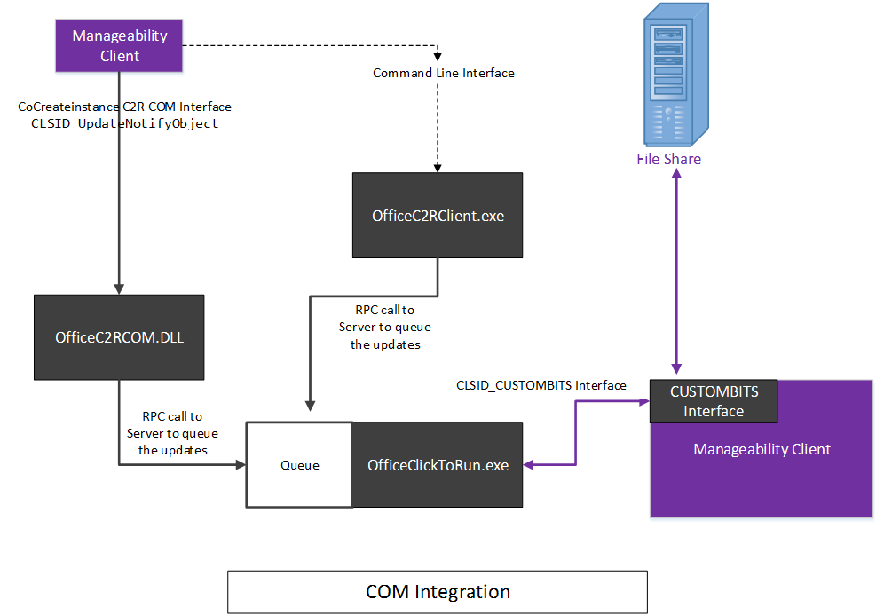

# <a name="integrating-manageability-applications-with-microsoft-365-apps-click-to-run-installer"></a>Интеграция приложений управляемости с Приложения Microsoft 365 установки click-to-Run

Узнайте, как интегрировать Приложения Microsoft 365 установки click-to-Run с решением управления программным обеспечением.
  
Установщик Приложения Microsoft 365 Click-to-Run предоставляет интерфейс COM, который позволяет ИТ-специалистам и программным решениям управления программным управлением управлять управлением обновлениями. Этот интерфейс предоставляет дополнительные возможности управления за пределами того, что предоставляет Office средство развертывания.
  
> [!NOTE]
> Эта статья применяется к Office приложениям, которые используют установщик click-to-Run. 
  
## <a name="integrating-with-the-click-to-run"></a>Интеграция с click-to-Run

Для использования этого интерфейса приложение управляемости вызывает интерфейс COM и вызывает открытые API, которые напрямую взаимодействуют со службой установки Click-to-Run. 
  
> [!NOTE]
> Установка Office click-to-Run может запускаться из командной строки с параметрами, которые могут управлять поведением, как описано в Office Средство развертывания для [click-to-Run](https://docs.microsoft.com/DeployOffice/overview-office-deployment-tool). 
  
**Ниже приведена концептуальная схема интерфейса COM**


  
Установщик Приложения Microsoft 365 click-to-Run реализует интерфейс на основе **COM, IUpdateNotify,** зарегистрированный в CLSID **CLSID_UpdateNotifyObject.**
  
Этот интерфейс можно вызвать следующим образом:
  
```cpp
hr = CoCreateInstance(CLSID_UpdateNotifyObject, NULL, CLSCTX_ALL,
       IID_IUpdateNotify, 
      (void **)&p); 
```

Вызов будет успешным только в том случае, если вызываемая будет работать с повышенными привилегиями, так как программа установки Click-to-Run должна быть запущена с повышенными привилегиями.
  
Интерфейс **IUpdateNotify** COM предоставляет три асинхронные функции, отвечающие за проверку команд и параметров и планирование выполнения с помощью службы установки Click-to-Run. 
  
```cpp
HRESULT Download([in] LPWSTR pcwszParameters) // Download update content.
HRESULT Apply([in] LPWSTR pcwszParameters) // Apply update content.
HRESULT Cancel() // Cancel the download action.

```

Способ "Состояние" можно использовать для получения сведений о состоянии последней выполненной команды или состоянии исполняемой в настоящее время команды (например, успех, сбой, подробные коды ошибок). 
  
```cpp
HRESULT status([out] _UPDATE_STATUS_REPORT* pUpdateStatusReport) // Get status of current action. 
typedef struct _UPDATE_STATUS_REPORT  
{  
UPDATE_STATUS status;  
UINT error; 
BSTR contentid;  
} UPDATE_STATUS_REPORT;

```

Существует четыре состояния, в которых служба установки Click-to-Run может быть в течение жизненного цикла, во время которого могут быть вызваны методы **IUpdateNotify;** Перезагрузка, простое, загрузка и применение. 
  
**Ниже приведена схема состояния интерфейса COM**


  
> [!NOTE]
> **Перезагрузка.** При загрузке компьютера существует период времени, когда служба установки click-to-Run недоступна. Успешный вызов метода Status после перезагрузки возвращает eUPDATE_UNKNOWN. 
  
**Простое:** Если установщик click-to-Run находится в состоянии простоя, можно вызвать: 
  
- **Применение:** Установка ранее загруженного контента.
    
- **Отмена:**  `0x800000e` возвращается, "метод был вызван в неожиданное время".
    
- **Загрузка.** Загружает новый контент для более поздней установки клиента.
    
- **Состояние.** Возвращает результат последнего выполненного действия или сообщение об ошибке, если действие завершилось сбоем. Если предыдущего действия не было, **возвращается**  `eUPDATE_UNKNOWN` состояние.
    
**Загрузка:** Когда установщик click-to-Run находится в состоянии загрузки, можно вызвать: 
  
- **Применение.** Возвращает **HRESULT** со значением  `0x800000e` "Метод был вызван в неожиданное время".
    
- **Отмена:** останавливает скачивание и удаляет частично загруженный контент.
    
- **Загрузка:** возвращает **HRESULT** со значением  `0x800000e` "Метод был вызван в неожиданное время". 
    
- **Состояние.** **Возвращает DOWNLOAD_WIP,** чтобы указать, что работа по загрузке находится в процессе. 
    
**Применение:** Когда установщик click-to-Run находится в процессе установки ранее скачиваемого контента: 
  
- **Применение.** Возвращает **HRESULT** со значением  `0x800000e` "Метод был вызван в неожиданное время".
    
- **Отмена:**  `0x800000e` возвращается, действие Apply не может быть отменено.
    
- **Загрузка:** возвращает **HRESULT** со значением  `0x800000e` "Метод был вызван в неожиданное время". 
    
- **Состояние.** **Возвращает APPLY_WIP,** чтобы указать, что работа по применении продолжается. 
    
> [!NOTE]
> Так как OfficeC2RCOM является службой COM+ и динамически загружена, необходимо вызывать **CoCreateInstance** каждый раз при вызове метода в этом классе, чтобы обеспечить ожидаемый результат. Служба COM+ при необходимости будет обрабатывать создание нового экземпляра. Когда один из методов будет вызван впервые, com+ загрузит **объект IUpdateNotify** и запустит его в одном из dllhost.exe экземпляров. Новый объект будет оставаться активным в течение примерно 3 минут в простое. Если последующий вызов будет выполнен в течение трех минут после последнего вызова, **объект IUpdateNotify** будет загружен и новый экземпляр не создается. Если в течение трех минут не будет выполнен вызов, объект IUpdateNotify будет выгружен и при следующем вызове будет создан новый **объект IUpdateNotify.** 
  
## <a name="click-to-run-installer-com-api-reference-guide"></a>Руководство по установке COM API для установки на кнопку мыши

В следующей справочной документации API:
  
- Параметры находятся в формате пары ключ/значение, разделенных пробелом.
    
- Параметры не являются чувствительными к делу.
    
- Существует список [параметров с](https://blogs.technet.microsoft.com/odsupport/2014/03/03/the-new-update-now-feature-for-office-2013-click-to-run-for-office365-and-its-associated-command-line-and-switches/) документацией. 
    
- Сводка интерфейса IUpdateNotify2 теперь включена.
    
### <a name="apply"></a>Применить

```cpp
HRESULT Apply([in] LPWSTR pcwszParameters) // Apply update content.
```

#### <a name="parameters"></a>Parameters

-  _displaylevel_: **true,** чтобы показать состояние установки, в том числе ошибки, во время процесса обновления; **ложный,** чтобы скрыть состояние установки, в том числе ошибки, во время процесса обновления. Значение по умолчанию: **false**.
    
-  _forceappshutdown_ **:** true to force Office приложений, чтобы немедленно закрыться при запуске действия **Apply;** **ложный** сбой, если Office запущены приложения. Значение по умолчанию: **false**. Дополнительные [сведения см.](#bk_ApplyRemark) в комментарии. 
    
  Если любое Office приложение запускается при запуске действия **Apply,** действие **Apply,** как правило, не работает. Переход к методу Apply приведет к тому, что `forceappshutdown=true` **служба OfficeClickToRun** немедленно отключит приложения и применит обновление.  В этом случае пользователь может испытывать потерю данных. 
    
#### <a name="return-results"></a>Результаты возврата

|||
|:-----|:-----|
|**S_OK** <br/> |Действие успешно отправлено в службу Click-To-Run для выполнения.  <br/> |
|**E_ACCESSDENIED** <br/> |Вызываемая не работает с повышенными привилегиями.  <br/> |
|**E_INVALIDARG** <br/> |Были переданы недействительные параметры.  <br/> |
|**E_ILLEGAL_METHOD_CALL** <br/> |Действие в настоящее время не разрешено. Дополнительные [сведения см.](#bk_ApplyRemark) в комментарии.  <br/> |

<a name="bk_ApplyRemark"></a>

#### <a name="remarks"></a>Примечания

- Если любое Office запускается при запуске действия **Apply,** действие **Apply** не будет работать. Переход к методу Apply приведет к немедленному отключению `forceappshutdown=true` **службы OfficeClickToRun** Office запущенных приложений и применению обновления.  Пользователь может испытывать данные, так как им не предложено сохранить изменения в открытых документах.. 
    
- Это действие может быть вызвано только в том случае, если состояние COM является одним из следующих: 
    
  - **eUPDATE_UNKNOWN**
    
  - **eDOWNLOAD_CANCELLED**
    
  - **eDOWNLOAD_FAILED**
    
  - **eDOWNLOAD_SUCCEEDED**
    
  - **eAPPLY_SUCCEEDED**
    
  - **eAPPLY_FAILED**
    
- Если вы вызываете метод **Apply** без предварительной  загрузки контента, метод **Apply** будет сообщать о успешном применении, так как он не обнаружил ничего, чтобы применить и успешно завершил **процесс Применения.** 
    
### <a name="cancel"></a>"Отмена"

```cpp
HRESULT Cancel() // Cancel the download action.
```

#### <a name="return-results"></a>Результаты возврата

|||
|:-----|:-----|
|S_OK  <br/> |Действие успешно отправлено в службу Click-to-Run для выполнения.  <br/> |
|E_ILLEGAL_METHOD_CALL  <br/> |Действие в настоящее время не разрешено. Дополнительные сведения [см. в](#bk_CancelRemarks) разделе Замечания  <br/> |

<a name="bk_CancelRemarks"></a>

#### <a name="remarks"></a>Примечания

- Этот метод может быть срабатывает только при **eDOWNLOAD_WIP.** Он попытается отменить текущее действие загрузки. Состояние COM изменится на **eDOWNLOAD_CANCELLING** и в конечном итоге изменится на **eDOWNLOAD_CANCELED**. Состояние COM возвращается **E_ILLEGAL_METHOD_CALL** при срабатывии в любое другое время. 
    
### <a name="download"></a>Скачать

```cpp
HRESULT Download([in] LPWSTR pcwszParameters) // Download update content.
```

#### <a name="parameters"></a>Parameters

-  _displaylevel_: **true,** чтобы показать состояние установки, в том числе ошибки, во время процесса обновления; **ложный,** чтобы скрыть состояние установки, в том числе ошибки, во время процесса обновления. Значение по умолчанию: **false**.
    
-  _updatebaseurl_: URL-адрес альтернативного источника загрузки.
    
-  _updatetoversion:_ версия для обновления Office. Определите этот параметр, если вы хотите обновить до более старой версии, чем установленная в настоящее время версия.
    
-  _downloadsource_: CLSID настраиваемой **реализации IBackgroundCopyManager** (bitS manager). 
    
-  _contentid._ Определяет содержимое для скачивания с сервера контента с помощью настраиваемой диспетчера BITS. Это значение передается через интерфейс BITS для интерпретации.
    
#### <a name="return-results"></a>Результаты возврата

|||
|:-----|:-----|
|**S_OK** <br/> |Действие успешно отправлено в службу Click-To-Run для выполнения.  <br/> |
|**E_ACCESSDENIED** <br/> |Вызываемая не работает с повышенными привилегиями.  <br/> |
|**E_INVALIDARG** <br/> |Были переданы недействительные параметры.  <br/> |
|**E_ILLEGAL_METHOD_CALL** <br/> |Действие в настоящее время не разрешено. Дополнительные [сведения см.](#bk_DownloadRemark) в комментарии.  <br/> |

<a name="bk_DownloadRemark"></a>

#### <a name="remarks"></a>Примечания

- Необходимо  _указать downloadsource_ и  _contentid_ в качестве пары. Если нет, метод **Загрузка** возвращает E_INVALIDARG **ошибку.** 
    
- Если  _будут предоставлены downloadsource,_  _contentid_ и  _updatebaseurl,_  _updatebaseurl_ будет игнорироваться. 
    
- Это действие может быть вызвано только в том случае, если состояние COM является одним из следующих: 
    
  - **eUPDATE_UNKNOWN**
    
  - **eDOWNLOAD_CANCELLED**
    
  - **eDOWNLOAD_FAILED**
    
  - **eDOWNLOAD_SUCCEEDED**
    
  - **eAPPLY_SUCCEEDED**
    
  - **eAPPLY_FAILED**
    
- Если вы позвоните **методу Apply** без ранее скачаного контента, метод **Apply** будет сообщать о успешном применении, так как он не обнаружил ничего, чтобы применить и успешно завершил процесс **Применения.**  
    
#### <a name="examples"></a>Примеры

- Чтобы скачать контент из настраиваемой диспетчера BITS: вызывайте функцию **загрузки()** при передаче следующих параметров: 
    
  ```cpp
  "downloadsource=CLSIDofBITSInterface contentid=BITSServerContentIdentifier"
  ```

- Чтобы скачать содержимое из Office сеть доставки содержимого (CDN): вызов функции **загрузки()** без указания параметров _downloadsource,_ _contentid_ или _updatebaseurl._ 
    
- Чтобы скачать контент из настраиваемой локации: вызывайте функцию **загрузки()** при передаче следующего параметра: 
    
  ```cpp
  "updatebaseurl=yourcontentserverurl"
  ```

### <a name="status"></a>Состояние

```cpp
typdef struct _UPDATE_STATUS_REPORT
{
    UPDATE_STATUS status;
    UINT error;
    LPCWSTR contentid;
}UPDATE_STATUS_REPORT;
HRESULT status([out] _UPDATE_STATUS_REPORT& pUpdateStatusReport) // Get status of current action
```

#### <a name="parameters"></a>Parameters

|||
|:-----|:-----|
| _pUpdateStatusReport_ <br/> |Указатель на структуру UPDATE_STATUS_REPORT.  <br/> |
   
#### <a name="return-results"></a>Результаты возврата

|||
|:-----|:-----|
|**S_OK** <br/> |Метод **Status** всегда возвращает этот результат. Проверьте  `UPDATE_STATUS_RESULT` структуру на состояние текущего действия.  <br/> |
   
#### <a name="remarks"></a>Примечания

- Поле состояния содержит  `UPDATE_STATUS_REPORT` состояние текущего действия. Возвращается одно из следующих значений состояния: 
    
  ```cpp
  typedef enum _UPDATE_STATUS
  {
  eUPDATE_UNKNOWN = 0,
  eDOWNLOAD_PENDING,
  eDOWNLOAD_WIP,
  eDOWNLOAD_CANCELLING,
  eDOWNLOAD_CANCELLED,
  eDOWNLOAD_FAILED,
  eDOWNLOAD_SUCCEEDED,
  eAPPLY_PENDING,
  eAPPLY_WIP,
  eAPPLY_SUCCEEDED,
  eAPPLY_FAILED,
  } UPDATE_STATUS;
  
  ```

- Если последняя команда приводит к ошибке, поле ошибки содержит подробные  `UPDATE_STATUS_REPORT` сведения об ошибке. Из метода Status возвращаются два  типа кодов ошибок. 
    
- Если ошибка меньше, ошибка является одним из следующих  `UPDATE_ERROR_CODE::eUNKNOWN` заранее определенных кодов ошибок:
    
  ```cpp
  typedef enum _UPDATE_ERROR_CODE
  {
  eOK = 0,
  eFAILED_UNEXPECTED,
  eTRIGGER_DISABLED,
  ePIPELINE_IN_USE,
  eFAILED_STOP_C2RSERVICE,
  eFAILED_GET_CLIENTUPDATEFOLDER,
  eFAILED_LOCK_PACKAGE_TO_UPDATE,
  eFAILED_CREATE_STREAM_SESSION,
  eFAILED_PUBLISH_WORKING_CONFIGURATION,
  eFAILED_DOWNLOAD_UPGRADE_PACKAGE,
  eFAILED_APPLY_UPGRADE_PACKAGE,
  eFAILED_INITIALIZE_RSOD,
  eFAILED_PUBLISH_RSOD,
  // Keep this one as the last
  eUNKNOWN
  } UPDATE_ERROR_CODE;
  
  ```

  Если код возвращаемой ошибки больше, чем  `UPDATE_ERROR_CODE::eUNKNOWN` **HRESULT** неудачного вызова функции. Извлечение вычитания HRESULT из значения, возвращаемого в поле  `UPDATE_ERROR_CODE::eUNKNOWN` ошибки  `UPDATE_STATUS_REPORT` .
    
  Полный список значений состояния и ошибок можно просмотреть, проверив библиотеку типов **IUpdateNotify,** встроенную в OfficeC2RCom.dll. 
    
- Контентное поле используется для  звонков  в состояние после начала загрузки и возвращает содержимое, переданное в вызов **Загрузка.** Перед вызовом метода Status лучше  всего инициализировать это поле, а  затем проверить значение после возврата состояния.  Если значение по-прежнему **null,** это означает, что нет contentid, чтобы вернуться. Если значение не **null,** необходимо освободить его с помощью вызова **в SysFreeString()**. Вот фрагмент кода о том, как вызвать **состояние** после **загрузки**.
    
  ```cpp
  std::wstring contentID;
  UPDATE_STATUS_REPORT statusReport;
  statusReport.status = eUPDATE_UNKNOWN;
  statusReport.error = eOK;
  statusReport.contentid = NULL;
  hr = p->Status(&statusReport);
  if (statusReport.contentid != NULL)
  {
  contentID = statusReport.contentid;
  SysFreeString(statusReport.contentid);
  }
  wprintf(L"ContentID: %s, Status: %d, LastError: %d", contentID.c_str(), statusReport.status, statusReport.error);
  
  ```

### <a name="summary-of-iupdatenotify2-interface"></a>Сводка интерфейса IUpdateNotify2

Из версии [16.0.8208.6352] мы добавили новый **интерфейс IUpdateNotify2.** 
  
- CLSID_UpdateNotifyObject2{52C2F9C2-F1AC-4021-BF50-756A5FA8DDFE}
    
- В этом интерфейсе также был организован оригинальный интерфейс IUpdateNotify для обеспечения обратной совместимости. Это означает, что при использовании этого интерфейса у вас есть доступ ко всем методам, предоставляемым в **интерфейсе UpdateNotifyObject.** 
    
- Новые методы, добавленные в IUpdateNotify2:
    
  - **HRESULT** GetBlockingApps ([out] BSTR \* AppsList). Получать обновления, блокирующие список приложений. Этот вызов возвращает запущенные Office приложения, которые будут блокировать процесс обновления. 
    
  - **HRESULT** GetOfficeDeploymentData([in] int dataType, [in] **LPCWSTR** pcwszName, [out] BSTR * OfficeData). Получите Office развертывания. 
    
- Если вы хотите использовать новые методы, необходимо убедиться:
    
  - Ваша версия C2R является более новой, чем выше сборка \> (= сборка вилок июня).
    
  - Используйте UpdateNotifyObject2 вместо **UpdateNotifyObject** для вызова **CoCreateInstance.**
    
Если вы не используете ни один из новых методов, вам не нужно ничего менять. Все существующие методы будут работать точно так же, как и раньше.
  
## <a name="implementing-the-bits-interface"></a>Реализация интерфейса BITS

The [Background Intelligent Transfer Service](https://docs.microsoft.com/windows/win32/bits/background-intelligent-transfer-service-portal) (BITS) — это служба, предоставляемая Корпорацией Майкрософт для передачи файлов между клиентом и сервером. BITS — один из каналов, Office установки click-To-Run можно использовать для скачивания контента. По умолчанию Приложения Microsoft 365 установки click-To-Run использует встроенный Windows в реализации BITS для загрузки контента из CDN. 
  
Предоставляя настраиваемую реализацию BITS методу загрузки **интерфейса** **IUpdateNotify,** программное обеспечение управляемости может контролировать, где и как клиент загружает контент. Настраиваемый интерфейс BITS полезен при предоставлении настраиваемого канала распространения контента, кроме встроенных каналов Click-to-Run, таких как серверы CDN, IIS-серверы или файлы. 
  
Минимальное требование к настраиваемом интерфейсу BITS для работы с Office C2R-службой:
  
- Для **IBackgroundCopyManager:**
    
  ```cpp
  HRESULT _stdcall CreateJob(
                      [in] LPWSTR DisplayName, 
                      [in] BG_JOB_TYPE Type, 
                      [out] GUID* pJobId, 
                      [out] IBackgroundCopyJob** ppJob)
  HRESULT _stdcall GetJob(
                      [in] GUID* jobID, 
                      [out] IBackgroundCopyJob** ppJob)
  HRESULT _stdcall EnumJobs(
                      [in] unsigned long dwFlags, 
                      [out] IEnumBackgroundCopyJobs** ppenum)
  
  ```

- Для **IBackgroundCopyJob**:
    
  ```cpp
  HRESULT _stdcall AddFile(
                      [in] LPWSTR RemoteUrl, 
                      [in] LPWSTR LocalName)
  HRESULT _stdcall Resume()
  HRESULT _stdcall Complete()
  HRESULT _stdcall Cancel();
  HRESULT _stdcall GetState([out] BG_JOB_STATE* pVal);
  HRESULT GetProgress( [out] BG_JOB_PROGRESS *pProgress);
  
  ```

- Для **IBackgroundCopyJob3**:
    
  ```cpp
  HRESULT _stdcall AddFileWithRanges(
                      [in] LPWSTR RemoteUrl, 
                      [in] LPWSTR LocalName,
                      [in] DWORD RangeCount,
                      [in] BG_FILE_RANGE Ranges[])
  
  ```

- Для  `Addfile`  `AddFileWithRanges` функций удаленный URL-адрес находится в следующем формате: 
    
  ```cpp
  cmbits://<contentid>/<relative path to target file>
  ```

  - cmbits жестко закодировали и означает настраиваемые БИТЫ.
    
  -  _\<contentid\>_ является  _контентным параметром_ для метода **Download()** . 
    
  -  _\<relative path to target file\>_ предоставляет расположение и имя файла для скачивания файла. 
    
    Например, если вы предоставили контент для метода  Download() и Office C2R хочет скачать файл кабины версии, например файл, он будет вызывать `f732af58-5d86-4299-abe9-7595c35136ef`  `v32.cab` **AddFile()** со следующими: `RemoteUrl`
    
  ```cpp
  cmbits://f732af58-5d86-4299-abe9-7595c35136ef/Office/Data/V32.cab
  ```

- Для **IBackgroundCopyError:**
    
  ```cpp
  HRESULT _stdcall GetErrorDescription(
        [in]  DWORD  LanguageId,
        [out] LPWSTR *ppErrorDescription);
  
  ```

- Для **IBackgroundCopyFile:**
    
  ```cpp
  HRESULT _stdcall GetLocalName([out] LPWSTR *ppName); 
  HRESULT _stdcall GetRemoteName([out] LPWSTR *ppName);
  
  ```
## <a name="automating-content-staging"></a>Автоматизация постановки контента

ИТ-администраторы могут выбрать, чтобы клиенты настольных компьютеров могли автоматически получать обновления, когда они доступны непосредственно из CDN или они могут управлять развертыванием обновлений, доступных на каналах обновления с помощью средства развертывания Office или Microsoft Endpoint Configuration Manager.
  
Служба поддерживает возможность средств управления распознавать и автоматизировать скачивание контента при наличии обновлений.
  
**Ниже представлен обзор загрузки настраиваемого изображения**


  
### <a name="overview-of-downloading-a-custom-image"></a>Обзор загрузки настраиваемого изображения
  
На предыдущей схеме вы видите, что Приложения Microsoft 365 изображение доступно на CDN. Наряду с Приложения Microsoft 365 изображением доступен API, который имеет сведения, необходимые для создания программного обеспечения управляемости для непосредственного создания настраиваемых изображений, заменяющих необходимость использования средства Office развертывания.

Предприятие настраивает WSUS для синхронизации Приложения Microsoft 365 обновлений. Эти обновления не содержат фактической полезной нагрузки изображения, но позволяют программному обеспечению управляемости распознавать при наличии нового контента. Программное обеспечение управляемости может считыть метаданные Приложения Microsoft 365 update, чтобы понять, к какой версии Office применяется обновление.

Если обновление применимо, программное обеспечение управляемости может использовать содержимое CDN и список файлов для создания настраиваемого изображения и хранения его на месте обмена файлами, которое оно настроено использовать.
  
### <a name="using-the-microsoft-365-apps-file-list-api"></a>Использование API Приложения Microsoft 365 списка файлов

API Приложения Microsoft 365 списка файлов используется для получения имен файлов, необходимых для определенного Приложения Microsoft 365 обновления.

HTTP-запрос

GET https://config.office.com/api/filelist

Не указывайте текст запроса для этого метода.

Для вызова этого API не требуется никаких разрешений.

Необязательные параметры запросов

|**Имя**|**Описание**|
|:-----|:-----|
| канал <br/>| Указывает имя канала  <br/> Необязательный — по умолчанию значение "SemiAnnual" <br/> Поддерживаемые значения https://docs.microsoft.com/DeployOffice/office-deployment-tool-configuration-options#channel-attribute-part-of-add-element |
| version <br/>| Указывает версию обновления <br/> Необязательный — по умолчанию последняя версия, доступная для указанного канала |
| арка <br/>| Указывает архитектуру клиента <br/> Необязательный — по умолчанию значение "x64" <br/> Поддерживаемые значения: x64, x86 |
| крышка <br/>| Указывает языковые файлы, которые необходимо включить <br/> Необязательный — по умолчанию нет <br/> Чтобы указать несколько языков, включите параметр запроса крышки для каждого языка <br/> Используйте формат идентификатора языка, ex. "en-ru", "fr-fr" |
| alllanguages <br/>| Указывает, чтобы включить все языковые файлы <br/> Необязательный — по умолчанию значение false |

HTTP-ответ

В случае успешной работы этот метод возвращает код ответа 200 ОК и коллекцию объектов файлов в тексте отклика.

Чтобы создать изображение, выполните следующие действия:
1.  Позвоните в API, предоставив соответствующие параметры запроса для канала, версии и архитектуры интересуемого обновления.
Примечание. Файл объектов с атрибутом "lcid": "0" являются нейтральными языковыми файлами и должны быть включены в изображение.
2.  Создай локальное изображение CDN путем итерации через объекты файлов и копирования файлов CDN, создавая структуру папок в зависимости от атрибута "relativePath", определенного для каждого из объектов файла.

В следующем примере извлекает список файлов для текущего канала и версии 16.0.4229.1004 для 64bit и включает файлы на французском и английском языках:

```http
Get https://config.office.com/api/filelist?Channel=Current&Version=16.0.4229.1004&Arch=x64&Lid=fr-fr&Lid=en-US
```

### <a name="hash-verification-of-dat-files"></a>Проверка hash файлов .dat

Средства создания изображений могут проверять целостность загруженных файлов .dat, сравнивая вычисляемую ценность hash с поставляемым значением hash, связанным с каждым из файлов .dat. Ниже приводится пример объекта файла, который указывает значения hashLocation и hashAlgorithm:
  
```xml
{
  "url": "https://officecdn.microsoft.com/pr/7ffbc6bf-bc32-4f92-8982-f9dd17fd3114/office/data/16.0.1234.1001/stream.x64.x-none.dat",
  "name": "stream.x64.x-none.dat",
  "relativePath": "/office/data/16.0.1234.1001/",
  "hashLocation": "s640.cab/stream.x64.x-none.hash",
  "hashAlgorithm": "Sha256",
  "lcid": "0"
},
```

- Атрибут **hashLocation** указывает относительное расположение пути .cab, который содержит значение hash. Сконструировать расположение файла hash путем согласовывающего URL-адреса + relativePath + hashLocation. В следующем примере расположение stream.x64.bg-bg.hash: 
    
  ```http
  https://officecdn.microsoft.com/pr/492350f6-3a01-4f97-b9c0-c7c6ddf67d60/office/data/16.0.4229.1004/s641026.cab/stream.x64.bg-bg.hash 
  ```

- Атрибут **hashAlgorithm указывает,** какой алгоритм хаширования использовался. 
    
  Чтобы проверить целостность файла stream.x64.bg-bg.dat, откройте stream.x64.bg-bg.hash и прочитайте значение HASH, которое является первой строкой текста в файле hash. Сравните это со значением вычисляемого хаширования (с помощью указанного алгоритма хаширования) для проверки целостности загруженного файла .dat.
    
  В следующем примере показан C# код для чтения хаши.
    
  ```cs
    string[] readHashes = System.IO.File.ReadAllLines(tmpFile, Encoding.Unicode);
    string readHash = readHashes.First();
  ```

### <a name="microsoft-365-apps-updates"></a>Приложения Microsoft 365 Обновления

Все Приложения Microsoft 365 обновления публикуются в [каталоге обновлений Майкрософт.](https://www.catalog.update.microsoft.com/Search.aspx?q=office+365+client)
  
Приложения Microsoft 365 Обновления позволяют программному обеспечению управляемости обрабатывать Приложения Microsoft 365 обновления таким образом, который очень похож на любое другое обновление wu с одним исключением; обновления клиента не содержат фактической полезной нагрузки. Обновления Приложения Microsoft 365 не должны устанавливаться на клиентов, а используются для запуска рабочего процесса с помощью программного обеспечения управляемости, заменив команду установки на механизм установки на основе COM, показанный выше.

**На следующем рисунке показана схема рабочего Office 365 клиентского обновления.**


  
Каждое Приложения Microsoft 365, опубликованное, включает метаданные об обновлении. Эти метаданные включают параметр MoreInfoUrl, который можно использовать для получения вызова API в API списка файлов для этого конкретного обновления.

В следующем примере API списка файлов встроен в MoreInfoURL и начинается с "ServicePath="

http://go.microsoft.com/fwlink/?LinkId=626090&Ver=16.0.12527.21104&Branch=Insiders&Arch=64&XMLVer=1.6&xmlPath=http://officecdn.microsoft.com/pr/wsus/ofl.cab&xmlFile=O365Client_64bit.xml& ServicePath=https://config.office.com/api/filelist?Channel=Insiders&Version=16.0.12527.21104&Arch=64&AllLanguages=True
  
### <a name="additional-metadata-for-automating-content-staging"></a>Дополнительные метаданные для автоматизации постановки контента

**API истории выпуска**
  
API Приложения Microsoft 365 выпуска используется для получения сведений для каждого из обновлений, опубликованных в CDN, а также имен каналов и других атрибутов канала.

HTTP-запрос

```http
GET https://config.office.com/api/filelist/channels 
```

Не указывайте текст запроса для этого метода.

Для вызова этого API не требуется никаких разрешений.

HTTP-ответ

В случае успешной работы этот метод возвращает код ответа 200 ОК и коллекцию объектов файлов в тексте отклика.

**SKUs API**
  
API SKUs возвращает сведения, которые полезны для определения продуктов, доступных для развертывания и обслуживания Office CDN с различными вариантами для каждого из них.

HTTP-запрос

```http
GET https://config.office.com/api/filelist/skus 
```

Не указывайте текст запроса для этого метода.

Для вызова этого API не требуется никаких разрешений.

HTTP-ответ

В случае успешной работы этот метод возвращает код ответа 200 ОК и коллекцию объектов файлов в тексте отклика.
