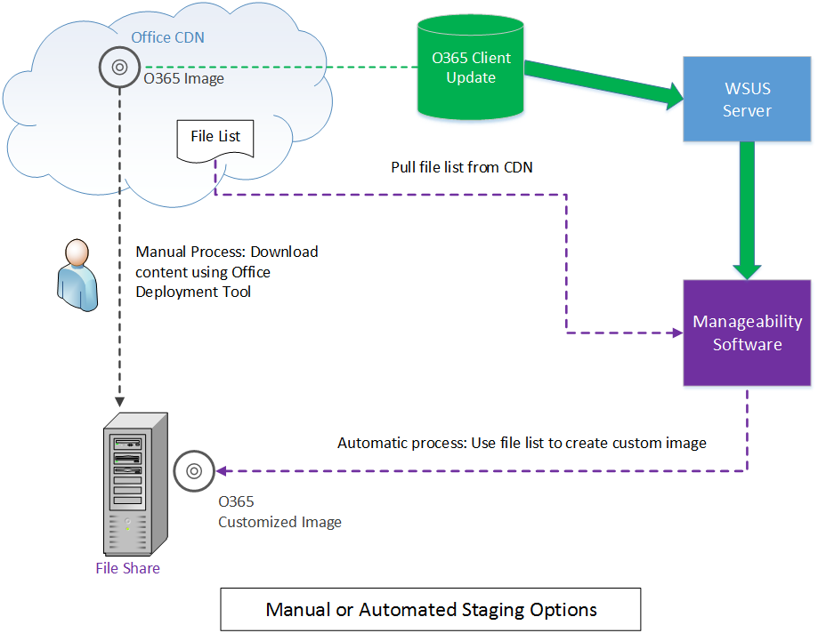

# <a name="integrating-manageability-applications-with-office-365-click-to-run-installer"></a>Интеграция приложений управляемости с установщиком click-to-run Office 365

Узнайте, как можно интегрировать программу установки Office 365 Click-to-Run с помощью решения для управления программного обеспечения.
  
Установщик Office 365 Click-to-Run предоставляет COM-интерфейс, обеспечивающий программный контроль за управление обновлениями ИТ-специалистов и решений по управлению программного обеспечения. Этот интерфейс предоставляет дополнительные возможности управления рамками средства развертывания Office.
  
> [!NOTE]
> Эта статья относится к Office 2016 и более поздних версий, Office 365. 
  
## <a name="integrating-with-the-click-to-run"></a>Интеграция с Click-to-Run

Чтобы использовать этот интерфейс, управляемость приложения вызывает интерфейс COM и вызовы предоставляемые API, которые напрямую связываются с служба установки Click-to-Run. 
  
> [!NOTE]
> Установщик Office Click-to-Run может выполняться из командной строки с параметрами, которые можно управлять поведением, как описано в [Office Deployment Tool for Click-to-Run](https://www.microsoft.com/en-us/download/details.aspx?id=49117). 
  
**Ниже приведен концептуальная диаграмма интерфейса COM**

![Схема с помощью интерфейса COM программу установки Office Click-To-Run.] (media/e7ac2523-e67b-4a44-ae67-c048709f872a.png "Схема с использованием интерфейса COM программу установки Office Click-To-Run")
  
Интерфейс на основе COM реализует установщик Office 365 Click-to-Run, **IUpdateNotify** , зарегистрированных для CLSID **CLSID_UpdateNotifyObject**.
  
Этот интерфейс может быть вызван следующим образом:
  
```cpp
hr = CoCreateInstance(CLSID_UpdateNotifyObject, NULL, CLSCTX_ALL,
       IID_IUpdateNotify, 
      (void **)&p); 
```

Вызов будет только успешным Если запущен вызывающего абонента с повышенными привилегиями, как необходимо запустить программу установки Click-to-Run с повышенными привилегиями.
  
Интерфейс **IUpdateNotify** COM предоставляет три асинхронные функции, ответственный за Проверка команды и параметры и расписание выполнения со службой установки Click-to-Run. 
  
```cpp
HRESULT Download([in] LPWSTR pcwszParameters) // Download update content.
HRESULT Apply([in] LPWSTR pcwszParameters) // Apply update content.
HRESULT Cancel() // Cancel the download action.

```

A Далее метод, **состояние**, можно использовать для получения сведений о состоянии последнего выполняемая команда или состояния в настоящее время выполнения команды (успех, ошибка, коды ошибок подробные).
  
```cpp
HRESULT status([out] _UPDATE_STATUS_REPORT* pUpdateStatusReport) // Get status of current action. 
typedef struct _UPDATE_STATUS_REPORT  
{  
UPDATE_STATUS status;  
UINT error; 
BSTR contentid;  
} UPDATE_STATUS_REPORT;

```

Существует четыре состояния, служба установки Click-to-Run в во время его жизненного цикла, во время которого могут быть вызваны методы **IUpdateNotify** ; Перезагрузка, простоя, загрузки и применение. 
  
**Ниже приведен на схеме COM интерфейс конечного компьютера**

![Диаграмму состояний для интерфейса COM.] (media/a409003e-6876-4ab3-bb4c-cd0c0fed5cbb.png "Схема состояний для интерфейса COM")
  
> [!NOTE]
> **Rebooting**: при загрузке компьютер находится за период времени, когда служба установщика Click-to-Run недоступен. Возвращает eUPDATE_UNKNOWN успешного вызова метода состояние после перезагрузки. 
  
**Простоя:** Когда установщик Click-to-Run находится в состоянии простоя, можно вызвать: 
  
- **Применить**: Install ранее загруженного содержимого.
    
- **Отмена**: возвращает `0x800000e`, «был вызван метод в непредвиденное время.»
    
- **Загрузка**: файлы для загрузки нового контента на клиенте для установки более поздней версии.
    
- **Состояние**: возвращает результат последнего завершенного действия или сообщение об ошибке, если завершение действия в сбоя. Если нет предыдущих действий, возвращает **состояние** `eUPDATE_UNKNOWN`.
    
**Загрузка:** Когда установщик Click-to-Run находится в состоянии загрузки, можно вызвать: 
  
- **Применить**: возвращает значение **HRESULT** со значением `0x800000e`, «был вызван метод в непредвиденное время.»
    
- **Отмена**: останавливает загрузку и удаляет частично загруженного содержимого.
    
- **Загрузка**: возвращает значение **HRESULT** со значением `0x800000e`, «был вызван метод в непредвиденное время.» 
    
- **Состояние**: возвращает **DOWNLOAD_WIP** для указания, что файл для загрузки рабочих находится в стадии разработки. 
    
**Применение:** Когда программа установки Click-to-Run находится в процессе установки ранее Загрузите содержимое: 
  
- **Применить**: возвращает значение **HRESULT** со значением `0x800000e`, «был вызван метод в непредвиденное время.»
    
- **Отмена**: возвращает `0x800000e`, применить действие невозможно отменить.
    
- **Загрузка**: возвращает значение **HRESULT** со значением `0x800000e`, «был вызван метод в непредвиденное время.» 
    
- **Состояние**: возвращает **APPLY_WIP** для указания, которые применяются рабочих находится в стадии разработки. 
    
> [!NOTE]
> Поскольку OfficeC2RCOM — это служба COM + и динамически загружается, необходимо вызвать **CoCreateInstance** каждый раз при вызове метода на этот класс, чтобы убедиться, что вы получаете ожидаемый результат. Служба COM + будет обрабатывать создания экземпляра, если это необходимо. Когда один из методов вызывается в первый раз, COM + будет загрузить объект **IUpdateNotify** и запустите его в пределах одного из экземпляров dllhost.exe. Новый объект будет находиться в активном для около 3 минут бездействия. Если последующие вызов выполняется в три минуты последнего вызова, объект **IUpdateNotify** загружаются и не создается новый экземпляр. Если вызов не происходит в течение трех минут, объект IUpdateNotify будет выгрузки и будет создан новый объект **IUpdateNotify** , при следующем вызове. 
  
## <a name="click-to-run-installer-com-api-reference-guide"></a>Справочник по COM API установщика Click-to-Run

В следующей документации Справочник по API:
  
- Параметры используются в виде пары ключ значение, разделенных пробелами.
    
- Параметры не учитывают регистр.
    
- [Список параметров](https://blogs.technet.microsoft.com/odsupport/2014/03/03/the-new-update-now-feature-for-office-2013-click-to-run-for-office365-and-its-associated-command-line-and-switches/) с помощью документации доступен. 
    
- Обзор интерфейса IUpdateNotify2 — теперь включены.
    
### <a name="apply"></a>Apply

```cpp
HRESULT Apply([in] LPWSTR pcwszParameters) // Apply update content.
```

#### <a name="parameters"></a>Параметры

-  _displaylevel_: **true** для отображения состояния установки, включая ошибки, во время процесса обновления; **значение false,** Чтобы скрыть состояние установки, включая ошибки, во время процесса обновления. Значение по умолчанию — **false**.
    
-  _forceappshutdown_: **значение true,** Чтобы принудительно завершить работу сразу же если **Применить** действие инициируется; приложения Office **значение false** с ошибкой, если запущены любого приложения Microsoft Office. Значение по умолчанию — **false**. [Для получения дополнительных сведений см.](#bk_ApplyRemark) 
    
  Если при запуске **Применить** действие выполняется любое приложение Office, **Применить** действие обычно завершится с ошибкой. Передача `forceappshutdown=true` **Применить** метод будет отображено **OfficeClickToRun** службы сразу же завершите работу приложения и применения обновления. Пользователь может в этом случае привести к потере данных. 
    
#### <a name="return-results"></a>Возвращать результаты

|||
|:-----|:-----|
|**S_OK** <br/> |Действие было успешно отправлено в службу Click-To-Run для выполнения.  <br/> |
|**E_ACCESSDENIED** <br/> |Вызывающий не работает с повышенными привилегиями.  <br/> |
|**E_INVALIDARG** <br/> |Были переданы недопустимые параметры.  <br/> |
|**E_ILLEGAL_METHOD_CALL** <br/> |Действие не допускается в данный момент. [Для получения дополнительных сведений см.](#bk_ApplyRemark)  <br/> |

<a name="bk_ApplyRemark"></a>

#### <a name="remarks"></a>Замечания

- Если при запуске **Применить** действие выполняется любое приложение Office, **Применить** действие завершится с ошибкой. Передача `forceappshutdown=true` **Применить** метод будет отображено службы **OfficeClickToRun** немедленно завершить работу любого приложения Office, которые работают и установите обновление. Могут возникать данных как они не запрос на сохранение изменений для открытия документов. 
    
- Это действие может быть запущено, только если состояние COM одно из следующих: 
    
  - **eUPDATE_UNKNOWN**
    
  - **eDOWNLOAD_CANCELLED**
    
  - **eDOWNLOAD_FAILED**
    
  - **eDOWNLOAD_SUCCEEDED**
    
  - **eAPPLY_SUCCEEDED**
    
  - **eAPPLY_FAILED**
    
- Если вызывается метод **Apply** без ранее загрузки содержимого, методу **Apply** сообщает **Succeeded** обнаружено значение nothing для применения и успешного завершения процесса **Применить** . 
    
### <a name="cancel"></a>Cancel

```cpp
HRESULT Cancel() // Cancel the download action.
```

#### <a name="return-results"></a>Возвращать результаты

|||
|:-----|:-----|
|S_OK  <br/> |Действие было успешно отправлено в службу Click-to-Run для выполнения.  <br/> |
|E_ILLEGAL_METHOD_CALL  <br/> |Действие не допускается в данный момент. [Для получения дополнительных сведений см](#bk_CancelRemarks)  <br/> |

<a name="bk_CancelRemarks"></a>

#### <a name="remarks"></a>Замечания

- Этот метод может быть только инициируется при код состояния COM **eDOWNLOAD_WIP**. Попытка отменить текущий файл для загрузки. Состояние COM изменит **eDOWNLOAD_CANCELLING** и перейдите в конечном счете **eDOWNLOAD_CANCELED**. Состояние COM возвращает **E_ILLEGAL_METHOD_CALL** , если запускаются в любое время. 
    
### <a name="download"></a>Загрузка

```cpp
HRESULT Download([in] LPWSTR pcwszParameters) // Download update content.
```

#### <a name="parameters"></a>Параметры

-  _displaylevel_: **true** для отображения состояния установки, включая ошибки, во время процесса обновления; **значение false,** Чтобы скрыть состояние установки, включая ошибки, во время процесса обновления. Значение по умолчанию — **false**.
    
-  _updatebaseurl_: URL-адрес источника альтернативного файл для загрузки.
    
-  _updatetoversion_: версии для обновления Office. Определите этот параметр, если вы хотите обновить старой версии, чем версия, которая устанавливается в настоящее время.
    
-  _downloadsource_: CLSID пользовательские реализации **IBackgroundCopyManager** (диспетчер бит). 
    
-  _contentid_: Определяет содержимое для загрузки с сервера через настраиваемый диспетчер бит. Это значение передается через интерфейс БИТОВ для интерпретации.
    
#### <a name="return-results"></a>Возвращать результаты

|||
|:-----|:-----|
|**S_OK** <br/> |Действие было успешно отправлено в службу Click-To-Run для выполнения.  <br/> |
|**E_ACCESSDENIED** <br/> |Вызывающий не работает с повышенными привилегиями.  <br/> |
|**E_INVALIDARG** <br/> |Были переданы недопустимые параметры.  <br/> |
|**E_ILLEGAL_METHOD_CALL** <br/> |Действие не допускается в данный момент. [Для получения дополнительных сведений см.](#bk_DownloadRemark)  <br/> |

<a name="bk_DownloadRemark"></a>

#### <a name="remarks"></a>Замечания

- Необходимо указать _downloadsource_ и _contentid_ парой. В противном случае возвращает ошибку **E_INVALIDARG** метод **загрузки** . 
    
- Если этот параметр указан _downloadsource_, _contentid_и _updatebaseurl_ _updatebaseurl_ будет игнорироваться. 
    
- Это действие может быть запущено, только если состояние COM одно из следующих: 
    
  - **eUPDATE_UNKNOWN**
    
  - **eDOWNLOAD_CANCELLED**
    
  - **eDOWNLOAD_FAILED**
    
  - **eDOWNLOAD_SUCCEEDED**
    
  - **eAPPLY_SUCCEEDED**
    
  - **eAPPLY_FAILED**
    
- При вызове метода **Применить** без ранее загруженного содержимого методу **Apply** сообщает **Succeeded** обнаружено значение nothing для применения и успешного завершения процесса **Применить** . 
    
#### <a name="examples"></a>Примеры

- Для загрузки содержимого из настраиваемый диспетчер БИТЫ: вызовите функцию **download()** , передав следующие параметры: 
    
  ```cpp
  "downloadsource=CLSIDofBITSInterface contentid=BITSServerContentIdentifier"
  ```

- Для загрузки содержимого из сети Microsoft CDN: вызовите функцию **download()** без указания параметров _downloadsource_, _contentid_или _updatebaseurl_ . 
    
- Для загрузки содержимого из настроенного расположения: вызовите функцию **download()** , передавая следующий параметр: 
    
  ```cpp
  "updatebaseurl=yourcontentserverurl"
  ```

### <a name="status"></a>Status

```cpp
typdef struct _UPDATE_STATUS_REPORT
{
    UPDATE_STATUS status;
    UINT error;
    LPCWSTR contentid;
}UPDATE_STATUS_REPORT;
HRESULT status([out] _UPDATE_STATUS_REPORT& pUpdateStatusReport) // Get status of current action
```

#### <a name="parameters"></a>Параметры

|||
|:-----|:-----|
| _pUpdateStatusReport_ <br/> |Указатель на структуру UPDATE_STATUS_REPORT.  <br/> |
   
#### <a name="return-results"></a>Возвращать результаты

|||
|:-----|:-----|
|**S_OK** <br/> |Метод **состояние** всегда возвращает результат. Изучение `UPDATE_STATUS_RESULT` структуры для состояния текущего действия.  <br/> |
   
#### <a name="remarks"></a>Замечания

- Поле состояния `UPDATE_STATUS_REPORT` содержит состояния текущего действия. Возвращается одно из следующих значений состояния: 
    
  ```cpp
  typedef enum _UPDATE_STATUS
  {
  eUPDATE_UNKNOWN = 0,
  eDOWNLOAD_PENDING,
  eDOWNLOAD_WIP,
  eDOWNLOAD_CANCELLING,
  eDOWNLOAD_CANCELLED,
  eDOWNLOAD_FAILED,
  eDOWNLOAD_SUCCEEDED,
  eAPPLY_PENDING,
  eAPPLY_WIP,
  eAPPLY_SUCCEEDED,
  eAPPLY_FAILED,
  } UPDATE_STATUS;
  
  ```

- Если команда возникла ошибка, поле ошибки `UPDATE_STATUS_REPORT` содержит подробные сведения об ошибке. Два типа коды ошибок возвращаются методом **состояние** . 
    
- Если ошибка меньше, чем `UDPATE_ERROR_CODE::eUNKNOWN`, ошибки — это один из следующих кодов ошибки предварительно заданные:
    
  ```cpp
  typedef enum _UPDATE_ERROR_CODE
  {
  eOK = 0,
  eFAILED_UNEXPECTED,
  eTRIGGER_DISABLED,
  ePIPELINE_IN_USE,
  eFAILED_STOP_C2RSERVICE,
  eFAILED_GET_CLIENTUPDATEFOLDER,
  eFAILED_LOCK_PACKAGE_TO_UPDATE,
  eFAILED_CREATE_STREAM_SESSION,
  eFAILED_PUBLISH_WORKING_CONFIGURATION,
  eFAILED_DOWNLOAD_UPGRADE_PACKAGE,
  eFAILED_APPLY_UPGRADE_PACKAGE,
  eFAILED_INITIALIZE_RSOD,
  eFAILED_PUBLISH_RSOD,
  // Keep this one as the last
  eUNKNOWN
  } UPDATE_ERROR_CODE;
  
  ```

  Если этот код ошибки больше, чем `UDPATE_ERROR_CODE::eUNKNOWN` является **HRESULT** вызова неудачных функции. Чтобы извлечь вычитание HRESULT `UDPATE_ERROR_CODE::eUNKNOWN` по значению, возвращенному в поле ошибки `UPDATE_STATUS_REPORT`.
    
  Полный список значений status и error можно просмотреть, изучив **IUpdateNotify** библиотеки типов, внедренные в OfficeC2RCom.dll. 
    
- Поле contentid используется для вызовов, **состояние** после **загрузки** инициировал и возвращает contentid, переданный в вызов **загрузить** . Рекомендуется инициализировать в этом поле **значения NULL** до вызова метода **состояние** и проверьте значение после возвращения **состояния** . Если значение равно **null**, это означает, что нет не contentid для возврата. Если значение не равно **null**, нужно освободить с помощью вызова **SysFreeString()**. Ниже приведен фрагмент кода вызов **состояния** после **загрузки**.
    
  ```cpp
  std::wstring contentID;
  UPDATE_STATUS_REPORT statusReport;
  statusReport.status = eUPDATE_UNKNOWN;
  statusReport.error = eOK;
  statusReport.contentid = NULL;
  hr = p->Status(&statusReport);
  if (statusReport.contentid != NULL)
  {
  contentID = statusReport.contentid;
  SysFreeString(statusReport.contentid);
  }
  wprintf(L"ContentID: %s, Status: %d, LastError: %d", contentID.c_str(), statusReport.status, statusReport.error);
  
  ```

### <a name="summary-of-iupdatenotify2-interface"></a>Сводка по IUpdateNotify2 интерфейс

> [!NOTE]
> Этой сводки предоставляется информация дополнение [интегрирование управляемости приложений с помощью установщика нажми и работай Office 365](https://msdn.microsoft.com/EN-US/library/office/mt608768.aspx). После обновления открытого документа, этот документ можно оценить как как устаревшие. 
  
От C2RTenant [16.0.8208.6352](https://oloop/BuildGroup/Details/tenantc2rclient#3519/1255278) (первый общедоступным построения должны быть построения разветвления июня--8326.*) мы добавили новый интерфейс **IUpdateNotify2** . Вот некоторые основные сведения о этот интерфейс: 
  
- CLSID_UpdateNotifyObject2 {52C2F9C2-F1AC-4021-BF50-756A5FA8DDFE}
    
- Этот интерфейс также размещенная исходный интерфейс IUpdateNotify для обеспечения обратной совместимости. Что означает, если вы используете этот интерфейс, у вас есть доступ ко всем методам, представленные в интерфейс **UpdateNotifyObject** . 
    
- Новые методы, добавленные к IUpdateNotify2:
    
  - **HRESULT** GetBlockingApps ([out] BSTR \* AppsList). Получение обновлений блокировки список приложений. Этот вызов будет возвращать работающих приложений Office, которые будет блокировать процесс обновления с переходом. 
    
  - **HRESULT** GetOfficeDeploymentData (тип данных int, pcwszName **значение LPCWSTR** , [out] BSTR [in] [in] * OfficeData). Получите развертывания Office данных. 
    
- Если вы хотите использовать новые методы, необходимо убедитесь, что:
    
  - Новее выше построения вашей версии C2R (\>= построения разветвления июня).
    
  - Используйте UpdateNotifyObject2, а не **UpdateNotifyObject** для вызова **CoCreateInstance**.
    
Если не используется один из новых методов, не нужно изменять что-либо. Все существующие методы будут работать как точно так же, как перед.
  
## <a name="implementing-the-bits-interface"></a>Реализация интерфейса БИТОВ

[Фоновая интеллектуальная служба передачи](https://msdn.microsoft.com/library/bb968799(v=vs.85).aspx) (BITS) — это служба, предоставляемым корпорацией Майкрософт для передачи файлов между клиентом и сервером. БИТ — это один из каналов, установщик Office Click-To-Run можно использовать для загрузки содержимого. По умолчанию в Office Click-To-Run установщика используются Windows на основе в реализации BITS для загрузки содержимого из сети CDN. 
  
С указанием специализированной реализации бит в метод **download()** интерфейса **IUpdateNotify** , программного обеспечения управляемости можно управлять, где и как клиент загружает содержимое. Настроенный интерфейс бит полезен при предоставлении канал настраиваемого контента распространения отличных от каналы встроенных Click-to-Run, например CDN Office, серверов служб IIS или общие файловые ресурсы. 
  
Минимальные требования для настраиваемого интерфейса БИТОВ для работы со службой Office C2R — это:
  
- Для **IBackgroundCopyManager**:
    
  ```cpp
  HRESULT _stdcall CreateJob(
                      [in] LPWSTR DisplayName, 
                      [in] BG_JOB_TYPE Type, 
                      [out] GUID* pJobId, 
                      [out] IBackgroundCopyJob** ppJob)
  HRESULT _stdcall GetJob(
                      [in] GUID* jobID, 
                      [out] IBackgroundCopyJob** ppJob)
  HRESULT _stdcall EnumJobs(
                      [in] unsigned long dwFlags, 
                      [out] IEnumBackgroundCopyJobs** ppenum)
  
  ```

- Для **IBackgroundCopyJob**:
    
  ```cpp
  HRESULT _stdcall AddFile(
                      [in] LPWSTR RemoteUrl, 
                      [in] LPWSTR LocalName)
  HRESULT _stdcall Resume()
  HRESULT _stdcall Complete()
  HRESULT _stdcall Cancel();
  HRESULT _stdcall GetState([out] BG_JOB_STATE* pVal);
  HRESULT GetProgress( [out] BG_JOB_PROGRESS *pProgress);
  
  ```

- Для **IBackgroundCopyJob3**:
    
  ```cpp
  HRESULT _stdcall AddFileWithRanges(
                      [in] LPWSTR RemoteUrl, 
                      [in] LPWSTR LocalName,
                      [in] DWORD RangeCount,
                      [in] BG_FILE_RANGE Ranges[])
  
  ```

- Для `Addfile` и `AddFileWithRanges` — это URL-адрес удаленной функции, в следующем формате: 
    
  ```cpp
  cmbits://<contentid>/<relative path to target file>
  ```

  - cmbits жестко закодированные и означает настраиваемого бит.
    
  -  _ \<contentid\> _ — это _contentid_ параметра для метода **Download()** . 
    
  -  _ \<относительный путь к файлу целевой\> _ предоставляет расположение и имя файла для загрузки. 
    
    Например, если вы предоставили _contentid_ из `f732af58-5d86-4299-abe9-7595c35136ef` для **Download()** метод и Office C2R требуется загрузить версию CAB-файлу, таких как `v32.cab` файл, он вызовет **AddFile()** со следующими `RemoteUrl`:
    
  ```cpp
  cmbits://f732af58-5d86-4299-abe9-7595c35136ef/Office/Data/V32.cab
  ```

- Для **IBackgroundCopyError**:
    
  ```cpp
  HRESULT _stdcall GetErrorDescription(
        [in]  DWORD  LanguageId,
        [out] LPWSTR *ppErrorDescription);
  
  ```

- Для **IBackgroundCopyFile**:
    
  ```cpp
  HRESULT _stdcall GetLocalName([out] LPWSTR *ppName); 
  HRESULT _stdcall GetRemoteName([out] LPWSTR *ppName);
  
  ```

<!--## Automating content staging

IT administrators can choose to have desktop clients enabled to automatically receive updates when they are available directly from the Microsoft Content Delivery Network (CDN) or they can choose to control the deployment of updates available from the [update channels](https://support.office.com/en-us/article/Overview-of-update-channels-for-Office-365-ProPlus-9ccf0f13-28ff-4975-9bd2-7e4ea2fefef4?ui=en-US&rs=en-US&ad=US) using the [Office 2016 Deployment Tool](https://www.microsoft.com/en-us/download/details.aspx?id=49117) or [System Center Configuration Manager](https://support.office.com/en-us/article/Manage-updates-to-Office-365-ProPlus-with-System-Center-Configuration-Manager-b4a17328-fcfe-40bf-9202-58d7cbf1cede).
  
The service supports the ability for management tools to recognize and automate the download of the content when updates are made available.
  
**Following is a diagram showing the overview of downloading a custom image**


  
In the above diagram you see that a new Office 365 ProPlus image is available on the Office Content Distribution Network (CDN). Along with the Office 365 ProPlus image, an XML-formatted file list is also available which has the information needed to enable manageability software to directly create customized images replacing the need for using the Office Deployment Tool.
  
An enterprise configures their WSUS to sync the Office 365 Client Updates. These updates do not contain the actual image payload but does allow the manageability software to recognize when new content is available. The manageability software can then read the Client Update metadata to understand what version of Office the update applies to.
  
If the update is applicable, the manageability software can use the CDN content and the file list to create the custom image and store it onto the file share location that it is configured to use.
  
### Format of the XML file list

There are two file lists available in a cab file on the CDN. One lists the files for the 32-bit version of Office and one for the 64-bit version of Office. The URL of the location of the Office File List (OFL.CAB) file is [https://officecdn.microsoft.com/pr/wsus/ofl.cab](https://officecdn.microsoft.com/pr/wsus/ofl.cab). The two file lists are called:
  
- O365Client_32bit.xml
    
- O365Client_64bit.xml
    
Within the XML for each of the file lists is an  `UpdateFiles` node which contains a version attribute.  `UpdateFiles version="1.4"`.
  
This version is incremented if changes are made to the file lists.
  
There are two parameters that need to be combined with the XML to make a custom image: 
  
- Replace  _%version%_ with the build version of Office. This can be derived from the Client Update metadata  `MoreInfoURL` field, see below. 
    
- Define  _baseURL_ by using the URL value associated with the branch the image is being created for. This can be derived from the Client Update metadata, see below. 
    
The steps for creating an image are:
  
1. Open the XML file list.
    
2. Replace occurrences of  _%version%_ with the applicable Office build version. The build version can be acquired from releasehistory.xml as described later in this article. 
    
3. Read the URL attribute for the target branch.
    
4. Remove language nodes for any languages not required in the custom image.
    
   > [!NOTE]
   > Nodes with language='0' are language neutral and must be included in the image. 
  
5. Construct a local image of the CDN by iterating through the XML file list and copying the CDN files, while creating the folder structure as needed. 
    
   - If the  _rename_ attribute is provided, then rename the copied file to the value provided in the  _rename_ attribute. This used to create the top-level default v64.cab and v32.cab files. These are the renamed versions of the top-level build cab file and are used as the default installation version if the version is not specified. 
    
   - Use URL + relativePath + filename to construct the CDN location.
    
The following examples use the Monthly channel (as defined by the  `baseURL` node) and build version 16.0.4229.1004 from releasehistory.xml. 
  
```cpp
baseURL branch="Monthly" URL="https://officecdn.microsoft.com/pr/492350f6-3a01-4f97-b9c0-c7c6ddf67d60" /
```

- The following is a language neutral file needed for all languages. The name of the file is v64_16.0.4229.1004.cab and it should be copied from https://officecdn.microsoft.com/pr/492350f6-3a01-4f97-b9c0-c7c6ddf67d60/office/data/v64_16.0.4229.1004.cab and renamed to …/office/data/v64.cab.
    
  ```cpp
  baseURL branch="Business" URL="https://officecdn.microsoft.com/pr/7ffbc6bf-bc32-4f92-8982-f9dd17fd3114" /
  File name="v64_%version%.cab" rename="v64.cab" relativePath="/office/data/" language="0"/
  
  ```

- The following is a file to be included in the en-US image as designated by the language LCID=1033. The name of the file is s641033.cab and it should be copied from https://officecdn.microsoft.com/pr/492350f6-3a01-4f97-b9c0-c7c6ddf67d60/office/data/16.0.4229.1004/s641033.cab and not renamed.
    
  ```cpp
  File name="s641033.cab" relativePath="/office/data/%version%/" language="1033" /
  ```

### Hash verification of data files

Image creation tools may verify the integrity of the downloaded .dat files by comparing a computed HASH value with the supplied HASH value associated with each of the .dat files. Below is an example of a .dat file from the Monthly channel with build version 16.0.4229.1004 and language set to Bulgarian.
  
```cpp
File name="stream.x64.bg-bg.dat" hashLocation="s641026.cab/stream.x64.bg-bg.hash" hashAlgo="Sha256" relativePath="/office/data/%version%/" language="1026"
```

- The  _hashLocation_ attribute specifies the relative path location of the stream.x64.bg-bg.hash for the stream.x64.bg-bg.dat file. Construct the hash file location by concatenating URL + relativePath + hashLocation. In this example the stream.x64.bg-bg.hash location would be https://officecdn.microsoft.com/pr/492350f6-3a01-4f97-b9c0-c7c6ddf67d60/office/data/16.0.4229.1004/s641026.cab/stream.x64.bg-bg.hash 
    
- The  _hashAlgo_ attribute specifies what hashing algorithm was used. In this case the Sha256 algorithm was used. 
    
To validate the integrity of the stream.x64.bg-bg.dat file, open the stream.x64.bg-bg.hash and read the hash value from the first line of text in the hash file. Compare this to the has value that you computed using the specified hashing algorithm to verify that the values match. Use the following C# code to read the hash.
  
```cs
string[] readHashes = System.IO.File.ReadAllLines(tmpFile, Encoding.Unicode);
string readHash = readHashes.First();

```

### Office 365 Client Updates

Office 365 Client Updates enable manageability software to treat the Office 365 Client Updates in a manner very similar to any other WU update with one exception; the client updates do not contain an actual payload. The Office 365 Client Updates should not be installed on any clients but rather used to trigger the workflows with the manageability software replacing the installation command with the COM based installation mechanism shown above.
  
**Office 365 Client Update workflow**


  
Each Office 365 Client Update that is published includes metadata about the update. This metadata includes a parameter called  _MoreInfoUrl_ which can be used to derive the following information: 
  
-  _Ver_: Identifies the Office version associated with this update. For example 16.0.4229.1004.
    
-  _Branch_: Identifies the Update Channel for this update. Values include InsiderFast, Insiders, Monthly, Targeted, Broad. Additional values may be added in the future.
    
-  _Arch_: Identifies the processor architecture associated with this update.
    
-  _xmlVer_: Identifies the version of the XML file lists to use to construct the base image for this update.
    
-  _xmlPath_: Path to the OFL.CAB file that contains the XML file lists.
    
-  _xmlFile_: The name of the file list that should be used for this update. The value will be  `O365Client_32bit` or  `O365Client_64bit` and will match the value in  _Arch_.
    
The following is an example of the  _MoreInfoURL_ parameter which refers to the Office 365 Client Update for the 32-bit version of Office with build version of 16.0.2342.2343 on the Current channel. 
  
```http
https://officecdn.microsoft.com/pr/wsus/ofl.cab is the location of the XML file lists for this update, specifically the O365Client_32bit.xml from within the OFL.CAB.
https://go.microsoft.com/fwlink/?LinkId=626090&Ver=16.0.8326.2096&Branch=Current&Arch=64&XMLVer=1.4&xmlPath=https://officecdn.microsoft.com/pr/wsus/ofl.cab&xmlFile=O365Client_64bit.xml 

```
THE ABOVE SECTION APPEARS TO BE A DUPLICATE OF THE FOLLOWING SECTION; TEMPORARILY COMMENTING IT OUT.-->

## <a name="automating-content-staging"></a>Автоматизация промежуточного хранения содержимого

ИТ-администраторов можно включить, чтобы автоматически получать обновления при их можно использовать непосредственно из Microsoft доставки содержимого сети (CDN) или они могут выбрать для управления развертыванием обновлений, доступные из обновления настольных клиентов каналы, с помощью средства развертывания Office или System Center Configuration Manager.
  
Служба поддерживает возможность средства управления для распознавания и автоматизации загрузку содержимого при обновления становятся доступными.
  
**На следующем рисунке приведено Общие сведения о загрузке образа**

![Схема с помощью интерфейса COM программу установки Office Click-To-Run.] (media/e7ac2523-e67b-4a44-ae67-c048709f872a.png "Схема с использованием интерфейса COM программу установки Office Click-To-Run")
  
### <a name="overview-of-downloading-a-custom-image"></a>Общие сведения о загрузке образа
  
На предыдущем рисунке видеть, что Office 365 ProPlus изображения доступен на Office рассылки сети содержимого (CDN). Вместе с Office 365 ProPlus изображение список XML-файлу доступна также которого содержит сведения, необходимые для включения программного обеспечения управляемости непосредственно Создание настраиваемых рисунков, нет необходимости в с помощью средства развертывания Office.
  
Предприятия настраивает их WSUS для синхронизации обновления клиента Office 365. Эти обновления не содержат полезных данных самого изображения, но разрешить программного обеспечения управляемости будет распознавать при доступности нового контента. Программное обеспечение управляемости затем могут читать клиентское обновление метаданных понять, какие версии Office, обновление применяется.
  
Если требуется обновление программного обеспечения управляемости можно использовать CDN контента и список файлов для создания настраиваемого образа и сохраните ее на расположение общей папки, настроенной на использование.
  
### <a name="format-of-the-xml-file-list"></a>Формат XML-файла списка

Существует два списка файлов в CAB-файле на CDN. Один список файлов для 32-разрядной версии Office, а другая — для 64-разрядной версии Office. URL-адрес из списка файлов Office (OFL. Файл CAB) является [https://officecdn.microsoft.com/pr/wsus/ofl.cab](https://officecdn.microsoft.com/pr/wsus/ofl.cab). Два файла списки называются:
  
- O365Client_32bit.XML
    
- O365Client_64bit.XML
    
В XML-код для каждого файла — это списки <UpdateFiles> узел, который содержит атрибут version.  `<UpdateFiles version="1.4">`. Эта версия увеличивается при внесении изменений в файл списки.
  
Существует два параметра, которые должны использоваться в сочетании с XML-код настраиваемого образа. 
  
- Замените *% версии* построения версии Office. Могут быть получены из клиентское обновление метаданных (описано в следующем разделе). 
    
- Определение *baseURL* с помощью значение URL-адреса, связанные с филиала, изображение создается для. Это является производным от клиентское обновление метаданных, описаны в следующем разделе. 
    
Инструкции по созданию изображения являются:
  
1. Откройте список файлов XML.
    
2. Замените вхождения *% версии* применимых построения версии Office. Версия сборки можно получить из releasehistory.xml, как описано далее в этой статье. 
    
3. Прочитайте атрибут URL-адрес для конечной ветви.
    
4. Удалите узлы языка для любых языков в настраиваемых изображение не требуется.
    
   > [!NOTE]
   > Узлы с языком = "0", независимое от языка и должны быть включены в изображения. 
  
5. Создайте образ локальной сети CDN, перебирая список файлов XML и копирования файлов CDN, при создании структуру папок при необходимости. 
    
   - Если этот параметр указан атрибут *Переименование* затем *Переименуйте* скопированный файл значение, предоставляемые в атрибуте переименовать. Используется для создания файлов v64.cab и v32.cab верхнего уровня по умолчанию. Это переименованной версий CAB-файле построения верхнего уровня и используются в качестве версии установки по умолчанию, если версия не указан. 
    
   - Используйте URL-адрес + relativePath + имя файла для построения CDN расположения.
    
Ниже приведены примеры использования ежемесячный канала (в соответствии с определением `<baseURL>` узел) и версия 16.0.4229.1004 из releasehistory.xml сборки. 
  
```xml
<baseURL branch="Monthly" URL="https://officecdn.microsoft.com/pr/492350f6-3a01-4f97-b9c0-c7c6ddf67d60" />
```

- Ниже приведен нейтральный файл языка, необходимые для всех языков. V64_16.0.4229.1004.cab — это имя файла и его нужно скопировать из `https://officecdn.microsoft.com/pr/492350f6-3a01-4f97-b9c0-c7c6ddf67d60/office/data/v64_16.0.4229.1004.cab` и переименованные для `…/office/data/v64.cab`. 
    
  ```xml
  <File name="v64_%version%.cab" rename="v64.cab" relativePath="/office/data/" language="0"/>
  
  ```

- Ниже приведен файл должны быть включены в изображение en US, как описано в языке LCID = 1033. S641033.cab — это имя файла и его нужно скопировать из `https://officecdn.microsoft.com/pr/492350f6-3a01-4f97-b9c0-c7c6ddf67d60/office/data/16.0.4229.1004/s641033.cab` и не переименован.
    
  ```xml
  <File name="s641033.cab" relativePath="/office/data/%version%/" language="1033" />
  ```

### <a name="hash-verification-of-dat-files"></a>Файлы с расширением DAT проверки хэш-функции

Средства создания образа может проверить целостность файлы с расширением DAT загруженного путем сравнения с заданным значения хэш-функции, связанные с каждым файлы с расширением DAT вычисленного значения хэш-функции. Ниже приведен пример DAT-файл из ежемесячный канала с версией построения 16.0.4229.1004 и задайте для болгарского языка:
  
```xml
<File name="stream.x64.bg-bg.dat" hashLocation="s641026.cab/stream.x64.bg-bg.hash" hashAlgo="Sha256" relativePath="/office/data/%version%/" language="1026"/>
```

- Атрибут **hashLocation** указывает расположение относительный путь bg.hash stream.x64.bg stream.x64.bg bg.dat файла. Создайте расположение файла хэш-функции, объединив URL-адрес + relativePath + hashLocation. В следующем примере будет stream.x64.bg bg.hash расположение: 
    
  ```http
  https://officecdn.microsoft.com/pr/492350f6-3a01-4f97-b9c0-c7c6ddf67d60/office/data/16.0.4229.1004/s641026.cab/stream.x64.bg-bg.hash 
  ```

- Атрибут **hashAlgo** определяет, какой алгоритм хэширования использовалась. В этом случае Sha256 использовалась. 
    
  Для проверки целостности файлов stream.x64.bg bg.dat, откройте stream.x64.bg-bg.hash и читать значения хэш-функции, который является первой строки текста в файле хэш-функции. Сравните это вычисляемые значения хэш-функции (с использованием указанного алгоритм хэширования) для проверки целостности загруженного DAT-файл.
    
  Пример кода C# для считывания хеш.
    
  ```cs
    string[] readHashes = System.IO.File.ReadAllLines(tmpFile, Encoding.Unicode);
    string readHash = readHashes.First();
  ```

### <a name="office-365-client-updates"></a>Обновления клиента Office 365

Все обновления клиента Office 365 публикуются [Каталога Центра обновления Майкрософт](https://www.catalog.update.microsoft.com/Search.aspx?q=office+365+client).
  
Обновления клиента Office 365 Включение управляемость программному обеспечению обрабатывать обновления клиента Office 365 в виде очень похож на другие обновления ву одно исключение; обновление клиентов, не содержащих фактический полезных данных. Обновления клиента Office 365 не должен быть установлен на всех клиентов, но вместо используется для запуска рабочих процессов с помощью программного обеспечения управляемости, заменив команду установки с помощью COM на основе отображается над механизм установки. 
  
**На следующем рисунке показана схема рабочего процесса обновления клиента Office 365.**

![Схема рабочего процесса для обновления клиента O365PP.] (media/bc8092b0-62b8-402c-a5c0-04d55cca01d4.png "Схема рабочего процесса для обновления клиента O365PP")
  
Каждый Office 365 обновление клиента, который был опубликован включает в себя метаданные об обновлении. Метаданные включают в себя параметра с именем *MoreInfoUrl* , которую можно использовать для оценки со следующими сведениями: 
  
-  *Версия*: Определяет версию Office, связанные с этим обновлением. 
    
-  *Филиала*: канал обновления для обновления. Значения включают InsiderFast, сотрудники компании, ежемесячно, требуемой, Broad. Дополнительные значения могут быть добавлены в будущем. 
    
-  *Архитектура*: определяет архитектуру процессора, связанные с этим обновлением. 
    
-  *xmlVer*: версия списки файлов XML, которые должны использоваться для создания базового изображения для обновления. 
    
-  *xmlPath*: путь к OFL. Список CAB-файл, который содержит XML-файл. 
    
-  *mlFile*: имя списка файлов, который должен использоваться для этого обновления. Значение будет O365Client_32bit или O365Client_64bit и будет соответствовать архитектуры. 
    
Следующий URL-адрес является примером параметр *MoreInfoURL* , который ссылается на выпуски обновления клиента Office 365 для 32-разрядной версии Office с версии построения 16.0.2342.2343 к текущему каналу. 
  
https://officecdn.microsoft.com/pr/wsus/ofl.cab— Это расположение списки файлов XML для обновления, в частности O365Client_32bit.xml из внутри OFL. CAB-ФАЙЛА.
  
[Выпуски канала обновления клиента Office 365](https://go.microsoft.com/fwlink/?LinkId=626090&Ver=16.0.8326.2096&Branch=Current&Arch=64&XMLVer=1.4&xmlPath=https://officecdn.microsoft.com/pr/wsus/ofl.cab&xmlFile=O365Client_64bit.xml)
  
### <a name="additional-metadata-for-automating-content-staging"></a>Дополнительные метаданные для автоматизации промежуточного хранения содержимого

В дополнение к метаданных, который был опубликован которого определяется существует также дополнительные XML-файлы публикуются в сети доставки Содержимого, могут получить дополнительные сведения о клиентах Office 365, которые доступны из сети CDN Office.
  
**НОМЕРА SKU. XML**
  
XML-файле содержится в подписанных CAB-ФАЙЛ и опубликовано CDN Office по следующему URL-АДРЕСУ: [https://officecdn.microsoft.com/pr/wsus/skus.cab](https://officecdn.microsoft.com/pr/wsus/skus.cab).
  
Метаданные, опубликованной в XML-файл можно использовать для определение продуктов, которые доступны для развертывания и обслуживания из сети CDN Office, а также различные возможности для каждого из них. 
  
```XML
<?xml version="1.0" encoding="utf-8"?>
<ReleaseInfo PublishedDate="08/07/2017 16:34">
  <!-- Suite / App catalog -->
  <Suite>
    <SKU Name="Office 365 ProPlus" ProductID="O365ProPlusRetail" Default="True">
      <Apps>
        <App Name="Access" AppID="Access" />
        <App Name="Excel" AppID="Excel" />
        <App Name="OneDrive for Business (Groove)" AppID="Groove" />
        <App Name="OneDrive for Business (Next Gen Sync Client)" AppID="OneDrive" />
        <App Name="OneNote" AppID="OneNote" />
        <App Name="Outlook" AppID="Outlook" />
        <App Name="PowerPoint" AppID="PowerPoint" />
        <App Name="Publisher" AppID="Publisher" />
        <App Name="Skype for Business" AppID="Lync" />
        <App Name="Word" AppID="Word" />
      </Apps>
      <Channels>
        <Channel ID="Monthly"/>
        <Channel ID="Insiders"/>
        <Channel ID="Targeted"/>
        <Channel ID="Broad"/>
      </Channels>
    </SKU>
```

** \<ReleaseInfo\> ** корневого узла содержит атрибут PublishedDate, который определяет дату, которая была опубликована в этом файле. 
  
** \<SKU\> ** узел определяет отдельные SKU. 
  
- Атрибут *ProductID* определяет идентификатор, который передается в качестве атрибута ID в configuration.xml при использовании ODT. Например, `<Product ID="O365ProPlusRetail">`. 
    
- *Значение по умолчанию* атрибута, если присвоено значение True, идентифицирующее рекомендуемая Конфигурация. 
    
** \<Приложения\> ** узлов используются для определения отдельных приложений Office, поддерживаемых каждой SKU. 
  
- Атрибут *Name* — это имя отображаемой приложения. 
    
- Атрибут *AppID* является в атрибуте ID, переданного файла configuration.xml для ** \<ExcludeApp\> ** узел при использовании ODT. Например, `<ExcludeApp ID="Publisher" />`. 
    
**RELEASEHISTORY. XML**
  
Этот XML-файл содержится в подписанных CAB-ФАЙЛ и публикации в CDN Office в следующем расположении: [https://officecdn.microsoft.com/pr/wsus/releasehistory.cab](https://officecdn.microsoft.com/pr/wsus/releasehistory.cab). 
  
Метаданные, опубликованной в XML-файл полезен при определении, какие каналы поддерживаются для обслуживания обновления из сети CDN Office, а также сведения о журнале построения для каждого из поддерживаемых каналов.
  
```XML
<?xml version="1.0" encoding="utf-8"?>
<ReleaseHistory PublishedDate="10/22/2017 00:48">
  <UpdateChannel Name="Current" ID="Monthly" DisplayName="Monthly Channel">
    <Update Latest="True" Version="1709" LegacyVersion="16.0.8528.2139" Build="8528.2139" PubTime="2017-10-16T19:45:50.743Z" />
    <Update Latest="False" Version="1708" LegacyVersion="16.0.8431.2107" Build="8431.2107" PubTime="2017-10-11T01:52:33.793Z" />
    <Update Latest="False" Version="1708" LegacyVersion="16.0.8431.2079" Build="8431.2079" PubTime="2017-09-18T22:26:13.673Z" />
    <Update Latest="False" Version="1707" LegacyVersion="16.0.8326.2107" Build="8326.2107" PubTime="2017-09-12T18:56:53.657Z" />
    <Update Latest="False" Version="1707" LegacyVersion="16.0.8326.2096" Build="8326.2096" PubTime="2017-08-30T00:10:25.253Z" />
    <Update Latest="False" Version="1707" LegacyVersion="16.0.8326.2076" Build="8326.2076" PubTime="2017-08-19T00:13:01.787Z" />
    <Update Latest="False" Version="1707" LegacyVersion="16.0.8326.2073" Build="8326.2073" PubTime="2017-08-11T19:35:42.173Z" />
  </UpdateChannel>
```

** \<ReleaseHistory\> ** корневого узла содержит атрибут PublishedDate, который определяет дату, которая была опубликована в этом файле. 
  
** \<UpdateChannel\> ** узел определяет поддерживаемые канала. 
  
- Атрибут *Name* определяет идентификатор канала, который используется для передачи ODT в configuration.xml как атрибут канала. 
    
  Пример: `<Add SourcePath="\\Server\Share" OfficeClientEdition="32" Channel="Current">` 
    
  > [!NOTE] 
  > Этот атрибут является устаревшим и используется для обеспечения обратной совместимости. Использование атрибута ID вместо атрибута Name. 
    
- В атрибуте *ID* определяет идентификатор канала, который используется для передачи ODT в configuration.xml как атрибут канала. 
    
  Пример: `<Add SourcePath="\\Server\Share" OfficeClientEdition="32" Channel="Deferred">` 
    
- Атрибут **DisplayName** используется в качестве отображаемого имени. 
    
** \<Обновление\> ** узел используется для определения каждого обновления, который был опубликован для конкретного канала. 
  
- **Новейшие** атрибут, если значение True, определяет выпуска, который является последнего выпуска для этого канала. 
    
- Атрибут **Version** определяет номер версии для этого конкретного обновления. 
    
- Атрибут **LegacyVersion** определяет полный номер версии для этого конкретного обновления. 
    
- Атрибут **построения** определяет номер сборки для данного конкретного обновления. 
    
- Атрибут **PubTime** определяет дату и время публикации это обновление Office CDN. 
    

