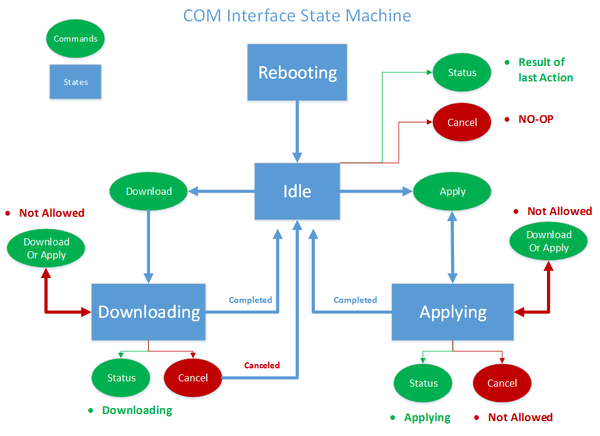

# <a name="integrating-manageability-applications-with-microsoft-365-apps-click-to-run-installer"></a><span data-ttu-id="01634-103">Интеграция приложений управляемости с Приложения Microsoft 365 установки click-to-Run</span><span class="sxs-lookup"><span data-stu-id="01634-103">Integrating manageability applications with Microsoft 365 Apps Click-to-Run installer</span></span>

<span data-ttu-id="01634-104">Узнайте, как интегрировать Приложения Microsoft 365 установки click-to-Run с решением управления программным обеспечением.</span><span class="sxs-lookup"><span data-stu-id="01634-104">Learn how to integrate the Microsoft 365 Apps Click-to-Run installer with a software management solution.</span></span>
  
<span data-ttu-id="01634-105">Установщик Приложения Microsoft 365 Click-to-Run предоставляет интерфейс COM, который позволяет ИТ-специалистам и программным решениям управления программным управлением управлять управлением обновлениями.</span><span class="sxs-lookup"><span data-stu-id="01634-105">The Microsoft 365 Apps Click-to-Run installer provides a COM interface that allows IT Professionals and software management solutions programmatic control over update management.</span></span> <span data-ttu-id="01634-106">Этот интерфейс предоставляет дополнительные возможности управления за пределами того, что предоставляет Office средство развертывания.</span><span class="sxs-lookup"><span data-stu-id="01634-106">This interface provides additional management capabilities beyond what is provided by the Office Deployment Tool.</span></span>
  
> [!NOTE]
> <span data-ttu-id="01634-107">Эта статья применяется к Office приложениям, которые используют установщик click-to-Run.</span><span class="sxs-lookup"><span data-stu-id="01634-107">This article applies to Office apps that use the Click-to-Run installer.</span></span> 
  
## <a name="integrating-with-the-click-to-run"></a><span data-ttu-id="01634-108">Интеграция с click-to-Run</span><span class="sxs-lookup"><span data-stu-id="01634-108">Integrating with the Click-to-Run</span></span>

<span data-ttu-id="01634-109">Для использования этого интерфейса приложение управляемости вызывает интерфейс COM и вызывает открытые API, которые напрямую взаимодействуют со службой установки Click-to-Run.</span><span class="sxs-lookup"><span data-stu-id="01634-109">To use this interface, a manageability application invokes the COM interface and calls exposed APIs that communicate directly with the Click-to-Run installation service.</span></span> 
  
> [!NOTE]
> <span data-ttu-id="01634-110">Установка Office click-to-Run может запускаться из командной строки с параметрами, которые могут управлять поведением, как описано в Office Средство развертывания для [click-to-Run](https://docs.microsoft.com/DeployOffice/overview-office-deployment-tool).</span><span class="sxs-lookup"><span data-stu-id="01634-110">The Office Click-to-Run installer can be run from the command-line with parameters that can control the behavior, as documented in [Office Deployment Tool for Click-to-Run](https://docs.microsoft.com/DeployOffice/overview-office-deployment-tool).</span></span> 
  
<span data-ttu-id="01634-111">**Ниже приведена концептуальная схема интерфейса COM**</span><span class="sxs-lookup"><span data-stu-id="01634-111">**Following is a conceptual diagram of the COM interface**</span></span>

<span data-ttu-id="01634-112"></span><span class="sxs-lookup"><span data-stu-id="01634-112"></span></span>
  
<span data-ttu-id="01634-113">Установщик Приложения Microsoft 365 click-to-Run реализует интерфейс на основе **COM, IUpdateNotify,** зарегистрированный в CLSID **CLSID_UpdateNotifyObject.**</span><span class="sxs-lookup"><span data-stu-id="01634-113">The Microsoft 365 Apps Click-to-Run installer implements a COM-based interface, **IUpdateNotify** registered to CLSID **CLSID_UpdateNotifyObject**.</span></span>
  
<span data-ttu-id="01634-114">Этот интерфейс можно вызвать следующим образом:</span><span class="sxs-lookup"><span data-stu-id="01634-114">This interface can be invoked as follows:</span></span>
  
```cpp
hr = CoCreateInstance(CLSID_UpdateNotifyObject, NULL, CLSCTX_ALL,
       IID_IUpdateNotify, 
      (void **)&p); 
```

<span data-ttu-id="01634-115">Вызов будет успешным только в том случае, если вызываемая будет работать с повышенными привилегиями, так как программа установки Click-to-Run должна быть запущена с повышенными привилегиями.</span><span class="sxs-lookup"><span data-stu-id="01634-115">The call will only succeed if the caller is running under elevated privileges, as the Click-to-Run installation program must be run with elevated privileges.</span></span>
  
<span data-ttu-id="01634-116">Интерфейс **IUpdateNotify** COM предоставляет три асинхронные функции, отвечающие за проверку команд и параметров и планирование выполнения с помощью службы установки Click-to-Run.</span><span class="sxs-lookup"><span data-stu-id="01634-116">The **IUpdateNotify** COM interface exposes three asynchronous functions responsible for validating the commands and parameters and scheduling execution with the Click-to-Run installation service.</span></span> 
  
```cpp
HRESULT Download([in] LPWSTR pcwszParameters) // Download update content.
HRESULT Apply([in] LPWSTR pcwszParameters) // Apply update content.
HRESULT Cancel() // Cancel the download action.

```

<span data-ttu-id="01634-117">Способ "Состояние" можно использовать для получения сведений о состоянии последней выполненной команды или состоянии исполняемой в настоящее время команды (например, успех, сбой, подробные коды ошибок). </span><span class="sxs-lookup"><span data-stu-id="01634-117">A forth method, **Status**, can be used to get information about the status of the last executed command or the status of the currently executing command (i.e. success, failure, detailed error codes).</span></span>
  
```cpp
HRESULT status([out] _UPDATE_STATUS_REPORT* pUpdateStatusReport) // Get status of current action. 
typedef struct _UPDATE_STATUS_REPORT  
{  
UPDATE_STATUS status;  
UINT error; 
BSTR contentid;  
} UPDATE_STATUS_REPORT;

```

<span data-ttu-id="01634-118">Существует четыре состояния, в которых служба установки Click-to-Run может быть в течение жизненного цикла, во время которого могут быть вызваны методы **IUpdateNotify;** Перезагрузка, простое, загрузка и применение.</span><span class="sxs-lookup"><span data-stu-id="01634-118">There are four states that the Click-to-Run installation service may be in during its lifecycle, during which **IUpdateNotify** methods may be called; Rebooting, Idle, Downloading and Applying.</span></span> 
  
<span data-ttu-id="01634-119">**Ниже приведена схема состояния интерфейса COM**</span><span class="sxs-lookup"><span data-stu-id="01634-119">**Following is the COM Interface State Machine diagram**</span></span>

<span data-ttu-id="01634-120"></span><span class="sxs-lookup"><span data-stu-id="01634-120"></span></span>
  
> [!NOTE]
> <span data-ttu-id="01634-121">**Перезагрузка.** При загрузке компьютера существует период времени, когда служба установки click-to-Run недоступна.</span><span class="sxs-lookup"><span data-stu-id="01634-121">**Rebooting**: When the machine is booting there is a period of time when the Click-to-Run installer service is not available.</span></span> <span data-ttu-id="01634-122">Успешный вызов метода Status после перезагрузки возвращает eUPDATE_UNKNOWN.</span><span class="sxs-lookup"><span data-stu-id="01634-122">A successful call to the Status method after a reboot will return eUPDATE_UNKNOWN.</span></span> 
  
<span data-ttu-id="01634-123">**Простое:** Если установщик click-to-Run находится в состоянии простоя, можно вызвать:</span><span class="sxs-lookup"><span data-stu-id="01634-123">**Idle:** When the Click-to-Run installer is in the idle state, you can call:</span></span> 
  
- <span data-ttu-id="01634-124">**Применение:** Установка ранее загруженного контента.</span><span class="sxs-lookup"><span data-stu-id="01634-124">**Apply**: Install previously downloaded content.</span></span>
    
- <span data-ttu-id="01634-125">**Отмена:**  `0x800000e` возвращается, "метод был вызван в неожиданное время".</span><span class="sxs-lookup"><span data-stu-id="01634-125">**Cancel**: Returns  `0x800000e`, "A method was called at an unexpected time."</span></span>
    
- <span data-ttu-id="01634-126">**Загрузка.** Загружает новый контент для более поздней установки клиента.</span><span class="sxs-lookup"><span data-stu-id="01634-126">**Download**: Downloads new content to the client for later installation.</span></span>
    
- <span data-ttu-id="01634-127">**Состояние.** Возвращает результат последнего выполненного действия или сообщение об ошибке, если действие завершилось сбоем.</span><span class="sxs-lookup"><span data-stu-id="01634-127">**Status**: Returns the result of the last completed action, or an error message if the action ended in failure.</span></span> <span data-ttu-id="01634-128">Если предыдущего действия не было, **возвращается**  `eUPDATE_UNKNOWN` состояние.</span><span class="sxs-lookup"><span data-stu-id="01634-128">If there is no previous action, **Status** returns  `eUPDATE_UNKNOWN`.</span></span>
    
<span data-ttu-id="01634-129">**Загрузка:** Когда установщик click-to-Run находится в состоянии загрузки, можно вызвать:</span><span class="sxs-lookup"><span data-stu-id="01634-129">**Downloading:** When the Click-to-Run installer is in the downloading state, you can call:</span></span> 
  
- <span data-ttu-id="01634-130">**Применение.** Возвращает **HRESULT** со значением  `0x800000e` "Метод был вызван в неожиданное время".</span><span class="sxs-lookup"><span data-stu-id="01634-130">**Apply**: Returns an **HRESULT** with the value  `0x800000e`, "A method was called at an unexpected time."</span></span>
    
- <span data-ttu-id="01634-131">**Отмена:** останавливает скачивание и удаляет частично загруженный контент.</span><span class="sxs-lookup"><span data-stu-id="01634-131">**Cancel**: Stops the download and removes the partially downloaded content.</span></span>
    
- <span data-ttu-id="01634-132">**Загрузка:** возвращает **HRESULT** со значением  `0x800000e` "Метод был вызван в неожиданное время".</span><span class="sxs-lookup"><span data-stu-id="01634-132">**Download**: Returns an **HRESULT** with the value  `0x800000e`, "A method was called at an unexpected time."</span></span> 
    
- <span data-ttu-id="01634-133">**Состояние.** **Возвращает DOWNLOAD_WIP,** чтобы указать, что работа по загрузке находится в процессе.</span><span class="sxs-lookup"><span data-stu-id="01634-133">**Status**: Returns **DOWNLOAD_WIP** to indicate that download work is in progress.</span></span> 
    
<span data-ttu-id="01634-134">**Применение:** Когда установщик click-to-Run находится в процессе установки ранее скачиваемого контента:</span><span class="sxs-lookup"><span data-stu-id="01634-134">**Applying:** When the Click-to-Run installer is in the process of installing previously download content:</span></span> 
  
- <span data-ttu-id="01634-135">**Применение.** Возвращает **HRESULT** со значением  `0x800000e` "Метод был вызван в неожиданное время".</span><span class="sxs-lookup"><span data-stu-id="01634-135">**Apply**: Returns an **HRESULT** with the value  `0x800000e`, "A method was called at an unexpected time."</span></span>
    
- <span data-ttu-id="01634-136">**Отмена:**  `0x800000e` возвращается, действие Apply не может быть отменено.</span><span class="sxs-lookup"><span data-stu-id="01634-136">**Cancel**: Returns  `0x800000e`, the Apply action cannot be canceled.</span></span>
    
- <span data-ttu-id="01634-137">**Загрузка:** возвращает **HRESULT** со значением  `0x800000e` "Метод был вызван в неожиданное время".</span><span class="sxs-lookup"><span data-stu-id="01634-137">**Download**: Returns an **HRESULT** with the value  `0x800000e`, "A method was called at an unexpected time."</span></span> 
    
- <span data-ttu-id="01634-138">**Состояние.** **Возвращает APPLY_WIP,** чтобы указать, что работа по применении продолжается.</span><span class="sxs-lookup"><span data-stu-id="01634-138">**Status**: Returns **APPLY_WIP** to indicate that apply work is in progress.</span></span> 
    
> [!NOTE]
> <span data-ttu-id="01634-139">Так как OfficeC2RCOM является службой COM+ и динамически загружена, необходимо вызывать **CoCreateInstance** каждый раз при вызове метода в этом классе, чтобы обеспечить ожидаемый результат.</span><span class="sxs-lookup"><span data-stu-id="01634-139">Since OfficeC2RCOM is a COM+ service and is dynamically loaded, you need to call **CoCreateInstance** every time you call a method on this class to ensure that you get the expected result.</span></span> <span data-ttu-id="01634-140">Служба COM+ при необходимости будет обрабатывать создание нового экземпляра.</span><span class="sxs-lookup"><span data-stu-id="01634-140">The COM+ service will handle creating a new instance if necessary.</span></span> <span data-ttu-id="01634-141">Когда один из методов будет вызван впервые, com+ загрузит **объект IUpdateNotify** и запустит его в одном из dllhost.exe экземпляров.</span><span class="sxs-lookup"><span data-stu-id="01634-141">When one of the methods is called for the first time, COM+ will load the **IUpdateNotify** object and run it within one of the dllhost.exe instances.</span></span> <span data-ttu-id="01634-142">Новый объект будет оставаться активным в течение примерно 3 минут в простое.</span><span class="sxs-lookup"><span data-stu-id="01634-142">The new object will stay active for about 3 minutes in idle.</span></span> <span data-ttu-id="01634-143">Если последующий вызов будет выполнен в течение трех минут после последнего вызова, **объект IUpdateNotify** будет загружен и новый экземпляр не создается.</span><span class="sxs-lookup"><span data-stu-id="01634-143">If a subsequent call is made within three minutes of the last call, the **IUpdateNotify** object will remain loaded and a new instance is not created.</span></span> <span data-ttu-id="01634-144">Если в течение трех минут не будет выполнен вызов, объект IUpdateNotify будет выгружен и при следующем вызове будет создан новый **объект IUpdateNotify.**</span><span class="sxs-lookup"><span data-stu-id="01634-144">If no call is made within three minutes, the IUpdateNotify object will be unloaded and a new **IUpdateNotify** object will be created when the next call is made.</span></span> 
  
## <a name="click-to-run-installer-com-api-reference-guide"></a><span data-ttu-id="01634-145">Руководство по установке COM API для установки на кнопку мыши</span><span class="sxs-lookup"><span data-stu-id="01634-145">Click-to-Run installer COM API reference guide</span></span>

<span data-ttu-id="01634-146">В следующей справочной документации API:</span><span class="sxs-lookup"><span data-stu-id="01634-146">In the following API reference documentation:</span></span>
  
- <span data-ttu-id="01634-147">Параметры находятся в формате пары ключ/значение, разделенных пробелом.</span><span class="sxs-lookup"><span data-stu-id="01634-147">Parameters are in a key/value pair format separated by a space.</span></span>
    
- <span data-ttu-id="01634-148">Параметры не являются чувствительными к делу.</span><span class="sxs-lookup"><span data-stu-id="01634-148">The parameters are not case-sensitive.</span></span>
    
- <span data-ttu-id="01634-149">Существует список [параметров с](https://blogs.technet.microsoft.com/odsupport/2014/03/03/the-new-update-now-feature-for-office-2013-click-to-run-for-office365-and-its-associated-command-line-and-switches/) документацией.</span><span class="sxs-lookup"><span data-stu-id="01634-149">There is a [list of parameters](https://blogs.technet.microsoft.com/odsupport/2014/03/03/the-new-update-now-feature-for-office-2013-click-to-run-for-office365-and-its-associated-command-line-and-switches/) with documentation available.</span></span> 
    
- <span data-ttu-id="01634-150">Сводка интерфейса IUpdateNotify2 теперь включена.</span><span class="sxs-lookup"><span data-stu-id="01634-150">Summary of IUpdateNotify2 interface is now included.</span></span>
    
### <a name="apply"></a><span data-ttu-id="01634-151">Применить</span><span class="sxs-lookup"><span data-stu-id="01634-151">Apply</span></span>

```cpp
HRESULT Apply([in] LPWSTR pcwszParameters) // Apply update content.
```

#### <a name="parameters"></a><span data-ttu-id="01634-152">Parameters</span><span class="sxs-lookup"><span data-stu-id="01634-152">Parameters</span></span>

-  <span data-ttu-id="01634-153">_displaylevel_: **true,** чтобы показать состояние установки, в том числе ошибки, во время процесса обновления; **ложный,** чтобы скрыть состояние установки, в том числе ошибки, во время процесса обновления.</span><span class="sxs-lookup"><span data-stu-id="01634-153">_displaylevel_: **true** to show the installation status, including errors, during the update process; **false** to hide the installation status, including errors, during the update process.</span></span> <span data-ttu-id="01634-154">Значение по умолчанию: **false**.</span><span class="sxs-lookup"><span data-stu-id="01634-154">The default is **false**.</span></span>
    
-  <span data-ttu-id="01634-155">_forceappshutdown_ **:** true to force Office приложений, чтобы немедленно закрыться при запуске действия **Apply;** **ложный** сбой, если Office запущены приложения.</span><span class="sxs-lookup"><span data-stu-id="01634-155">_forceappshutdown_: **true** to force Office applications to shut down immediately when the **Apply** action is triggered; **false** to fail if any Office applications are running.</span></span> <span data-ttu-id="01634-156">Значение по умолчанию: **false**.</span><span class="sxs-lookup"><span data-stu-id="01634-156">The default is **false**.</span></span> <span data-ttu-id="01634-157">Дополнительные [сведения см.](#bk_ApplyRemark) в комментарии.</span><span class="sxs-lookup"><span data-stu-id="01634-157">See [Remarks](#bk_ApplyRemark) for more information.</span></span> 
    
  <span data-ttu-id="01634-158">Если любое Office приложение запускается при запуске действия **Apply,** действие **Apply,** как правило, не работает.</span><span class="sxs-lookup"><span data-stu-id="01634-158">If any Office application is running when the **Apply** action is triggered, the **Apply** action will usually fail.</span></span> <span data-ttu-id="01634-159">Переход к методу Apply приведет к тому, что `forceappshutdown=true` **служба OfficeClickToRun** немедленно отключит приложения и применит обновление. </span><span class="sxs-lookup"><span data-stu-id="01634-159">Passing  `forceappshutdown=true` to the **Apply** method will cause the **OfficeClickToRun** service to immediately shut down the applications and apply the update.</span></span> <span data-ttu-id="01634-160">В этом случае пользователь может испытывать потерю данных.</span><span class="sxs-lookup"><span data-stu-id="01634-160">The user may experience data loss in this case.</span></span> 
    
#### <a name="return-results"></a><span data-ttu-id="01634-161">Результаты возврата</span><span class="sxs-lookup"><span data-stu-id="01634-161">Return results</span></span>

|||
|:-----|:-----|
|<span data-ttu-id="01634-162">**S_OK**</span><span class="sxs-lookup"><span data-stu-id="01634-162">**S_OK**</span></span> <br/> |<span data-ttu-id="01634-163">Действие успешно отправлено в службу Click-To-Run для выполнения.</span><span class="sxs-lookup"><span data-stu-id="01634-163">Action was successfully submitted to the Click-To-Run service for execution.</span></span>  <br/> |
|<span data-ttu-id="01634-164">**E_ACCESSDENIED**</span><span class="sxs-lookup"><span data-stu-id="01634-164">**E_ACCESSDENIED**</span></span> <br/> |<span data-ttu-id="01634-165">Вызываемая не работает с повышенными привилегиями.</span><span class="sxs-lookup"><span data-stu-id="01634-165">The caller is not running with elevated privileges.</span></span>  <br/> |
|<span data-ttu-id="01634-166">**E_INVALIDARG**</span><span class="sxs-lookup"><span data-stu-id="01634-166">**E_INVALIDARG**</span></span> <br/> |<span data-ttu-id="01634-167">Были переданы недействительные параметры.</span><span class="sxs-lookup"><span data-stu-id="01634-167">Invalid parameters were passed.</span></span>  <br/> |
|<span data-ttu-id="01634-168">**E_ILLEGAL_METHOD_CALL**</span><span class="sxs-lookup"><span data-stu-id="01634-168">**E_ILLEGAL_METHOD_CALL**</span></span> <br/> |<span data-ttu-id="01634-169">Действие в настоящее время не разрешено.</span><span class="sxs-lookup"><span data-stu-id="01634-169">Action is not allowed at this time.</span></span> <span data-ttu-id="01634-170">Дополнительные [сведения см.](#bk_ApplyRemark) в комментарии.</span><span class="sxs-lookup"><span data-stu-id="01634-170">See [Remarks](#bk_ApplyRemark) for more information.</span></span>  <br/> |

<a name="bk_ApplyRemark"></a>

#### <a name="remarks"></a><span data-ttu-id="01634-171">Примечания</span><span class="sxs-lookup"><span data-stu-id="01634-171">Remarks</span></span>

- <span data-ttu-id="01634-172">Если любое Office запускается при запуске действия **Apply,** действие **Apply** не будет работать.</span><span class="sxs-lookup"><span data-stu-id="01634-172">If any Office application is running when the **Apply** action is triggered, the **Apply** action will fail.</span></span> <span data-ttu-id="01634-173">Переход к методу Apply приведет к немедленному отключению `forceappshutdown=true` **службы OfficeClickToRun** Office запущенных приложений и применению обновления. </span><span class="sxs-lookup"><span data-stu-id="01634-173">Passing  `forceappshutdown=true` to the **Apply** method will cause the **OfficeClickToRun** service to immediately shut down any Office applications that are running and apply the update.</span></span> <span data-ttu-id="01634-174">Пользователь может испытывать данные, так как им не предложено сохранить изменения в открытых документах..</span><span class="sxs-lookup"><span data-stu-id="01634-174">The user may experience data as they are not prompted to save changes to open documents..</span></span> 
    
- <span data-ttu-id="01634-175">Это действие может быть вызвано только в том случае, если состояние COM является одним из следующих:</span><span class="sxs-lookup"><span data-stu-id="01634-175">This action can only be triggered when the COM status is one of the following:</span></span> 
    
  - <span data-ttu-id="01634-176">**eUPDATE_UNKNOWN**</span><span class="sxs-lookup"><span data-stu-id="01634-176">**eUPDATE_UNKNOWN**</span></span>
    
  - <span data-ttu-id="01634-177">**eDOWNLOAD_CANCELLED**</span><span class="sxs-lookup"><span data-stu-id="01634-177">**eDOWNLOAD_CANCELLED**</span></span>
    
  - <span data-ttu-id="01634-178">**eDOWNLOAD_FAILED**</span><span class="sxs-lookup"><span data-stu-id="01634-178">**eDOWNLOAD_FAILED**</span></span>
    
  - <span data-ttu-id="01634-179">**eDOWNLOAD_SUCCEEDED**</span><span class="sxs-lookup"><span data-stu-id="01634-179">**eDOWNLOAD_SUCCEEDED**</span></span>
    
  - <span data-ttu-id="01634-180">**eAPPLY_SUCCEEDED**</span><span class="sxs-lookup"><span data-stu-id="01634-180">**eAPPLY_SUCCEEDED**</span></span>
    
  - <span data-ttu-id="01634-181">**eAPPLY_FAILED**</span><span class="sxs-lookup"><span data-stu-id="01634-181">**eAPPLY_FAILED**</span></span>
    
- <span data-ttu-id="01634-182">Если вы вызываете метод **Apply** без предварительной  загрузки контента, метод **Apply** будет сообщать о успешном применении, так как он не обнаружил ничего, чтобы применить и успешно завершил **процесс Применения.**</span><span class="sxs-lookup"><span data-stu-id="01634-182">If you call the **Apply** method without previously downloading content, the **Apply** method will report **Succeeded** as it detected nothing to apply and completed the **Apply** process successfully.</span></span> 
    
### <a name="cancel"></a><span data-ttu-id="01634-183">"Отмена"</span><span class="sxs-lookup"><span data-stu-id="01634-183">Cancel</span></span>

```cpp
HRESULT Cancel() // Cancel the download action.
```

#### <a name="return-results"></a><span data-ttu-id="01634-184">Результаты возврата</span><span class="sxs-lookup"><span data-stu-id="01634-184">Return results</span></span>

|||
|:-----|:-----|
|<span data-ttu-id="01634-185">S_OK</span><span class="sxs-lookup"><span data-stu-id="01634-185">S_OK</span></span>  <br/> |<span data-ttu-id="01634-186">Действие успешно отправлено в службу Click-to-Run для выполнения.</span><span class="sxs-lookup"><span data-stu-id="01634-186">Action was successfully submitted to the Click-to-Run service for execution.</span></span>  <br/> |
|<span data-ttu-id="01634-187">E_ILLEGAL_METHOD_CALL</span><span class="sxs-lookup"><span data-stu-id="01634-187">E_ILLEGAL_METHOD_CALL</span></span>  <br/> |<span data-ttu-id="01634-188">Действие в настоящее время не разрешено.</span><span class="sxs-lookup"><span data-stu-id="01634-188">Action is not allowed at this time.</span></span> <span data-ttu-id="01634-189">Дополнительные сведения [см. в](#bk_CancelRemarks) разделе Замечания</span><span class="sxs-lookup"><span data-stu-id="01634-189">See the [Remarks](#bk_CancelRemarks) section for more information</span></span>  <br/> |

<a name="bk_CancelRemarks"></a>

#### <a name="remarks"></a><span data-ttu-id="01634-190">Примечания</span><span class="sxs-lookup"><span data-stu-id="01634-190">Remarks</span></span>

- <span data-ttu-id="01634-191">Этот метод может быть срабатывает только при **eDOWNLOAD_WIP.**</span><span class="sxs-lookup"><span data-stu-id="01634-191">This method can only be triggered when the COM status id **eDOWNLOAD_WIP**.</span></span> <span data-ttu-id="01634-192">Он попытается отменить текущее действие загрузки.</span><span class="sxs-lookup"><span data-stu-id="01634-192">It will attempt to cancel the current download action.</span></span> <span data-ttu-id="01634-193">Состояние COM изменится на **eDOWNLOAD_CANCELLING** и в конечном итоге изменится на **eDOWNLOAD_CANCELED**.</span><span class="sxs-lookup"><span data-stu-id="01634-193">The COM status will change to **eDOWNLOAD_CANCELLING** and eventually change to **eDOWNLOAD_CANCELED**.</span></span> <span data-ttu-id="01634-194">Состояние COM возвращается **E_ILLEGAL_METHOD_CALL** при срабатывии в любое другое время.</span><span class="sxs-lookup"><span data-stu-id="01634-194">The COM status will return **E_ILLEGAL_METHOD_CALL** if triggered at any other time.</span></span> 
    
### <a name="download"></a><span data-ttu-id="01634-195">Скачать</span><span class="sxs-lookup"><span data-stu-id="01634-195">Download</span></span>

```cpp
HRESULT Download([in] LPWSTR pcwszParameters) // Download update content.
```

#### <a name="parameters"></a><span data-ttu-id="01634-196">Parameters</span><span class="sxs-lookup"><span data-stu-id="01634-196">Parameters</span></span>

-  <span data-ttu-id="01634-197">_displaylevel_: **true,** чтобы показать состояние установки, в том числе ошибки, во время процесса обновления; **ложный,** чтобы скрыть состояние установки, в том числе ошибки, во время процесса обновления.</span><span class="sxs-lookup"><span data-stu-id="01634-197">_displaylevel_: **true** to show the installation status, including errors, during the update process; **false** to hide the installation status, including errors, during the update process.</span></span> <span data-ttu-id="01634-198">Значение по умолчанию: **false**.</span><span class="sxs-lookup"><span data-stu-id="01634-198">The default is **false**.</span></span>
    
-  <span data-ttu-id="01634-199">_updatebaseurl_: URL-адрес альтернативного источника загрузки.</span><span class="sxs-lookup"><span data-stu-id="01634-199">_updatebaseurl_: URL to the alternate download source.</span></span>
    
-  <span data-ttu-id="01634-200">_updatetoversion:_ версия для обновления Office.</span><span class="sxs-lookup"><span data-stu-id="01634-200">_updatetoversion_: The version to update Office to.</span></span> <span data-ttu-id="01634-201">Определите этот параметр, если вы хотите обновить до более старой версии, чем установленная в настоящее время версия.</span><span class="sxs-lookup"><span data-stu-id="01634-201">Define this parameter if you want to update to an older version than the version that is currently installed.</span></span>
    
-  <span data-ttu-id="01634-202">_downloadsource_: CLSID настраиваемой **реализации IBackgroundCopyManager** (bitS manager).</span><span class="sxs-lookup"><span data-stu-id="01634-202">_downloadsource_: CLSID of the customized **IBackgroundCopyManager** implementation (BITS manager).</span></span> 
    
-  <span data-ttu-id="01634-203">_contentid._ Определяет содержимое для скачивания с сервера контента с помощью настраиваемой диспетчера BITS.</span><span class="sxs-lookup"><span data-stu-id="01634-203">_contentid_: Identifies the content to download from the content server through the customized BITS manager.</span></span> <span data-ttu-id="01634-204">Это значение передается через интерфейс BITS для интерпретации.</span><span class="sxs-lookup"><span data-stu-id="01634-204">This value is passed through the BITS interface for interpretation.</span></span>
    
#### <a name="return-results"></a><span data-ttu-id="01634-205">Результаты возврата</span><span class="sxs-lookup"><span data-stu-id="01634-205">Return results</span></span>

|||
|:-----|:-----|
|<span data-ttu-id="01634-206">**S_OK**</span><span class="sxs-lookup"><span data-stu-id="01634-206">**S_OK**</span></span> <br/> |<span data-ttu-id="01634-207">Действие успешно отправлено в службу Click-To-Run для выполнения.</span><span class="sxs-lookup"><span data-stu-id="01634-207">Action was successfully submitted to the Click-To-Run service for execution.</span></span>  <br/> |
|<span data-ttu-id="01634-208">**E_ACCESSDENIED**</span><span class="sxs-lookup"><span data-stu-id="01634-208">**E_ACCESSDENIED**</span></span> <br/> |<span data-ttu-id="01634-209">Вызываемая не работает с повышенными привилегиями.</span><span class="sxs-lookup"><span data-stu-id="01634-209">The caller is not running with elevated privileges.</span></span>  <br/> |
|<span data-ttu-id="01634-210">**E_INVALIDARG**</span><span class="sxs-lookup"><span data-stu-id="01634-210">**E_INVALIDARG**</span></span> <br/> |<span data-ttu-id="01634-211">Были переданы недействительные параметры.</span><span class="sxs-lookup"><span data-stu-id="01634-211">Invalid parameters were passed.</span></span>  <br/> |
|<span data-ttu-id="01634-212">**E_ILLEGAL_METHOD_CALL**</span><span class="sxs-lookup"><span data-stu-id="01634-212">**E_ILLEGAL_METHOD_CALL**</span></span> <br/> |<span data-ttu-id="01634-213">Действие в настоящее время не разрешено.</span><span class="sxs-lookup"><span data-stu-id="01634-213">Action is not allowed at this time.</span></span> <span data-ttu-id="01634-214">Дополнительные [сведения см.](#bk_DownloadRemark) в комментарии.</span><span class="sxs-lookup"><span data-stu-id="01634-214">See [Remarks](#bk_DownloadRemark) for more information.</span></span>  <br/> |

<a name="bk_DownloadRemark"></a>

#### <a name="remarks"></a><span data-ttu-id="01634-215">Примечания</span><span class="sxs-lookup"><span data-stu-id="01634-215">Remarks</span></span>

- <span data-ttu-id="01634-216">Необходимо  _указать downloadsource_ и  _contentid_ в качестве пары.</span><span class="sxs-lookup"><span data-stu-id="01634-216">You must specify  _downloadsource_ and  _contentid_ as a pair.</span></span> <span data-ttu-id="01634-217">Если нет, метод **Загрузка** возвращает E_INVALIDARG **ошибку.**</span><span class="sxs-lookup"><span data-stu-id="01634-217">If not, the **Download** method will return an **E_INVALIDARG** error.</span></span> 
    
- <span data-ttu-id="01634-218">Если  _будут предоставлены downloadsource,_  _contentid_ и  _updatebaseurl,_  _updatebaseurl_ будет игнорироваться.</span><span class="sxs-lookup"><span data-stu-id="01634-218">If  _downloadsource_,  _contentid_, and  _updatebaseurl_ are provided,  _updatebaseurl_ will be ignored.</span></span> 
    
- <span data-ttu-id="01634-219">Это действие может быть вызвано только в том случае, если состояние COM является одним из следующих:</span><span class="sxs-lookup"><span data-stu-id="01634-219">This action can only be triggered when the COM status is one of the following:</span></span> 
    
  - <span data-ttu-id="01634-220">**eUPDATE_UNKNOWN**</span><span class="sxs-lookup"><span data-stu-id="01634-220">**eUPDATE_UNKNOWN**</span></span>
    
  - <span data-ttu-id="01634-221">**eDOWNLOAD_CANCELLED**</span><span class="sxs-lookup"><span data-stu-id="01634-221">**eDOWNLOAD_CANCELLED**</span></span>
    
  - <span data-ttu-id="01634-222">**eDOWNLOAD_FAILED**</span><span class="sxs-lookup"><span data-stu-id="01634-222">**eDOWNLOAD_FAILED**</span></span>
    
  - <span data-ttu-id="01634-223">**eDOWNLOAD_SUCCEEDED**</span><span class="sxs-lookup"><span data-stu-id="01634-223">**eDOWNLOAD_SUCCEEDED**</span></span>
    
  - <span data-ttu-id="01634-224">**eAPPLY_SUCCEEDED**</span><span class="sxs-lookup"><span data-stu-id="01634-224">**eAPPLY_SUCCEEDED**</span></span>
    
  - <span data-ttu-id="01634-225">**eAPPLY_FAILED**</span><span class="sxs-lookup"><span data-stu-id="01634-225">**eAPPLY_FAILED**</span></span>
    
- <span data-ttu-id="01634-226">Если вы позвоните **методу Apply** без ранее скачаного контента, метод **Apply** будет сообщать о успешном применении, так как он не обнаружил ничего, чтобы применить и успешно завершил процесс **Применения.** </span><span class="sxs-lookup"><span data-stu-id="01634-226">If you call the **Apply** method without previously downloaded content, the **Apply** method will report **Succeeded** as it detected nothing to apply and completed the **Apply** process successfully.</span></span> 
    
#### <a name="examples"></a><span data-ttu-id="01634-227">Примеры</span><span class="sxs-lookup"><span data-stu-id="01634-227">Examples</span></span>

- <span data-ttu-id="01634-228">Чтобы скачать контент из настраиваемой диспетчера BITS: вызывайте функцию **загрузки()** при передаче следующих параметров:</span><span class="sxs-lookup"><span data-stu-id="01634-228">To download the content from the customized BITS manager: Call the **download()** function passing the following parameters:</span></span> 
    
  ```cpp
  "downloadsource=CLSIDofBITSInterface contentid=BITSServerContentIdentifier"
  ```

- <span data-ttu-id="01634-229">Чтобы скачать содержимое из Office сеть доставки содержимого (CDN): вызов функции **загрузки()** без указания параметров _downloadsource,_ _contentid_ или _updatebaseurl._</span><span class="sxs-lookup"><span data-stu-id="01634-229">To download the content from the Office Content Delivery Network (CDN): Call the **download()** function without specifying the  _downloadsource_,  _contentid_, or  _updatebaseurl_ parameters.</span></span> 
    
- <span data-ttu-id="01634-230">Чтобы скачать контент из настраиваемой локации: вызывайте функцию **загрузки()** при передаче следующего параметра:</span><span class="sxs-lookup"><span data-stu-id="01634-230">To download the content from a customized location: Call the **download()** function passing the following parameter:</span></span> 
    
  ```cpp
  "updatebaseurl=yourcontentserverurl"
  ```

### <a name="status"></a><span data-ttu-id="01634-231">Состояние</span><span class="sxs-lookup"><span data-stu-id="01634-231">Status</span></span>

```cpp
typdef struct _UPDATE_STATUS_REPORT
{
    UPDATE_STATUS status;
    UINT error;
    LPCWSTR contentid;
}UPDATE_STATUS_REPORT;
HRESULT status([out] _UPDATE_STATUS_REPORT& pUpdateStatusReport) // Get status of current action
```

#### <a name="parameters"></a><span data-ttu-id="01634-232">Parameters</span><span class="sxs-lookup"><span data-stu-id="01634-232">Parameters</span></span>

|||
|:-----|:-----|
| <span data-ttu-id="01634-233">_pUpdateStatusReport_</span><span class="sxs-lookup"><span data-stu-id="01634-233">_pUpdateStatusReport_</span></span> <br/> |<span data-ttu-id="01634-234">Указатель на структуру UPDATE_STATUS_REPORT.</span><span class="sxs-lookup"><span data-stu-id="01634-234">Pointer to an UPDATE_STATUS_REPORT structure.</span></span>  <br/> |
   
#### <a name="return-results"></a><span data-ttu-id="01634-235">Результаты возврата</span><span class="sxs-lookup"><span data-stu-id="01634-235">Return results</span></span>

|||
|:-----|:-----|
|<span data-ttu-id="01634-236">**S_OK**</span><span class="sxs-lookup"><span data-stu-id="01634-236">**S_OK**</span></span> <br/> |<span data-ttu-id="01634-237">Метод **Status** всегда возвращает этот результат.</span><span class="sxs-lookup"><span data-stu-id="01634-237">The **Status** method always returns this result.</span></span> <span data-ttu-id="01634-238">Проверьте  `UPDATE_STATUS_RESULT` структуру на состояние текущего действия.</span><span class="sxs-lookup"><span data-stu-id="01634-238">Inspect the  `UPDATE_STATUS_RESULT` structure for the status of the current action.</span></span>  <br/> |
   
#### <a name="remarks"></a><span data-ttu-id="01634-239">Примечания</span><span class="sxs-lookup"><span data-stu-id="01634-239">Remarks</span></span>

- <span data-ttu-id="01634-240">Поле состояния содержит  `UPDATE_STATUS_REPORT` состояние текущего действия.</span><span class="sxs-lookup"><span data-stu-id="01634-240">The status field of the  `UPDATE_STATUS_REPORT` contains the status of the current action.</span></span> <span data-ttu-id="01634-241">Возвращается одно из следующих значений состояния:</span><span class="sxs-lookup"><span data-stu-id="01634-241">One of the following status values is returned:</span></span> 
    
  ```cpp
  typedef enum _UPDATE_STATUS
  {
  eUPDATE_UNKNOWN = 0,
  eDOWNLOAD_PENDING,
  eDOWNLOAD_WIP,
  eDOWNLOAD_CANCELLING,
  eDOWNLOAD_CANCELLED,
  eDOWNLOAD_FAILED,
  eDOWNLOAD_SUCCEEDED,
  eAPPLY_PENDING,
  eAPPLY_WIP,
  eAPPLY_SUCCEEDED,
  eAPPLY_FAILED,
  } UPDATE_STATUS;
  
  ```

- <span data-ttu-id="01634-242">Если последняя команда приводит к ошибке, поле ошибки содержит подробные  `UPDATE_STATUS_REPORT` сведения об ошибке.</span><span class="sxs-lookup"><span data-stu-id="01634-242">If the last command resulted in an error, the error field of the  `UPDATE_STATUS_REPORT` contains detailed information about the error.</span></span> <span data-ttu-id="01634-243">Из метода Status возвращаются два  типа кодов ошибок.</span><span class="sxs-lookup"><span data-stu-id="01634-243">Two types of error codes are returned from the **Status** method.</span></span> 
    
- <span data-ttu-id="01634-244">Если ошибка меньше, ошибка является одним из следующих  `UPDATE_ERROR_CODE::eUNKNOWN` заранее определенных кодов ошибок:</span><span class="sxs-lookup"><span data-stu-id="01634-244">If the error less than  `UPDATE_ERROR_CODE::eUNKNOWN`, the error is one of the following pre-defined error codes:</span></span>
    
  ```cpp
  typedef enum _UPDATE_ERROR_CODE
  {
  eOK = 0,
  eFAILED_UNEXPECTED,
  eTRIGGER_DISABLED,
  ePIPELINE_IN_USE,
  eFAILED_STOP_C2RSERVICE,
  eFAILED_GET_CLIENTUPDATEFOLDER,
  eFAILED_LOCK_PACKAGE_TO_UPDATE,
  eFAILED_CREATE_STREAM_SESSION,
  eFAILED_PUBLISH_WORKING_CONFIGURATION,
  eFAILED_DOWNLOAD_UPGRADE_PACKAGE,
  eFAILED_APPLY_UPGRADE_PACKAGE,
  eFAILED_INITIALIZE_RSOD,
  eFAILED_PUBLISH_RSOD,
  // Keep this one as the last
  eUNKNOWN
  } UPDATE_ERROR_CODE;
  
  ```

  <span data-ttu-id="01634-245">Если код возвращаемой ошибки больше, чем  `UPDATE_ERROR_CODE::eUNKNOWN` **HRESULT** неудачного вызова функции.</span><span class="sxs-lookup"><span data-stu-id="01634-245">If the return error code is larger than  `UPDATE_ERROR_CODE::eUNKNOWN` it is the **HRESULT** of a failed function call.</span></span> <span data-ttu-id="01634-246">Извлечение вычитания HRESULT из значения, возвращаемого в поле  `UPDATE_ERROR_CODE::eUNKNOWN` ошибки  `UPDATE_STATUS_REPORT` .</span><span class="sxs-lookup"><span data-stu-id="01634-246">To extract the HRESULT subtract  `UPDATE_ERROR_CODE::eUNKNOWN` from the value returned in the error field of the  `UPDATE_STATUS_REPORT`.</span></span>
    
  <span data-ttu-id="01634-247">Полный список значений состояния и ошибок можно просмотреть, проверив библиотеку типов **IUpdateNotify,** встроенную в OfficeC2RCom.dll.</span><span class="sxs-lookup"><span data-stu-id="01634-247">The complete list of status and error values can be viewed by inspecting the **IUpdateNotify** type library embedded in OfficeC2RCom.dll.</span></span> 
    
- <span data-ttu-id="01634-248">Контентное поле используется для  звонков  в состояние после начала загрузки и возвращает содержимое, переданное в вызов **Загрузка.**</span><span class="sxs-lookup"><span data-stu-id="01634-248">The contentid field is used for calls to **Status** after **Download** has initiated and returns the contentid that was passed in to the **Download** call.</span></span> <span data-ttu-id="01634-249">Перед вызовом метода Status лучше  всего инициализировать это поле, а  затем проверить значение после возврата состояния. </span><span class="sxs-lookup"><span data-stu-id="01634-249">It is a best practice to initialize this field to **null** before you call the **Status** method and then check the value after **Status** has been returned.</span></span> <span data-ttu-id="01634-250">Если значение по-прежнему **null,** это означает, что нет contentid, чтобы вернуться.</span><span class="sxs-lookup"><span data-stu-id="01634-250">If the value is still **null**, that means there is no contentid to return.</span></span> <span data-ttu-id="01634-251">Если значение не **null,** необходимо освободить его с помощью вызова **в SysFreeString()**.</span><span class="sxs-lookup"><span data-stu-id="01634-251">If the value is not **null**, you need to free it with a call to **SysFreeString()**.</span></span> <span data-ttu-id="01634-252">Вот фрагмент кода о том, как вызвать **состояние** после **загрузки**.</span><span class="sxs-lookup"><span data-stu-id="01634-252">Here is a code snippet of how to call **Status** after **Download**.</span></span>
    
  ```cpp
  std::wstring contentID;
  UPDATE_STATUS_REPORT statusReport;
  statusReport.status = eUPDATE_UNKNOWN;
  statusReport.error = eOK;
  statusReport.contentid = NULL;
  hr = p->Status(&statusReport);
  if (statusReport.contentid != NULL)
  {
  contentID = statusReport.contentid;
  SysFreeString(statusReport.contentid);
  }
  wprintf(L"ContentID: %s, Status: %d, LastError: %d", contentID.c_str(), statusReport.status, statusReport.error);
  
  ```

### <a name="summary-of-iupdatenotify2-interface"></a><span data-ttu-id="01634-253">Сводка интерфейса IUpdateNotify2</span><span class="sxs-lookup"><span data-stu-id="01634-253">Summary of IUpdateNotify2 interface</span></span>

<span data-ttu-id="01634-254">Из версии [16.0.8208.6352] мы добавили новый **интерфейс IUpdateNotify2.**</span><span class="sxs-lookup"><span data-stu-id="01634-254">From version [16.0.8208.6352] we have added a new **IUpdateNotify2** interface.</span></span> 
  
- <span data-ttu-id="01634-255">CLSID_UpdateNotifyObject2{52C2F9C2-F1AC-4021-BF50-756A5FA8DDFE}</span><span class="sxs-lookup"><span data-stu-id="01634-255">CLSID_UpdateNotifyObject2, {52C2F9C2-F1AC-4021-BF50-756A5FA8DDFE}</span></span>
    
- <span data-ttu-id="01634-256">В этом интерфейсе также был организован оригинальный интерфейс IUpdateNotify для обеспечения обратной совместимости.</span><span class="sxs-lookup"><span data-stu-id="01634-256">This interface also hosted the original IUpdateNotify interface to provide backward compatibility.</span></span> <span data-ttu-id="01634-257">Это означает, что при использовании этого интерфейса у вас есть доступ ко всем методам, предоставляемым в **интерфейсе UpdateNotifyObject.**</span><span class="sxs-lookup"><span data-stu-id="01634-257">Which means if you use this interface, you have access to all the methods provided in **UpdateNotifyObject** interface.</span></span> 
    
- <span data-ttu-id="01634-258">Новые методы, добавленные в IUpdateNotify2:</span><span class="sxs-lookup"><span data-stu-id="01634-258">New methods added to IUpdateNotify2:</span></span>
    
  - <span data-ttu-id="01634-259">**HRESULT** GetBlockingApps ([out] BSTR \* AppsList).</span><span class="sxs-lookup"><span data-stu-id="01634-259">**HRESULT** GetBlockingApps([out] BSTR \* AppsList).</span></span> <span data-ttu-id="01634-260">Получать обновления, блокирующие список приложений.</span><span class="sxs-lookup"><span data-stu-id="01634-260">Get updates blocking apps list.</span></span> <span data-ttu-id="01634-261">Этот вызов возвращает запущенные Office приложения, которые будут блокировать процесс обновления.</span><span class="sxs-lookup"><span data-stu-id="01634-261">This call will return running Office apps which will block the update process from proceeding.</span></span> 
    
  - <span data-ttu-id="01634-262">**HRESULT** GetOfficeDeploymentData([in] int dataType, [in] **LPCWSTR** pcwszName, [out] BSTR \* OfficeData).</span><span class="sxs-lookup"><span data-stu-id="01634-262">**HRESULT** GetOfficeDeploymentData([in] int dataType, [in] **LPCWSTR** pcwszName, [out] BSTR \* OfficeData).</span></span> <span data-ttu-id="01634-263">Получите Office развертывания.</span><span class="sxs-lookup"><span data-stu-id="01634-263">Get Office deployment Data.</span></span> 
    
- <span data-ttu-id="01634-264">Если вы хотите использовать новые методы, необходимо убедиться:</span><span class="sxs-lookup"><span data-stu-id="01634-264">If you want to use the new methods, you need to make sure:</span></span>
    
  - <span data-ttu-id="01634-265">Ваша версия C2R является более новой, чем выше сборка \> (= сборка вилок июня).</span><span class="sxs-lookup"><span data-stu-id="01634-265">Your C2R version is newer than the above build (\>= June fork build).</span></span>
    
  - <span data-ttu-id="01634-266">Используйте UpdateNotifyObject2 вместо **UpdateNotifyObject** для вызова **CoCreateInstance.**</span><span class="sxs-lookup"><span data-stu-id="01634-266">Use UpdateNotifyObject2, instead of **UpdateNotifyObject** to call **CoCreateInstance**.</span></span>
    
<span data-ttu-id="01634-267">Если вы не используете ни один из новых методов, вам не нужно ничего менять.</span><span class="sxs-lookup"><span data-stu-id="01634-267">If you don't use any of the new methods, you don't need to change anything.</span></span> <span data-ttu-id="01634-268">Все существующие методы будут работать точно так же, как и раньше.</span><span class="sxs-lookup"><span data-stu-id="01634-268">All the existing methods will work as exact the same way as before.</span></span>
  
## <a name="implementing-the-bits-interface"></a><span data-ttu-id="01634-269">Реализация интерфейса BITS</span><span class="sxs-lookup"><span data-stu-id="01634-269">Implementing the BITS interface</span></span>

<span data-ttu-id="01634-270">The [Background Intelligent Transfer Service](https://docs.microsoft.com/windows/win32/bits/background-intelligent-transfer-service-portal) (BITS) — это служба, предоставляемая Корпорацией Майкрософт для передачи файлов между клиентом и сервером.</span><span class="sxs-lookup"><span data-stu-id="01634-270">The [Background Intelligent Transfer Service](https://docs.microsoft.com/windows/win32/bits/background-intelligent-transfer-service-portal) (BITS) is a service provided by Microsoft to transfer files between a client and server.</span></span> <span data-ttu-id="01634-271">BITS — один из каналов, Office установки click-To-Run можно использовать для скачивания контента.</span><span class="sxs-lookup"><span data-stu-id="01634-271">BITS is one of the channels that Office Click-To-Run installer can use to download content.</span></span> <span data-ttu-id="01634-272">По умолчанию Приложения Microsoft 365 установки click-To-Run использует встроенный Windows в реализации BITS для загрузки контента из CDN.</span><span class="sxs-lookup"><span data-stu-id="01634-272">By default, the Microsoft 365 Apps Click-To-Run installer uses the Windows' built in implementation of BITS to download the content from the CDN.</span></span> 
  
<span data-ttu-id="01634-273">Предоставляя настраиваемую реализацию BITS методу загрузки **интерфейса** **IUpdateNotify,** программное обеспечение управляемости может контролировать, где и как клиент загружает контент.</span><span class="sxs-lookup"><span data-stu-id="01634-273">By providing a customized BITS implementation to the **download()** method of the **IUpdateNotify** interface, your manageability software can control where and how the client downloads the content.</span></span> <span data-ttu-id="01634-274">Настраиваемый интерфейс BITS полезен при предоставлении настраиваемого канала распространения контента, кроме встроенных каналов Click-to-Run, таких как серверы CDN, IIS-серверы или файлы.</span><span class="sxs-lookup"><span data-stu-id="01634-274">A customized BITS interface is useful when providing a custom content distribution channel other than the Click-to-Run built-in channels, such as the CDN, IIS servers, or file shares.</span></span> 
  
<span data-ttu-id="01634-275">Минимальное требование к настраиваемом интерфейсу BITS для работы с Office C2R-службой:</span><span class="sxs-lookup"><span data-stu-id="01634-275">The minimum requirement for a customized BITS interface to work with Office C2R service is:</span></span>
  
- <span data-ttu-id="01634-276">Для **IBackgroundCopyManager:**</span><span class="sxs-lookup"><span data-stu-id="01634-276">For **IBackgroundCopyManager**:</span></span>
    
  ```cpp
  HRESULT _stdcall CreateJob(
                      [in] LPWSTR DisplayName, 
                      [in] BG_JOB_TYPE Type, 
                      [out] GUID* pJobId, 
                      [out] IBackgroundCopyJob** ppJob)
  HRESULT _stdcall GetJob(
                      [in] GUID* jobID, 
                      [out] IBackgroundCopyJob** ppJob)
  HRESULT _stdcall EnumJobs(
                      [in] unsigned long dwFlags, 
                      [out] IEnumBackgroundCopyJobs** ppenum)
  
  ```

- <span data-ttu-id="01634-277">Для **IBackgroundCopyJob**:</span><span class="sxs-lookup"><span data-stu-id="01634-277">For **IBackgroundCopyJob**:</span></span>
    
  ```cpp
  HRESULT _stdcall AddFile(
                      [in] LPWSTR RemoteUrl, 
                      [in] LPWSTR LocalName)
  HRESULT _stdcall Resume()
  HRESULT _stdcall Complete()
  HRESULT _stdcall Cancel();
  HRESULT _stdcall GetState([out] BG_JOB_STATE* pVal);
  HRESULT GetProgress( [out] BG_JOB_PROGRESS *pProgress);
  
  ```

- <span data-ttu-id="01634-278">Для **IBackgroundCopyJob3**:</span><span class="sxs-lookup"><span data-stu-id="01634-278">For **IBackgroundCopyJob3**:</span></span>
    
  ```cpp
  HRESULT _stdcall AddFileWithRanges(
                      [in] LPWSTR RemoteUrl, 
                      [in] LPWSTR LocalName,
                      [in] DWORD RangeCount,
                      [in] BG_FILE_RANGE Ranges[])
  
  ```

- <span data-ttu-id="01634-279">Для  `Addfile`  `AddFileWithRanges` функций удаленный URL-адрес находится в следующем формате:</span><span class="sxs-lookup"><span data-stu-id="01634-279">For the  `Addfile` and  `AddFileWithRanges` functions, the remote URL is in the following format:</span></span> 
    
  ```cpp
  cmbits://<contentid>/<relative path to target file>
  ```

  - <span data-ttu-id="01634-280">cmbits жестко закодировали и означает настраиваемые БИТЫ.</span><span class="sxs-lookup"><span data-stu-id="01634-280">cmbits is hard coded, and stands for customized BITS.</span></span>
    
  -  <span data-ttu-id="01634-281">_\<contentid\>_ является  _контентным параметром_ для метода **Download()** .</span><span class="sxs-lookup"><span data-stu-id="01634-281">_\<contentid\>_ is the  _contentid_ parameter for the **Download()** method.</span></span> 
    
  -  <span data-ttu-id="01634-282">_\<relative path to target file\>_ предоставляет расположение и имя файла для скачивания файла.</span><span class="sxs-lookup"><span data-stu-id="01634-282">_\<relative path to target file\>_ provides the location and file name of the file to download.</span></span> 
    
    <span data-ttu-id="01634-283">Например, если вы предоставили контент для метода  Download() и Office C2R хочет скачать файл кабины версии, например файл, он будет вызывать `f732af58-5d86-4299-abe9-7595c35136ef`  `v32.cab` **AddFile()** со следующими: `RemoteUrl`</span><span class="sxs-lookup"><span data-stu-id="01634-283">For example, if you have provided a  _contentid_ of  `f732af58-5d86-4299-abe9-7595c35136ef` to the **Download()** method, and Office C2R wants to download the version cab file, such as  `v32.cab` file, it will call **AddFile()** with the following  `RemoteUrl`:</span></span>
    
  ```cpp
  cmbits://f732af58-5d86-4299-abe9-7595c35136ef/Office/Data/V32.cab
  ```

- <span data-ttu-id="01634-284">Для **IBackgroundCopyError:**</span><span class="sxs-lookup"><span data-stu-id="01634-284">For **IBackgroundCopyError**:</span></span>
    
  ```cpp
  HRESULT _stdcall GetErrorDescription(
        [in]  DWORD  LanguageId,
        [out] LPWSTR *ppErrorDescription);
  
  ```

- <span data-ttu-id="01634-285">Для **IBackgroundCopyFile:**</span><span class="sxs-lookup"><span data-stu-id="01634-285">For **IBackgroundCopyFile**:</span></span>
    
  ```cpp
  HRESULT _stdcall GetLocalName([out] LPWSTR *ppName); 
  HRESULT _stdcall GetRemoteName([out] LPWSTR *ppName);
  
  ```
## <a name="automating-content-staging"></a><span data-ttu-id="01634-286">Автоматизация постановки контента</span><span class="sxs-lookup"><span data-stu-id="01634-286">Automating content staging</span></span>

<span data-ttu-id="01634-287">ИТ-администраторы могут выбрать, чтобы клиенты настольных компьютеров могли автоматически получать обновления, когда они доступны непосредственно из CDN или они могут управлять развертыванием обновлений, доступных на каналах обновления с помощью средства развертывания Office или Microsoft Endpoint Configuration Manager.</span><span class="sxs-lookup"><span data-stu-id="01634-287">IT administrators can choose to have desktop clients enabled to automatically receive updates when they are available directly from the CDN or they can choose to control the deployment of updates available from the update channels using the Office Deployment Tool or Microsoft Endpoint Configuration Manager.</span></span>
  
<span data-ttu-id="01634-288">Служба поддерживает возможность средств управления распознавать и автоматизировать скачивание контента при наличии обновлений.</span><span class="sxs-lookup"><span data-stu-id="01634-288">The service supports the ability for management tools to recognize and automate the download of the content when updates are made available.</span></span>
  
<span data-ttu-id="01634-289">**Ниже представлен обзор загрузки настраиваемого изображения**</span><span class="sxs-lookup"><span data-stu-id="01634-289">**The following image is an overview of downloading a custom image**</span></span>

<span data-ttu-id="01634-290"></span><span class="sxs-lookup"><span data-stu-id="01634-290"></span></span>
  
### <a name="overview-of-downloading-a-custom-image"></a><span data-ttu-id="01634-291">Обзор загрузки настраиваемого изображения</span><span class="sxs-lookup"><span data-stu-id="01634-291">Overview of downloading a custom image</span></span>
  
<span data-ttu-id="01634-292">На предыдущей схеме вы видите, что Приложения Microsoft 365 изображение доступно на CDN.</span><span class="sxs-lookup"><span data-stu-id="01634-292">In the previous diagram, you see that a new Microsoft 365 Apps image is available on the CDN.</span></span> <span data-ttu-id="01634-293">Наряду с Приложения Microsoft 365 изображением доступен API, который имеет сведения, необходимые для создания программного обеспечения управляемости для непосредственного создания настраиваемых изображений, заменяющих необходимость использования средства Office развертывания.</span><span class="sxs-lookup"><span data-stu-id="01634-293">Along with the Microsoft 365 Apps image, an API is available which has the information needed to enable manageability software to directly create customized images replacing the need for using the Office Deployment Tool.</span></span>

<span data-ttu-id="01634-294">Предприятие настраивает WSUS для синхронизации Приложения Microsoft 365 обновлений.</span><span class="sxs-lookup"><span data-stu-id="01634-294">An enterprise configures their WSUS to sync the Microsoft 365 Apps updates.</span></span> <span data-ttu-id="01634-295">Эти обновления не содержат фактической полезной нагрузки изображения, но позволяют программному обеспечению управляемости распознавать при наличии нового контента.</span><span class="sxs-lookup"><span data-stu-id="01634-295">These updates do not contain the actual image payload but does allow the manageability software to recognize when new content is available.</span></span> <span data-ttu-id="01634-296">Программное обеспечение управляемости может считыть метаданные Приложения Microsoft 365 update, чтобы понять, к какой версии Office применяется обновление.</span><span class="sxs-lookup"><span data-stu-id="01634-296">The manageability software can then read the Microsoft 365 Apps Update metadata to understand what version of Office the update applies to.</span></span>

<span data-ttu-id="01634-297">Если обновление применимо, программное обеспечение управляемости может использовать содержимое CDN и список файлов для создания настраиваемого изображения и хранения его на месте обмена файлами, которое оно настроено использовать.</span><span class="sxs-lookup"><span data-stu-id="01634-297">If the update is applicable, the manageability software can use the CDN content and the file list to create the custom image and store it onto the file share location that it is configured to use.</span></span>
  
### <a name="using-the-microsoft-365-apps-file-list-api"></a><span data-ttu-id="01634-298">Использование API Приложения Microsoft 365 списка файлов</span><span class="sxs-lookup"><span data-stu-id="01634-298">Using the Microsoft 365 Apps file list API</span></span>

<span data-ttu-id="01634-299">API Приложения Microsoft 365 списка файлов используется для получения имен файлов, необходимых для определенного Приложения Microsoft 365 обновления.</span><span class="sxs-lookup"><span data-stu-id="01634-299">The Microsoft 365 Apps file list API is used to retrieve the names of the files needed for a particular Microsoft 365 Apps update.</span></span>

<span data-ttu-id="01634-300">HTTP-запрос</span><span class="sxs-lookup"><span data-stu-id="01634-300">HTTP Request</span></span>

<span data-ttu-id="01634-301">GET https://config.office.com/api/filelist</span><span class="sxs-lookup"><span data-stu-id="01634-301">GET https://config.office.com/api/filelist</span></span>

<span data-ttu-id="01634-302">Не указывайте текст запроса для этого метода.</span><span class="sxs-lookup"><span data-stu-id="01634-302">Do not supply a request body for this method.</span></span>

<span data-ttu-id="01634-303">Для вызова этого API не требуется никаких разрешений.</span><span class="sxs-lookup"><span data-stu-id="01634-303">No permissions are required to call this API.</span></span>

<span data-ttu-id="01634-304">Необязательные параметры запросов</span><span class="sxs-lookup"><span data-stu-id="01634-304">Optional query parameters</span></span>

|<span data-ttu-id="01634-305">**Имя**</span><span class="sxs-lookup"><span data-stu-id="01634-305">**Name**</span></span>|<span data-ttu-id="01634-306">**Описание**</span><span class="sxs-lookup"><span data-stu-id="01634-306">**Description**</span></span>|
|:-----|:-----|
| <span data-ttu-id="01634-307">канал</span><span class="sxs-lookup"><span data-stu-id="01634-307">channel</span></span> <br/>| <span data-ttu-id="01634-308">Указывает имя канала</span><span class="sxs-lookup"><span data-stu-id="01634-308">Specifies the channel name</span></span>  <br/> <span data-ttu-id="01634-309">Необязательный — по умолчанию значение "SemiAnnual"</span><span class="sxs-lookup"><span data-stu-id="01634-309">Optional – default to ‘SemiAnnual’</span></span> <br/> <span data-ttu-id="01634-310">Поддерживаемые значения https://docs.microsoft.com/DeployOffice/office-deployment-tool-configuration-options#channel-attribute-part-of-add-element</span><span class="sxs-lookup"><span data-stu-id="01634-310">Supported values https://docs.microsoft.com/DeployOffice/office-deployment-tool-configuration-options#channel-attribute-part-of-add-element</span></span> |
| <span data-ttu-id="01634-311">version</span><span class="sxs-lookup"><span data-stu-id="01634-311">version</span></span> <br/>| <span data-ttu-id="01634-312">Указывает версию обновления</span><span class="sxs-lookup"><span data-stu-id="01634-312">Specifies the update version</span></span> <br/> <span data-ttu-id="01634-313">Необязательный — по умолчанию последняя версия, доступная для указанного канала</span><span class="sxs-lookup"><span data-stu-id="01634-313">Optional – defaults to the latest version available for the specified channel</span></span> |
| <span data-ttu-id="01634-314">арка</span><span class="sxs-lookup"><span data-stu-id="01634-314">arch</span></span> <br/>| <span data-ttu-id="01634-315">Указывает архитектуру клиента</span><span class="sxs-lookup"><span data-stu-id="01634-315">Specifies client architecture</span></span> <br/> <span data-ttu-id="01634-316">Необязательный — по умолчанию значение "x64"</span><span class="sxs-lookup"><span data-stu-id="01634-316">Optional – defaults to ‘x64’</span></span> <br/> <span data-ttu-id="01634-317">Поддерживаемые значения: x64, x86</span><span class="sxs-lookup"><span data-stu-id="01634-317">Supported values: x64, x86</span></span> |
| <span data-ttu-id="01634-318">крышка</span><span class="sxs-lookup"><span data-stu-id="01634-318">lid</span></span> <br/>| <span data-ttu-id="01634-319">Указывает языковые файлы, которые необходимо включить</span><span class="sxs-lookup"><span data-stu-id="01634-319">Specifies the language files to include</span></span> <br/> <span data-ttu-id="01634-320">Необязательный — по умолчанию нет</span><span class="sxs-lookup"><span data-stu-id="01634-320">Optional – defaults to none</span></span> <br/> <span data-ttu-id="01634-321">Чтобы указать несколько языков, включите параметр запроса крышки для каждого языка</span><span class="sxs-lookup"><span data-stu-id="01634-321">To specify multiple languages, include an lid query parameter for each language</span></span> <br/> <span data-ttu-id="01634-322">Используйте формат идентификатора языка, ex.</span><span class="sxs-lookup"><span data-stu-id="01634-322">Use the language identifier format, ex.</span></span> <span data-ttu-id="01634-323">"en-ru", "fr-fr"</span><span class="sxs-lookup"><span data-stu-id="01634-323">‘en-us’, ‘fr-fr’</span></span> |
| <span data-ttu-id="01634-324">alllanguages</span><span class="sxs-lookup"><span data-stu-id="01634-324">alllanguages</span></span> <br/>| <span data-ttu-id="01634-325">Указывает, чтобы включить все языковые файлы</span><span class="sxs-lookup"><span data-stu-id="01634-325">Specifies to include all language files</span></span> <br/> <span data-ttu-id="01634-326">Необязательный — по умолчанию значение false</span><span class="sxs-lookup"><span data-stu-id="01634-326">Optional – defaults to false</span></span> |

<span data-ttu-id="01634-327">HTTP-ответ</span><span class="sxs-lookup"><span data-stu-id="01634-327">HTTP Response</span></span>

<span data-ttu-id="01634-328">В случае успешной работы этот метод возвращает код ответа 200 ОК и коллекцию объектов файлов в тексте отклика.</span><span class="sxs-lookup"><span data-stu-id="01634-328">If successful, this method returns a 200 OK response code and collection of file objects in the response body.</span></span>

<span data-ttu-id="01634-329">Чтобы создать изображение, выполните следующие действия:</span><span class="sxs-lookup"><span data-stu-id="01634-329">To create an image, follow these steps:</span></span>
1.  <span data-ttu-id="01634-330">Позвоните в API, предоставив соответствующие параметры запроса для канала, версии и архитектуры интересуемого обновления.</span><span class="sxs-lookup"><span data-stu-id="01634-330">Call the API, providing the appropriate query parameters for the channel, version and architecture of the update you are interested in.</span></span>
<span data-ttu-id="01634-331">Примечание. Файл объектов с атрибутом "lcid": "0" являются нейтральными языковыми файлами и должны быть включены в изображение.</span><span class="sxs-lookup"><span data-stu-id="01634-331">Note: File objects with the attribute "lcid": "0" are language neutral files and must be included in the image.</span></span>
2.  <span data-ttu-id="01634-332">Создай локальное изображение CDN путем итерации через объекты файлов и копирования файлов CDN, создавая структуру папок в зависимости от атрибута "relativePath", определенного для каждого из объектов файла.</span><span class="sxs-lookup"><span data-stu-id="01634-332">Construct a local image of the CDN by iterating through the file objects and copying the CDN files, while creating the folder structure as specified by the “relativePath” attribute defined for each of the file objects.</span></span>

<span data-ttu-id="01634-333">В следующем примере извлекает список файлов для текущего канала и версии 16.0.4229.1004 для 64bit и включает файлы на французском и английском языках:</span><span class="sxs-lookup"><span data-stu-id="01634-333">The following example retrieves the file list for the Current Channel and version 16.0.4229.1004 for 64bit and includes the French and English language files:</span></span>

```http
Get https://config.office.com/api/filelist?Channel=Current&Version=16.0.4229.1004&Arch=x64&Lid=fr-fr&Lid=en-US
```

### <a name="hash-verification-of-dat-files"></a><span data-ttu-id="01634-334">Проверка hash файлов .dat</span><span class="sxs-lookup"><span data-stu-id="01634-334">Hash verification of .dat files</span></span>

<span data-ttu-id="01634-335">Средства создания изображений могут проверять целостность загруженных файлов .dat, сравнивая вычисляемую ценность hash с поставляемым значением hash, связанным с каждым из файлов .dat.</span><span class="sxs-lookup"><span data-stu-id="01634-335">Image creation tools may verify the integrity of the downloaded .dat files by comparing a computed hash value with the supplied hash value associated with each of the .dat files.</span></span> <span data-ttu-id="01634-336">Ниже приводится пример объекта файла, который указывает значения hashLocation и hashAlgorithm:</span><span class="sxs-lookup"><span data-stu-id="01634-336">Following is an example of a file object that specifies hashLocation and hashAlgorithm values:</span></span>
  
```xml
{
  "url": "https://officecdn.microsoft.com/pr/7ffbc6bf-bc32-4f92-8982-f9dd17fd3114/office/data/16.0.1234.1001/stream.x64.x-none.dat",
  "name": "stream.x64.x-none.dat",
  "relativePath": "/office/data/16.0.1234.1001/",
  "hashLocation": "s640.cab/stream.x64.x-none.hash",
  "hashAlgorithm": "Sha256",
  "lcid": "0"
},
```

- <span data-ttu-id="01634-337">Атрибут **hashLocation** указывает относительное расположение пути .cab, который содержит значение hash.</span><span class="sxs-lookup"><span data-stu-id="01634-337">The **hashLocation** attribute specifies the relative path location of .cab file that contains the hash value.</span></span> <span data-ttu-id="01634-338">Сконструировать расположение файла hash путем согласовывающего URL-адреса + relativePath + hashLocation.</span><span class="sxs-lookup"><span data-stu-id="01634-338">Construct the hash file location by concatenating URL + relativePath + hashLocation.</span></span> <span data-ttu-id="01634-339">В следующем примере расположение stream.x64.bg-bg.hash:</span><span class="sxs-lookup"><span data-stu-id="01634-339">In the following example, the stream.x64.bg-bg.hash location would be:</span></span> 
    
  ```http
  https://officecdn.microsoft.com/pr/492350f6-3a01-4f97-b9c0-c7c6ddf67d60/office/data/16.0.4229.1004/s641026.cab/stream.x64.bg-bg.hash 
  ```

- <span data-ttu-id="01634-340">Атрибут **hashAlgorithm указывает,** какой алгоритм хаширования использовался.</span><span class="sxs-lookup"><span data-stu-id="01634-340">The **hashAlgorithm** attribute specifies what hashing algorithm was used.</span></span> 
    
  <span data-ttu-id="01634-341">Чтобы проверить целостность файла stream.x64.bg-bg.dat, откройте stream.x64.bg-bg.hash и прочитайте значение HASH, которое является первой строкой текста в файле hash.</span><span class="sxs-lookup"><span data-stu-id="01634-341">To validate the integrity of the stream.x64.bg-bg.dat file, open the stream.x64.bg-bg.hash and read the HASH value which is the first line of text in the hash file.</span></span> <span data-ttu-id="01634-342">Сравните это со значением вычисляемого хаширования (с помощью указанного алгоритма хаширования) для проверки целостности загруженного файла .dat.</span><span class="sxs-lookup"><span data-stu-id="01634-342">Compare this to the computed hash value (using the specified hashing algorithm) to verify the integrity of the downloaded .dat file.</span></span>
    
  <span data-ttu-id="01634-343">В следующем примере показан C# код для чтения хаши.</span><span class="sxs-lookup"><span data-stu-id="01634-343">The following example shows the C# code to read the hash.</span></span>
    
  ```cs
    string[] readHashes = System.IO.File.ReadAllLines(tmpFile, Encoding.Unicode);
    string readHash = readHashes.First();
  ```

### <a name="microsoft-365-apps-updates"></a><span data-ttu-id="01634-344">Приложения Microsoft 365 Обновления</span><span class="sxs-lookup"><span data-stu-id="01634-344">Microsoft 365 Apps Updates</span></span>

<span data-ttu-id="01634-345">Все Приложения Microsoft 365 обновления публикуются в [каталоге обновлений Майкрософт.](https://www.catalog.update.microsoft.com/Search.aspx?q=office+365+client)</span><span class="sxs-lookup"><span data-stu-id="01634-345">All Microsoft 365 Apps Updates are published to the [Microsoft Update Catalog](https://www.catalog.update.microsoft.com/Search.aspx?q=office+365+client).</span></span>
  
<span data-ttu-id="01634-346">Приложения Microsoft 365 Обновления позволяют программному обеспечению управляемости обрабатывать Приложения Microsoft 365 обновления таким образом, который очень похож на любое другое обновление wu с одним исключением; обновления клиента не содержат фактической полезной нагрузки.</span><span class="sxs-lookup"><span data-stu-id="01634-346">Microsoft 365 Apps Updates enable manageability software to treat Microsoft 365 Apps Updates in a manner very similar to any other WU update with one exception; the client updates do not contain an actual payload.</span></span> <span data-ttu-id="01634-347">Обновления Приложения Microsoft 365 не должны устанавливаться на клиентов, а используются для запуска рабочего процесса с помощью программного обеспечения управляемости, заменив команду установки на механизм установки на основе COM, показанный выше.</span><span class="sxs-lookup"><span data-stu-id="01634-347">The Microsoft 365 Apps Updates should not be installed on any clients but rather used to trigger the workflows with the manageability software replacing the installation command with the COM based installation mechanism shown above.</span></span>

<span data-ttu-id="01634-348">**На следующем рисунке показана схема рабочего Office 365 клиентского обновления.**</span><span class="sxs-lookup"><span data-stu-id="01634-348">**The following figure shows a diagram of the Office 365 Client Update workflow.**</span></span>

<span data-ttu-id="01634-349"></span><span class="sxs-lookup"><span data-stu-id="01634-349"></span></span>
  
<span data-ttu-id="01634-350">Каждое Приложения Microsoft 365, опубликованное, включает метаданные об обновлении.</span><span class="sxs-lookup"><span data-stu-id="01634-350">Each Microsoft 365 Apps Update that is published includes metadata about the update.</span></span> <span data-ttu-id="01634-351">Эти метаданные включают параметр MoreInfoUrl, который можно использовать для получения вызова API в API списка файлов для этого конкретного обновления.</span><span class="sxs-lookup"><span data-stu-id="01634-351">This metadata includes a parameter called MoreInfoUrl which can be used to derive the API call to the file list API for that specific update.</span></span>

<span data-ttu-id="01634-352">В следующем примере API списка файлов встроен в MoreInfoURL и начинается с "ServicePath="</span><span class="sxs-lookup"><span data-stu-id="01634-352">In the following example, the file list API is embedded in the MoreInfoURL and starts with “ServicePath=”</span></span>

<span data-ttu-id="01634-353"> http://go.microsoft.com/fwlink/?LinkId=626090&Ver=16.0.12527.21104&Branch=Insiders&Arch=64&XMLVer=1.6&xmlPath=http://officecdn.microsoft.com/pr/wsus/ofl.cab&xmlFile=O365Client_64bit.xml& ServicePath=https://config.office.com/api/filelist?Channel=Insiders&Version=16.0.12527.21104&Arch=64&AllLanguages=True</span><span class="sxs-lookup"><span data-stu-id="01634-353">http://go.microsoft.com/fwlink/?LinkId=626090&Ver=16.0.12527.21104&Branch=Insiders&Arch=64&XMLVer=1.6&xmlPath=http://officecdn.microsoft.com/pr/wsus/ofl.cab&xmlFile=O365Client_64bit.xml& ServicePath=https://config.office.com/api/filelist?Channel=Insiders&Version=16.0.12527.21104&Arch=64&AllLanguages=True</span></span>
  
### <a name="additional-metadata-for-automating-content-staging"></a><span data-ttu-id="01634-354">Дополнительные метаданные для автоматизации постановки контента</span><span class="sxs-lookup"><span data-stu-id="01634-354">Additional metadata for automating content staging</span></span>

<span data-ttu-id="01634-355">**API истории выпуска**</span><span class="sxs-lookup"><span data-stu-id="01634-355">**Release History API**</span></span>
  
<span data-ttu-id="01634-356">API Приложения Microsoft 365 выпуска используется для получения сведений для каждого из обновлений, опубликованных в CDN, а также имен каналов и других атрибутов канала.</span><span class="sxs-lookup"><span data-stu-id="01634-356">The Microsoft 365 Apps release history API is used to retrieve details for each of the updates published to the CDN along with the channel names and other channel attributes.</span></span>

<span data-ttu-id="01634-357">HTTP-запрос</span><span class="sxs-lookup"><span data-stu-id="01634-357">HTTP Request</span></span>

```http
GET https://config.office.com/api/filelist/channels 
```

<span data-ttu-id="01634-358">Не указывайте текст запроса для этого метода.</span><span class="sxs-lookup"><span data-stu-id="01634-358">Do not supply a request body for this method.</span></span>

<span data-ttu-id="01634-359">Для вызова этого API не требуется никаких разрешений.</span><span class="sxs-lookup"><span data-stu-id="01634-359">No permissions are required to call this API.</span></span>

<span data-ttu-id="01634-360">HTTP-ответ</span><span class="sxs-lookup"><span data-stu-id="01634-360">HTTP Response</span></span>

<span data-ttu-id="01634-361">В случае успешной работы этот метод возвращает код ответа 200 ОК и коллекцию объектов файлов в тексте отклика.</span><span class="sxs-lookup"><span data-stu-id="01634-361">If successful, this method returns a 200 OK response code and collection of file objects in the response body.</span></span>

<span data-ttu-id="01634-362">**SKUs API**</span><span class="sxs-lookup"><span data-stu-id="01634-362">**SKUs API**</span></span>
  
<span data-ttu-id="01634-363">API SKUs возвращает сведения, которые полезны для определения продуктов, доступных для развертывания и обслуживания Office CDN с различными вариантами для каждого из них.</span><span class="sxs-lookup"><span data-stu-id="01634-363">The SKUs API returns information that is useful for determining which products are available for deployment and servicing from the Office CDN along with various options for each.</span></span>

<span data-ttu-id="01634-364">HTTP-запрос</span><span class="sxs-lookup"><span data-stu-id="01634-364">HTTP Request</span></span>

```http
GET https://config.office.com/api/filelist/skus 
```

<span data-ttu-id="01634-365">Не указывайте текст запроса для этого метода.</span><span class="sxs-lookup"><span data-stu-id="01634-365">Do not supply a request body for this method.</span></span>

<span data-ttu-id="01634-366">Для вызова этого API не требуется никаких разрешений.</span><span class="sxs-lookup"><span data-stu-id="01634-366">No permissions are required to call this API.</span></span>

<span data-ttu-id="01634-367">HTTP-ответ</span><span class="sxs-lookup"><span data-stu-id="01634-367">HTTP Response</span></span>

<span data-ttu-id="01634-368">В случае успешной работы этот метод возвращает код ответа 200 ОК и коллекцию объектов файлов в тексте отклика.</span><span class="sxs-lookup"><span data-stu-id="01634-368">If successful, this method returns a 200 OK response code and collection of file objects in the response body.</span></span>
