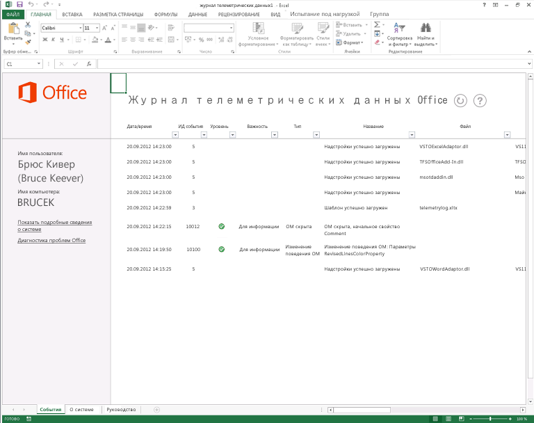

# Устранение проблем с файлами Office и пользовательскими решениями при помощи журнала телеметрииTroubleshooting Office files and custom solutions with the telemetry log

Используйте журнал телеметрии для Office 2013, чтобы выявить проблемы совместимости с Office 2013 и решениями для предыдущих версий Office.Use the Telemetry Log for Office 2013 to determine compatibility issues with Office 2013 and solutions built for previous versions of Office.
  
В статье ниже описывается журнал телеметрии и способы его использования.The following article describes the Telemetry Log and how to use it. Дополнительные сведения о конкретных результатах, отображаемых в журнале телеметрии, см. в статье [Проблемы совместимости в Office](compatibility-issues-in-office.md).For more information about specific results displayed in the Telemetry Log, see [Compatibility issues in Office](compatibility-issues-in-office.md).

Издав многочисленные выпуски, корпорация Майкрософт предоставила средства и платформы для настройки, автоматизации и расширения функций Office. Это позволило предприятиям и отдельным пользователям создавать решения или надстройки для приложений Office, повышающие их производительность и эффективность. По сложности такие решения могут быть как простыми макросами Visual Basic для приложений (VBA), так и развернутыми настройками .NET Framework. Многие пользователи таких решений полагаются на них при выполнении критичных для бизнеса задач и могут даже не знать, что пользуются настройкой, добавленной в их приложения Office.Over the course of many releases, Microsoft has provided tools and frameworks for customizing, automating, and extending Office. This has enabled businesses and users to build solutions or add-ins for Office applications to improve their productivity and efficiency. These solutions can range in complexity from simple Visual Basic for Applications (VBA) macros to robust .NET Framework customizations. Many users who have these solutions rely on them to complete business-critical tasks and may not even know that they are using a customization that is added to their Office applications.
  
Из-за огромного количества решений для набора Office обновление его версий может оказаться непростой задачей. Предприятия и отдельные пользователи не могут определить, обеспечивается ли полная совместимость крайне необходимых решений с новой версией. Эти решения могут использовать функции или код, доступные в предыдущих версиях Office, но признанные устаревшими в последующих. Если решение, использующее устаревшую функцию, загружается в ведущее приложение, это решение может работать иначе, вызывать ошибку, не загружаться или вызывать сбой ведущего приложения.With such a proliferation of Office solutions, upgrading versions of Office can be complex. Enterprises and users do not know whether their important and valuable solutions are completely compatible with the new version. Their solutions might use features and computer code that are available in previous versions of Office that have been deprecated in later versions. If a solution that uses a deprecated feature is loaded into the "host" application, the solution might behave differently, cause an error, fail to load, or cause the host application to fail.
  
Журнал телеметрии для Office 2013, созданный на базе Excel 2013, помогает разработчикам и опытным пользователям диагностировать проблемы совместимости благодаря отображению событий, возникающих в выбранных приложениях Office 2013. С помощью этого средства пользователи могут выявлять потенциальные проблемы с надстройками, которые используются в рабочей среде. Это, в свою очередь, позволит лицам, принимающим решения в компании, обоснованно утвердить или отклонить обновление до Office 2013. Журнал телеметрии также предоставляет подробные отчеты о конкретных изменениях или устаревших функциях в объектных моделях для приложений Office 2013, что позволяет разработчикам быстро выявить проблемный код или элементы управления и выполнить их рефакторинг. ИТ-специалисты могут просматривать тенденции работоспособности решений для нескольких клиентов, используя Панель мониторинга телеметрии для Office 2013  вспомогательное средство для Журнал телеметрии.The Telemetry Log for Office 2013, a tool built upon Excel 2013, helps developers and experienced users diagnose compatibility issues by displaying events that occur within select Office 2013 applications. Using this tool, users can determine potential issues with add-ins that they use in their work environment, giving enterprise decision-makers the information that they need to decide whether to upgrade to Office 2013. The Telemetry Log also gives detailed feedback about specific changes or deprecations in the object models for the Office 2013 applications, which helps developers quickly identify and refactor problematic code or controls. IT professionals can view trends in solution health across multiple clients by using the Telemetry Dashboard for Office 2013, a companion tool to the Telemetry Log.
  
Дополнительные сведения см. в статье [Развертывание панели мониторинга телеметрии](https://technet.microsoft.com/library/f69cde72-689d-421f-99b8-c51676c77717).For more information, see [Deploy Office Telemetry Dashboard](https://technet.microsoft.com/library/f69cde72-689d-421f-99b8-c51676c77717).
  
## Принцип работы Журнал телеметрииHow the Telemetry Log works

При загрузке, использовании, закрытии или сбое файла или решения Office в одном из выбранных приложений Office 2013 оно добавляет запись с информацией о событии в локальное хранилище данных (база данных, расположенная на том же компьютере). Эта запись включает в себя заголовок для события, приложение, зарегистрировавшее событие, время, имя файлы или решения, серьезность и краткое описание всех возникших ошибок. При обновлении книга Журнал телеметрии отображает список записей, содержащихся в локальном хранилище данных.When an Office file or solution is loaded, used, closed, or raises an error in one of the selected Office 2013 applications, the application adds a record in a local data store (a database on the same computer) that includes information about the event. The record includes a title for the event, the application that logged the event, the time, the name of the file or solution, the severity, and a short description of any errors that may have occurred. When refreshed, the Telemetry Log workbook displays a list of the records contained in the local data store.
  
> [!NOTE]
> В качестве расположения по умолчанию для локального хранилища данных используется папка %Users%\[текущий пользователь]\AppData\Local\Microsoft\Office\15.0\Telemetry. Максимальный размер этого хранилища данных по умолчанию составляет 5 МБ (5120 КБ).The default location for the local data store is %Users%\[Current user]\AppData\Local\Microsoft\Office\15.0\Telemetry. The default maximum size for the data store is 5 MB (5,120 KB). 
  
Выбранные приложения Office 2013 снабжены интерфейсом API регистрации во время выполнения, который создает запись в локальном хранилище данных при каждом возникновении одного из следующих событий для файла или решения:Selected Office 2013 applications have a run-time logging API that creates a record in the local data store every time that a file or solution raises one of the following events:
  
- **OnLoad**: запись вносится в локальное хранилище данных при загрузке файла или решения в заданных приложениях Office 2013. При возникновении события **OnLoad** функция регистрации ошибок во время выполнения заносит имя файла, расположение и другие сведения в локальное хранилище данных.**OnLoad**: A record is logged in the local data store when a file or solution is loaded into specific Office 2013 applications. The run-time error logging records the file name, location, and other information in the local data store when an **OnLoad** event is raised. 
    
- **OnClose**: запись вносится при закрытии файла или решения в приложении. Эта запись включает в себя имя решения или файла, его расположение, а также приложение, зарегистрировавшее событие.**OnClose**: A record is logged when a file or solution is closed within the application. The record includes the name of the solution or file, its location, and the application that logged the event.
    
- **OnError**: запись вносится при обнаружении ошибки в решении для определенных приложений Office 2013. Эта запись включает в себя имя решения или файла, а также возникшую у пользователя проблему времени выполнения или совместимости. По возможности ошибки сопоставляются с известными проблемами совместимости и в таком виде отображаются в журнале Журнал телеметрии.**OnError**: A record is logged when an error is found in a solution for certain Office 2013 applications. The record includes the name of the solution or file and the run-time failure or compatibility issue that the user encountered. When possible, errors are mapped to known compatibility issues and are displayed as such in the Telemetry Log.
    
Журнал Журнал телеметрии отображает сведения о большом списке типов файлов и решений для выбранных приложений Office 2013. Тип файлов и решений, отслеживаемых интерфейсами API регистрации во время выполнения, зависит от приложения. Дополнительные сведения о том, какие виды решений отслеживаются, см. в таблице 1.The Telemetry Log displays information about a large list of files and solution types for a selection of Office 2013 applications. The type of files and solutions that are monitored by the run-time logging APIs vary by application. See the Table 1 for more information about what kinds of solutions are monitored.
  
### Табл. 1. Типы файлов и решений Office, отслеживаемые в Журнал телеметрииTable 1. Types of Office files and solutions tracked in Telemetry Log

|**Тип решения****Solution type**|**Приложения****Applications**|**Описание****Description**|
|:-----|:-----|:-----|
|Приложения области задачTask pane apps    |Excel 2013, Word 2013, Project 2013Excel 2013, Word 2013, Project 2013    |Это Надстройки Office, размещаемые в области задач клиентского приложения.These are Office Add-ins that are hosted in a task pane within the client application.    |
|контентных приложений;Content apps    |Excel 2013Excel 2013    |Это Надстройки Office, интегрированные в содержимое файла Office.These are Office Add-ins that are integrated into the content of the Office file.    |
|Почтовые приложенияMail apps    |Outlook 2013Outlook 2013    |Приложения, которые отображаются в Outlook 2013 при соблюдении определенных условий (содержание или тема сообщения электронной почты включает определенные слова или фразы).These are apps that appear inOutlook 2013 when certain conditions are met (the email body or subject includes particular words or phrases).    |
|Активные документыActive documents    |Word 2013Word 2013    PowerPoint 2013PowerPoint 2013    Excel 2013Excel 2013    | Активные документы  это файлы документов Office, отличные от остальных типов решений, которые перечислены в данной таблице. К ним могут относиться следующие элементы:Active documents are any Office document files other than the other solution types listed in this table. This can include the following:     Файлы Office в двоичном формате (DOC, PPT, PPS, XLS).Office binary format files (.doc, .ppt, .pps, .xls).     Файлы в формате Office OpenXML (DOCX, PPTX, PPSX, XLSX).Office OpenXML format files (.docx, .pptx, .ppsx, .xlsx).     Файлы с поддержкой макросов, содержащие код VBA (DOCM, DOTM, PPTM, POTM, XLSM, XLTM).Macro-enabled files that contain VBA code (.docm, .dotm, .pptm, .potm, .xlsm, .xltm).     Файлы, содержащие элементы управления ActiveX.Files that contain ActiveX controls.     Файлы, имеющие подключения к внешним данным.Files that have External Data Connections.    |
|Надстройки COMCOM add-ins    |Word 2013Word 2013    PowerPoint 2013PowerPoint 2013    Excel 2013Excel 2013    Outlook 2013Outlook 2013    |К надстройкам COM относятся надстройки уровня приложения Инструменты разработчика Office в Visual Studio 2010.COM add-ins include Office development tools in Visual Studio 2010 application-level add-ins.    |
|Надстройки автоматизации ExcelExcel Automation add-ins    |Excel 2013Excel 2013    |К этому типу решений относятся предыдущие версии поддерживаемых в Excel надстроек автоматизации, построенных на базе надстроек COM. Функции в надстройках автоматизации могут вызываться из формул на листах Excel.This solution type includes previous versions of Excel-supported Automation Add-ins, which are built upon COM add-ins. Functions in Automation add-ins can be called from formulas in Excel worksheets.    |
|Надстройки Excel XLLExcel XLL add-ins    |Excel 2013Excel 2013    |Надстройки XLL предназначены специально для Excel и созданы с помощью любого компилятора, поддерживающего построение библиотек динамической компоновки (DLL). Их не требуется устанавливать или регистрировать. Надстройки XLL также включают в себя библиотеки DLL с заданными пользователем командами и функциями.XLL add-ins (.xll) are specific to Excel and built with any compiler that supports building DLLs (dynamic-link libraries). They do not have to be installed or registered. XLL add-ins also include DLLs that contain user-defined commands and functions.    |
|Надстройка RTD XLS ExcelExcel XLS RTD add-ins    |Excel 2013Excel 2013    |Надстройки XLS данных реального времени (RTD) представляют собой листы Excel, использующие функцию листа **RealTimeData**, чтобы вызвать сервер автоматизации для извлечения данных в режиме реального времени.XLS real-time data (RTD) add-ins are Excel worksheets that use the **RealTimeData** worksheet function to call an Automation server to retrieve data in real-time.    |
|Надстройки Word WLLWord WLL add-ins    |Word 2013Word 2013    |Надстройки WLL (с расширением WLL) используются в Word и создаются с помощью любого компилятора, поддерживающего сборку библиотек DLL.WLL (.wll) add-ins are specific to Word and built with any compiler that supports building DLLs.    |
|Надстройки приложенийApplication add-ins    |Word 2013Word 2013    PowerPoint 2013PowerPoint 2013    Excel 2013Excel 2013    |Надстройки приложений  это файлы, которые связаны с конкретным приложением и содержат код VBA. Сюда относятся шаблоны Word с поддержкой макросов (DOTM), надстройки Excel (XLA, XLAM) и надстройки PowerPoint (PPA, PPAM).Application add-ins are application-specific files that contain VBA code. These include macro-enabled Word templates (.dotm), Excel add-ins (.xla, .xlam), and PowerPoint add-ins (.ppa, .ppam).    |
|ШаблоныTemplates    |Word 2013Word 2013    PowerPoint 2013PowerPoint 2013    Excel 2013Excel 2013    |К шаблонам относятся шаблоны документов (DOT, DOTX), листов (XLT, XLTX) или презентаций (POT, POTX), прилагаемые к файлу Office.Templates include document (.dot, .dotx), worksheet (.xlt, .xltx), or presentation (.pot, .potx) templates that are attached to an Office file.    |
   
## Использование журнала телеметрии OfficeUsing the Office Telemetry Log

При установке Office 2013 устанавливается журнал Журнал телеметрии, на том же компьютере создается локальное хранилище данных, а в ранее указанных приложениях Office 2013 активируются API регистрации во время выполнения. Однако для начала мониторинга решения или файла журналом Журнал телеметрии они должны быть загружены или открыты в приложении.When you install Office 2013, the Telemetry Log is installed, the local data store is created on the same computer, and the run-time logging APIs are enabled in the Office 2013 applications previously listed. However, a solution or file must be loaded or opened in the application before the Telemetry Log can start to monitor it.
  
Используйте следующую процедуру для отображения зарегистрированных в журнале Журнал телеметрии проблем Office.Use the following procedure to display the recorded Office issues in the Telemetry Log. 
  
### Порядок использования журнала Журнал телеметрииTo use the Telemetry Log

1. Чтобы открыть журнал Журнал телеметрии, выполните одно из следующих действий:To open the Telemetry Log, do one of the following:
    
   - **Для Windows 7:** в меню **Пуск** выберите пункт **Все программы**, в списке программ разверните узел **Microsoft Office 2013**, узел **Office 2013 Tools** (Инструменты Office 2013), а затем щелкните элемент **Office 2013 Telemetry Log** (Журнал телеметрии Office 2013).**On Windows 7:** On the **Start** menu, choose **All Programs**. Then, in the list of programs, expand **Microsoft Office 2013**, expand **Office 2013 Tools**, and then click **Office 2013 Telemetry Log**.
    
     В Excel 2013 открывается новая книга с тремя листами  **События**, **Сведения о системе** и **Руководство**.A new workbook in Excel 2013 opens. The workbook has three worksheets titled **Events** **System info**, and **Guide**.
    
   - **Для Windows 8:** проведите вверх для отображения панели приложения, выберите **All Apps** (Все приложения) и затем **Office 2013 Telemetry Log** (Журнал телеметрии Office 2013).**On Windows 8:** Swipe up to display the AppBar, choose **All Apps**, and then choose **Office 2013 Telemetry Log**.
    
     В Excel 2013 открывается новая книга с тремя листами  **События**, **Сведения о системе** и **Руководство**.A new workbook in Excel 2013 opens. The workbook has three worksheets titled **Events** **System info**, and **Guide**.
    
2. Чтобы просмотреть актуальный список событий, выберите элемент **Обновить** в верхней части листа **События**.To view an up-to-date list of events, on the **Events** worksheet, at the top of the worksheet, choose **Refresh**.
    
3. Чтобы просмотреть данные о событиях, собранные из приложений Office 2013, обратитесь к таблице, отображаемой на листе **События**.To view the event data that is collected from Office 2013 applications, review the table displayed on the **Events** worksheet. 
    
4. Чтобы просмотреть сведения о компьютере, на котором установлен Office 2013 и журнал Журнал телеметрии, обратитесь к таблице, отображаемой на листе **Сведения о системе**.To review information about the computer on which Office 2013 and Telemetry Log are installed, review the information displayed on the **System Info** worksheet. 
    
> [!NOTE]
> Книгу журнала Журнал телеметрии не требуется сохранять в Excel 2013 для регистрации результатов, так как эти сведения сохраняются в локальном хранилище данных (которое расположено отдельно от журнала Журнал телеметрии). Однако сохранение этой книги не приведет к повреждению журнала Журнал телеметрии.It is not necessary to save the Telemetry Log workbook in Excel 2013 to keep a record of the results, because the information is stored in the local data store (which is separate from the Telemetry Log). However, saving the workbook does not damage the Telemetry Log. 
  
Журнал Журнал телеметрии отображает простые сведения о зарегистрированных событиях. Каждая из отображаемых в журнале Журнал телеметрии записей содержит заголовок события и сведения о его серьезности. Для ошибок в записи также включается описание ошибки и мер по ее устранению. Помните о том, что не все отображаемые записи представляют ошибки, вызванные решениями Office; в журнале Журнал телеметрии также приводятся сведения об успешной загрузке или успешном закрытии файлов и решений.The Telemetry Log displays some simple information about the recorded events. Each record displayed in the Telemetry Log contains a title and lists the severity of the event displayed. For errors, the records also include a description of the error together with steps to address the issue. Keep in mind that not all of the records displayed represent errors caused by Office solutions; the Telemetry Log also shows when solutions and files are loaded or closed successfully. 
  
Например, проблема с заголовком "OM Hidden: Comment.Initial Property" (Объектная модель скрыта: свойство Comment.Initial) появляется в том случае, если решение или файл с поддержкой макросов, открытые в Word 2013, пытаются получить инициалы автора комментария. Word 2013 предоставляет улучшенные возможности комментирования, в которых по умолчанию отображение инициалов автора комментария отключено. Интерфейсы API, сопоставленные с более старой моделью комментирования, были скрыты в объектной модели Word 2013, но остались доступными для обеспечения обратной совместимости. Проблема "OM Hidden: Comment.Initial" (Объектная модель скрыта: Comment.Initial) в журнале содержит сведения о файле, попытавшемся использовать API, приложении, вызвавшем событие (Word 2013), времени и дате события, а также короткое описание ошибки и способов ее устранения.For example, the issue titled "OM Hidden: Comment.Initial Property" appears if a solution or macro-enabled file opened in Word 2013 attempts to get the initials of a commenter who is associated with a comment. Word 2013 features an improved commenting experience that does not display commenter initials by default. The APIs associated with the older commenting model have been hidden in the Word 2013 object model but remain available for backwards-compatibility. The "OM Hidden: Comment.Initial" issue in the indicates the file that attempted to use the API, the application that raised the event (Word 2013), the time and date of the event, and short description about the error and how to fix it.
  
**Рис. 1. Журнал телеметрии Office****Figure 1. Office Telemetry Log**
  

  
> [!NOTE]
>  Лист **Сведения о системе** в журнале телеметрии содержит сведения о компьютере, на котором установлен Office 2013.The **System Info** worksheet in the Telemetry Log contains information about the computer on which Office 2013 is installed. На этом листе отображается следующая информация:The worksheet displays the following information: 
> - Имя пользователя.User name.
> - Полное имя компьютера.Full computer name.
> - Архитектура операционной системы (x64/64-разрядная или x86/32-разрядная).Architecture of the operating system (x64/64-bit or x86/32-bit).
> - Версия установленной на компьютере операционной системы Windows.Version of Windows that is installed on the computer.
> - Часовой пояс внутренних часов компьютера.Time zone for the computer's internal clock.
> - Версия журнала телеметрии.Version of the Telemetry Log.
> - Версия пакета Office, установленного на компьютере.Version of Office that is installed on the computer.
> 
> Эти сведения могут оказаться полезными при интерпретации проблем и событий, перечисленных на листе **События**.This information can be useful when you are interpreting the issues and events listed on the **Events** worksheet. 
  
В журнале Журнал телеметрии вместе с известными проблемами отображается степень серьезности. В предыдущем примере проблема, указывающая на скрытую объектную модель, чаще всего имеет степень серьезности "Информационная". С другой стороны, остальные известные проблемы могут иметь более высокую степень серьезности и требовать более быстрого реагирования. Серьезность отображаемой в журнале Журнал телеметрии проблемы может иметь одно из следующих значений:In the Telemetry Log, a level of severity is displayed together with the known issues. From the previous example, an issue in which a part of the object model has been hidden most often has an "Informative" level of severity. On the other hand, other known issues might be more serious and require more immediate action. The severity of the issues displayed in the Telemetry Log can be one of the following:
  
- **Информационная**. В данный момент проблема может не оказывать воздействие на совместимость приложений, но позднее пользователю может потребоваться предпринять некоторые меры. Эту степень серьезность имеют многие проблемы типа "OM hidden" (Объектная модель скрыта).**Information** The issue may not have an immediate effect on application compatibility, but the user may have to take an action later. Many issues of the "OM hidden" type have this severity level. 
    
- **Предупреждающая**. Проблема может привести к потере данных или снижению качества воспроизведения.**Warning** The issue could cause data loss or result in reduced visual fidelity. 
    
- **Критическая**. Проблема может привести к потере значительной части функциональных возможностей или к сбою приложения.**Critical** The issue could cause significant loss of functionality or lead the application to crash. 
    
### Табл. 2. Типы событий, отображаемых в Журнал телеметрииTable 2. Types of events displayed in the Telemetry Log

Используйте следующую таблицу (табл. 2) при интерпретации записей, отображаемых в журнале Журнал телеметрии.Use the following table (Table 2) to interpret the records that are displayed in the Telemetry Log.
  
|**Код события****Event ID**|**Название****Title**|**Серьезность****Severity**|**Описание****Description**|
|:-----|:-----|:-----|:-----|
|11    |Документ успешно загруженDocument loaded successfully    ||Файл, указанный в столбце **Файл**, был открыт в приложении Office без каких-либо проблем.The file listed in the **File** column was opened in the Office application without any issues.    |
|22    |Не удалось загрузить документDocument failed to load    |ПредупреждениеWarning    | Приложению не удалось загрузить файл. Возможно, с этим связаны какие-либо проблемы совместимости.  The application was unable to load the file. There may be some underlying compatibility issue.    Дополнительные сведения о восстановлении поврежденной книги в Excel 2013 см. в статье [Восстановление поврежденной книги](https://office.microsoft.com/ru-RU/excel-help/repairing-a-corrupted-workbook-HA102749554.aspx).For more information about how to repair a corrupted workbook in Excel 2013, see [Repairing a corrupted workbook](https://office.microsoft.com/ru-RU/excel-help/repairing-a-corrupted-workbook-HA102749554.aspx).  Дополнительные сведения о восстановлении поврежденного документа в Word 2013 см. в статье [Сохранение и восстановление резервной копии документа](https://office.microsoft.com/ru-RU/word-help/save-and-recover-a-backup-copy-of-a-document-HA010121250.aspx).For more information about how to repair a corrupted document in Word 2013, see [Save and recover a backup copy of a document](https://office.microsoft.com/ru-RU/word-help/save-and-recover-a-backup-copy-of-a-document-HA010121250.aspx).   |
|33    |Шаблон успешно загруженTemplate loaded successfully    ||Файл шаблона, указанный в столбце **Файл**, был открыт в приложении Office без каких-либо проблем.The template file listed in the **File** column was opened in the Office application without any issues.    |
|44    |Не удалось загрузить шаблонTemplate failed to load    |ПредупреждениеWarning    | Приложению не удалось загрузить шаблон. Возможно, с этим связаны какие-либо проблемы совместимости, либо изменилась доступность шаблона.  The application was unable to load the template file. There may be some underlying compatibility issue or the template availability may have changed.  Дополнительные сведения о восстановлении поврежденной книги в Excel 2013 см. в статье [Восстановление поврежденной книги](https://office.microsoft.com/ru-RU/excel-help/repairing-a-corrupted-workbook-HA102749554.aspx).For more information about how to repair a corrupted workbook in Excel 2013, see [Repairing a corrupted workbook](https://office.microsoft.com/ru-RU/excel-help/repairing-a-corrupted-workbook-HA102749554.aspx).  Дополнительные сведения о восстановлении поврежденного документа в Word 2013 см. в статье [Сохранение и восстановление резервной копии документа](https://office.microsoft.com/ru-RU/word-help/save-and-recover-a-backup-copy-of-a-document-HA010121250.aspx).For more information about how to repair a corrupted document in Word 2013, see [Save and recover a backup copy of a document](https://office.microsoft.com/ru-RU/word-help/save-and-recover-a-backup-copy-of-a-document-HA010121250.aspx).   |
|55    |Надстройка успешно загруженаAdd-in loaded successfully    ||Надстройка, указанная в столбце **Файл**, успешно загружена в приложении Office. Проблемы совместимости отсутствуют.  The add-in listed in the **File** column loaded within the Office application successfully. No compatibility issues were detected.    |
|66    |Приложению не удалось загрузить надстройкуAdd-in failed to load    |КритическийCritical    | Приложению не удалось загрузить надстройку, указанную в столбце **Файл**.The application was unable to load the add-in listed in the **File** column.    Дополнительные сведения о восстановлении поврежденной книги в Excel 2013 см. в статье [Восстановление поврежденной книги](https://office.microsoft.com/ru-RU/excel-help/repairing-a-corrupted-workbook-HA102749554.aspx).For more information about how to repair a corrupted workbook in Excel 2013, see [Repairing a corrupted workbook](https://office.microsoft.com/ru-RU/excel-help/repairing-a-corrupted-workbook-HA102749554.aspx).     Дополнительные сведения о восстановлении поврежденного документа в Word 2013 см. в статье [Сохранение и восстановление резервной копии документа](https://office.microsoft.com/ru-RU/word-help/save-and-recover-a-backup-copy-of-a-document-HA010121250.aspx).For more information about how to repair a corrupted document in Word 2013, see [Save and recover a backup copy of a document](https://office.microsoft.com/ru-RU/word-help/save-and-recover-a-backup-copy-of-a-document-HA010121250.aspx).   |
|77    |Манифест надстройки загружен успешноAdd-in manifest downloaded successfully    ||Ведущее приложение успешно загрузило манифест надстройки Office.The host application loaded the manifest for the Office Add-in successfully.    |
|88    |Манифест надстройки не загруженAdd-in manifest did not download    |КритическаяCritical    |Ведущему приложению не удалось загрузить файл манифеста Надстройка Office из каталога SharePoint, корпоративного каталога или Магазин Office.The host application was unable to load the manifest file for the Office Add-in from the SharePoint catalog, corporate catalog, or the Office Store.    |
|99    |Не удалось проанализировать манифест надстройкиAdd-in manifest could not be parsed    |КритическаяCritical    |Ведущее приложение загрузило манифест надстройки Office, но ему не удалось считать XML.The host application loaded the Office Add-in manifest for the add-in, but could not read the XML.    |
|1010    |Надстройка использует слишком много ресурсов ЦПAdd-in used too much CPU    |КритическаяCritical    |Приложение Надстройка Office использовало более 90 % ресурсов ЦП за конечный промежуток времени.The Office Add-in used more than 90% of the CPU resources over a finite period of time.    |
|1111    |Произошел сбой при загрузке приложенияApplication crashed on load    |КритическийCritical    |При запуске приложение Office попыталось загрузить документ или решение, но из-за проблем с этим документом или решением запуск приложения не был выполнен.The Office application tried to load a document or solution when it launched, but problems with the document or solution prevented the application from launching.    |
|1212    |Проблема привела к закрытию приложенияApplication closed due to a problem    |КритическийCritical    |Что-то вызвало критическую ошибку в приложении, поэтому оно было закрыто.Something caused a critical error in the application and it needed to close.    |
|1313    |Документ успешно закрытDocument closed successfully    ||Файл, указанный в столбце **Файл**, успешно закрыт.The file listed in the **File** column closed successfully.    |
|1414    |Превышено время сеанса приложенияApplication session extended    ||Сеансы приложений с открытым документом или решением должны длиться не более 24 часов. При превышении этого значения ведущее приложение создает новый сеанс.Application sessions with a particular document or solution open should only last 24 hours. If a session goes over 24 hours, the host application creates a new session.    |
|1515    |Тайм-аут поиска строки привел к отключению надстройкиAdd-in disabled due to string search time-out    ||Почтовая надстройка выполняет поиск в строке темы и тексте электронного сообщения, чтобы определить, требуется ли их отображать с использованием регулярного выражения.Mail add-in search the subject line and message of an email to determine whether they should be displayed by using a regular expression. Почтовое приложение, указанное в столбце **Файл**, было отключено Outlook 2013 из-за многократного тайм-аута при попытке сопоставления регулярного выражения.The mail app listed in the **File** column was disabled by Outlook 2013 because it timed out repeatedly while trying to match a regular expression.    |
|1616    |Этот документ был открыт, когда произошел сбой приложенияDocument open when application crashed    |КритическийCritical    |Файл, указанный в столбце **Файл**, был открыт во время сбоя приложения (указанного в столбце приложения). Этот файл может как иметь, так и не иметь отношение к сбою данного **приложения**.  The file listed in the **File** column was open when the application (listed in the application column) crashed. The file may or may not have been responsible for the **Application** crash.    |
|1717    |Надстройка успешно закрытаAdd-in closed successfully    |ИнформационныеInformative    |Приложению удалось успешно завершить работу надстройки.The application was able to shut down the add-in successfully.    |
|1818    |Приложение успешно закрытоApp closed successfully    ||Ведущему приложению удалось успешно закрыть приложение Надстройка Office.The host application was able to close the Office Add-in successfully.    |
|1919    |Надстройка обнаружила ошибку времени выполненияAdd-in encountered runtime error    |КритическийCritical    |Надстройка Office столкнулось с проблемой и завершилось со сбоем. Для получения дополнительных сведений просмотрите журнал оповещений Microsoft Office с помощью средства просмотра событий Windows на том компьютере, где возникла ошибка.The Office Add-in had a problem that caused it to fail. For more details, look at the Microsoft Office Alerts log using the Windows Event Viewer on the computer that encountered the error.    |
|2020    |Сбой надстройки при проверке лицензированияAdd-in failed to verify licensing    |КритическийCritical    |Не удалось проверить сведения о лицензировании для приложения Надстройка Office, возможно, срок их действия истек. Для получения дополнительных сведений просмотрите журнал оповещений Microsoft Office с помощью средства просмотра событий Windows на том компьютере, где возникла ошибка.The licensing information for the Office Add-in could not be verified and may have expired. For more details, look at the Microsoft Office Alerts log using the Windows Event Viewer on the computer that encountered the error.    |
|2121  |В макросе возникла ошибка компиляцииMacro encountered a compile error  |ПредупреждениеWarning  | Файл содержит макрос, который не смог выполнить компиляцию, и его не удалось запустить.The file contains a macro that failed to compile and couldn't be run. Для получения дополнительных сведений просмотрите ошибку, возникшую при попытке компиляции макроса в редакторе макросов.For more details, review the error message presented when attempting to compile the macro from the macro editor. | 
|2222  |В макросе возникла ошибка выполненияMacro encountered a runtime error | ПредупреждениеWarning  | Файл содержит макрос, в котором произошла ошибка выполнения.The file contains a macro that encountered a runtime error. Для получения дополнительных сведений просмотрите ошибку, возникшую при попытке запустить макрос из редактора макросов, а также см. [справочник по Visual Basic для приложений](https://docs.microsoft.com/previous-versions/visualstudio/visual-basic-6/aa264975%28v=vs.60%29).For more details, review the error message presented when attempting to execute the macro from the macro editor and see the [Visual Basic for Applications Reference](https://docs.microsoft.com/previous-versions/visualstudio/visual-basic-6/aa264975%28v=vs.60%29). |
|РазноеVarious    |"OM Behavior Change: ..." (Изменение поведения объектной модели: ...)"OM Behavior Change: ..."    |ИнформационныеInformative    |В коде надстройки или документа с поддержкой макросов используется объект, элемент, коллекция, перечисление или константа, которые ведут себя иначе, чем в предыдущих версиях Office.The add-in or macro-enabled document code uses an object, member, collection, enumeration, or constant that behaves differently from previous versions of Office.   Дополнительные сведения см. в статье [Проблемы совместимости в Office](compatibility-issues-in-office.md).For more information, see [Compatibility issues in Office](compatibility-issues-in-office.md).    |
|РазноеVarious    |"OM Removed: …" (Объектная модель удалена: …)"OM Removed: …"    |КритическийCritical    |В коде надстройки или документа с поддержкой макросов используется объект, элемент, коллекция, перечисление или константа, которые удалены из объектной модели.The add-in or macro-enabled document code uses an object, member, collection, enumeration, or constant that has been removed from the object model.  Дополнительные сведения см. в статье [Проблемы совместимости в Office](compatibility-issues-in-office.md).For more information, see [Compatibility issues in Office](compatibility-issues-in-office.md).    |
|РазноеVarious    |"OM Hidden: …" (Объектная модель скрыта: …)"OM Hidden: …"    |ИнформационныеInformative    |В коде надстройки или документа с поддержкой макросов используется объект, элемент, коллекция, перечисление или константа, которые скрыты в объектной модели.The add-in or macro-enabled document code uses an object, member, collection, enumeration, or constant that has been hidden in the object model.  Дополнительные сведения см. в статье [Проблемы совместимости в Office](compatibility-issues-in-office.md).For more information, see [Compatibility issues in Office](compatibility-issues-in-office.md).    |
|РазноеVarious    |"Control: …" (Элемент управления: …)"Control: …"    ||Файл содержит элемент управления, который может не поддерживаться в Office 2013 или операционной системе компьютера.The file contains a control that may not be supported in Office 2013 or on the computer's operating system.  Дополнительные сведения см. в статье [Проблемы совместимости в Office](compatibility-issues-in-office.md).For more information, see [Compatibility issues in Office](compatibility-issues-in-office.md).    |
   
## ЗаключениеConclusion

Журнал телеметрии  простое средство мониторинга критически важных решений для Office, которое могут использовать крупные предприятия, отдельные пользователи и разработчики. Выявляя проблемные решения для Office перед масштабным обновлением, предприятия могут точнее прогнозировать стоимость внедрения Office 2013.The Telemetry Log provides large enterprises, individual users, and developers with a simple tool for monitoring their critical Office solutions. By identifying problematic Office solutions before a large-scale upgrade, businesses can more reasonably predict the cost of adopting Office 2013.
  
## Дополнительные ресурсыSee also

- [Центр разработчиков OfficeOffice Developer Center](https://msdn.microsoft.com/office/aa905340.aspx)
- [Проблемы совместимости в OfficeCompatibility issues in Office](compatibility-issues-in-office.md)
- [Развертывание панели мониторинга телеметрии OfficeDeploy Office Telemetry Dashboard](https://technet.microsoft.com/library/f69cde72-689d-421f-99b8-c51676c77717)
- [Центр разработчиков OfficeOffice Developer Center](https://msdn.microsoft.com/office/aa905340)
    

