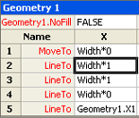

# О окне трассивки Формулы

Окно  трассивки Формулы предназначено для предоставления разработчикам форм информации о взаимосвязях клеток — как зависимых ячеек (ячеек, зависимых от данной ячейки), так и клеток-прецедентов (от которых зависит данная ячейка). 
  
Ячейки в microsoft Visio ShapeSheet содержат значения и формулы. Формулы, в свою очередь, могут иметь ссылки на другие ячейки, что дает вам возможность вычислять значение в одной ячейке на основе значения другой ячейки. Однако при создании или сохранении сложных фигур может быть трудно определить все эти взаимозависимости, так как формула может ссылаться на любую ячейку на рисунке, будь то ячейка в том же shapeSheet или ячейка, принадлежащая другому объекту в рисунке, например страница, стиль, мастер или другая фигура. 
  
Окно **трассивки Формулы** предоставляет сведения, которые помогут вам понять последствия изменений, которые вы делаете для ячеек. 
  
## Отображение окна трассии формулы

Чтобы просмотреть окно **Трассировка** Формулы с активным окном ShapeSheet, в статье **ShapeSheet Tools** на вкладке ** Design ** в группе **Трассировка** Формулы нажмите кнопку **Показать** окно . Окно **трассивки** Формулы по умолчанию состыковано в окне ShapeSheet, но является якорным окном, которое можно пристыковать, поплыть или объединить с другими доступными закрепленными окнами ShapeSheet, например **окном Обозреватель** стиля. 
  
## Отслеживание зависимых ячеек

Чтобы увидеть список ячеек, зависящих от определенной ячейки, выберите эту ячейку в окне ShapeSheet. В этом примере выбирается ячейка Width. 
  

  
Чтобы просмотреть зависимые ячейки в группе **Трассировка** Формулы, щелкните **Trace Dependents**.
  
Список всех ячеек, зависимых от ячейки Ширина, отображается в окне **Трассировка** Формулы. Вы можете перейти к любой ячейке в списке, дважды щелкнув ее запись в окне **Трассировка Формулы.** 
  

  
## Отслеживание предустановленных ячеек

Чтобы увидеть список ячеек, на которые зависит определенная ячейка, сначала выберите ячейку в окне ShapeSheet. В этом примере выбрана ячейка Geometry1.X2. 
  

  
Чтобы просмотреть его ячейки-прецеденты, в группе **Трассировка** Формулы щелкните **Trace Precedents**.
  
Список всех ячеек, от которых зависит ячейка Geometry1.X2, отображается в окне **Трассировка** Формулы. Вы можете перейти к любой ячейке в списке, дважды щелкнув ее запись в окне **Трассировка Формулы.** 
  

  

