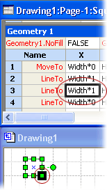

# О таблице ShapeSheetAbout the ShapeSheet Spreadsheet

Все в microsoft Visio, каждый документ, страница, стиль, форма, группа, форма или объект в группе, мастер, объект из другой программы, руководства и точки руководства, имеет таблицу ShapeSheet, в которой хранятся сведения об этом объекте.Everything in Microsoft Visio, every document, page, style, shape, group, shape or object within a group, master, object from another program, guide, and guide point, has a ShapeSheet spreadsheet where information about that object is stored. Эта таблица содержит такие сведения, как высота, ширина, угол, цвет и другие атрибуты, которые определяют внешний вид и поведение фигуры.This spreadsheet contains information such as height, width, angle, color, and other attributes that determine the shape's appearance and behavior.
  
Как разработчик формы необходимо точно контролировать внешний вид и поведение форм, которые вы создаете.As a shape developer, you need precise control over the appearance and behavior of the shapes you create. Вы можете изменить поведение фигуры по умолчанию и улучшить ее, редактировать ее в виде таблицы ShapeSheet, к которой можно получить доступ в окне ShapeSheet или программным образом.You can change a shape's default behavior and enhance what it can do by editing it in its ShapeSheet, which you can access in a ShapeSheet window or programmatically.
  
## Просмотр объекта в окне ShapeSheetViewing an object in a ShapeSheet window

Окно Visio и окно ShapeSheet — это просто разные представления одной формы.The Visio drawing window and ShapeSheet window are simply different views of the same shape.
  
- Когда вы просматриваете фигуру в окне рисования, вы видите ее отрисовку графически и поведение в соответствии с формулами в ее ShapeSheet.When you view a shape in a drawing window, you see it rendered graphically and behaving according to the formulas in its ShapeSheet.
    
- При просмотре фигуры в окне ShapeSheet вы увидите формулы, определяющие внешний вид и поведение фигуры на странице рисования.When you view a shape in a ShapeSheet window, you see the underlying formulas that determine how it looks and behaves on the drawing page.
    
Вы можете просматривать окно ShapeSheet и окно рисования одновременно и видеть изменение формы в окне рисования при манипулировании ячейками в окне ShapeSheet или наоборот.You can view a ShapeSheet window and a drawing window simultaneously and see the shape change in the drawing window as you manipulate cells in its ShapeSheet window or vice versa. Например, при движении фигуры с указателем формулы PinX и PinY фигуры в разделе Преобразование формы изменяются, чтобы отразить ее новое положение на странице рисования.For example, when you move the shape with the pointer, the shape's PinX and PinY formulas in the Shape Transform section change to reflect its new position on the drawing page.
  
## Структура окна ShapeSheetStructure of the ShapeSheet window

Таблица ShapeSheet разделена на разделы, которые контролируют определенный аспект поведения или внешнего вида фигуры, например, ее геометрию или форматирование. A ShapeSheet is divided into  *sections*  that control a particular aspect of a shape's behavior or appearance, for example, its geometry or its formatting. Каждый раздел содержит одну или *несколько строк,* содержащих *ячейки.*Each section contains one or more  *rows*  that contain  *cells*  . Каждая ячейка может содержать формулу, ее результат (обычно называемое значение ячейки) и необязательные сведения об ошибках.Each cell can contain a formula, its result (commonly called the cell value), and optional error information. Формула может быть обязательной или необязательной в зависимости от конкретной ячейки.A formula may be required or optional, depending on the particular cell. Данные ячейки (например, ее формула или значение) могут быть локально определены или, чаще всего, унаследованы от эквивалентной ячейки в мастере или стиле фигуры.A cell's data (for example, its formula or value) may be locally defined or, more often, inherited from the equivalent cell in the shape's master or style. 
  
В следующем примере показана формула-планкаThe following example shows the formula bar , раздел, a section , ячейка, a cell и строка, and a row  в окне ShapeSheet.in the ShapeSheet window. 
  

  
При нарисовке фигуры Visio фигуру как коллекцию горизонтальных и вертикальных местоположений, связанных с сегментами строки.When you draw a shape, Visio records the shape as a collection of horizontal and vertical locations connected with line segments. Эти расположения (называемые вершинами) записывают в ячейках X и Y в разделе **Геометрия фигуры.**These locations (called vertices) are recorded in the X and Y cells of the shape's **Geometry** section. Как показано в следующем примере, при нажатии ячеек X и Y в разделе Геометрия окна ShapeSheet фигуры вы увидите окне с черной границей, выделяющий вершину фигуры в окне рисования. As shown in the following example, when you click the X and Y cells in the **Geometry** section of a shape's ShapeSheet window, you will see a black-bordered box highlighting the vertex on the shape in the drawing window. 
  

  
## Редактирование объекта в окне ShapeSheetEditing an object in the ShapeSheet window

При активном окне ShapeSheet лента изменяется для отображения параметров, определенных для работы в этом окне.When a ShapeSheet window is active, the ribbon changes to display options specific to working in this window. При выборе ячейки ShapeSheet появляется формула-планка, которую можно использовать для ввода и редактирования формул объекта.When you select a ShapeSheet cell, a formula bar appears, which you can use to enter and edit an object's formulas. Или вы можете работать непосредственно в ячейке.Or, you can work directly in the cell.
  
В окне ShapeSheet можно добавить разделы на лист фигуры, чтобы добавить новые характеристики к фигуре на странице рисования.In a ShapeSheet window, you can add sections to a shape's sheet to add new characteristics to the shape on the drawing page. Например, для создания подключения можно добавить раздел **Точки** подключения.For example, you can add a **Connection Points** section to create a connection. Если вам больше не нужен раздел, его можно удалить.When you no longer need a section, you can delete it. 
  
Вы также можете добавлять строки в разделы, чтобы удерживать дополнительные формулы или изменять внешний вид фигуры.You also can add rows to sections to hold additional formulas or to change a shape's appearance. Например, можно добавить строку в раздел **Геометрия,** чтобы добавить сегмент в фигуру.For example, you can add a row to a **Geometry** section to add a segment to a shape. Кроме того, вы можете удалить строки, которые больше не нужны.Similarly, you can delete rows you no longer need. 
  
В ячейках можно отображать формулы или значения.You can display either formulas or values in cells. Отображение формул при вводе новых формул, редактировании существующих формул или в том, как формулы в ячейках связаны друг с другом.Display formulas when you are entering new formulas, editing existing formulas, or to see how formulas in cells relate to each other. Значение — это результат, который вы Visio при оценке формулы ячейки.A value is the result you get when Visio evaluates a cell's formula. Вы можете отображать значения в ячейках, чтобы увидеть результат оценки.You can display values in cells to see the result of an evaluation.
  
## Дополнительные ссылки на ShapeSheetAdditional ShapeSheet references

Сведения о конкретном разделе, строке или ячейке в ShapeSheet можно просмотреть в соответствующей статье в этой ссылке [ShapeSheet.](reference-visio-shapesheet.md)For details on a particular section, row, or cell in the ShapeSheet, view the corresponding article in this [ShapeSheet Reference](reference-visio-shapesheet.md).
  
Сведения о программных доступах к электронной таблице ShapeSheet см. в справочной Visio Microsoft.For details on programmatically accessing the ShapeSheet spreadsheet, see the Microsoft Visio Automation Reference.
  

