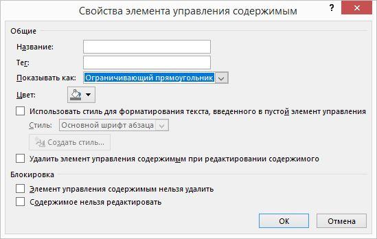
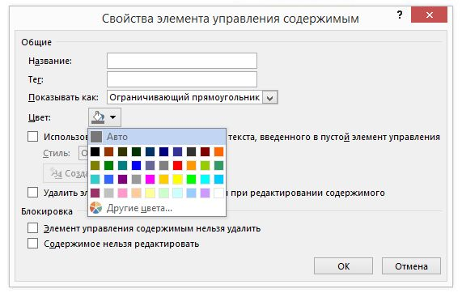
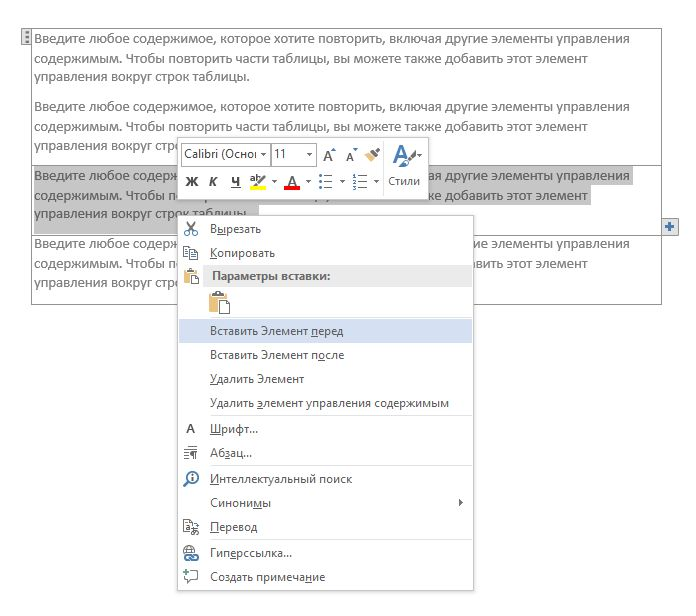
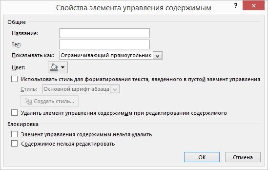
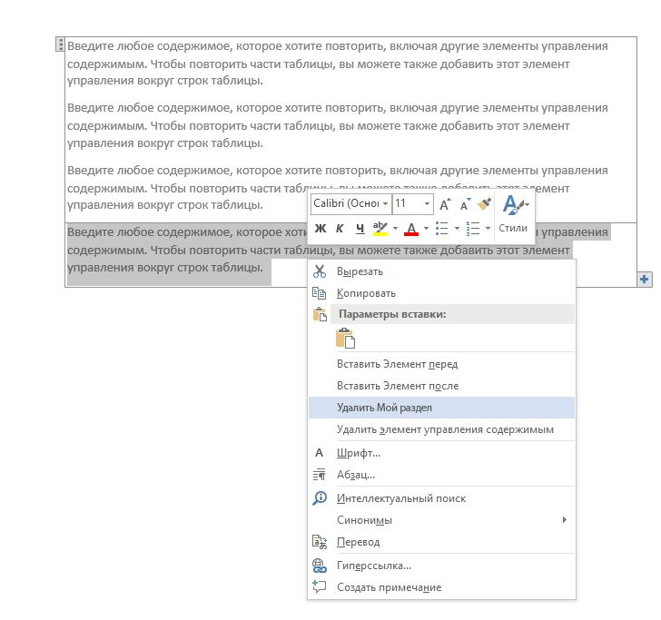
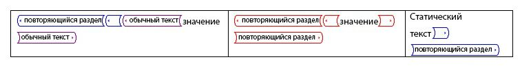
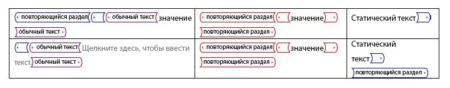

# <a name="content-controls-in-word"></a><span data-ttu-id="8f9cd-104">Элементы управления содержимым в Word</span><span class="sxs-lookup"><span data-stu-id="8f9cd-104">Content controls in Word</span></span>

<span data-ttu-id="8f9cd-105">Узнайте, как элементы управления содержимым Microsoft Word 2013 позволяет больший диапазон сценариев структурированных документов.</span><span class="sxs-lookup"><span data-stu-id="8f9cd-105">Learn how Microsoft Word 2013 content controls enable a larger range of structured document scenarios.</span></span>

<span data-ttu-id="8f9cd-106">В этом разделе представлены сведения об изменениях элементов управления контентом в Microsoft Word 2013 и сценариев документов, которые позволяют эти изменения.</span><span class="sxs-lookup"><span data-stu-id="8f9cd-106">This topic provides information about changes to content controls in Microsoft Word 2013 and the document scenarios that those changes enable.</span></span>
  
### <a name="structured-documents"></a><span data-ttu-id="8f9cd-107">Структурированных документов</span><span class="sxs-lookup"><span data-stu-id="8f9cd-107">Structured documents</span></span>
<span data-ttu-id="8f9cd-108"><a name="WordCC_StructuredDocs"> </a></span><span class="sxs-lookup"><span data-stu-id="8f9cd-108"></span></span>

<span data-ttu-id="8f9cd-109">Структурированных документов, документы, которые управляют которых содержимое может отображаться в документе, какой тип контента могут появляться в документе, и ли контент, который можно изменить.</span><span class="sxs-lookup"><span data-stu-id="8f9cd-109">Structured documents are documents that control where content can appear on a document, what kind of content can appear in the document, and whether that content can be edited.</span></span>
  
<span data-ttu-id="8f9cd-110">Вот некоторые общие сценарии для структурированного содержимого в Microsoft Word.</span><span class="sxs-lookup"><span data-stu-id="8f9cd-110">Here are some common scenarios for structured content in Microsoft Word:</span></span>
  
- <span data-ttu-id="8f9cd-111">Юридические компании необходимо создавать документы, содержащие юридических языка, который не должно изменяться пользователем.</span><span class="sxs-lookup"><span data-stu-id="8f9cd-111">A legal firm needs to create documents that contain legal language that should not be changed by the user.</span></span>
    
- <span data-ttu-id="8f9cd-112">Компания необходимо создать страница заставки предложения, где заголовок, автор и Дата введенный пользователем.</span><span class="sxs-lookup"><span data-stu-id="8f9cd-112">A business needs to create a proposal cover page where only the title, author, and date are entered by the user.</span></span>
    
- <span data-ttu-id="8f9cd-113">Для создания счетов, где данные клиента включена в создания счетов-фактур в предварительно определенные регионы потребности бизнеса.</span><span class="sxs-lookup"><span data-stu-id="8f9cd-113">A business needs to create invoices where the customer data is included in the invoice at predefined regions.</span></span>
    
### <a name="using-content-controls-to-structure-a-document"></a><span data-ttu-id="8f9cd-114">Использование элементов управления содержимым для структурирования документа</span><span class="sxs-lookup"><span data-stu-id="8f9cd-114">Using content controls to structure a document</span></span>
<span data-ttu-id="8f9cd-115"><a name="WordCC_StructuredDocs"> </a></span><span class="sxs-lookup"><span data-stu-id="8f9cd-115"></span></span>

<span data-ttu-id="8f9cd-116">Элементы управления содержимым являются сущности Microsoft Word, которые являются контейнерами для определенного содержимого в документе.</span><span class="sxs-lookup"><span data-stu-id="8f9cd-116">Content controls are Microsoft Word entities that act as containers for specific content in a document.</span></span> <span data-ttu-id="8f9cd-117">Отдельные элементы управления содержимым может содержать контент, такой как даты, списки или абзацы форматированного текста.</span><span class="sxs-lookup"><span data-stu-id="8f9cd-117">Individual content controls can contain content such as dates, lists, or paragraphs of formatted text.</span></span> <span data-ttu-id="8f9cd-118">Справка позволяет создавать структурированные блоков содержимого и предназначены для использования в шаблонах, вставлять четко определенные блоки в документах, Создание структурированных документов, элементы управления содержимым.</span><span class="sxs-lookup"><span data-stu-id="8f9cd-118">Content controls help you to create rich, structured blocks of content and are designed for use in templates that insert well-defined blocks into your documents, creating structured documents.</span></span>
  
<span data-ttu-id="8f9cd-119">Элементы управления содержимым являются идеальным решением для создания структурированных документов, так как элементы управления содержимым можно исправить положение содержимого, указать тип контента (например, даты, изображение или текст), ограничить или разрешить редактирование и добавьте семантических значение содержимого справки.</span><span class="sxs-lookup"><span data-stu-id="8f9cd-119">Content controls are ideal for creating structured documents because content controls help you fix the position of content, specify the kind of content (for example, a date, a picture, or text), restrict or enable editing, and add semantic meaning to content.</span></span>
  
### <a name="content-controls-in-word-2010"></a><span data-ttu-id="8f9cd-120">Элементы управления содержимым в Word 2010</span><span class="sxs-lookup"><span data-stu-id="8f9cd-120">Content controls in Word 2010</span></span>
<span data-ttu-id="8f9cd-121"><a name="WordCC_StructuredDocs"> </a></span><span class="sxs-lookup"><span data-stu-id="8f9cd-121"></span></span>

<span data-ttu-id="8f9cd-122">Доступны следующие элементы управления содержимым в Word 2010:</span><span class="sxs-lookup"><span data-stu-id="8f9cd-122">The following content controls are available in Word 2010:</span></span>
  
- <span data-ttu-id="8f9cd-123">Формат RTF</span><span class="sxs-lookup"><span data-stu-id="8f9cd-123">Rich Text</span></span>
    
- <span data-ttu-id="8f9cd-124">Обычный текст</span><span class="sxs-lookup"><span data-stu-id="8f9cd-124">Plain Text</span></span>
    
- <span data-ttu-id="8f9cd-125">Рисунок</span><span class="sxs-lookup"><span data-stu-id="8f9cd-125">Picture</span></span>
    
- <span data-ttu-id="8f9cd-126">Коллекция стандартных блоков.</span><span class="sxs-lookup"><span data-stu-id="8f9cd-126">Building Block Gallery</span></span>
    
- <span data-ttu-id="8f9cd-127">Поле со списком</span><span class="sxs-lookup"><span data-stu-id="8f9cd-127">Combo Box</span></span>
    
- <span data-ttu-id="8f9cd-128">Раскрывающийся список</span><span class="sxs-lookup"><span data-stu-id="8f9cd-128">Drop-Down List</span></span>
    
- <span data-ttu-id="8f9cd-129">Date</span><span class="sxs-lookup"><span data-stu-id="8f9cd-129">Date</span></span>
    
- <span data-ttu-id="8f9cd-130">Флажок</span><span class="sxs-lookup"><span data-stu-id="8f9cd-130">Checkbox</span></span>
    
- <span data-ttu-id="8f9cd-131">Группа</span><span class="sxs-lookup"><span data-stu-id="8f9cd-131">Group</span></span>
    
<span data-ttu-id="8f9cd-132">Элементы управления содержимым Word 2010 включение различных возможных решений структурированных документов, но в Word 2013 элементов управления контентом позволяют больше различным сценариям.</span><span class="sxs-lookup"><span data-stu-id="8f9cd-132">Word 2010 content controls enable various potential structured document solutions, but in Word 2013 content controls enable a greater range of scenarios.</span></span>
  
## <a name="content-control-improvements-in-word-2013"></a><span data-ttu-id="8f9cd-133">Усовершенствования элемента управления содержимым в Word 2013</span><span class="sxs-lookup"><span data-stu-id="8f9cd-133">Content control improvements in Word 2013</span></span>
<span data-ttu-id="8f9cd-134"><a name="WordCC_WhatsNew"> </a></span><span class="sxs-lookup"><span data-stu-id="8f9cd-134"></span></span>

<span data-ttu-id="8f9cd-135">В Word 2013, элементы управления содержимым предоставляют три основные улучшения, реализованные: повышение визуализации, поддержка элементов управления контентом форматированного текста для сопоставления XML и новый элемент управления контентом повторяющегося содержимого.</span><span class="sxs-lookup"><span data-stu-id="8f9cd-135">In Word 2013, content controls provide three key improvements: improved visualization, support for XML Mapping for Rich Text content controls, and a new content control for repeating content.</span></span>
  
### <a name="improved-visualization"></a><span data-ttu-id="8f9cd-136">Улучшенная визуализации</span><span class="sxs-lookup"><span data-stu-id="8f9cd-136">Improved visualization</span></span>

<span data-ttu-id="8f9cd-137">Word 2013 позволяет отдельного элемента управления контентом для отображения в одном из трех состояний:</span><span class="sxs-lookup"><span data-stu-id="8f9cd-137">Word 2013 allows an individual content control to appear in one of three possible states:</span></span>
  
- <span data-ttu-id="8f9cd-138">Ограничительная рамка</span><span class="sxs-lookup"><span data-stu-id="8f9cd-138">Bounding box</span></span>
    
- <span data-ttu-id="8f9cd-139">Начальная или завершающая теги</span><span class="sxs-lookup"><span data-stu-id="8f9cd-139">Start/End tags</span></span>
    
- <span data-ttu-id="8f9cd-140">Нет</span><span class="sxs-lookup"><span data-stu-id="8f9cd-140">None</span></span>
    
> [!NOTE]
> <span data-ttu-id="8f9cd-141">Если не указано иное, в этом разделе рассматриваются визуализации элементов управления содержимым, если документ не отображаются в **Режиме конструктора**. Задать режим отображения для элемента управления контентом с помощью элемента управления **отображения в** раскрывающемся списке в диалоговом окне **Свойства элемента управления контентом** .</span><span class="sxs-lookup"><span data-stu-id="8f9cd-141">If not stated otherwise, this section discusses the visualization of content controls when the document is not viewed in **Design Mode**.You set the display mode for a content control by using the **Show as** drop-down list control in the **Content Control Properties** dialog box.</span></span> 
  
<span data-ttu-id="8f9cd-142">**На рисунке 1. Диалоговое окно свойств элемента управления контентом**</span><span class="sxs-lookup"><span data-stu-id="8f9cd-142">**Figure 1. Content Control Properties dialog box**</span></span>

<span data-ttu-id="8f9cd-143">![Диалоговое окно свойств элемента управления содержимым] (media/DK2_WordCC_Fig01.jpg "Диалоговое окно свойств элемента управления содержимым")</span><span class="sxs-lookup"><span data-stu-id="8f9cd-143"></span></span>
  
<span data-ttu-id="8f9cd-144">Также можно задать режим отображения для элемента управления контентом с помощью объектной модели Word 2013 (описанный ниже в [элементы объектной модели Word 2013, новый элемент управления содержимым](#WordCC_NewOM)).</span><span class="sxs-lookup"><span data-stu-id="8f9cd-144">You can also set the display mode for a content control by using the Word 2013 object model (discussed later in [New Word 2013 content control object model members](#WordCC_NewOM)).</span></span>
  
### <a name="bounding-box"></a><span data-ttu-id="8f9cd-145">Ограничительная рамка</span><span class="sxs-lookup"><span data-stu-id="8f9cd-145">Bounding box</span></span>
<span data-ttu-id="8f9cd-146"><a name="WordCC_DefaultRendering"> </a></span><span class="sxs-lookup"><span data-stu-id="8f9cd-146"></span></span>

<span data-ttu-id="8f9cd-147">— Это отображения по умолчанию для элементов управления содержимым в Word 2013, чтобы сохранить внешний вид элементов управления содержимым в Word 2007 и Word 2010; то есть как ограничительная рамка.</span><span class="sxs-lookup"><span data-stu-id="8f9cd-147">The default rendering for content controls in Word 2013 is to preserve the look of content controls as they appear in Word 2007 and Word 2010; that is, as a bounding box.</span></span> <span data-ttu-id="8f9cd-148">Если элемент управления содержимым имеет значение для отображения в качестве **Ограничивающего поля**изменяется в зависимости от следующих вмешательства пользователя:</span><span class="sxs-lookup"><span data-stu-id="8f9cd-148">When a content control is set to show as **Bounding Box**, the display changes depending upon the following user interaction:</span></span>
  
- <span data-ttu-id="8f9cd-149">Возникает при элемента управления контентом не имеет фокуса, не визуализации</span><span class="sxs-lookup"><span data-stu-id="8f9cd-149">When the content control does not have the focus, no visualization occurs</span></span>
    
- <span data-ttu-id="8f9cd-150">Указатель мыши на элемент управления содержимым отображается как затемненные прямоугольника</span><span class="sxs-lookup"><span data-stu-id="8f9cd-150">On mouse-over, the content control appears as a shaded rectangle</span></span>
    
<span data-ttu-id="8f9cd-151">**На рисунке 2. Элемент управления содержимым при наведении**</span><span class="sxs-lookup"><span data-stu-id="8f9cd-151">**Figure 2. Content control on mouse-over**</span></span>

<span data-ttu-id="8f9cd-152">![Содержимое элемента управления при наведении мыши над] (media/DK2_WordCC_Fig02.jpg "Содержимое элемента управления при наведении мыши над")</span><span class="sxs-lookup"><span data-stu-id="8f9cd-152"></span></span>
  
- <span data-ttu-id="8f9cd-153">Когда элемент управления содержимым фокус (при выборе элемента управления контентом), элемент управления отображается как «прямоугольника» (с помощью строки вокруг контента и отображение заголовка, если заголовок)</span><span class="sxs-lookup"><span data-stu-id="8f9cd-153">When the content control has the focus (when the user chooses the content control), the control appears as a "bounding box" (with a line around the content and the title showing, if a title has been set)</span></span>
    
<span data-ttu-id="8f9cd-154">**На рисунке 3. Элемент управления содержимым в фокусе**</span><span class="sxs-lookup"><span data-stu-id="8f9cd-154">**Figure 3. Content control with focus**</span></span>

<span data-ttu-id="8f9cd-155">![Элемент управления с фокусом содержимым] (media/DK2_WordCC_Fig03.jpg "Элемент управления с фокусом содержимым")</span><span class="sxs-lookup"><span data-stu-id="8f9cd-155"></span></span>
  
### <a name="startend-tags"></a><span data-ttu-id="8f9cd-156">Начальная или завершающая теги</span><span class="sxs-lookup"><span data-stu-id="8f9cd-156">Start/End tags</span></span>
<span data-ttu-id="8f9cd-157"><a name="WordCC_StartEndTags"> </a></span><span class="sxs-lookup"><span data-stu-id="8f9cd-157"></span></span>

<span data-ttu-id="8f9cd-158">Если элемент управления содержимым для отображения в качестве **тег начала или окончания**, теги отображаются независимо от того, взаимодействия с пользователем и заголовок никогда не отображается; Однако кнопки, такие как кнопки **Раскрывающегося списка** отображаются при наведении мыши над.</span><span class="sxs-lookup"><span data-stu-id="8f9cd-158">When the content control is set to show as **Start/End tag**, the tags are displayed regardless of user interaction, and the title never appears; but buttons, such as the **Drop-Down List** button, appear on mouse over.</span></span> 
  
<span data-ttu-id="8f9cd-159">**На рисунке 4. Элемент управления содержимым, задайте для отображения в качестве теги начала или окончания**</span><span class="sxs-lookup"><span data-stu-id="8f9cd-159">**Figure 4. Content control set to show as start/end tags**</span></span>

<span data-ttu-id="8f9cd-160">![Элемент управления содержимым, задайте для отображения как открывающий и закрывающий теги] (media/DK2_WordCC_Fig04.jpg "Элемент управления содержимым, задайте для отображения как открывающий и закрывающий теги")</span><span class="sxs-lookup"><span data-stu-id="8f9cd-160"></span></span>
  
### <a name="none"></a><span data-ttu-id="8f9cd-161">Нет</span><span class="sxs-lookup"><span data-stu-id="8f9cd-161">None</span></span>
<span data-ttu-id="8f9cd-162"><a name="WordCC_Invisible"> </a></span><span class="sxs-lookup"><span data-stu-id="8f9cd-162"></span></span>

<span data-ttu-id="8f9cd-163">Если элемент управления содержимым для отображения в качестве **None**, элемента управления контентом не отображаются.</span><span class="sxs-lookup"><span data-stu-id="8f9cd-163">When the content control is set to show as **None**, the content control is not displayed.</span></span>
  
### <a name="content-control-colorization"></a><span data-ttu-id="8f9cd-164">Выделение цветом элемента управления содержимым</span><span class="sxs-lookup"><span data-stu-id="8f9cd-164">Content control colorization</span></span>
<span data-ttu-id="8f9cd-165"><a name="WordCC_CCColorization"> </a></span><span class="sxs-lookup"><span data-stu-id="8f9cd-165"></span></span>

<span data-ttu-id="8f9cd-166">Дополнение к разрешению другого типа отображения для элемента управления контентом Word 2013 поможет вам установить цвет для отдельного элемента управления контентом.</span><span class="sxs-lookup"><span data-stu-id="8f9cd-166">In addition to enabling a different kind of display for a content control, Word 2013 also helps you to set the color for an individual content control.</span></span> <span data-ttu-id="8f9cd-167">Задайте цвет элемента управления контентом с помощью кнопки **цвет** в диалоговом окне **Свойства элемента управления контентом** .</span><span class="sxs-lookup"><span data-stu-id="8f9cd-167">You set the color of a content control by using the **Color** button in the **Content Control Properties** dialog box.</span></span> 
  
<span data-ttu-id="8f9cd-168">Можно также задать цвет элемента управления контентом с помощью объектной модели Word 2013 (описанный ниже в [элементы объектной модели Word 2013, новый элемент управления содержимым](#WordCC_NewOM)).</span><span class="sxs-lookup"><span data-stu-id="8f9cd-168">You can also set the color of a content control by using the Word 2013 object model (discussed later in [New Word 2013 content control object model members](#WordCC_NewOM)).</span></span>
  
<span data-ttu-id="8f9cd-169">**На рисунке 5. Диалоговое окно свойств элемента управления контентом**</span><span class="sxs-lookup"><span data-stu-id="8f9cd-169">**Figure 5. Content Control Properties dialog box**</span></span>

<span data-ttu-id="8f9cd-170">![Диалоговое окно свойств элемента управления содержимым] (media/DK2_WordCC_Fig05.jpg "Диалоговое окно свойств элемента управления содержимым")</span><span class="sxs-lookup"><span data-stu-id="8f9cd-170"></span></span>
  
### <a name="support-for-xml-mapping-for-rich-text-content-controls"></a><span data-ttu-id="8f9cd-171">Поддержка XML-сопоставление элементов управления контентом форматированного текста</span><span class="sxs-lookup"><span data-stu-id="8f9cd-171">Support for XML mapping for rich text content controls</span></span>
<span data-ttu-id="8f9cd-172"><a name="WordCC_XMLMapping"> </a></span><span class="sxs-lookup"><span data-stu-id="8f9cd-172"></span></span>

<span data-ttu-id="8f9cd-173">Word 2013 поможет сопоставление содержимое элементов управления контентом форматированного текста и элементов управления контентом стандартных блоков документа в хранилище данных XML.</span><span class="sxs-lookup"><span data-stu-id="8f9cd-173">Word 2013 helps you to map the content of rich text content controls and document building block content controls to the XML data store.</span></span> <span data-ttu-id="8f9cd-174">Чтобы сделать это, задайте *сопоставление XML* для элемента управления контентом.</span><span class="sxs-lookup"><span data-stu-id="8f9cd-174">To do this, you set the  *XML mapping*  for the content control.</span></span> <span data-ttu-id="8f9cd-175">Это свойство можно задать с помощью метода **XMLMapping.SetMapping** существующие в объектной модели.</span><span class="sxs-lookup"><span data-stu-id="8f9cd-175">You can set this property by using the existing **XMLMapping.SetMapping** method in the object model.</span></span> <span data-ttu-id="8f9cd-176">В пользовательской XML-части пользовательским XML хранятся как плоской Open XML-разметка преобразуется в строку (с помощью стандартной кодировки XML), таким образом, который может храниться в качестве узла текста в пользовательской XML-части.</span><span class="sxs-lookup"><span data-stu-id="8f9cd-176">Within the custom XML part, the custom XML is stored as flat Open XML markup converted into a string (by using standard XML encoding), so that it can be stored as a text node in the custom XML part.</span></span> <span data-ttu-id="8f9cd-177">Тем не менее сопоставление по-прежнему производится ограничение, его можно сопоставить только успешно конечного узлов или атрибуты.</span><span class="sxs-lookup"><span data-stu-id="8f9cd-177">However, the mapping continues to have the limitation that it can only successfully map to leaf nodes or attributes.</span></span> 
  
> [!NOTE]
> <span data-ttu-id="8f9cd-178">Элементы управления контентом форматированного текста не может содержать другие элементы управления контентом форматированного текста.</span><span class="sxs-lookup"><span data-stu-id="8f9cd-178">Rich text content controls cannot contain other rich text content controls.</span></span> <span data-ttu-id="8f9cd-179">Если он существует в другую (например, из-за обработки формата файла, копирования и вставки и т.д) несвязанными пока оно больше не содержится в элементе управления сопоставленный форматированного текста.</span><span class="sxs-lookup"><span data-stu-id="8f9cd-179">If one exists inside of another (for example, because of file format manipulation, copy and paste, and so on), it is unlinked until it is no longer contained inside a mapped rich text control.</span></span> 
  
<span data-ttu-id="8f9cd-180">Дополнительные сведения о настройке сопоставления XML обратитесь к разделу [элементы объектной модели Word 2013, новый элемент управления содержимым](#WordCC_NewOM) данного раздела.</span><span class="sxs-lookup"><span data-stu-id="8f9cd-180">For more information about how to set up XML mapping, see the section [New Word 2013 content control object model members](#WordCC_NewOM) later in this topic.</span></span> 
  
### <a name="supporting-repeating-content"></a><span data-ttu-id="8f9cd-181">Поддержка повторяющегося контента</span><span class="sxs-lookup"><span data-stu-id="8f9cd-181">Supporting repeating content</span></span>
<span data-ttu-id="8f9cd-182"><a name="WordCC_SupportingRepeating"> </a></span><span class="sxs-lookup"><span data-stu-id="8f9cd-182"></span></span>

<span data-ttu-id="8f9cd-183">В дополнение к визуализации улучшения и поддержка для сопоставления XML для элементов управления контентом форматированного текста Word 2013 также добавляет нового контента элемента управления, которая позволяет повторите содержимого.</span><span class="sxs-lookup"><span data-stu-id="8f9cd-183">In addition to visualization enhancements and support for XML mapping to rich text content controls, Word 2013 also adds a new content control that enables you to repeat content.</span></span> <span data-ttu-id="8f9cd-184">Повторяющийся раздел содержимого элемент управления повторяет контент, содержащиеся в нем, включая другие элементы управления содержимым.</span><span class="sxs-lookup"><span data-stu-id="8f9cd-184">The repeating section content control repeats the content contained within it, including other content controls.</span></span>
  
<span data-ttu-id="8f9cd-185">Вставка повторяющегося раздела элемента управления содержимым вокруг всего абзацев или строк таблицы.</span><span class="sxs-lookup"><span data-stu-id="8f9cd-185">You insert the repeating section content control around entire paragraphs or table rows.</span></span> <span data-ttu-id="8f9cd-186">После элемента управления охватывающего отдельный раздел, можно вставлять копий раздела выше или ниже раздела.</span><span class="sxs-lookup"><span data-stu-id="8f9cd-186">Once the control surrounds a section, you can insert copies of the section above or below the contained section.</span></span>
  
<span data-ttu-id="8f9cd-187">**На рисунке 6. Контекстное меню элемента управления контентом повторяющегося раздела**</span><span class="sxs-lookup"><span data-stu-id="8f9cd-187">**Figure 6. Repeating section content control context menu**</span></span>

<span data-ttu-id="8f9cd-188">![Контекст элемента управления содержимым раздела повторяется] (media/DK2_WordCC_Fig06.jpg "Контекст элемента управления содержимым раздела повторяется")</span><span class="sxs-lookup"><span data-stu-id="8f9cd-188"></span></span>
  
<span data-ttu-id="8f9cd-189">Повторите вставленный раздел с помощью любого из элемента управления со стороны элемента управления содержимым (отображается как кнопка со знак)) или с помощью команд в контекстном меню, как показано на рисунке 6.</span><span class="sxs-lookup"><span data-stu-id="8f9cd-189">You can repeat the inserted section by using either the control on the end of the content control (displayed as a button with a plus sign ()) or by choosing a command on the context menu, as shown in Figure 6.</span></span> <span data-ttu-id="8f9cd-190">Повторяющееся содержимое становится отдельный раздел элемента управления, с помощью диалогового окна **Свойств элемента управления содержимым** можно назначить его название.</span><span class="sxs-lookup"><span data-stu-id="8f9cd-190">The repeated content becomes a separate section of the control that you can assign a title by using the **Content Control Properties** dialog box.</span></span> 
  
<span data-ttu-id="8f9cd-191">**На рисунке 7. Назначение заголовка раздела в диалоговом окне свойства содержимого элемента управления**</span><span class="sxs-lookup"><span data-stu-id="8f9cd-191">**Figure 7. Assign a section title in the Content Control Properties dialog box**</span></span>

<span data-ttu-id="8f9cd-192">![Диалоговое окно свойств элемента управления содержимым] (media/DK2_WordCC_Fig07.jpg "Диалоговое окно свойств элемента управления содержимым")</span><span class="sxs-lookup"><span data-stu-id="8f9cd-192"></span></span>
  
<span data-ttu-id="8f9cd-193">После предоставления разделе название, если параметр **Разрешить пользователям добавлять и удалять разделы** в диалоговом окне **Свойства содержимого элемента управления** , пользователи могут добавлять или удалять этот раздел по имени.</span><span class="sxs-lookup"><span data-stu-id="8f9cd-193">Once you have given the section a title, if you select **Allow users to add and remove sections** in the **Content Control Properties** dialog box, users can add or delete the section by name.</span></span> 
  
<span data-ttu-id="8f9cd-194">**На рисунке 8. Удаление раздела с помощью контекстного меню элемента управления контентом повторяющегося раздела**</span><span class="sxs-lookup"><span data-stu-id="8f9cd-194">**Figure 8. Use the repeating section content control context menu to delete a section**</span></span>

<span data-ttu-id="8f9cd-195">![Контекст элемента управления содержимым раздела повторяется] (media/DK2_WordCC_Fig08.jpg "Контекст элемента управления содержимым раздела повторяется")</span><span class="sxs-lookup"><span data-stu-id="8f9cd-195"></span></span>
  
<span data-ttu-id="8f9cd-196">Если элементы управления повторяющегося раздела содержимого элемента управления охватывающего другого контента, вложенные элементы управления содержимым повторяются в каждого нового элемента; но все такие элементы управления содержимым их содержимое Сброс на замещающий текст.</span><span class="sxs-lookup"><span data-stu-id="8f9cd-196">When a repeating section content control surrounds other content controls, the enclosed content controls are repeated in each new item; but any such content controls have their contents reset to placeholder text.</span></span> <span data-ttu-id="8f9cd-197">Существует два исключения, где сохраняются содержимое дочернего элемента управления.</span><span class="sxs-lookup"><span data-stu-id="8f9cd-197">There are two exceptions where child control contents are preserved:</span></span> 
  
- <span data-ttu-id="8f9cd-198">Когда дочерний элемент управления — это элемент управления повторяющегося раздела.</span><span class="sxs-lookup"><span data-stu-id="8f9cd-198">When a child control is a repeating section control.</span></span>
    
- <span data-ttu-id="8f9cd-199">Когда дочерний элемент управления XML-сопоставленные узлу за пределами повторяющийся раздел содержимого элемента управления.</span><span class="sxs-lookup"><span data-stu-id="8f9cd-199">When a child control is XML-mapped to a node outside the repeating section content control.</span></span>
    
<span data-ttu-id="8f9cd-200">**На рисунке 9. Повторяющийся раздел содержимого элемента управления, содержащий дочерних элементов управления перед повторением**</span><span class="sxs-lookup"><span data-stu-id="8f9cd-200">**Figure 9. Repeating section content control containing child controls before repeat**</span></span>

<span data-ttu-id="8f9cd-201">![Повторите контента элемент управления повторяющимся разделом перед] (media/DK2_WordCC_Fig09.jpg "Повторите контента элемент управления повторяющимся разделом перед")</span><span class="sxs-lookup"><span data-stu-id="8f9cd-201"></span></span>
  
<span data-ttu-id="8f9cd-202">**На рисунке 10. Повторяющийся раздел содержимого содержащий дочерних элементов управления после повторения**</span><span class="sxs-lookup"><span data-stu-id="8f9cd-202">**Figure 10. Repeating section content control containing child controls after repeat**</span></span>

<span data-ttu-id="8f9cd-203">![Повторите контента элемент управления повторяющимся разделом после] (media/DK2_WordCC_Fig10.jpg "Повторите контента элемент управления повторяющимся разделом после")</span><span class="sxs-lookup"><span data-stu-id="8f9cd-203"></span></span>
  
### <a name="repeating-section-content-controls-around-xml-mapped-controls"></a><span data-ttu-id="8f9cd-204">Повторяющийся раздел содержимого элементов управления в XML-сопоставленные элементы управления</span><span class="sxs-lookup"><span data-stu-id="8f9cd-204">Repeating section content controls around XML-mapped controls</span></span>
<span data-ttu-id="8f9cd-205"><a name="WordCC_RepeatingSectionCCs"> </a></span><span class="sxs-lookup"><span data-stu-id="8f9cd-205"></span></span>

<span data-ttu-id="8f9cd-206">Для сопоставления XML, содержащихся в повторяющийся раздел их Word 2013 соответствует следующим образом.</span><span class="sxs-lookup"><span data-stu-id="8f9cd-206">For XML mappings that are contained in a repeating section, Word 2013 maps them as follows.</span></span>
  
<span data-ttu-id="8f9cd-207">Если сопоставление не пересекаются с элементом в набор как часть его цепочки родительских узлов, привязки «абсолютный привязки» и показывает то же содержимое в все элементы повторяющегося раздела.</span><span class="sxs-lookup"><span data-stu-id="8f9cd-207">If the mapping does not intersect with an item in the node set as part of its parent chain, the binding is an "absolute binding" and shows the same content in all repeating section items.</span></span>
  
<span data-ttu-id="8f9cd-208">Сопоставление, если пересекаются с элементом в набор как часть его родительского цепочки узлов привязки является «относительный привязки» и меняется следующим образом:</span><span class="sxs-lookup"><span data-stu-id="8f9cd-208">If the mapping does intersect with an item in the node set as part of its parent chain, the binding is a "relative binding", and is remapped as follows:</span></span>
  
- <span data-ttu-id="8f9cd-209">Абсолютный привязки для узла обнаружил ─this (сведение масштабирование любого выражения запроса) должны быть выполнены на начальное сопоставление</span><span class="sxs-lookup"><span data-stu-id="8f9cd-209">The absolute binding for the node is determined (flattening out any query expressions)─this should happen on initial mapping</span></span>
    
- <span data-ttu-id="8f9cd-210">Ось привязки, попадающие набор узлов было удалено</span><span class="sxs-lookup"><span data-stu-id="8f9cd-210">The axis of the binding that intersects with the node set is removed</span></span>
    
- <span data-ttu-id="8f9cd-211">В оставшейся части выражение XPath вычисляется относительно XPath элемента контента повторяющегося раздела</span><span class="sxs-lookup"><span data-stu-id="8f9cd-211">The remainder of the XPath is evaluated relative to the XPath of the repeating section content item</span></span>
    
<span data-ttu-id="8f9cd-212">Например могут возникнуть следующие сопоставления:</span><span class="sxs-lookup"><span data-stu-id="8f9cd-212">For example, the following mappings might occur:</span></span>
  
- <span data-ttu-id="8f9cd-213">Повторяющийся раздел сопоставляется с \root\next\path</span><span class="sxs-lookup"><span data-stu-id="8f9cd-213">The repeating section is mapped to \root\next\path</span></span>
    
- <span data-ttu-id="8f9cd-214">Элемент управления в пример элемента сопоставляется с \root\next\path[2]\baz</span><span class="sxs-lookup"><span data-stu-id="8f9cd-214">The control in the sample item is mapped to \root\next\path[2]\baz</span></span>
    
- <span data-ttu-id="8f9cd-215">Word соответствует \root\next\path[2] на элемент в узле задать</span><span class="sxs-lookup"><span data-stu-id="8f9cd-215">Word matches \root\next\path[2] to an item in the node set</span></span>
    
<span data-ttu-id="8f9cd-216">Привязка таким образом рассматривать как. \baz, где базовый — узел повторяющегося элемента контента.</span><span class="sxs-lookup"><span data-stu-id="8f9cd-216">The binding is therefore evaluated as .\baz, where the base is the node of the repeating content item.</span></span>
  
<span data-ttu-id="8f9cd-217">Следующие рекомендации по работе с повторяющихся элементов управления содержимым, которые помогут предотвратить потерю данных и избежать позволяет избежать их недовольства.</span><span class="sxs-lookup"><span data-stu-id="8f9cd-217">The following suggestions for working with repeating content controls can help you prevent data loss and avoid frustration.</span></span>
  
### <a name="working-with-repeating-section-content-controls-that-are-mapped-to-xml-data"></a><span data-ttu-id="8f9cd-218">Работа с повторяющийся раздел управления содержимым, которые сопоставляются с XML-данных</span><span class="sxs-lookup"><span data-stu-id="8f9cd-218">Working with repeating section content controls that are mapped to XML data</span></span>
<span data-ttu-id="8f9cd-219"><a name="WordCC_RepeatingSectionCCs"> </a></span><span class="sxs-lookup"><span data-stu-id="8f9cd-219"></span></span>

<span data-ttu-id="8f9cd-220">При вставке повторяющегося раздела содержимого элемента управления, который сопоставляется с XML-данных, каждый раз, когда пользователь повторно открывает документ Word повторно создает элементы повторяющегося раздела, основываясь на информации в хранилище данных.</span><span class="sxs-lookup"><span data-stu-id="8f9cd-220">If you insert a repeating section content control that is mapped to XML data, every time your user reopens the document, Word recreates the repeating section items, based on the information in the data store.</span></span> <span data-ttu-id="8f9cd-221">Даже при сохранении документа любые изменения, сделанные пользователем в элементы повторяющегося раздела в документе, которые также не добавлены в хранилище данных не сохраняются.</span><span class="sxs-lookup"><span data-stu-id="8f9cd-221">Even if you save the document, any changes that the user makes in the repeating section items in the document that aren't also mapped into the data store are lost.</span></span>
  
<span data-ttu-id="8f9cd-222">Чтобы предотвратить это, блокировка повторяющийся раздел управления содержимым и разрешить пользователю редактировать только в разблокированными дочерних элементов управления контентом, которые сопоставляются с XML-код также.</span><span class="sxs-lookup"><span data-stu-id="8f9cd-222">To help prevent this from happening, lock the repeating section content control and allow the user to edit only in unlocked child content controls that are mapped to the XML as well.</span></span>
  
### <a name="binding-a-repeating-section-content-control-to-a-table"></a><span data-ttu-id="8f9cd-223">Привязка элемента управления контентом повторяющегося раздела в таблицу</span><span class="sxs-lookup"><span data-stu-id="8f9cd-223">Binding a repeating section content control to a table</span></span>
<span data-ttu-id="8f9cd-224"><a name="WordCC_RepeatingSectionCCs"> </a></span><span class="sxs-lookup"><span data-stu-id="8f9cd-224"></span></span>

<span data-ttu-id="8f9cd-225">Если требуется выполнить привязку элемента управления контентом повторяющегося раздела в таблицу, вставьте в таблице и *затем* вставьте повторяющийся раздел элемента управления содержимым и не в обратном направлении.</span><span class="sxs-lookup"><span data-stu-id="8f9cd-225">If you want to bind a repeating section content control to a table, insert the table and  *then*  the insert repeating section content control, and not the other way around.</span></span> <span data-ttu-id="8f9cd-226">(В противном случае будет можно выбрать только в таблице).</span><span class="sxs-lookup"><span data-stu-id="8f9cd-226">(Otherwise, you won't be able to select only the table).</span></span> 
  
### <a name="nesting-repeating-section-content-controls-within-a-table"></a><span data-ttu-id="8f9cd-227">Повторяющийся раздел элементы управления содержимым в таблице вложения</span><span class="sxs-lookup"><span data-stu-id="8f9cd-227">Nesting repeating section content controls within a table</span></span>
<span data-ttu-id="8f9cd-228"><a name="WordCC_RepeatingSectionCCs"> </a></span><span class="sxs-lookup"><span data-stu-id="8f9cd-228"></span></span>

<span data-ttu-id="8f9cd-229">Вложения повторяющихся элементов управления содержимым раздела тесно в таблице (например, когда конец родительских и дочерних повторяющийся раздел содержимого в одну ячейку) вызывает внешнего повторяющегося раздела к удалению, если внутренний подраздел содержит элемент добавлен или удалены.</span><span class="sxs-lookup"><span data-stu-id="8f9cd-229">Nesting repeating section content controls tightly within a table (for example, when the end of the parent and child repeating section content control is in the same cell) causes the outer repeating section to be deleted when the inner section has an item added or removed.</span></span>
  
<span data-ttu-id="8f9cd-230">Вы можете предотвратить это, добавив знак абзаца между конец одного повторяющегося раздела элемента управления контентом и далее.</span><span class="sxs-lookup"><span data-stu-id="8f9cd-230">You can prevent this from happening by adding a paragraph marker between the end of one repeating section content control and the next.</span></span> <span data-ttu-id="8f9cd-231">Чтобы скрыть знак абзаца, снимите флажок **Показать/скрыть** на вкладке **Главная** на ленте.</span><span class="sxs-lookup"><span data-stu-id="8f9cd-231">To hide the paragraph marker, deselect the **Show/Hide** option on the **Home** tab of the ribbon.</span></span> 
  
### <a name="open-xml-file-format-schema-additions"></a><span data-ttu-id="8f9cd-232">Откройте дополнения схемы формат XML-файла</span><span class="sxs-lookup"><span data-stu-id="8f9cd-232">Open XML File Format schema additions</span></span>
<span data-ttu-id="8f9cd-233"><a name="WordCC"> </a></span><span class="sxs-lookup"><span data-stu-id="8f9cd-233"></span></span>

<span data-ttu-id="8f9cd-234">Следующие элементы были добавлены в схеме форматов файлов Open XML WordprocessingML.</span><span class="sxs-lookup"><span data-stu-id="8f9cd-234">The following elements were added to the WordprocessingML Open XML File Format schema.</span></span>
  
<span data-ttu-id="8f9cd-235">**В таблице 1. Новые элементы в схеме форматов файлов Open XML WordprocessingML для элементов управления содержимым**</span><span class="sxs-lookup"><span data-stu-id="8f9cd-235">**Table 1. New elements in the WordprocessingML Open XML File Format schema for content controls**</span></span>

|<span data-ttu-id="8f9cd-236">**Элемент**</span><span class="sxs-lookup"><span data-stu-id="8f9cd-236">**Element**</span></span>|<span data-ttu-id="8f9cd-237">**Описание**</span><span class="sxs-lookup"><span data-stu-id="8f9cd-237">**Description**</span></span>|
|:-----|:-----|
|<span data-ttu-id="8f9cd-238">\<w:Appearance\></span><span class="sxs-lookup"><span data-stu-id="8f9cd-238">\<w:appearance\></span></span>  <br/> |<span data-ttu-id="8f9cd-239">\<w:Appearance\> является дочерним элементом элемента \<w:sdtPr\>.</span><span class="sxs-lookup"><span data-stu-id="8f9cd-239">\<w:appearance\> is a child element of \<w:sdtPr\>.</span></span>  <br/> <span data-ttu-id="8f9cd-240">В атрибуте val допустимы следующие значения:</span><span class="sxs-lookup"><span data-stu-id="8f9cd-240">The following values are valid for the val attribute:</span></span>  <br/> <span data-ttu-id="8f9cd-241">\<w:Appearance val = boundingBox</span><span class="sxs-lookup"><span data-stu-id="8f9cd-241">\<w:appearance val= boundingBox</span></span>|<span data-ttu-id="8f9cd-242">теги</span><span class="sxs-lookup"><span data-stu-id="8f9cd-242">tags</span></span>|<span data-ttu-id="8f9cd-243">скрытые.</span><span class="sxs-lookup"><span data-stu-id="8f9cd-243">hidden.</span></span>  <br/> <span data-ttu-id="8f9cd-244">Значение по умолчанию — boundingBox.</span><span class="sxs-lookup"><span data-stu-id="8f9cd-244">The default value is boundingBox.</span></span>  <br/> |
|<span data-ttu-id="8f9cd-245">\<w:Color\></span><span class="sxs-lookup"><span data-stu-id="8f9cd-245">\<w:color\></span></span>  <br/> |<span data-ttu-id="8f9cd-246">\<w:Color\> является дочерним элементом элемента \<w:sdtPr\>.</span><span class="sxs-lookup"><span data-stu-id="8f9cd-246">\<w:color\> is a child element of \<w:sdtPr\>.</span></span>  <br/> <span data-ttu-id="8f9cd-247">Модель содержимого сопоставляет существующего CT_Color сложный тип.</span><span class="sxs-lookup"><span data-stu-id="8f9cd-247">The content model matches the existing CT_Color complex type.</span></span> <span data-ttu-id="8f9cd-248">Значение по умолчанию — цвет, используемый в Word 2010.</span><span class="sxs-lookup"><span data-stu-id="8f9cd-248">The default value is the color used in Word 2010.</span></span>  <br/> |
   
## <a name="new-word-2013-content-control-object-model-members"></a><span data-ttu-id="8f9cd-249">Элементы объектной модели нового Word 2013 элемента управления содержимым</span><span class="sxs-lookup"><span data-stu-id="8f9cd-249">New Word 2013 content control object model members</span></span>
<span data-ttu-id="8f9cd-250"><a name="WordCC_NewOM"> </a></span><span class="sxs-lookup"><span data-stu-id="8f9cd-250"></span></span>

<span data-ttu-id="8f9cd-251">Улучшения и дополнения к элементам управления содержимым в Word 2013 объектная модель для Word был обновлен для программной обработки новый набор компонентов.</span><span class="sxs-lookup"><span data-stu-id="8f9cd-251">With the new enhancements and additions to content controls in Word 2013, the object model for Word has been updated to allow for programmatic manipulation of the new feature set.</span></span> <span data-ttu-id="8f9cd-252">Кроме того также изменений в базовом формат файлов Open XML для документов Word.</span><span class="sxs-lookup"><span data-stu-id="8f9cd-252">In addition, changes have also been made to the underlying Open XML File Format for word processing documents.</span></span>
  
<span data-ttu-id="8f9cd-253">Дополнительные сведения о конкретных изменения в объектной модели связанные с каждой улучшения в элемент управления содержимым в следующих разделах.</span><span class="sxs-lookup"><span data-stu-id="8f9cd-253">The following sections provide more information about the specific object model changes related to each content control enhancement.</span></span>
  
### <a name="visualization-enhancements"></a><span data-ttu-id="8f9cd-254">Улучшения визуализации</span><span class="sxs-lookup"><span data-stu-id="8f9cd-254">Visualization enhancements</span></span>
<span data-ttu-id="8f9cd-255"><a name="WordCC_VisEnhancements"> </a></span><span class="sxs-lookup"><span data-stu-id="8f9cd-255"></span></span>

<span data-ttu-id="8f9cd-256">Для улучшения визуализации элемента управления содержимым в Word 2013 включены несколько дополнения объектной модели.</span><span class="sxs-lookup"><span data-stu-id="8f9cd-256">Several object model additions are included in Word 2013 for content control visualization enhancements.</span></span> <span data-ttu-id="8f9cd-257">В следующей таблице перечислены новые элементы объекта **ContentControl** для визуализации.</span><span class="sxs-lookup"><span data-stu-id="8f9cd-257">The following table list new members of the **ContentControl** object for visualization.</span></span> 
  
<span data-ttu-id="8f9cd-258">**В таблице 2. Новые элементы объекта ContentControl**</span><span class="sxs-lookup"><span data-stu-id="8f9cd-258">**Table 2. New ContentControl object members**</span></span>

|<span data-ttu-id="8f9cd-259">**Элемент**</span><span class="sxs-lookup"><span data-stu-id="8f9cd-259">**Member**</span></span>|<span data-ttu-id="8f9cd-260">**Описание**</span><span class="sxs-lookup"><span data-stu-id="8f9cd-260">**Description**</span></span>|
|:-----|:-----|
|<span data-ttu-id="8f9cd-261">.</span><span class="sxs-lookup"><span data-stu-id="8f9cd-261"></span></span> <span data-ttu-id="8f9cd-262">**Внешний вид** с **WdContentControlAppearance**</span><span class="sxs-lookup"><span data-stu-id="8f9cd-262">**Appearance** as **WdContentControlAppearance**</span></span> <br/> |<span data-ttu-id="8f9cd-263">Получает или задает визуализации элемента управления контентом.</span><span class="sxs-lookup"><span data-stu-id="8f9cd-263">Gets or sets the visualization of the content control.</span></span>  <br/> |
|<span data-ttu-id="8f9cd-264">.</span><span class="sxs-lookup"><span data-stu-id="8f9cd-264"></span></span> <span data-ttu-id="8f9cd-265">**Цвет** как **WdColor**</span><span class="sxs-lookup"><span data-stu-id="8f9cd-265">**Color** as **WdColor**</span></span> <br/> |<span data-ttu-id="8f9cd-266">Получает или задает цвет элемента управления контентом.</span><span class="sxs-lookup"><span data-stu-id="8f9cd-266">Gets or sets the color of the content control.</span></span>  <br/> |
   
<span data-ttu-id="8f9cd-267">В следующей таблице приведены константы в перечислении новые **WdContentControlAppearance** .</span><span class="sxs-lookup"><span data-stu-id="8f9cd-267">The following table lists constants in the new **WdContentControlAppearance** enumeration.</span></span> 
  
<span data-ttu-id="8f9cd-268">**В таблице 3. Новые константы перечисления WdContentControlAppearance**</span><span class="sxs-lookup"><span data-stu-id="8f9cd-268">**Table 3. New WdContentControlAppearance enumeration constants**</span></span>

|<span data-ttu-id="8f9cd-269">**Константы**</span><span class="sxs-lookup"><span data-stu-id="8f9cd-269">**Constant**</span></span>|<span data-ttu-id="8f9cd-270">**Описание**</span><span class="sxs-lookup"><span data-stu-id="8f9cd-270">**Description**</span></span>|
|:-----|:-----|
|<span data-ttu-id="8f9cd-271">**wdContentControlBoundingBox**</span><span class="sxs-lookup"><span data-stu-id="8f9cd-271">**wdContentControlBoundingBox**</span></span> <br/> |<span data-ttu-id="8f9cd-272">Представляет элемент управления содержимым, показано, как затемненные прямоугольника/ограничивающих окно (необязательный заголовок).</span><span class="sxs-lookup"><span data-stu-id="8f9cd-272">Represents a content control shown as a shaded rectangle/bounding box (with optional title).</span></span>  <br/> |
|<span data-ttu-id="8f9cd-273">**wdContentControlTags**</span><span class="sxs-lookup"><span data-stu-id="8f9cd-273">**wdContentControlTags**</span></span> <br/> |<span data-ttu-id="8f9cd-274">Представляет элемент управления содержимым, отображаться в виде маркеры начала или окончания.</span><span class="sxs-lookup"><span data-stu-id="8f9cd-274">Represents a content control shown as start/end markers.</span></span>  <br/> |
|<span data-ttu-id="8f9cd-275">**wdContentControlHidden**</span><span class="sxs-lookup"><span data-stu-id="8f9cd-275">**wdContentControlHidden**</span></span> <br/> |<span data-ttu-id="8f9cd-276">Представляет элемент управления содержимым, не отображается.</span><span class="sxs-lookup"><span data-stu-id="8f9cd-276">Represents a content control that is not shown.</span></span>  <br/> |
   
### <a name="code-sample"></a><span data-ttu-id="8f9cd-277">Пример кода</span><span class="sxs-lookup"><span data-stu-id="8f9cd-277">Code sample</span></span>
<span data-ttu-id="8f9cd-278"><a name="WordCC_VisEnhancements"> </a></span><span class="sxs-lookup"><span data-stu-id="8f9cd-278"></span></span>

<span data-ttu-id="8f9cd-279">В следующем примере кода показано, как для создания элементов управления контентом форматированного текста и настройки визуализации программными средствами.</span><span class="sxs-lookup"><span data-stu-id="8f9cd-279">The following code sample shows how to create rich text content controls and set visualization programmatically.</span></span>
  
```vb
Sub testVisualization()
   Dim objcc As ContentControl
   Dim objRange As Range
   
   ' Get the first paragraph as a range object.
   Set objRange = ActiveDocument.Paragraphs(1).Range
   ' Create a rich text content control around the first paragraph.
   Set objcc = ActiveDocument.ContentControls.Add(wdContentControlRichText, objRange)
   objcc.Title = "Default Bounding Box"
   ' Set visualization to the default.
   objcc.Appearance = wdContentControlBoundingBox
   
   ' Create a new paragraph.
   objRange.InsertParagraphAfter
   Set objRange = ActiveDocument.Paragraphs(2).Range
   ' Create a rich text content control around the second paragraph.
   Set objcc = ActiveDocument.ContentControls.Add(wdContentControlRichText, objRange)
   objcc.Title = "Non Bounding"
   ' Set visualization to invisible.
   objcc.Appearance = wdContentControlHidden
   
   ' Create a new paragraph.
   objRange.InsertParagraphAfter
   Set objRange = ActiveDocument.Paragraphs(3).Range
   ' Create a rich text content control around the third paragraph.
   Set objcc = ActiveDocument.ContentControls.Add(wdContentControlRichText, objRange)
   objcc.Title = "Tags Only with Pink color"
   ' Set visualization to Start/End tags with pink color.
   objcc.Appearance = wdContentControlTags
   objcc.Color = wdColorPink
End Sub
```

### <a name="xml-mapping"></a><span data-ttu-id="8f9cd-280">Сопоставление XML</span><span class="sxs-lookup"><span data-stu-id="8f9cd-280">XML mapping</span></span>
<span data-ttu-id="8f9cd-281"><a name="WordCC_XMLMappingOM"> </a></span><span class="sxs-lookup"><span data-stu-id="8f9cd-281"></span></span>

<span data-ttu-id="8f9cd-282">Нет дополнения были внесены в объектной модели Word 2013 для размещения сопоставления форматированного текста для XML-узлам в хранилище данных документа.</span><span class="sxs-lookup"><span data-stu-id="8f9cd-282">No additions were made to the Word 2013 object model to accommodate rich text mapping to XML nodes in the document data store.</span></span> <span data-ttu-id="8f9cd-283">Используйте существующий объектной модели для сопоставления элемента управления контентом форматированного текста для XML-узел в хранилище данных документа.</span><span class="sxs-lookup"><span data-stu-id="8f9cd-283">Instead, use the existing object model to map a rich text content control to an XML node in the document data store.</span></span> <span data-ttu-id="8f9cd-284">Кроме того не были изменены базовой схемы WordprocessingML формата файлов Open XML как часть поддержки вновь включенный форматированного текста элемента управления контентом специально для сопоставления XML.</span><span class="sxs-lookup"><span data-stu-id="8f9cd-284">Additionally, no changes were made to the underlying Open XML File Format WordprocessingML schema as part of the newly included rich text content control support specifically for XML mapping.</span></span>
  
#### <a name="code-sample"></a><span data-ttu-id="8f9cd-285">Пример кода</span><span class="sxs-lookup"><span data-stu-id="8f9cd-285">Code sample</span></span>

<span data-ttu-id="8f9cd-286">В следующем примере кода показано, как сопоставить элемента управления контентом форматированного текста узел XML программными средствами.</span><span class="sxs-lookup"><span data-stu-id="8f9cd-286">The following code sample shows how to map a rich text content control to an XML node programmatically.</span></span>
  
```vb
Sub testRichBinding()
   Dim objRange As Range
   Dim objcc As ContentControl
   Dim objCustomPart As CustomXMLPart
   Dim blnMap As Boolean
   
   ' Add a custom XML part to the data store.
   Set objCustomPart = ActiveDocument.CustomXMLParts.Add
   ' Load XML fragment into the custom XML part.
   objCustomPart.LoadXML ("<x>Rich Text Databinding</x>")
   ' Get the first paragraph as a range object.
   Set objRange = ActiveDocument.Paragraphs(1).Range
   ' Create a rich text content control around the first paragraph.
   Set objcc = ActiveDocument.ContentControls.Add(wdContentControlRichText, objRange)
   ' Bind the XML node to the rich text content control.
   blnMap = objcc.XMLMapping.SetMapping("/x")
   ' Return whether mapping worked.
   MsgBox objcc.XMLMapping.IsMapped
End Sub
```

### <a name="repeating-section-content-controls-represented-in-the-object-model"></a><span data-ttu-id="8f9cd-287">Повторяющийся раздел элементы управления содержимым в объектной модели</span><span class="sxs-lookup"><span data-stu-id="8f9cd-287">Repeating section content controls represented in the object model</span></span>
<span data-ttu-id="8f9cd-288"><a name="WordCC_RepeatingSection"> </a></span><span class="sxs-lookup"><span data-stu-id="8f9cd-288"></span></span>

<span data-ttu-id="8f9cd-289">Повторяющийся раздел управления содержимым доступен в объектной модели с помощью следующих дополнения к самому объекту **ContentControl** и новые объекты **RepeatingSectionItem** и **RepeatingSectionItemColl** .</span><span class="sxs-lookup"><span data-stu-id="8f9cd-289">The repeating section content control is available in the object model by using the following additions to the **ContentControl** object and the new **RepeatingSectionItem** and **RepeatingSectionItemColl** objects.</span></span> <span data-ttu-id="8f9cd-290">В таблице 4 перечислены самые важные новые элементы объекта **ContentControl** для повторяющихся элементов управления содержимым раздела.</span><span class="sxs-lookup"><span data-stu-id="8f9cd-290">Table 4 lists the most important new members of the **ContentControl** object for repeating section content controls.</span></span> 
  
<span data-ttu-id="8f9cd-291">**В таблице 4. Члены объекта ContentControl**</span><span class="sxs-lookup"><span data-stu-id="8f9cd-291">**Table 4. ContentControl object members**</span></span>

|<span data-ttu-id="8f9cd-292">**Элемент**</span><span class="sxs-lookup"><span data-stu-id="8f9cd-292">**Member**</span></span>|<span data-ttu-id="8f9cd-293">**Описание**</span><span class="sxs-lookup"><span data-stu-id="8f9cd-293">**Description**</span></span>|
|:-----|:-----|
|<span data-ttu-id="8f9cd-294">**AllowInsertDeleteSection** как **типа Boolean**</span><span class="sxs-lookup"><span data-stu-id="8f9cd-294">**AllowInsertDeleteSection** as **Boolean**</span></span> <br/> |<span data-ttu-id="8f9cd-295">Получает или задает ли пользователи могут добавлять или удалять разделы из элемента управления контентом с помощью пользовательского интерфейса.</span><span class="sxs-lookup"><span data-stu-id="8f9cd-295">Gets or sets whether users can add or remove sections from the content control by using the UI.</span></span> <span data-ttu-id="8f9cd-296">При вызове этого свойства для элемента управления содержимым, не относится к типу повторяющийся раздел завершается неудачно с следующее сообщение об ошибке: «это свойство может использоваться только с повторяющихся элементов управления содержимым раздела.»</span><span class="sxs-lookup"><span data-stu-id="8f9cd-296">If this property is called for a content control that is not of type repeating section, the call fails with the following error message: "This property can only be used with repeating section content controls."</span></span>  <br/> |
|<span data-ttu-id="8f9cd-297">**RepeatingSectionItemTitle** **строки**</span><span class="sxs-lookup"><span data-stu-id="8f9cd-297">**RepeatingSectionItemTitle** as **String**</span></span> <br/> |<span data-ttu-id="8f9cd-298">Получает или задает имя повторяющийся раздел элементов, используемых в контекстном меню.</span><span class="sxs-lookup"><span data-stu-id="8f9cd-298">Gets or sets the name of repeating section items used in the context menu.</span></span> <span data-ttu-id="8f9cd-299">При вызове этого свойства для элемента управления содержимым, не относится к типу повторяющийся раздел завершается неудачно с: «это свойство может использоваться только с повторяющихся элементов управления содержимым раздела.»</span><span class="sxs-lookup"><span data-stu-id="8f9cd-299">If this property is called for a content control that is not of type repeating section, the call fails with: "This property can only be used with repeating section content controls."</span></span>  <br/> |
|<span data-ttu-id="8f9cd-300">**InsertRepeatingSectionItemBefore** как **ContentControl**</span><span class="sxs-lookup"><span data-stu-id="8f9cd-300">**InsertRepeatingSectionItemBefore** as **ContentControl**</span></span> <br/> |<span data-ttu-id="8f9cd-301">Добавляет элемент Повторяющийся раздел до текущего элемента и возвращает новый элемент Повторяющийся раздел.</span><span class="sxs-lookup"><span data-stu-id="8f9cd-301">Adds a repeating section item before the current item and returns the new repeating section item.</span></span> <span data-ttu-id="8f9cd-302">Если этот метод вызывается для элемента управления содержимым, который не является повторяющийся раздел элемента типа, происходит сбой вызова с: «это свойство может использоваться только с повторяющихся элементов управления элемента контента раздел.»</span><span class="sxs-lookup"><span data-stu-id="8f9cd-302">If this method is called for a content control that is not of type repeating section item, the call fails with: "This property can only be used with repeating section item content controls."</span></span>  <br/> |
|<span data-ttu-id="8f9cd-303">**InsertRepeatingSectionItemAfter** как **ContentControl**</span><span class="sxs-lookup"><span data-stu-id="8f9cd-303">**InsertRepeatingSectionItemAfter** as **ContentControl**</span></span> <br/> |<span data-ttu-id="8f9cd-304">Добавление повторяющегося раздела элемента после текущего элемента и возвращает новый элемент Повторяющийся раздел.</span><span class="sxs-lookup"><span data-stu-id="8f9cd-304">Adds a repeating section item after the current item and returns the new repeating section item.</span></span> <span data-ttu-id="8f9cd-305">Если этот метод вызывается для элемента управления содержимым, который не является повторяющийся раздел элемента типа, происходит сбой вызова с: «это свойство может использоваться только с повторяющихся элементов управления элемента контента раздел.»</span><span class="sxs-lookup"><span data-stu-id="8f9cd-305">If this method is called for a content control that is not of type repeating section item, the call fails with: "This property can only be used with repeating section item content controls."</span></span>  <br/> |
   
<span data-ttu-id="8f9cd-306">В таблице 5 приведены наиболее важные элементы объекта **RepeatingSectionItem** .</span><span class="sxs-lookup"><span data-stu-id="8f9cd-306">Table 5 lists the most important members of the **RepeatingSectionItem** object.</span></span> 
  
<span data-ttu-id="8f9cd-307">**В таблице 5. Члены объекта RepeatingSectionItem**</span><span class="sxs-lookup"><span data-stu-id="8f9cd-307">**Table 5. RepeatingSectionItem object members**</span></span>

|<span data-ttu-id="8f9cd-308">**Элемент**</span><span class="sxs-lookup"><span data-stu-id="8f9cd-308">**Member**</span></span>|<span data-ttu-id="8f9cd-309">**Описание**</span><span class="sxs-lookup"><span data-stu-id="8f9cd-309">**Description**</span></span>|
|:-----|:-----|
|<span data-ttu-id="8f9cd-310">**Диапазон** как **диапазон**</span><span class="sxs-lookup"><span data-stu-id="8f9cd-310">**Range** as **Range**</span></span> <br/> |<span data-ttu-id="8f9cd-311">Возвращает диапазон указанного элемента повторяющегося раздела, за исключением открывающих и закрывающих тегов.</span><span class="sxs-lookup"><span data-stu-id="8f9cd-311">Returns the range of the specified repeating section item, excluding the start and end tags.</span></span>  <br/> |
|<span data-ttu-id="8f9cd-312">**удаление**;</span><span class="sxs-lookup"><span data-stu-id="8f9cd-312">**Delete**</span></span> <br/> |<span data-ttu-id="8f9cd-313">Удаляет указанный элемент Повторяющийся раздел.</span><span class="sxs-lookup"><span data-stu-id="8f9cd-313">Deletes the specified repeating section item.</span></span>  <br/> |
|<span data-ttu-id="8f9cd-314">**InsertItemAfter** как **RepeatingSectionItem**</span><span class="sxs-lookup"><span data-stu-id="8f9cd-314">**InsertItemAfter** as **RepeatingSectionItem**</span></span> <br/> |<span data-ttu-id="8f9cd-315">Добавление повторяющегося раздела элемента после указанного элемента и возвращает новый элемент.</span><span class="sxs-lookup"><span data-stu-id="8f9cd-315">Adds a repeating section item after the specified item and returns the new item.</span></span>  <br/> |
|<span data-ttu-id="8f9cd-316">**InsertItemBefore** как **RepeatingSectionItem**</span><span class="sxs-lookup"><span data-stu-id="8f9cd-316">**InsertItemBefore** as **RepeatingSectionItem**</span></span> <br/> |<span data-ttu-id="8f9cd-317">Добавляет элемент Повторяющийся раздел до указанного элемента и возвращает новый элемент.</span><span class="sxs-lookup"><span data-stu-id="8f9cd-317">Adds a repeating section item before the specified item and returns the new item.</span></span>  <br/> |
   
<span data-ttu-id="8f9cd-318">В таблице 6 приведены наиболее важные элементы объекта **RepeatingSectionItemColl** .</span><span class="sxs-lookup"><span data-stu-id="8f9cd-318">Table 6 lists the most important members of the **RepeatingSectionItemColl** object.</span></span> 
  
<span data-ttu-id="8f9cd-319">**В таблице 6. Члены объекта RepeatingSectionItemColl**</span><span class="sxs-lookup"><span data-stu-id="8f9cd-319">**Table 6. RepeatingSectionItemColl object members**</span></span>

|<span data-ttu-id="8f9cd-320">**Элемент**</span><span class="sxs-lookup"><span data-stu-id="8f9cd-320">**Member**</span></span>|<span data-ttu-id="8f9cd-321">**Описание**</span><span class="sxs-lookup"><span data-stu-id="8f9cd-321">**Description**</span></span>|
|:-----|:-----|
|<span data-ttu-id="8f9cd-322">**Элемент** **RepeatingSectionItem**</span><span class="sxs-lookup"><span data-stu-id="8f9cd-322">**Item** as **RepeatingSectionItem**</span></span> <br/> |<span data-ttu-id="8f9cd-323">Возвращает отдельного элемента Повторяющийся раздел.</span><span class="sxs-lookup"><span data-stu-id="8f9cd-323">Returns an individual repeating section item.</span></span>  <br/> |
   
<span data-ttu-id="8f9cd-324">В таблице 7 представлены новые член перечисления **WdContentControlType** для повторяющихся элементов управления содержимым раздела.</span><span class="sxs-lookup"><span data-stu-id="8f9cd-324">Table 7 shows the new member of the **WdContentControlType** enumeration for repeating section content controls.</span></span> 
  
<span data-ttu-id="8f9cd-325">**В таблице 7. Добавление перечисления WdContentControlType**</span><span class="sxs-lookup"><span data-stu-id="8f9cd-325">**Table 7. WdContentControlType enumeration addition**</span></span>

|<span data-ttu-id="8f9cd-326">**Константы**</span><span class="sxs-lookup"><span data-stu-id="8f9cd-326">**Constant**</span></span>|<span data-ttu-id="8f9cd-327">**Описание**</span><span class="sxs-lookup"><span data-stu-id="8f9cd-327">**Description**</span></span>|
|:-----|:-----|
|<span data-ttu-id="8f9cd-328">**wdContentControlRepeatingSection**</span><span class="sxs-lookup"><span data-stu-id="8f9cd-328">**wdContentControlRepeatingSection**</span></span> <br/> |<span data-ttu-id="8f9cd-329">Представляет элемент управления содержимым, содержащий один элемент в повторяющийся раздел.</span><span class="sxs-lookup"><span data-stu-id="8f9cd-329">Represents a content control that contains a single item in a repeating section.</span></span>  <br/> |
   
### <a name="code-sample"></a><span data-ttu-id="8f9cd-330">Пример кода</span><span class="sxs-lookup"><span data-stu-id="8f9cd-330">Code sample</span></span>
<span data-ttu-id="8f9cd-331"><a name="WordCC_RepeatingSection"> </a></span><span class="sxs-lookup"><span data-stu-id="8f9cd-331"></span></span>

<span data-ttu-id="8f9cd-332">В следующем примере кода показано, как использовать повторяющийся раздел элементов управления содержимым программным путем.</span><span class="sxs-lookup"><span data-stu-id="8f9cd-332">The following code sample shows how to use repeating section content controls programmatically.</span></span>
  
```vb
Sub testRepeatingSectionControl()
   Dim objRange As Range
   Dim objTable As Table
   Dim objCustomPart As CustomXMLPart
   Dim objCC As ContentControl
   Dim objCustomNode As CustomXMLNode
   
   Set objCustomPart = ActiveDocument.CustomXMLParts.Add
   objCustomPart.LoadXML ("<books>" & _
       "<book><title>Everyday Italian</title>" & _
       "<author>Giada De Laurentiis</author></book>" & _
       "<book><title>Harry Potter</title>" & _
       "<author>J K. Rowling</author></book>" & _
       "<book><title>Learning XML</title>" & _
       "<author>Erik T. Ray</author></book></books>")
   
   Set objRange = ActiveDocument.Paragraphs(1).Range
   Set objTable = ActiveDocument.Tables.Add(objRange, 2, 2)
   With objTable.Borders
       .InsideLineStyle = wdLineStyleSingle
       .OutsideLineStyle = wdLineStyleDouble
   End With
   Set objRange = objTable.Cell(1, 1).Range
   Set objCustomNode = objCustomPart.SelectSingleNode("/books[1]/book[1]/title[1]")
   Set objCC = ActiveDocument.ContentControls.Add(wdContentControlText, objRange)
   objCC.XMLMapping.SetMappingByNode objCustomNode
   Set objRange = objTable.Cell(1, 2).Range
   Set objCustomNode = objCustomPart.SelectSingleNode("/books[1]/book[1]/author[1]")
   Set objCC = ActiveDocument.ContentControls.Add(wdContentControlText, objRange)
   objCC.XMLMapping.SetMappingByNode objCustomNode
   Set objRange = objTable.Rows(1).Range
   Set objCC = ActiveDocument.ContentControls.Add(wdContentControlRepeatingSection, objRange)
   objCC.XMLMapping.SetMapping ("/books[1]/book")
End Sub
```

### <a name="open-xml-file-format-changes-for-repeating-section-content-controls"></a><span data-ttu-id="8f9cd-333">Откройте изменения формат XML-файла для повторяющихся элементов управления содержимым раздела</span><span class="sxs-lookup"><span data-stu-id="8f9cd-333">Open XML File Format changes for repeating section content controls</span></span>
<span data-ttu-id="8f9cd-334"><a name="WordCC_RepeatingSection"> </a></span><span class="sxs-lookup"><span data-stu-id="8f9cd-334"></span></span>

<span data-ttu-id="8f9cd-335">Представление формата файла элемента управления контентом повторяющегося раздела обычно используется одинаковые имена элементов, значения, и т. д как существующей разметки XML; Тем не менее \<использованием\> элемент, представляющий внешнего контейнера повторяющегося раздела существует в пространстве имен Word 2013, чтобы обеспечить совместимость с предыдущими версиями Word.</span><span class="sxs-lookup"><span data-stu-id="8f9cd-335">The file format representation of a repeating section content control generally uses the same element names, values, and so on as the existing XML markup; however, the \<sdt\> element representing the outer repeating section container exists in the Word 2013 namespace, to ensure compatibility with earlier versions of Word.</span></span>
  
<span data-ttu-id="8f9cd-336">Отдельных повторяющихся элементов в рамках управления контентом повторяющегося раздела (, заключите каждый элемент в отдельных) сохраняются в виде элементов управления контентом форматированного текста, с использованием существующего представления WordprocessingML.</span><span class="sxs-lookup"><span data-stu-id="8f9cd-336">The individual repeating items within the repeating section content control (that surround each individual item) are saved as rich text content controls using the existing WordprocessingML representation.</span></span> <span data-ttu-id="8f9cd-337">В таблице 8 приведены новые элементы схемы WordprocessingML для повторяющихся элементов управления содержимым раздела.</span><span class="sxs-lookup"><span data-stu-id="8f9cd-337">Table 8 lists new elements in the WordprocessingML schema for repeating section content controls.</span></span>
  
<span data-ttu-id="8f9cd-338">**В таблице 8. Новые элементы схемы WordprocessingML для повторяющихся элементов управления содержимым раздела**</span><span class="sxs-lookup"><span data-stu-id="8f9cd-338">**Table 8. New elements in the WordprocessingML schema for repeating section content controls**</span></span>

|<span data-ttu-id="8f9cd-339">**Элемент**</span><span class="sxs-lookup"><span data-stu-id="8f9cd-339">**Element**</span></span>|<span data-ttu-id="8f9cd-340">**Описание**</span><span class="sxs-lookup"><span data-stu-id="8f9cd-340">**Description**</span></span>|
|:-----|:-----|
|<span data-ttu-id="8f9cd-341">\<w15:repeatingSection\></span><span class="sxs-lookup"><span data-stu-id="8f9cd-341">\<w15:repeatingSection\></span></span>  <br/> |<span data-ttu-id="8f9cd-342">Задает повторяющегося раздела содержимого элемента управления.</span><span class="sxs-lookup"><span data-stu-id="8f9cd-342">Specifies a repeating section content control.</span></span> <span data-ttu-id="8f9cd-343">Этот элемент является взаимоисключающим всех других типов элементов управления и не имеет дочерние элементы и атрибуты.</span><span class="sxs-lookup"><span data-stu-id="8f9cd-343">This element is mutually exclusive with all other control types and has no child elements or attributes.</span></span>  <br/> |
|<span data-ttu-id="8f9cd-344">\<w15:repeatingSectionItem\></span><span class="sxs-lookup"><span data-stu-id="8f9cd-344">\<w15:repeatingSectionItem\></span></span>  <br/> |<span data-ttu-id="8f9cd-345">Задает элемент повторяющегося раздела элемента управления содержимым.</span><span class="sxs-lookup"><span data-stu-id="8f9cd-345">Specifies a repeating section item content control.</span></span> <span data-ttu-id="8f9cd-346">Этот элемент является взаимоисключающим всех других типов элементов управления и не имеет дочерние элементы и атрибуты.</span><span class="sxs-lookup"><span data-stu-id="8f9cd-346">This element is mutually exclusive with all other control types, and has no child elements or attributes.</span></span>  <br/> |
|<span data-ttu-id="8f9cd-347">\<w15:doNotAllowInsertDeleteSection\></span><span class="sxs-lookup"><span data-stu-id="8f9cd-347">\<w15:doNotAllowInsertDeleteSection\></span></span>  <br/> |<span data-ttu-id="8f9cd-348">Указывает, что пользователь не может добавить или удалить разделов с помощью пользовательского интерфейса в Word 2013.</span><span class="sxs-lookup"><span data-stu-id="8f9cd-348">Specifies that the user cannot add or delete sections by using the user interface in Word 2013.</span></span>  <br/> |
|<span data-ttu-id="8f9cd-349">\<w15:sectionTitle\></span><span class="sxs-lookup"><span data-stu-id="8f9cd-349">\<w15:sectionTitle\></span></span>  <br/> |<span data-ttu-id="8f9cd-350">Задает имя повторяющийся раздел элементов (и используется в контекстном меню при выборе элемента управления).</span><span class="sxs-lookup"><span data-stu-id="8f9cd-350">Specifies the name of repeating section items (and is used in the context menu when the control is chosen).</span></span>  <br/> |
   

  

