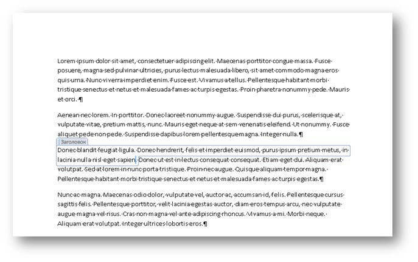

# <a name="content-controls-in-word"></a>Элементы управления содержимым в Word

Узнайте, как элементы управления содержимым в Microsoft Word 2013 расширяют возможности работы со структурированными документами.

В этой статье представлены сведения об изменениях элементов управления содержимым в Microsoft Word 2013 и сценариях работы с документами, которые становятся доступны в результате этих изменений.
  
### <a name="structured-documents"></a>Структурированные документы
<a name="WordCC_StructuredDocs"> </a>

Структурированные документы контролируют, в каком месте документа может отображаться содержимое, какие типы контента могут отображаться в документе и можно ли редактировать содержимое.
  
Ниже приведены некоторые распространенные сценарии для структурированного содержимого Microsoft Word.
  
- Адвокатской конторе нужно создать документы с юридическими формулировками, которые пользователь не должен менять.
    
- Организации нужно создать титульную страницу предложения, где пользователь вводит только заголовок, автора и дату.
    
- Организации нужно создать накладные, где в заранее определенных областях указываются данные о клиентах.
    
### <a name="using-content-controls-to-structure-a-document"></a>Создание структуры документа с помощью элементов управления содержимым
<a name="WordCC_StructuredDocs"> </a>

Элементы управления содержимым — это объекты Microsoft Word, действующие в качестве контейнеров для определенного содержимого документа. В отдельных элементах управления содержимым могут находиться такие элементы, как даты, списки или абзацы форматированного текста. Элементы управления содержимым помогают создавать форматированные, структурированные блоки содержимого и рассчитаны на использование в шаблонах, вставляющих конкретные блоки в документы, образуя структурированные документы.
  
Элементы управления содержимым идеально подходят для создания структурированных документов, ведь они помогают фиксировать расположение содержимого, задавать его тип (например, дату, рисунок или текст), ограничивать или разрешать редактирование, а также придавать содержимому семантическое значение.
  
### <a name="content-controls-in-word-2010"></a>Элементы управления содержимым в Word 2010
<a name="WordCC_StructuredDocs"> </a>

В Word 2010 доступны следующие элементы управления содержимым:
  
- форматированный текст;
    
- обычный текст;
    
- рисунок;
    
- коллекция стандартных блоков;
    
- поле со списком;
    
- раскрывающийся список;
    
- дата;
    
- флажок;
    
- группа.
    
Элементы управления содержимым в Word 2010 предоставляют различные возможности для создания структурированных документов, но в Word 2013 они делают возможными еще больше сценариев.
  
## <a name="content-control-improvements-in-word-2013"></a>Улучшения элементов управления содержимым в Word 2013
<a name="WordCC_WhatsNew"> </a>

Элементы управления содержимым в Word 2013 включают три основных усовершенствования: улучшенную визуализацию, поддержку сопоставления XML для элементов управления содержимым "Форматированный текст", а также новый элемент управления содержимым для повторяющегося контента.
  
### <a name="improved-visualization"></a>Улучшенные возможности визуализации

Word 2013 позволяет отображать отдельные элементы управления содержимым в одном из трех возможных состояний:
  
- в виде ограничивающего прямоугольника;
    
- в виде открывающего и закрывающего тегов;
    
- невидимым.
    
> [!NOTE]
> Если не указано иное, в этом разделе обсуждается визуализация элементов управления содержимым при просмотре документа не в **режиме конструктора**. Задать режим отображения для элемента управления содержимым можно с помощью раскрывающегося списка **Показать как** в диалоговом окне **Свойства элемента управления содержимым**. 
  
**Рис. 1. Диалоговое окно "Свойства элемента управления содержимым"**


  
Вы также можете задать режим отображения для элемента управления содержимым с помощью объектной модели Word 2013 (рассматриваемой ниже в разделе [Новые элементы объектной модели для элементов управления содержимым Word 2013](#WordCC_NewOM)).
  
### <a name="bounding-box"></a>Ограничивающий прямоугольник
<a name="WordCC_DefaultRendering"> </a>

По умолчанию элементы управления содержимым в Word 2013 отображаются так же, как в Word 2007 и Word 2010, то есть в виде ограничивающего прямоугольника. Если элемент управления содержимым отображается как **ограничивающий прямоугольник**, то режим отображения меняется в соответствии с действиями пользователя.
  
- Если элемент не находится в фокусе, то он не визуализируется.
    
- Если навести указатель мыши на элемент, он появится в виде затененного прямоугольника.
    
**Рис. 2. Элемент управления содержимым при наведении указателя мыши**


  
- Если элемент управления содержимым находится в фокусе (когда пользователь выбирает его), он отображается как "ограничивающий прямоугольник" (с линией вокруг содержимого и заголовком, если он задан).
    
**Рис. 3. Элемент управления содержимым в фокусе**


  
### <a name="startend-tags"></a>Открывающий и закрывающий теги
<a name="WordCC_StartEndTags"> </a>

Если элемент управления содержимым отображается как **открывающий или закрывающий теги**, то теги видны независимо от действий пользователя, а заголовок никогда не отображается. Однако кнопки (например, **Раскрывающийся список**) отображаются при наведении указателя мыши. 
  
**Рис. 4. Вариант отображения элемента управления содержимым в виде закрывающего и открывающего тегов**


  
### <a name="none"></a>Невидимость
<a name="WordCC_Invisible"> </a>

Если выбран вариант **Нет**, то элемент управления содержимым не отображается.
  
### <a name="content-control-colorization"></a>Окраска элемента управления содержимым
<a name="WordCC_CCColorization"> </a>

Помимо различных вариантов отображения, в Word 2013 также можно выбирать цвета отдельных элементов управления содержимым. Вы можете задать цвет элемента управления содержимым с помощью кнопки **Цвет** в диалоговом окне **Свойства элемента управления содержимым**. 
  
Вы также можете задать цвет элемента управления содержимым с помощью объектной модели Word 2013 (рассматриваемой ниже в разделе [Новые элементы объектной модели для элементов управления содержимым Word 2013](#WordCC_NewOM)).
  
**Рис. 5. Диалоговое окно "Свойства элемента управления содержимым"**


  
### <a name="support-for-xml-mapping-for-rich-text-content-controls"></a>Поддержка сопоставления XML для элементов управления содержимым "Форматированный текст"
<a name="WordCC_XMLMapping"> </a>

Word 2013 помогает сопоставлять содержимое элементов управления содержимым "Форматированный текст" и "Стандартный блок документа" с хранилищем данных XML. Для этого необходимо задать *сопоставление XML* с элементом управления содержимым. Вы можете задать это свойство с помощью имеющегося метода **XMLMapping.SetMapping** объектной модели. В пользовательской XML-части код XML хранится в виде плоской разметки Open XML, преобразованной в строку (с помощью стандартной кодировки XML), чтобы ее можно было сохранить в виде текстового узла в пользовательской XML-части. Однако сопоставление по-прежнему ограничено: успешно выполнить сопоставление можно только с листовыми узлами или атрибутами. 
  
> [!NOTE]
> Элементы управления содержимым "Форматированный текст" не могут содержать другие элементы этого типа. Если один элемент управления содержимым находится внутри другого (например, по причине манипуляций с форматами файлов, копирования и вставки и т. д.), то он остается несвязанным, пока он находится внутри сопоставленного элемента управления содержимым "Форматированный текст". 
  
Дополнительные сведения о том, как настраивать сопоставление XML, см. в разделе [Новые элементы объектной модели для элементов управления содержимым Word 2013](#WordCC_NewOM) далее в этой статье. 
  
### <a name="supporting-repeating-content"></a>Поддержка повторяющегося содержимого
<a name="WordCC_SupportingRepeating"> </a>

Помимо улучшений визуализации и поддержки сопоставления XML с элементами управления содержимым "Форматированный текст", в Word 2013 также добавлен новый элемент управления содержимым, позволяющий повторять содержимое. Элемент управления содержимым "Повторяющийся раздел" повторяет включенное в него содержимое, в том числе другие элементы управления содержимым.
  
Элемент управления содержимым "Повторяющийся раздел" вставляется вокруг целых абзацев или строк таблиц. Если элемент управления содержимым окружает раздел, вы можете вставить копии этого раздела над включенным в него разделом или под ним.
  
**Рис. 6. Контекстное меню элемента управления содержимым "Повторяющийся раздел"**


  
Вы можете повторить вставленный раздел, используя либо элемент управления в конце элемента управления содержимым (в виде кнопки со знаком "плюс" — ), либо команду из контекстного меню, как показано на рис. 6. Повторяющееся содержимое становится отдельным разделом элемента управления, которому можно назначить название с помощью диалогового окна **Свойства элемента управления содержимым**. 
  
**Рис. 7. Назначение названия раздела в диалоговом окне "Свойства элемента управления содержимым"**


  
Когда разделу будет назначено название, пользователи смогут добавлять и удалять его по имени, выбирая параметр **Разрешить пользователям добавлять и удалять разделы** в диалоговом окне **Свойства элемента управления содержимым**. 
  
**Рис. 8. Удаление раздела с помощью контекстного меню для элемента управления содержимым "Повторяющийся раздел"**


  
Если элемент управления содержимым "Повторяющийся раздел" окружает другие элементы управления содержимым, то вложенные в него элементы повторяются в каждом новом экземпляре. Однако в качестве содержимого этих элементов управления используется замещающий текст. Существует два исключения, когда дочерние элементы управления содержимым остаются без изменений: 
  
- если дочерний элемент управления является повторяющимся разделом;
    
- если дочерний элемент управления сопоставлен при помощи XML с узлом за пределами элемента управления содержимым "Повторяющийся раздел".
    
**Рис. 9. Элемент управления содержимым "Повторяющийся раздел" с дочерними элементами управления перед повторением**


  
**Рис. 10. Элемент управления содержимым "Повторяющийся раздел" с дочерними элементами управления после повторения**


  
### <a name="repeating-section-content-controls-around-xml-mapped-controls"></a>Элементы управления содержимым "Повторяющийся раздел" вокруг сопоставленных при помощи XML элементов управления
<a name="WordCC_RepeatingSectionCCs"> </a>

Ниже описано, как Word 2013 работает с сопоставлениями XML, содержащимися в повторяющемся разделе.
  
Если сопоставление не пересекается с элементом в узле, заданном в рамках родительской цепочки, то привязка является абсолютной и отображает одно и то же содержимое во всех элементах повторяющихся разделов.
  
Если сопоставление пересекается с элементом в узле, заданном в рамках родительской цепочки, то привязка является относительной и переназначается описанным ниже образом.
  
- Определяется абсолютная привязка к узлу (со сведением всех выражений запросов). Это должно произойти при первоначальном сопоставлении.
    
- Ось привязки, пересекающаяся с набором узлов, удаляется.
    
- Оставшаяся часть значения XPath оценивается относительно свойства XPath элемента содержимого повторяющегося раздела.
    
Например, могут быть созданы описанные ниже сопоставления.
  
- Повторяющийся раздел сопоставляется с путем \root\next\path.
    
- Элемент управления в примере элемента сопоставляется с путем \root\next\path[2]\baz.
    
- Word сопоставляет путь \root\next\path[2] с элементом в наборе узлов.
    
Следовательно, привязка оценивается как .\baz, где основанием является узел элемента повторяющегося содержимого.
  
Приведенные ниже рекомендации по работе с элементам управления повторяющимся содержимым помогут вам предотвратить потерю данных и избежать неудобств.
  
### <a name="working-with-repeating-section-content-controls-that-are-mapped-to-xml-data"></a>Работа с элементами управления содержимым "Повторяющийся раздел", которые сопоставлены с данными XML
<a name="WordCC_RepeatingSectionCCs"> </a>

Если в документ вставлен элемент управления содержимым "Повторяющийся раздел", сопоставленный с данными XML, то каждый раз, когда пользователь повторно открывает документ, Word воссоздает элементы повторяющихся разделов в соответствии со сведениями из хранилища данных. Даже если сохранить документ, все изменения, внесенные пользователям в элементы повторяющихся разделов документа, которые не сопоставлены с хранилищем данных, будут потеряны.
  
Чтобы предотвратить это, заблокируйте элемент управления содержимым "Повторяющийся раздел" и разрешите пользователю редактировать только разблокированные дочерние элементы управления содержимым, которые также сопоставлены с XML.
  
### <a name="binding-a-repeating-section-content-control-to-a-table"></a>Привязка элемента управления содержимым "Повторяющийся раздел" к таблице
<a name="WordCC_RepeatingSectionCCs"> </a>

Если вам нужно привязать элемент управления содержимым "Повторяющийся раздел" к таблице, вставьте таблицу, а *затем* вставьте элемент управления содержимым "Повторяющийся раздел" (не наоборот). В противном случае выбрать таблицу отдельно будет невозможно. 
  
### <a name="nesting-repeating-section-content-controls-within-a-table"></a>Вложение элементов управления содержимым "Повторяющийся раздел" в таблице
<a name="WordCC_RepeatingSectionCCs"> </a>

Тесная вложенность элементов управления содержимым "Повторяющийся раздел" в таблице (например, если окончания родительского и дочернего элементов находятся в одной ячейке) приводит к удалению внешнего повторяющегося раздела при добавлении или удалении элемента внутреннего раздела.
  
Это можно предотвратить, добавив маркер абзаца между окончаниями элементов управления содержимым "Повторяющийся раздел". Чтобы скрыть маркер абзаца, отмените выбор параметра **Показать или скрыть** на вкладке **Главная** ленты. 
  
### <a name="open-xml-file-format-schema-additions"></a>Дополнения схемы формата файлов Open XML
<a name="WordCC"> </a>

В схему WordprocessingML формата файлов Open XML были добавлены перечисленные ниже элементы.
  
**Таблица 1. Новые элементы схемы WordprocessingML формата файлов Open XML для элементов управления содержимым**

|**Элемент**|**Описание**|
|:-----|:-----|
|\<w:appearance\>  <br/> |Элемент \<w:appearance\> является дочерним для элемента \<w:sdtPr\>.  <br/> Поддерживаемые значения атрибута val:  <br/> \<w:appearance val= boundingBox|tags|hidden.  <br/> Значение по умолчанию — boundingBox.  <br/> |
|\<w:color\>  <br/> |Элемент \<w:color\> является дочерним для элемента \<w:sdtPr\>.  <br/> Модель содержимого соответствует имеющемуся сложному типу CT_Color. Значение по умолчанию — цвет, используемый в Word 2010.  <br/> |
   
## <a name="new-word-2013-content-control-object-model-members"></a>Новые элементы объектной модели для элементов управления содержимым Word 2013
<a name="WordCC_NewOM"> </a>

В рамках новых улучшений и дополнений для элементов управления содержимым в Word 2013 была обновлена объектная модель для Word. Теперь разрешаются программные манипуляции с новым набором компонентов. Кроме того, были внесены изменения в базовый формат файлов Open XML для текстовых документов.
  
В последующих разделах представлены дополнительные сведения о конкретных изменениях объектной модели, связанных с каждым улучшением элементов управления содержимым.
  
### <a name="visualization-enhancements"></a>Улучшения визуализации
<a name="WordCC_VisEnhancements"> </a>

В Word 2013 включен ряд дополнений объектной модели, чтобы улучшить визуализацию элементов управления содержимым. В приведенной ниже таблице перечислены новые элементы объекта **ContentControl** для визуализации. 
  
**Таблица 2. Новые элементы объекта ContentControl**

|**Элемент**|**Описание**|
|:-----|:-----|
|. **Appearance** типа **WdContentControlAppearance** <br/> |Возвращает или задает вариант визуализации элемента управления содержимым.  <br/> |
|. **Color** типа **WdColor** <br/> |Возвращает или задает цвет элемента управления содержимым.  <br/> |
   
В приведенной ниже таблице перечислены константы из нового перечисления **WdContentControlAppearance**. 
  
**Таблица 3. Константы из нового перечисления WdContentControlAppearance**

|**Константа**|**Описание**|
|:-----|:-----|
|**wdContentControlBoundingBox** <br/> |Представляет элемент управления содержимым, отображаемый в виде затененного или ограничивающего прямоугольника (с необязательным заголовком).  <br/> |
|**wdContentControlTags** <br/> |Представляет элемент управления содержимым, отображаемый в виде маркеров начала и конца.  <br/> |
|**wdContentControlHidden** <br/> |Представляет элемент управления содержимым, который не отображается.  <br/> |
   
### <a name="code-sample"></a>Пример кода
<a name="WordCC_VisEnhancements"> </a>

В приведенном ниже примере кода показано, как создавать элементы управления содержимым "Форматированный текст" и задавать способ визуализации программным образом.
  
```vb
Sub testVisualization()
   Dim objcc As ContentControl
   Dim objRange As Range
   
   ' Get the first paragraph as a range object.
   Set objRange = ActiveDocument.Paragraphs(1).Range
   ' Create a rich text content control around the first paragraph.
   Set objcc = ActiveDocument.ContentControls.Add(wdContentControlRichText, objRange)
   objcc.Title = "Default Bounding Box"
   ' Set visualization to the default.
   objcc.Appearance = wdContentControlBoundingBox
   
   ' Create a new paragraph.
   objRange.InsertParagraphAfter
   Set objRange = ActiveDocument.Paragraphs(2).Range
   ' Create a rich text content control around the second paragraph.
   Set objcc = ActiveDocument.ContentControls.Add(wdContentControlRichText, objRange)
   objcc.Title = "Non Bounding"
   ' Set visualization to invisible.
   objcc.Appearance = wdContentControlHidden
   
   ' Create a new paragraph.
   objRange.InsertParagraphAfter
   Set objRange = ActiveDocument.Paragraphs(3).Range
   ' Create a rich text content control around the third paragraph.
   Set objcc = ActiveDocument.ContentControls.Add(wdContentControlRichText, objRange)
   objcc.Title = "Tags Only with Pink color"
   ' Set visualization to Start/End tags with pink color.
   objcc.Appearance = wdContentControlTags
   objcc.Color = wdColorPink
End Sub
```

### <a name="xml-mapping"></a>Сопоставление XML
<a name="WordCC_XMLMappingOM"> </a>

В объектную модель Word 2013 не были внесены никакие изменения для поддержки сопоставления форматированного текста с узлами XML в хранилище данных документа. Вместо этого используйте имеющуюся объектную модель, чтобы сопоставить элемент управления содержимым "Форматированный текст" с узлом XML в хранилище данных документа. Кроме того, в базовую схему WordprocessingML формата файлов Open XML в рамках недавно добавленной поддержки элементов управления содержимым "Форматированный текст" не были внесены никакие изменения специально для сопоставления XML.
  
#### <a name="code-sample"></a>Пример кода

В приведенном ниже примере кода показано, как программным способом сопоставить элемент управления содержимым "Форматированный текст" с узлом XML.
  
```vb
Sub testRichBinding()
   Dim objRange As Range
   Dim objcc As ContentControl
   Dim objCustomPart As CustomXMLPart
   Dim blnMap As Boolean
   
   ' Add a custom XML part to the data store.
   Set objCustomPart = ActiveDocument.CustomXMLParts.Add
   ' Load XML fragment into the custom XML part.
   objCustomPart.LoadXML ("<x>Rich Text Databinding</x>")
   ' Get the first paragraph as a range object.
   Set objRange = ActiveDocument.Paragraphs(1).Range
   ' Create a rich text content control around the first paragraph.
   Set objcc = ActiveDocument.ContentControls.Add(wdContentControlRichText, objRange)
   ' Bind the XML node to the rich text content control.
   blnMap = objcc.XMLMapping.SetMapping("/x")
   ' Return whether mapping worked.
   MsgBox objcc.XMLMapping.IsMapped
End Sub
```

### <a name="repeating-section-content-controls-represented-in-the-object-model"></a>Элементы управления содержимым "Повторяющийся раздел", представленные в объектной модели
<a name="WordCC_RepeatingSection"> </a>

Элемент управления содержимым "Повторяющийся раздел" доступен в объектной модели с использованием перечисленных ниже дополнений к объекту **ContentControl** и новым объектам **RepeatingSectionItem** и **RepeatingSectionItemColl**. В таблице 4 перечислены наиболее важные из новых элементов объекта **ContentControl** для элементов управления содержимым "Повторяющийся раздел". 
  
**Таблица 4. Элементы объекта ContentControl**

|**Элемент**|**Описание**|
|:-----|:-----|
|**AllowInsertDeleteSection** типа **Boolean** <br/> |Возвращает или задает значение, указывающее, могут ли пользователи добавлять или удалять разделы из элемента управления содержимым с помощью пользовательского интерфейса. Если это свойство вызывается для элемента управления содержимым, не являющегося повторяющимся разделом, то вызов завершается ошибкой со следующим сообщением: "Это свойство можно использовать только с элементами управления содержимым «Повторяющийся раздел»".  <br/> |
|**RepeatingSectionItemTitle** типа **String** <br/> |Возвращает или задает имена элементов повторяющихся разделов, используемых в контекстном меню. Если это свойство вызывается для элемента управления содержимым, не являющегося повторяющимся разделом, то вызов завершается со следующей ошибкой: "Это свойство можно использовать только с элементами управления содержимым «Повторяющийся раздел»".  <br/> |
|**InsertRepeatingSectionItemBefore** типа **ContentControl** <br/> |Добавляет элемент повторяющегося раздела перед текущим элементом и возвращает этот новый элемент. Если этот метод вызывается для элемента управления содержимым, не являющегося элементом повторяющегося раздела, то вызов завершается со следующей ошибкой: "Это свойство можно использовать только с элементами управления содержимым «Элемент повторяющегося раздела»".  <br/> |
|**InsertRepeatingSectionItemAfter** типа **ContentControl** <br/> |Добавляет элемент повторяющегося раздела после текущего элемента и возвращает этот новый элемент. Если этот метод вызывается для элемента управления содержимым, не являющегося элементом повторяющегося раздела, то вызов завершается со следующей ошибкой: "Это свойство можно использовать только с элементами управления содержимым «Элемент повторяющегося раздела»".  <br/> |
   
В таблице 5 перечислены наиболее важные элементы объекта **RepeatingSectionItem**. 
  
**Таблица 5. Элементы объекта RepeatingSectionItem**

|**Элемент**|**Описание**|
|:-----|:-----|
|**Range** типа **Range** <br/> |Возвращает диапазон указанного элемента повторяющегося раздела за исключением открывающего и закрывающего тегов.  <br/> |
|**Delete** <br/> |Удаляет указанный элемент повторяющегося раздела.  <br/> |
|**InsertItemAfter** типа **RepeatingSectionItem** <br/> |Добавляет элемент повторяющегося раздела после указанного элемента и возвращает новый элемент.  <br/> |
|**InsertItemBefore** типа **RepeatingSectionItem** <br/> |Добавляет элемент повторяющегося раздела перед указанным элементом и возвращает новый элемент.  <br/> |
   
В таблице 6 перечислены наиболее важные элементы объекта **RepeatingSectionItemColl**. 
  
**Таблица 6. Элементы объекта RepeatingSectionItemColl**

|**Элемент**|**Описание**|
|:-----|:-----|
|**Item** типа **RepeatingSectionItem** <br/> |Возвращает отдельный элемент повторяющегося раздела.  <br/> |
   
В таблице 7 показан новый элемент перечисления **WdContentControlType** для элементов управления содержимым "Повторяющийся раздел". 
  
**Таблица 7. Дополнение к перечислению WdContentControlType**

|**Константа**|**Описание**|
|:-----|:-----|
|**wdContentControlRepeatingSection** <br/> |Представляет элемент управления содержимым, который содержит отдельный элемент из повторяющегося раздела.  <br/> |
   
### <a name="code-sample"></a>Пример кода
<a name="WordCC_RepeatingSection"> </a>

В приведенном ниже примере кода показано, как работать с элементами управления содержимым "Повторяющийся раздел" программным способом.
  
```vb
Sub testRepeatingSectionControl()
   Dim objRange As Range
   Dim objTable As Table
   Dim objCustomPart As CustomXMLPart
   Dim objCC As ContentControl
   Dim objCustomNode As CustomXMLNode
   
   Set objCustomPart = ActiveDocument.CustomXMLParts.Add
   objCustomPart.LoadXML ("<books>" & _
       "<book><title>Everyday Italian</title>" & _
       "<author>Giada De Laurentiis</author></book>" & _
       "<book><title>Harry Potter</title>" & _
       "<author>J K. Rowling</author></book>" & _
       "<book><title>Learning XML</title>" & _
       "<author>Erik T. Ray</author></book></books>")
   
   Set objRange = ActiveDocument.Paragraphs(1).Range
   Set objTable = ActiveDocument.Tables.Add(objRange, 2, 2)
   With objTable.Borders
       .InsideLineStyle = wdLineStyleSingle
       .OutsideLineStyle = wdLineStyleDouble
   End With
   Set objRange = objTable.Cell(1, 1).Range
   Set objCustomNode = objCustomPart.SelectSingleNode("/books[1]/book[1]/title[1]")
   Set objCC = ActiveDocument.ContentControls.Add(wdContentControlText, objRange)
   objCC.XMLMapping.SetMappingByNode objCustomNode
   Set objRange = objTable.Cell(1, 2).Range
   Set objCustomNode = objCustomPart.SelectSingleNode("/books[1]/book[1]/author[1]")
   Set objCC = ActiveDocument.ContentControls.Add(wdContentControlText, objRange)
   objCC.XMLMapping.SetMappingByNode objCustomNode
   Set objRange = objTable.Rows(1).Range
   Set objCC = ActiveDocument.ContentControls.Add(wdContentControlRepeatingSection, objRange)
   objCC.XMLMapping.SetMapping ("/books[1]/book")
End Sub
```

### <a name="open-xml-file-format-changes-for-repeating-section-content-controls"></a>Формат файлов Open XML для элементов управления содержимым "Повторяющийся раздел"
<a name="WordCC_RepeatingSection"> </a>

В представлении форматов файлов для элемента управления содержимым "Повторяющийся раздел" обычно используются те же имена элементов, значения и т. д., что и в имеющейся разметке XML. Однако элемент \<sdt\>, представляющий внешний контейнер повторяющегося раздела, существует в пространстве имен Word 2013, чтобы обеспечить совместимость с более ранними версиями Word.
  
Отдельные повторяющиеся элементы в рамках элемента управления содержимым "Повторяющийся раздел" (окружающего каждый из этих элементов) сохраняются как элементы управления содержимым "Форматированный текст" с использованием имеющегося представления WordprocessingML. В таблице 8 перечислены новые элементы схемы WordprocessingML для элементов управления содержимым "Повторяющийся раздел".
  
**Таблица 8. Новые элементы схемы WordprocessingML для элементов управления содержимым "Повторяющийся раздел"**

|**Элемент**|**Описание**|
|:-----|:-----|
|\<w15:repeatingSection\>  <br/> |Задает элемент управления содержимым "Повторяющийся раздел". Этот элемент и все остальные типы элементов управления являются взаимоисключающими. Он не содержит дочерних элементов и атрибутов.  <br/> |
|\<w15:repeatingSectionItem\>  <br/> |Задает элемент управления содержимым "Элемент повторяющегося раздела". Этот элемент и все остальные типы элементов управления являются взаимоисключающими. Он не содержит дочерних элементов и атрибутов.  <br/> |
|\<w15:doNotAllowInsertDeleteSection\>  <br/> |Указывает, что пользователь не может добавлять и удалять разделы с помощью пользовательского интерфейса Word 2013.  <br/> |
|\<w15:sectionTitle\>  <br/> |Задает имена элементов повторяющихся разделов (и используется в контекстном меню при выборе элемента управления).  <br/> |
   

  

