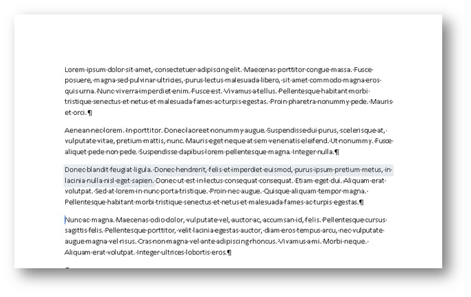

# <a name="content-controls-in-word"></a><span data-ttu-id="0bef9-104">Элементы управления содержимым в Word</span><span class="sxs-lookup"><span data-stu-id="0bef9-104">Content controls in Word</span></span>

<span data-ttu-id="0bef9-105">Узнайте, как элементы управления содержимым в Microsoft Word 2013 расширяют возможности работы со структурированными документами.</span><span class="sxs-lookup"><span data-stu-id="0bef9-105">Learn how Microsoft Word 2013 content controls enable a larger range of structured document scenarios.</span></span>

<span data-ttu-id="0bef9-106">В этой статье представлены сведения об изменениях элементов управления содержимым в Microsoft Word 2013 и сценариях работы с документами, которые становятся доступны в результате этих изменений.</span><span class="sxs-lookup"><span data-stu-id="0bef9-106">This topic provides information about changes to content controls in Microsoft Word 2013 and the document scenarios that those changes enable.</span></span>
  
### <a name="structured-documents"></a><span data-ttu-id="0bef9-107">Структурированные документы</span><span class="sxs-lookup"><span data-stu-id="0bef9-107">Structured documents</span></span>
<span data-ttu-id="0bef9-108"><a name="WordCC_StructuredDocs"> </a></span><span class="sxs-lookup"><span data-stu-id="0bef9-108"></span></span>

<span data-ttu-id="0bef9-109">Структурированные документы контролируют, в каком месте документа может отображаться содержимое, какие типы контента могут отображаться в документе и можно ли редактировать содержимое.</span><span class="sxs-lookup"><span data-stu-id="0bef9-109">Structured documents are documents that control where content can appear on a document, what kind of content can appear in the document, and whether that content can be edited.</span></span>
  
<span data-ttu-id="0bef9-110">Ниже приведены некоторые распространенные сценарии для структурированного содержимого Microsoft Word.</span><span class="sxs-lookup"><span data-stu-id="0bef9-110">Here are some common scenarios for structured content in Microsoft Word:</span></span>
  
- <span data-ttu-id="0bef9-111">Адвокатской конторе нужно создать документы с юридическими формулировками, которые пользователь не должен менять.</span><span class="sxs-lookup"><span data-stu-id="0bef9-111">A legal firm needs to create documents that contain legal language that should not be changed by the user.</span></span>
    
- <span data-ttu-id="0bef9-112">Организации нужно создать титульную страницу предложения, где пользователь вводит только заголовок, автора и дату.</span><span class="sxs-lookup"><span data-stu-id="0bef9-112">A business needs to create a proposal cover page where only the title, author, and date are entered by the user.</span></span>
    
- <span data-ttu-id="0bef9-113">Организации нужно создать накладные, где в заранее определенных областях указываются данные о клиентах.</span><span class="sxs-lookup"><span data-stu-id="0bef9-113">A business needs to create invoices where the customer data is included in the invoice at predefined regions.</span></span>
    
### <a name="using-content-controls-to-structure-a-document"></a><span data-ttu-id="0bef9-114">Создание структуры документа с помощью элементов управления содержимым</span><span class="sxs-lookup"><span data-stu-id="0bef9-114">Using content controls to structure a document</span></span>
<span data-ttu-id="0bef9-115"><a name="WordCC_StructuredDocs"> </a></span><span class="sxs-lookup"><span data-stu-id="0bef9-115"></span></span>

<span data-ttu-id="0bef9-116">Элементы управления содержимым — это объекты Microsoft Word, действующие в качестве контейнеров для определенного содержимого документа.</span><span class="sxs-lookup"><span data-stu-id="0bef9-116">Content controls are Microsoft Word entities that act as containers for specific content in a document.</span></span> <span data-ttu-id="0bef9-117">В отдельных элементах управления содержимым могут находиться такие элементы, как даты, списки или абзацы форматированного текста.</span><span class="sxs-lookup"><span data-stu-id="0bef9-117">Individual content controls can contain content such as dates, lists, or paragraphs of formatted text.</span></span> <span data-ttu-id="0bef9-118">Элементы управления содержимым помогают создавать форматированные, структурированные блоки содержимого и рассчитаны на использование в шаблонах, вставляющих конкретные блоки в документы, образуя структурированные документы.</span><span class="sxs-lookup"><span data-stu-id="0bef9-118">Content controls help you to create rich, structured blocks of content and are designed for use in templates that insert well-defined blocks into your documents, creating structured documents.</span></span>
  
<span data-ttu-id="0bef9-119">Элементы управления содержимым идеально подходят для создания структурированных документов, ведь они помогают фиксировать расположение содержимого, задавать его тип (например, дату, рисунок или текст), ограничивать или разрешать редактирование, а также придавать содержимому семантическое значение.</span><span class="sxs-lookup"><span data-stu-id="0bef9-119">Content controls are ideal for creating structured documents because content controls help you fix the position of content, specify the kind of content (for example, a date, a picture, or text), restrict or enable editing, and add semantic meaning to content.</span></span>
  
### <a name="content-controls-in-word-2010"></a><span data-ttu-id="0bef9-120">Элементы управления содержимым в Word 2010</span><span class="sxs-lookup"><span data-stu-id="0bef9-120">Content controls in Word 2010</span></span>
<span data-ttu-id="0bef9-121"><a name="WordCC_StructuredDocs"> </a></span><span class="sxs-lookup"><span data-stu-id="0bef9-121"></span></span>

<span data-ttu-id="0bef9-122">В Word 2010 доступны следующие элементы управления содержимым:</span><span class="sxs-lookup"><span data-stu-id="0bef9-122">The following content controls are available in Word 2010:</span></span>
  
- <span data-ttu-id="0bef9-123">форматированный текст;</span><span class="sxs-lookup"><span data-stu-id="0bef9-123">Rich Text</span></span>
    
- <span data-ttu-id="0bef9-124">обычный текст;</span><span class="sxs-lookup"><span data-stu-id="0bef9-124">Plain Text</span></span>
    
- <span data-ttu-id="0bef9-125">рисунок;</span><span class="sxs-lookup"><span data-stu-id="0bef9-125">Picture</span></span>
    
- <span data-ttu-id="0bef9-126">коллекция стандартных блоков;</span><span class="sxs-lookup"><span data-stu-id="0bef9-126">Building Block Gallery</span></span>
    
- <span data-ttu-id="0bef9-127">поле со списком;</span><span class="sxs-lookup"><span data-stu-id="0bef9-127">Combo Box</span></span>
    
- <span data-ttu-id="0bef9-128">раскрывающийся список;</span><span class="sxs-lookup"><span data-stu-id="0bef9-128">Drop-Down List</span></span>
    
- <span data-ttu-id="0bef9-129">дата;</span><span class="sxs-lookup"><span data-stu-id="0bef9-129">Date</span></span>
    
- <span data-ttu-id="0bef9-130">флажок;</span><span class="sxs-lookup"><span data-stu-id="0bef9-130">Checkbox</span></span>
    
- <span data-ttu-id="0bef9-131">группа.</span><span class="sxs-lookup"><span data-stu-id="0bef9-131">Group</span></span>
    
<span data-ttu-id="0bef9-132">Элементы управления содержимым в Word 2010 предоставляют различные возможности для создания структурированных документов, но в Word 2013 они делают возможными еще больше сценариев.</span><span class="sxs-lookup"><span data-stu-id="0bef9-132">Word 2010 content controls enable various potential structured document solutions, but in Word 2013 content controls enable a greater range of scenarios.</span></span>
  
## <a name="content-control-improvements-in-word-2013"></a><span data-ttu-id="0bef9-133">Улучшения элементов управления содержимым в Word 2013</span><span class="sxs-lookup"><span data-stu-id="0bef9-133">Content control improvements in Word 2013</span></span>
<span data-ttu-id="0bef9-134"><a name="WordCC_WhatsNew"> </a></span><span class="sxs-lookup"><span data-stu-id="0bef9-134"></span></span>

<span data-ttu-id="0bef9-135">Элементы управления содержимым в Word 2013 включают три основных усовершенствования: улучшенную визуализацию, поддержку сопоставления XML для элементов управления содержимым "Форматированный текст", а также новый элемент управления содержимым для повторяющегося контента.</span><span class="sxs-lookup"><span data-stu-id="0bef9-135">In Word 2013, content controls provide three key improvements: improved visualization, support for XML Mapping for Rich Text content controls, and a new content control for repeating content.</span></span>
  
### <a name="improved-visualization"></a><span data-ttu-id="0bef9-136">Улучшенные возможности визуализации</span><span class="sxs-lookup"><span data-stu-id="0bef9-136">Improved visualization</span></span>

<span data-ttu-id="0bef9-137">Word 2013 позволяет отображать отдельные элементы управления содержимым в одном из трех возможных состояний:</span><span class="sxs-lookup"><span data-stu-id="0bef9-137">Word 2013 allows an individual content control to appear in one of three possible states:</span></span>
  
- <span data-ttu-id="0bef9-138">в виде ограничивающего прямоугольника;</span><span class="sxs-lookup"><span data-stu-id="0bef9-138">Bounding box</span></span>
    
- <span data-ttu-id="0bef9-139">в виде открывающего и закрывающего тегов;</span><span class="sxs-lookup"><span data-stu-id="0bef9-139">Start/End tags</span></span>
    
- <span data-ttu-id="0bef9-140">невидимым.</span><span class="sxs-lookup"><span data-stu-id="0bef9-140">None</span></span>
    
> [!NOTE]
> <span data-ttu-id="0bef9-141">Если не указано иное, в этом разделе обсуждается визуализация элементов управления содержимым при просмотре документа не в **режиме конструктора**. Задать режим отображения для элемента управления содержимым можно с помощью раскрывающегося списка **Показать как** в диалоговом окне **Свойства элемента управления содержимым**.</span><span class="sxs-lookup"><span data-stu-id="0bef9-141">If not stated otherwise, this section discusses the visualization of content controls when the document is not viewed in **Design Mode**.You set the display mode for a content control by using the **Show as** drop-down list control in the **Content Control Properties** dialog box.</span></span> 
  
<span data-ttu-id="0bef9-142">**Рис. 1. Диалоговое окно "Свойства элемента управления содержимым"**</span><span class="sxs-lookup"><span data-stu-id="0bef9-142">**Figure 1. Content Control Properties dialog box**</span></span>

<span data-ttu-id="0bef9-143"></span><span class="sxs-lookup"><span data-stu-id="0bef9-143"></span></span>
  
<span data-ttu-id="0bef9-144">Вы также можете задать режим отображения для элемента управления содержимым с помощью объектной модели Word 2013 (рассматриваемой ниже в разделе [Новые элементы объектной модели для элементов управления содержимым Word 2013](#WordCC_NewOM)).</span><span class="sxs-lookup"><span data-stu-id="0bef9-144">You can also set the display mode for a content control by using the Word 2013 object model (discussed later in [New Word 2013 content control object model members](#WordCC_NewOM)).</span></span>
  
### <a name="bounding-box"></a><span data-ttu-id="0bef9-145">Ограничивающий прямоугольник</span><span class="sxs-lookup"><span data-stu-id="0bef9-145">Bounding box</span></span>
<span data-ttu-id="0bef9-146"><a name="WordCC_DefaultRendering"> </a></span><span class="sxs-lookup"><span data-stu-id="0bef9-146"></span></span>

<span data-ttu-id="0bef9-147">По умолчанию элементы управления содержимым в Word 2013 отображаются так же, как в Word 2007 и Word 2010, то есть в виде ограничивающего прямоугольника.</span><span class="sxs-lookup"><span data-stu-id="0bef9-147">The default rendering for content controls in Word 2013 is to preserve the look of content controls as they appear in Word 2007 and Word 2010; that is, as a bounding box.</span></span> <span data-ttu-id="0bef9-148">Если элемент управления содержимым отображается как **ограничивающий прямоугольник**, то режим отображения меняется в соответствии с действиями пользователя.</span><span class="sxs-lookup"><span data-stu-id="0bef9-148">When a content control is set to show as **Bounding Box**, the display changes depending upon the following user interaction:</span></span>
  
- <span data-ttu-id="0bef9-149">Если элемент не находится в фокусе, то он не визуализируется.</span><span class="sxs-lookup"><span data-stu-id="0bef9-149">When the content control does not have the focus, no visualization occurs</span></span>
    
- <span data-ttu-id="0bef9-150">Если навести указатель мыши на элемент, он появится в виде затененного прямоугольника.</span><span class="sxs-lookup"><span data-stu-id="0bef9-150">On mouse-over, the content control appears as a shaded rectangle</span></span>
    
<span data-ttu-id="0bef9-151">**Рис. 2. Элемент управления содержимым при наведении указателя мыши**</span><span class="sxs-lookup"><span data-stu-id="0bef9-151">**Figure 2. Content control on mouse-over**</span></span>

<span data-ttu-id="0bef9-152"></span><span class="sxs-lookup"><span data-stu-id="0bef9-152"></span></span>
  
- <span data-ttu-id="0bef9-153">Если элемент управления содержимым находится в фокусе (когда пользователь выбирает его), он отображается как "ограничивающий прямоугольник" (с линией вокруг содержимого и заголовком, если он задан).</span><span class="sxs-lookup"><span data-stu-id="0bef9-153">When the content control has the focus (when the user chooses the content control), the control appears as a "bounding box" (with a line around the content and the title showing, if a title has been set)</span></span>
    
<span data-ttu-id="0bef9-154">**Рис. 3. Элемент управления содержимым в фокусе**</span><span class="sxs-lookup"><span data-stu-id="0bef9-154">**Figure 3. Content control with focus**</span></span>

<span data-ttu-id="0bef9-155"></span><span class="sxs-lookup"><span data-stu-id="0bef9-155"></span></span>
  
### <a name="startend-tags"></a><span data-ttu-id="0bef9-156">Открывающий и закрывающий теги</span><span class="sxs-lookup"><span data-stu-id="0bef9-156">Start/End tags</span></span>
<span data-ttu-id="0bef9-157"><a name="WordCC_StartEndTags"> </a></span><span class="sxs-lookup"><span data-stu-id="0bef9-157"></span></span>

<span data-ttu-id="0bef9-158">Если элемент управления содержимым отображается как **открывающий или закрывающий теги**, то теги видны независимо от действий пользователя, а заголовок никогда не отображается. Однако кнопки (например, **Раскрывающийся список**) отображаются при наведении указателя мыши.</span><span class="sxs-lookup"><span data-stu-id="0bef9-158">When the content control is set to show as **Start/End tag**, the tags are displayed regardless of user interaction, and the title never appears; but buttons, such as the **Drop-Down List** button, appear on mouse over.</span></span> 
  
<span data-ttu-id="0bef9-159">**Рис. 4. Вариант отображения элемента управления содержимым в виде закрывающего и открывающего тегов**</span><span class="sxs-lookup"><span data-stu-id="0bef9-159">**Figure 4. Content control set to show as start/end tags**</span></span>

<span data-ttu-id="0bef9-160"></span><span class="sxs-lookup"><span data-stu-id="0bef9-160"></span></span>
  
### <a name="none"></a><span data-ttu-id="0bef9-161">Невидимость</span><span class="sxs-lookup"><span data-stu-id="0bef9-161">None</span></span>
<span data-ttu-id="0bef9-162"><a name="WordCC_Invisible"> </a></span><span class="sxs-lookup"><span data-stu-id="0bef9-162"></span></span>

<span data-ttu-id="0bef9-163">Если выбран вариант **Нет**, то элемент управления содержимым не отображается.</span><span class="sxs-lookup"><span data-stu-id="0bef9-163">When the content control is set to show as **None**, the content control is not displayed.</span></span>
  
### <a name="content-control-colorization"></a><span data-ttu-id="0bef9-164">Окраска элемента управления содержимым</span><span class="sxs-lookup"><span data-stu-id="0bef9-164">Content control colorization</span></span>
<span data-ttu-id="0bef9-165"><a name="WordCC_CCColorization"> </a></span><span class="sxs-lookup"><span data-stu-id="0bef9-165"></span></span>

<span data-ttu-id="0bef9-166">Помимо различных вариантов отображения, в Word 2013 также можно выбирать цвета отдельных элементов управления содержимым.</span><span class="sxs-lookup"><span data-stu-id="0bef9-166">In addition to enabling a different kind of display for a content control, Word 2013 also helps you to set the color for an individual content control.</span></span> <span data-ttu-id="0bef9-167">Вы можете задать цвет элемента управления содержимым с помощью кнопки **Цвет** в диалоговом окне **Свойства элемента управления содержимым**.</span><span class="sxs-lookup"><span data-stu-id="0bef9-167">You set the color of a content control by using the **Color** button in the **Content Control Properties** dialog box.</span></span> 
  
<span data-ttu-id="0bef9-168">Вы также можете задать цвет элемента управления содержимым с помощью объектной модели Word 2013 (рассматриваемой ниже в разделе [Новые элементы объектной модели для элементов управления содержимым Word 2013](#WordCC_NewOM)).</span><span class="sxs-lookup"><span data-stu-id="0bef9-168">You can also set the color of a content control by using the Word 2013 object model (discussed later in [New Word 2013 content control object model members](#WordCC_NewOM)).</span></span>
  
<span data-ttu-id="0bef9-169">**Рис. 5. Диалоговое окно "Свойства элемента управления содержимым"**</span><span class="sxs-lookup"><span data-stu-id="0bef9-169">**Figure 5. Content Control Properties dialog box**</span></span>

<span data-ttu-id="0bef9-170"></span><span class="sxs-lookup"><span data-stu-id="0bef9-170"></span></span>
  
### <a name="support-for-xml-mapping-for-rich-text-content-controls"></a><span data-ttu-id="0bef9-171">Поддержка сопоставления XML для элементов управления содержимым "Форматированный текст"</span><span class="sxs-lookup"><span data-stu-id="0bef9-171">Support for XML mapping for rich text content controls</span></span>
<span data-ttu-id="0bef9-172"><a name="WordCC_XMLMapping"> </a></span><span class="sxs-lookup"><span data-stu-id="0bef9-172"></span></span>

<span data-ttu-id="0bef9-173">Word 2013 помогает сопоставлять содержимое элементов управления содержимым "Форматированный текст" и "Стандартный блок документа" с хранилищем данных XML.</span><span class="sxs-lookup"><span data-stu-id="0bef9-173">Word 2013 helps you to map the content of rich text content controls and document building block content controls to the XML data store.</span></span> <span data-ttu-id="0bef9-174">Для этого необходимо задать *сопоставление XML* с элементом управления содержимым.</span><span class="sxs-lookup"><span data-stu-id="0bef9-174">To do this, you set the  *XML mapping*  for the content control.</span></span> <span data-ttu-id="0bef9-175">Вы можете задать это свойство с помощью имеющегося метода **XMLMapping.SetMapping** объектной модели.</span><span class="sxs-lookup"><span data-stu-id="0bef9-175">You can set this property by using the existing **XMLMapping.SetMapping** method in the object model.</span></span> <span data-ttu-id="0bef9-176">В пользовательской XML-части код XML хранится в виде плоской разметки Open XML, преобразованной в строку (с помощью стандартной кодировки XML), чтобы ее можно было сохранить в виде текстового узла в пользовательской XML-части.</span><span class="sxs-lookup"><span data-stu-id="0bef9-176">Within the custom XML part, the custom XML is stored as flat Open XML markup converted into a string (by using standard XML encoding), so that it can be stored as a text node in the custom XML part.</span></span> <span data-ttu-id="0bef9-177">Однако сопоставление по-прежнему ограничено: успешно выполнить сопоставление можно только с листовыми узлами или атрибутами.</span><span class="sxs-lookup"><span data-stu-id="0bef9-177">However, the mapping continues to have the limitation that it can only successfully map to leaf nodes or attributes.</span></span> 
  
> [!NOTE]
> <span data-ttu-id="0bef9-178">Элементы управления содержимым "Форматированный текст" не могут содержать другие элементы этого типа.</span><span class="sxs-lookup"><span data-stu-id="0bef9-178">Rich text content controls cannot contain other rich text content controls.</span></span> <span data-ttu-id="0bef9-179">Если один элемент управления содержимым находится внутри другого (например, по причине манипуляций с форматами файлов, копирования и вставки и т. д.), то он остается несвязанным, пока он находится внутри сопоставленного элемента управления содержимым "Форматированный текст".</span><span class="sxs-lookup"><span data-stu-id="0bef9-179">If one exists inside of another (for example, because of file format manipulation, copy and paste, and so on), it is unlinked until it is no longer contained inside a mapped rich text control.</span></span> 
  
<span data-ttu-id="0bef9-180">Дополнительные сведения о том, как настраивать сопоставление XML, см. в разделе [Новые элементы объектной модели для элементов управления содержимым Word 2013](#WordCC_NewOM) далее в этой статье.</span><span class="sxs-lookup"><span data-stu-id="0bef9-180">For more information about how to set up XML mapping, see the section [New Word 2013 content control object model members](#WordCC_NewOM) later in this topic.</span></span> 
  
### <a name="supporting-repeating-content"></a><span data-ttu-id="0bef9-181">Поддержка повторяющегося содержимого</span><span class="sxs-lookup"><span data-stu-id="0bef9-181">Supporting repeating content</span></span>
<span data-ttu-id="0bef9-182"><a name="WordCC_SupportingRepeating"> </a></span><span class="sxs-lookup"><span data-stu-id="0bef9-182"></span></span>

<span data-ttu-id="0bef9-183">Помимо улучшений визуализации и поддержки сопоставления XML с элементами управления содержимым "Форматированный текст", в Word 2013 также добавлен новый элемент управления содержимым, позволяющий повторять содержимое.</span><span class="sxs-lookup"><span data-stu-id="0bef9-183">In addition to visualization enhancements and support for XML mapping to rich text content controls, Word 2013 also adds a new content control that enables you to repeat content.</span></span> <span data-ttu-id="0bef9-184">Элемент управления содержимым "Повторяющийся раздел" повторяет включенное в него содержимое, в том числе другие элементы управления содержимым.</span><span class="sxs-lookup"><span data-stu-id="0bef9-184">The repeating section content control repeats the content contained within it, including other content controls.</span></span>
  
<span data-ttu-id="0bef9-185">Элемент управления содержимым "Повторяющийся раздел" вставляется вокруг целых абзацев или строк таблиц.</span><span class="sxs-lookup"><span data-stu-id="0bef9-185">You insert the repeating section content control around entire paragraphs or table rows.</span></span> <span data-ttu-id="0bef9-186">Если элемент управления содержимым окружает раздел, вы можете вставить копии этого раздела над включенным в него разделом или под ним.</span><span class="sxs-lookup"><span data-stu-id="0bef9-186">Once the control surrounds a section, you can insert copies of the section above or below the contained section.</span></span>
  
<span data-ttu-id="0bef9-187">**Рис. 6. Контекстное меню элемента управления содержимым "Повторяющийся раздел"**</span><span class="sxs-lookup"><span data-stu-id="0bef9-187">**Figure 6. Repeating section content control context menu**</span></span>

<span data-ttu-id="0bef9-188"></span><span class="sxs-lookup"><span data-stu-id="0bef9-188"></span></span>
  
<span data-ttu-id="0bef9-189">Вы можете повторить вставленный раздел, используя либо элемент управления в конце элемента управления содержимым (в виде кнопки со знаком "плюс" — ), либо команду из контекстного меню, как показано на рис. 6.</span><span class="sxs-lookup"><span data-stu-id="0bef9-189">You can repeat the inserted section by using either the control on the end of the content control (displayed as a button with a plus sign ()) or by choosing a command on the context menu, as shown in Figure 6.</span></span> <span data-ttu-id="0bef9-190">Повторяющееся содержимое становится отдельным разделом элемента управления, которому можно назначить название с помощью диалогового окна **Свойства элемента управления содержимым**.</span><span class="sxs-lookup"><span data-stu-id="0bef9-190">The repeated content becomes a separate section of the control that you can assign a title by using the **Content Control Properties** dialog box.</span></span> 
  
<span data-ttu-id="0bef9-191">**Рис. 7. Назначение названия раздела в диалоговом окне "Свойства элемента управления содержимым"**</span><span class="sxs-lookup"><span data-stu-id="0bef9-191">**Figure 7. Assign a section title in the Content Control Properties dialog box**</span></span>

<span data-ttu-id="0bef9-192"></span><span class="sxs-lookup"><span data-stu-id="0bef9-192"></span></span>
  
<span data-ttu-id="0bef9-193">Когда разделу будет назначено название, пользователи смогут добавлять и удалять его по имени, выбирая параметр **Разрешить пользователям добавлять и удалять разделы** в диалоговом окне **Свойства элемента управления содержимым**.</span><span class="sxs-lookup"><span data-stu-id="0bef9-193">Once you have given the section a title, if you select **Allow users to add and remove sections** in the **Content Control Properties** dialog box, users can add or delete the section by name.</span></span> 
  
<span data-ttu-id="0bef9-194">**Рис. 8. Удаление раздела с помощью контекстного меню для элемента управления содержимым "Повторяющийся раздел"**</span><span class="sxs-lookup"><span data-stu-id="0bef9-194">**Figure 8. Use the repeating section content control context menu to delete a section**</span></span>

<span data-ttu-id="0bef9-195"></span><span class="sxs-lookup"><span data-stu-id="0bef9-195"></span></span>
  
<span data-ttu-id="0bef9-196">Если элемент управления содержимым "Повторяющийся раздел" окружает другие элементы управления содержимым, то вложенные в него элементы повторяются в каждом новом экземпляре. Однако в качестве содержимого этих элементов управления используется замещающий текст.</span><span class="sxs-lookup"><span data-stu-id="0bef9-196">When a repeating section content control surrounds other content controls, the enclosed content controls are repeated in each new item; but any such content controls have their contents reset to placeholder text.</span></span> <span data-ttu-id="0bef9-197">Существует два исключения, когда дочерние элементы управления содержимым остаются без изменений:</span><span class="sxs-lookup"><span data-stu-id="0bef9-197">There are two exceptions where child control contents are preserved:</span></span> 
  
- <span data-ttu-id="0bef9-198">если дочерний элемент управления является повторяющимся разделом;</span><span class="sxs-lookup"><span data-stu-id="0bef9-198">When a child control is a repeating section control.</span></span>
    
- <span data-ttu-id="0bef9-199">если дочерний элемент управления сопоставлен при помощи XML с узлом за пределами элемента управления содержимым "Повторяющийся раздел".</span><span class="sxs-lookup"><span data-stu-id="0bef9-199">When a child control is XML-mapped to a node outside the repeating section content control.</span></span>
    
<span data-ttu-id="0bef9-200">**Рис. 9. Элемент управления содержимым "Повторяющийся раздел" с дочерними элементами управления перед повторением**</span><span class="sxs-lookup"><span data-stu-id="0bef9-200">**Figure 9. Repeating section content control containing child controls before repeat**</span></span>

<span data-ttu-id="0bef9-201"></span><span class="sxs-lookup"><span data-stu-id="0bef9-201"></span></span>
  
<span data-ttu-id="0bef9-202">**Рис. 10. Элемент управления содержимым "Повторяющийся раздел" с дочерними элементами управления после повторения**</span><span class="sxs-lookup"><span data-stu-id="0bef9-202">**Figure 10. Repeating section content control containing child controls after repeat**</span></span>

<span data-ttu-id="0bef9-203"></span><span class="sxs-lookup"><span data-stu-id="0bef9-203"></span></span>
  
### <a name="repeating-section-content-controls-around-xml-mapped-controls"></a><span data-ttu-id="0bef9-204">Элементы управления содержимым "Повторяющийся раздел" вокруг сопоставленных при помощи XML элементов управления</span><span class="sxs-lookup"><span data-stu-id="0bef9-204">Repeating section content controls around XML-mapped controls</span></span>
<span data-ttu-id="0bef9-205"><a name="WordCC_RepeatingSectionCCs"> </a></span><span class="sxs-lookup"><span data-stu-id="0bef9-205"></span></span>

<span data-ttu-id="0bef9-206">Ниже описано, как Word 2013 работает с сопоставлениями XML, содержащимися в повторяющемся разделе.</span><span class="sxs-lookup"><span data-stu-id="0bef9-206">For XML mappings that are contained in a repeating section, Word 2013 maps them as follows.</span></span>
  
<span data-ttu-id="0bef9-207">Если сопоставление не пересекается с элементом в узле, заданном в рамках родительской цепочки, то привязка является абсолютной и отображает одно и то же содержимое во всех элементах повторяющихся разделов.</span><span class="sxs-lookup"><span data-stu-id="0bef9-207">If the mapping does not intersect with an item in the node set as part of its parent chain, the binding is an "absolute binding" and shows the same content in all repeating section items.</span></span>
  
<span data-ttu-id="0bef9-208">Если сопоставление пересекается с элементом в узле, заданном в рамках родительской цепочки, то привязка является относительной и переназначается описанным ниже образом.</span><span class="sxs-lookup"><span data-stu-id="0bef9-208">If the mapping does intersect with an item in the node set as part of its parent chain, the binding is a "relative binding", and is remapped as follows:</span></span>
  
- <span data-ttu-id="0bef9-209">Определяется абсолютная привязка к узлу (со сведением всех выражений запросов). Это должно произойти при первоначальном сопоставлении.</span><span class="sxs-lookup"><span data-stu-id="0bef9-209">The absolute binding for the node is determined (flattening out any query expressions)─this should happen on initial mapping</span></span>
    
- <span data-ttu-id="0bef9-210">Ось привязки, пересекающаяся с набором узлов, удаляется.</span><span class="sxs-lookup"><span data-stu-id="0bef9-210">The axis of the binding that intersects with the node set is removed</span></span>
    
- <span data-ttu-id="0bef9-211">Оставшаяся часть значения XPath оценивается относительно свойства XPath элемента содержимого повторяющегося раздела.</span><span class="sxs-lookup"><span data-stu-id="0bef9-211">The remainder of the XPath is evaluated relative to the XPath of the repeating section content item</span></span>
    
<span data-ttu-id="0bef9-212">Например, могут быть созданы описанные ниже сопоставления.</span><span class="sxs-lookup"><span data-stu-id="0bef9-212">For example, the following mappings might occur:</span></span>
  
- <span data-ttu-id="0bef9-213">Повторяющийся раздел сопоставляется с путем \root\next\path.</span><span class="sxs-lookup"><span data-stu-id="0bef9-213">The repeating section is mapped to \root\next\path</span></span>
    
- <span data-ttu-id="0bef9-214">Элемент управления в примере элемента сопоставляется с путем \root\next\path[2]\baz.</span><span class="sxs-lookup"><span data-stu-id="0bef9-214">The control in the sample item is mapped to \root\next\path[2]\baz</span></span>
    
- <span data-ttu-id="0bef9-215">Word сопоставляет путь \root\next\path[2] с элементом в наборе узлов.</span><span class="sxs-lookup"><span data-stu-id="0bef9-215">Word matches \root\next\path[2] to an item in the node set</span></span>
    
<span data-ttu-id="0bef9-216">Следовательно, привязка оценивается как .\baz, где основанием является узел элемента повторяющегося содержимого.</span><span class="sxs-lookup"><span data-stu-id="0bef9-216">The binding is therefore evaluated as .\baz, where the base is the node of the repeating content item.</span></span>
  
<span data-ttu-id="0bef9-217">Приведенные ниже рекомендации по работе с элементам управления повторяющимся содержимым помогут вам предотвратить потерю данных и избежать неудобств.</span><span class="sxs-lookup"><span data-stu-id="0bef9-217">The following suggestions for working with repeating content controls can help you prevent data loss and avoid frustration.</span></span>
  
### <a name="working-with-repeating-section-content-controls-that-are-mapped-to-xml-data"></a><span data-ttu-id="0bef9-218">Работа с элементами управления содержимым "Повторяющийся раздел", которые сопоставлены с данными XML</span><span class="sxs-lookup"><span data-stu-id="0bef9-218">Working with repeating section content controls that are mapped to XML data</span></span>
<span data-ttu-id="0bef9-219"><a name="WordCC_RepeatingSectionCCs"> </a></span><span class="sxs-lookup"><span data-stu-id="0bef9-219"></span></span>

<span data-ttu-id="0bef9-220">Если в документ вставлен элемент управления содержимым "Повторяющийся раздел", сопоставленный с данными XML, то каждый раз, когда пользователь повторно открывает документ, Word воссоздает элементы повторяющихся разделов в соответствии со сведениями из хранилища данных.</span><span class="sxs-lookup"><span data-stu-id="0bef9-220">If you insert a repeating section content control that is mapped to XML data, every time your user reopens the document, Word recreates the repeating section items, based on the information in the data store.</span></span> <span data-ttu-id="0bef9-221">Даже если сохранить документ, все изменения, внесенные пользователям в элементы повторяющихся разделов документа, которые не сопоставлены с хранилищем данных, будут потеряны.</span><span class="sxs-lookup"><span data-stu-id="0bef9-221">Even if you save the document, any changes that the user makes in the repeating section items in the document that aren't also mapped into the data store are lost.</span></span>
  
<span data-ttu-id="0bef9-222">Чтобы предотвратить это, заблокируйте элемент управления содержимым "Повторяющийся раздел" и разрешите пользователю редактировать только разблокированные дочерние элементы управления содержимым, которые также сопоставлены с XML.</span><span class="sxs-lookup"><span data-stu-id="0bef9-222">To help prevent this from happening, lock the repeating section content control and allow the user to edit only in unlocked child content controls that are mapped to the XML as well.</span></span>
  
### <a name="binding-a-repeating-section-content-control-to-a-table"></a><span data-ttu-id="0bef9-223">Привязка элемента управления содержимым "Повторяющийся раздел" к таблице</span><span class="sxs-lookup"><span data-stu-id="0bef9-223">Binding a repeating section content control to a table</span></span>
<span data-ttu-id="0bef9-224"><a name="WordCC_RepeatingSectionCCs"> </a></span><span class="sxs-lookup"><span data-stu-id="0bef9-224"></span></span>

<span data-ttu-id="0bef9-225">Если вам нужно привязать элемент управления содержимым "Повторяющийся раздел" к таблице, вставьте таблицу, а *затем* вставьте элемент управления содержимым "Повторяющийся раздел" (не наоборот).</span><span class="sxs-lookup"><span data-stu-id="0bef9-225">If you want to bind a repeating section content control to a table, insert the table and  *then*  the insert repeating section content control, and not the other way around.</span></span> <span data-ttu-id="0bef9-226">В противном случае выбрать таблицу отдельно будет невозможно.</span><span class="sxs-lookup"><span data-stu-id="0bef9-226">(Otherwise, you won't be able to select only the table).</span></span> 
  
### <a name="nesting-repeating-section-content-controls-within-a-table"></a><span data-ttu-id="0bef9-227">Вложение элементов управления содержимым "Повторяющийся раздел" в таблице</span><span class="sxs-lookup"><span data-stu-id="0bef9-227">Nesting repeating section content controls within a table</span></span>
<span data-ttu-id="0bef9-228"><a name="WordCC_RepeatingSectionCCs"> </a></span><span class="sxs-lookup"><span data-stu-id="0bef9-228"></span></span>

<span data-ttu-id="0bef9-229">Тесная вложенность элементов управления содержимым "Повторяющийся раздел" в таблице (например, если окончания родительского и дочернего элементов находятся в одной ячейке) приводит к удалению внешнего повторяющегося раздела при добавлении или удалении элемента внутреннего раздела.</span><span class="sxs-lookup"><span data-stu-id="0bef9-229">Nesting repeating section content controls tightly within a table (for example, when the end of the parent and child repeating section content control is in the same cell) causes the outer repeating section to be deleted when the inner section has an item added or removed.</span></span>
  
<span data-ttu-id="0bef9-230">Это можно предотвратить, добавив маркер абзаца между окончаниями элементов управления содержимым "Повторяющийся раздел".</span><span class="sxs-lookup"><span data-stu-id="0bef9-230">You can prevent this from happening by adding a paragraph marker between the end of one repeating section content control and the next.</span></span> <span data-ttu-id="0bef9-231">Чтобы скрыть маркер абзаца, отмените выбор параметра **Показать или скрыть** на вкладке **Главная** ленты.</span><span class="sxs-lookup"><span data-stu-id="0bef9-231">To hide the paragraph marker, deselect the **Show/Hide** option on the **Home** tab of the ribbon.</span></span> 
  
### <a name="open-xml-file-format-schema-additions"></a><span data-ttu-id="0bef9-232">Дополнения схемы формата файлов Open XML</span><span class="sxs-lookup"><span data-stu-id="0bef9-232">Open XML File Format schema additions</span></span>
<span data-ttu-id="0bef9-233"><a name="WordCC"> </a></span><span class="sxs-lookup"><span data-stu-id="0bef9-233"></span></span>

<span data-ttu-id="0bef9-234">В схему WordprocessingML формата файлов Open XML были добавлены перечисленные ниже элементы.</span><span class="sxs-lookup"><span data-stu-id="0bef9-234">The following elements were added to the WordprocessingML Open XML File Format schema.</span></span>
  
<span data-ttu-id="0bef9-235">**Таблица 1. Новые элементы схемы WordprocessingML формата файлов Open XML для элементов управления содержимым**</span><span class="sxs-lookup"><span data-stu-id="0bef9-235">**Table 1. New elements in the WordprocessingML Open XML File Format schema for content controls**</span></span>

|<span data-ttu-id="0bef9-236">**Элемент**</span><span class="sxs-lookup"><span data-stu-id="0bef9-236">**Element**</span></span>|<span data-ttu-id="0bef9-237">**Описание**</span><span class="sxs-lookup"><span data-stu-id="0bef9-237">**Description**</span></span>|
|:-----|:-----|
|<span data-ttu-id="0bef9-238">\<w:appearance\></span><span class="sxs-lookup"><span data-stu-id="0bef9-238">\<w:appearance\></span></span>  <br/> |<span data-ttu-id="0bef9-239">Элемент \<w:appearance\> является дочерним для элемента \<w:sdtPr\>.</span><span class="sxs-lookup"><span data-stu-id="0bef9-239">\<w:appearance\> is a child element of \<w:sdtPr\>.</span></span>  <br/> <span data-ttu-id="0bef9-240">Поддерживаемые значения атрибута val:</span><span class="sxs-lookup"><span data-stu-id="0bef9-240">The following values are valid for the val attribute:</span></span>  <br/> <span data-ttu-id="0bef9-241">\<w:appearance val= boundingBox</span><span class="sxs-lookup"><span data-stu-id="0bef9-241">\<w:appearance val= boundingBox</span></span>|<span data-ttu-id="0bef9-242">tags</span><span class="sxs-lookup"><span data-stu-id="0bef9-242">tags</span></span>|<span data-ttu-id="0bef9-243">hidden.</span><span class="sxs-lookup"><span data-stu-id="0bef9-243">hidden.</span></span>  <br/> <span data-ttu-id="0bef9-244">Значение по умолчанию — boundingBox.</span><span class="sxs-lookup"><span data-stu-id="0bef9-244">The default value is boundingBox.</span></span>  <br/> |
|<span data-ttu-id="0bef9-245">\<w:color\></span><span class="sxs-lookup"><span data-stu-id="0bef9-245">\<w:color\></span></span>  <br/> |<span data-ttu-id="0bef9-246">Элемент \<w:color\> является дочерним для элемента \<w:sdtPr\>.</span><span class="sxs-lookup"><span data-stu-id="0bef9-246">\<w:color\> is a child element of \<w:sdtPr\>.</span></span>  <br/> <span data-ttu-id="0bef9-247">Модель содержимого соответствует имеющемуся сложному типу CT_Color.</span><span class="sxs-lookup"><span data-stu-id="0bef9-247">The content model matches the existing CT_Color complex type.</span></span> <span data-ttu-id="0bef9-248">Значение по умолчанию — цвет, используемый в Word 2010.</span><span class="sxs-lookup"><span data-stu-id="0bef9-248">The default value is the color used in Word 2010.</span></span>  <br/> |
   
## <a name="new-word-2013-content-control-object-model-members"></a><span data-ttu-id="0bef9-249">Новые элементы объектной модели для элементов управления содержимым Word 2013</span><span class="sxs-lookup"><span data-stu-id="0bef9-249">New Word 2013 content control object model members</span></span>
<span data-ttu-id="0bef9-250"><a name="WordCC_NewOM"> </a></span><span class="sxs-lookup"><span data-stu-id="0bef9-250"></span></span>

<span data-ttu-id="0bef9-251">В рамках новых улучшений и дополнений для элементов управления содержимым в Word 2013 была обновлена объектная модель для Word. Теперь разрешаются программные манипуляции с новым набором компонентов.</span><span class="sxs-lookup"><span data-stu-id="0bef9-251">With the new enhancements and additions to content controls in Word 2013, the object model for Word has been updated to allow for programmatic manipulation of the new feature set.</span></span> <span data-ttu-id="0bef9-252">Кроме того, были внесены изменения в базовый формат файлов Open XML для текстовых документов.</span><span class="sxs-lookup"><span data-stu-id="0bef9-252">In addition, changes have also been made to the underlying Open XML File Format for word processing documents.</span></span>
  
<span data-ttu-id="0bef9-253">В последующих разделах представлены дополнительные сведения о конкретных изменениях объектной модели, связанных с каждым улучшением элементов управления содержимым.</span><span class="sxs-lookup"><span data-stu-id="0bef9-253">The following sections provide more information about the specific object model changes related to each content control enhancement.</span></span>
  
### <a name="visualization-enhancements"></a><span data-ttu-id="0bef9-254">Улучшения визуализации</span><span class="sxs-lookup"><span data-stu-id="0bef9-254">Visualization enhancements</span></span>
<span data-ttu-id="0bef9-255"><a name="WordCC_VisEnhancements"> </a></span><span class="sxs-lookup"><span data-stu-id="0bef9-255"></span></span>

<span data-ttu-id="0bef9-256">В Word 2013 включен ряд дополнений объектной модели, чтобы улучшить визуализацию элементов управления содержимым.</span><span class="sxs-lookup"><span data-stu-id="0bef9-256">Several object model additions are included in Word 2013 for content control visualization enhancements.</span></span> <span data-ttu-id="0bef9-257">В приведенной ниже таблице перечислены новые элементы объекта **ContentControl** для визуализации.</span><span class="sxs-lookup"><span data-stu-id="0bef9-257">The following table list new members of the **ContentControl** object for visualization.</span></span> 
  
<span data-ttu-id="0bef9-258">**Таблица 2. Новые элементы объекта ContentControl**</span><span class="sxs-lookup"><span data-stu-id="0bef9-258">**Table 2. New ContentControl object members**</span></span>

|<span data-ttu-id="0bef9-259">**Элемент**</span><span class="sxs-lookup"><span data-stu-id="0bef9-259">**Member**</span></span>|<span data-ttu-id="0bef9-260">**Описание**</span><span class="sxs-lookup"><span data-stu-id="0bef9-260">**Description**</span></span>|
|:-----|:-----|
|<span data-ttu-id="0bef9-261">.</span><span class="sxs-lookup"><span data-stu-id="0bef9-261"></span></span> <span data-ttu-id="0bef9-262">**Appearance** типа **WdContentControlAppearance**</span><span class="sxs-lookup"><span data-stu-id="0bef9-262">**Appearance** as **WdContentControlAppearance**</span></span> <br/> |<span data-ttu-id="0bef9-263">Возвращает или задает вариант визуализации элемента управления содержимым.</span><span class="sxs-lookup"><span data-stu-id="0bef9-263">Gets or sets the visualization of the content control.</span></span>  <br/> |
|<span data-ttu-id="0bef9-264">.</span><span class="sxs-lookup"><span data-stu-id="0bef9-264"></span></span> <span data-ttu-id="0bef9-265">**Color** типа **WdColor**</span><span class="sxs-lookup"><span data-stu-id="0bef9-265">**Color** as **WdColor**</span></span> <br/> |<span data-ttu-id="0bef9-266">Возвращает или задает цвет элемента управления содержимым.</span><span class="sxs-lookup"><span data-stu-id="0bef9-266">Gets or sets the color of the content control.</span></span>  <br/> |
   
<span data-ttu-id="0bef9-267">В приведенной ниже таблице перечислены константы из нового перечисления **WdContentControlAppearance**.</span><span class="sxs-lookup"><span data-stu-id="0bef9-267">The following table lists constants in the new **WdContentControlAppearance** enumeration.</span></span> 
  
<span data-ttu-id="0bef9-268">**Таблица 3. Константы из нового перечисления WdContentControlAppearance**</span><span class="sxs-lookup"><span data-stu-id="0bef9-268">**Table 3. New WdContentControlAppearance enumeration constants**</span></span>

|<span data-ttu-id="0bef9-269">**Константа**</span><span class="sxs-lookup"><span data-stu-id="0bef9-269">**Constant**</span></span>|<span data-ttu-id="0bef9-270">**Описание**</span><span class="sxs-lookup"><span data-stu-id="0bef9-270">**Description**</span></span>|
|:-----|:-----|
|<span data-ttu-id="0bef9-271">**wdContentControlBoundingBox**</span><span class="sxs-lookup"><span data-stu-id="0bef9-271">**wdContentControlBoundingBox**</span></span> <br/> |<span data-ttu-id="0bef9-272">Представляет элемент управления содержимым, отображаемый в виде затененного или ограничивающего прямоугольника (с необязательным заголовком).</span><span class="sxs-lookup"><span data-stu-id="0bef9-272">Represents a content control shown as a shaded rectangle/bounding box (with optional title).</span></span>  <br/> |
|<span data-ttu-id="0bef9-273">**wdContentControlTags**</span><span class="sxs-lookup"><span data-stu-id="0bef9-273">**wdContentControlTags**</span></span> <br/> |<span data-ttu-id="0bef9-274">Представляет элемент управления содержимым, отображаемый в виде маркеров начала и конца.</span><span class="sxs-lookup"><span data-stu-id="0bef9-274">Represents a content control shown as start/end markers.</span></span>  <br/> |
|<span data-ttu-id="0bef9-275">**wdContentControlHidden**</span><span class="sxs-lookup"><span data-stu-id="0bef9-275">**wdContentControlHidden**</span></span> <br/> |<span data-ttu-id="0bef9-276">Представляет элемент управления содержимым, который не отображается.</span><span class="sxs-lookup"><span data-stu-id="0bef9-276">Represents a content control that is not shown.</span></span>  <br/> |
   
### <a name="code-sample"></a><span data-ttu-id="0bef9-277">Пример кода</span><span class="sxs-lookup"><span data-stu-id="0bef9-277">Code sample</span></span>
<span data-ttu-id="0bef9-278"><a name="WordCC_VisEnhancements"> </a></span><span class="sxs-lookup"><span data-stu-id="0bef9-278"></span></span>

<span data-ttu-id="0bef9-279">В приведенном ниже примере кода показано, как создавать элементы управления содержимым "Форматированный текст" и задавать способ визуализации программным образом.</span><span class="sxs-lookup"><span data-stu-id="0bef9-279">The following code sample shows how to create rich text content controls and set visualization programmatically.</span></span>
  
```vb
Sub testVisualization()
   Dim objcc As ContentControl
   Dim objRange As Range
   
   ' Get the first paragraph as a range object.
   Set objRange = ActiveDocument.Paragraphs(1).Range
   ' Create a rich text content control around the first paragraph.
   Set objcc = ActiveDocument.ContentControls.Add(wdContentControlRichText, objRange)
   objcc.Title = "Default Bounding Box"
   ' Set visualization to the default.
   objcc.Appearance = wdContentControlBoundingBox
   
   ' Create a new paragraph.
   objRange.InsertParagraphAfter
   Set objRange = ActiveDocument.Paragraphs(2).Range
   ' Create a rich text content control around the second paragraph.
   Set objcc = ActiveDocument.ContentControls.Add(wdContentControlRichText, objRange)
   objcc.Title = "Non Bounding"
   ' Set visualization to invisible.
   objcc.Appearance = wdContentControlHidden
   
   ' Create a new paragraph.
   objRange.InsertParagraphAfter
   Set objRange = ActiveDocument.Paragraphs(3).Range
   ' Create a rich text content control around the third paragraph.
   Set objcc = ActiveDocument.ContentControls.Add(wdContentControlRichText, objRange)
   objcc.Title = "Tags Only with Pink color"
   ' Set visualization to Start/End tags with pink color.
   objcc.Appearance = wdContentControlTags
   objcc.Color = wdColorPink
End Sub
```

### <a name="xml-mapping"></a><span data-ttu-id="0bef9-280">Сопоставление XML</span><span class="sxs-lookup"><span data-stu-id="0bef9-280">XML mapping</span></span>
<span data-ttu-id="0bef9-281"><a name="WordCC_XMLMappingOM"> </a></span><span class="sxs-lookup"><span data-stu-id="0bef9-281"></span></span>

<span data-ttu-id="0bef9-282">В объектную модель Word 2013 не были внесены никакие изменения для поддержки сопоставления форматированного текста с узлами XML в хранилище данных документа.</span><span class="sxs-lookup"><span data-stu-id="0bef9-282">No additions were made to the Word 2013 object model to accommodate rich text mapping to XML nodes in the document data store.</span></span> <span data-ttu-id="0bef9-283">Вместо этого используйте имеющуюся объектную модель, чтобы сопоставить элемент управления содержимым "Форматированный текст" с узлом XML в хранилище данных документа.</span><span class="sxs-lookup"><span data-stu-id="0bef9-283">Instead, use the existing object model to map a rich text content control to an XML node in the document data store.</span></span> <span data-ttu-id="0bef9-284">Кроме того, в базовую схему WordprocessingML формата файлов Open XML в рамках недавно добавленной поддержки элементов управления содержимым "Форматированный текст" не были внесены никакие изменения специально для сопоставления XML.</span><span class="sxs-lookup"><span data-stu-id="0bef9-284">Additionally, no changes were made to the underlying Open XML File Format WordprocessingML schema as part of the newly included rich text content control support specifically for XML mapping.</span></span>
  
#### <a name="code-sample"></a><span data-ttu-id="0bef9-285">Пример кода</span><span class="sxs-lookup"><span data-stu-id="0bef9-285">Code sample</span></span>

<span data-ttu-id="0bef9-286">В приведенном ниже примере кода показано, как программным способом сопоставить элемент управления содержимым "Форматированный текст" с узлом XML.</span><span class="sxs-lookup"><span data-stu-id="0bef9-286">The following code sample shows how to map a rich text content control to an XML node programmatically.</span></span>
  
```vb
Sub testRichBinding()
   Dim objRange As Range
   Dim objcc As ContentControl
   Dim objCustomPart As CustomXMLPart
   Dim blnMap As Boolean
   
   ' Add a custom XML part to the data store.
   Set objCustomPart = ActiveDocument.CustomXMLParts.Add
   ' Load XML fragment into the custom XML part.
   objCustomPart.LoadXML ("<x>Rich Text Databinding</x>")
   ' Get the first paragraph as a range object.
   Set objRange = ActiveDocument.Paragraphs(1).Range
   ' Create a rich text content control around the first paragraph.
   Set objcc = ActiveDocument.ContentControls.Add(wdContentControlRichText, objRange)
   ' Bind the XML node to the rich text content control.
   blnMap = objcc.XMLMapping.SetMapping("/x")
   ' Return whether mapping worked.
   MsgBox objcc.XMLMapping.IsMapped
End Sub
```

### <a name="repeating-section-content-controls-represented-in-the-object-model"></a><span data-ttu-id="0bef9-287">Элементы управления содержимым "Повторяющийся раздел", представленные в объектной модели</span><span class="sxs-lookup"><span data-stu-id="0bef9-287">Repeating section content controls represented in the object model</span></span>
<span data-ttu-id="0bef9-288"><a name="WordCC_RepeatingSection"> </a></span><span class="sxs-lookup"><span data-stu-id="0bef9-288"></span></span>

<span data-ttu-id="0bef9-289">Элемент управления содержимым "Повторяющийся раздел" доступен в объектной модели с использованием перечисленных ниже дополнений к объекту **ContentControl** и новым объектам **RepeatingSectionItem** и **RepeatingSectionItemColl**.</span><span class="sxs-lookup"><span data-stu-id="0bef9-289">The repeating section content control is available in the object model by using the following additions to the **ContentControl** object and the new **RepeatingSectionItem** and **RepeatingSectionItemColl** objects.</span></span> <span data-ttu-id="0bef9-290">В таблице 4 перечислены наиболее важные из новых элементов объекта **ContentControl** для элементов управления содержимым "Повторяющийся раздел".</span><span class="sxs-lookup"><span data-stu-id="0bef9-290">Table 4 lists the most important new members of the **ContentControl** object for repeating section content controls.</span></span> 
  
<span data-ttu-id="0bef9-291">**Таблица 4. Элементы объекта ContentControl**</span><span class="sxs-lookup"><span data-stu-id="0bef9-291">**Table 4. ContentControl object members**</span></span>

|<span data-ttu-id="0bef9-292">**Элемент**</span><span class="sxs-lookup"><span data-stu-id="0bef9-292">**Member**</span></span>|<span data-ttu-id="0bef9-293">**Описание**</span><span class="sxs-lookup"><span data-stu-id="0bef9-293">**Description**</span></span>|
|:-----|:-----|
|<span data-ttu-id="0bef9-294">**AllowInsertDeleteSection** типа **Boolean**</span><span class="sxs-lookup"><span data-stu-id="0bef9-294">**AllowInsertDeleteSection** as **Boolean**</span></span> <br/> |<span data-ttu-id="0bef9-295">Возвращает или задает значение, указывающее, могут ли пользователи добавлять или удалять разделы из элемента управления содержимым с помощью пользовательского интерфейса.</span><span class="sxs-lookup"><span data-stu-id="0bef9-295">Gets or sets whether users can add or remove sections from the content control by using the UI.</span></span> <span data-ttu-id="0bef9-296">Если это свойство вызывается для элемента управления содержимым, не являющегося повторяющимся разделом, то вызов завершается ошибкой со следующим сообщением: "Это свойство можно использовать только с элементами управления содержимым «Повторяющийся раздел»".</span><span class="sxs-lookup"><span data-stu-id="0bef9-296">If this property is called for a content control that is not of type repeating section, the call fails with the following error message: "This property can only be used with repeating section content controls."</span></span>  <br/> |
|<span data-ttu-id="0bef9-297">**RepeatingSectionItemTitle** типа **String**</span><span class="sxs-lookup"><span data-stu-id="0bef9-297">**RepeatingSectionItemTitle** as **String**</span></span> <br/> |<span data-ttu-id="0bef9-298">Возвращает или задает имена элементов повторяющихся разделов, используемых в контекстном меню.</span><span class="sxs-lookup"><span data-stu-id="0bef9-298">Gets or sets the name of repeating section items used in the context menu.</span></span> <span data-ttu-id="0bef9-299">Если это свойство вызывается для элемента управления содержимым, не являющегося повторяющимся разделом, то вызов завершается со следующей ошибкой: "Это свойство можно использовать только с элементами управления содержимым «Повторяющийся раздел»".</span><span class="sxs-lookup"><span data-stu-id="0bef9-299">If this property is called for a content control that is not of type repeating section, the call fails with: "This property can only be used with repeating section content controls."</span></span>  <br/> |
|<span data-ttu-id="0bef9-300">**InsertRepeatingSectionItemBefore** типа **ContentControl**</span><span class="sxs-lookup"><span data-stu-id="0bef9-300">**InsertRepeatingSectionItemBefore** as **ContentControl**</span></span> <br/> |<span data-ttu-id="0bef9-301">Добавляет элемент повторяющегося раздела перед текущим элементом и возвращает этот новый элемент.</span><span class="sxs-lookup"><span data-stu-id="0bef9-301">Adds a repeating section item before the current item and returns the new repeating section item.</span></span> <span data-ttu-id="0bef9-302">Если этот метод вызывается для элемента управления содержимым, не являющегося элементом повторяющегося раздела, то вызов завершается со следующей ошибкой: "Это свойство можно использовать только с элементами управления содержимым «Элемент повторяющегося раздела»".</span><span class="sxs-lookup"><span data-stu-id="0bef9-302">If this method is called for a content control that is not of type repeating section item, the call fails with: "This property can only be used with repeating section item content controls."</span></span>  <br/> |
|<span data-ttu-id="0bef9-303">**InsertRepeatingSectionItemAfter** типа **ContentControl**</span><span class="sxs-lookup"><span data-stu-id="0bef9-303">**InsertRepeatingSectionItemAfter** as **ContentControl**</span></span> <br/> |<span data-ttu-id="0bef9-304">Добавляет элемент повторяющегося раздела после текущего элемента и возвращает этот новый элемент.</span><span class="sxs-lookup"><span data-stu-id="0bef9-304">Adds a repeating section item after the current item and returns the new repeating section item.</span></span> <span data-ttu-id="0bef9-305">Если этот метод вызывается для элемента управления содержимым, не являющегося элементом повторяющегося раздела, то вызов завершается со следующей ошибкой: "Это свойство можно использовать только с элементами управления содержимым «Элемент повторяющегося раздела»".</span><span class="sxs-lookup"><span data-stu-id="0bef9-305">If this method is called for a content control that is not of type repeating section item, the call fails with: "This property can only be used with repeating section item content controls."</span></span>  <br/> |
   
<span data-ttu-id="0bef9-306">В таблице 5 перечислены наиболее важные элементы объекта **RepeatingSectionItem**.</span><span class="sxs-lookup"><span data-stu-id="0bef9-306">Table 5 lists the most important members of the **RepeatingSectionItem** object.</span></span> 
  
<span data-ttu-id="0bef9-307">**Таблица 5. Элементы объекта RepeatingSectionItem**</span><span class="sxs-lookup"><span data-stu-id="0bef9-307">**Table 5. RepeatingSectionItem object members**</span></span>

|<span data-ttu-id="0bef9-308">**Элемент**</span><span class="sxs-lookup"><span data-stu-id="0bef9-308">**Member**</span></span>|<span data-ttu-id="0bef9-309">**Описание**</span><span class="sxs-lookup"><span data-stu-id="0bef9-309">**Description**</span></span>|
|:-----|:-----|
|<span data-ttu-id="0bef9-310">**Range** типа **Range**</span><span class="sxs-lookup"><span data-stu-id="0bef9-310">**Range** as **Range**</span></span> <br/> |<span data-ttu-id="0bef9-311">Возвращает диапазон указанного элемента повторяющегося раздела за исключением открывающего и закрывающего тегов.</span><span class="sxs-lookup"><span data-stu-id="0bef9-311">Returns the range of the specified repeating section item, excluding the start and end tags.</span></span>  <br/> |
|<span data-ttu-id="0bef9-312">**Delete**</span><span class="sxs-lookup"><span data-stu-id="0bef9-312">**Delete**</span></span> <br/> |<span data-ttu-id="0bef9-313">Удаляет указанный элемент повторяющегося раздела.</span><span class="sxs-lookup"><span data-stu-id="0bef9-313">Deletes the specified repeating section item.</span></span>  <br/> |
|<span data-ttu-id="0bef9-314">**InsertItemAfter** типа **RepeatingSectionItem**</span><span class="sxs-lookup"><span data-stu-id="0bef9-314">**InsertItemAfter** as **RepeatingSectionItem**</span></span> <br/> |<span data-ttu-id="0bef9-315">Добавляет элемент повторяющегося раздела после указанного элемента и возвращает новый элемент.</span><span class="sxs-lookup"><span data-stu-id="0bef9-315">Adds a repeating section item after the specified item and returns the new item.</span></span>  <br/> |
|<span data-ttu-id="0bef9-316">**InsertItemBefore** типа **RepeatingSectionItem**</span><span class="sxs-lookup"><span data-stu-id="0bef9-316">**InsertItemBefore** as **RepeatingSectionItem**</span></span> <br/> |<span data-ttu-id="0bef9-317">Добавляет элемент повторяющегося раздела перед указанным элементом и возвращает новый элемент.</span><span class="sxs-lookup"><span data-stu-id="0bef9-317">Adds a repeating section item before the specified item and returns the new item.</span></span>  <br/> |
   
<span data-ttu-id="0bef9-318">В таблице 6 перечислены наиболее важные элементы объекта **RepeatingSectionItemColl**.</span><span class="sxs-lookup"><span data-stu-id="0bef9-318">Table 6 lists the most important members of the **RepeatingSectionItemColl** object.</span></span> 
  
<span data-ttu-id="0bef9-319">**Таблица 6. Элементы объекта RepeatingSectionItemColl**</span><span class="sxs-lookup"><span data-stu-id="0bef9-319">**Table 6. RepeatingSectionItemColl object members**</span></span>

|<span data-ttu-id="0bef9-320">**Элемент**</span><span class="sxs-lookup"><span data-stu-id="0bef9-320">**Member**</span></span>|<span data-ttu-id="0bef9-321">**Описание**</span><span class="sxs-lookup"><span data-stu-id="0bef9-321">**Description**</span></span>|
|:-----|:-----|
|<span data-ttu-id="0bef9-322">**Item** типа **RepeatingSectionItem**</span><span class="sxs-lookup"><span data-stu-id="0bef9-322">**Item** as **RepeatingSectionItem**</span></span> <br/> |<span data-ttu-id="0bef9-323">Возвращает отдельный элемент повторяющегося раздела.</span><span class="sxs-lookup"><span data-stu-id="0bef9-323">Returns an individual repeating section item.</span></span>  <br/> |
   
<span data-ttu-id="0bef9-324">В таблице 7 показан новый элемент перечисления **WdContentControlType** для элементов управления содержимым "Повторяющийся раздел".</span><span class="sxs-lookup"><span data-stu-id="0bef9-324">Table 7 shows the new member of the **WdContentControlType** enumeration for repeating section content controls.</span></span> 
  
<span data-ttu-id="0bef9-325">**Таблица 7. Дополнение к перечислению WdContentControlType**</span><span class="sxs-lookup"><span data-stu-id="0bef9-325">**Table 7. WdContentControlType enumeration addition**</span></span>

|<span data-ttu-id="0bef9-326">**Константа**</span><span class="sxs-lookup"><span data-stu-id="0bef9-326">**Constant**</span></span>|<span data-ttu-id="0bef9-327">**Описание**</span><span class="sxs-lookup"><span data-stu-id="0bef9-327">**Description**</span></span>|
|:-----|:-----|
|<span data-ttu-id="0bef9-328">**wdContentControlRepeatingSection**</span><span class="sxs-lookup"><span data-stu-id="0bef9-328">**wdContentControlRepeatingSection**</span></span> <br/> |<span data-ttu-id="0bef9-329">Представляет элемент управления содержимым, который содержит отдельный элемент из повторяющегося раздела.</span><span class="sxs-lookup"><span data-stu-id="0bef9-329">Represents a content control that contains a single item in a repeating section.</span></span>  <br/> |
   
### <a name="code-sample"></a><span data-ttu-id="0bef9-330">Пример кода</span><span class="sxs-lookup"><span data-stu-id="0bef9-330">Code sample</span></span>
<span data-ttu-id="0bef9-331"><a name="WordCC_RepeatingSection"> </a></span><span class="sxs-lookup"><span data-stu-id="0bef9-331"></span></span>

<span data-ttu-id="0bef9-332">В приведенном ниже примере кода показано, как работать с элементами управления содержимым "Повторяющийся раздел" программным способом.</span><span class="sxs-lookup"><span data-stu-id="0bef9-332">The following code sample shows how to use repeating section content controls programmatically.</span></span>
  
```vb
Sub testRepeatingSectionControl()
   Dim objRange As Range
   Dim objTable As Table
   Dim objCustomPart As CustomXMLPart
   Dim objCC As ContentControl
   Dim objCustomNode As CustomXMLNode
   
   Set objCustomPart = ActiveDocument.CustomXMLParts.Add
   objCustomPart.LoadXML ("<books>" & _
       "<book><title>Everyday Italian</title>" & _
       "<author>Giada De Laurentiis</author></book>" & _
       "<book><title>Harry Potter</title>" & _
       "<author>J K. Rowling</author></book>" & _
       "<book><title>Learning XML</title>" & _
       "<author>Erik T. Ray</author></book></books>")
   
   Set objRange = ActiveDocument.Paragraphs(1).Range
   Set objTable = ActiveDocument.Tables.Add(objRange, 2, 2)
   With objTable.Borders
       .InsideLineStyle = wdLineStyleSingle
       .OutsideLineStyle = wdLineStyleDouble
   End With
   Set objRange = objTable.Cell(1, 1).Range
   Set objCustomNode = objCustomPart.SelectSingleNode("/books[1]/book[1]/title[1]")
   Set objCC = ActiveDocument.ContentControls.Add(wdContentControlText, objRange)
   objCC.XMLMapping.SetMappingByNode objCustomNode
   Set objRange = objTable.Cell(1, 2).Range
   Set objCustomNode = objCustomPart.SelectSingleNode("/books[1]/book[1]/author[1]")
   Set objCC = ActiveDocument.ContentControls.Add(wdContentControlText, objRange)
   objCC.XMLMapping.SetMappingByNode objCustomNode
   Set objRange = objTable.Rows(1).Range
   Set objCC = ActiveDocument.ContentControls.Add(wdContentControlRepeatingSection, objRange)
   objCC.XMLMapping.SetMapping ("/books[1]/book")
End Sub
```

### <a name="open-xml-file-format-changes-for-repeating-section-content-controls"></a><span data-ttu-id="0bef9-333">Формат файлов Open XML для элементов управления содержимым "Повторяющийся раздел"</span><span class="sxs-lookup"><span data-stu-id="0bef9-333">Open XML File Format changes for repeating section content controls</span></span>
<span data-ttu-id="0bef9-334"><a name="WordCC_RepeatingSection"> </a></span><span class="sxs-lookup"><span data-stu-id="0bef9-334"></span></span>

<span data-ttu-id="0bef9-335">В представлении форматов файлов для элемента управления содержимым "Повторяющийся раздел" обычно используются те же имена элементов, значения и т. д., что и в имеющейся разметке XML. Однако элемент \<sdt\>, представляющий внешний контейнер повторяющегося раздела, существует в пространстве имен Word 2013, чтобы обеспечить совместимость с более ранними версиями Word.</span><span class="sxs-lookup"><span data-stu-id="0bef9-335">The file format representation of a repeating section content control generally uses the same element names, values, and so on as the existing XML markup; however, the \<sdt\> element representing the outer repeating section container exists in the Word 2013 namespace, to ensure compatibility with earlier versions of Word.</span></span>
  
<span data-ttu-id="0bef9-336">Отдельные повторяющиеся элементы в рамках элемента управления содержимым "Повторяющийся раздел" (окружающего каждый из этих элементов) сохраняются как элементы управления содержимым "Форматированный текст" с использованием имеющегося представления WordprocessingML.</span><span class="sxs-lookup"><span data-stu-id="0bef9-336">The individual repeating items within the repeating section content control (that surround each individual item) are saved as rich text content controls using the existing WordprocessingML representation.</span></span> <span data-ttu-id="0bef9-337">В таблице 8 перечислены новые элементы схемы WordprocessingML для элементов управления содержимым "Повторяющийся раздел".</span><span class="sxs-lookup"><span data-stu-id="0bef9-337">Table 8 lists new elements in the WordprocessingML schema for repeating section content controls.</span></span>
  
<span data-ttu-id="0bef9-338">**Таблица 8. Новые элементы схемы WordprocessingML для элементов управления содержимым "Повторяющийся раздел"**</span><span class="sxs-lookup"><span data-stu-id="0bef9-338">**Table 8. New elements in the WordprocessingML schema for repeating section content controls**</span></span>

|<span data-ttu-id="0bef9-339">**Элемент**</span><span class="sxs-lookup"><span data-stu-id="0bef9-339">**Element**</span></span>|<span data-ttu-id="0bef9-340">**Описание**</span><span class="sxs-lookup"><span data-stu-id="0bef9-340">**Description**</span></span>|
|:-----|:-----|
|<span data-ttu-id="0bef9-341">\<w15:repeatingSection\></span><span class="sxs-lookup"><span data-stu-id="0bef9-341">\<w15:repeatingSection\></span></span>  <br/> |<span data-ttu-id="0bef9-342">Задает элемент управления содержимым "Повторяющийся раздел".</span><span class="sxs-lookup"><span data-stu-id="0bef9-342">Specifies a repeating section content control.</span></span> <span data-ttu-id="0bef9-343">Этот элемент и все остальные типы элементов управления являются взаимоисключающими. Он не содержит дочерних элементов и атрибутов.</span><span class="sxs-lookup"><span data-stu-id="0bef9-343">This element is mutually exclusive with all other control types and has no child elements or attributes.</span></span>  <br/> |
|<span data-ttu-id="0bef9-344">\<w15:repeatingSectionItem\></span><span class="sxs-lookup"><span data-stu-id="0bef9-344">\<w15:repeatingSectionItem\></span></span>  <br/> |<span data-ttu-id="0bef9-345">Задает элемент управления содержимым "Элемент повторяющегося раздела".</span><span class="sxs-lookup"><span data-stu-id="0bef9-345">Specifies a repeating section item content control.</span></span> <span data-ttu-id="0bef9-346">Этот элемент и все остальные типы элементов управления являются взаимоисключающими. Он не содержит дочерних элементов и атрибутов.</span><span class="sxs-lookup"><span data-stu-id="0bef9-346">This element is mutually exclusive with all other control types, and has no child elements or attributes.</span></span>  <br/> |
|<span data-ttu-id="0bef9-347">\<w15:doNotAllowInsertDeleteSection\></span><span class="sxs-lookup"><span data-stu-id="0bef9-347">\<w15:doNotAllowInsertDeleteSection\></span></span>  <br/> |<span data-ttu-id="0bef9-348">Указывает, что пользователь не может добавлять и удалять разделы с помощью пользовательского интерфейса Word 2013.</span><span class="sxs-lookup"><span data-stu-id="0bef9-348">Specifies that the user cannot add or delete sections by using the user interface in Word 2013.</span></span>  <br/> |
|<span data-ttu-id="0bef9-349">\<w15:sectionTitle\></span><span class="sxs-lookup"><span data-stu-id="0bef9-349">\<w15:sectionTitle\></span></span>  <br/> |<span data-ttu-id="0bef9-350">Задает имена элементов повторяющихся разделов (и используется в контекстном меню при выборе элемента управления).</span><span class="sxs-lookup"><span data-stu-id="0bef9-350">Specifies the name of repeating section items (and is used in the context menu when the control is chosen).</span></span>  <br/> |
   

  

